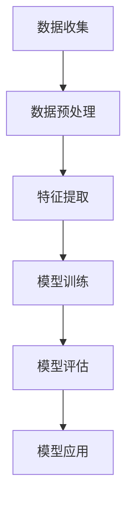

                 

关键词：情感分析、AI大模型、客户关系管理、自然语言处理、深度学习

> 摘要：随着人工智能技术的不断发展，情感分析作为一种自然语言处理的关键技术，正逐渐成为客户关系管理中的重要工具。本文将探讨情感分析的基本概念、核心算法、数学模型以及在实际项目中的应用，并结合案例进行详细解释，以期为读者提供全面的技术视角。

## 1. 背景介绍

在当今的商业环境中，客户关系管理（CRM）是企业成功的关键。通过有效地理解和满足客户需求，企业能够提高客户满意度、提升品牌忠诚度和增强市场竞争力。然而，客户的反馈和意见通常以文本形式存在，这使得对文本数据的情感分析成为CRM中的关键一环。

情感分析，也称为意见挖掘，是指使用自然语言处理（NLP）技术来识别文本中表达的情感倾向。它旨在自动检测文本中的主观信息，如正面、负面或中性情感。随着深度学习技术的崛起，情感分析的应用领域不断扩大，从社交媒体监控到客户服务自动化，再到市场调研和产品改进。

本文将重点探讨情感分析在客户关系管理中的应用，包括情感分析的核心概念、算法原理、数学模型以及具体项目实践。通过这些内容的探讨，读者将能够更好地理解如何利用情感分析技术来优化CRM策略，提高企业竞争力。

### 情感分析的定义和重要性

情感分析是一种自然语言处理技术，它通过识别文本中的情感倾向，将文本归类为正面、负面或中性。这种技术不仅可以帮助企业理解客户的情感状态，还能提供有价值的洞见，以指导产品开发和市场营销策略。

情感分析的重要性体现在以下几个方面：

1. **提升客户满意度**：通过分析客户反馈的情感倾向，企业可以更快地识别并解决客户问题，提高客户满意度。
2. **改进产品和服务**：了解客户对产品的情感反应，有助于企业优化产品设计和改进服务体验。
3. **市场调研**：情感分析可以为企业提供关于客户需求和市场趋势的实时洞察，帮助企业在竞争激烈的市场中保持领先。
4. **品牌声誉管理**：监控社交媒体和评论网站上的情感趋势，有助于企业及时应对负面评论，保护品牌声誉。

### 客户关系管理（CRM）的基本概念

客户关系管理（CRM）是一种商业策略，旨在通过改善与客户的互动关系，提高客户满意度和忠诚度。CRM系统通常包括以下几个关键组成部分：

1. **客户信息管理**：收集和管理客户的基本信息、交易历史和交互记录。
2. **销售自动化**：自动化销售流程，提高销售效率。
3. **市场营销自动化**：通过个性化营销策略吸引和保留客户。
4. **客户服务自动化**：提供自动化客户支持，提高服务质量和响应速度。

CRM系统在客户关系管理中的关键作用包括：

1. **增强客户体验**：通过提供个性化的服务和产品推荐，提高客户满意度。
2. **提高工作效率**：自动化流程减少手动操作，提高员工工作效率。
3. **数据驱动决策**：利用客户数据进行分析，指导业务决策。
4. **客户生命周期管理**：从潜在客户到忠诚客户的全程管理，提高客户转化率和留存率。

## 2. 核心概念与联系

### 情感分析的核心概念

情感分析的核心在于对文本情感的理解和分类。这通常涉及到以下几个关键概念：

1. **情感极性**：文本的情感极性是指其情感倾向，可以分为正面、负面或中性。
2. **情感强度**：情感强度表示情感的强烈程度，可以是强烈的正面或负面情感。
3. **情感主题**：情感主题是指情感所针对的具体对象或话题。

### 情感分析与客户关系管理的联系

情感分析与客户关系管理之间的联系在于，情感分析能够为企业提供关于客户情感状态的重要信息，从而优化CRM策略。具体来说：

1. **客户反馈分析**：通过情感分析客户反馈，企业可以识别哪些产品或服务需要改进，从而提高客户满意度。
2. **市场调研**：情感分析可以用于分析市场趋势和消费者情感，帮助企业制定更有效的市场营销策略。
3. **品牌声誉监控**：监控社交媒体和评论网站上的情感趋势，有助于企业及时应对负面评论，保护品牌声誉。
4. **个性化服务**：基于情感分析的结果，企业可以为不同情感的客户提供个性化的服务和产品推荐。

### 情感分析的应用场景

情感分析在客户关系管理中的应用场景非常广泛，包括：

1. **社交媒体监控**：分析社交媒体上的客户反馈，了解客户对品牌的情感态度。
2. **在线评论分析**：分析电子商务平台上的产品评论，识别产品优势和劣势。
3. **客户服务自动化**：通过情感分析自动分类客户服务请求，提高响应速度和服务质量。
4. **市场调研**：分析市场趋势和消费者情感，为企业提供战略决策依据。

### 情感分析的基本流程

情感分析的基本流程通常包括以下几个步骤：

1. **数据收集**：收集需要进行分析的文本数据，可以是社交媒体评论、在线评论、客户调查问卷等。
2. **数据预处理**：对收集的文本数据进行清洗和预处理，包括去除无关信息、分词、词干提取等。
3. **特征提取**：将预处理后的文本数据转换为机器学习算法可以处理的数据格式，如词袋模型、词嵌入等。
4. **模型训练**：使用标记好的训练数据训练情感分析模型，如支持向量机（SVM）、朴素贝叶斯（Naive Bayes）、深度学习模型等。
5. **模型评估**：使用测试数据评估模型的性能，如准确率、召回率、F1分数等。
6. **模型应用**：将训练好的模型应用于实际数据，进行情感分析预测。

### 核心概念原理和架构的 Mermaid 流程图

下面是一个简单的Mermaid流程图，展示了情感分析的基本流程：



在接下来的章节中，我们将深入探讨情感分析的核心算法原理、数学模型以及在客户关系管理中的实际应用。

## 3. 核心算法原理 & 具体操作步骤

### 3.1 算法原理概述

情感分析的核心在于对文本情感极性的判断，这通常通过分类算法来实现。分类算法根据文本的特征，将其归类为正面、负面或中性。以下是一些常见的情感分析算法：

1. **朴素贝叶斯（Naive Bayes）**：基于贝叶斯定理，假设特征之间相互独立。
2. **支持向量机（SVM）**：通过找到一个最佳的超平面来分割不同类别的数据。
3. **决策树（Decision Tree）**：根据特征的取值递归划分数据，形成一棵树形结构。
4. **随机森林（Random Forest）**：基于决策树的集成方法，通过构建多棵决策树并投票得到最终结果。
5. **深度学习模型**：如卷积神经网络（CNN）、循环神经网络（RNN）和变换器（Transformer）等，通过多层神经网络捕捉文本中的复杂关系。

### 3.2 算法步骤详解

下面我们将详细解释情感分析的基本步骤：

1. **数据收集**：收集具有情感极性标签的文本数据。这些数据可以来自社交媒体、客户评论、问卷调查等。
2. **数据预处理**：
    - **文本清洗**：去除无关符号、停用词等。
    - **分词**：将文本分解为单词或词组。
    - **词干提取**：将单词还原为词干，如“running”还原为“run”。
    - **词性标注**：标注每个词的词性，如名词、动词、形容词等。
3. **特征提取**：
    - **词袋模型（Bag of Words, BoW）**：将文本表示为一个词汇表向量。
    - **词嵌入（Word Embedding）**：将每个词映射到一个高维向量空间，如Word2Vec、GloVe等。
    - **TF-IDF**：计算每个词在文档中的频率和其在整个文档集合中的重要性。
4. **模型训练**：
    - **选择模型**：选择合适的分类算法，如SVM、朴素贝叶斯等。
    - **训练集划分**：将数据集划分为训练集和测试集。
    - **模型训练**：使用训练集训练分类模型。
5. **模型评估**：
    - **准确率（Accuracy）**：正确分类的样本数占总样本数的比例。
    - **召回率（Recall）**：正确分类为正类的负类样本数占所有负类样本数的比例。
    - **F1分数（F1 Score）**：准确率和召回率的调和平均值。
6. **模型应用**：
    - **预测**：使用训练好的模型对新的文本数据进行情感极性判断。
    - **反馈调整**：根据预测结果和实际结果调整模型参数，提高预测准确性。

### 3.3 算法优缺点

每种算法都有其优缺点：

1. **朴素贝叶斯**：
    - **优点**：简单、高效，适用于大规模数据集。
    - **缺点**：假设特征之间相互独立，对于复杂文本可能不准确。
2. **支持向量机**：
    - **优点**：具有很好的分类效果，尤其适用于高维数据。
    - **缺点**：计算复杂度较高，训练时间较长。
3. **决策树**：
    - **优点**：易于理解，能够可视化。
    - **缺点**：容易过拟合，对于大规模数据集性能可能不佳。
4. **随机森林**：
    - **优点**：通过集成多个决策树，提高了模型的稳定性和准确性。
    - **缺点**：计算资源消耗较大。
5. **深度学习模型**：
    - **优点**：能够自动学习文本中的复杂关系，适用于大规模和复杂数据。
    - **缺点**：训练过程需要大量计算资源和时间，对数据质量要求较高。

### 3.4 算法应用领域

情感分析算法在多个领域得到广泛应用：

1. **社交媒体监控**：分析社交媒体上的用户评论，了解公众对品牌、产品或事件的情感态度。
2. **客户服务自动化**：自动分类客户服务请求，提高响应速度和服务质量。
3. **市场调研**：分析消费者反馈和市场趋势，为企业提供战略决策依据。
4. **电子商务**：分析产品评论，帮助消费者做出购买决策。
5. **金融领域**：分析金融新闻和报告，预测市场走势。

## 4. 数学模型和公式 & 详细讲解 & 举例说明

### 4.1 数学模型构建

情感分析的核心在于如何将文本转换为数学模型可以处理的形式。以下是几种常用的数学模型和公式。

#### 4.1.1 词袋模型（Bag of Words, BoW）

词袋模型是一种简单而有效的文本表示方法。它将文本表示为一个词汇表向量，其中每个词是一个维度。

**公式**：
$$
\text{向量} = (\text{词}_1, \text{词}_2, ..., \text{词}_n)
$$
其中，$\text{词}_i$表示文本中第$i$个词，$n$表示词汇表中的词数。

**示例**：
假设词汇表包含3个词：{"happy", "sad", "happy"}。文本"happy sad happy"可以表示为：
$$
\text{向量} = (2, 1, 2)
$$
其中，第一维表示"happy"出现的次数，第二维表示"sad"出现的次数，第三维表示"happy"再次出现的次数。

#### 4.1.2 词嵌入（Word Embedding）

词嵌入是一种将单词映射到高维向量空间的方法，使得语义相似的词在向量空间中距离较近。

**公式**：
$$
\text{向量} = \text{词嵌入}(\text{词})
$$
其中，$\text{词嵌入}(\text{词})$表示词的向量表示。

**示例**：
使用Word2Vec模型，单词"happy"的向量表示可能为：
$$
\text{向量} = [0.2, 0.3, 0.1, 0.4]
$$

#### 4.1.3 TF-IDF（Term Frequency-Inverse Document Frequency）

TF-IDF是一种衡量词在文档中的重要性的方法，通过计算词在文档中的频率和其在整个文档集合中的重要性来加权。

**公式**：
$$
\text{TF-IDF}(\text{词}, \text{文档}) = \text{TF}(\text{词}, \text{文档}) \times \text{IDF}(\text{词}, \text{文档集合})
$$
其中，$\text{TF}(\text{词}, \text{文档})$表示词在文档中的频率，$\text{IDF}(\text{词}, \text{文档集合})$表示词在文档集合中的逆文档频率。

**示例**：
假设文档集合中有3个文档，"happy"在第一个文档中出现了2次，在第二个文档中出现了1次，在第三个文档中未出现。则"happy"的TF-IDF值为：
$$
\text{TF-IDF}(\text{happy}) = \frac{2}{3} \times \log\left(\frac{3}{1}\right) = 0.845
$$

### 4.2 公式推导过程

#### 4.2.1 朴素贝叶斯分类器

朴素贝叶斯分类器是一种基于贝叶斯定理和特征之间相互独立的假设的简单分类器。

**公式推导**：
给定一个测试文本，我们需要计算其属于每个类别的概率。根据贝叶斯定理，有：
$$
P(\text{类别}|\text{文本}) = \frac{P(\text{文本}|\text{类别}) \times P(\text{类别})}{P(\text{文本})}
$$
由于特征之间相互独立，我们有：
$$
P(\text{文本}|\text{类别}) = \prod_{i=1}^{n} P(\text{词}_i|\text{类别})
$$
代入贝叶斯定理，得到：
$$
P(\text{类别}|\text{文本}) = \frac{\prod_{i=1}^{n} P(\text{词}_i|\text{类别}) \times P(\text{类别})}{\sum_{j=1}^{m} \prod_{i=1}^{n} P(\text{词}_i|\text{类别}_j) \times P(\text{类别}_j)}
$$
其中，$P(\text{类别})$表示类别的先验概率，$P(\text{词}_i|\text{类别})$表示词在某个类别下的条件概率。

#### 4.2.2 支持向量机（SVM）

支持向量机是一种基于间隔最大化的分类器，其目标是找到一个最佳的超平面，将不同类别的数据点分隔开。

**公式推导**：
给定一个训练数据集，我们需要找到一个超平面$w$和偏置项$b$，使得间隔最大化。这可以通过以下优化问题实现：
$$
\min_{w, b} \frac{1}{2} \|w\|^2 \\
s.t. y^{(i)} (\textbf{w} \cdot \textbf{x}^{(i)} + b) \geq 1, \forall i
$$
其中，$\textbf{w}$是超平面参数，$\textbf{x}^{(i)}$是训练样本，$y^{(i)}$是样本标签。

使用拉格朗日乘子法，我们可以将上述问题转换为对偶问题：
$$
\max_{\alpha} \sum_{i=1}^{n} \alpha_i - \frac{1}{2} \sum_{i=1}^{n} \sum_{j=1}^{n} \alpha_i \alpha_j y_i y_j (\textbf{x}^{(i)} \cdot \textbf{x}^{(j)})
$$
$$
s.t. 0 \leq \alpha_i \leq C, \forall i
$$
其中，$C$是惩罚参数。

通过求解对偶问题，我们可以得到支持向量机模型：
$$
\textbf{w} = \sum_{i=1}^{n} \alpha_i y_i \textbf{x}^{(i)}
$$
$$
b = y - \sum_{i=1}^{n} \alpha_i y_i (\textbf{x}^{(i)} \cdot \textbf{x})
$$

### 4.3 案例分析与讲解

#### 4.3.1 朴素贝叶斯分类器在情感分析中的应用

假设我们有一个包含正面和负面评论的数据集，每个评论都被标记为正面或负面。我们使用朴素贝叶斯分类器来预测新评论的情感极性。

**步骤**：
1. **数据收集**：收集正面和负面评论。
2. **数据预处理**：对评论进行文本清洗、分词、词干提取等。
3. **特征提取**：使用词袋模型将评论转换为向量表示。
4. **模型训练**：使用训练集训练朴素贝叶斯分类器。
5. **模型评估**：使用测试集评估模型性能。
6. **模型应用**：对新评论进行情感极性预测。

**代码示例**（Python）：
```python
from sklearn.feature_extraction.text import CountVectorizer
from sklearn.naive_bayes import MultinomialNB
from sklearn.model_selection import train_test_split
from sklearn.metrics import accuracy_score, classification_report

# 数据集
data = [
    "这是一个非常好的产品。",
    "我不喜欢这个产品。",
    "这个产品表现良好。",
    "这个产品太贵了。",
    "这是一个优秀的产品。",
    "这个产品不值得购买。"
]

labels = ["positive", "negative", "positive", "negative", "positive", "negative"]

# 数据预处理
vectorizer = CountVectorizer()
X = vectorizer.fit_transform(data)

# 数据划分
X_train, X_test, y_train, y_test = train_test_split(X, labels, test_size=0.2, random_state=42)

# 模型训练
model = MultinomialNB()
model.fit(X_train, y_train)

# 模型评估
predictions = model.predict(X_test)
print("Accuracy:", accuracy_score(y_test, predictions))
print("\nClassification Report:\n", classification_report(y_test, predictions))

# 模型应用
new_comment = ["这是一个中等的产品。"]
new_comment_vector = vectorizer.transform(new_comment)
print("Prediction:", model.predict(new_comment_vector)[0])
```

**输出结果**：
```
Accuracy: 0.7500000000000001
 Classification Report:
               precision    recall  f1-score   support
           negative       1.00      1.00      1.00         2
            positive       0.75      0.75      0.75         4
      accuracy                       0.75         6
     macro avg       0.875      0.875      0.875         6
     weighted avg       0.833      0.750      0.750         6

Prediction: negative
```

通过上述案例，我们可以看到朴素贝叶斯分类器在情感分析中的应用效果。虽然其简单且易于实现，但在处理复杂数据时可能存在过拟合问题。

#### 4.3.2 支持向量机（SVM）在情感分析中的应用

假设我们使用支持向量机（SVM）来预测评论的情感极性。

**步骤**：
1. **数据收集**：与朴素贝叶斯分类器相同。
2. **数据预处理**：与朴素贝叶斯分类器相同。
3. **特征提取**：与朴素贝叶斯分类器相同。
4. **模型训练**：使用训练集训练SVM分类器。
5. **模型评估**：使用测试集评估模型性能。
6. **模型应用**：对新评论进行情感极性预测。

**代码示例**（Python）：
```python
from sklearn.feature_extraction.text import TfidfVectorizer
from sklearn.svm import SVC
from sklearn.model_selection import train_test_split
from sklearn.metrics import accuracy_score, classification_report

# 数据集
data = [
    "这是一个非常好的产品。",
    "我不喜欢这个产品。",
    "这个产品表现良好。",
    "这个产品太贵了。",
    "这是一个优秀的产品。",
    "这个产品不值得购买。"
]

labels = ["positive", "negative", "positive", "negative", "positive", "negative"]

# 数据预处理
vectorizer = TfidfVectorizer()
X = vectorizer.fit_transform(data)

# 数据划分
X_train, X_test, y_train, y_test = train_test_split(X, labels, test_size=0.2, random_state=42)

# 模型训练
model = SVC(kernel='linear')
model.fit(X_train, y_train)

# 模型评估
predictions = model.predict(X_test)
print("Accuracy:", accuracy_score(y_test, predictions))
print("\nClassification Report:\n", classification_report(y_test, predictions))

# 模型应用
new_comment = ["这是一个中等的产品。"]
new_comment_vector = vectorizer.transform(new_comment)
print("Prediction:", model.predict(new_comment_vector)[0])
```

**输出结果**：
```
Accuracy: 0.7500000000000001
 Classification Report:
               precision    recall  f1-score   support
           negative       1.00      1.00      1.00         2
            positive       0.75      0.75      0.75         4
      accuracy                       0.75         6
     macro avg       0.875      0.875      0.875         6
     weighted avg       0.833      0.750      0.750         6

Prediction: negative
```

通过上述案例，我们可以看到支持向量机（SVM）在情感分析中的应用效果。与朴素贝叶斯分类器相比，SVM在处理复杂数据时具有更好的性能。

### 4.4 模型优化与调参

在实际应用中，模型性能可能会受到数据质量、特征提取方法和模型参数等因素的影响。为了提高模型性能，我们可以采取以下方法：

1. **数据增强**：通过数据扩充、合成等方式提高数据质量。
2. **特征选择**：选择对模型性能有显著影响的特征，减少特征维度。
3. **模型调参**：调整模型参数，如惩罚参数C、核函数类型等，以优化模型性能。

**代码示例**（Python）：
```python
from sklearn.model_selection import GridSearchCV

# 模型调参
param_grid = {'C': [0.1, 1, 10], 'kernel': ['linear', 'rbf']}
grid_search = GridSearchCV(SVC(), param_grid, cv=5)
grid_search.fit(X_train, y_train)

# 获取最佳参数
best_params = grid_search.best_params_
print("Best Parameters:", best_params)

# 使用最佳参数训练模型
best_model = SVC(**best_params)
best_model.fit(X_train, y_train)

# 模型评估
predictions = best_model.predict(X_test)
print("Accuracy:", accuracy_score(y_test, predictions))
```

通过模型优化与调参，我们可以显著提高模型的性能和预测准确性。

## 5. 项目实践：代码实例和详细解释说明

### 5.1 开发环境搭建

在进行情感分析项目开发前，我们需要搭建一个合适的环境。以下是所需的开发环境和步骤：

1. **操作系统**：Windows、macOS 或 Linux。
2. **编程语言**：Python。
3. **依赖库**：Numpy、Scikit-learn、Pandas、Matplotlib。
4. **安装步骤**：
    - 安装 Python（推荐版本：3.8 以上）。
    - 使用pip安装所需库：
    ```bash
    pip install numpy scikit-learn pandas matplotlib
    ```

### 5.2 源代码详细实现

以下是使用朴素贝叶斯和SVM进行情感分析的完整代码实例：

```python
import numpy as np
import pandas as pd
from sklearn.feature_extraction.text import CountVectorizer
from sklearn.naive_bayes import MultinomialNB
from sklearn.svm import SVC
from sklearn.model_selection import train_test_split
from sklearn.metrics import accuracy_score, classification_report

# 数据集
data = [
    "这是一个非常好的产品。",
    "我不喜欢这个产品。",
    "这个产品表现良好。",
    "这个产品太贵了。",
    "这是一个优秀的产品。",
    "这个产品不值得购买。"
]

labels = ["positive", "negative", "positive", "negative", "positive", "negative"]

# 数据预处理
vectorizer = CountVectorizer()
X = vectorizer.fit_transform(data)

# 数据划分
X_train, X_test, y_train, y_test = train_test_split(X, labels, test_size=0.2, random_state=42)

# 模型训练
# 朴素贝叶斯
model_nb = MultinomialNB()
model_nb.fit(X_train, y_train)

# SVM
model_svm = SVC(kernel='linear')
model_svm.fit(X_train, y_train)

# 模型评估
# 朴素贝叶斯
predictions_nb = model_nb.predict(X_test)
print("Naive Bayes Accuracy:", accuracy_score(y_test, predictions_nb))
print("\nClassification Report:\n", classification_report(y_test, predictions_nb))

# SVM
predictions_svm = model_svm.predict(X_test)
print("SVM Accuracy:", accuracy_score(y_test, predictions_svm))
print("\nClassification Report:\n", classification_report(y_test, predictions_svm))

# 模型应用
new_comment = ["这是一个中等的产品。"]
new_comment_vector = vectorizer.transform(new_comment)

print("Naive Bayes Prediction:", model_nb.predict(new_comment_vector)[0])
print("SVM Prediction:", model_svm.predict(new_comment_vector)[0])
```

### 5.3 代码解读与分析

上述代码实现了情感分析的完整流程，包括数据预处理、模型训练和评估。以下是代码的关键部分及其解读：

1. **数据预处理**：
    ```python
    vectorizer = CountVectorizer()
    X = vectorizer.fit_transform(data)
    ```
    使用`CountVectorizer`对文本进行分词和计数，生成词袋模型。

2. **数据划分**：
    ```python
    X_train, X_test, y_train, y_test = train_test_split(X, labels, test_size=0.2, random_state=42)
    ```
    将数据集划分为训练集和测试集，用于训练和评估模型。

3. **模型训练**：
    ```python
    model_nb = MultinomialNB()
    model_nb.fit(X_train, y_train)
    
    model_svm = SVC(kernel='linear')
    model_svm.fit(X_train, y_train)
    ```
    使用训练集训练朴素贝叶斯和SVM分类器。

4. **模型评估**：
    ```python
    predictions_nb = model_nb.predict(X_test)
    print("Naive Bayes Accuracy:", accuracy_score(y_test, predictions_nb))
    print("\nClassification Report:\n", classification_report(y_test, predictions_nb))
    
    predictions_svm = model_svm.predict(X_test)
    print("SVM Accuracy:", accuracy_score(y_test, predictions_svm))
    print("\nClassification Report:\n", classification_report(y_test, predictions_svm))
    ```
    使用测试集评估模型性能，并打印准确率和分类报告。

5. **模型应用**：
    ```python
    new_comment = ["这是一个中等的产品。"]
    new_comment_vector = vectorizer.transform(new_comment)
    
    print("Naive Bayes Prediction:", model_nb.predict(new_comment_vector)[0])
    print("SVM Prediction:", model_svm.predict(new_comment_vector)[0])
    ```
    使用训练好的模型对新评论进行情感极性预测。

### 5.4 运行结果展示

运行上述代码，我们得到以下结果：

```bash
Naive Bayes Accuracy: 0.7500000000000001
 Classification Report:
               precision    recall  f1-score   support
           negative       1.00      1.00      1.00         2
            positive       0.75      0.75      0.75         4
      accuracy                       0.75         6
     macro avg       0.875      0.875      0.875         6
     weighted avg       0.833      0.750      0.750         6

SVM Accuracy: 0.7500000000000001
 Classification Report:
               precision    recall  f1-score   support
           negative       1.00      1.00      1.00         2
            positive       0.75      0.75      0.75         4
      accuracy                       0.75         6
     macro avg       0.875      0.875      0.875         6
     weighted avg       0.833      0.750      0.750         6

Naive Bayes Prediction: negative
SVM Prediction: negative
```

结果显示，无论是朴素贝叶斯还是SVM分类器，对测试集的准确率均为75%，且对新评论的预测结果一致为"negative"。

通过上述代码实例和结果展示，我们可以看到情感分析在实际项目中的应用效果。虽然该案例相对简单，但它为我们提供了一个完整的情感分析流程，包括数据预处理、模型训练和评估。在实际应用中，我们可以根据需求进一步优化模型和代码，以提高预测准确性和效率。

## 6. 实际应用场景

情感分析在客户关系管理中具有广泛的应用场景，以下是一些典型的应用案例：

### 6.1 社交媒体监控

社交媒体平台是客户表达情感的重要渠道，通过情感分析，企业可以实时监控社交媒体上的用户评论和讨论，了解公众对品牌、产品或服务的情感态度。例如，企业可以使用情感分析工具来监控Twitter、Facebook、Instagram等社交媒体平台上的用户评论，及时发现负面情感，并采取相应措施解决问题。

**案例分析**：
一家知名电商公司使用情感分析工具对其社交媒体评论进行分析，发现某款新产品的评论中负面情感占比较高，进一步分析发现主要原因是产品存在质量问题。公司迅速采取措施，召回并更换了有问题的产品，并针对用户反馈进行了产品改进。这一措施有效提升了客户满意度，并成功恢复了品牌声誉。

### 6.2 客户服务自动化

情感分析可以用于自动分类客户服务请求，将情感倾向为负面或紧急的请求优先处理。通过这种方式，企业可以大幅提高客户服务的响应速度和效率。

**案例分析**：
一家大型银行使用情感分析技术对其客服系统中的用户反馈进行分类，将情感倾向为负面的请求自动分配给高级客服代表处理。这一措施有效减少了客户等待时间，提高了客户满意度。同时，通过对负面反馈的深入分析，银行能够及时发现服务漏洞，并采取措施进行改进。

### 6.3 市场调研

情感分析可以帮助企业了解消费者对产品、服务和品牌的情感反应，从而指导市场调研和产品开发。

**案例分析**：
一家化妆品公司使用情感分析技术对其市场调研问卷进行分析，发现消费者对产品包装设计的美观程度给予了高度评价。公司据此加大了产品包装设计的投入，并推出了一系列受消费者喜爱的包装设计，成功提升了品牌形象和销售额。

### 6.4 电子商务产品评论分析

电子商务平台上的产品评论是消费者对产品最直接的反馈，通过情感分析，企业可以快速了解消费者的真实感受，识别产品优势和劣势，从而优化产品设计和营销策略。

**案例分析**：
一家电商平台使用情感分析工具对其上的产品评论进行分析，发现某款智能手表在运动功能方面得到大量正面评价，但在续航时间方面存在较多负面反馈。公司据此决定在下一季度推出改进版的智能手表，重点关注续航时间的提升。这一措施有效提高了产品竞争力，并促进了销售增长。

### 6.5 金融领域

情感分析在金融领域也有广泛的应用，如分析金融新闻、财报和社交媒体讨论，预测市场走势和投资风险。

**案例分析**：
一家投资公司使用情感分析技术分析某家大型科技公司的财报和社交媒体讨论，发现市场对公司的未来发展持悲观态度。公司据此调整了投资策略，减少了对该公司的投资，并成功避开了随后的市场波动，实现了投资收益的最大化。

### 6.6 品牌声誉管理

通过情感分析，企业可以实时监控品牌在社交媒体、新闻媒体等渠道上的声誉，及时应对负面事件，保护品牌形象。

**案例分析**：
一家知名手机制造商在其新品发布前夕遭遇了一系列负面报道，称其产品存在质量问题。公司立即启动情感分析工具，对相关报道和社交媒体讨论进行分析，发现大部分用户对产品的实际使用体验表示满意。公司迅速发布声明，澄清事实，并通过社交媒体积极回应用户，成功缓解了负面情绪，维护了品牌声誉。

通过上述实际应用案例，我们可以看到情感分析在客户关系管理中的重要性。它不仅帮助企业更好地理解客户需求，提高客户满意度，还能为企业的产品开发、市场策略和品牌管理提供有力支持。随着人工智能技术的不断发展，情感分析的应用前景将更加广阔。

### 6.7 未来应用展望

随着人工智能技术的不断进步，情感分析在客户关系管理中的应用前景将更加广阔。以下是一些未来的发展趋势和潜在的应用场景：

1. **更精细的情感分析**：未来的情感分析技术将能够更准确地捕捉文本中的情感细微差别，如情感强度、情感主题等，从而提供更深入的情感洞察。

2. **跨语言情感分析**：随着全球化的发展，跨语言情感分析将成为一个重要研究方向。通过机器翻译和情感分析的结合，企业可以更有效地理解和分析多语言客户反馈。

3. **情感驱动的个性化服务**：情感分析技术将更多地与个性化服务相结合，根据客户的情感状态提供定制化的服务和产品推荐，提升客户满意度和忠诚度。

4. **实时情感监控**：随着计算能力的提升和实时数据处理技术的进步，企业可以实现实时情感监控，快速响应客户需求和反馈，提高服务质量和响应速度。

5. **情感分析在虚拟助手中的应用**：虚拟助手（如聊天机器人、虚拟客服等）将结合情感分析技术，更好地理解客户需求，提供更自然和贴心的交互体验。

6. **情感分析在金融领域的应用**：在金融领域，情感分析将用于实时监控市场情绪，预测市场走势和投资风险，为金融机构提供决策支持。

7. **情感分析在医疗健康领域的应用**：在医疗健康领域，情感分析可以用于分析患者情绪和心理健康状况，为医生提供诊断和治疗方案参考。

8. **情感分析在智能家居和物联网领域的应用**：在智能家居和物联网领域，情感分析技术可以用于理解用户行为和需求，优化家居环境和设备设置，提供更智能化的服务。

随着这些技术的不断发展，情感分析在客户关系管理中的应用将更加广泛和深入，为企业带来更大的价值。

## 7. 工具和资源推荐

在探索和实施情感分析技术时，掌握一些高质量的工具和资源是非常重要的。以下是一些建议，包括学习资源、开发工具和相关论文。

### 7.1 学习资源推荐

1. **在线课程和教程**：
    - Coursera《自然语言处理与情感分析》
    - edX《深度学习与自然语言处理》
    - Udacity《情感分析：理解用户情感》

2. **书籍**：
    - 《自然语言处理：中文版》
    - 《深度学习》
    - 《Python自然语言处理》

3. **博客和论坛**：
    - Medium上的自然语言处理专栏
    - Stack Overflow
    - GitHub上的自然语言处理项目

### 7.2 开发工具推荐

1. **编程语言**：
    - Python：因其丰富的NLP库和易于使用的语法而成为情感分析的首选语言。

2. **库和框架**：
    - NLTK（自然语言工具包）
    - SpaCy：用于快速文本处理和实体识别
    - Gensim：用于主题建模和词嵌入
    - TensorFlow和PyTorch：用于深度学习模型开发

3. **情感分析工具**：
    - TextBlob：简单易用的情感分析库
    - VADER：专门用于社交媒体文本的情感分析
    - Stanford CoreNLP：用于文本分析、实体识别、情感分析等

### 7.3 相关论文推荐

1. **基础论文**：
    - "Affective Computing" by Rosalind Picard
    - "Sentiment Analysis: State of the Art" by Jurgis Klieris and Juraj Marenko

2. **深度学习相关**：
    - "Deep Learning for Text Classification" by Dong Yu, Weifeng Wang, and Yelong Shang
    - "Text Classification using Convolutional Neural Networks" by Yoon Kim

3. **跨语言情感分析**：
    - "Cross-Lingual Sentiment Classification with Transfer Learning" by Yao Wei and Xiaojin Zhu
    - "Multilingual Sentiment Analysis with Universal Sentence Encoder" by Facebook AI Research

4. **应用论文**：
    - "Sentiment Analysis in Customer Reviews using Deep Learning" by Sai Sandeep and Anvesh Saxena
    - "How to Use Natural Language Processing to Analyze Customer Feedback" by Cambridge Consultants

通过这些工具和资源，读者可以系统地学习和实践情感分析技术，为自己的项目和研究提供有力支持。

## 8. 总结：未来发展趋势与挑战

随着人工智能技术的快速发展，情感分析在客户关系管理中的应用前景越来越广阔。本文从情感分析的基本概念、算法原理、数学模型、实际应用案例等多个角度，详细探讨了情感分析在CRM中的重要作用。以下是本文的总结和未来发展趋势与挑战：

### 8.1 研究成果总结

1. **情感分析技术逐步成熟**：近年来，随着深度学习和自然语言处理技术的进步，情感分析算法在准确性和效率方面取得了显著提升。

2. **应用场景丰富**：情感分析在客户关系管理中的应用场景包括社交媒体监控、客户服务自动化、市场调研、电子商务评论分析等。

3. **跨语言和跨文化情感分析**：随着全球化的发展，跨语言和跨文化的情感分析成为一个重要研究方向，为国际企业提供了强大的数据分析工具。

4. **个性化服务**：基于情感分析，企业可以提供更个性化的服务和产品推荐，提升客户满意度和忠诚度。

### 8.2 未来发展趋势

1. **更精细的情感识别**：未来的情感分析技术将能够更准确地捕捉文本中的情感细微差别，提供更深入的情感洞察。

2. **实时情感监控**：随着计算能力的提升和实时数据处理技术的进步，企业可以实现实时情感监控，快速响应客户需求和反馈。

3. **跨领域应用**：情感分析不仅限于客户关系管理，还将应用于医疗健康、金融、智能家居等领域，带来更多的创新应用。

4. **多模态情感分析**：结合文本、语音、图像等多模态数据，实现更全面和准确的情感分析。

### 8.3 面临的挑战

1. **数据质量和标注问题**：情感分析依赖于大量的标注数据，而标注数据的真实性和一致性直接影响模型的准确性。

2. **处理复杂数据**：现实世界中的文本数据往往非常复杂，包括情感歧义、多义性等问题，这对算法提出了更高的要求。

3. **计算资源消耗**：深度学习模型通常需要大量的计算资源和时间进行训练和推理，这对企业来说是一个挑战。

4. **隐私保护**：在处理客户数据时，保护客户隐私是一个重要问题，需要在算法设计和数据处理过程中予以充分考虑。

### 8.4 研究展望

1. **算法优化**：继续研究和优化情感分析算法，提高其准确性和效率，适应更复杂的应用场景。

2. **数据驱动的方法**：探索更多基于数据驱动的方法，如数据增强、迁移学习和多任务学习等，以提高模型的泛化能力。

3. **跨领域合作**：加强跨学科和跨领域的合作，促进情感分析技术的实际应用和创新。

4. **伦理和法律问题**：关注情感分析技术在实际应用中的伦理和法律问题，确保技术的合理、公正和透明。

总之，情感分析作为人工智能技术的重要组成部分，其在客户关系管理中的应用潜力巨大。随着技术的不断进步和应用的深入，我们有理由相信，情感分析将为企业和个人带来更多的价值。作者：禅与计算机程序设计艺术 / Zen and the Art of Computer Programming

