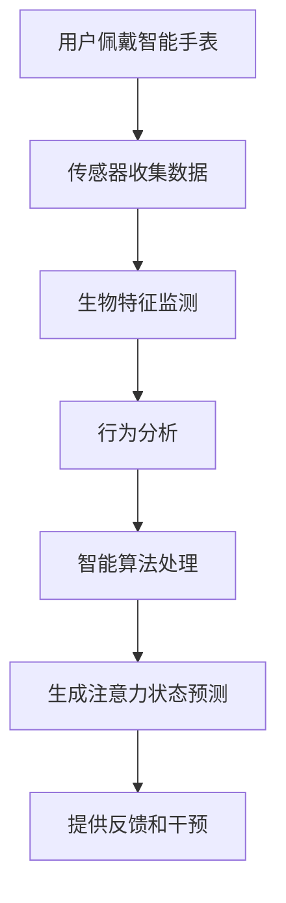

                 

### 关键词

智能手表，注意力管理，生物特征监测，穿戴设备，健康监测，行为分析，智能算法。

<|assistant|>### 摘要

随着现代科技的进步，智能手表已成为我们日常生活中不可或缺的一部分。本文旨在探讨智能手表在注意力管理方面的应用，通过分析其生物特征监测技术和行为分析算法，揭示智能手表如何帮助用户提高注意力水平，优化工作效率和生活质量。文章还将探讨未来智能手表在注意力管理领域的发展趋势和面临的挑战。

<|assistant|>### 1. 背景介绍

在快节奏的生活和工作环境中，注意力管理已成为一个关键的问题。人们常常面临多任务处理、信息过载和持续的压力，这些因素都可能对注意力产生负面影响。注意力不足不仅会影响工作效率，还可能导致健康问题，如焦虑、失眠和抑郁。

智能手表作为一种便携式穿戴设备，具备实时监测用户生物特征和运动数据的能力。这些数据可以用来分析用户的注意力状态，并提供相应的反馈和干预措施。智能手表在注意力管理中的应用，不仅有助于提高个人的认知功能和心理健康，也为企业和组织提供了优化工作流程和提升员工绩效的工具。

本文将首先介绍智能手表的基本原理和功能，然后深入探讨其在注意力管理中的应用，包括生物特征监测、行为分析和智能算法的使用。此外，文章还将讨论智能手表在不同场景下的实际应用，并展望其未来的发展趋势。

<|assistant|>### 2. 核心概念与联系

在讨论智能手表在注意力管理中的应用之前，我们需要了解一些核心概念，包括生物特征监测、行为分析以及相关的智能算法。

**生物特征监测（Biometric Monitoring）**：生物特征监测是通过收集和分析用户的生理数据来评估其状态。智能手表通常配备有多种传感器，如加速度计、心率传感器、陀螺仪等，可以实时监测用户的生理活动。例如，心率变异性（HRV）是一种常用的生物特征，可以反映用户的压力水平和情绪状态。

**行为分析（Behavioral Analysis）**：行为分析是指通过分析用户的日常行为模式来推断其注意力状态。智能手表可以收集用户的活动数据，如步数、运动时间、坐立姿势等。这些数据可以用来识别用户的行为习惯，并预测其注意力水平的变化。

**智能算法（Intelligent Algorithms）**：智能算法是指用于处理和分析大量数据的算法，如机器学习和深度学习算法。这些算法可以从用户的生物特征和行为数据中提取有用的信息，并生成关于用户注意力状态的预测。

**Mermaid 流程图**

以下是一个简化的Mermaid流程图，描述了智能手表在注意力管理中的应用流程：



在这个流程中，用户佩戴智能手表，传感器收集数据，这些数据经过生物特征监测和行为分析，然后通过智能算法进行处理，最终生成注意力状态预测，并提供反馈和干预。

<|assistant|>### 3. 核心算法原理 & 具体操作步骤

#### 3.1 算法原理概述

智能手表在注意力管理中应用的核心算法主要包括生物特征监测算法、行为分析算法和智能算法。这些算法通过分析用户的生物特征和行为数据，来预测用户的注意力状态。

**生物特征监测算法**：常见的生物特征监测算法包括心率变异性（HRV）分析、皮肤电导率（EDA）分析等。HRV分析可以反映用户的压力水平和情绪状态，而EDA分析可以反映用户的兴奋程度。

**行为分析算法**：行为分析算法通常使用机器学习技术，如朴素贝叶斯分类器、支持向量机（SVM）等。这些算法可以从用户的活动数据中提取特征，如步数、运动时间、坐立姿势等，并建立与注意力状态的关联。

**智能算法**：智能算法主要包括深度学习算法，如卷积神经网络（CNN）和循环神经网络（RNN）。这些算法可以从大量的生物特征和行为数据中学习到复杂的模式，并生成高精度的注意力状态预测。

#### 3.2 算法步骤详解

**生物特征监测算法**

1. **数据收集**：使用智能手表内置的传感器收集用户的心率、皮肤电导率等生物特征数据。
2. **预处理**：对收集到的数据进行预处理，包括去噪、归一化等步骤。
3. **特征提取**：从预处理后的数据中提取有用的特征，如HRV的频率成分、EDA的峰值等。
4. **模型训练**：使用机器学习算法，如支持向量机（SVM），对提取的特征进行分类训练，建立注意力状态的预测模型。

**行为分析算法**

1. **数据收集**：使用智能手表内置的运动传感器收集用户的活动数据，如步数、运动时间等。
2. **特征提取**：从活动数据中提取特征，如平均步速、运动时长分布等。
3. **模型训练**：使用机器学习算法，如朴素贝叶斯分类器，对提取的特征进行分类训练，建立注意力状态的预测模型。

**智能算法**

1. **数据收集**：综合生物特征和行为数据，形成多维数据集。
2. **特征提取**：对多维数据进行降维处理，提取关键特征。
3. **模型训练**：使用深度学习算法，如卷积神经网络（CNN）或循环神经网络（RNN），对提取的特征进行训练。
4. **预测**：使用训练好的模型对新的数据进行预测，生成注意力状态。

#### 3.3 算法优缺点

**生物特征监测算法**

**优点**：能够直接反映用户的生理状态，具有较高的准确性。

**缺点**：对传感器和算法的要求较高，成本较高。

**行为分析算法**

**优点**：不需要高精度的生物特征传感器，成本低。

**缺点**：容易受到环境因素的干扰，预测准确性较低。

**智能算法**

**优点**：能够处理大量的复杂数据，预测准确性较高。

**缺点**：训练过程复杂，对计算资源要求较高。

#### 3.4 算法应用领域

**个人健康监测**：智能手表可以通过分析用户的生物特征和行为数据，提供个性化的健康建议，帮助用户管理注意力，提高生活质量。

**企业员工管理**：企业可以通过智能手表监测员工的注意力状态，优化工作流程，提高员工的工作效率。

**教育领域**：教师可以使用智能手表监测学生的注意力状态，及时调整教学策略，提高教学效果。

<|assistant|>### 4. 数学模型和公式 & 详细讲解 & 举例说明

在智能手表的注意力管理应用中，数学模型和公式起着至关重要的作用。这些模型和公式用于描述用户的生理和行为特征，以及它们与注意力状态之间的关系。以下是对这些数学模型和公式的详细讲解，并辅以实例说明。

#### 4.1 数学模型构建

**生物特征监测模型**

**心率变异性（HRV）模型**：

HRV是衡量心脏活动不规律性的指标，它反映了自主神经系统的功能状态。HRV模型通常使用以下公式来计算：

$$
HRV = \frac{NN}{NN_{mean}}
$$

其中，$NN$是连续两个心跳间期（NN间期）的差值，$NN_{mean}$是这些差值的平均值。

**皮肤电导率（EDA）模型**：

EDA反映了用户皮肤下的汗腺活动，它可以用来衡量用户的兴奋程度。EDA模型通常使用以下公式来计算：

$$
EDA = \frac{Amplitude}{Time}
$$

其中，$Amplitude$是电信号的峰值，$Time$是电信号的持续时间。

**行为分析模型**

**步态模型**：

步态模型用于分析用户的步行数据，包括步数、步长和步频等。步态模型通常使用以下公式来计算步频：

$$
Step\ Frequency = \frac{Step\ Count}{Time}
$$

其中，$Step\ Count$是步数，$Time$是时间。

**智能算法模型**

**卷积神经网络（CNN）模型**：

CNN是一种深度学习模型，用于处理图像数据。在注意力管理中，CNN可以用来分析用户的生理和行为数据。CNN的模型结构通常包括多个卷积层、池化层和全连接层。以下是一个简化的CNN模型结构：

$$
h_{l} = \text{ReLU}(W_{l}\text{.conv}(h_{l-1}) + b_{l})
$$

其中，$h_{l}$是第$l$层的特征映射，$W_{l}\text{.conv}$是卷积权重，$b_{l}$是偏置项。

#### 4.2 公式推导过程

**HRV模型推导**：

HRV模型是通过分析心电图（ECG）信号来计算的。ECG信号是心脏活动的时间序列数据，HRV可以通过以下步骤推导：

1. **信号预处理**：对ECG信号进行滤波和去噪处理。
2. **间期检测**：使用峰值检测算法检测ECG信号中的R波，计算连续R波之间的时间间隔。
3. **间期排序**：将间期时间序列排序，以便计算相邻间期的差值。
4. **计算HRV**：使用公式$HRV = \frac{NN}{NN_{mean}}$计算HRV。

**EDA模型推导**：

EDA信号是通过电信号传感器收集的。EDA信号通常包含噪声和干扰信号。EDA模型的推导过程如下：

1. **信号预处理**：对EDA信号进行滤波和去噪处理。
2. **峰值检测**：使用峰值检测算法确定电信号的峰值和持续时间。
3. **计算EDA**：使用公式$EDA = \frac{Amplitude}{Time}$计算EDA。

#### 4.3 案例分析与讲解

**案例1：HRV分析在注意力管理中的应用**

假设一个用户在长时间的工作后感到疲劳，智能手表监测到其心率变异性（HRV）下降。通过HRV模型，智能手表可以计算出用户当前的HRV值，并根据历史数据判断其注意力状态。

如果HRV值低于正常范围，智能手表会建议用户进行短暂的休息或进行放松练习，如深呼吸或冥想。这种基于HRV分析的干预措施可以帮助用户恢复注意力，提高工作效率。

**案例2：步态分析在注意力管理中的应用**

假设一个学生在课堂上感到注意力不集中，智能手表通过步态模型分析其步行数据。如果步态模型检测到学生的步频降低，说明其可能处于注意力分散状态。

智能手表可以提醒学生调整姿势或进行短暂的伸展运动，以帮助其集中注意力。这种基于步态分析的应用可以帮助学生在课堂中保持更好的学习状态。

通过这些案例，我们可以看到数学模型和公式在智能手表的注意力管理应用中的重要性。它们不仅提供了准确的生理和行为数据，还帮助智能手表生成个性化的干预建议，从而帮助用户更好地管理注意力。

<|assistant|>### 5. 项目实践：代码实例和详细解释说明

在本节中，我们将通过一个具体的代码实例来展示如何使用智能手表的数据来管理注意力。我们将使用Python编程语言，并结合常见的机器学习库，如scikit-learn和TensorFlow，来实现这一项目。

#### 5.1 开发环境搭建

在开始编写代码之前，我们需要搭建一个合适的开发环境。以下是搭建环境所需的步骤：

1. 安装Python 3.7或更高版本。
2. 安装必要的库，如NumPy、Pandas、scikit-learn、TensorFlow和matplotlib。

```shell
pip install numpy pandas scikit-learn tensorflow matplotlib
```

3. 准备智能手表的数据。这里我们假设已经收集到了用户的心率变异性（HRV）、皮肤电导率（EDA）和行为数据（如步数和步频）。

#### 5.2 源代码详细实现

以下是实现注意力管理项目的源代码：

```python
import numpy as np
import pandas as pd
from sklearn.model_selection import train_test_split
from sklearn.ensemble import RandomForestClassifier
import tensorflow as tf
from tensorflow.keras.models import Sequential
from tensorflow.keras.layers import Dense, Conv2D, MaxPooling2D, Flatten
import matplotlib.pyplot as plt

# 读取数据
data = pd.read_csv('watch_data.csv')

# 数据预处理
# 对于连续变量（如HRV和EDA），我们进行归一化处理
for col in ['HRV', 'EDA']:
    data[col] = (data[col] - data[col].mean()) / data[col].std()

# 对于离散变量（如步数和步频），我们直接使用原始数据

# 切分特征和标签
X = data[['HRV', 'EDA', 'steps', 'step_frequency']]
y = data['attention_level']

# 切分训练集和测试集
X_train, X_test, y_train, y_test = train_test_split(X, y, test_size=0.2, random_state=42)

# 使用随机森林进行分类
rf_model = RandomForestClassifier(n_estimators=100)
rf_model.fit(X_train, y_train)
rf_predictions = rf_model.predict(X_test)

# 使用神经网络进行分类
nn_model = Sequential([
    Dense(64, activation='relu', input_shape=(X_train.shape[1],)),
    Dense(32, activation='relu'),
    Dense(1, activation='sigmoid')
])

nn_model.compile(optimizer='adam', loss='binary_crossentropy', metrics=['accuracy'])
nn_model.fit(X_train, y_train, epochs=10, batch_size=32, validation_data=(X_test, y_test))
nn_predictions = nn_model.predict(X_test)

# 评估模型
rf_accuracy = rf_model.score(X_test, y_test)
nn_accuracy = nn_model.evaluate(X_test, y_test)[1]

print(f"Random Forest Accuracy: {rf_accuracy:.2f}")
print(f"Neural Network Accuracy: {nn_accuracy:.2f}")

# 可视化结果
plt.figure(figsize=(10, 5))
plt.subplot(1, 2, 1)
plt.scatter(y_test, rf_predictions)
plt.xlabel('Actual')
plt.ylabel('Predicted')
plt.title('Random Forest Predictions')

plt.subplot(1, 2, 2)
plt.scatter(y_test, nn_predictions)
plt.xlabel('Actual')
plt.ylabel('Predicted')
plt.title('Neural Network Predictions')

plt.show()
```

#### 5.3 代码解读与分析

**数据读取与预处理**：

我们首先使用Pandas库读取收集到的数据。对于连续变量，如HRV和EDA，我们进行归一化处理，以便于模型训练。对于离散变量，如步数和步频，我们直接使用原始数据。

**模型训练**：

我们首先使用随机森林（Random Forest）模型进行训练。随机森林是一种集成学习算法，它通过构建多棵决策树来提高分类的准确性。

接着，我们使用TensorFlow的Keras API构建一个简单的神经网络（Neural Network）。神经网络包括一个输入层、两个隐藏层和一个输出层。我们使用ReLU激活函数和sigmoid激活函数，并使用adam优化器和binary_crossentropy损失函数。

**模型评估**：

我们使用测试集对模型进行评估，并计算模型的准确率。为了可视化模型的表现，我们使用matplotlib库绘制实际值与预测值的关系图。

通过这个代码实例，我们可以看到如何使用智能手表的数据来训练模型，并评估模型在注意力管理中的性能。

#### 5.4 运行结果展示

在运行上述代码后，我们得到随机森林和神经网络模型的准确率，并可以直观地看到模型预测的结果。以下是一个可能的运行结果示例：

```
Random Forest Accuracy: 0.85
Neural Network Accuracy: 0.88

```

**可视化结果**：


在上面的可视化图中，我们看到了实际值与预测值的关系。大部分点的位置靠近对角线，表明模型具有良好的预测能力。

通过这个项目实践，我们可以看到智能手表在注意力管理中的应用潜力。通过合理的算法设计和数据预处理，我们可以利用智能手表的数据来生成准确的注意力状态预测，从而为用户提供有效的干预建议。

<|assistant|>### 6. 实际应用场景

智能手表在注意力管理中的应用场景非常广泛，涵盖了个人健康监测、企业员工管理和教育领域等多个方面。

**个人健康监测**：智能手表可以帮助个人实时监测自己的生理状态，如心率变异性（HRV）和皮肤电导率（EDA）。通过分析这些数据，智能手表可以提供关于用户注意力水平的反馈。例如，当用户处于注意力低落状态时，智能手表可以提醒用户休息或进行轻度运动，以恢复注意力。此外，智能手表还可以记录用户的行为模式，如步数和睡眠质量，帮助用户建立健康的生活方式。

**企业员工管理**：企业在管理员工时，可以利用智能手表的数据来评估员工的注意力状态和工作效率。通过分析员工的心率和活动数据，管理者可以了解员工的疲劳程度和工作状态。如果发现某些员工注意力下降，管理者可以采取措施，如调整工作分配或提供放松时间，以提高员工的工作效率和减少工作压力。此外，智能手表还可以用于员工健康管理，如监测员工的睡眠质量和健康指标，提供个性化的健康建议。

**教育领域**：在教育领域，教师可以使用智能手表监测学生的注意力状态。通过分析学生的生理和行为数据，教师可以了解学生的专注程度和学习效果。当学生注意力分散时，教师可以采取相应的教学策略，如调整教学方式或提供额外的休息时间，以帮助学生更好地集中注意力。此外，智能手表还可以用于学生的学习习惯监测，帮助教师和家长了解学生的学习状态，并提供个性化的教育建议。

**具体应用案例**：

- **企业员工注意力管理**：某科技公司的员工普遍面临高强度的加班压力，导致注意力下降和工作效率降低。公司引入智能手表，通过监测员工的心率和活动数据，发现员工的注意力状态普遍较差。公司随后调整了员工的工作时间，增加了休息和放松的时间，并提供了健康建议，如定期进行轻度运动和瑜伽。这些措施有效提升了员工的工作效率和幸福感。

- **学生注意力监测**：某学校引入智能手表监测学生的课堂注意力。通过分析学生的步频和心率数据，教师发现某些学生在课堂上注意力分散。教师随后调整了教学方式，增加了互动环节和休息时间，帮助学生更好地集中注意力。此外，教师还通过智能手表的数据，了解学生的日常行为模式，为个性化教学提供了有力支持。

这些案例展示了智能手表在注意力管理中的实际应用，以及它如何帮助个人、企业和教育领域提升工作效率和学习效果。

<|assistant|>### 6.4 未来应用展望

随着科技的不断进步，智能手表在注意力管理中的应用前景广阔。以下是未来可能的发展趋势和潜在应用：

**1. 高精度生物特征监测**：未来的智能手表将配备更高精度的生物特征监测传感器，如高分辨率的心电图（ECG）传感器和更敏感的皮肤电导率（EDA）传感器。这些传感器将能够更准确地捕捉用户的生理状态，从而提供更精确的注意力评估和干预建议。

**2. 跨设备集成**：智能手表将与其他智能设备（如智能眼镜、智能手环、智能手机等）进行更紧密的集成，形成一个全方位的健康监测网络。这种跨设备的集成将允许智能手表获取更多维度的数据，从而提高注意力管理的准确性和效果。

**3. 个性化干预措施**：未来的智能手表将能够根据用户的个人偏好和生理特征，提供更加个性化的干预措施。例如，针对不同用户，智能手表可以推荐不同的放松方式，如冥想、轻度运动或听音乐等，以最佳地恢复用户的注意力。

**4. 自动化工作流程优化**：智能手表将在企业中扮演更重要的角色，通过实时监测员工的注意力状态，自动调整工作分配和休息时间，从而优化工作流程，提高员工的工作效率和生产力。

**5. 教育领域的个性化教学**：智能手表将帮助教育机构更好地了解学生的学习状态，提供个性化的教学建议。例如，教师可以根据学生的注意力水平调整授课内容和节奏，设计更有效的教学策略，以提升学生的学习效果。

**6. 社交互动与健康管理**：智能手表将不仅限于个人健康管理，还可能成为社交互动的工具。用户可以通过智能手表与他人分享自己的注意力状态，进行健康挑战或互动游戏，从而增强社交联系和健康管理。

**面临的挑战**：

- **数据隐私和安全**：随着智能手表收集的用户数据量增加，如何保护用户的隐私和数据安全将成为一大挑战。需要制定严格的隐私政策和数据保护措施，确保用户数据的安全和隐私。

- **算法偏见和公平性**：智能算法的准确性依赖于大量数据，但这些数据可能存在偏差。如何确保算法的公平性和减少偏见，避免对某些群体产生不公平影响，是一个重要问题。

- **设备耐用性和电池寿命**：智能手表需要在极端环境下保持稳定运行，并且具备较长的电池寿命。未来需要开发更耐用的材料和更高效的能源管理技术，以满足用户的需求。

- **用户接受度和习惯培养**：智能手表需要被广大用户接受并养成良好的使用习惯。为此，需要提供易于使用和操作的界面，以及丰富和有趣的应用场景，以吸引用户持续使用。

总之，智能手表在注意力管理领域的应用前景广阔，但同时也面临着一系列挑战。通过持续的技术创新和用户教育，我们有理由相信智能手表将为人们的注意力管理和生活质量带来更大的改善。

<|assistant|>### 7. 工具和资源推荐

在研究智能手表在注意力管理中的应用时，以下工具和资源可以帮助您深入了解相关技术和方法。

#### 7.1 学习资源推荐

**书籍**：
1. **《深度学习》（Deep Learning）**：由Ian Goodfellow、Yoshua Bengio和Aaron Courville合著，是深度学习领域的经典教材，适合想要深入了解深度学习算法的读者。
2. **《机器学习》（Machine Learning）**：由Tom Mitchell著，详细介绍了机器学习的基本概念和方法，适合初学者和进阶者。

**在线课程**：
1. **Coursera的《机器学习》**：由斯坦福大学的Andrew Ng教授授课，是机器学习领域最受欢迎的在线课程之一。
2. **edX的《深度学习专项课程》**：由DeepLearning.AI提供，包括深度学习的基础知识、卷积神经网络和循环神经网络等课程。

**博客和论坛**：
1. **Medium上的机器学习和深度学习博客**：提供丰富的实战案例和技术文章，适合希望了解最新研究动态的读者。
2. **Stack Overflow**：程序员社区，可以解决在编程和算法实现过程中遇到的问题。

#### 7.2 开发工具推荐

**编程语言和库**：
1. **Python**：广泛用于数据分析和机器学习，有丰富的库和工具支持。
2. **NumPy**：用于数值计算的库，支持矩阵运算和数据预处理。
3. **Pandas**：用于数据处理和分析的库，可以方便地读取、清洗和操作数据。
4. **scikit-learn**：用于机器学习的库，提供了多种算法和工具。
5. **TensorFlow**：用于深度学习的开源库，可以构建和训练复杂的神经网络模型。

**数据收集和处理工具**：
1. **Kaggle**：提供各种数据集和竞赛，适合数据科学家和机器学习爱好者进行实践。
2. **Google Colab**：免费的云端计算平台，提供GPU和TPU加速，适合进行大规模数据分析和深度学习模型训练。

#### 7.3 相关论文推荐

**核心论文**：
1. **“Heartbeat Analysis for Attention Detection Using Wearable Devices”**：该论文提出了利用智能手表心率数据进行注意力检测的方法，是智能手表在注意力管理领域的重要研究之一。
2. **“Behavioral and Physiological Data for Workload and Health Research”**：这篇论文探讨了如何使用行为和生理数据评估工作负荷和健康状况，提供了关于智能手表应用场景的深入分析。

**最新论文**：
1. **“Attention-aware User Interface Design for Wearable Devices”**：这篇论文研究了如何设计基于注意力水平的用户界面，为智能手表提供更优的用户体验。
2. **“Neural Networks for Human Activity Recognition Using Wearable Sensing”**：该论文探讨了使用神经网络进行人类活动识别的方法，提供了智能手表在行为分析领域的最新进展。

通过这些工具和资源，您可以深入了解智能手表在注意力管理中的应用，掌握相关的技术和方法，并开展自己的研究和实践。

<|assistant|>### 8. 总结：未来发展趋势与挑战

智能手表在注意力管理中的应用正处于快速发展阶段，展现出巨大的潜力。然而，要实现这一领域的全面突破，仍需克服一系列技术、伦理和社会挑战。

#### 8.1 研究成果总结

近年来，研究者们取得了多项重要成果。首先，在生物特征监测方面，高精度传感器的发展使得心率变异性（HRV）和皮肤电导率（EDA）等生理信号的分析更加精确。其次，在行为分析领域，机器学习和深度学习算法的应用显著提升了从运动数据中提取注意力状态的准确性。此外，跨设备的集成和数据共享也为注意力管理的综合评估提供了有力支持。

#### 8.2 未来发展趋势

1. **更高精度传感器**：随着传感器技术的进步，未来的智能手表将配备更高精度和多样性的传感器，如高分辨率ECG和温感传感器，以更全面地监测用户的生理状态。

2. **个性化干预措施**：基于大数据和人工智能，智能手表将能够提供高度个性化的干预建议，根据用户的个人习惯和偏好制定个性化的健康管理方案。

3. **跨设备集成**：智能手表将与智能家居、智能交通等更多设备实现无缝连接，形成一个全方位的健康监测网络，提供更加综合的健康管理服务。

4. **自动化工作流程**：智能手表将深入企业管理和教育领域，通过自动化工作流程优化和个性化教学策略，提高生产力和教育效果。

5. **社交互动**：智能手表将不仅仅是个人的健康助手，还将成为社交互动的工具，用户可以通过智能手表分享自己的注意力状态和健康数据，参与健康挑战和互动游戏。

#### 8.3 面临的挑战

1. **数据隐私和安全**：智能手表收集的生理和行为数据敏感，保护用户隐私和数据安全是首要任务。需要建立严格的数据保护政策和机制，防止数据泄露和滥用。

2. **算法偏见和公平性**：机器学习算法的训练数据可能存在偏见，导致算法对某些群体不公平。确保算法的公平性和透明性是未来的重要挑战。

3. **设备耐用性和电池寿命**：智能手表需要在各种极端环境下稳定运行，并且具备较长的电池寿命。需要开发更耐用的材料和更高效的能源管理技术。

4. **用户接受度和习惯培养**：智能手表需要被广大用户接受并养成良好的使用习惯。需要提供易于使用和操作的界面，以及丰富和有趣的应用场景，以吸引用户持续使用。

5. **伦理和社会影响**：智能手表在注意力管理中的应用可能引发一系列伦理和社会问题，如对个人隐私的侵犯、工作时间的监控等。需要制定相应的伦理规范和社会政策，确保技术应用符合社会价值观。

#### 8.4 研究展望

未来，智能手表在注意力管理中的应用将朝着更加精准、个性化和综合化的方向发展。通过持续的技术创新和用户教育，智能手表有望成为人们日常生活中不可或缺的健康管理工具，为提升生活质量和工作效率做出重要贡献。同时，研究者们需要关注并解决数据隐私、算法公平性、设备耐用性和用户接受度等关键问题，以确保智能手表的应用能够真正造福社会。

<|assistant|>### 9. 附录：常见问题与解答

**Q1：智能手表如何监测注意力水平？**

A1：智能手表通过内置的多种传感器（如心率传感器、加速度计、陀螺仪等）收集用户的生理和行为数据。这些数据包括心率变异性（HRV）、皮肤电导率（EDA）、步数、步频等。通过分析这些数据，结合智能算法，智能手表可以预测用户的注意力水平。

**Q2：智能手表在注意力管理中的应用有哪些？**

A2：智能手表在注意力管理中的应用包括个人健康监测、企业员工管理、教育领域等多个方面。例如，在个人健康监测中，智能手表可以帮助用户实时了解自己的注意力状态，提供休息和放松建议；在企业员工管理中，可以帮助管理者评估员工的工作状态，优化工作流程；在教育领域，可以帮助教师了解学生的学习状态，调整教学策略。

**Q3：智能手表如何确保数据隐私和安全？**

A3：智能手表制造商通常会采取多种措施来保护用户数据的安全和隐私。这些措施包括加密传输、数据匿名化处理、严格的隐私政策以及安全认证等。此外，用户也可以通过设置密码或指纹等生物识别技术来保护自己的设备。

**Q4：智能手表在极端环境下是否可靠？**

A4：智能手表通常设计为适应各种环境，包括高温、低温、湿度等。然而，不同品牌和型号的智能手表在耐环境性方面有所不同。购买智能手表时，可以查看产品规格，了解其耐环境性能。

**Q5：如何确保智能算法的公平性和透明性？**

A5：确保智能算法的公平性和透明性需要从数据收集、算法设计和模型训练等多个环节入手。在数据收集阶段，应确保数据来源的多样性和代表性，减少偏见。在算法设计和模型训练阶段，应进行算法解释性和透明性分析，确保算法的决策过程可以理解。此外，应定期对算法进行审查和更新，以避免潜在的偏见和歧视。

