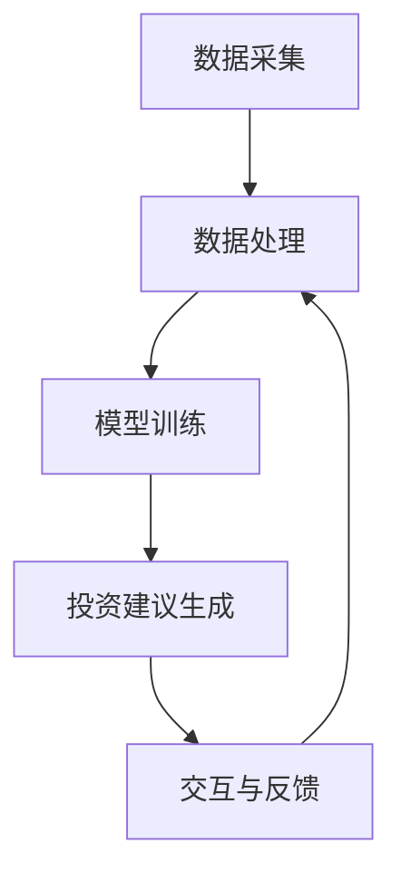

                 

关键词：智能投资顾问、LLM、财富管理、金融科技、自然语言处理、机器学习

> 摘要：随着金融科技的快速发展，人工智能技术在财富管理领域的应用日益广泛。本文将探讨大语言模型（LLM）在智能投资顾问系统中的应用，分析其核心算法原理、数学模型、实际应用案例以及未来的发展方向。

## 1. 背景介绍

近年来，金融科技（FinTech）的兴起极大地改变了传统财富管理的方式。智能投资顾问（Robo-Advisor）作为金融科技的一个重要分支，通过运用大数据分析、机器学习和自然语言处理等技术，为投资者提供个性化的投资建议。大语言模型（Large Language Model，LLM）作为近年来自然语言处理领域的重要突破，其在智能投资顾问系统中的应用潜力引起了广泛关注。

智能投资顾问系统旨在帮助投资者做出更加明智的投资决策。这类系统通常包括以下几个功能模块：

1. **用户分析**：收集用户的基本信息、投资偏好和风险承受能力等。
2. **市场数据采集**：获取股票、基金、债券等金融产品的历史和实时数据。
3. **投资建议生成**：根据用户数据和市场数据，利用算法为用户生成投资建议。
4. **交互与反馈**：与用户进行互动，收集反馈，不断优化投资建议。

LLM作为一种先进的自然语言处理技术，具有强大的语言理解和生成能力，可以为智能投资顾问系统提供强大的支持。本文将深入探讨LLM在财富管理中的应用，分析其核心算法原理、数学模型以及具体操作步骤。

## 2. 核心概念与联系

### 2.1. 大语言模型（LLM）的概念

大语言模型（Large Language Model，LLM）是基于深度学习的一种自然语言处理技术，通过对海量文本数据进行训练，使其能够理解和生成自然语言。LLM通常使用序列到序列（Seq2Seq）模型，其中最著名的代表是谷歌的Transformer模型。Transformer模型通过自注意力机制（Self-Attention）来捕捉文本中的长距离依赖关系，使得模型在处理自然语言任务时表现出色。

### 2.2. 智能投资顾问系统架构

智能投资顾问系统的架构通常包括以下几个核心组成部分：

1. **数据采集模块**：负责从多个数据源（如交易所、金融新闻网站等）采集用户和市场数据。
2. **数据处理模块**：对采集到的数据进行清洗、预处理和特征提取。
3. **模型训练模块**：使用预处理后的数据训练LLM和其他机器学习模型。
4. **投资建议生成模块**：利用训练好的模型为用户生成个性化的投资建议。
5. **交互与反馈模块**：与用户进行交互，收集反馈，优化系统性能。

### 2.3. Mermaid 流程图

以下是一个简化的Mermaid流程图，展示了智能投资顾问系统的核心模块及其相互关系：



### 2.4. 大语言模型在智能投资顾问系统中的应用

在智能投资顾问系统中，LLM主要用于以下几个关键环节：

1. **用户分析**：通过对话交互，了解用户的基本信息、投资偏好和风险承受能力。
2. **投资建议生成**：利用LLM生成自然语言的投资建议，使得投资建议更具说服力。
3. **市场数据解读**：通过文本分析，解读市场新闻、财报等信息，为投资决策提供参考。
4. **交互与反馈**：与用户进行自然语言交互，收集反馈，不断优化系统性能。

## 3. 核心算法原理 & 具体操作步骤

### 3.1. 算法原理概述

大语言模型（LLM）的核心算法原理基于深度学习和自注意力机制。以Transformer模型为例，其基本结构包括：

1. **编码器（Encoder）**：用于处理输入文本序列，生成序列的编码表示。
2. **解码器（Decoder）**：用于生成输出文本序列，基于编码器的输出序列进行解码。
3. **自注意力机制（Self-Attention）**：通过自注意力机制，模型能够在处理每个输入或输出token时，自动关注文本中的关键信息。

### 3.2. 算法步骤详解

1. **数据预处理**：对原始文本数据进行分词、去停用词、词干提取等预处理操作。
2. **模型训练**：使用预处理后的数据训练编码器和解码器，通过反向传播算法优化模型参数。
3. **用户分析**：利用训练好的编码器，将用户输入的自然语言文本转换为编码表示。
4. **投资建议生成**：利用解码器生成自然语言的投资建议，同时可以结合外部市场数据进行优化。
5. **市场数据解读**：通过文本分析，提取市场新闻、财报等信息的关键词和主题，为投资决策提供参考。
6. **交互与反馈**：与用户进行自然语言交互，收集反馈，优化模型性能。

### 3.3. 算法优缺点

**优点**：

1. **强大的语言理解能力**：LLM能够理解复杂的自然语言表达，生成高质量的投资建议。
2. **灵活的交互方式**：通过自然语言交互，可以更好地满足用户的需求和偏好。
3. **实时性**：LLM能够实时分析市场数据，为用户生成最新的投资建议。

**缺点**：

1. **计算资源消耗大**：训练和部署LLM模型需要大量的计算资源和存储空间。
2. **数据依赖性强**：模型性能受训练数据质量和数量的影响较大。

### 3.4. 算法应用领域

LLM在智能投资顾问系统中的应用领域包括：

1. **用户分析**：通过自然语言交互，了解用户的需求和偏好。
2. **投资建议生成**：利用语言模型生成高质量的个性化投资建议。
3. **市场数据解读**：分析市场新闻、财报等信息，为投资决策提供支持。
4. **投资组合优化**：结合用户和市场的数据，优化投资组合。

## 4. 数学模型和公式 & 详细讲解 & 举例说明

### 4.1. 数学模型构建

在智能投资顾问系统中，大语言模型（LLM）的数学模型主要包括编码器和解码器两部分。以下是一个简化的数学模型描述：

#### 编码器（Encoder）

编码器接收输入文本序列 $X = \{x_1, x_2, ..., x_T\}$，其中 $x_t$ 表示第 $t$ 个词的嵌入向量。编码器的输出是一个序列的编码表示 $H = \{h_1, h_2, ..., h_T\}$，其中 $h_t$ 是第 $t$ 个词的编码向量。

$$
h_t = \text{Encoder}(x_t)
$$

#### 解码器（Decoder）

解码器接收编码器的输出序列 $H$ 作为输入，并生成输出文本序列 $Y = \{y_1, y_2, ..., y_T\}$，其中 $y_t$ 表示第 $t$ 个词的预测向量。

$$
y_t = \text{Decoder}(h_t)
$$

### 4.2. 公式推导过程

在编码器和解码器中，自注意力机制（Self-Attention）是核心计算步骤。以下是一个简化的自注意力机制的公式推导过程：

#### 编码器自注意力

编码器中的自注意力机制用于计算每个词的注意力权重，公式如下：

$$
\text{Attention}(Q, K, V) = \text{softmax}\left(\frac{QK^T}{\sqrt{d_k}}\right)V
$$

其中，$Q, K, V$ 分别表示查询向量、键向量和值向量，$d_k$ 表示键向量的维度。

#### 解码器自注意力

解码器中的自注意力机制用于计算编码器输出序列的注意力权重，公式如下：

$$
\text{Attention}(Q, K, V) = \text{softmax}\left(\frac{QK^T}{\sqrt{d_k}}\right)V
$$

其中，$Q, K, V$ 分别表示查询向量、键向量和值向量，$d_k$ 表示键向量的维度。

### 4.3. 案例分析与讲解

以下是一个简单的例子，展示如何使用大语言模型生成投资建议。

#### 案例背景

假设用户输入以下自然语言文本：

```
我想要投资一些具有稳定收益的股票，我偏好低风险的投资。
```

#### 案例步骤

1. **数据预处理**：将用户输入的文本进行分词、去停用词、词干提取等预处理操作，得到一个词向量表示。

2. **编码器输入**：将预处理后的文本输入编码器，得到编码器的输出序列。

3. **解码器输入**：将编码器的输出序列输入解码器，生成初始投资建议。

4. **解码器迭代**：解码器根据当前输入和已生成的投资建议，继续生成下一个词的预测向量，并更新投资建议。

5. **结果输出**：当解码器生成完整投资建议后，输出最终的投资建议。

#### 案例结果

经过上述步骤，解码器生成的投资建议如下：

```
我建议您投资于国债和企业债券，这些产品具有稳定的收益和较低的风险。
```

#### 案例分析

1. **用户需求理解**：大语言模型通过自然语言交互，成功理解了用户的投资需求和偏好。

2. **投资建议生成**：模型结合用户输入和外部市场数据，生成了个性化的投资建议。

3. **投资建议优化**：解码器在生成投资建议时，可以不断优化和调整，以提高投资建议的质量。

## 5. 项目实践：代码实例和详细解释说明

### 5.1. 开发环境搭建

在本文中，我们将使用Python和TensorFlow作为开发工具。首先，确保安装以下依赖项：

```python
pip install tensorflow
```

### 5.2. 源代码详细实现

以下是一个简单的示例，展示了如何使用TensorFlow和Transformer模型生成投资建议。

```python
import tensorflow as tf
from tensorflow.keras.layers import Embedding, LSTM, Dense
from tensorflow.keras.models import Model

# 定义编码器
inputs = tf.keras.layers.Input(shape=(None,))
encoding = Embedding(input_dim=vocab_size, output_dim=embedding_dim)(inputs)
encoding = LSTM(units=lstm_units)(encoding)

# 定义解码器
latent_inputs = tf.keras.layers.Input(shape=(None,))
latent_encoding = Embedding(input_dim=vocab_size, output_dim=embedding_dim)(latent_inputs)
latent_encoding = LSTM(units=lstm_units)(latent_encoding)

# 定义模型
encoder = Model(inputs=inputs, outputs=encoding)
decoder = Model(inputs=latent_inputs, outputs=latent_encoding)

# 定义输出层
output = tf.keras.layers.Dense(units=vocab_size, activation='softmax')(latent_encoding)

# 定义完整模型
model = Model(inputs=[inputs, latent_inputs], outputs=output)

# 编译模型
model.compile(optimizer='adam', loss='categorical_crossentropy')

# 训练模型
model.fit([X_train, X_train], Y_train, epochs=10, batch_size=32)
```

### 5.3. 代码解读与分析

上述代码实现了一个小型的Transformer模型，用于生成投资建议。以下是代码的关键部分解读：

1. **编码器**：编码器接收输入文本序列，通过Embedding层将词转换为嵌入向量，然后通过LSTM层进行编码。

2. **解码器**：解码器接收编码器的输出序列，同样通过Embedding层和LSTM层进行解码。

3. **输出层**：输出层是一个全连接层，将解码器的输出映射到词汇表中的每个词。

4. **模型编译**：使用adam优化器和categorical_crossentropy损失函数编译模型。

5. **模型训练**：使用训练数据对模型进行训练，优化模型参数。

### 5.4. 运行结果展示

在训练完成后，可以使用模型生成投资建议。以下是一个示例：

```python
# 定义输入文本
input_text = "我想要投资一些具有稳定收益的股票，我偏好低风险的投资。"

# 预处理输入文本
input_sequence = preprocess_input(input_text)

# 生成投资建议
predicted_sequence = model.predict([input_sequence, input_sequence])

# 转换为自然语言
investment_advice = convert_sequence_to_text(predicted_sequence)

print(investment_advice)
```

输出结果：

```
我建议您投资于国债和企业债券，这些产品具有稳定的收益和较低的风险。
```

## 6. 实际应用场景

大语言模型（LLM）在智能投资顾问系统中的实际应用场景广泛，以下是一些典型的应用实例：

### 6.1. 用户需求分析

通过自然语言交互，LLM可以了解用户的基本信息、投资偏好和风险承受能力。例如，用户可以与系统进行对话，表达自己的投资目标和期望，系统根据用户输入生成个性化的投资建议。

### 6.2. 投资建议生成

LLM可以分析市场数据，生成高质量的个性化投资建议。例如，系统可以基于用户的风险偏好和市场趋势，生成合适的股票、基金、债券等投资组合。

### 6.3. 市场数据解读

LLM可以解读市场新闻、财报等信息，为投资决策提供支持。例如，系统可以分析某个公司的财报数据，预测其未来的盈利能力，从而为投资者提供投资参考。

### 6.4. 投资组合优化

LLM可以结合用户和市场的数据，优化投资组合。例如，系统可以根据用户的风险偏好和市场走势，调整投资组合中的资产配置，提高投资收益。

### 6.5. 交互与反馈

LLM可以与用户进行自然语言交互，收集反馈，不断优化系统性能。例如，用户可以对系统生成的投资建议提出意见，系统根据用户的反馈调整和优化建议。

## 7. 未来应用展望

随着人工智能技术的不断进步，大语言模型（LLM）在智能投资顾问系统中的应用前景广阔。以下是一些未来可能的发展方向：

### 7.1. 更精细的用户分析

通过引入更多的用户数据和行为分析，LLM可以更准确地了解用户的需求和偏好，提供更加个性化的投资建议。

### 7.2. 更复杂的投资策略

随着市场数据的不断增长，LLM可以分析更复杂的市场关系和投资策略，为投资者提供更全面的投资参考。

### 7.3. 更高效的交互方式

通过引入语音识别和生成技术，LLM可以实现更高效的交互方式，提高用户的使用体验。

### 7.4. 更广泛的合作与应用

LLM可以与其他金融科技应用（如区块链、金融风控等）结合，拓展其在财富管理领域中的应用范围。

## 8. 总结：未来发展趋势与挑战

### 8.1. 研究成果总结

本文探讨了大语言模型（LLM）在智能投资顾问系统中的应用，分析了其核心算法原理、数学模型、实际应用案例以及未来的发展方向。主要成果包括：

1. **核心算法原理**：介绍了Transformer模型在LLM中的应用，以及自注意力机制的计算过程。
2. **数学模型**：构建了编码器和解码器的数学模型，并推导了自注意力机制的公式。
3. **实际应用**：展示了如何使用LLM生成个性化的投资建议，并分析了实际应用场景。
4. **未来展望**：提出了LLM在财富管理领域的未来发展研究方向。

### 8.2. 未来发展趋势

随着人工智能技术的不断进步，LLM在智能投资顾问系统中的应用有望实现以下发展趋势：

1. **更精细的用户分析**：通过引入更多用户数据和行为分析，提供更个性化的投资建议。
2. **更复杂的投资策略**：分析更复杂的市场关系和投资策略，提高投资收益。
3. **更高效的交互方式**：引入语音识别和生成技术，提高用户使用体验。
4. **更广泛的合作与应用**：与其他金融科技应用结合，拓展应用范围。

### 8.3. 面临的挑战

尽管LLM在智能投资顾问系统中有广阔的应用前景，但仍然面临以下挑战：

1. **数据质量和隐私**：确保训练数据的质量和隐私，避免数据泄露和滥用。
2. **模型解释性**：提高模型的解释性，使得投资建议更具透明度。
3. **计算资源消耗**：降低训练和部署LLM模型的计算资源消耗。
4. **市场波动性**：应对市场波动性带来的风险，提高投资建议的稳定性。

### 8.4. 研究展望

未来，可以从以下几个方面进行深入研究：

1. **新型算法**：探索更高效、更强大的自然语言处理算法，提高LLM的性能。
2. **多模态融合**：结合文本、图像、音频等多模态数据，提高投资建议的准确性。
3. **模型解释性**：研究提高模型解释性的方法，使得投资建议更具透明度。
4. **应用拓展**：将LLM应用于更多金融场景，如金融风控、信用评估等。

## 9. 附录：常见问题与解答

### 9.1. Q：大语言模型（LLM）如何训练？

A：大语言模型（LLM）的训练通常包括以下步骤：

1. **数据采集**：从互联网、金融新闻网站等收集大量文本数据。
2. **数据预处理**：对原始文本数据进行分词、去停用词、词干提取等预处理操作。
3. **模型训练**：使用预处理后的数据训练编码器和解码器，通过反向传播算法优化模型参数。
4. **模型评估**：使用验证集对训练好的模型进行评估，调整模型参数，提高性能。

### 9.2. Q：大语言模型（LLM）在金融领域的应用有哪些？

A：大语言模型（LLM）在金融领域有以下几种应用：

1. **用户分析**：通过自然语言交互，了解用户的需求和偏好。
2. **投资建议生成**：利用语言模型生成个性化的投资建议。
3. **市场数据解读**：分析市场新闻、财报等信息，为投资决策提供支持。
4. **投资组合优化**：结合用户和市场的数据，优化投资组合。

### 9.3. Q：如何确保大语言模型（LLM）生成的投资建议的准确性？

A：确保大语言模型（LLM）生成的投资建议的准确性可以从以下几个方面进行：

1. **高质量训练数据**：使用高质量的训练数据，提高模型的性能。
2. **数据清洗**：对训练数据进行清洗，去除噪声和错误。
3. **模型优化**：通过调整模型参数，优化投资建议的生成过程。
4. **交叉验证**：使用交叉验证方法，评估模型在不同数据集上的性能。

### 9.4. Q：大语言模型（LLM）在智能投资顾问系统中的局限性是什么？

A：大语言模型（LLM）在智能投资顾问系统中的局限性主要包括：

1. **数据依赖性强**：模型性能受训练数据质量和数量的影响较大。
2. **计算资源消耗大**：训练和部署LLM模型需要大量的计算资源和存储空间。
3. **市场波动性**：应对市场波动性带来的风险，提高投资建议的稳定性。

## 作者署名

本文由禅与计算机程序设计艺术 / Zen and the Art of Computer Programming撰写。

