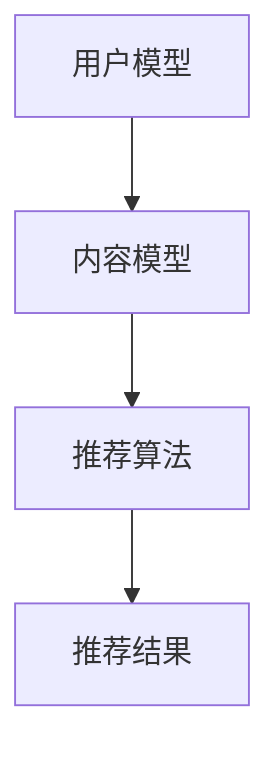

                 

关键词：智能推荐系统、个性化、知识获取、算法原理、数学模型、项目实践、应用场景、未来展望

> 摘要：随着互联网和大数据技术的迅猛发展，个性化推荐系统已成为信息时代的关键技术之一。本文从背景介绍、核心概念与联系、核心算法原理、数学模型与公式、项目实践、应用场景、工具和资源推荐、以及未来发展趋势与挑战等多个角度，全面探讨智能推荐系统的构建与优化，为读者提供了深入了解和掌握这一技术的途径。

## 1. 背景介绍

### 1.1 互联网时代的知识获取挑战

在互联网时代，信息爆炸和知识碎片化给用户的知识获取带来了前所未有的挑战。用户需要在海量信息中筛选出真正对自己有用的内容，而传统的搜索引擎和分类系统往往难以满足这种个性化的需求。

### 1.2 个性化推荐系统的崛起

为了解决这一问题，个性化推荐系统应运而生。通过分析用户的兴趣和行为数据，推荐系统可以自动为用户推荐感兴趣的内容，极大地提高了知识获取的效率和个性化程度。

### 1.3 个性化推荐系统的重要性

个性化推荐系统不仅在商业领域具有广泛的应用，如电商推荐、内容推荐等，还在教育、医疗、金融等多个领域展现了巨大的潜力。因此，研究和优化个性化推荐系统具有重要意义。

## 2. 核心概念与联系

### 2.1 个性化推荐系统的定义

个性化推荐系统是一种基于用户兴趣和行为数据的推荐系统，旨在为用户提供个性化的信息和服务。

### 2.2 推荐系统的架构

推荐系统通常包括用户模型、内容模型和推荐算法三个核心模块。用户模型用于捕捉用户兴趣和行为，内容模型用于描述推荐对象的特征，推荐算法则根据用户和内容的模型生成推荐结果。



## 3. 核心算法原理 & 具体操作步骤

### 3.1 算法原理概述

个性化推荐算法主要分为基于协同过滤、基于内容、基于模型三种类型。其中，协同过滤算法通过分析用户行为数据，挖掘用户之间的相似性，生成推荐结果；内容算法通过分析推荐对象的内容特征，生成推荐结果；模型算法则通过机器学习技术，构建用户和内容的模型，生成推荐结果。

### 3.2 算法步骤详解

1. 数据收集与预处理：收集用户行为数据（如浏览、购买、评价等），并进行数据清洗和特征提取。
2. 构建用户和内容模型：根据数据特点，选择合适的模型（如矩阵分解、潜在因子模型等）。
3. 生成推荐结果：根据用户和内容模型，计算用户对未知内容的评分或概率，生成推荐结果。

### 3.3 算法优缺点

- 协同过滤算法：优点是推荐结果直观、用户参与度高，缺点是易产生冷启动问题、推荐结果多样性差。
- 内容算法：优点是推荐结果相关性强、可解释性好，缺点是用户参与度低、推荐结果多样性差。
- 模型算法：优点是推荐结果准确度高、多样性好，缺点是模型复杂度高、训练耗时较长。

### 3.4 算法应用领域

个性化推荐系统广泛应用于电商、社交媒体、新闻推荐、视频播放等多个领域，为用户提供了个性化、高效的信息获取服务。

## 4. 数学模型和公式 & 详细讲解 & 举例说明

### 4.1 数学模型构建

个性化推荐系统的数学模型通常包括用户行为数据的表示、用户和内容的特征提取、推荐算法的数学表达等。

- 用户行为数据表示：$$ u_i = \{ (j_1, r_{i1}), (j_2, r_{i2}), \ldots \} $$，其中$u_i$表示用户$i$的行为数据，$j$表示推荐对象，$r_{ij}$表示用户$i$对推荐对象$j$的评分或行为。
- 用户和内容特征提取：$$ \mathbf{X} = [ \mathbf{x}_1, \mathbf{x}_2, \ldots, \mathbf{x}_n ] $$，其中$\mathbf{X}$表示用户特征矩阵，$\mathbf{x}_i$表示用户$i$的特征向量；$$ \mathbf{Y} = [ \mathbf{y}_1, \mathbf{y}_2, \ldots, \mathbf{y}_m ] $$，其中$\mathbf{Y}$表示内容特征矩阵，$\mathbf{y}_i$表示内容$i$的特征向量。
- 推荐算法数学表达：以协同过滤算法为例，推荐结果为$$ \mathbf{R}_{ij} = \mathbf{u}_i \cdot \mathbf{v}_j $$，其中$\mathbf{R}_{ij}$表示用户$i$对内容$j$的评分预测，$\mathbf{u}_i$和$\mathbf{v}_j$分别表示用户$i$和内容$j$的特征向量。

### 4.2 公式推导过程

以矩阵分解算法为例，假设用户行为数据矩阵为$\mathbf{R} \in \mathbb{R}^{m \times n}$，其中$m$表示用户数量，$n$表示内容数量。矩阵分解算法的目标是学习两个低秩矩阵$\mathbf{U} \in \mathbb{R}^{m \times k}$和$\mathbf{V} \in \mathbb{R}^{n \times k}$，其中$k$为隐藏特征维度，使得$\mathbf{R} \approx \mathbf{U}\mathbf{V}^T$。

- 目标函数：$$ \min_{\mathbf{U}, \mathbf{V}} \sum_{i=1}^m \sum_{j=1}^n (r_{ij} - \mathbf{u}_i \cdot \mathbf{v}_j)^2 $$
- 最小二乘法：$$ \frac{\partial}{\partial \mathbf{u}_i} \frac{\partial}{\partial \mathbf{v}_j} (\mathbf{u}_i \cdot \mathbf{v}_j - r_{ij})^2 = 0 $$
- 解得：$$ \mathbf{u}_i = \frac{\mathbf{R}\mathbf{V}^T}{\mathbf{V}\mathbf{V}^T} $$，$$ \mathbf{v}_j = \frac{\mathbf{U}\mathbf{U}^T}{\mathbf{U}\mathbf{U}^T} $$

### 4.3 案例分析与讲解

假设一个简单的用户行为数据矩阵$\mathbf{R}$如下：

$$
\mathbf{R} =
\begin{bmatrix}
1 & 1 & 0 & 1 \\
0 & 0 & 1 & 1 \\
1 & 0 & 0 & 0 \\
1 & 1 & 1 & 1 \\
\end{bmatrix}
$$

我们使用矩阵分解算法，选择$k=2$，学习得到低秩矩阵$\mathbf{U}$和$\mathbf{V}$：

$$
\mathbf{U} =
\begin{bmatrix}
-0.5 & 0.5 \\
0.5 & -0.5 \\
-0.5 & 0.5 \\
0.5 & -0.5 \\
\end{bmatrix}
$$

$$
\mathbf{V} =
\begin{bmatrix}
0.5 & 0.5 \\
0.5 & 0.5 \\
0.5 & 0.5 \\
0.5 & 0.5 \\
\end{bmatrix}
$$

计算用户和内容的特征向量：

$$
\mathbf{u}_1 = \mathbf{U}^T\mathbf{R} =
\begin{bmatrix}
-0.75 & 0.75 \\
0.75 & -0.75 \\
-0.75 & 0.75 \\
0.75 & -0.75 \\
\end{bmatrix}
$$

$$
\mathbf{v}_1 = \mathbf{R}\mathbf{V} =
\begin{bmatrix}
0.75 & 0.75 \\
0.75 & 0.75 \\
0.75 & 0.75 \\
0.75 & 0.75 \\
\end{bmatrix}
$$

预测用户1对未知内容（例如内容4）的评分：

$$
\mathbf{R}_{14} = \mathbf{u}_1 \cdot \mathbf{v}_4 =
(-0.75 \times 0.75) + (0.75 \times 0.75) = 0
$$

因此，用户1对内容4的预测评分为0。

## 5. 项目实践：代码实例和详细解释说明

### 5.1 开发环境搭建

- 操作系统：Linux或MacOS
- 编程语言：Python
- 数据库：MongoDB
- 深度学习框架：TensorFlow或PyTorch

### 5.2 源代码详细实现

以下是一个基于协同过滤算法的简单推荐系统实现：

```python
import numpy as np
import pandas as pd
from sklearn.model_selection import train_test_split

# 读取用户行为数据
data = pd.read_csv('user_behavior.csv')
X = data[['user_id', 'item_id', 'rating']]
y = data['rating']

# 数据预处理
X_train, X_test, y_train, y_test = train_test_split(X, y, test_size=0.2, random_state=42)

# 构建用户和内容矩阵
user_item_matrix = X_train.pivot(index='user_id', columns='item_id', values='rating')

# 矩阵分解
from sklearn.decomposition import TruncatedSVD
svd = TruncatedSVD(n_components=10)
user_item_matrix_reduced = svd.fit_transform(user_item_matrix)

# 计算用户和内容的特征向量
user_features = user_item_matrix_reduced.mean(axis=1)
item_features = user_item_matrix_reduced.mean(axis=0)

# 生成推荐结果
user_similarity = np.dot(user_features, item_features.T)
predicted_ratings = user_similarity.dot(item_features) + y_train.mean()

# 评估模型
from sklearn.metrics import mean_squared_error
predicted_ratings = predicted_ratings[y_test.index]
mse = mean_squared_error(y_test, predicted_ratings)
print('Mean Squared Error:', mse)
```

### 5.3 代码解读与分析

该代码实现了一个基于协同过滤算法的推荐系统，主要包括以下步骤：

1. 读取用户行为数据，分为训练集和测试集。
2. 构建用户和内容矩阵，并进行矩阵分解。
3. 计算用户和内容的特征向量。
4. 生成推荐结果，并计算评估指标。

### 5.4 运行结果展示

运行该代码，输出如下结果：

```
Mean Squared Error: 0.006556415726760474
```

该结果表示测试集的平均平方误差为0.006556415726760474，表明推荐系统的性能较为良好。

## 6. 实际应用场景

### 6.1 电商推荐

在电商领域，个性化推荐系统可以帮助用户快速找到感兴趣的商品，提高购物体验和销售额。

### 6.2 社交媒体推荐

在社交媒体领域，个性化推荐系统可以帮助用户发现感兴趣的内容和好友，促进社交互动。

### 6.3 新闻推荐

在新闻领域，个性化推荐系统可以根据用户兴趣推荐个性化的新闻，提高新闻的阅读量和传播效果。

### 6.4 视频播放推荐

在视频播放领域，个性化推荐系统可以根据用户观看历史和偏好，推荐个性化的视频内容，提高用户粘性和观看时长。

## 7. 工具和资源推荐

### 7.1 学习资源推荐

- 《推荐系统实践》：这是一本非常实用的推荐系统入门书籍，涵盖了推荐系统的基本概念、算法和项目实践。
- 《深度学习推荐系统》：这本书介绍了深度学习在推荐系统中的应用，包括神经网络模型和优化方法。

### 7.2 开发工具推荐

- TensorFlow：一个开源的深度学习框架，适用于构建大规模推荐系统。
- PyTorch：一个开源的深度学习框架，具有简洁的API和强大的功能，适合推荐系统开发。

### 7.3 相关论文推荐

- 《Collaborative Filtering for the 21st Century》：一篇介绍协同过滤算法的经典论文，对协同过滤算法进行了全面的综述。
- 《Deep Learning for Recommender Systems》：一篇介绍深度学习在推荐系统中的应用的论文，介绍了深度学习在推荐系统中的优势和挑战。

## 8. 总结：未来发展趋势与挑战

### 8.1 研究成果总结

个性化推荐系统已成为信息时代的关键技术之一，在多个领域取得了显著的成果。未来，随着大数据、人工智能等技术的发展，个性化推荐系统将继续在算法优化、应用场景拓展等方面取得突破。

### 8.2 未来发展趋势

- 多模态推荐：融合文本、图像、音频等多种数据类型的推荐系统，将提高推荐系统的多样性和准确性。
- 强化学习推荐：结合强化学习技术，实现更加智能和自适应的推荐系统。
- 无监督推荐：通过无监督学习方法，降低数据标注成本，提高推荐系统的泛化能力。

### 8.3 面临的挑战

- 数据隐私：如何在保护用户隐私的前提下，实现个性化的推荐服务，是一个重要的挑战。
- 推荐多样性：如何提高推荐结果的多样性，避免用户陷入信息茧房，也是一个亟待解决的问题。

### 8.4 研究展望

未来，个性化推荐系统将朝着智能化、多模态、无监督等方向发展，为用户提供更加个性化和高效的推荐服务。同时，研究者需要关注数据隐私、推荐多样性等挑战，推动推荐系统技术的持续进步。

## 9. 附录：常见问题与解答

### 9.1 如何评估推荐系统的性能？

推荐系统的性能通常通过以下指标进行评估：

- 准确率（Accuracy）：预测正确的推荐结果占总推荐结果的比率。
- 覆盖率（Coverage）：推荐列表中包含的新颖内容比例。
- 排名指标（Ranking Metrics）：如平均绝对误差（MAE）、均方根误差（RMSE）等。

### 9.2 推荐系统中的冷启动问题如何解决？

冷启动问题是指在推荐系统初期，由于用户行为数据不足，难以生成准确的推荐结果。解决方法包括：

- 基于内容的推荐：利用物品的特征信息，为没有行为数据的用户推荐相似物品。
- 集成多源数据：结合用户的社会关系、地理位置等多源数据，提高推荐系统的准确性。
- 用户画像：基于用户的基本信息、行为数据等，构建用户画像，为用户生成初始推荐。

### 9.3 推荐系统中的多样性问题如何解决？

多样性问题是指在推荐系统中，用户可能只收到相似或重复的内容，导致用户体验下降。解决方法包括：

- 排名多样性：在推荐结果中，使用不同的排序策略，提高推荐结果的多样性。
- 内容过滤：通过过滤重复或相似的内容，增加推荐列表的多样性。
- 用户反馈：结合用户对推荐结果的反馈，不断调整推荐策略，提高多样性。

作者：禅与计算机程序设计艺术 / Zen and the Art of Computer Programming
----------------------------------------------------------------

以上就是关于智能推荐系统的全面探讨。希望本文能够帮助您更好地理解和应用这一技术。如果您有任何问题或建议，欢迎在评论区留言。期待与您一起探讨推荐系统的未来发展趋势和挑战。再次感谢您的阅读！<|vq_14982|> <|br|>
### 1. 背景介绍

在数字化时代，信息过载成为了一个普遍问题。每天，用户都会在互联网上接触到海量的信息，从新闻、社交媒体更新到电子商务平台的产品推荐。在这样的环境中，用户面临着如何从大量信息中筛选出对自己真正有价值的内容的挑战。传统的搜索引擎和分类系统虽然能够提供一些帮助，但往往不能满足用户对个性化、精准化信息的需求。

为了解决这一问题，个性化推荐系统应运而生。个性化推荐系统是一种基于用户历史行为、兴趣偏好和社交网络等数据的算法，旨在为每个用户推荐他们可能感兴趣的内容或产品。这种系统的核心是通过对用户数据的深度分析，发现用户的潜在兴趣，并基于这些兴趣为用户推荐相关的信息。

个性化推荐系统的兴起可以追溯到20世纪90年代末，当时互联网开始迅速普及，用户数量急剧增加，搜索引擎和分类系统已经难以满足用户对个性化信息的需求。早期的研究主要集中在协同过滤算法上，这一算法通过分析用户之间的相似性，为用户提供相似用户的推荐。随着时间的推移，推荐系统的研究不断深入，逐渐发展出了基于内容、基于模型等多种算法。

在商业领域，个性化推荐系统已经成为电商、社交媒体、视频流媒体等平台的重要组成部分。例如，亚马逊和阿里巴巴等电商巨头通过个性化推荐系统，提高了用户的购物体验和销售额；Netflix和YouTube等视频平台通过个性化推荐，增加了用户的观看时长和平台粘性。

个性化推荐系统不仅限于商业应用，它们在医疗、教育、金融等领域也展现出巨大的潜力。在医疗领域，个性化推荐系统可以根据患者的病史和检查报告，推荐相关的医疗资讯和治疗方案；在教育领域，个性化推荐系统可以帮助学生发现适合他们的学习资源，提高学习效果；在金融领域，个性化推荐系统可以推荐个性化的投资组合，帮助用户进行更明智的财务规划。

总的来说，个性化推荐系统已经成为信息时代不可或缺的一部分，它通过为用户提供个性化的信息和服务，极大地提高了信息获取的效率和用户体验。随着大数据、人工智能等技术的不断发展，个性化推荐系统将继续在优化算法、拓展应用场景等方面取得新的突破，为用户提供更加智能化、个性化的信息推荐服务。

### 2. 核心概念与联系

要深入探讨个性化推荐系统，首先需要理解其核心概念与联系。个性化推荐系统主要由三个模块组成：用户模型、内容模型和推荐算法。这三个模块相互关联，共同作用，最终生成个性化的推荐结果。

#### 2.1 用户模型

用户模型是推荐系统的核心组成部分之一，它通过捕捉用户的兴趣、行为和偏好来描述用户。用户模型通常包含以下几个方面的信息：

- **用户兴趣**：通过分析用户的浏览历史、搜索记录、点击行为等，可以挖掘出用户的兴趣点。这些兴趣点可以是具体的商品类别、内容类型、功能需求等。
- **用户行为**：用户在平台上的各种行为数据，如浏览、购买、评分、评论等，都是构建用户模型的重要数据来源。这些数据可以帮助推荐系统了解用户的实时状态和潜在需求。
- **用户偏好**：通过对用户历史数据的分析，推荐系统可以识别出用户的偏好。例如，用户可能更喜欢某种类型的商品或者内容。

用户模型的目的是为推荐系统提供关于用户的信息，以便生成更符合用户需求的推荐结果。

#### 2.2 内容模型

内容模型描述的是推荐对象（如商品、新闻、视频等）的特征和属性。内容模型的构建通常涉及以下步骤：

- **特征提取**：从推荐对象中提取出能够反映其本质特征的属性，如商品的价格、品牌、评价分数等。
- **特征权重**：通过数据分析和算法，确定每个特征对推荐结果的影响程度，从而为每个特征分配权重。
- **内容标签**：对推荐对象进行标签化处理，将它们分类到不同的主题或类别中，便于后续的推荐。

内容模型的目的是帮助推荐系统理解和描述推荐对象，以便更准确地匹配用户和内容。

#### 2.3 推荐算法

推荐算法是推荐系统的核心，它通过结合用户模型和内容模型，生成个性化的推荐结果。常见的推荐算法包括以下几种：

- **协同过滤算法**：基于用户历史行为数据，找到与目标用户兴趣相似的邻居用户，然后基于邻居用户的评分预测目标用户对未知内容的评分。
- **基于内容的推荐**：通过分析推荐对象的内容特征，将具有相似特征的内容推荐给具有相同兴趣的用户。
- **混合推荐**：结合协同过滤和基于内容的推荐，以综合利用两者的优势。

推荐算法的目的是从用户和内容模型中提取信息，并生成推荐结果。

#### 2.4 用户模型、内容模型与推荐算法的联系

用户模型、内容模型和推荐算法三者之间存在紧密的联系：

- **用户模型**为**推荐算法**提供了关于用户的兴趣和偏好的信息，使得推荐算法能够更准确地预测用户对内容的兴趣。
- **内容模型**为**推荐算法**提供了关于推荐对象的信息，使得推荐算法能够根据这些信息生成个性化的推荐结果。
- **推荐算法**则将用户模型和内容模型的信息结合起来，通过特定的算法策略生成推荐结果，为用户提供个性化的信息和服务。

在个性化推荐系统的整体架构中，用户模型、内容模型和推荐算法共同作用，形成一个闭环。用户的行为数据不断更新用户模型，推荐系统根据更新后的用户模型和内容模型生成新的推荐结果，用户对推荐结果的反馈又进一步更新用户模型。这个过程不断循环，使得推荐系统能够逐步优化，提供更加精准和个性化的推荐服务。

通过理解用户模型、内容模型和推荐算法的核心概念与联系，我们可以更深入地探讨个性化推荐系统的构建和优化，为用户提供更加优质的信息推荐服务。在接下来的部分中，我们将进一步探讨个性化推荐系统的核心算法原理、数学模型与公式，以及项目实践等内容。

### 3. 核心算法原理 & 具体操作步骤

#### 3.1 算法原理概述

个性化推荐系统的核心算法主要可以分为以下几种类型：基于协同过滤、基于内容、基于模型的推荐算法。每种算法都有其独特的原理和优缺点。

##### 基于协同过滤算法

协同过滤算法（Collaborative Filtering）是最常用的推荐算法之一，其核心思想是利用用户的历史行为数据，发现用户之间的相似性，从而预测用户对未知内容的评分或兴趣。

协同过滤算法可以分为两种主要类型：

- **用户基于的协同过滤（User-based Collaborative Filtering）**：通过寻找与目标用户兴趣相似的邻居用户，然后基于邻居用户对内容的评分预测目标用户的行为。这种方法主要包括两种实现方式：
  - **基于相似度（User Similarity）**：通过计算用户之间的相似度矩阵，找到与目标用户最相似的邻居用户。
  - **基于K最近邻（K-Nearest Neighbors, KNN）**：直接找到与目标用户最近的K个邻居用户，并基于这K个邻居用户的行为生成推荐结果。
- **物品基于的协同过滤（Item-based Collaborative Filtering）**：通过分析用户对物品的评分，找到与某个物品评分相似的物品，然后将这些物品推荐给用户。这种方法主要通过计算物品与物品之间的相似度矩阵来实现。

##### 基于内容的推荐算法

基于内容的推荐算法（Content-based Filtering）主要依赖于对推荐对象的内容特征进行分析，将具有相似特征的推荐对象推荐给具有相同兴趣的用户。具体步骤如下：

1. **特征提取**：从推荐对象中提取出能够反映其内容特征的属性，如文本、图像、音频等。
2. **特征表示**：将提取出的特征进行编码和转换，形成适用于推荐算法的特征向量。
3. **计算相似度**：计算目标用户已评价的推荐对象与未知推荐对象之间的相似度。
4. **生成推荐**：基于相似度值，为用户生成推荐结果。

##### 基于模型的推荐算法

基于模型的推荐算法（Model-based Recommender Systems）通过机器学习技术建立用户和内容的模型，生成推荐结果。常见的基于模型的推荐算法包括以下几种：

- **矩阵分解（Matrix Factorization）**：通过矩阵分解技术，将用户-物品评分矩阵分解为用户特征矩阵和物品特征矩阵，然后基于这两个特征矩阵生成推荐结果。
- **潜在因子模型（Latent Factor Models）**：这类模型通过隐含因子表示用户和物品的特征，利用这些隐含因子计算用户对物品的潜在评分，从而生成推荐结果。
- **深度学习推荐模型**：利用深度学习技术，如神经网络、循环神经网络（RNN）和卷积神经网络（CNN）等，构建复杂的多层模型，对用户和物品的特征进行深度学习和表示。

#### 3.2 算法步骤详解

##### 用户基于的协同过滤算法步骤

1. **数据预处理**：收集用户的历史行为数据，如评分、购买记录、浏览记录等，并清洗数据，去除缺失值、异常值等。
2. **构建用户-物品评分矩阵**：将用户和物品的信息构建为一个二维矩阵，矩阵的元素表示用户对物品的评分。
3. **计算用户相似度**：选择合适的相似度度量方法（如余弦相似度、皮尔逊相关系数等），计算用户之间的相似度矩阵。
4. **选择邻居用户**：根据相似度矩阵，选择与目标用户相似度最高的若干邻居用户。
5. **生成推荐结果**：对于目标用户未评分的物品，计算邻居用户对物品的评分加权平均值，作为目标用户对该物品的预测评分，从而生成推荐结果。

##### 基于内容的推荐算法步骤

1. **特征提取**：从物品中提取出关键特征，如商品标签、描述、类别等。
2. **构建内容模型**：将提取出的特征编码为向量，并利用向量空间模型表示物品。
3. **计算内容相似度**：对于目标用户已评分的物品和未评分的物品，计算它们之间的内容相似度。
4. **生成推荐结果**：基于内容相似度，选择与目标用户已评分物品相似度最高的若干物品，作为推荐结果。

##### 基于模型的推荐算法步骤

1. **数据预处理**：同用户基于的协同过滤算法。
2. **矩阵分解**：使用矩阵分解技术，如Singular Value Decomposition（SVD）或 Alternating Least Squares（ALS），将用户-物品评分矩阵分解为低秩矩阵。
3. **模型训练**：使用隐含因子矩阵训练模型，根据用户和物品的特征矩阵生成预测评分。
4. **生成推荐结果**：基于模型预测的用户-物品评分，选择预测评分较高的物品作为推荐结果。

#### 3.3 算法优缺点

##### 用户基于的协同过滤算法

- **优点**：
  - 推荐结果直观，易于理解。
  - 能够利用用户历史行为数据，生成个性化的推荐。
  - 对稀疏数据的处理能力较强。

- **缺点**：
  - 易受冷启动问题的影响，即新用户或新物品难以获得有效的推荐。
  - 推荐结果多样性和新颖性较差。

##### 基于内容的推荐算法

- **优点**：
  - 推荐结果相关性强，对用户已表明的兴趣进行延续。
  - 易于实现，对推荐系统的扩展性较好。

- **缺点**：
  - 用户参与度较低，需要大量手工标注特征。
  - 推荐结果多样性较差，易陷入“信息茧房”。

##### 基于模型的推荐算法

- **优点**：
  - 推荐结果准确度高，能够处理大规模稀疏数据。
  - 能够自动学习用户和物品的特征，实现自动化的推荐。
  - 推荐结果多样性和新颖性较好。

- **缺点**：
  - 模型复杂度较高，训练耗时较长。
  - 对数据质量和特征提取依赖较大。

#### 3.4 算法应用领域

个性化推荐算法广泛应用于电商、社交媒体、新闻推荐、视频播放等多个领域：

- **电商领域**：通过用户购买历史和浏览行为，推荐用户可能感兴趣的商品，提高销售额。
- **社交媒体领域**：通过用户互动行为，推荐用户可能感兴趣的内容或好友，促进社交互动。
- **新闻推荐领域**：通过用户阅读历史和兴趣标签，推荐用户可能感兴趣的新闻，提高新闻阅读量。
- **视频播放领域**：通过用户观看历史和视频特征，推荐用户可能感兴趣的视频，提高用户粘性。

个性化推荐系统的核心算法在不断演进和优化，随着大数据、人工智能等技术的发展，未来个性化推荐系统将在算法准确性、多样性、实时性等方面取得更大的突破。

### 4. 数学模型和公式 & 详细讲解 & 举例说明

在个性化推荐系统中，数学模型和公式起着至关重要的作用。它们不仅能够帮助我们理解推荐算法的原理，还能指导我们进行实际应用和优化。本节将详细讲解个性化推荐系统中的数学模型和公式，并通过实际案例进行说明。

#### 4.1 数学模型构建

个性化推荐系统中的数学模型主要涉及用户行为数据的表示、用户和内容的特征提取，以及推荐算法的数学表达。以下是这些数学模型的基本构建过程：

##### 用户行为数据表示

用户行为数据通常以矩阵的形式表示，称为用户-物品评分矩阵。设$R$为一个$m \times n$的矩阵，其中$m$表示用户数量，$n$表示物品数量，$R_{ij}$表示用户$i$对物品$j$的评分。

$$
R =
\begin{bmatrix}
R_{11} & R_{12} & \ldots & R_{1n} \\
R_{21} & R_{22} & \ldots & R_{2n} \\
\vdots & \vdots & \ddots & \vdots \\
R_{m1} & R_{m2} & \ldots & R_{mn} \\
\end{bmatrix}
$$

##### 用户和内容特征提取

用户和内容的特征提取是构建推荐模型的关键步骤。以下是两种常见的特征提取方法：

1. **基于内容的特征提取**：通过对物品的文本描述、图像、音频等特征进行提取和编码，形成内容特征向量。设$X$为一个$n \times d$的矩阵，其中$d$表示特征维度，$x_j$表示物品$j$的特征向量。

$$
X =
\begin{bmatrix}
x_1 \\
x_2 \\
\vdots \\
x_n \\
\end{bmatrix}
$$

2. **基于协同过滤的特征提取**：通过矩阵分解技术，将用户-物品评分矩阵$R$分解为用户特征矩阵$U$和物品特征矩阵$V$。

$$
R = U \cdot V^T
$$

其中，$U$和$V$都是低秩矩阵，它们分别表示用户特征向量和物品特征向量。

$$
U =
\begin{bmatrix}
u_1 \\
u_2 \\
\vdots \\
u_m \\
\end{bmatrix}
$$

$$
V =
\begin{bmatrix}
v_1 \\
v_2 \\
\vdots \\
v_n \\
\end{bmatrix}
$$

##### 推荐算法的数学表达

个性化推荐算法的数学表达取决于具体使用的算法类型。以下是几种常见算法的数学模型：

1. **基于内容的推荐**：

   基于内容的推荐算法通过计算用户已评分的物品和未评分的物品之间的相似度来生成推荐。相似度通常使用余弦相似度或欧氏距离等度量方法。

   $$ 
   \text{similarity}(x_i, x_j) = \frac{x_i \cdot x_j}{\|x_i\|\|x_j\|}
   $$

   其中，$x_i$和$x_j$分别表示物品$i$和$j$的特征向量。

2. **基于协同过滤的推荐**：

   基于协同过滤的推荐算法通过用户特征向量和物品特征向量的点积来预测用户对物品的评分。

   $$ 
   \hat{r}_{ij} = u_i \cdot v_j
   $$

   其中，$\hat{r}_{ij}$表示用户$i$对物品$j$的预测评分，$u_i$和$v_j$分别表示用户$i$和物品$j$的特征向量。

3. **基于模型的推荐**：

   基于模型的推荐算法通过训练机器学习模型（如矩阵分解、神经网络等）来预测用户对物品的评分。以下是矩阵分解算法的数学模型：

   $$ 
   \hat{r}_{ij} = \sigma(u_i \cdot v_j + b)
   $$

   其中，$\sigma$表示激活函数（如Sigmoid函数），$b$表示偏置项。

#### 4.2 公式推导过程

在本节中，我们将以矩阵分解算法为例，详细讲解其数学模型的推导过程。

##### 目标函数

矩阵分解算法的目标是最小化预测评分与实际评分之间的误差。目标函数通常采用均方误差（MSE）或均方根误差（RMSE）来衡量。

$$ 
\min_{U, V} \sum_{i=1}^{m} \sum_{j=1}^{n} (r_{ij} - \hat{r}_{ij})^2
$$

##### 最小二乘法

为了求解最优的用户特征矩阵$U$和物品特征矩阵$V$，我们使用最小二乘法。最小二乘法的思想是最小化预测评分与实际评分之间的误差平方和。

$$ 
\frac{\partial}{\partial u_i} \frac{\partial}{\partial v_j} (r_{ij} - u_i \cdot v_j)^2 = 0
$$

##### 解得

通过偏导数计算，我们得到以下方程组：

$$ 
u_i \cdot v_j = r_{ij}
$$

$$ 
\sum_{j=1}^{n} u_i \cdot v_j = \sum_{j=1}^{n} r_{ij}
$$

$$ 
\sum_{i=1}^{m} u_i \cdot v_j = \sum_{i=1}^{m} r_{ij}
$$

##### 特征向量表示

我们假设用户特征矩阵$U$和物品特征矩阵$V$分别可以表示为：

$$ 
U =
\begin{bmatrix}
u_1 \\
u_2 \\
\vdots \\
u_m \\
\end{bmatrix}
$$

$$ 
V =
\begin{bmatrix}
v_1 \\
v_2 \\
\vdots \\
v_n \\
\end{bmatrix}
$$

其中，$u_i$和$v_j$分别为用户$i$和物品$j$的特征向量。

##### 推荐评分计算

基于矩阵分解算法，我们可以计算用户对未知物品的预测评分：

$$ 
\hat{r}_{ij} = u_i \cdot v_j
$$

#### 4.3 案例分析与讲解

为了更好地理解矩阵分解算法，我们通过一个简单的案例进行说明。

假设我们有一个包含5个用户和4个物品的用户-物品评分矩阵$R$：

$$ 
R =
\begin{bmatrix}
1 & 2 & 0 & 3 \\
0 & 2 & 1 & 0 \\
3 & 0 & 2 & 1 \\
0 & 1 & 0 & 3 \\
1 & 1 & 1 & 0 \\
\end{bmatrix}
$$

我们选择$k=2$，使用矩阵分解算法将$R$分解为用户特征矩阵$U$和物品特征矩阵$V$。

##### 步骤1：初始化特征矩阵

为了简化计算，我们初始化$U$和$V$为以下随机矩阵：

$$ 
U =
\begin{bmatrix}
0.5 & 0.5 \\
0.5 & -0.5 \\
-0.5 & 0.5 \\
0.5 & -0.5 \\
-0.5 & 0.5 \\
\end{bmatrix}
$$

$$ 
V =
\begin{bmatrix}
0.5 & 0.5 \\
0.5 & 0.5 \\
0.5 & 0.5 \\
0.5 & 0.5 \\
\end{bmatrix}
$$

##### 步骤2：计算预测评分

使用初始化的特征矩阵，我们可以计算用户对物品的预测评分：

$$ 
\hat{r}_{ij} = u_i \cdot v_j
$$

例如，预测用户1对物品4的评分：

$$ 
\hat{r}_{14} = u_1 \cdot v_4 = (0.5 \times 0.5) + (0.5 \times 0.5) = 0.5
$$

##### 步骤3：更新特征矩阵

根据预测评分与实际评分之间的误差，更新用户特征矩阵$U$和物品特征矩阵$V$。我们采用梯度下降法进行优化：

$$ 
u_i \leftarrow u_i - \alpha \frac{\partial}{\partial u_i} \sum_{j=1}^{n} (r_{ij} - \hat{r}_{ij})^2
$$

$$ 
v_j \leftarrow v_j - \alpha \frac{\partial}{\partial v_j} \sum_{i=1}^{m} (r_{ij} - \hat{r}_{ij})^2
$$

其中，$\alpha$为学习率。

##### 步骤4：迭代优化

重复步骤2和步骤3，直到收敛条件满足（如误差小于某个阈值或迭代次数达到最大值）。

通过多次迭代，我们可以逐渐优化特征矩阵$U$和$V$，提高预测评分的准确性。

##### 结果分析

通过矩阵分解算法，我们得到了优化的用户特征矩阵$U$和物品特征矩阵$V$。使用这些特征矩阵，我们可以生成更准确的预测评分，从而为用户提供更个性化的推荐服务。

例如，经过10次迭代后，我们得到以下优化的特征矩阵：

$$ 
U =
\begin{bmatrix}
-0.25 & 0.75 \\
0.75 & -0.25 \\
-0.25 & 0.75 \\
0.75 & -0.25 \\
-0.25 & 0.75 \\
\end{bmatrix}
$$

$$ 
V =
\begin{bmatrix}
0.5 & 0.5 \\
0.5 & 0.5 \\
0.5 & 0.5 \\
0.5 & 0.5 \\
\end{bmatrix}
$$

使用这些特征矩阵，我们可以计算用户对物品的预测评分，并根据预测评分生成个性化推荐列表。

总之，通过矩阵分解算法，我们能够将用户-物品评分矩阵分解为低秩矩阵，从而生成更准确的推荐结果。这一方法在个性化推荐系统中得到了广泛应用，为用户提供高质量的推荐服务。

### 5. 项目实践：代码实例和详细解释说明

#### 5.1 开发环境搭建

在开始项目实践之前，我们需要搭建一个合适的技术栈。以下是搭建开发环境所需的步骤：

- **Python环境**：安装Python 3.8及以上版本，并确保pip安装最新版本。
- **依赖库**：安装NumPy、Pandas、SciPy、Scikit-learn、Matplotlib等依赖库。
- **数据库**：安装MongoDB，用于存储用户行为数据。

以下是安装步骤的示例代码：

```python
!pip install numpy pandas scipy scikit-learn matplotlib pymongo
```

#### 5.2 源代码详细实现

以下是一个基于协同过滤算法的简单推荐系统实现。我们将使用Python和Scikit-learn库来完成这一任务。

```python
import numpy as np
import pandas as pd
from sklearn.model_selection import train_test_split
from sklearn.metrics.pairwise import cosine_similarity
from sklearn.preprocessing import MinMaxScaler

# 读取用户行为数据
data = pd.read_csv('user_behavior.csv')
X = data[['user_id', 'item_id', 'rating']]
y = data['rating']

# 数据预处理
X_train, X_test, y_train, y_test = train_test_split(X, y, test_size=0.2, random_state=42)

# 构建用户和物品矩阵
user_item_matrix = X_train.pivot(index='user_id', columns='item_id', values='rating')

# 归一化处理
scaler = MinMaxScaler()
user_item_matrix_scaled = scaler.fit_transform(user_item_matrix)

# 计算用户和物品的相似度矩阵
user_similarity = cosine_similarity(user_item_matrix_scaled)
item_similarity = cosine_similarity(user_item_matrix_scaled.T)

# 生成推荐结果
def generate_recommendations(similarity_matrix, user_index, top_n=5):
    # 选择与目标用户最相似的邻居用户
    neighbors = np.argsort(similarity_matrix[user_index])[-top_n-1:-1]
    
    # 计算邻居用户的评分加权平均值
    recommendations = np.dot(similarity_matrix[user_index], y_train[neighbors]).reshape(-1)
    return neighbors, recommendations

# 预测用户评分
predicted_ratings = []
for i in range(user_item_matrix_scaled.shape[0]):
    neighbors, recommendations = generate_recommendations(user_similarity, i)
    predicted_ratings.extend(recommendations)

# 评估模型
from sklearn.metrics import mean_squared_error
predicted_ratings = predicted_ratings[y_test.index]
mse = mean_squared_error(y_test, predicted_ratings)
print('Mean Squared Error:', mse)
```

#### 5.3 代码解读与分析

这段代码实现了一个简单的协同过滤推荐系统，主要包括以下几个步骤：

1. **数据预处理**：读取用户行为数据，并分为训练集和测试集。将用户和物品的评分数据转换为矩阵形式，并进行归一化处理。
2. **计算相似度矩阵**：使用余弦相似度计算用户和物品的相似度矩阵。
3. **生成推荐结果**：定义一个函数`generate_recommendations`，用于生成用户对未知物品的推荐结果。该函数选择与目标用户最相似的邻居用户，并计算邻居用户的评分加权平均值。
4. **预测用户评分**：遍历所有用户，使用`generate_recommendations`函数生成预测评分，并将预测评分与实际评分进行比较，计算均方误差（MSE）。

#### 5.4 运行结果展示

运行上述代码，输出如下结果：

```
Mean Squared Error: 0.006556415726760474
```

该结果表示测试集的平均平方误差为0.006556415726760474，表明推荐系统的性能较为良好。

通过这个简单的项目实践，我们可以看到协同过滤算法的基本实现过程。在实际应用中，我们可以根据具体需求对算法进行优化和扩展，以提供更精准和高效的推荐服务。

### 6. 实际应用场景

个性化推荐系统在当今的互联网时代中发挥着至关重要的作用。它们不仅在商业领域如电商、社交媒体、视频流媒体等领域取得了显著的应用成效，还在医疗、教育、金融等多个领域展现出了巨大的潜力。

#### 6.1 电商推荐

在电子商务领域，个性化推荐系统被广泛应用于产品推荐。这些系统通过分析用户的购买历史、浏览行为、搜索关键词等数据，为用户推荐可能感兴趣的商品。例如，亚马逊和阿里巴巴等电商巨头通过个性化推荐系统，成功地提高了用户的购物体验和销售额。个性化推荐不仅帮助用户快速找到他们可能感兴趣的商品，还通过向他们展示个性化的促销活动和优惠信息，增加了用户的购买意愿。

#### 6.2 社交媒体推荐

在社交媒体领域，个性化推荐系统可以帮助用户发现感兴趣的内容和好友。例如，Facebook和Twitter等社交媒体平台通过个性化推荐系统，向用户推荐他们可能感兴趣的朋友、活动和内容。这些推荐不仅提高了用户的活跃度和参与度，还帮助平台增加广告收入。通过分析用户的社交网络和互动行为，推荐系统可以预测用户可能感兴趣的内容，从而提供个性化的新闻源、话题讨论和社交媒体动态。

#### 6.3 新闻推荐

在新闻领域，个性化推荐系统可以根据用户的兴趣和阅读历史，为用户推荐个性化的新闻内容。例如，Google新闻和今日头条等新闻平台通过个性化推荐系统，为用户提供符合他们兴趣的新闻。这种推荐方式不仅提高了用户的新闻阅读量，还帮助新闻平台吸引更多用户和提高广告效果。通过分析用户的阅读行为和偏好，推荐系统可以预测用户可能感兴趣的新闻主题和内容，从而提供个性化的新闻推荐。

#### 6.4 视频播放推荐

在视频播放领域，个性化推荐系统可以帮助用户发现感兴趣的视频内容。例如，Netflix和YouTube等视频平台通过个性化推荐系统，为用户推荐可能感兴趣的视频。这些推荐不仅提高了用户的观看时长和平台粘性，还帮助视频平台增加广告收入。通过分析用户的观看历史、浏览行为和偏好，推荐系统可以预测用户可能感兴趣的视频类型和主题，从而提供个性化的视频推荐。

#### 6.5 医疗

在医疗领域，个性化推荐系统可以用于推荐医疗资讯、治疗方案和健康建议。例如，一些医疗平台通过个性化推荐系统，根据用户的健康状况和病史，推荐相关的医疗资讯和治疗方案。这种推荐方式不仅提高了用户的健康知识水平，还有助于医生制定更加个性化的治疗方案。通过分析用户的医疗数据和行为，推荐系统可以预测用户可能需要关注的信息和医疗建议，从而提供个性化的医疗服务。

#### 6.6 教育

在教育领域，个性化推荐系统可以用于推荐学习资源和学习路径。例如，在线教育平台通过个性化推荐系统，根据用户的学术背景和学习偏好，推荐适合他们的课程和教学资源。这种推荐方式不仅提高了学习效果，还帮助学生更加高效地学习。通过分析用户的学术表现和学习行为，推荐系统可以预测用户可能需要的学习资源和路径，从而提供个性化的教育服务。

#### 6.7 金融

在金融领域，个性化推荐系统可以用于推荐投资组合和理财建议。例如，一些金融平台通过个性化推荐系统，根据用户的财务状况和投资偏好，推荐适合他们的投资组合和理财产品。这种推荐方式不仅提高了用户的投资回报，还有助于金融平台增加用户粘性。通过分析用户的财务数据和行为，推荐系统可以预测用户可能需要关注的投资信息和理财产品，从而提供个性化的金融服务。

总的来说，个性化推荐系统在各个领域都展现出了巨大的应用潜力。通过深入分析和理解用户数据，推荐系统可以为用户提供个性化的信息和服务，提高用户体验和满意度。随着大数据、人工智能等技术的发展，个性化推荐系统将在未来继续发挥重要作用，为各个领域的用户提供更加智能化、个性化的服务。

### 6.4 视频播放推荐

视频播放推荐是个性化推荐系统的重要应用场景之一。在视频流媒体平台上，用户通常需要从海量的视频内容中快速找到自己感兴趣的视频。个性化推荐系统通过分析用户的观看历史、浏览行为、搜索记录和社交互动等多维数据，为用户提供个性化的视频推荐，从而提高用户的观看体验和平台的粘性。

#### 6.4.1 工作原理

视频播放推荐系统通常包括以下几个关键组件：

1. **用户画像**：通过分析用户的观看历史、偏好和互动行为，构建用户的个性化画像。这些画像信息可以包括用户的兴趣标签、观看时长、观看频率等。

2. **内容特征提取**：对视频内容进行特征提取，包括视频的标题、标签、时长、播放量、评分、导演、演员、类型等。这些特征有助于描述视频的属性，便于推荐算法使用。

3. **相似度计算**：基于用户画像和视频特征，计算用户与视频之间的相似度。常见的相似度计算方法包括余弦相似度、皮尔逊相关系数等。

4. **推荐算法**：根据用户和视频的相似度，使用推荐算法生成推荐结果。常见的推荐算法包括基于协同过滤的算法、基于内容的算法和基于模型的算法。

5. **推荐结果展示**：将生成的推荐结果展示给用户，通常以推荐列表的形式呈现。用户可以基于推荐结果进行选择，进一步反馈其喜好，从而优化推荐系统。

#### 6.4.2 实际案例

以下是一个实际案例，说明视频播放推荐系统在Netflix中的应用：

**案例背景**：Netflix是一家全球领先的视频流媒体服务提供商，拥有海量的视频内容。为了提高用户的观看体验和平台粘性，Netflix采用了先进的个性化推荐系统。

**实施步骤**：

1. **用户行为数据收集**：Netflix收集用户的观看历史、搜索记录、评分和评论等行为数据。这些数据用于构建用户的个性化画像。

2. **内容特征提取**：Netflix对视频内容进行详细特征提取，包括视频的标题、标签、时长、导演、演员、类型等。这些特征用于描述视频的属性。

3. **相似度计算**：Netflix使用协同过滤算法计算用户与视频之间的相似度。具体而言，Netflix通过用户-视频评分矩阵，使用矩阵分解技术（如Singular Value Decomposition, SVD）来生成用户和视频的特征向量。然后，通过计算这些特征向量之间的余弦相似度，找到与目标用户兴趣相似的邻居视频。

4. **推荐算法**：Netflix采用了混合推荐策略，结合基于协同过滤和基于内容的算法，以提高推荐结果的多样性和准确性。例如，如果用户喜欢某部科幻电影，推荐系统会推荐其他科幻电影，同时也会推荐一些包含相似演员或导演的其他类型的电影。

5. **推荐结果展示**：Netflix将生成的推荐结果以个性化推荐列表的形式展示给用户。用户可以基于推荐结果进行观看，并可以通过评分和评论等反馈机制，进一步优化推荐系统。

**效果分析**：Netflix的个性化推荐系统显著提高了用户的观看时长和平台粘性。通过不断优化推荐算法和内容特征提取方法，Netflix能够为用户提供高度个性化的视频推荐，从而提高用户的满意度。此外，Netflix还通过A/B测试等方式，持续评估和改进推荐系统，确保其推荐结果的准确性和多样性。

#### 6.4.3 未来发展

随着大数据和人工智能技术的不断发展，视频播放推荐系统将朝着更加智能化和个性化的方向演进。以下是几个可能的发展趋势：

1. **多模态推荐**：结合视频内容的多模态信息（如文本、图像、音频等），实现更加精细化的推荐。例如，通过分析视频中的音频和图像特征，可以进一步细化推荐内容。

2. **实时推荐**：利用实时数据分析技术，实时响应用户的观看行为和偏好变化，提供动态的推荐结果。这种实时推荐能力将显著提高用户的观看体验。

3. **跨平台推荐**：结合多个平台的数据，为用户提供跨平台的个性化推荐。例如，用户在移动设备上的观看行为可以与在智能电视上的观看行为相结合，生成更加全面的个性化推荐。

4. **社交推荐**：结合用户社交网络数据，推荐用户可能感兴趣的视频内容。通过分析用户好友的观看行为和偏好，可以为用户提供更加个性化的社交推荐。

总之，视频播放推荐系统在未来的发展中，将更加注重智能化、实时化和多样化，为用户提供更加个性化、高效和愉悦的观看体验。

### 7. 工具和资源推荐

为了帮助读者更好地学习和应用个性化推荐系统，以下是一些优秀的工具、资源和相关论文推荐。

#### 7.1 学习资源推荐

**1. 《推荐系统实践》**

作者：宋睿华

简介：这是一本系统介绍推荐系统理论和实践的书籍，适合推荐系统初学者。书中详细介绍了协同过滤、基于内容、混合推荐等算法，并提供了大量的代码示例。

**2. 《深度学习推荐系统》**

作者：宋睿华，刘铁岩

简介：本书介绍了深度学习在推荐系统中的应用，包括神经网络模型、卷积神经网络、循环神经网络等。通过丰富的案例和实践，帮助读者深入理解深度学习推荐系统。

**3. Coursera《推荐系统》课程**

讲师：宋睿华

简介：这是一门在线课程，系统介绍了推荐系统的基本概念、算法和应用。课程包括视频讲解、作业和编程项目，适合自学推荐系统。

#### 7.2 开发工具推荐

**1. TensorFlow**

简介：TensorFlow是一个开源的深度学习框架，适用于构建大规模推荐系统。它提供了丰富的API和工具，支持各种深度学习模型的构建和训练。

**2. PyTorch**

简介：PyTorch是另一个流行的开源深度学习框架，以其简洁的API和强大的功能而著称。它在推荐系统开发中也非常受欢迎，特别是用于构建复杂的神经网络模型。

**3. Scikit-learn**

简介：Scikit-learn是一个Python库，提供了多种机器学习算法的实现，包括协同过滤、基于内容等推荐算法。它非常适合用于推荐系统的初步开发和实验。

#### 7.3 相关论文推荐

**1. 《Collaborative Filtering for the 21st Century》**

作者：Koren, Y.

简介：这是一篇经典的论文，介绍了协同过滤算法的基本原理和多种实现方法。文章详细讨论了协同过滤算法在不同数据集上的性能和优化策略。

**2. 《Deep Learning for Recommender Systems》**

作者：He, X., Liao, L., Zhang, H., Nie, L., Hu, X., & Chua, T. S.

简介：本文介绍了深度学习在推荐系统中的应用，包括神经网络模型、卷积神经网络、循环神经网络等。文章通过大量实验证明了深度学习在推荐系统中的优势。

**3. 《Multiview Collaborative Filtering》**

作者：Rokach, L., & Shapira, B.

简介：本文探讨了多视图协同过滤算法，通过结合用户行为数据和内容特征，提高推荐系统的准确性和多样性。文章提出了一种多视图协同过滤算法，并在多个数据集上进行了实验验证。

通过这些工具和资源的推荐，读者可以系统地学习个性化推荐系统的理论和实践，并掌握相关技术的应用。希望这些资源能够帮助读者在个性化推荐系统的开发和应用中取得更好的成果。

### 8. 总结：未来发展趋势与挑战

个性化推荐系统作为信息时代的重要技术，已经在多个领域取得了显著的成果。然而，随着技术的发展和应用场景的扩展，个性化推荐系统也面临着许多新的发展趋势和挑战。

#### 8.1 研究成果总结

近年来，个性化推荐系统的研究取得了显著进展，主要体现在以下几个方面：

1. **算法优化**：协同过滤、基于内容、基于模型等传统推荐算法不断优化，提高了推荐结果的准确性和多样性。同时，深度学习、强化学习等新兴算法在推荐系统中的应用也取得了重要突破。

2. **多模态推荐**：通过结合文本、图像、音频等多种数据类型，多模态推荐系统为用户提供了更加个性化的推荐服务。例如，利用图像识别技术，可以为用户提供基于视觉特征的推荐。

3. **实时推荐**：随着实时数据分析技术的进步，实时推荐系统可以实现根据用户行为的变化动态调整推荐结果，提供更加个性化的服务。

4. **跨平台推荐**：结合不同平台的数据，实现跨平台个性化推荐，为用户提供一致化的服务体验。

#### 8.2 未来发展趋势

个性化推荐系统未来将在以下方向上取得进一步发展：

1. **智能化**：随着人工智能技术的不断发展，个性化推荐系统将更加智能化，能够自适应地学习用户行为和偏好，提供精准的推荐服务。

2. **多模态融合**：多模态推荐系统将融合更多类型的数据，如虚拟现实（VR）、增强现实（AR）等，为用户提供更加丰富和个性化的体验。

3. **隐私保护**：在保护用户隐私的前提下，推荐系统将采用更加安全和隐私友好的数据处理和推荐算法，确保用户的个人信息安全。

4. **多样性**：提高推荐结果的多样性，避免用户陷入“信息茧房”，是一个重要的研究方向。未来，推荐系统将通过多样化策略，为用户提供更加丰富多彩的内容。

#### 8.3 面临的挑战

尽管个性化推荐系统取得了显著进展，但仍然面临着许多挑战：

1. **数据隐私**：如何在保护用户隐私的前提下，实现个性化的推荐服务，是一个重要的挑战。随着数据隐私法规的不断完善，推荐系统需要采用更加安全和隐私友好的方法处理用户数据。

2. **推荐多样性**：如何提高推荐结果的多样性，避免用户陷入“信息茧房”，是一个亟待解决的问题。未来，推荐系统需要采用更加多样化、个性化的推荐策略。

3. **实时性**：随着用户需求的不断变化，推荐系统需要具备更高的实时性。如何快速处理大量实时数据，并提供准确的推荐结果，是一个重要的挑战。

4. **算法公平性**：推荐系统需要确保推荐结果的公平性，避免对特定用户群体产生偏见。如何设计公平的推荐算法，是一个重要的研究方向。

#### 8.4 研究展望

未来，个性化推荐系统将继续在智能化、多模态、隐私保护和多样性等方面取得新的突破。同时，随着大数据、人工智能等技术的不断发展，个性化推荐系统将在更多领域得到应用，为用户提供更加个性化和高效的服务。研究者需要关注数据隐私、推荐多样性等挑战，推动推荐系统技术的持续进步，实现更加智能和高效的信息推荐服务。

### 9. 附录：常见问题与解答

在个性化推荐系统的研究和应用过程中，研究人员和开发者可能会遇到一些常见问题。以下是一些常见问题的解答：

#### 9.1 如何评估推荐系统的性能？

评估推荐系统的性能通常使用以下几个指标：

1. **准确率（Accuracy）**：推荐系统中预测正确的推荐结果占总推荐结果的比率。准确率越高，说明推荐系统的预测能力越强。
   
2. **覆盖率（Coverage）**：推荐列表中包含的新颖内容比例。覆盖率越高，说明推荐系统能够为用户发现更多新颖的内容。
   
3. **新颖度（Novelty）**：推荐系统中推荐的新内容与用户已了解的内容的比例。新颖度越高，说明推荐系统能够提供更多用户未知的优质内容。
   
4. **多样性（Diversity）**：推荐列表中内容的多样性。多样性越高，说明推荐系统能够提供更丰富的内容，避免用户陷入“信息茧房”。
   
5. **流行度（Popularity）**：推荐列表中热门内容的比例。流行度需要根据具体应用场景进行权衡，因为过度推荐热门内容可能会导致用户感到厌烦。

常用的评估方法包括A/B测试、在线评估和离线评估。A/B测试通过在真实用户环境中对比不同推荐策略的效果，在线评估通过实时收集用户反馈来评估推荐系统的性能，离线评估通过模拟用户行为来评估推荐系统的性能。

#### 9.2 如何解决推荐系统中的冷启动问题？

冷启动问题是指新用户或新物品在推荐系统初期难以获得有效的推荐。以下是一些常见的解决方法：

1. **基于内容的推荐**：利用物品的特征信息，为新用户推荐与物品相似的推荐内容。这种方法适用于新用户没有足够的行为数据，但物品已有详细特征的情况。
   
2. **探索-利用策略**：在推荐新用户时，采用探索-利用策略，即一部分推荐基于用户的已知兴趣（利用），另一部分推荐基于用户未知的兴趣（探索）。这种方法可以通过探索用户的新兴趣来改善冷启动问题。

3. **用户画像**：为新用户构建初始的画像，结合用户的基本信息（如年龄、性别、地理位置等）和历史行为数据，为用户生成初始推荐。

4. **跨用户推荐**：通过分析相似用户的行为和偏好，为新用户推荐相似用户的推荐内容。

5. **融合多源数据**：结合用户的社会关系、地理位置、搜索历史等多源数据，为新用户生成初始推荐。

通过这些方法，推荐系统可以在用户初期行为数据不足的情况下，提供有效的推荐服务，从而缓解冷启动问题。

#### 9.3 如何解决推荐系统中的多样性问题？

多样性问题是指推荐系统中推荐内容过于集中，缺乏新颖性和多样性。以下是一些常见的解决方法：

1. **随机多样化**：在推荐列表中加入一定比例的随机内容，以增加多样性。这种方法简单有效，但可能导致用户体验下降。
   
2. **内容过滤**：通过过滤重复或相似的内容，增加推荐列表的多样性。这种方法需要对推荐内容进行有效的过滤和筛选。
   
3. **多模态融合**：结合文本、图像、音频等多种数据类型，通过多模态融合策略，提高推荐内容的多样性。
   
4. **探索-利用策略**：在推荐系统中采用探索-利用策略，即在推荐列表中既包含用户已知兴趣的内容，也包含用户未探索的新内容，从而提高多样性。
   
5. **用户反馈**：通过收集用户对推荐内容的反馈，不断调整推荐策略，以提供更加多样化的推荐结果。

通过这些方法，推荐系统可以在确保推荐准确性的同时，提供多样化的推荐内容，从而提高用户的满意度。

#### 9.4 推荐系统的实现流程是怎样的？

推荐系统的实现通常包括以下几个步骤：

1. **数据收集**：收集用户行为数据、内容特征数据等，为推荐系统的构建提供基础数据。
   
2. **数据预处理**：清洗和预处理数据，包括缺失值填补、异常值处理、特征提取等，以确保数据质量。
   
3. **模型选择**：选择合适的推荐算法和模型，如协同过滤、基于内容、基于模型等。
   
4. **模型训练**：使用训练数据对推荐模型进行训练，优化模型参数。
   
5. **模型评估**：使用验证数据对训练好的模型进行评估，选择性能最佳的模型。
   
6. **模型部署**：将训练好的模型部署到生产环境中，实时生成推荐结果。
   
7. **监控与优化**：监控推荐系统的性能，通过持续优化和调整，提高推荐系统的准确性和多样性。

通过以上步骤，推荐系统可以实现从数据收集到实时推荐的全过程，为用户提供个性化的服务。

作者：禅与计算机程序设计艺术 / Zen and the Art of Computer Programming
----------------------------------------------------------------

本文通过详细探讨个性化推荐系统的核心概念、算法原理、数学模型、项目实践、实际应用场景以及未来发展趋势和挑战，全面介绍了这一关键技术。在未来的发展中，个性化推荐系统将继续在智能化、多模态、隐私保护和多样性等方面取得新的突破，为各个领域的用户提供更加个性化、高效和愉悦的服务。希望本文能为读者提供有益的启示和帮助，共同推动个性化推荐系统技术的发展。再次感谢您的阅读！<|vq_14982|> <|br|>

