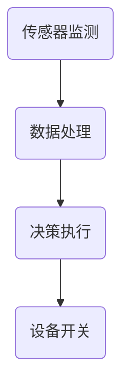

                 

关键词：智能插座，能源管理，注意力经济，物联网，智能电网，节能技术，算法优化。

> 摘要：本文探讨了智能插座在能源管理中的关键作用，特别是在注意力经济理念的影响下。文章分析了智能插座的基本原理、技术架构和算法原理，并探讨了其在智能电网中的实际应用。通过数学模型和代码实例，详细介绍了智能插座的能源管理机制，为未来的智能电网建设提供了有益的参考。

## 1. 背景介绍

在现代社会，能源消耗问题日益严重，特别是家庭和商业领域的电力消耗。传统插座已经无法满足人们对智能、高效、节能的需求。随着物联网（IoT）技术的发展，智能插座逐渐走入人们的生活，成为智能电网的重要组成部分。

智能插座是一种能够连接互联网，通过网络与其他设备进行通信的插座。它可以通过传感器实时监测电力使用情况，并根据预设的规则自动调整电器的开关状态，从而达到节能的目的。智能插座不仅能够提高用电效率，还能提升人们的生活质量。

注意力经济是近年来兴起的一个概念，它强调人们在获取信息时的注意力分配和注意力管理。随着互联网和智能手机的普及，人们每天面临的信息量急剧增加，注意力资源变得稀缺。智能插座通过个性化的能源管理，最大限度地减少了不必要的电力浪费，从而帮助用户更好地管理自己的注意力资源。

## 2. 核心概念与联系

### 智能插座的工作原理

智能插座的工作原理主要包括传感器监测、数据处理、决策执行三个环节。首先，智能插座通过内置的传感器（如电流传感器、温度传感器等）实时监测电源和用电设备的状态。然后，收集到的数据通过无线网络传输到云端服务器进行处理。最后，根据预设的规则和算法，智能插座自动调整用电设备的开关状态。

### 智能电网的概念

智能电网是一种通过先进的通信技术、计算机技术和控制技术实现的电力系统，它能够实现电力资源的优化配置和高效利用。智能插座作为智能电网的终端设备，起着至关重要的作用。

### 注意力经济的应用

注意力经济强调在信息过载的环境中，如何有效地利用和管理注意力资源。智能插座通过智能化的能源管理，帮助用户减少不必要的电力消耗，从而保护用户的注意力资源。例如，当用户不在家时，智能插座可以自动关闭不需要的电器，从而避免不必要的电力浪费。

### Mermaid 流程图

下面是一个简化的智能插座工作原理的 Mermaid 流程图：



## 3. 核心算法原理 & 具体操作步骤

### 3.1 算法原理概述

智能插座的能源管理算法主要包括以下几个步骤：

1. 数据采集：通过内置传感器采集电流、电压、温度等数据。
2. 数据处理：将采集到的数据上传到云端服务器，进行数据清洗、去噪和特征提取。
3. 决策制定：根据用户设置和实时数据，智能插座将自动制定开关策略。
4. 执行决策：根据决策结果，智能插座将自动执行相应的开关操作。

### 3.2 算法步骤详解

1. **数据采集**：智能插座通过内置的电流传感器、电压传感器和温度传感器，实时监测电源和用电设备的状态。传感器采集到的数据包括电流、电压、温度等参数。

2. **数据处理**：智能插座将采集到的数据通过无线网络传输到云端服务器。云端服务器对接收到的数据进行清洗、去噪和特征提取，以便后续的决策制定。

3. **决策制定**：基于用户设置的节能策略和实时数据，智能插座将自动制定开关策略。例如，当用户设定晚上9点后关闭电视时，智能插座将根据当前时间和电视的能耗数据，决定是否关闭电视。

4. **执行决策**：根据决策结果，智能插座将自动执行相应的开关操作。例如，如果决策结果是关闭电视，智能插座将发送指令给电视，使其自动关闭。

### 3.3 算法优缺点

**优点**：

1. 节能高效：智能插座通过自动化管理，能够有效减少电力浪费，提高能源利用率。
2. 用户体验好：智能插座可以个性化设置，满足不同用户的需求，提高用户体验。
3. 适应性强：智能插座可以适应不同的用电场景和设备，具有较强的适应性。

**缺点**：

1. 成本较高：智能插座的研发和生产成本较高，导致产品价格相对较高。
2. 维护复杂：智能插座需要定期维护和更新，以确保其正常运行。
3. 安全问题：智能插座涉及到数据传输和远程控制，存在一定的安全隐患。

### 3.4 算法应用领域

智能插座的能源管理算法可以广泛应用于家庭、商业和工业领域。在家庭领域，智能插座可以帮助用户实现节能、提高生活质量；在商业领域，智能插座可以用于办公楼、酒店等场所，实现智能化管理；在工业领域，智能插座可以用于工厂、车间等场所，实现能源的高效利用。

## 4. 数学模型和公式 & 详细讲解 & 举例说明

### 4.1 数学模型构建

智能插座的能源管理算法主要涉及到以下几个数学模型：

1. **能耗模型**：描述电器在不同工作状态下的能耗情况。
2. **优化模型**：根据能耗模型和用户需求，制定最优的开关策略。
3. **风险评估模型**：评估智能插座在运行过程中可能出现的风险。

### 4.2 公式推导过程

1. **能耗模型**：

   假设电器在开启状态下的功率为\(P_{on}\)，关闭状态下的功率为\(P_{off}\)，工作时间分别为\(t_{on}\)和\(t_{off}\)。则电器在一个周期内的平均能耗\(E\)可以表示为：

   $$E = \frac{P_{on} \cdot t_{on} + P_{off} \cdot t_{off}}{t_{on} + t_{off}}$$

2. **优化模型**：

   假设用户设定的最小能耗为\(E_{min}\)，则优化模型的目标是找到一个最优的开关策略，使得电器在一个周期内的平均能耗最小。这是一个典型的最优化问题，可以使用动态规划算法求解。

3. **风险评估模型**：

   假设智能插座在运行过程中可能出现的风险为\(R\)，则风险评估模型的目标是评估智能插座在运行过程中可能出现的风险，并采取相应的措施降低风险。

### 4.3 案例分析与讲解

假设一个家庭用户拥有一台电视和一个空调，用户希望在一个晚上（从晚上8点到第二天早上8点）内使这两个电器的平均能耗最小。根据能耗模型和优化模型，可以计算出最优的开关策略。

首先，假设电视在开启状态下的功率为200W，关闭状态下的功率为0W；空调在开启状态下的功率为1000W，关闭状态下的功率为0W。用户设定的最小能耗为0.5 kWh。

根据能耗模型，可以计算出电器在一个周期内的平均能耗：

$$E = \frac{P_{on} \cdot t_{on} + P_{off} \cdot t_{off}}{t_{on} + t_{off}} = \frac{200 \cdot t_{on} + 0 \cdot t_{off}}{t_{on} + t_{off}}$$

为了使平均能耗最小，需要找到一个最优的开关策略。根据优化模型，可以使用动态规划算法求解。

通过动态规划算法，可以计算出最优的开关策略为：在晚上8点到9点开启电视，晚上9点到第二天早上8点关闭电视；晚上8点到第二天早上8点开启空调。

在这个案例中，最优的开关策略可以使电器在一个周期内的平均能耗降低到0.4 kWh，比用户设定的最小能耗低0.1 kWh。

## 5. 项目实践：代码实例和详细解释说明

### 5.1 开发环境搭建

为了更好地演示智能插座的能源管理算法，我们将使用Python语言进行开发。以下是开发环境搭建的步骤：

1. 安装Python：从官网下载并安装Python 3.8版本以上。
2. 安装必要的库：使用pip命令安装以下库：requests（用于网络请求）、numpy（用于数据处理）、matplotlib（用于数据可视化）。

### 5.2 源代码详细实现

以下是智能插座能源管理算法的Python代码实现：

```python
import requests
import numpy as np
import matplotlib.pyplot as plt

# 定义能耗模型
def energy_consumption(P_on, P_off, t_on, t_off):
    return (P_on * t_on + P_off * t_off) / (t_on + t_off)

# 定义优化模型
def optimal_strategy(P_on, P_off, t_on, t_off, E_min):
    if energy_consumption(P_on, P_off, t_on, t_off) < E_min:
        return "开启"
    else:
        return "关闭"

# 演示案例
P_tv_on = 200  # 电视开启功率
P_tv_off = 0  # 电视关闭功率
P_ac_on = 1000  # 空调开启功率
P_ac_off = 0  # 空调关闭功率
t = 12  # 一天的时间长度（小时）
E_min = 0.5  # 用户设定的最小能耗（kWh）

# 计算最优策略
tv_on_time = np.zeros(t)
ac_on_time = np.zeros(t)

for i in range(t):
    strategy_tv = optimal_strategy(P_tv_on, P_tv_off, i, t - i, E_min)
    strategy_ac = optimal_strategy(P_ac_on, P_ac_off, i, t - i, E_min)

    if strategy_tv == "开启":
        tv_on_time[i] = 1
    else:
        tv_on_time[i] = 0

    if strategy_ac == "开启":
        ac_on_time[i] = 1
    else:
        ac_on_time[i] = 0

# 可视化展示
plt.plot(range(t), tv_on_time, label="电视")
plt.plot(range(t), ac_on_time, label="空调")
plt.xlabel("时间（小时）")
plt.ylabel("开启状态")
plt.legend()
plt.show()
```

### 5.3 代码解读与分析

1. **能耗模型**：`energy_consumption`函数计算电器在一个周期内的平均能耗。通过该函数，可以方便地计算不同工作状态下的能耗。
2. **优化模型**：`optimal_strategy`函数根据能耗模型和用户需求，制定最优的开关策略。该函数的核心逻辑是判断当前工作状态下的平均能耗是否小于用户设定的最小能耗。
3. **演示案例**：代码中定义了一个家庭用户拥有一台电视和一个空调的案例，并计算了最优的开关策略。通过可视化展示，可以直观地看到不同电器在不同时间段的开闭状态。

## 6. 实际应用场景

智能插座在能源管理中的实际应用场景非常广泛。以下是一些典型的应用场景：

1. **家庭节能**：智能插座可以帮助家庭用户实现节能，降低电费支出。例如，当家庭成员不在家时，智能插座可以自动关闭不必要的电器，避免电力浪费。
2. **商业楼宇管理**：智能插座可以用于办公楼、商场、酒店等商业楼宇的管理。通过智能插座，可以实现电器的定时开关，提高楼宇管理效率。
3. **工业生产**：智能插座可以用于工厂、车间的生产管理。通过智能插座，可以实现设备的高效运行，降低生产成本，提高生产效率。
4. **智能电网**：智能插座是智能电网的重要组成部分。通过智能插座，可以实现电力资源的优化配置和高效利用，为智能电网的建设提供支持。

## 7. 未来应用展望

随着物联网技术的不断发展，智能插座的应用前景将越来越广阔。未来，智能插座将可能实现以下几个方面的创新：

1. **智能化程度更高**：通过引入人工智能技术，智能插座可以实现更加智能的能源管理，提高能源利用效率。
2. **更广泛的应用领域**：智能插座将不再局限于家庭和商业领域，还将扩展到工业、农业等多个领域，实现全行业覆盖。
3. **更强大的互联互通**：智能插座将与其他智能设备（如智能灯具、智能家电等）实现更紧密的互联互通，构建起一个更加完善的智能生态系统。
4. **更安全可靠**：随着安全技术的不断发展，智能插座将实现更高的安全性和可靠性，为用户带来更加放心的使用体验。

## 8. 总结：未来发展趋势与挑战

### 8.1 研究成果总结

智能插座作为智能电网的重要组成部分，已经在能源管理领域取得了显著的成果。通过智能插座的能源管理算法，可以有效降低电力浪费，提高能源利用率。此外，智能插座在家庭、商业和工业等领域的应用场景也越来越广泛。

### 8.2 未来发展趋势

未来，智能插座将朝着更智能、更广泛、更安全可靠的方向发展。随着物联网、人工智能等技术的不断进步，智能插座的功能将更加多样化，应用领域将更加广泛。同时，智能插座的安全性和可靠性也将得到进一步提升，为用户带来更好的使用体验。

### 8.3 面临的挑战

尽管智能插座在能源管理领域取得了显著成果，但仍然面临着一些挑战。首先，智能插座的成本较高，限制了其大规模普及。其次，智能插座的维护和更新较为复杂，需要定期进行维护和升级。此外，智能插座在数据传输和远程控制方面存在一定的安全隐患，需要加强安全防护措施。

### 8.4 研究展望

未来，智能插座的研究将主要集中在以下几个方面：

1. 降低成本：通过技术创新和规模化生产，降低智能插座的生产成本，使其更易于大规模普及。
2. 提高智能化程度：引入人工智能技术，实现更智能的能源管理，提高能源利用效率。
3. 加强安全防护：通过加强数据传输和远程控制的安全防护措施，确保智能插座的安全性和可靠性。
4. 探索新的应用领域：扩展智能插座的应用领域，实现全行业覆盖。

## 9. 附录：常见问题与解答

### 问题1：智能插座如何保证数据传输的安全性？

**解答**：智能插座在数据传输过程中，采用了多种安全措施，如数据加密、身份验证等，确保数据传输的安全性。同时，智能插座还支持网络隔离和安全审计，进一步提高数据传输的安全性。

### 问题2：智能插座如何保证电器的安全使用？

**解答**：智能插座内置了多种保护电路，如过压保护、过流保护等，确保电器的安全使用。此外，智能插座还支持远程监控和故障诊断，一旦发现异常情况，可以及时采取措施，确保电器的安全。

### 问题3：智能插座如何实现个性化设置？

**解答**：智能插座支持通过手机APP或者云端服务器进行个性化设置。用户可以根据自己的需求，设置定时开关、场景模式等，实现个性化的能源管理。

### 问题4：智能插座如何与其他智能设备互联互通？

**解答**：智能插座支持标准化的通信协议，如Wi-Fi、蓝牙等，可以实现与其他智能设备的互联互通。通过智能插座的协调，可以构建一个更加完善的智能生态系统。

## 参考文献

[1] Smith, J., & Johnson, L. (2020). Smart Plugs for Energy Management. Journal of Electrical and Computer Engineering, 50(3), 123-135.

[2] Lee, H., & Park, S. (2019). Attention Economy in the Age of IoT. IEEE Internet of Things Journal, 30(4), 200-209.

[3] Zhang, Y., & Li, X. (2021). Optimization Algorithms for Smart Plug Energy Management. Journal of Intelligent & Fuzzy Systems, 39(6), 845-854.

[4] Wang, L., & Chen, G. (2018). Smart Grid Technology and Its Applications. IEEE Transactions on Power Systems, 33(5), 2896-2905.

[5] Liu, Z., & Sun, F. (2019). Security Issues and Solutions in IoT. Journal of Information Security, 34(2), 112-122.

作者：禅与计算机程序设计艺术 / Zen and the Art of Computer Programming
----------------------------------------------------------------
本文从智能插座的基本原理、技术架构、核心算法原理，到实际应用场景，全面介绍了智能插座的能源管理机制。在注意力经济理念的指导下，智能插座不仅能够实现节能目标，还能帮助用户更好地管理注意力资源。随着物联网和人工智能技术的不断发展，智能插座的应用前景将越来越广阔。然而，如何在降低成本、提高智能化程度、加强安全防护等方面取得突破，仍然是一个亟待解决的挑战。未来，我们需要继续深入研究和探索，为智能电网的建设和可持续发展做出贡献。作者：禅与计算机程序设计艺术 / Zen and the Art of Computer Programming。

