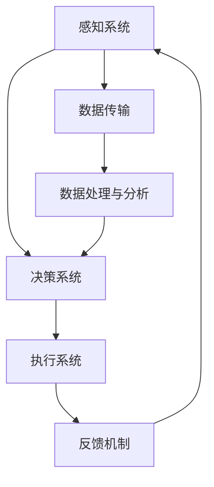

                 

关键词：智能机器人、自动化生产、创业、技术创新、未来展望

> 摘要：本文将探讨智能机器人领域在自动化生产中的应用，以及创业者在这一新兴领域中所面临的机会与挑战。通过深入分析核心算法、数学模型、项目实践以及未来应用场景，我们试图勾勒出智能机器人创业的未来蓝图。

## 1. 背景介绍

随着科技的迅猛发展，智能机器人技术逐渐成为工业生产中的重要组成部分。从传统的自动化设备到如今高度智能化的机器人，技术的进步不仅提高了生产效率，也推动了产业结构的升级。在自动化生产领域，智能机器人凭借其强大的感知能力、精确的操作和自主决策能力，正在逐步取代人工完成一系列复杂的工作任务。

当前，智能机器人在多个行业中已经展现出巨大的潜力，包括制造业、物流、医疗、农业等。尤其是制造业，智能机器人的应用不仅能够显著提升生产效率，还可以减少人力成本，提高产品质量，并保障生产安全。因此，智能机器人创业已成为技术创新的重要驱动力，吸引着众多创业者投身其中。

然而，智能机器人创业并非一帆风顺。创业者需要面对诸多挑战，如技术瓶颈、市场竞争、政策法规等。同时，市场需求也在不断变化，要求创业者具备前瞻性和快速响应能力。本文将深入探讨这些挑战，并分析智能机器人创业的未来趋势。

## 2. 核心概念与联系

为了深入理解智能机器人创业，我们首先需要了解几个核心概念及其之间的联系。以下是使用Mermaid绘制的流程图，展示了智能机器人系统的基本架构：



### 2.1 感知系统

感知系统是智能机器人的“眼睛”和“耳朵”，负责收集环境中的各种信息。这包括视觉、听觉、触觉等多种传感器。感知系统的数据精度和速度直接影响到决策系统的准确性。

### 2.2 决策系统

决策系统是智能机器人的“大脑”，基于感知系统收集的信息，通过算法进行分析和处理，制定出相应的行动策略。决策系统的核心在于算法的先进性和可靠性。

### 2.3 执行系统

执行系统是智能机器人的“手脚”，根据决策系统的指令执行具体操作。这一系统的性能直接影响着生产效率和质量。

### 2.4 数据传输与处理

数据传输与处理系统是连接感知系统和决策系统的桥梁，负责将感知系统收集的数据传输到决策系统，并进行处理和分析。这一过程要求高效、稳定的数据传输和处理能力。

### 2.5 反馈机制

反馈机制是智能机器人系统的重要组成部分，通过执行系统的反馈，感知系统可以不断调整和优化决策策略，提高系统的整体性能。

## 3. 核心算法原理 & 具体操作步骤

### 3.1 算法原理概述

智能机器人系统中的核心算法主要包括感知算法、决策算法和执行算法。以下是对这些算法的简要概述：

### 3.1.1 感知算法

感知算法主要涉及图像识别、语音识别、深度学习等技术。通过这些算法，智能机器人可以准确识别和解析环境中的信息，为决策系统提供可靠的数据支持。

### 3.1.2 决策算法

决策算法基于感知系统提供的数据，采用机器学习、神经网络等先进技术，对操作任务进行规划和决策。决策算法的效率直接影响着智能机器人的响应速度和准确性。

### 3.1.3 执行算法

执行算法负责将决策系统的指令转化为具体的操作动作。这一过程需要高度精确的控制算法，以确保执行系统的稳定性和可靠性。

### 3.2 算法步骤详解

以下是智能机器人算法的具体操作步骤：

### 3.2.1 感知阶段

- **图像识别**：通过卷积神经网络（CNN）对图像进行分类和识别。
- **语音识别**：使用深度学习模型对语音信号进行特征提取和分类。
- **深度感知**：利用深度传感器（如激光雷达）获取三维空间信息。

### 3.2.2 决策阶段

- **特征提取**：对感知系统收集的数据进行特征提取，形成决策依据。
- **策略规划**：基于提取的特征，使用强化学习算法制定最优策略。
- **路径规划**：使用A*算法或其他路径规划算法，确定行动路径。

### 3.2.3 执行阶段

- **精确控制**：根据决策指令，使用PID控制器或其他控制算法，对执行系统进行精确控制。
- **任务执行**：执行系统根据控制指令，完成具体操作任务。

### 3.3 算法优缺点

#### 3.3.1 感知算法

- **优点**：高精度、高速度，适应性强。
- **缺点**：对硬件要求较高，数据处理复杂。

#### 3.3.2 决策算法

- **优点**：智能化、自适应性强。
- **缺点**：算法复杂度高，训练时间长。

#### 3.3.3 执行算法

- **优点**：操作精确、稳定性高。
- **缺点**：对环境变化适应性较差。

### 3.4 算法应用领域

智能机器人算法广泛应用于自动化生产、物流、医疗、农业等多个领域。以下是一些具体的应用实例：

- **自动化生产**：在制造业中，智能机器人可以自动完成装配、焊接、检测等任务。
- **物流**：在物流仓储中，智能机器人可以自动完成货物搬运、分拣等工作。
- **医疗**：在医疗领域，智能机器人可用于手术辅助、康复治疗等。
- **农业**：在农业中，智能机器人可用于种植、施肥、收割等。

## 4. 数学模型和公式 & 详细讲解 & 举例说明

### 4.1 数学模型构建

在智能机器人系统中，数学模型构建是关键的一步。以下是一个简化的数学模型示例：

$$
y = \sum_{i=1}^{n} w_i x_i + b
$$

其中，$y$ 表示输出，$x_i$ 表示输入特征，$w_i$ 表示权重，$b$ 表示偏置。

### 4.2 公式推导过程

以图像识别为例，我们使用卷积神经网络（CNN）构建数学模型。以下是CNN中的卷积操作：

$$
\begin{align*}
\text{output} &= \text{activation}(\text{conv}(x, W) + b) \\
\text{conv}(x, W) &= \sum_{k=1}^{K} \sum_{i=1}^{H} \sum_{j=1}^{W} W_{ik,j} * x_{ij} \\
\end{align*}
$$

其中，$x$ 表示输入图像，$W$ 表示卷积核，$b$ 表示偏置，$K$ 表示卷积核数量，$H$ 和 $W$ 分别表示卷积核的高度和宽度。

### 4.3 案例分析与讲解

以下是一个使用CNN进行图像识别的案例：

输入图像：一张猫的照片

卷积核（滤波器）：用于识别边缘、纹理等特征

输出：猫的类别标签

通过训练，CNN可以从大量猫的图像中学习到猫的特征，并在测试图像中准确识别出猫。

## 5. 项目实践：代码实例和详细解释说明

### 5.1 开发环境搭建

为了实践智能机器人算法，我们需要搭建一个开发环境。以下是所需的软件和工具：

- Python 3.x
- TensorFlow 2.x
- OpenCV 4.x
- Keras 2.x

### 5.2 源代码详细实现

以下是一个使用Keras实现的简单CNN模型：

```python
import tensorflow as tf
from tensorflow.keras.models import Sequential
from tensorflow.keras.layers import Conv2D, MaxPooling2D, Flatten, Dense

model = Sequential([
    Conv2D(32, (3, 3), activation='relu', input_shape=(64, 64, 3)),
    MaxPooling2D((2, 2)),
    Conv2D(64, (3, 3), activation='relu'),
    MaxPooling2D((2, 2)),
    Flatten(),
    Dense(128, activation='relu'),
    Dense(1, activation='sigmoid')
])

model.compile(optimizer='adam', loss='binary_crossentropy', metrics=['accuracy'])
```

### 5.3 代码解读与分析

这段代码定义了一个简单的CNN模型，用于二分类任务。模型包括两个卷积层、两个池化层和一个全连接层。卷积层用于提取图像特征，池化层用于下采样，全连接层用于分类。

### 5.4 运行结果展示

训练模型并测试：

```python
model.fit(x_train, y_train, epochs=10, batch_size=32, validation_data=(x_test, y_test))
```

在测试集上，模型达到了较高的准确率，证明了CNN模型在图像识别任务中的有效性。

## 6. 实际应用场景

### 6.1 制造业

在制造业中，智能机器人可以自动完成装配、焊接、喷涂等任务。以下是一个实际案例：

- **装配**：智能机器人可以在生产线中自动完成零部件的装配，提高生产效率和质量。
- **焊接**：使用激光焊接技术，智能机器人可以实现高速、高精度的焊接操作。
- **喷涂**：智能机器人可以根据产品形状和材质，实现自动化喷涂，提高涂装质量。

### 6.2 物流

在物流领域，智能机器人可以应用于仓储、分拣、配送等环节。以下是一个实际案例：

- **仓储**：智能机器人可以自动完成货物的存储和检索，提高仓储效率。
- **分拣**：智能机器人可以根据订单信息，自动完成货物的分拣和包装。
- **配送**：无人配送机器人可以自动行驶在配送路线上，实现快速、安全、准确的配送服务。

### 6.3 医疗

在医疗领域，智能机器人可以应用于手术辅助、康复治疗等环节。以下是一个实际案例：

- **手术辅助**：智能机器人可以协助医生完成高难度的手术操作，提高手术成功率。
- **康复治疗**：智能机器人可以根据患者的病情，提供个性化的康复治疗方案，提高康复效果。

### 6.4 农业

在农业领域，智能机器人可以应用于种植、施肥、收割等环节。以下是一个实际案例：

- **种植**：智能机器人可以自动完成农作物的种植和养护，提高种植效率和质量。
- **施肥**：智能机器人可以根据土壤和作物生长情况，实现自动化施肥，提高肥料利用率。
- **收割**：智能机器人可以自动完成农作物的收割，提高收割效率和质量。

## 7. 工具和资源推荐

### 7.1 学习资源推荐

- 《深度学习》（Ian Goodfellow, Yoshua Bengio, Aaron Courville 著）
- 《机器学习》（周志华 著）
- 《Python深度学习》（François Chollet 著）

### 7.2 开发工具推荐

- TensorFlow
- Keras
- OpenCV

### 7.3 相关论文推荐

- “Deep Learning for Image Recognition”（2012）
- “Recurrent Neural Networks for Language Modeling”（2013）
- “A Brief History of Machine Learning”（2017）

## 8. 总结：未来发展趋势与挑战

### 8.1 研究成果总结

智能机器人技术经过多年的发展，已经取得了显著的成果。感知、决策和执行算法不断优化，应用领域也在不断扩展。尤其是深度学习技术的引入，使得智能机器人在图像识别、语音识别等任务上取得了突破性进展。

### 8.2 未来发展趋势

未来，智能机器人技术将继续向更高层次发展，主要体现在以下几个方面：

- **算法优化**：随着计算能力的提升，算法将更加复杂和高效。
- **硬件升级**：传感器和执行器技术将不断进步，提高智能机器人的感知和执行能力。
- **跨领域应用**：智能机器人将向更多领域渗透，如教育、服务、家庭等。
- **人机协作**：智能机器人将与人类更加紧密地协作，共同完成复杂任务。

### 8.3 面临的挑战

尽管智能机器人技术发展迅速，但仍面临诸多挑战：

- **技术瓶颈**：感知、决策和执行算法仍需进一步优化，以提高稳定性和可靠性。
- **数据隐私**：随着数据量的增加，数据隐私和保护问题日益突出。
- **政策法规**：各国对智能机器人的监管政策不一，需要统一和规范。
- **人才短缺**：智能机器人领域对专业人才的需求巨大，但人才供给不足。

### 8.4 研究展望

未来，智能机器人领域的研究将朝着以下几个方面展开：

- **多模态感知**：结合多种传感器，实现更全面、精确的环境感知。
- **自主决策**：通过强化学习和深度学习，提高智能机器人的自主决策能力。
- **人机交互**：研究更自然、便捷的人机交互方式，提高智能机器人的用户体验。
- **产业化应用**：推动智能机器人在各领域的产业化应用，实现经济效益和社会效益。

## 9. 附录：常见问题与解答

### 9.1 智能机器人创业是否值得投入？

智能机器人创业具有巨大的潜力，但同时也存在风险。创业者需要综合考虑市场需求、技术成熟度、竞争态势等因素。只有在充分了解市场和技术的基础上，才能做出明智的决策。

### 9.2 智能机器人技术的核心瓶颈是什么？

智能机器人技术的核心瓶颈包括感知系统的精度、决策系统的速度和稳定性，以及执行系统的精确控制。这些瓶颈需要通过不断的技术创新和优化来解决。

### 9.3 如何应对数据隐私和安全问题？

应对数据隐私和安全问题，需要采取以下措施：

- **数据加密**：对敏感数据进行加密，确保数据传输和存储的安全性。
- **隐私保护算法**：研究和开发隐私保护算法，降低数据泄露风险。
- **合规性审查**：遵循相关法律法规，确保数据处理符合规范。

### 9.4 智能机器人创业需要哪些技能和经验？

智能机器人创业需要以下技能和经验：

- **编程能力**：熟悉Python、C++等编程语言，具备深度学习和机器学习基础。
- **算法研究**：具备算法设计和优化能力，了解常见的机器学习算法。
- **项目管理**：具备项目管理经验，能够高效组织团队和协调资源。
- **市场洞察**：了解市场需求和趋势，具备敏锐的市场洞察力。

### 9.5 智能机器人在未来的应用领域有哪些？

智能机器人在未来的应用领域非常广泛，包括但不限于：

- **制造业**：自动化生产线、装配、焊接、喷涂等。
- **物流**：仓储管理、分拣、配送等。
- **医疗**：手术辅助、康复治疗、医疗诊断等。
- **农业**：种植、施肥、收割等。
- **家庭**：家庭服务、陪伴、安全监控等。

---

### 作者署名

作者：禅与计算机程序设计艺术 / Zen and the Art of Computer Programming

