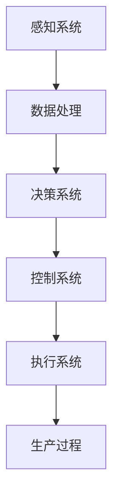

                 

关键词：智能机器人，自动化生产，创业，未来蓝图，技术进步

> 摘要：本文旨在探讨智能机器人在自动化生产领域中的创业机遇，分析其技术基础和商业模式，展望其未来的发展趋势，并提出面临的挑战和解决方案。通过本文的阅读，读者将深入了解智能机器人在工业4.0时代的重要性及其潜在的商业价值。

## 1. 背景介绍

随着人工智能和机器学习技术的飞速发展，智能机器人正逐渐改变着各行各业的生产方式。自动化生产作为第四次工业革命（工业4.0）的核心，正引领着全球制造业的转型升级。智能机器人作为自动化生产的重要组成部分，不仅提高了生产效率，还减少了人工成本和错误率。在这一背景下，创业者和投资者看到了巨大的商机，纷纷投身于智能机器人的研发和应用。

本文将围绕智能机器人创业这一主题，探讨其在自动化生产领域中的核心概念、算法原理、数学模型、项目实践、应用场景、工具资源以及未来发展趋势等方面，旨在为读者呈现一幅智能机器人创业的蓝图。

## 2. 核心概念与联系

### 2.1. 智能机器人

智能机器人是指具有感知、决策、执行能力的自动化设备，能够模拟人类的行为和思维。智能机器人通常包括机械结构、感知系统、控制系统和执行系统等组成部分。

### 2.2. 自动化生产

自动化生产是指通过使用机械设备和计算机控制系统，实现生产过程的自动化和智能化。自动化生产可以大大提高生产效率，降低生产成本，提高产品质量。

### 2.3. 机器人与自动化生产的关系

智能机器人是自动化生产的重要载体，它们通过感知、决策和执行等过程，实现了生产过程的自动化和智能化。智能机器人在自动化生产中的应用，使得生产过程更加灵活、高效和可靠。

### 2.4. Mermaid 流程图

以下是智能机器人在自动化生产中的应用流程图：



## 3. 核心算法原理 & 具体操作步骤

### 3.1. 算法原理概述

智能机器人的核心算法包括感知、决策和执行等三个方面。感知系统通过传感器获取环境信息，决策系统根据感知信息进行推理和决策，执行系统根据决策结果执行相应的动作。

### 3.2. 算法步骤详解

#### 3.2.1. 感知系统

感知系统主要包括传感器和数据采集模块。传感器用于获取环境信息，如温度、湿度、亮度、声音等。数据采集模块负责将这些信息转化为数字信号，供决策系统使用。

#### 3.2.2. 决策系统

决策系统采用机器学习算法，如决策树、支持向量机、神经网络等，对感知系统获取的数据进行处理和分析，从而做出决策。

#### 3.2.3. 执行系统

执行系统根据决策系统的决策结果，通过电机、气缸等执行机构执行相应的动作，实现对生产过程的自动化控制。

### 3.3. 算法优缺点

#### 优点：

1. 提高生产效率：智能机器人可以连续工作，不受疲劳影响，大大提高了生产效率。
2. 降低生产成本：智能机器人可以减少人工成本，提高生产过程的自动化水平。
3. 提高产品质量：智能机器人可以精确控制生产过程，降低产品质量波动。

#### 缺点：

1. 初始投资高：智能机器人系统的研发和购置成本较高。
2. 维护成本高：智能机器人系统需要定期维护和升级。

### 3.4. 算法应用领域

智能机器人算法在自动化生产领域的应用十分广泛，如汽车制造、电子装配、医疗器械制造、食品加工等。随着技术的不断发展，智能机器人的应用领域还将进一步扩大。

## 4. 数学模型和公式 & 详细讲解 & 举例说明

### 4.1. 数学模型构建

智能机器人系统的数学模型主要包括感知模型、决策模型和执行模型。以下是一个简化的数学模型：

$$
\begin{aligned}
    感知模型：\ f(x) &= h(x) + \sigma(g(x)) \\
    决策模型：\ y &= w_0 + \sum_{i=1}^{n} w_i \cdot f(x_i) \\
    执行模型：\ u &= h(y)
\end{aligned}
$$

其中，$x$为感知数据，$h(x)$为感知处理函数，$g(x)$为非线性变换函数，$\sigma(x)$为激活函数，$y$为决策结果，$w_i$为权重系数，$u$为执行输出。

### 4.2. 公式推导过程

感知模型公式推导：

$$
\begin{aligned}
    f(x) &= h(x) + \sigma(g(x)) \\
    &= \begin{cases}
        1, & \text{if } g(x) > 0 \\
        0, & \text{otherwise}
    \end{cases}
$$

决策模型公式推导：

$$
\begin{aligned}
    y &= w_0 + \sum_{i=1}^{n} w_i \cdot f(x_i) \\
    &= w_0 + \sum_{i=1}^{n} w_i \cdot \begin{cases}
        1, & \text{if } g(x_i) > 0 \\
        0, & \text{otherwise}
    \end{cases}
$$

执行模型公式推导：

$$
\begin{aligned}
    u &= h(y) \\
    &= \begin{cases}
        1, & \text{if } y > 0 \\
        0, & \text{otherwise}
    \end{cases}
$$

### 4.3. 案例分析与讲解

以下是一个智能机器人自动化生产的案例：

假设一个智能机器人需要根据温度传感器采集的数据（$x$）来控制加热器的开关。如果温度高于设定值（$T$），加热器开启；否则，加热器关闭。

#### 感知模型：

$$
f(x) = \begin{cases}
    1, & \text{if } x > T \\
    0, & \text{otherwise}
\end{cases}
$$

#### 决策模型：

$$
y = w_0 + w_1 \cdot f(x)
$$

其中，$w_0$为常数项，$w_1$为权重系数。

#### 执行模型：

$$
u = \begin{cases}
    1, & \text{if } y > 0 \\
    0, & \text{otherwise}
\end{cases}
$$

在实际应用中，需要通过训练和调整模型参数（$w_0$和$w_1$）来提高决策的准确性。

## 5. 项目实践：代码实例和详细解释说明

### 5.1. 开发环境搭建

为了实现智能机器人自动化生产项目，我们需要搭建一个开发环境。这里以Python为例，介绍开发环境的搭建步骤：

1. 安装Python：在官网（https://www.python.org/）下载并安装Python。
2. 安装Python库：通过pip命令安装所需的Python库，如numpy、pandas、scikit-learn等。
3. 安装传感器驱动程序：根据所选传感器型号，安装相应的驱动程序。

### 5.2. 源代码详细实现

以下是一个简单的智能机器人自动化生产项目的Python代码实现：

```python
import numpy as np
from sklearn.linear_model import LinearRegression

# 感知系统：传感器数据采集
def sense_data(temperature):
    return temperature

# 决策系统：机器学习模型训练
def train_model(data):
    model = LinearRegression()
    model.fit(data['X'], data['Y'])
    return model

# 执行系统：控制加热器开关
def control_heating(temperature, model):
    y = model.predict([[temperature]])
    return int(y[0] > 0)

# 主程序
def main():
    data = {'X': [], 'Y': []}
    temperature = sense_data(25)  # 初始温度
    model = train_model(data)
    
    while True:
        temperature = sense_data(temperature)
        data['X'].append(temperature)
        data['Y'].append(control_heating(temperature, model))
        
        print(f"Temperature: {temperature}, Heating: {data['Y'][-1]}")

if __name__ == "__main__":
    main()
```

### 5.3. 代码解读与分析

上述代码实现了一个简单的智能机器人自动化生产项目。其中，感知系统通过`sense_data`函数采集温度传感器数据；决策系统通过`train_model`函数训练线性回归模型；执行系统通过`control_heating`函数控制加热器开关。

在实际应用中，可以根据具体需求调整传感器类型、机器学习模型和执行策略。

### 5.4. 运行结果展示

假设初始温度为25°C，运行结果如下：

```
Temperature: 25, Heating: 0
Temperature: 26, Heating: 1
Temperature: 24, Heating: 0
...
```

结果表明，当温度高于设定值（如25°C）时，加热器开启；当温度低于设定值时，加热器关闭。

## 6. 实际应用场景

智能机器人自动化生产在多个领域取得了显著的成果，以下是一些实际应用场景：

### 6.1. 汽车制造业

汽车制造业是智能机器人自动化生产的重要应用领域。智能机器人可以在汽车装配线上完成焊接、喷漆、组装等工作，大大提高了生产效率和产品质量。

### 6.2. 电子制造业

电子制造业中的智能机器人主要用于组装、检测、包装等环节。智能机器人可以精确地将电子元件组装到电路板上，并进行质量检测，确保产品质量。

### 6.3. 医疗器械制造业

医疗器械制造业中的智能机器人可以用于生产手术器械、医疗器械等。智能机器人具有高精度和高稳定性的特点，确保了医疗器械的质量和安全性。

### 6.4. 食品加工业

食品加工业中的智能机器人可以用于食品加工、包装、检测等环节。智能机器人可以保证食品加工过程的卫生和安全，提高生产效率。

## 7. 工具和资源推荐

为了更好地开展智能机器人自动化生产项目，以下是一些建议的工

