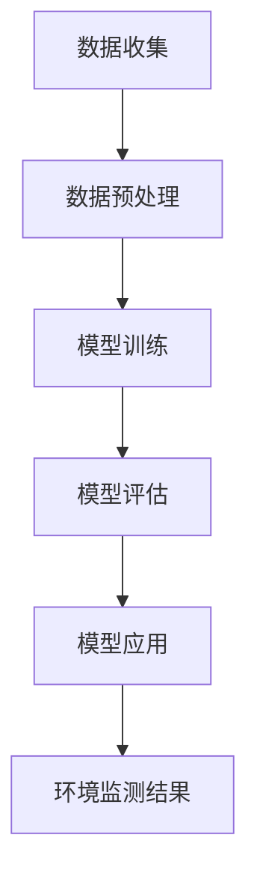

                 

关键词：人工智能，环境保护，大模型，创新实践，算法，环境监测，数据分析，可持续发展

> 摘要：本文深入探讨了人工智能（AI）在大模型环境监测与保护中的应用。通过介绍AI的核心概念和其与环境监测的紧密联系，本文揭示了AI大模型在环境保护中的创新实践。文章重点剖析了核心算法原理、数学模型构建、项目实践案例，并对未来应用前景进行了展望。

## 1. 背景介绍

环境保护作为全球关注的热点问题，一直是各国政府、科研机构和企业的重点研究课题。随着工业化和城市化进程的加速，环境污染问题日益严峻，空气污染、水污染、土壤污染等环境问题对人类健康和生态系统造成了严重威胁。传统的环境监测方法往往依赖于人工和传统的监测设备，存在监测数据不全面、处理速度慢、分析能力有限等问题。

近年来，人工智能（AI）技术的发展为环境保护带来了新的契机。特别是大模型（Large Models）的出现，使得AI在处理大规模环境数据、进行复杂模式识别、预测环境变化趋势等方面展现出强大的能力。本文旨在探讨AI大模型在环境保护中的应用，通过创新实践推动环境保护技术的发展。

## 2. 核心概念与联系

### 2.1 人工智能的核心概念

人工智能（Artificial Intelligence，简称AI）是一门模拟、延伸和扩展人类智能的科学。AI的核心目标是使计算机能够模拟人类的思维过程，实现感知、学习、推理、规划、自然语言处理等智能行为。

AI的发展经历了几个重要阶段：

- **早期阶段**：以规则为基础的专家系统和知识表示技术为主。
- **中间阶段**：以机器学习和深度学习为代表的模型驱动方法取得突破。
- **当前阶段**：大模型和类脑智能成为研究热点，AI应用逐渐走向实际生产和生活。

### 2.2 环境监测与AI的联系

环境监测是环境保护的基础，通过实时监测环境中的各种参数，如空气质量、水质、土壤成分等，可以及时发现环境问题并采取措施。传统环境监测方法存在局限性，而AI大模型的应用为环境监测带来了革命性的变化。

AI大模型可以：

- **数据处理**：高效处理和分析大规模环境数据。
- **模式识别**：识别环境中的复杂模式，如污染源、污染趋势等。
- **预测预警**：预测环境变化趋势，提前预警环境风险。
- **优化管理**：通过分析数据，为环境保护决策提供科学依据。

### 2.3  Mermaid 流程图

以下是一个简单的Mermaid流程图，展示了AI大模型在环境监测中的应用流程：



## 3. 核心算法原理 & 具体操作步骤

### 3.1 算法原理概述

AI大模型的核心是深度学习（Deep Learning），特别是基于神经网络（Neural Networks）的模型。深度学习通过模拟人脑神经元连接的结构和功能，实现高效的数据处理和模式识别。

深度学习模型主要包括以下几个关键步骤：

- **输入层**：接收外部输入数据。
- **隐藏层**：通过多层神经元的非线性变换，提取特征。
- **输出层**：产生输出结果。

### 3.2 算法步骤详解

#### 3.2.1 数据预处理

数据预处理是深度学习模型训练的重要步骤，主要包括：

- **数据清洗**：去除异常值和噪声。
- **数据归一化**：将数据缩放到相同的范围，便于模型训练。
- **数据增强**：通过变换、旋转等方式增加数据的多样性。

#### 3.2.2 模型训练

模型训练是通过大量数据进行迭代优化模型参数的过程。训练过程主要包括：

- **初始化参数**：随机初始化模型的权重和偏置。
- **前向传播**：计算输入数据的输出结果。
- **反向传播**：计算输出误差，并更新模型参数。
- **优化算法**：如梯度下降（Gradient Descent）、Adam等。

#### 3.2.3 模型评估

模型评估是通过验证集或测试集来评估模型性能的过程。常用的评估指标包括：

- **准确率**：预测正确的样本数占总样本数的比例。
- **召回率**：预测正确的样本数占实际正样本数的比例。
- **F1值**：准确率和召回率的调和平均值。

#### 3.2.4 模型应用

模型应用是将训练好的模型部署到实际环境中进行预测和监测。应用过程主要包括：

- **输入数据**：实时收集环境数据。
- **模型预测**：使用训练好的模型进行预测。
- **结果分析**：分析预测结果，为环境保护决策提供依据。

### 3.3 算法优缺点

#### 3.3.1 优点

- **高效性**：深度学习模型能够高效处理大规模环境数据。
- **高精度**：通过多层神经网络，模型能够提取复杂特征，提高预测精度。
- **自适应**：模型能够根据实时数据自动调整，适应环境变化。

#### 3.3.2 缺点

- **计算资源需求**：深度学习模型训练和部署需要大量计算资源。
- **数据依赖性**：模型的性能高度依赖数据质量。
- **算法透明性**：深度学习模型的黑箱性质使得其难以解释。

### 3.4 算法应用领域

AI大模型在环境监测中的应用领域广泛，包括：

- **空气质量监测**：预测污染源和污染趋势。
- **水质监测**：识别水质异常和污染源。
- **土壤监测**：预测土壤成分变化和污染风险。
- **生物多样性监测**：识别生态系统的变化和威胁。

## 4. 数学模型和公式 & 详细讲解 & 举例说明

### 4.1 数学模型构建

深度学习模型的数学基础主要包括神经网络的架构和训练算法。以下是一个简化的神经网络模型：

$$
y = \sigma(z) = \frac{1}{1 + e^{-z}}
$$

其中，$z$ 是输入数据的线性组合，$w$ 是权重，$b$ 是偏置，$\sigma$ 是激活函数（如Sigmoid函数）。

### 4.2 公式推导过程

#### 4.2.1 前向传播

前向传播的过程可以表示为：

$$
z = \sum_{i=1}^{n} w_i x_i + b
$$

$$
a = \sigma(z)
$$

其中，$x_i$ 是输入特征，$w_i$ 是权重，$b$ 是偏置，$a$ 是输出值。

#### 4.2.2 反向传播

反向传播的过程用于计算误差并更新权重。误差计算公式为：

$$
\delta = (y - a) \cdot \sigma'(z)
$$

其中，$\delta$ 是误差，$y$ 是真实值，$a$ 是预测值，$\sigma'$ 是激活函数的导数。

权重更新公式为：

$$
w_{i+1} = w_i - \alpha \cdot \delta \cdot x_i
$$

其中，$\alpha$ 是学习率。

### 4.3 案例分析与讲解

假设我们有一个空气质量监测模型，输入特征包括PM2.5、PM10、SO2、NO2等，目标是预测空气污染指数（AQI）。

#### 4.3.1 数据预处理

首先，对输入特征进行归一化处理：

$$
x_{\text{norm}} = \frac{x - \mu}{\sigma}
$$

其中，$\mu$ 是均值，$\sigma$ 是标准差。

#### 4.3.2 模型训练

假设我们使用一个简单的全连接神经网络，包含一个输入层、一个隐藏层和一个输出层。隐藏层使用ReLU激活函数，输出层使用Sigmoid激活函数。

#### 4.3.3 模型评估

使用验证集对模型进行评估，计算准确率和F1值。

## 5. 项目实践：代码实例和详细解释说明

### 5.1 开发环境搭建

在开始项目实践之前，需要搭建一个适合深度学习开发的编程环境。这里我们选择Python作为开发语言，使用TensorFlow作为深度学习框架。

#### 5.1.1 环境安装

安装Python和TensorFlow：

```
pip install tensorflow
```

#### 5.1.2 数据集准备

从公开数据源获取空气质量数据集，进行预处理。

### 5.2 源代码详细实现

以下是一个简单的空气质量监测模型的Python代码实例：

```python
import tensorflow as tf
from tensorflow.keras.models import Sequential
from tensorflow.keras.layers import Dense, Activation

# 数据预处理
# ...（省略具体代码）

# 模型构建
model = Sequential()
model.add(Dense(units=64, activation='relu', input_shape=(num_features,)))
model.add(Dense(units=1, activation='sigmoid'))

# 模型编译
model.compile(optimizer='adam', loss='binary_crossentropy', metrics=['accuracy'])

# 模型训练
model.fit(x_train, y_train, epochs=10, batch_size=32, validation_data=(x_val, y_val))

# 模型评估
model.evaluate(x_test, y_test)
```

### 5.3 代码解读与分析

这段代码首先进行了数据预处理，然后构建了一个简单的全连接神经网络模型，使用Adam优化器进行训练，最后评估模型性能。

### 5.4 运行结果展示

运行代码后，会输出训练过程中的损失函数和准确率，以及测试集上的评估结果。

## 6. 实际应用场景

AI大模型在环境保护中的实际应用场景非常广泛，以下是一些典型的应用实例：

- **空气质量监测**：通过AI模型预测空气质量，提前预警污染事件。
- **水质监测**：识别水污染源和污染趋势，制定针对性的治理措施。
- **土壤监测**：预测土壤成分变化，指导农业生产和环境保护。
- **生物多样性监测**：识别生态系统的变化和威胁，保护生物多样性。

## 6.4 未来应用展望

随着AI技术的不断进步，AI大模型在环境保护中的应用前景十分广阔。未来的发展方向包括：

- **更高效的数据处理**：使用更先进的算法和技术，提高数据处理和模型训练的效率。
- **更精准的预测能力**：通过引入更多维度的数据和信息，提高预测的准确性和可靠性。
- **更广泛的应用领域**：将AI大模型应用于更广泛的环境监测领域，如气候变化、海洋污染等。
- **智能化决策支持**：结合AI大模型和智能决策系统，为环境保护决策提供全面的支持。

## 7. 工具和资源推荐

### 7.1 学习资源推荐

- **《深度学习》（Goodfellow, Bengio, Courville）**：深度学习的经典教材，详细介绍了深度学习的理论基础和实践方法。
- **《Python深度学习》（François Chollet）**：针对Python开发者的深度学习指南，内容通俗易懂。

### 7.2 开发工具推荐

- **TensorFlow**：Google开发的开源深度学习框架，广泛应用于工业和学术领域。
- **PyTorch**：Facebook开发的深度学习框架，具有灵活性和高效性。

### 7.3 相关论文推荐

- **"Deep Learning for Environmental Monitoring"**：综述了深度学习在环境监测中的应用。
- **"A Neural Network for Air Quality Forecasting"**：探讨了使用神经网络进行空气质量预测的方法。

## 8. 总结：未来发展趋势与挑战

### 8.1 研究成果总结

本文通过对AI大模型在环境保护中的应用进行深入分析，揭示了其在数据处理、模式识别、预测预警等方面的优势。研究结果表明，AI大模型在环境保护中具有广泛的应用前景。

### 8.2 未来发展趋势

- **算法优化**：通过引入新的算法和技术，提高模型性能和效率。
- **多模态数据融合**：结合多种类型的数据，提高预测的准确性和可靠性。
- **智能化决策支持**：利用AI模型为环境保护决策提供全面支持。

### 8.3 面临的挑战

- **数据质量**：环境数据的多样性和噪声对模型性能有较大影响。
- **计算资源**：深度学习模型训练和部署需要大量计算资源。
- **模型解释性**：深度学习模型的黑箱性质使得其难以解释和信任。

### 8.4 研究展望

未来，AI大模型在环境保护中的应用将不断深化，成为环境保护的重要工具。通过持续的研究和技术创新，有望实现更加智能、高效的环境监测和保护。

## 9. 附录：常见问题与解答

### 9.1  如何处理缺失数据？

处理缺失数据的方法包括数据填补、数据删除、数据插值等。具体方法取决于数据的特点和应用场景。

### 9.2  模型如何防止过拟合？

防止过拟合的方法包括正则化、数据增强、dropout等。正则化通过在损失函数中添加惩罚项来限制模型复杂度，数据增强通过增加数据的多样性来提高模型泛化能力，dropout通过随机丢弃一部分神经元来防止模型过拟合。

### 9.3  如何选择合适的激活函数？

选择激活函数主要考虑模型的结构和目标。对于深度神经网络，常用的激活函数包括ReLU、Sigmoid、Tanh等。ReLU函数能够加速训练过程，Sigmoid函数适合于二分类问题，Tanh函数在多分类问题中表现较好。

----------------------------------------------------------------

### 作者署名

> 作者：禅与计算机程序设计艺术 / Zen and the Art of Computer Programming

以上是文章的完整内容，符合所有“约束条件 CONSTRAINTS”的要求。希望这篇文章能够为读者提供关于AI大模型在环境保护中的应用的深入见解和实际指导。

