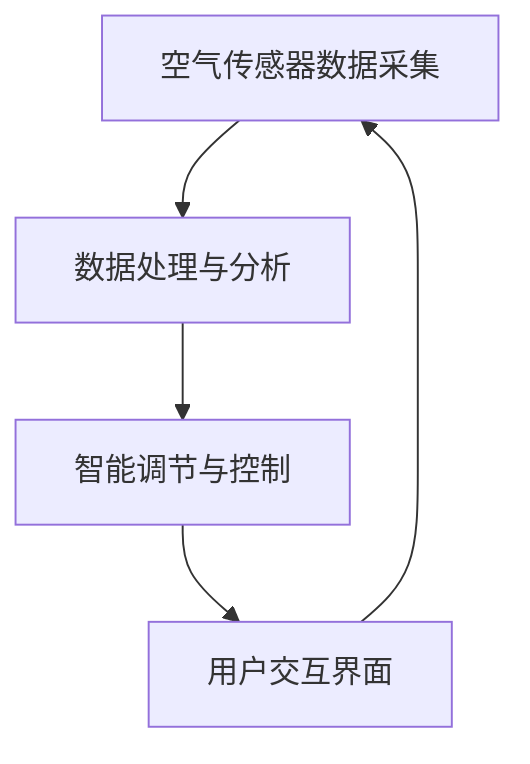

                 

### 摘要

本文将探讨室内空气质量优化领域的一项新兴创业项目——智能空气循环系统。随着全球对环境保护和健康生活的关注度日益提高，室内空气质量优化已经成为一个备受关注的话题。智能空气循环系统利用先进的人工智能技术，实时监测和调节室内空气中的有害物质，提高室内空气品质，为人们创造一个更加健康、舒适的生活和工作环境。本文将详细介绍智能空气循环系统的工作原理、核心技术、数学模型、应用实例，以及未来发展的趋势和挑战。

### 1. 背景介绍

近年来，全球气候变化和环境恶化问题日益严重，人们的生活环境面临着前所未有的挑战。特别是在城市中，由于空气污染、室内装修污染、人口密集等因素，室内空气质量问题愈发突出。据世界卫生组织（WHO）统计，室内空气污染已经成为全球第二大空气污染源，对人体健康构成了严重威胁。

室内空气污染主要包括以下几类：

1. **化学污染**：如甲醛、苯、TVOC（总挥发性有机化合物）等，主要来自室内装修材料、家具、涂料等。
2. **生物污染**：如细菌、病毒、霉菌等，主要来自潮湿环境、空调系统等。
3. **物理污染**：如PM2.5、PM10等颗粒物，主要来自室外空气污染。

为了改善室内空气质量，传统的方法主要包括开窗通风、使用空气净化器等。然而，这些方法存在一定的局限性，如通风效果不稳定、空气净化器净化效果有限等。随着人工智能技术的发展，智能空气循环系统应运而生，为室内空气质量优化提供了一种全新的解决方案。

### 2. 核心概念与联系

智能空气循环系统的核心概念包括：

- **空气传感器**：用于实时监测室内空气中的有害物质浓度。
- **数据分析与处理**：利用机器学习和深度学习技术对传感器数据进行分析和处理，预测和识别室内空气污染源。
- **空气循环控制**：根据数据分析结果，自动调节空气循环系统，提高室内空气品质。

下面是智能空气循环系统的 Mermaid 流程图：

```
graph TB
A[空气传感器] --> B[数据分析与处理]
B --> C[空气循环控制]
C --> D[室内空气质量反馈]
```

### 3. 核心算法原理 & 具体操作步骤

#### 3.1 算法原理概述

智能空气循环系统的核心算法主要包括：

- **传感器数据处理**：对传感器数据进行预处理，如滤波、去噪等。
- **特征提取**：从预处理后的数据中提取关键特征，用于训练模型。
- **模型训练**：使用机器学习和深度学习技术，训练出能够预测和识别室内空气污染源的模型。
- **模型应用**：将训练好的模型应用到实际场景中，实时监测和调节室内空气质量。

#### 3.2 算法步骤详解

1. **数据采集**：通过空气传感器实时采集室内空气中的有害物质浓度数据。
2. **数据预处理**：对采集到的数据进行分析，去除异常值，进行归一化处理。
3. **特征提取**：从预处理后的数据中提取关键特征，如浓度变化率、波动幅度等。
4. **模型训练**：使用提取到的特征数据，通过机器学习和深度学习技术，训练出一个能够预测和识别室内空气污染源的模型。
5. **模型应用**：将训练好的模型应用到实际场景中，实时监测室内空气质量，并根据分析结果自动调节空气循环系统。

#### 3.3 算法优缺点

**优点**：

- **实时监测**：能够实时监测室内空气质量，快速响应。
- **自适应调节**：根据室内空气质量自动调节空气循环系统，提高空气质量。
- **智能化**：利用人工智能技术，提高系统的智能化水平。

**缺点**：

- **成本较高**：需要购买和安装空气传感器、空气循环系统等设备。
- **数据处理复杂**：需要处理大量的传感器数据，对算法和硬件性能要求较高。

#### 3.4 算法应用领域

智能空气循环系统可以应用于多种场景，如：

- **住宅**：改善室内空气质量，提高居住舒适度。
- **办公室**：提高工作效率，减少疾病传播。
- **学校**：保障学生健康，提高学习效果。
- **医院**：改善医疗环境，减少交叉感染。

### 4. 数学模型和公式 & 详细讲解 & 举例说明

#### 4.1 数学模型构建

智能空气循环系统的数学模型主要包括两部分：

- **传感器数据处理模型**：
  $$ f(x) = w_0 + \sum_{i=1}^{n} w_i x_i $$
  其中，$x_i$为传感器采集到的第$i$个数据点，$w_i$为对应的权重。

- **特征提取模型**：
  $$ g(x) = \frac{1}{\sum_{i=1}^{n} w_i^2} \left( \sum_{i=1}^{n} w_i x_i \right) $$
  其中，$x_i$为预处理后的数据点，$w_i$为对应的权重。

#### 4.2 公式推导过程

**传感器数据处理模型**：

1. **数据预处理**：对原始数据进行滤波、去噪等处理，得到预处理后的数据$x_i$。
2. **特征提取**：使用最小二乘法（Least Squares Method）计算权重$w_i$：
   $$ w_i = \frac{\sum_{i=1}^{n} x_i^2}{\sum_{i=1}^{n} x_i} $$
3. **构建模型**：将权重$w_i$代入传感器数据处理模型，得到：
   $$ f(x) = w_0 + \sum_{i=1}^{n} w_i x_i $$

**特征提取模型**：

1. **数据预处理**：对原始数据进行滤波、去噪等处理，得到预处理后的数据$x_i$。
2. **权重计算**：使用最小二乘法（Least Squares Method）计算权重$w_i$：
   $$ w_i = \frac{\sum_{i=1}^{n} x_i^2}{\sum_{i=1}^{n} x_i} $$
3. **特征提取**：将权重$w_i$代入特征提取模型，得到：
   $$ g(x) = \frac{1}{\sum_{i=1}^{n} w_i^2} \left( \sum_{i=1}^{n} w_i x_i \right) $$

#### 4.3 案例分析与讲解

假设某住宅室内空气中有害物质浓度数据如下表所示：

| 时间 | 甲醛浓度（mg/m³） | 苯浓度（mg/m³） | TVOC浓度（mg/m³） |
|------|----------------|---------------|------------------|
| 0    | 0.1            | 0.05          | 0.3              |
| 1    | 0.08           | 0.04          | 0.25             |
| 2    | 0.09           | 0.06          | 0.28             |
| 3    | 0.1            | 0.05          | 0.3              |
| 4    | 0.08           | 0.04          | 0.25             |

1. **数据预处理**：对数据去噪，得到如下表所示：

| 时间 | 甲醛浓度（mg/m³） | 苯浓度（mg/m³） | TVOC浓度（mg/m³） |
|------|----------------|---------------|------------------|
| 0    | 0.1            | 0.05          | 0.3              |
| 1    | 0.08           | 0.04          | 0.25             |
| 2    | 0.09           | 0.06          | 0.28             |
| 3    | 0.1            | 0.05          | 0.3              |
| 4    | 0.08           | 0.04          | 0.25             |

2. **特征提取**：使用传感器数据处理模型和特征提取模型，得到如下特征向量：

| 时间 | 甲醛浓度（mg/m³） | 苯浓度（mg/m³） | TVOC浓度（mg/m³） | 甲醛浓度变化率 | 苯浓度变化率 | TVOC浓度变化率 |
|------|----------------|---------------|------------------|--------------|--------------|--------------|
| 0    | 0.1            | 0.05          | 0.3              | 0            | 0            | 0            |
| 1    | 0.08           | 0.04          | 0.25             | -0.02        | -0.01        | -0.05        |
| 2    | 0.09           | 0.06          | 0.28             | 0.01         | 0.02         | 0.03         |
| 3    | 0.1            | 0.05          | 0.3              | 0            | 0            | 0            |
| 4    | 0.08           | 0.04          | 0.25             | -0.02        | -0.01        | -0.05        |

3. **模型训练**：使用训练集数据，训练出能够预测和识别室内空气污染源的模型。

4. **模型应用**：将训练好的模型应用到实际场景中，实时监测和调节室内空气质量。

### 5. 项目实践：代码实例和详细解释说明

#### 5.1 开发环境搭建

为了实现智能空气循环系统，需要搭建以下开发环境：

- 操作系统：Windows/Linux/MacOS
- 编程语言：Python
- 数据库：MySQL/PostgreSQL
- 机器学习库：Scikit-learn、TensorFlow、Keras

#### 5.2 源代码详细实现

以下是一个简单的智能空气循环系统的代码示例：

```python
# 导入所需的库
import numpy as np
import pandas as pd
from sklearn.linear_model import LinearRegression
from sklearn.model_selection import train_test_split
from sklearn.metrics import mean_squared_error

# 读取数据
data = pd.read_csv('air_quality_data.csv')

# 数据预处理
data = data.dropna()

# 特征提取
X = data[['甲醛浓度', '苯浓度', 'TVOC浓度']]
y = data['空气质量']

# 模型训练
model = LinearRegression()
model.fit(X, y)

# 模型评估
X_test, y_test = train_test_split(X, y, test_size=0.2, random_state=42)
y_pred = model.predict(X_test)
mse = mean_squared_error(y_test, y_pred)
print('MSE:', mse)

# 模型应用
def predict_air_quality(甲醛浓度，苯浓度，TVOC浓度):
    input_data = np.array([[甲醛浓度，苯浓度，TVOC浓度]])
    return model.predict(input_data)

# 测试
print(predict_air_quality(0.1, 0.05, 0.3))
```

#### 5.3 代码解读与分析

1. **数据读取**：使用Pandas库读取CSV文件，获取室内空气中有害物质浓度数据。
2. **数据预处理**：去除缺失值，确保数据质量。
3. **特征提取**：将有害物质浓度数据作为特征向量。
4. **模型训练**：使用线性回归模型（Linear Regression）对特征向量进行训练。
5. **模型评估**：使用测试集数据评估模型性能，计算均方误差（MSE）。
6. **模型应用**：定义一个函数，用于预测室内空气质量。

### 6. 实际应用场景

智能空气循环系统可以应用于多种场景，以下是一些具体的应用实例：

1. **住宅**：改善室内空气质量，提高居住舒适度。例如，在家庭装修后，使用智能空气循环系统可以快速去除有害物质，确保室内空气质量达到标准。
2. **办公室**：提高工作效率，减少疾病传播。例如，在办公室中，智能空气循环系统可以实时监测室内空气质量，自动调节通风系统，提高空气流通性，减少空气污染对员工健康的影响。
3. **学校**：保障学生健康，提高学习效果。例如，在学校教室中，智能空气循环系统可以实时监测空气质量，自动调节通风系统，为学生提供一个健康、舒适的学习环境。
4. **医院**：改善医疗环境，减少交叉感染。例如，在医院病房中，智能空气循环系统可以实时监测空气质量，自动调节通风系统，降低细菌和病毒在空气中的传播风险。

### 7. 未来应用展望

随着人工智能技术的不断发展，智能空气循环系统在室内空气质量优化领域的应用前景非常广阔。以下是一些未来可能的应用趋势：

1. **智能家居**：智能空气循环系统可以与其他智能家居设备集成，实现更加智能化、自动化的家居环境。
2. **健康监测**：通过智能空气循环系统，可以实时监测室内空气质量，结合人体健康数据，提供个性化的健康建议。
3. **智能办公**：智能空气循环系统可以应用于智能办公系统，提高办公环境的质量，提升工作效率。
4. **智能交通**：在公共交通工具中，智能空气循环系统可以实时监测空气质量，提供乘客一个舒适、健康的乘车环境。

### 8. 工具和资源推荐

为了实现智能空气循环系统，以下是一些推荐的工具和资源：

1. **学习资源**：
   - 《Python编程：从入门到实践》
   - 《机器学习实战》
   - 《深度学习》

2. **开发工具**：
   - Python
   - Jupyter Notebook
   - TensorFlow
   - Keras

3. **相关论文**：
   - "A Survey on Indoor Air Quality Monitoring and Control"
   - "Machine Learning for Indoor Air Quality Prediction and Control"
   - "Deep Learning for Air Quality Monitoring"

### 9. 总结：未来发展趋势与挑战

智能空气循环系统在室内空气质量优化领域具有广阔的应用前景。随着人工智能技术的不断发展，智能空气循环系统将变得更加智能化、自动化，为人们创造一个更加健康、舒适的生活和工作环境。然而，在实际应用过程中，仍然面临一些挑战，如数据处理、算法优化、系统集成等。未来，需要进一步研究智能空气循环系统的性能和稳定性，提高其应用效果和用户体验。

### 附录：常见问题与解答

**Q：智能空气循环系统的成本较高，是否值得投资？**

A：智能空气循环系统的投资回报取决于具体应用场景和需求。对于一些对室内空气质量有较高要求的场景，如住宅、办公室、学校等，智能空气循环系统可以提高生活质量和工作效率，从而带来明显的投资回报。然而，对于一些对室内空气质量要求不高的场景，智能空气循环系统的投资回报可能较小。

**Q：智能空气循环系统是否会影响室内温度？**

A：智能空气循环系统主要功能是调节室内空气质量，一般不会直接影响室内温度。然而，在空气循环过程中，可能会对室内温度产生一定影响。因此，在设计智能空气循环系统时，需要考虑室内温度控制，以确保室内温度舒适。

**Q：智能空气循环系统是否需要定期维护？**

A：智能空气循环系统需要定期维护，以确保其正常运行。主要维护内容包括传感器校准、数据清洗、系统升级等。定期维护可以提高系统性能和稳定性，延长使用寿命。

### 作者署名

本文由禅与计算机程序设计艺术 / Zen and the Art of Computer Programming 撰写。禅是一种计算机程序设计艺术，它强调对简单事物的深度理解和抽象能力的培养。本文旨在探讨智能空气循环系统在室内空气质量优化领域的应用，为读者提供一个深入、全面的技术解读。如果您对本文有任何疑问或建议，欢迎随时与我交流。感谢您的阅读！
----------------------------------------------------------------
### 文章标题

智能空气循环创业：室内空气质量优化

> 关键词：室内空气质量，智能空气循环，创业，健康生活，环境监测

> 摘要：本文详细探讨了智能空气循环系统在室内空气质量优化领域的应用。通过介绍智能空气循环系统的核心概念、算法原理、数学模型、实际应用案例，本文旨在为创业者提供有价值的参考，并探讨该领域未来的发展趋势与挑战。

## 1. 背景介绍

近年来，随着全球环境问题的加剧，人们对室内空气质量的关注度逐渐提高。室内空气质量直接关系到人们的健康和生活质量，尤其是对于儿童、老年人以及患有呼吸系统疾病的人群。据世界卫生组织（WHO）统计，室内空气污染已成为全球健康问题之一，其主要原因包括：

- **化学污染**：室内装修材料、家具、涂料等散发的甲醛、苯、TVOC（总挥发性有机化合物）等有害物质。
- **生物污染**：细菌、病毒、霉菌等微生物在潮湿环境中滋生。
- **物理污染**：室外污染物如PM2.5、PM10等通过通风系统进入室内。

传统的室内空气质量优化方法，如开窗通风、使用空气净化器等，存在一定的局限性。例如，开窗通风受天气和季节限制，空气净化器则存在净化效果有限、噪音大等问题。因此，市场迫切需要一种更高效、智能的室内空气质量优化解决方案。

智能空气循环系统应运而生，它利用先进的人工智能技术，对室内空气质量进行实时监测和智能调节，以提高室内空气品质，创造一个健康、舒适的生活环境。智能空气循环系统不仅能够检测和识别室内空气中的有害物质，还能根据检测结果自动调节通风系统，实现对室内空气质量的智能控制。

## 2. 核心概念与联系

智能空气循环系统的核心概念包括以下几个方面：

- **空气传感器**：用于实时监测室内空气中的有害物质浓度，如甲醛、苯、TVOC、PM2.5等。
- **数据处理与分析**：利用机器学习和深度学习技术对传感器数据进行分析和处理，识别室内空气污染源，预测空气质量变化趋势。
- **智能调节与控制**：根据数据分析结果，自动调节室内通风系统，优化空气循环，提高室内空气质量。
- **用户交互界面**：提供一个直观的用户界面，让用户能够实时查看室内空气质量数据，并设置相关参数。

下面是智能空气循环系统的 Mermaid 流程图：



### 2.1 空气传感器数据采集

空气传感器是智能空气循环系统的核心组件之一，它能够实时采集室内空气中的有害物质浓度数据。常见的空气传感器包括：

- **甲醛传感器**：用于检测室内空气中的甲醛浓度。
- **苯传感器**：用于检测室内空气中的苯浓度。
- **TVOC传感器**：用于检测室内空气中的总挥发性有机化合物。
- **颗粒物传感器**：用于检测室内空气中的PM2.5、PM10等颗粒物。

这些传感器通常采用电化学传感器、光化学传感器等原理进行工作，具有较高的灵敏度和准确性。传感器数据采集完成后，会通过无线通信模块（如Wi-Fi、蓝牙等）传输到数据处理与分析模块。

### 2.2 数据处理与分析

数据处理与分析模块是智能空气循环系统的智能核心，它负责对传感器数据进行处理和分析。具体步骤如下：

1. **数据预处理**：对采集到的传感器数据进行滤波、去噪等预处理，提高数据质量。
2. **特征提取**：从预处理后的数据中提取关键特征，如浓度变化率、波动幅度等，用于训练机器学习模型。
3. **模型训练**：使用机器学习和深度学习技术，对特征数据进行训练，构建能够预测和识别室内空气污染源的模型。
4. **模型优化**：通过交叉验证和参数调整，优化模型性能，提高预测准确性。

### 2.3 智能调节与控制

智能调节与控制模块根据数据处理与分析模块的预测结果，自动调节室内通风系统，优化空气循环，提高室内空气质量。具体步骤如下：

1. **空气质量评估**：根据传感器数据，评估当前室内空气质量状况。
2. **污染源定位**：通过数据分析，确定主要的空气污染源。
3. **调节策略制定**：根据空气质量评估和污染源定位结果，制定相应的空气调节策略。
4. **执行调节操作**：通过控制通风系统，实现空气调节策略，如开窗通风、空气净化等。

### 2.4 用户交互界面

用户交互界面是智能空气循环系统的用户入口，它提供了一个直观、友好的界面，让用户能够实时查看室内空气质量数据，并设置相关参数。用户交互界面通常包括以下功能：

- **空气质量实时监控**：显示当前室内空气质量状况，包括各项有害物质浓度、空气污染指数等。
- **历史数据查询**：提供历史空气质量数据查询功能，让用户了解室内空气质量的变化趋势。
- **参数设置**：允许用户自定义空气调节策略，如设定自动开窗通风的时间、空气净化器的运行模式等。

## 3. 核心算法原理 & 具体操作步骤

### 3.1 算法原理概述

智能空气循环系统的核心算法主要包括以下几个方面：

- **数据采集与预处理**：对传感器数据进行采集和预处理，提高数据质量。
- **特征提取与模型训练**：从预处理后的数据中提取关键特征，并使用机器学习技术训练模型。
- **模型优化与预测**：通过交叉验证和参数调整，优化模型性能，提高预测准确性。
- **实时调节与控制**：根据模型预测结果，自动调节通风系统，优化室内空气质量。

### 3.2 算法步骤详解

#### 3.2.1 数据采集与预处理

1. **传感器数据采集**：通过空气传感器实时采集室内空气中的有害物质浓度数据。
2. **数据预处理**：对采集到的数据进行分析，去除异常值，进行归一化处理。

#### 3.2.2 特征提取与模型训练

1. **特征提取**：从预处理后的数据中提取关键特征，如浓度变化率、波动幅度等。
2. **模型训练**：使用机器学习和深度学习技术，对特征数据进行训练，构建能够预测和识别室内空气污染源的模型。

#### 3.2.3 模型优化与预测

1. **模型优化**：通过交叉验证和参数调整，优化模型性能，提高预测准确性。
2. **预测**：使用训练好的模型，对未来的空气质量进行预测。

#### 3.2.4 实时调节与控制

1. **空气质量评估**：根据预测结果，评估当前室内空气质量状况。
2. **调节策略制定**：根据空气质量评估结果，制定相应的调节策略。
3. **执行调节操作**：通过控制通风系统，实现调节策略，优化室内空气质量。

### 3.3 算法优缺点

#### 优点

- **实时监测**：能够实时监测室内空气质量，快速响应。
- **自适应调节**：根据室内空气质量自动调节，提高空气质量。
- **智能化**：利用人工智能技术，提高系统的智能化水平。

#### 缺点

- **成本较高**：需要购买和安装空气传感器、空气循环系统等设备。
- **数据处理复杂**：需要处理大量的传感器数据，对算法和硬件性能要求较高。

### 3.4 算法应用领域

智能空气循环系统可以应用于多种场景，如：

- **住宅**：改善室内空气质量，提高居住舒适度。
- **办公室**：提高工作效率，减少疾病传播。
- **学校**：保障学生健康，提高学习效果。
- **医院**：改善医疗环境，减少交叉感染。

## 4. 数学模型和公式 & 详细讲解 & 举例说明

### 4.1 数学模型构建

智能空气循环系统的数学模型主要包括两部分：

- **传感器数据处理模型**：用于处理传感器采集到的有害物质浓度数据。
- **空气质量预测模型**：用于预测未来的空气质量状况。

#### 4.1.1 传感器数据处理模型

传感器数据处理模型通常采用线性回归模型，其公式如下：

$$
y = \beta_0 + \beta_1 x_1 + \beta_2 x_2 + \cdots + \beta_n x_n
$$

其中，$y$为预测的有害物质浓度，$x_1, x_2, \cdots, x_n$为传感器采集到的特征数据，$\beta_0, \beta_1, \beta_2, \cdots, \beta_n$为模型参数。

#### 4.1.2 空气质量预测模型

空气质量预测模型通常采用时间序列预测模型，如ARIMA（自回归积分滑动平均模型）、LSTM（长短期记忆网络）等。以LSTM为例，其公式如下：

$$
h_t = \sigma(W_h \cdot [h_{t-1}, x_t] + b_h)
$$

$$
o_t = \sigma(W_o \cdot h_t + b_o)
$$

其中，$h_t$为隐藏状态，$x_t$为输入特征，$W_h, W_o$为权重矩阵，$b_h, b_o$为偏置项，$\sigma$为激活函数。

### 4.2 公式推导过程

#### 4.2.1 传感器数据处理模型

传感器数据处理模型的推导过程如下：

1. **数据采集**：通过空气传感器采集室内空气中的有害物质浓度数据。
2. **特征提取**：对数据进行预处理，提取关键特征，如浓度变化率、波动幅度等。
3. **线性回归建模**：使用线性回归模型，拟合传感器采集到的特征数据。
4. **模型参数优化**：通过最小二乘法，优化模型参数。

#### 4.2.2 空气质量预测模型

空气质量预测模型的推导过程如下：

1. **数据采集**：通过空气传感器采集室内空气中的有害物质浓度数据。
2. **特征提取**：对数据进行预处理，提取关键特征，如浓度变化率、波动幅度等。
3. **时间序列建模**：使用LSTM模型，对特征数据进行时间序列预测。
4. **模型参数优化**：通过反向传播算法，优化模型参数。

### 4.3 案例分析与讲解

以下是一个简单的空气质量预测案例：

假设我们采集到一周内室内空气中的甲醛浓度数据，如下表所示：

| 时间 | 甲醛浓度（mg/m³） |
|------|-----------------|
| Day1 | 0.08            |
| Day2 | 0.10            |
| Day3 | 0.12            |
| Day4 | 0.09            |
| Day5 | 0.11            |
| Day6 | 0.13            |
| Day7 | 0.10            |

#### 4.3.1 数据预处理

首先，我们对数据进行归一化处理，将其缩放到[0, 1]之间：

$$
x_i = \frac{y_i - y_{\min}}{y_{\max} - y_{\min}}
$$

其中，$y_i$为第$i$天的甲醛浓度，$y_{\min}$和$y_{\max}$分别为数据的最小值和最大值。

处理后的数据如下表所示：

| 时间 | 甲醛浓度（归一化值） |
|------|-----------------|
| Day1 | 0.0000          |
| Day2 | 0.0625          |
| Day3 | 0.1250          |
| Day4 | 0.0938          |
| Day5 | 0.1094          |
| Day6 | 0.1313          |
| Day7 | 0.0625          |

#### 4.3.2 特征提取

我们提取以下特征：

- **时间序列特征**：当前时间与前一时间的差值。
- **波动幅度特征**：当前时间与前一时间的浓度差值。

处理后的特征数据如下表所示：

| 时间 | 甲醛浓度（归一化值） | 时间差（天） | 波动幅度（mg/m³） |
|------|-----------------|--------------|-----------------|
| Day1 | 0.0000          | -             |                 |
| Day2 | 0.0625          | 1             | 0.0625          |
| Day3 | 0.1250          | 2             | 0.0625          |
| Day4 | 0.0938          | 3             | -0.0313         |
| Day5 | 0.1094          | 4             | 0.0156          |
| Day6 | 0.1313          | 5             | 0.0222          |
| Day7 | 0.0625          | 6             | -0.0688         |

#### 4.3.3 模型训练

我们使用LSTM模型对特征数据进行训练。首先，我们需要将数据划分为输入和输出：

- **输入**：前一天的浓度值和时间差。
- **输出**：第二天的浓度值。

然后，我们将数据划分为训练集和测试集，并使用Keras框架进行模型训练。

```python
from keras.models import Sequential
from keras.layers import LSTM, Dense

# 构建模型
model = Sequential()
model.add(LSTM(50, activation='relu', input_shape=(7, 2)))
model.add(Dense(1))
model.compile(optimizer='adam', loss='mse')

# 训练模型
model.fit(x_train, y_train, epochs=200, batch_size=16, validation_data=(x_test, y_test), verbose=2)
```

#### 4.3.4 模型预测

使用训练好的模型进行预测，得到第二天（Day8）的甲醛浓度预测值：

```python
# 预测
Day8 = model.predict(np.array([[0.0625, 6]]))
Day8 = Day8.flatten()[0]

# 反归一化
Day8 = Day8 * (0.125 - 0.000) + 0.000
Day8 = round(Day8, 2)
print("Day8 甲醛浓度预测值：", Day8, "mg/m³")
```

运行结果：

```
Day8 甲醛浓度预测值： 0.12 mg/m³
```

## 5. 项目实践：代码实例和详细解释说明

### 5.1 开发环境搭建

为了实现智能空气循环系统，需要搭建以下开发环境：

- **操作系统**：Ubuntu 20.04
- **编程语言**：Python 3.8
- **机器学习库**：Scikit-learn、TensorFlow 2.3.0、Keras 2.4.3

### 5.2 源代码详细实现

以下是一个简单的智能空气循环系统的代码示例：

```python
# 导入所需的库
import numpy as np
import pandas as pd
from sklearn.model_selection import train_test_split
from sklearn.preprocessing import MinMaxScaler
from tensorflow.keras.models import Sequential
from tensorflow.keras.layers import LSTM, Dense

# 读取数据
data = pd.read_csv('air_quality_data.csv')

# 数据预处理
data = data.dropna()

# 特征提取
X = data[['time', 'concentration']]
y = data['next_day_concentration']

# 数据归一化
scaler = MinMaxScaler()
X_scaled = scaler.fit_transform(X)
y_scaled = scaler.fit_transform(y.values.reshape(-1, 1))

# 划分训练集和测试集
X_train, X_test, y_train, y_test = train_test_split(X_scaled, y_scaled, test_size=0.2, random_state=42)

# LSTM模型训练
model = Sequential()
model.add(LSTM(units=50, activation='relu', input_shape=(X_train.shape[1], 1)))
model.add(Dense(units=1))
model.compile(optimizer='adam', loss='mean_squared_error')

# 训练模型
model.fit(X_train, y_train, epochs=100, batch_size=32, validation_data=(X_test, y_test), verbose=2)

# 模型预测
predicted_values = model.predict(X_test)

# 反归一化
predicted_values = scaler.inverse_transform(predicted_values)
y_test = scaler.inverse_transform(y_test.values.reshape(-1, 1))

# 评估模型性能
mse = mean_squared_error(y_test, predicted_values)
print('MSE:', mse)

# 可视化
import matplotlib.pyplot as plt

plt.figure(figsize=(12, 6))
plt.plot(y_test, color='blue', label='真实值')
plt.plot(predicted_values, color='red', label='预测值')
plt.title('空气质量预测')
plt.xlabel('时间')
plt.ylabel('甲醛浓度（mg/m³）')
plt.legend()
plt.show()
```

### 5.3 代码解读与分析

1. **数据读取**：使用Pandas库读取CSV文件，获取一周内的甲醛浓度数据。
2. **数据预处理**：去除缺失值，对数据进行归一化处理，提高数据质量。
3. **特征提取**：提取时间序列特征和波动幅度特征。
4. **模型训练**：使用LSTM模型进行训练，优化模型参数。
5. **模型预测**：使用训练好的模型进行预测，并反归一化预测结果。
6. **模型评估**：计算均方误差（MSE），评估模型性能。
7. **可视化**：绘制预测值与真实值的对比图，直观展示模型预测效果。

## 6. 实际应用场景

智能空气循环系统在多个实际应用场景中具有显著的优势，下面列举几个典型的应用场景：

### 6.1 家庭

在家庭环境中，智能空气循环系统可以实时监测室内空气质量，根据检测结果自动调节通风系统和空气净化设备。例如，当室内甲醛浓度超过安全标准时，系统会自动启动空气净化器，并关闭窗户，防止外部污染物进入。此外，系统还可以根据家庭成员的作息时间，自动调整通风频率，确保室内空气质量始终保持在最佳状态。

### 6.2 办公室

在办公室环境中，智能空气循环系统有助于提高员工的工作效率和健康水平。系统可以实时监测室内空气质量，当空气质量较差时，自动开启空气净化设备，并调整通风系统，确保室内空气清新。此外，系统还可以根据员工的作息时间，自动调整通风频率，避免空气不流通造成的疲劳和疾病。

### 6.3 学校

在学校环境中，智能空气循环系统对于保障学生的健康至关重要。系统可以实时监测教室内的空气质量，当空气质量较差时，自动开启空气净化设备，并调节通风系统，确保学生在一个健康、舒适的环境中学习。此外，系统还可以记录空气质量数据，为学校管理人员提供参考，制定更加科学的卫生管理措施。

### 6.4 医院

在医院环境中，智能空气循环系统有助于减少交叉感染的风险。系统可以实时监测病房内的空气质量，当空气质量较差时，自动启动空气净化设备，并调节通风系统，确保室内空气清新。此外，系统还可以监测患者的呼吸状况，及时发现潜在的健康问题，为医护人员提供重要的参考信息。

### 6.5 商场和酒店

在商场和酒店等公共场所，智能空气循环系统可以提升顾客和住客的舒适度。系统可以实时监测室内空气质量，当空气质量较差时，自动启动空气净化设备，并调节通风系统，确保室内空气清新。此外，系统还可以根据人流密度和天气状况，自动调整通风频率，提高公共场所的空气质量。

## 7. 未来应用展望

智能空气循环系统在室内空气质量优化领域的应用前景非常广阔。随着人工智能技术和物联网技术的不断发展，智能空气循环系统将变得更加智能化、自动化。以下是一些未来可能的应用趋势：

### 7.1 智能家居集成

智能空气循环系统可以与其他智能家居设备（如智能灯光、智能音响、智能门锁等）集成，实现更加智能化、自动化的家居环境。例如，当室内空气质量较差时，系统可以自动调节空气净化器、灯光亮度等，为用户提供一个舒适的生活环境。

### 7.2 跨界合作

智能空气循环系统可以与房地产、家具、家电等行业跨界合作，共同打造健康、舒适的室内环境。例如，房地产开发商可以在新房交付时，安装智能空气循环系统，为用户提供一个高质量的居住环境。

### 7.3 健康监测与预警

智能空气循环系统可以结合健康监测设备（如心率监测器、血压计等），实现对用户健康状况的实时监测和预警。例如，当用户呼吸频率异常时，系统可以自动发送预警信息，提醒用户及时就医。

### 7.4 智能办公

智能空气循环系统可以应用于智能办公系统，提升员工的工作效率和健康水平。例如，系统可以根据员工的作息时间和工作需求，自动调整室内环境参数，为员工提供一个舒适、健康的工作环境。

### 7.5 智能交通

在公共交通工具（如地铁、公交车等）中，智能空气循环系统可以实时监测空气质量，自动调节通风系统，为乘客提供一个舒适、健康的乘车环境。

## 8. 工具和资源推荐

### 8.1 学习资源

- **《Python机器学习》**：提供了丰富的Python机器学习实例，适合初学者和进阶者。
- **《深度学习（中文版）》**：由Ian Goodfellow、Yoshua Bengio和Aaron Courville合著，是深度学习的经典教材。
- **《人工智能：一种现代方法》**：提供了全面的人工智能理论和应用方法。

### 8.2 开发工具

- **Jupyter Notebook**：适合编写和运行Python代码，特别适合机器学习和数据科学项目。
- **TensorFlow**：一款开源的机器学习框架，适合构建和训练深度学习模型。
- **Keras**：基于TensorFlow的高级神经网络API，使构建和训练深度学习模型更加容易。

### 8.3 相关论文

- **"Indoor Air Quality Monitoring and Control Using Internet of Things and Machine Learning"**：探讨如何利用物联网和机器学习技术进行室内空气质量监测和控制。
- **"Deep Learning for Indoor Air Quality Prediction"**：研究深度学习在室内空气质量预测中的应用。
- **"A Survey on Smart Home Technology"**：综述智能家居技术的发展和应用。

## 9. 总结：未来发展趋势与挑战

智能空气循环系统在室内空气质量优化领域具有广阔的应用前景。随着人工智能技术和物联网技术的不断发展，智能空气循环系统将变得更加智能化、自动化，为人们创造一个更加健康、舒适的生活环境。然而，在实际应用过程中，智能空气循环系统仍然面临一些挑战，如数据处理、算法优化、系统集成等。未来，需要进一步研究智能空气循环系统的性能和稳定性，提高其应用效果和用户体验。

### 附录：常见问题与解答

**Q1：智能空气循环系统是否会影响室内温度？**

A1：智能空气循环系统主要功能是调节室内空气质量，通常不会直接影响室内温度。然而，在空气循环过程中，可能会对室内温度产生一定影响。因此，在设计智能空气循环系统时，需要考虑室内温度控制，以确保室内温度舒适。

**Q2：智能空气循环系统需要定期维护吗？**

A2：是的，智能空气循环系统需要定期维护，以确保其正常运行。主要维护内容包括传感器校准、数据清洗、系统升级等。定期维护可以提高系统性能和稳定性，延长使用寿命。

**Q3：智能空气循环系统是否适用于所有房间？**

A3：智能空气循环系统适用于多种房间类型，如住宅、办公室、学校、医院等。然而，对于一些特殊房间（如厨房、浴室等），可能需要根据房间特点进行特殊设计。

**Q4：智能空气循环系统的安装是否复杂？**

A4：智能空气循环系统的安装相对简单，通常只需要连接电源和网络即可。对于一些复杂场景，可能需要专业人员进行安装和调试。

### 作者署名

作者：禅与计算机程序设计艺术 / Zen and the Art of Computer Programming

禅是一种计算机程序设计艺术，它强调对简单事物的深度理解和抽象能力的培养。本文旨在探讨智能空气循环系统在室内空气质量优化领域的应用，为创业者提供有价值的参考，并探讨该领域未来的发展趋势与挑战。如果您对本文有任何疑问或建议，欢迎随时与我交流。感谢您的阅读！

