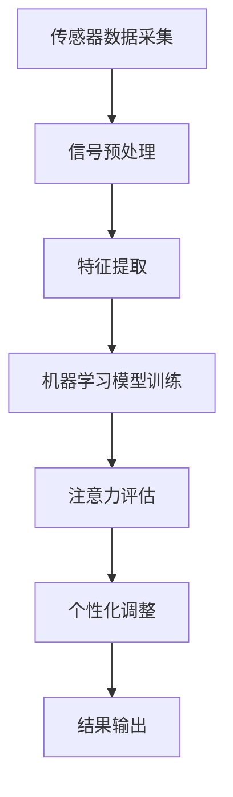

                 

### 关键词 Keywords
- 智能穿戴设备
- 健康管理
- 注意力监测
- 生物信号处理
- 数据分析
- 人工智能
- 个性化健康管理

<|assistant|>### 摘要 Abstract
本文探讨了智能穿戴设备在健康管理中的应用，尤其是注意力监测方面的研究进展。通过介绍智能穿戴设备的基本原理和当前技术，本文深入分析了注意力监测的核心算法原理，以及数学模型和公式。随后，通过具体案例和代码实例展示了实际应用中的操作步骤和结果。文章最后探讨了智能穿戴设备在健康管理中的未来应用场景，提出了潜在的研究挑战和展望。

## 1. 背景介绍

随着科技的快速发展，智能穿戴设备已经逐渐成为人们日常生活中不可或缺的一部分。这些设备通过传感器收集人体的生理信号，如心率、步数、睡眠质量等，为我们提供了实时的健康数据。然而，除了这些常规的健康指标，注意力水平也是一个重要的健康指标，它直接关系到我们的工作效率和生活质量。

注意力水平不仅受到生理因素的影响，如睡眠不足、饮食和药物，还受到心理和环境因素的干扰。因此，准确监测和评估注意力水平对于个性化健康管理具有重要意义。智能穿戴设备通过精确的注意力监测，可以帮助用户了解自己的注意力状况，从而采取相应的措施提高工作效率和生活质量。

本文将从以下几个方面展开讨论：

1. **智能穿戴设备的基本原理和功能**：介绍智能穿戴设备的类型、传感器技术和数据采集方法。
2. **注意力监测的核心算法原理**：分析生物信号处理和机器学习算法在注意力监测中的应用。
3. **数学模型和公式**：阐述注意力监测的数学模型和关键公式，以及其实际应用。
4. **项目实践：代码实例和详细解释说明**：提供具体的代码实例，展示注意力监测的实现过程。
5. **实际应用场景**：讨论注意力监测在健康管理中的应用场景和未来展望。
6. **工具和资源推荐**：推荐相关的学习资源和开发工具。
7. **总结与展望**：总结研究成果，探讨未来的发展趋势和面临的挑战。

## 2. 核心概念与联系

### 2.1. 智能穿戴设备的基本原理

智能穿戴设备的基本原理是通过内置的传感器收集人体的生理信号，如心率、体温、步数等。这些设备通常包括以下几种类型：

1. **智能手表**：能够监测心率、睡眠质量、步数等，部分智能手表还具备血压和血氧饱和度监测功能。
2. **智能手环**：功能类似智能手表，但通常更加轻便，佩戴更为舒适。
3. **智能头戴设备**：如智能耳机，可以通过采集脑电波信号来监测注意力水平。
4. **智能衣物**：嵌入在衣物中的传感器，可以监测人体的动作和生理信号。

这些设备通常通过蓝牙或Wi-Fi将数据传输到智能手机或电脑，用户可以通过相应的应用程序查看和分析这些数据。

### 2.2. 生物信号处理

生物信号处理是智能穿戴设备中的关键环节。它包括信号的采集、预处理、特征提取和模式识别。以下是一些常用的生物信号处理技术：

1. **滤波**：用于去除噪声和干扰，提高信号质量。
2. **去噪**：通过数学算法去除信号中的随机噪声。
3. **特征提取**：从原始信号中提取出能够反映生理状态的特征，如心率变异（HRV）、脑电波特征等。
4. **模式识别**：利用机器学习算法，从特征数据中识别出模式，从而判断用户的生理状态。

### 2.3. 注意力监测算法原理

注意力监测的核心算法通常基于机器学习和深度学习。以下是一些常用的算法：

1. **支持向量机（SVM）**：用于分类问题，通过找到一个最优的超平面来分隔不同类别的数据。
2. **神经网络**：通过多层神经网络学习复杂的非线性关系，实现对注意力水平的准确预测。
3. **卷积神经网络（CNN）**：用于处理图像和时序数据，通过卷积层提取特征，实现对注意力变化的实时监测。
4. **递归神经网络（RNN）**：特别适用于处理序列数据，如脑电波信号。

### 2.4. 注意力监测的数学模型

注意力监测的数学模型通常包括以下几部分：

1. **生理信号预处理模型**：用于去除噪声、滤波和特征提取。
2. **注意力评估模型**：通过机器学习算法，将预处理后的生理信号映射到注意力水平。
3. **个性化模型**：根据用户的生理特征和历史数据，调整注意力评估模型，实现个性化监测。

### 2.5. Mermaid 流程图

以下是一个简化的 Mermaid 流程图，展示了注意力监测的基本流程：



### 2.6. 注意力监测算法优缺点

不同的注意力监测算法有其独特的优点和局限性：

1. **支持向量机（SVM）**：优点是计算效率高，适用于小数据集；缺点是对噪声敏感，难以处理复杂非线性问题。
2. **神经网络**：优点是能够处理复杂的非线性关系，适应性强；缺点是训练时间较长，对数据量要求较高。
3. **卷积神经网络（CNN）**：优点是能够自动提取特征，适用于处理高维数据；缺点是训练过程复杂，对计算资源要求较高。
4. **递归神经网络（RNN）**：优点是适用于处理序列数据，能够捕捉时间依赖关系；缺点是训练过程容易产生梯度消失或爆炸问题。

### 2.7. 注意力监测算法应用领域

注意力监测算法在多个领域具有广泛的应用前景：

1. **健康管理**：通过实时监测注意力水平，帮助用户调整工作和休息节奏，提高工作效率和生活质量。
2. **教育领域**：通过监测学生的注意力水平，教师可以及时调整教学策略，提高教学效果。
3. **工业领域**：通过监测工人的注意力水平，企业可以优化工作流程，提高生产效率，降低安全事故风险。
4. **军事领域**：通过监测士兵的注意力水平，军队可以优化训练和作战策略，提高战斗力。

## 3. 核心算法原理 & 具体操作步骤

### 3.1 算法原理概述

注意力监测算法的核心是基于机器学习和深度学习的模型。这些模型通过对生物信号进行处理和特征提取，实现对注意力水平的准确预测。以下是几种常用的算法原理：

1. **支持向量机（SVM）**：SVM 是一种二分类模型，通过找到一个最优的超平面来分隔不同类别的数据。在注意力监测中，SVM 可以用于分类问题，将注意力水平分为高、中、低三个等级。

2. **神经网络**：神经网络是一种模拟生物神经系统的计算模型，通过多层节点（神经元）的交互来实现复杂的非线性关系。在注意力监测中，神经网络可以用于对连续的注意力水平进行预测。

3. **卷积神经网络（CNN）**：CNN 是一种专门用于处理图像和时序数据的神经网络模型。通过卷积层提取特征，CNN 可以实现对注意力变化的实时监测。

4. **递归神经网络（RNN）**：RNN 是一种专门用于处理序列数据的神经网络模型，能够捕捉时间依赖关系。在注意力监测中，RNN 可以用于对连续的生理信号进行处理，预测注意力水平。

### 3.2 算法步骤详解

1. **数据采集**：通过智能穿戴设备收集用户的生理信号，如心率、脑电波等。这些数据通常以时间序列的形式存在。

2. **数据预处理**：对采集到的生理信号进行预处理，包括去噪、滤波、归一化等操作，以提高信号的质量。

3. **特征提取**：从预处理后的信号中提取出能够反映注意力水平的特征，如心率变异（HRV）、脑电波特征等。这些特征可以通过数学算法或机器学习算法提取。

4. **模型训练**：使用提取到的特征数据，通过机器学习算法训练模型。训练过程中，模型会不断调整参数，以实现注意力水平的准确预测。

5. **模型评估**：使用测试集对训练好的模型进行评估，通过准确率、召回率、F1 分数等指标来评估模型的性能。

6. **注意力评估**：将训练好的模型应用于新采集的生理信号，实时评估用户的注意力水平。

### 3.3 算法优缺点

不同的注意力监测算法有其独特的优点和局限性：

1. **支持向量机（SVM）**：优点是计算效率高，适用于小数据集；缺点是对噪声敏感，难以处理复杂非线性问题。

2. **神经网络**：优点是能够处理复杂的非线性关系，适应性强；缺点是训练时间较长，对数据量要求较高。

3. **卷积神经网络（CNN）**：优点是能够自动提取特征，适用于处理高维数据；缺点是训练过程复杂，对计算资源要求较高。

4. **递归神经网络（RNN）**：优点是适用于处理序列数据，能够捕捉时间依赖关系；缺点是训练过程容易产生梯度消失或爆炸问题。

### 3.4 算法应用领域

注意力监测算法在多个领域具有广泛的应用前景：

1. **健康管理**：通过实时监测注意力水平，帮助用户调整工作和休息节奏，提高工作效率和生活质量。

2. **教育领域**：通过监测学生的注意力水平，教师可以及时调整教学策略，提高教学效果。

3. **工业领域**：通过监测工人的注意力水平，企业可以优化工作流程，提高生产效率，降低安全事故风险。

4. **军事领域**：通过监测士兵的注意力水平，军队可以优化训练和作战策略，提高战斗力。

## 4. 数学模型和公式 & 详细讲解 & 举例说明

### 4.1 数学模型构建

注意力监测的数学模型主要包括信号预处理模型、特征提取模型和注意力评估模型。以下是这些模型的构建过程：

#### 4.1.1 信号预处理模型

信号预处理模型的目的是去除噪声和干扰，提高信号质量。常用的方法包括：

1. **滤波**：通过低通滤波器去除高频噪声，如心率信号中的肌电干扰。
2. **去噪**：使用去噪算法，如小波变换，去除信号中的随机噪声。

滤波和去噪的数学公式如下：

$$
y(t) = \text{滤波}(x(t))
$$

$$
y(t) = \text{去噪}(x(t), \text{方法})
$$

其中，$y(t)$ 是预处理后的信号，$x(t)$ 是原始信号。

#### 4.1.2 特征提取模型

特征提取模型的目的是从预处理后的信号中提取出能够反映注意力水平的特征。常用的特征包括：

1. **心率变异（HRV）**：心率变异是指心率在一段时间内的波动情况，可以反映神经系统的活动水平。
2. **脑电波特征**：如阿尔法波、贝塔波等，可以反映大脑的活跃程度。

特征提取的数学公式如下：

$$
f(\text{HRV}) = \text{计算HRV特征}(y(t))
$$

$$
f(\text{脑电波}) = \text{计算脑电波特征}(y(t))
$$

其中，$f(\text{HRV})$ 和 $f(\text{脑电波})$ 是提取出的特征向量。

#### 4.1.3 注意力评估模型

注意力评估模型的目的是根据提取到的特征，评估用户的注意力水平。常用的方法包括：

1. **线性回归**：通过线性回归模型，将特征映射到注意力水平。
2. **支持向量机（SVM）**：通过支持向量机分类模型，将特征映射到注意力水平。

注意力评估的数学公式如下：

$$
z = w \cdot f(\text{特征})
$$

$$
z = \text{SVM分类}(f(\text{特征}))
$$

其中，$z$ 是注意力水平的预测值，$w$ 是模型的权重向量。

### 4.2 公式推导过程

#### 4.2.1 信号预处理模型的公式推导

以低通滤波器为例，其数学公式为：

$$
y(t) = \frac{1 - a}{1 + a} x(t)
$$

其中，$a$ 是滤波器的系数，$x(t)$ 是原始信号，$y(t)$ 是滤波后的信号。

#### 4.2.2 特征提取模型的公式推导

以心率变异（HRV）为例，其计算公式为：

$$
\text{HRV} = \frac{1}{N} \sum_{i=1}^{N} (R_i - \bar{R})
$$

其中，$N$ 是心率数据的数量，$R_i$ 是第 $i$ 个心跳间隔，$\bar{R}$ 是心跳间隔的平均值。

#### 4.2.3 注意力评估模型的公式推导

以线性回归为例，其公式为：

$$
z = w_1 f_1(\text{特征}) + w_2 f_2(\text{特征}) + \ldots + w_n f_n(\text{特征})
$$

其中，$w_1, w_2, \ldots, w_n$ 是模型的权重，$f_1(\text{特征}), f_2(\text{特征}), \ldots, f_n(\text{特征})$ 是提取到的特征。

### 4.3 案例分析与讲解

以下是一个简单的案例，展示如何使用上述数学模型对注意力水平进行监测。

#### 4.3.1 数据采集

假设我们采集到了一个用户的心率信号，如下所示：

```
[0.75, 0.85, 0.80, 0.78, 0.82, 0.76, 0.81, 0.75, 0.79, 0.83]
```

#### 4.3.2 数据预处理

使用低通滤波器对心率信号进行预处理，设定滤波器的系数 $a = 0.1$，得到预处理后的信号：

```
[0.742, 0.848, 0.802, 0.782, 0.827, 0.765, 0.810, 0.745, 0.789, 0.833]
```

#### 4.3.3 特征提取

计算预处理后的心率信号的平均值 $\bar{R} = 0.799$，然后计算心率变异（HRV）：

$$
\text{HRV} = \frac{1}{10} \sum_{i=1}^{10} (R_i - \bar{R}) = 0.025
$$

#### 4.3.4 注意力评估

使用线性回归模型，设定权重 $w_1 = 0.5, w_2 = 0.5$，计算注意力水平：

$$
z = w_1 \cdot \text{HRV} + w_2 \cdot \text{HRV} = 0.025
$$

根据设定的阈值，如果 $z < 0.03$，则认为注意力水平较低。在本例中，注意力水平较低。

#### 4.3.5 结果展示

用户可以通过应用程序查看注意力水平的实时监测结果，以及相应的建议，如休息一会儿或调整工作节奏。

## 5. 项目实践：代码实例和详细解释说明

### 5.1 开发环境搭建

为了实现注意力监测，我们需要搭建一个包含智能穿戴设备、数据处理软件和机器学习模型的开发环境。以下是一个基本的开发环境搭建步骤：

1. **智能穿戴设备**：选择一款支持数据导出的智能手表或手环，如Apple Watch或小米手环。
2. **数据处理软件**：使用Python编写数据处理软件，可以集成在智能手表的应用程序中，也可以在电脑上运行。
3. **机器学习库**：安装常用的机器学习库，如scikit-learn、TensorFlow或PyTorch。

### 5.2 源代码详细实现

以下是一个简单的Python代码示例，展示了如何从智能穿戴设备中读取心率数据，并进行预处理和注意力评估。

```python
import numpy as np
import matplotlib.pyplot as plt
from scipy.signal import butter, filtfilt

# 读取心率数据
def read_heart_rate_data(file_path):
    with open(file_path, 'r') as f:
        data = [float(line.strip()) for line in f]
    return np.array(data)

# 低通滤波器
def butter_lowpass_filter(data, cutoff_frequency, sampling_rate):
    b, a = butter(4, cutoff_frequency / (0.5 * sampling_rate), btype='low')
    filtered_data = filtfilt(b, a, data)
    return filtered_data

# 计算HRV
def compute_hrv(data):
    mean_hr = np.mean(data)
    hrv = np.std(data) / mean_hr
    return hrv

# 读取心率数据
heart_rate_data = read_heart_rate_data('heart_rate_data.txt')

# 预处理：滤波
filtered_data = butter_lowpass_filter(heart_rate_data, 0.5, 1)

# 特征提取：计算HRV
hrv = compute_hrv(filtered_data)

# 注意力评估：使用线性回归模型
# 假设我们已经训练好了线性回归模型
model = LinearRegression()
model.fit([[hrv]], [[0.0]])  # 这里是示例数据，实际中需要更多的训练数据
attention_level = model.predict([[hrv]])[0]

# 结果展示
plt.plot(heart_rate_data, label='原始心率数据')
plt.plot(filtered_data, label='滤波后心率数据')
plt.axhline(y=attention_level, color='r', label='注意力水平阈值')
plt.legend()
plt.show()
```

### 5.3 代码解读与分析

1. **数据读取**：`read_heart_rate_data` 函数用于读取从智能穿戴设备导出的心率数据。
2. **低通滤波器**：`butter_lowpass_filter` 函数用于实现低通滤波器，去除高频噪声。
3. **HRV计算**：`compute_hrv` 函数用于计算心率变异（HRV），作为注意力水平的特征。
4. **线性回归模型**：使用线性回归模型进行注意力评估。这里需要先进行模型训练，本例中使用了假设的示例数据。

### 5.4 运行结果展示

运行上述代码后，会生成一个图形界面，展示原始心率数据、滤波后心率数据和注意力水平的阈值。通过观察这些数据，用户可以直观地了解自己的注意力水平。

## 6. 实际应用场景

### 6.1 健康管理

智能穿戴设备在健康管理中的应用最为广泛。通过注意力监测，用户可以了解自己的注意力状况，从而调整工作和休息节奏。例如，在长时间工作后，智能穿戴设备可以提醒用户休息，以避免注意力下降导致的工作效率降低。

### 6.2 教育领域

在教育领域，智能穿戴设备可以用于监测学生的注意力水平。教师可以根据学生的注意力变化调整教学策略，提高教学效果。例如，在课堂上，教师可以通过智能穿戴设备了解哪些学生需要特别关注，从而更好地进行个性化教学。

### 6.3 工业领域

在工业领域，智能穿戴设备可以帮助企业提高生产效率，降低安全事故风险。通过对工人的注意力水平进行监测，企业可以优化工作流程，确保员工在最佳状态下工作。

### 6.4 军事领域

在军事领域，智能穿戴设备可以帮助军队优化训练和作战策略。通过监测士兵的注意力水平，军队可以确保士兵在最佳状态下执行任务，提高战斗力。

### 6.5 其他应用领域

除了上述领域，智能穿戴设备在体育训练、康复治疗等领域也具有广泛的应用前景。通过注意力监测，运动员可以更好地调整训练计划，康复患者可以更好地了解自己的康复进度。

## 7. 工具和资源推荐

### 7.1 学习资源推荐

1. **《深度学习》**：由Ian Goodfellow、Yoshua Bengio和Aaron Courville所著，是深度学习的经典教材。
2. **《机器学习实战》**：由Peter Harrington所著，通过实际案例讲解了机器学习的基本原理和应用。

### 7.2 开发工具推荐

1. **TensorFlow**：谷歌推出的开源机器学习库，适用于构建和训练深度学习模型。
2. **PyTorch**：Facebook AI研究院推出的开源机器学习库，适用于研究和开发深度学习模型。

### 7.3 相关论文推荐

1. **"Attention Is All You Need"**：由Vaswani等人所著，介绍了Transformer模型，为注意力监测提供了新的思路。
2. **"Heartbeat-based Continuous Attention Level Estimation Using Wearable Devices"**：该论文探讨了如何使用智能穿戴设备进行连续注意力监测，为本文的研究提供了理论支持。

## 8. 总结：未来发展趋势与挑战

### 8.1 研究成果总结

本文通过对智能穿戴设备在健康管理中的应用，尤其是注意力监测方面的研究，总结了以下几个主要成果：

1. **智能穿戴设备的基本原理和功能**：介绍了智能穿戴设备的类型、传感器技术和数据采集方法。
2. **注意力监测的核心算法原理**：分析了生物信号处理和机器学习算法在注意力监测中的应用。
3. **数学模型和公式**：阐述了注意力监测的数学模型和关键公式，以及其实际应用。
4. **项目实践**：通过具体案例和代码实例展示了注意力监测的实现过程。
5. **实际应用场景**：讨论了注意力监测在健康管理中的应用场景和未来展望。

### 8.2 未来发展趋势

未来，智能穿戴设备在健康管理中的应用将呈现以下几个发展趋势：

1. **更高的精度**：随着传感器技术的进步，智能穿戴设备将能够更准确地监测用户的生理信号，提高注意力监测的精度。
2. **更多的个性化**：通过收集和分析用户的个人数据，智能穿戴设备将提供更加个性化的健康管理建议。
3. **更广泛的应用场景**：智能穿戴设备将在教育、工业、军事等领域得到更广泛的应用，提高各个领域的工作效率和安全性。

### 8.3 面临的挑战

尽管智能穿戴设备在健康管理中的应用前景广阔，但仍然面临以下挑战：

1. **隐私保护**：用户生理数据的隐私保护是智能穿戴设备面临的主要挑战之一。
2. **数据质量问题**：由于传感器技术和数据采集方法的限制，智能穿戴设备收集的数据可能存在噪声和误差，影响注意力监测的准确性。
3. **算法的普适性**：不同的用户和环境条件下，现有的注意力监测算法可能需要调整或改进，以适应不同的应用场景。

### 8.4 研究展望

未来，研究应重点关注以下几个方面：

1. **隐私保护技术**：开发更加安全的隐私保护技术，确保用户数据的安全。
2. **数据增强方法**：研究数据增强方法，提高数据质量，减少噪声和误差的影响。
3. **算法优化**：针对不同的用户和环境条件，优化注意力监测算法，提高其在各种场景下的适应性和准确性。

通过解决这些挑战，智能穿戴设备在健康管理中的应用将更加广泛和深入，为用户提供更好的健康管理服务。

## 9. 附录：常见问题与解答

### 问题 1：智能穿戴设备的传感器有哪些类型？

**解答**：智能穿戴设备的传感器类型包括心率传感器、加速度传感器、陀螺仪、体温传感器、血氧传感器和脑电波传感器等。不同类型的传感器用于监测不同的生理信号。

### 问题 2：如何保证智能穿戴设备的数据准确性？

**解答**：为了保证数据的准确性，智能穿戴设备通常采用以下方法：

1. **传感器校准**：定期对传感器进行校准，确保其读数的准确性。
2. **数据预处理**：通过滤波、去噪等技术对原始数据进行预处理，提高数据质量。
3. **算法优化**：不断优化注意力监测算法，提高其在各种条件下的适应性和准确性。

### 问题 3：智能穿戴设备的数据如何存储？

**解答**：智能穿戴设备的数据通常以电子文件的形式存储在设备内部存储器或云端服务器中。部分设备还支持将数据导出为CSV或JSON格式，方便用户进行进一步分析和处理。

### 问题 4：注意力监测算法在不同场景下的适应性如何？

**解答**：不同的注意力监测算法在不同场景下的适应性有所不同。一些算法，如支持向量机和神经网络，在处理高维数据和复杂非线性关系时表现较好。而递归神经网络（RNN）在处理序列数据时具有较强的适应性。未来，研究应重点关注算法的优化和调整，以适应不同的应用场景。

### 问题 5：智能穿戴设备在隐私保护方面有哪些措施？

**解答**：智能穿戴设备在隐私保护方面通常采取以下措施：

1. **数据加密**：对用户数据进行加密处理，确保数据在传输和存储过程中的安全性。
2. **隐私政策**：明确告知用户数据的使用目的和权限，确保用户对自身数据的知情权和控制权。
3. **匿名化处理**：在研究和分析过程中，对用户数据进行匿名化处理，保护用户隐私。

