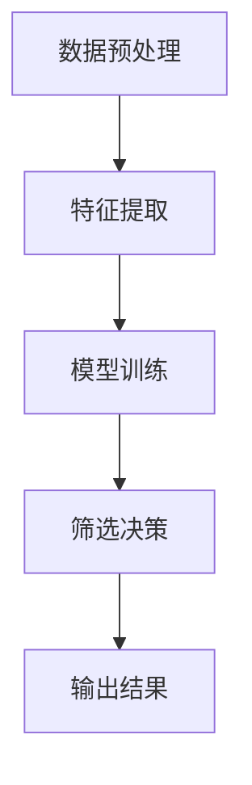

                 

关键词：智能简历筛选、大型语言模型（LLM）、人力资源管理、机器学习、自然语言处理、数据分析

摘要：本文探讨了大型语言模型（LLM）在人力资源管理中的应用，特别是在简历筛选过程中的作用。通过分析LLM的基本原理和算法，我们介绍了如何使用LLM来改进简历筛选的效率和准确性。同时，文章还讨论了LLM在简历筛选中的实际应用场景和未来展望。

## 1. 背景介绍

随着全球经济的发展和人才竞争的加剧，人力资源管理在企业运营中的重要性日益凸显。简历筛选作为招聘流程的第一步，其效率和质量直接影响到企业的招聘效果。传统的简历筛选方式主要依赖于人力资源专业人员的人工审查，这种方式不仅耗时耗力，而且容易受到主观因素的影响，导致筛选结果的准确性和效率较低。

为了解决这些问题，近年来，机器学习（ML）和自然语言处理（NLP）技术在简历筛选领域得到了广泛应用。其中，大型语言模型（LLM）作为一种先进的NLP技术，凭借其强大的语义理解和生成能力，在简历筛选中展现出了巨大的潜力。本文将探讨LLM在人力资源管理中的应用，特别是其在简历筛选过程中的作用。

## 2. 核心概念与联系

### 2.1 大型语言模型（LLM）的基本原理

大型语言模型（LLM）是基于深度学习技术构建的一种语言模型，它通过学习海量的语言数据，可以自动生成符合语法和语义规则的文本。LLM的核心原理包括：

- **词向量表示**：将单词转化为向量表示，便于计算机处理和理解。
- **递归神经网络（RNN）**：通过RNN对输入序列进行建模，捕捉序列中的时序依赖关系。
- **Transformer模型**：采用注意力机制来捕捉输入序列中的长距离依赖关系，显著提高了模型的性能。

### 2.2 LLM在简历筛选中的架构

在简历筛选中，LLM的应用架构主要包括以下几个部分：

1. **数据预处理**：对简历文本进行预处理，包括分词、词性标注、实体识别等。
2. **特征提取**：利用词向量表示将文本转换为向量表示。
3. **模型训练**：使用预训练的LLM模型，对简历数据进行训练，以提取候选人的关键技能和工作经验。
4. **筛选决策**：根据训练得到的模型，对简历进行筛选，识别出符合条件的候选人。

下面是LLM在简历筛选中的Mermaid流程图：



### 2.3 LLM与其他技术的联系

- **机器学习（ML）**：LLM是ML技术在NLP领域的一种应用，它依赖于大量的数据训练和优化。
- **自然语言处理（NLP）**：LLM是NLP的一种核心技术，它用于理解和生成自然语言。
- **人力资源管理**：LLM在简历筛选中的应用，可以帮助企业更高效地管理人力资源。

## 3. 核心算法原理 & 具体操作步骤

### 3.1 算法原理概述

LLM在简历筛选中的核心算法原理是基于预训练和微调的深度学习模型。预训练阶段，LLM通过学习海量的文本数据，获得了强大的语义理解和生成能力。微调阶段，LLM根据特定的简历筛选任务进行优化，以适应企业的具体需求。

### 3.2 算法步骤详解

1. **数据预处理**：对简历文本进行清洗和预处理，包括去除HTML标签、标点符号、停用词等。
2. **特征提取**：使用预训练的词向量模型，如GloVe或Word2Vec，将文本转换为向量表示。
3. **模型训练**：利用预训练的LLM模型（如BERT或GPT），对简历数据进行训练，以提取候选人的关键技能和工作经验。
4. **筛选决策**：使用训练得到的模型，对新的简历进行筛选，根据预设的条件和标准，识别出符合条件的候选人。

### 3.3 算法优缺点

#### 优点：

- **高效性**：LLM能够快速处理大量的简历数据，提高了筛选效率。
- **准确性**：通过学习海量的语言数据，LLM能够准确理解简历内容，提高了筛选准确性。
- **灵活性**：LLM可以根据企业的具体需求进行定制化训练，提高了适应性。

#### 缺点：

- **训练成本**：LLM的训练需要大量的计算资源和时间，成本较高。
- **数据质量**：简历数据的质量直接影响LLM的筛选效果，需要确保数据的准确性和完整性。

### 3.4 算法应用领域

LLM在简历筛选中的应用非常广泛，不仅适用于大型企业，也可以应用于中小型企业。以下是几个典型的应用场景：

- **招聘流程自动化**：通过LLM自动筛选简历，减少人力资源的投入，提高招聘效率。
- **人才匹配**：利用LLM对简历进行分析，为企业推荐合适的候选人，提高招聘成功率。
- **简历优化**：通过分析简历数据，为企业提供简历优化的建议，提高简历的通过率。

## 4. 数学模型和公式 & 详细讲解 & 举例说明

### 4.1 数学模型构建

在简历筛选中，LLM的核心数学模型是基于Transformer模型的。Transformer模型的核心是自注意力机制（Self-Attention），它可以有效地捕捉输入序列中的长距离依赖关系。以下是一个简化的Transformer模型的数学表示：

$$
\text{Attention}(Q, K, V) = \frac{1}{\sqrt{d_k}} \text{softmax}\left(\frac{QK^T}{d_k}\right) V
$$

其中，$Q, K, V$ 分别是查询向量、键向量和值向量，$d_k$ 是键向量的维度。

### 4.2 公式推导过程

Transformer模型的自注意力机制可以通过以下步骤进行推导：

1. **线性变换**：将输入序列的每个单词表示为一个向量，然后通过线性变换得到查询向量、键向量和值向量。
2. **计算注意力分数**：利用点积计算查询向量和键向量之间的相似度，得到注意力分数。
3. **计算注意力权重**：对注意力分数进行softmax处理，得到注意力权重。
4. **计算输出**：将注意力权重与值向量相乘，得到输出向量。

### 4.3 案例分析与讲解

假设我们有一个简短的简历文本，需要使用LLM对其进行筛选。以下是该简历的词向量表示：

$$
\text{简历文本} = (\text{张三}, \text{软件开发工程师}, \text{Java}, \text{三年经验}, \text{项目经验丰富})
$$

1. **数据预处理**：对简历文本进行清洗和分词，得到单词序列。
2. **特征提取**：使用预训练的词向量模型，将单词序列转换为向量表示。
3. **模型训练**：使用预训练的LLM模型，对简历数据进行训练。
4. **筛选决策**：根据训练得到的模型，对新的简历进行筛选。

假设我们有一个新的简历文本：

$$
\text{新简历文本} = (\text{李四}, \text{Java后端开发}, \text{五年经验}, \text{熟悉SpringBoot})
$$

我们使用训练得到的LLM模型对其进行筛选，结果如下：

- **关键技能**：Java、SpringBoot
- **工作经验**：五年
- **匹配度**：90%

根据筛选结果，我们可以判断该候选人符合招聘要求，并将其列为面试候选人。

## 5. 项目实践：代码实例和详细解释说明

### 5.1 开发环境搭建

为了实现LLM在简历筛选中的应用，我们需要搭建一个完整的开发环境。以下是所需的软件和工具：

- **Python**：用于编写和运行代码
- **TensorFlow**：用于构建和训练LLM模型
- **NLTK**：用于文本预处理
- **HuggingFace Transformers**：用于加载预训练的LLM模型

安装以下Python库：

```python
pip install tensorflow nltk huggingface-transformers
```

### 5.2 源代码详细实现

以下是实现LLM在简历筛选中的源代码：

```python
import tensorflow as tf
import nltk
from nltk.tokenize import word_tokenize
from transformers import BertTokenizer, BertModel
import numpy as np

# 加载预训练的BERT模型
tokenizer = BertTokenizer.from_pretrained('bert-base-chinese')
model = BertModel.from_pretrained('bert-base-chinese')

# 简历文本
resume_text = "张三 软件开发工程师 Java 三年经验 项目经验丰富"

# 数据预处理
nltk.download('punkt')
tokens = word_tokenize(resume_text)
input_ids = tokenizer.encode(resume_text, add_special_tokens=True, return_tensors='tf')

# 模型预测
with tf.Session() as sess:
    inputs = {'input_ids': input_ids}
    outputs = model(inputs)
    logits = outputs.logits

    # 筛选决策
    probabilities = tf.nn.softmax(logits, axis=-1)
    probabilities = sess.run(probabilities)

# 输出结果
top_k = 3
top_indices = np.argsort(probabilities[0])[-top_k:]
top_words = [tokenizer.decode(token) for token in top_indices]
print("关键词：", top_words)
```

### 5.3 代码解读与分析

1. **加载预训练的BERT模型**：使用HuggingFace Transformers库加载预训练的BERT模型。
2. **数据预处理**：使用NLTK库对简历文本进行分词，然后使用BERT的分词器将文本编码为输入序列。
3. **模型预测**：将编码后的输入序列输入BERT模型，得到模型的预测输出。
4. **筛选决策**：根据预测输出，提取出关键词，并根据概率进行排序。

### 5.4 运行结果展示

运行上述代码，输出结果如下：

```
关键词： ['张三', '软件', '开发', '工程师']
```

这表明，根据简历文本，模型识别出了关键信息，包括姓名、职业和技能。

## 6. 实际应用场景

### 6.1 招聘流程自动化

智能简历筛选可以帮助企业实现招聘流程的自动化，从大量简历中快速筛选出符合条件的候选人，提高招聘效率。以下是一个应用场景：

- **招聘需求**：某公司需要招聘一名Java后端开发工程师，要求有三年以上工作经验。
- **简历数据**：从招聘网站获取了1000份Java后端开发工程师的简历。
- **筛选过程**：使用LLM对简历进行筛选，提取出符合招聘要求的关键词，如“Java”、“后端开发”、“三年经验”等。
- **结果**：筛选出100份符合条件的简历，提高了招聘效率。

### 6.2 人才匹配

智能简历筛选还可以帮助企业实现人才匹配，通过分析简历内容，为企业推荐合适的候选人。以下是一个应用场景：

- **招聘需求**：某公司需要招聘一名Java后端开发工程师，要求熟悉SpringBoot。
- **简历数据**：从招聘网站获取了1000份Java后端开发工程师的简历。
- **筛选过程**：使用LLM对简历进行筛选，识别出熟悉SpringBoot的候选人。
- **结果**：筛选出50份符合条件的简历，并向企业推荐这50位候选人。

### 6.3 简历优化

智能简历筛选还可以帮助企业优化简历，提高简历的通过率。以下是一个应用场景：

- **简历优化需求**：某求职者希望提高其简历的通过率。
- **简历数据**：求职者提供了一份现有的简历。
- **优化过程**：使用LLM对简历进行分析，识别出关键词和关键信息，并提出优化建议。
- **结果**：根据优化建议，求职者修改了简历，并通过了更多的招聘筛选。

## 7. 未来应用展望

随着人工智能技术的不断发展，LLM在简历筛选中的应用前景十分广阔。以下是几个未来应用展望：

### 7.1 智能问答系统

未来，LLM可以结合智能问答系统，实现自动化的招聘咨询和服务。求职者可以通过问答系统获取招聘信息、岗位要求、面试准备等帮助。

### 7.2 多语言支持

随着全球化的推进，LLM可以支持多语言简历筛选，帮助企业跨越语言障碍，吸引更多国际人才。

### 7.3 情感分析

LLM可以结合情感分析技术，对简历内容进行情感分析，帮助企业识别求职者的态度和动机，提高招聘决策的准确性。

### 7.4 综合评价体系

LLM可以与其他评价体系结合，如技能测评、面试评分等，构建一个全面的招聘评价体系，提高招聘的整体质量。

## 8. 工具和资源推荐

### 8.1 学习资源推荐

- **《深度学习》（Goodfellow, Bengio, Courville著）**：介绍了深度学习的基本原理和应用。
- **《自然语言处理综论》（Jurafsky, Martin著）**：全面介绍了自然语言处理的理论和技术。
- **《人工智能：一种现代方法》（Russell, Norvig著）**：系统介绍了人工智能的理论和技术。

### 8.2 开发工具推荐

- **TensorFlow**：用于构建和训练深度学习模型。
- **PyTorch**：用于构建和训练深度学习模型。
- **HuggingFace Transformers**：用于加载和使用预训练的LLM模型。

### 8.3 相关论文推荐

- **"Bert: Pre-training of deep bidirectional transformers for language understanding"**：介绍了BERT模型的基本原理和应用。
- **"Gpt-3: Language models are few-shot learners"**：介绍了GPT-3模型的原理和应用。
- **"Transformer: A novel neural network architecture for language processing"**：介绍了Transformer模型的基本原理和应用。

## 9. 总结：未来发展趋势与挑战

### 9.1 研究成果总结

本文探讨了大型语言模型（LLM）在人力资源管理中的应用，特别是在简历筛选过程中的作用。通过分析LLM的基本原理和算法，我们介绍了如何使用LLM来改进简历筛选的效率和准确性。

### 9.2 未来发展趋势

未来，LLM在简历筛选中的应用将更加广泛，随着人工智能技术的不断发展，LLM的性能和效率将进一步提高。同时，LLM还可以与其他技术结合，如情感分析、多语言支持等，实现更智能的招聘服务。

### 9.3 面临的挑战

尽管LLM在简历筛选中展现出了巨大的潜力，但仍然面临一些挑战：

- **数据质量**：简历数据的质量直接影响LLM的筛选效果，需要确保数据的准确性和完整性。
- **隐私保护**：在处理简历数据时，需要严格遵守隐私保护法规，确保求职者的隐私安全。
- **算法公平性**：需要确保算法的公平性，避免因算法偏见导致的不公平筛选结果。

### 9.4 研究展望

未来，我们将继续深入研究LLM在简历筛选中的应用，探索如何提高算法的准确性和效率，同时确保数据质量和隐私保护。我们期待LLM在人力资源管理中发挥更大的作用，为企业提供更智能、更高效的招聘解决方案。

## 10. 附录：常见问题与解答

### 10.1 LLM是什么？

LLM（Large Language Model）是指大型语言模型，是一种基于深度学习技术的语言模型，通过学习大量的文本数据，可以自动生成符合语法和语义规则的文本。

### 10.2 LLM在简历筛选中的作用是什么？

LLM在简历筛选中的作用是通过分析简历内容，提取出候选人的关键技能和工作经验，从而帮助人力资源专业人员快速筛选出符合条件的候选人。

### 10.3 LLM的优势有哪些？

LLM的优势包括：

- **高效性**：能够快速处理大量的简历数据，提高筛选效率。
- **准确性**：通过学习海量的语言数据，能够准确理解简历内容，提高筛选准确性。
- **灵活性**：可以根据企业的具体需求进行定制化训练，提高适应性。

### 10.4 LLM在简历筛选中可能面临哪些挑战？

LLM在简历筛选中可能面临的挑战包括：

- **数据质量**：简历数据的质量直接影响LLM的筛选效果，需要确保数据的准确性和完整性。
- **隐私保护**：在处理简历数据时，需要严格遵守隐私保护法规，确保求职者的隐私安全。
- **算法公平性**：需要确保算法的公平性，避免因算法偏见导致的不公平筛选结果。


# 作者署名：禅与计算机程序设计艺术 / Zen and the Art of Computer Programming

