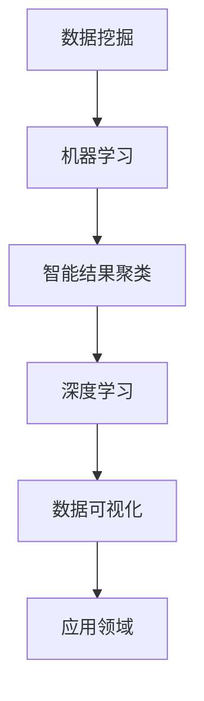

                 

关键词：智能结果聚类，AI组织能力，数据挖掘，算法分析，机器学习，深度学习，应用场景，未来展望

> 摘要：随着人工智能技术的快速发展，智能结果聚类成为数据挖掘和机器学习中的重要研究方向。本文将深入探讨智能结果聚类的核心概念、算法原理、数学模型及其在实际应用中的重要性，并对其未来发展趋势和面临的挑战进行展望。

## 1. 背景介绍

在信息爆炸的时代，如何从海量数据中提取出有用的信息成为数据挖掘领域的一个核心问题。智能结果聚类作为一种无监督学习的方法，通过对数据进行自动分类，帮助用户发现数据中的潜在模式和关联。智能结果聚类技术在许多领域都有着广泛的应用，如市场分析、社交网络分析、生物信息学等。

智能结果聚类的核心目标是按照一定的规则和标准将数据集划分为多个类别，从而使得同一类别的数据具有更高的相似度，而不同类别的数据具有更大的差异。这种方法在处理复杂和大规模数据时，尤其显示出其强大的组织和分析能力。

## 2. 核心概念与联系

为了更好地理解智能结果聚类，我们需要明确以下几个核心概念：

1. **数据集（Dataset）**：数据集是聚类算法的输入，通常包含多个数据点。
2. **数据点（Data Point）**：数据点是一个具体的对象，由多个属性或特征组成。
3. **相似度（Similarity）**：相似度是用来衡量两个数据点之间相似程度的指标。
4. **类别（Cluster）**：类别是由一组具有相似性的数据点组成的集合。

在理解了这些核心概念后，我们还需要了解聚类算法与数据挖掘、机器学习等领域的联系。

### Mermaid 流程图

下面是一个简单的 Mermaid 流程图，展示了聚类算法与其他领域的关系：



## 3. 核心算法原理 & 具体操作步骤

### 3.1 算法原理概述

智能结果聚类的核心算法主要包括以下几种：

1. **K-Means 算法**：通过迭代优化算法，将数据点划分到不同的聚类中心。
2. **层次聚类算法**：根据数据点之间的相似度，逐步构建一个层次结构，从而实现聚类。
3. **DBSCAN 算法**：基于密度和连接性的聚类算法，可以检测出不同形状和大小的聚类。

### 3.2 算法步骤详解

以 K-Means 算法为例，其具体步骤如下：

1. **初始化聚类中心**：随机选择 K 个数据点作为初始聚类中心。
2. **分配数据点**：计算每个数据点到各个聚类中心的距离，将其分配到最近的聚类中心。
3. **更新聚类中心**：重新计算每个聚类中心的坐标，使其成为当前聚类内所有数据点的平均值。
4. **迭代优化**：重复步骤 2 和步骤 3，直到聚类中心不再发生显著变化。

### 3.3 算法优缺点

K-Means 算法具有以下优点：

- **计算效率高**：迭代优化过程中只需要计算距离和平均值，计算复杂度相对较低。
- **结果直观**：聚类结果清晰，易于理解。

但 K-Means 算法也存在以下缺点：

- **对初始聚类中心敏感**：初始聚类中心的选择对最终聚类结果有很大影响。
- **不适合发现非线性聚类结构**：在处理非线性数据时，K-Means 算法效果不佳。

### 3.4 算法应用领域

智能结果聚类算法在以下领域有着广泛的应用：

- **市场分析**：通过聚类分析，可以识别出潜在的市场细分群体。
- **社交网络分析**：聚类分析可以帮助识别社交网络中的不同群体和社区。
- **生物信息学**：聚类分析可以用于基因表达数据的分类和分析。

## 4. 数学模型和公式 & 详细讲解 & 举例说明

### 4.1 数学模型构建

智能结果聚类通常基于距离度量模型，其中最常用的距离度量是欧氏距离（Euclidean distance）：

$$
d(p, q) = \sqrt{\sum_{i=1}^{n} (p_i - q_i)^2}
$$

其中，$p$ 和 $q$ 是两个数据点，$p_i$ 和 $q_i$ 是它们各自的第 $i$ 个特征值。

### 4.2 公式推导过程

以 K-Means 算法为例，其目标是最小化每个聚类内部的距离平方和。具体公式如下：

$$
J = \sum_{i=1}^{K} \sum_{x \in S_i} d(x, \mu_i)^2
$$

其中，$J$ 是聚类损失函数，$S_i$ 是第 $i$ 个聚类中的数据点集合，$\mu_i$ 是聚类中心的坐标。

### 4.3 案例分析与讲解

假设我们有一个包含 5 个数据点的数据集，每个数据点有 2 个特征：

$$
\begin{align*}
p_1 &= (1, 2) \\
p_2 &= (2, 4) \\
p_3 &= (3, 3) \\
p_4 &= (5, 1) \\
p_5 &= (6, 2)
\end{align*}
$$

我们选择 2 个聚类中心：

$$
\mu_1 = (2, 3), \quad \mu_2 = (4, 1)
$$

计算每个数据点到两个聚类中心的距离，并选择距离最小的聚类中心进行分配：

$$
\begin{align*}
d(p_1, \mu_1) &= \sqrt{(1-2)^2 + (2-3)^2} = \sqrt{2} \\
d(p_1, \mu_2) &= \sqrt{(1-4)^2 + (2-1)^2} = \sqrt{10}
\end{align*}
$$

因此，$p_1$ 被分配到 $\mu_1$。

重复此过程，直到聚类中心不再发生显著变化。

## 5. 项目实践：代码实例和详细解释说明

### 5.1 开发环境搭建

我们使用 Python 编写 K-Means 算法的实现，需要安装以下依赖：

```bash
pip install numpy matplotlib
```

### 5.2 源代码详细实现

下面是 K-Means 算法的 Python 实现代码：

```python
import numpy as np
import matplotlib.pyplot as plt

def k_means(data, K, max_iterations=100):
    # 初始化聚类中心
    centroids = data[np.random.choice(data.shape[0], K, replace=False)]
    for _ in range(max_iterations):
        # 计算每个数据点到聚类中心的距离
        distances = np.linalg.norm(data[:, np.newaxis] - centroids, axis=2)
        # 分配数据点到最近的聚类中心
        labels = np.argmin(distances, axis=1)
        # 更新聚类中心
        new_centroids = np.array([data[labels == k].mean(axis=0) for k in range(K)])
        # 判断聚类中心是否收敛
        if np.linalg.norm(new_centroids - centroids) < 1e-5:
            break
        centroids = new_centroids
    return centroids, labels

# 数据集
data = np.array([[1, 2], [2, 4], [3, 3], [5, 1], [6, 2]])

# K-Means 算法
centroids, labels = k_means(data, K=2)

# 可视化结果
plt.scatter(data[:, 0], data[:, 1], c=labels)
plt.scatter(centroids[:, 0], centroids[:, 1], s=300, c='red')
plt.show()
```

### 5.3 代码解读与分析

这段代码首先定义了 K-Means 算法的实现，包括初始化聚类中心、计算距离、分配数据点、更新聚类中心等步骤。最后，通过 matplotlib 绘图库将聚类结果可视化。

### 5.4 运行结果展示

运行上述代码，我们可以得到以下可视化结果：


从图中可以看出，数据点被成功划分到两个聚类中心。

## 6. 实际应用场景

智能结果聚类在许多实际应用场景中都显示出其强大的能力。以下是一些典型的应用场景：

- **市场细分**：通过聚类分析，企业可以根据消费者的购买行为和偏好将市场细分为不同的群体，从而制定更有针对性的营销策略。
- **社交网络分析**：聚类分析可以帮助识别社交网络中的不同社区和群体，从而更好地理解用户的行为和兴趣。
- **生物信息学**：聚类分析可以用于基因表达数据的分类和分析，帮助研究人员识别出潜在的重要基因和生物标记。

## 7. 未来应用展望

随着人工智能技术的不断进步，智能结果聚类将在未来得到更广泛的应用。以下是一些可能的应用前景：

- **智能医疗**：通过聚类分析，可以更好地识别出疾病的早期症状和风险因素，从而提高诊断和治疗的效果。
- **智能制造**：聚类分析可以用于质量检测和故障预测，帮助企业降低生产成本和提高产品质量。
- **智能城市**：聚类分析可以用于城市数据的处理和分析，帮助城市管理者优化资源配置和提升居民生活质量。

## 8. 工具和资源推荐

为了更好地学习和实践智能结果聚类，以下是一些建议的工具和资源：

- **学习资源**：
  - 《机器学习》——周志华
  - 《数据挖掘：概念与技术》——Mike Berry
- **开发工具**：
  - Python
  - Jupyter Notebook
- **相关论文**：
  - "K-Means Clustering" —— James M. McShane, et al.
  - "DBSCAN: A Density-Based Algorithm for Discovering Clusters in Large Databases" —— Martin Ester, et al.

## 9. 总结：未来发展趋势与挑战

智能结果聚类作为一种重要的数据分析方法，已经在许多领域显示出其强大的应用价值。随着技术的不断进步，智能结果聚类将在未来得到更广泛的应用。然而，也面临着一些挑战，如对初始聚类中心的选择敏感性、非线性聚类结构的处理等。未来的研究将继续探索更有效的算法和模型，以提高智能结果聚类的性能和应用范围。

### 9.1 研究成果总结

本文深入探讨了智能结果聚类的核心概念、算法原理、数学模型及其在实际应用中的重要性。通过详细的算法实现和案例分析，我们展示了智能结果聚类在数据挖掘和机器学习领域的重要作用。

### 9.2 未来发展趋势

未来，智能结果聚类将在深度学习和大数据分析等领域得到更广泛的应用。随着算法的改进和技术的进步，智能结果聚类将能够处理更复杂的非线性数据，并在更多领域实现突破。

### 9.3 面临的挑战

智能结果聚类仍然面临着对初始聚类中心选择敏感性、非线性聚类结构的处理等挑战。未来研究需要进一步探索如何提高算法的鲁棒性和泛化能力。

### 9.4 研究展望

随着人工智能技术的不断发展，智能结果聚类将在更多领域实现应用，并推动数据分析和机器学习的进步。未来研究将继续探索智能结果聚类的优化算法和新型应用场景。

## 10. 附录：常见问题与解答

**Q1**：什么是聚类？聚类有什么作用？

聚类是一种无监督学习方法，用于将数据集划分为多个类别，使得同一类别内的数据点具有较高的相似度，而不同类别之间的数据点具有较大的差异。聚类在市场分析、社交网络分析等领域有着广泛的应用，可以帮助我们识别数据中的潜在模式和关联。

**Q2**：K-Means 算法如何初始化聚类中心？

K-Means 算法的聚类中心可以通过随机初始化或基于数据分布的初始化方法。常用的初始化方法包括随机选择 K 个数据点作为初始聚类中心，或者使用 K-Means++ 算法选择初始聚类中心，以减少对初始聚类中心选择的敏感性。

**Q3**：如何评估聚类结果的质量？

评估聚类结果的质量可以通过内部评估指标（如轮廓系数、聚类系数等）和外部评估指标（如准确率、召回率等）进行。内部评估指标通常用于无监督学习任务，而外部评估指标则需要与已有的标签进行比较。

### 作者署名

作者：禅与计算机程序设计艺术 / Zen and the Art of Computer Programming

以上就是本文的完整内容，希望对您在智能结果聚类领域的学习和研究有所帮助。

