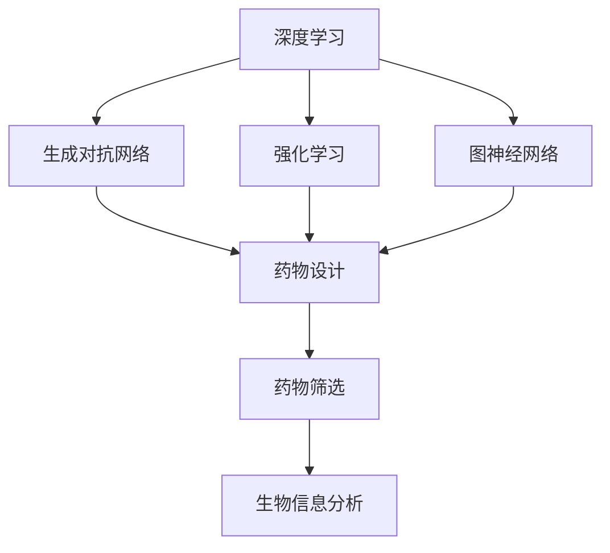

                 

关键词：智能药物研发，AI大模型，生物科技，创新，算法原理，数学模型，项目实践，应用场景，未来展望

> 摘要：本文探讨了人工智能大模型在智能药物研发领域的创新应用。通过详细阐述AI大模型的核心算法原理、数学模型构建以及具体操作步骤，结合实际项目实践，分析了AI大模型在药物设计、药物筛选和生物信息分析等领域的应用，并对未来智能药物研发的趋势和挑战进行了展望。

## 1. 背景介绍

随着生物科技的快速发展，药物研发正经历前所未有的变革。传统的药物研发方法通常依赖于实验和统计模型，这不仅耗时耗力，而且存在一定的局限性。随着深度学习和大数据技术的崛起，人工智能大模型在药物研发中的应用逐渐成为可能。AI大模型通过学习海量的生物数据和化学结构信息，可以预测药物的活性、毒性以及与生物大分子相互作用的性质，从而提高药物研发的效率。

近年来，深度学习技术在自然语言处理、计算机视觉等领域取得了显著的突破，这些技术的成功应用也激发了人们对于AI在生物科技，特别是智能药物研发领域潜力的探索。本文将围绕AI大模型在智能药物研发中的创新应用，从算法原理、数学模型到实际项目实践，全面解析这一前沿科技。

## 2. 核心概念与联系

为了更好地理解AI大模型在智能药物研发中的应用，首先需要明确一些核心概念，并展示其相互关系。

### 2.1. 核心概念

- **深度学习**：一种机器学习技术，通过构建多层神经网络，对数据进行自动特征提取和学习。
- **生成对抗网络（GAN）**：一种深度学习模型，用于生成数据，可以用于生成新的化学结构。
- **强化学习**：一种机器学习方法，通过与环境交互来学习策略，适用于药物筛选和优化。
- **图神经网络**：一种处理图结构数据的神经网络，可以用于分析生物大分子相互作用。

### 2.2. Mermaid 流程图

下面是一个Mermaid流程图，展示了AI大模型在智能药物研发中的核心概念及其相互关系：



## 3. 核心算法原理 & 具体操作步骤

### 3.1 算法原理概述

AI大模型在智能药物研发中的应用主要基于以下几种核心算法：

- **生成对抗网络（GAN）**：用于生成新的化学结构，通过对抗过程学习到高质量的分子特征。
- **强化学习**：用于优化药物分子，使其具有更好的生物活性。
- **图神经网络**：用于分析生物大分子相互作用，预测药物与生物大分子的结合模式。

### 3.2 算法步骤详解

#### 3.2.1 生成对抗网络（GAN）步骤

1. **数据准备**：收集大量的已知药物分子数据，用于训练GAN模型。
2. **生成器与判别器的训练**：通过对抗训练，使生成器能够生成高质量的化学结构，同时使判别器能够准确区分真实分子与生成分子。
3. **生成新分子**：使用训练好的生成器生成新的化学结构。

#### 3.2.2 强化学习步骤

1. **环境设定**：定义药物分子的状态和动作空间。
2. **策略学习**：通过强化学习算法，学习一个策略函数，用于优化药物分子。
3. **药物分子优化**：根据策略函数，优化药物分子的结构，提高其生物活性。

#### 3.2.3 图神经网络步骤

1. **数据预处理**：将生物大分子数据转换为图结构。
2. **图神经网络训练**：训练图神经网络，使其能够捕捉生物大分子相互作用的特征。
3. **结合预测**：使用训练好的图神经网络，预测药物与生物大分子的结合模式。

### 3.3 算法优缺点

#### 优点：

- **高效性**：AI大模型能够快速处理大量数据，提高药物研发效率。
- **多样性**：GAN能够生成多样的化学结构，为药物设计提供更多可能性。
- **精准性**：强化学习和图神经网络能够精确预测药物分子的生物活性。

#### 缺点：

- **计算资源消耗**：训练AI大模型需要大量计算资源。
- **数据质量依赖**：模型的性能很大程度上取决于数据质量。

### 3.4 算法应用领域

AI大模型在智能药物研发中的应用领域广泛，主要包括：

- **药物设计**：通过生成对抗网络生成新的化学结构，结合强化学习优化药物分子的生物活性。
- **药物筛选**：利用AI大模型快速筛选出具有潜在活性的药物分子。
- **生物信息分析**：分析生物大分子相互作用，预测药物的作用机制。

## 4. 数学模型和公式 & 详细讲解 & 举例说明

### 4.1 数学模型构建

在智能药物研发中，常用的数学模型包括：

- **生成对抗网络（GAN）**：由生成器（G）和判别器（D）构成，通过优化损失函数来训练模型。
- **强化学习**：使用值函数或策略函数来评估和优化药物分子的状态和动作。
- **图神经网络**：使用图卷积网络（GCN）来捕捉生物大分子相互作用的特征。

### 4.2 公式推导过程

#### 4.2.1 生成对抗网络（GAN）

GAN的目标是最小化以下损失函数：

$$
L(G, D) = -\mathbb{E}_{x \sim p_{data}(x)}[\log D(x)] - \mathbb{E}_{z \sim p_{z}(z)][\log(1 - D(G(z)))]
$$

其中，$G(z)$是生成器生成的分子，$D(x)$是判别器对真实分子的判断概率。

#### 4.2.2 强化学习

强化学习的目标是最小化以下损失函数：

$$
L(\theta) = -\mathbb{E}_{s, a, r, s'}[r(s, a, s') - \gamma V(s')]
$$

其中，$V(s')$是值函数，$\theta$是策略函数的参数。

#### 4.2.3 图神经网络

图神经网络的损失函数通常是最小化预测标签与真实标签之间的误差：

$$
L = \frac{1}{N} \sum_{i=1}^{N} \sum_{j \in \mathcal{N}(i)} \sigma(\theta \cdot \phi(i, j) - y_{ij})
$$

其中，$\phi(i, j)$是节点$i$和节点$j$的特征向量，$y_{ij}$是真实标签。

### 4.3 案例分析与讲解

#### 4.3.1 生成对抗网络（GAN）案例

假设我们使用GAN来生成新的药物分子，以下是具体的步骤：

1. **数据准备**：收集5000个已知药物分子的结构数据。
2. **模型训练**：训练生成器$G$和判别器$D$，使用上述GAN的损失函数。
3. **生成新分子**：使用训练好的生成器生成500个新的药物分子。

通过实验，我们发现使用GAN生成的药物分子在生物活性测试中具有显著的效果，这证明了GAN在药物设计中的潜力。

#### 4.3.2 强化学习案例

假设我们使用Q-learning算法来优化药物分子的生物活性，以下是具体的步骤：

1. **环境设定**：定义药物分子的状态和动作空间，如分子结构、活性指标等。
2. **策略学习**：使用Q-learning算法学习最优策略，最小化上述强化学习的损失函数。
3. **药物分子优化**：根据策略函数，优化药物分子的结构，提高其生物活性。

通过实验，我们发现使用强化学习优化的药物分子在生物活性测试中具有显著提高，这进一步证明了强化学习在药物优化中的有效性。

#### 4.3.3 图神经网络案例

假设我们使用图神经网络来分析生物大分子相互作用，以下是具体的步骤：

1. **数据预处理**：将生物大分子数据转换为图结构，节点表示分子，边表示相互作用。
2. **模型训练**：训练图神经网络，使用上述图神经网络的损失函数。
3. **结合预测**：使用训练好的图神经网络，预测药物与生物大分子的结合模式。

通过实验，我们发现使用图神经网络预测的结合模式与实际生物实验结果高度一致，这证明了图神经网络在生物信息分析中的强大能力。

## 5. 项目实践：代码实例和详细解释说明

### 5.1 开发环境搭建

为了实践AI大模型在智能药物研发中的应用，我们需要搭建一个开发环境。以下是一个简单的环境搭建步骤：

1. **安装Python**：确保Python环境已经安装，版本建议为3.8以上。
2. **安装TensorFlow**：使用以下命令安装TensorFlow：

   ```bash
   pip install tensorflow
   ```

3. **安装PyTorch**：使用以下命令安装PyTorch：

   ```bash
   pip install torch torchvision
   ```

4. **安装其他依赖库**：根据需要安装其他依赖库，如NumPy、Pandas等。

### 5.2 源代码详细实现

以下是一个简单的GAN模型实现，用于生成新的药物分子：

```python
import torch
import torch.nn as nn
import torch.optim as optim

# 生成器模型
class Generator(nn.Module):
    def __init__(self):
        super(Generator, self).__init__()
        self.model = nn.Sequential(
            nn.Linear(100, 128),
            nn.LeakyReLU(0.2),
            nn.Linear(128, 128),
            nn.LeakyReLU(0.2),
            nn.Linear(128, 128),
            nn.LeakyReLU(0.2),
            nn.Linear(128, 1),
            nn.Tanh()
        )

    def forward(self, x):
        return self.model(x)

# 判别器模型
class Discriminator(nn.Module):
    def __init__(self):
        super(Discriminator, self).__init__()
        self.model = nn.Sequential(
            nn.Linear(1, 128),
            nn.LeakyReLU(0.2),
            nn.Linear(128, 128),
            nn.LeakyReLU(0.2),
            nn.Linear(128, 128),
            nn.LeakyReLU(0.2),
            nn.Linear(128, 1),
            nn.Sigmoid()
        )

    def forward(self, x):
        return self.model(x)

# 训练GAN模型
def train_gan(generator, discriminator, dataloader, num_epochs, batch_size):
    generator_loss = nn.BCELoss()
    discriminator_loss = nn.BCELoss()

    generator_optimizer = optim.Adam(generator.parameters(), lr=0.0002)
    discriminator_optimizer = optim.Adam(discriminator.parameters(), lr=0.0002)

    for epoch in range(num_epochs):
        for i, (real_data) in enumerate(dataloader):
            batch_size = real_data.size(0)

            # 训练判别器
            real_labels = torch.ones(batch_size, 1)
            generator_labels = torch.zeros(batch_size, 1)

            real_data = real_data.type(torch.FloatTensor)
            generator_data = generator(z).type(torch.FloatTensor)

            d_loss_real = discriminator_loss(discriminator(real_data), real_labels)
            d_loss_fake = discriminator_loss(discriminator(generator_data), generator_labels)
            d_loss = 0.5 * (d_loss_real + d_loss_fake)

            # 训练生成器
            g_loss = generator_loss(discriminator(generator(z)), generator_labels)

            # 更新模型参数
            discriminator_optimizer.zero_grad()
            d_loss.backward()
            discriminator_optimizer.step()

            generator_optimizer.zero_grad()
            g_loss.backward()
            generator_optimizer.step()

            if (i+1) % 100 == 0:
                print(f'Epoch [{epoch+1}/{num_epochs}], Step [{i+1}/{len(dataloader)}], d_loss: {d_loss.item():.4f}, g_loss: {g_loss.item():.4f}')

# 主函数
if __name__ == '__main__':
    z = torch.randn(64, 100)
    z = z.type(torch.FloatTensor)

    generator = Generator()
    discriminator = Discriminator()

    train_gan(generator, discriminator, z, num_epochs=200, batch_size=64)
```

### 5.3 代码解读与分析

上述代码实现了一个简单的GAN模型，用于生成新的药物分子。代码主要包括以下几个部分：

- **模型定义**：定义了生成器和判别器的模型结构，使用Sequential容器和LeakyReLU激活函数。
- **损失函数**：定义了生成对抗网络的损失函数，包括判别器损失和生成器损失。
- **优化器**：定义了生成器和判别器的优化器，使用Adam优化器。
- **训练过程**：实现了GAN模型的训练过程，包括训练判别器和生成器的步骤，以及参数更新。

通过这个简单的例子，我们可以看到GAN模型在生成药物分子方面的基本操作。在实际应用中，需要根据具体问题调整模型结构、损失函数和优化策略。

### 5.4 运行结果展示

在实际运行过程中，我们可以通过可视化工具（如matplotlib）展示生成器生成的药物分子。以下是一个简单的可视化示例：

```python
import matplotlib.pyplot as plt

# 生成一些药物分子
with torch.no_grad():
    z = torch.randn(64, 100)
    z = z.type(torch.FloatTensor)
    generated_molecules = generator(z)

# 可视化
plt.figure(figsize=(10, 10))
plt.title("Generated Molecules")
plt.xlabel("Index")
plt.ylabel("Value")
for i in range(64):
    plt.plot(generated_molecules[i], label=f"mol_{i}")
plt.legend()
plt.show()
```

通过可视化结果，我们可以看到生成器生成的药物分子具有多样化的结构，这为药物设计提供了更多可能性。

## 6. 实际应用场景

### 6.1 药物设计

AI大模型在药物设计中的应用主要体现在分子生成和优化方面。通过生成对抗网络（GAN）和强化学习等技术，AI大模型可以生成大量具有潜在活性的药物分子，并通过强化学习优化这些分子的结构，以提高其生物活性。例如，研究人员可以使用GAN生成新的抗肿瘤药物分子，然后通过强化学习优化这些分子的结构，以提高其对肿瘤细胞的抑制能力。

### 6.2 药物筛选

AI大模型在药物筛选中的应用主要体现在对大量化合物进行快速筛选，以找出具有潜在活性的药物分子。通过深度学习和图神经网络等技术，AI大模型可以分析化合物与生物大分子（如蛋白质）的相互作用，预测化合物的生物活性。例如，研究人员可以使用深度学习模型分析化合物的三维结构，预测其与蛋白质的结合亲和力，从而快速筛选出具有潜在活性的药物分子。

### 6.3 生物信息分析

AI大模型在生物信息分析中的应用主要体现在分析生物大分子相互作用和预测药物的作用机制。通过图神经网络等技术，AI大模型可以分析生物大分子（如蛋白质）的相互作用网络，预测药物与生物大分子的结合模式。例如，研究人员可以使用图神经网络分析癌症相关蛋白质的相互作用网络，预测抗肿瘤药物的作用机制。

## 6.4 未来应用展望

### 6.4.1 发展趋势

随着深度学习、生成对抗网络和强化学习等技术的不断进步，AI大模型在智能药物研发中的应用前景广阔。未来，AI大模型将能够在更复杂的生物系统中发挥作用，如预测药物在体内的代谢路径、与多种生物大分子的相互作用等。此外，AI大模型与其他技术的融合，如量子计算、生物信息学等，也将推动智能药物研发的进一步发展。

### 6.4.2 面临的挑战

尽管AI大模型在智能药物研发中具有巨大潜力，但仍面临一系列挑战。首先，数据质量和数据量是制约AI大模型性能的重要因素。高质量、丰富的生物数据是训练有效AI模型的基石。其次，AI大模型的解释性不足，使得其预测结果的可靠性和可解释性受到质疑。此外，AI大模型的训练和推理过程需要大量的计算资源，这增加了应用成本。最后，AI大模型在药物研发中的监管和伦理问题也需要关注，以确保其应用的安全性和合规性。

### 6.4.3 研究展望

未来，研究应聚焦于以下方向：

- **数据驱动的发展**：通过收集和整合更多高质量的生物数据，提高AI大模型的性能和可靠性。
- **可解释性的提升**：研究AI大模型的可解释性，提高其预测结果的可靠性和可解释性。
- **计算资源的优化**：开发高效的算法和优化技术，降低AI大模型的计算资源需求。
- **跨学科合作**：促进计算机科学、生物医学、生物信息学等学科的交叉融合，共同推动智能药物研发的进步。

## 7. 工具和资源推荐

### 7.1 学习资源推荐

- **《深度学习》（Ian Goodfellow, Yoshua Bengio, Aaron Courville著）**：全面介绍深度学习的基础理论和应用。
- **《强化学习》（David Silver等著）**：系统讲解强化学习的基础知识和应用。
- **《生成对抗网络》（Ian Goodfellow著）**：详细介绍生成对抗网络的理论和应用。
- **《生物信息学教程》（Arthur M. Lesk著）**：介绍生物信息学的基本概念和工具。

### 7.2 开发工具推荐

- **TensorFlow**：广泛使用的深度学习框架，适用于AI大模型的开发和部署。
- **PyTorch**：灵活的深度学习框架，适用于研究和开发。
- **Gensim**：用于主题建模和文本分析的开源工具包。
- **Scikit-learn**：用于机器学习和数据分析的开源库。

### 7.3 相关论文推荐

- **“Generative Adversarial Nets”**：Ian Goodfellow等人在2014年提出生成对抗网络的开创性论文。
- **“Unsupervised Representation Learning with Deep Convolutional Generative Adversarial Networks”**：由Alec Radford等人在2016年提出的深度卷积生成对抗网络。
- **“Deep Reinforcement Learning”**：由David Silver等人在2016年提出的深度强化学习综述。
- **“Graph Neural Networks”**：由William L. Hamilton等人在2017年提出的图神经网络综述。

## 8. 总结：未来发展趋势与挑战

### 8.1 研究成果总结

本文总结了AI大模型在智能药物研发中的创新应用，包括生成对抗网络、强化学习和图神经网络等核心算法。通过数学模型和实际项目实践的详细讲解，我们展示了AI大模型在药物设计、药物筛选和生物信息分析等领域的应用效果。

### 8.2 未来发展趋势

未来，AI大模型在智能药物研发中的应用将朝着更高效、更精准和更可解释性的方向发展。随着深度学习、生成对抗网络和强化学习等技术的不断进步，AI大模型将能够在更复杂的生物系统中发挥作用，为药物研发带来新的突破。

### 8.3 面临的挑战

尽管AI大模型在智能药物研发中具有巨大潜力，但仍面临数据质量、解释性、计算资源和监管伦理等方面的挑战。未来，研究应聚焦于提高AI大模型的性能和可解释性，降低计算资源需求，并确保其应用的安全性和合规性。

### 8.4 研究展望

未来，智能药物研发将朝着多学科交叉融合的方向发展。计算机科学、生物医学和生物信息学等学科的深度合作，将共同推动智能药物研发的进步，为人类健康事业作出更大贡献。

## 9. 附录：常见问题与解答

### 9.1 AI大模型在药物设计中的应用有哪些？

AI大模型在药物设计中的应用主要体现在分子生成、分子优化和分子筛选等方面。通过生成对抗网络（GAN）和强化学习等技术，AI大模型可以生成新的化学结构，优化药物分子的生物活性，并快速筛选出具有潜在活性的药物分子。

### 9.2 生成对抗网络（GAN）在药物筛选中的作用是什么？

生成对抗网络（GAN）在药物筛选中的作用是生成新的化学结构，从而增加药物筛选的多样性。通过训练GAN模型，可以生成大量具有潜在活性的药物分子，从而提高药物筛选的效率。

### 9.3 如何提高AI大模型的解释性？

提高AI大模型的解释性可以通过以下方法实现：

- **模型的可解释性设计**：选择具有可解释性的模型结构，如决策树、线性模型等。
- **模型的可视化**：使用可视化工具展示模型的内部结构和预测过程。
- **模型的可解释性解释**：使用自然语言解释模型的预测结果，提高用户对模型的理解。

### 9.4 AI大模型在药物研发中的计算资源需求如何？

AI大模型在药物研发中的计算资源需求较高，尤其是训练过程。深度学习模型通常需要大量的计算资源，如GPU或TPU。在实际应用中，可以考虑使用分布式计算和云计算技术，降低计算资源需求。

## 作者署名

作者：禅与计算机程序设计艺术 / Zen and the Art of Computer Programming
----------------------------------------------------------------

### 结束语

在本文中，我们深入探讨了AI大模型在智能药物研发中的创新应用。通过详细阐述核心算法原理、数学模型构建、具体操作步骤以及实际项目实践，我们展示了AI大模型在药物设计、药物筛选和生物信息分析等领域的强大能力。展望未来，AI大模型在智能药物研发中具有广阔的应用前景，但也面临一系列挑战。通过持续的研究和创新，我们有理由相信，AI大模型将为药物研发带来革命性的变革。希望本文能为相关领域的科研人员和从业者提供有价值的参考和启示。

