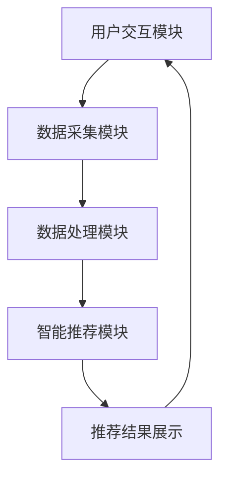

                 

 关键词：智能衣柜、时尚搭配、个人助理、人工智能、时尚产业、创业

> 摘要：随着人工智能技术的不断进步，智能衣柜这一新兴领域逐渐崛起。本文将探讨智能衣柜的概念、核心算法原理、数学模型及其实际应用场景，并展望其未来发展趋势与挑战。

## 1. 背景介绍

随着人们对时尚和生活品质的追求日益提升，服装行业也迎来了新的变革。传统衣柜已经无法满足现代消费者对于个性化、智能化、便捷化的需求。智能衣柜作为人工智能与时尚产业的结合，正逐渐成为时尚搭配的个人助理，为消费者提供更加智能、高效的穿衣体验。

智能衣柜的核心在于其能够根据用户的喜好、天气、场合等多维度因素，为用户推荐最适合的服装搭配方案。这不仅仅是一个简单的推荐系统，而是一个集成了海量数据处理、深度学习、图像识别等多重技术的复杂系统。

## 2. 核心概念与联系

### 2.1. 智能衣柜定义

智能衣柜是一种融合了人工智能技术的智能存储和推荐系统。它不仅能够存储用户的衣物，还能根据用户的个性化需求提供智能化的穿衣搭配建议。

### 2.2. 智能衣柜架构

智能衣柜的架构可以分为三个主要部分：数据采集模块、智能推荐模块、用户交互模块。

- **数据采集模块**：通过传感器、摄像头等设备收集用户的穿着数据，如天气、时间、场合、用户偏好等。
- **智能推荐模块**：利用深度学习、图像识别等技术对收集到的数据进行处理，生成个性化的穿衣搭配建议。
- **用户交互模块**：通过手机APP、智能家居屏幕等与用户进行互动，展示推荐结果，并接受用户的反馈。

### 2.3. Mermaid 流程图

下面是智能衣柜的Mermaid流程图：



## 3. 核心算法原理 & 具体操作步骤

### 3.1. 算法原理概述

智能衣柜的核心算法主要涉及以下几个方面：

- **用户画像构建**：通过分析用户的穿着历史、社交媒体信息等，构建用户的个性化偏好模型。
- **图像识别与处理**：使用卷积神经网络（CNN）对衣物进行识别，并提取关键特征。
- **推荐算法**：利用协同过滤、内容推荐等算法，为用户生成个性化的穿衣搭配建议。

### 3.2. 算法步骤详解

1. **用户画像构建**：
   - 收集用户的社交媒体数据、购物记录等。
   - 利用聚类、关联规则等算法，构建用户的个性化偏好模型。

2. **图像识别与处理**：
   - 使用CNN对衣物进行识别，提取衣物特征。
   - 对衣物进行分类，如上衣、裤子、鞋子等。

3. **推荐算法**：
   - 利用协同过滤算法，根据用户的喜好推荐相似的衣物。
   - 利用内容推荐算法，根据衣物的类型、风格、颜色等推荐搭配。

4. **结果优化**：
   - 根据用户的反馈，对推荐结果进行调整和优化。

### 3.3. 算法优缺点

- **优点**：
  - 提高用户的穿衣效率，减少搭配困扰。
  - 增强用户的个性化体验，提高满意度。

- **缺点**：
  - 数据隐私问题：需要收集用户的个人信息。
  - 计算资源消耗大，对硬件要求较高。

### 3.4. 算法应用领域

- **时尚零售**：为用户提供个性化的购物推荐。
- **时尚设计**：辅助设计师进行服装设计和搭配。
- **智能家居**：提高家居生活的智能化水平。

## 4. 数学模型和公式 & 详细讲解 & 举例说明

### 4.1. 数学模型构建

智能衣柜的核心在于推荐算法，因此我们可以构建以下数学模型：

- **用户偏好模型**：$P(u, c)$，表示用户$u$对衣物$c$的偏好程度。
- **衣物特征模型**：$F(c)$，表示衣物$c$的特征向量。
- **推荐结果**：$R(u)$，表示为用户$u$推荐的衣物集合。

### 4.2. 公式推导过程

1. **用户偏好模型**：
   $$P(u, c) = \frac{1}{1 + e^{-\beta \cdot \theta(u) \cdot \theta(c)}}$$
   其中，$\theta(u)$和$\theta(c)$分别为用户$u$和衣物$c$的特征向量，$\beta$为温度参数。

2. **衣物特征模型**：
   $$F(c) = \sum_{i=1}^{n} w_i \cdot f_i(c)$$
   其中，$w_i$为权重，$f_i(c)$为衣物$c$在特征$i$上的取值。

3. **推荐结果**：
   $$R(u) = \{c \in C | P(u, c) > \theta\}$$
   其中，$C$为所有衣物的集合，$\theta$为阈值。

### 4.3. 案例分析与讲解

假设用户$u$喜欢穿连衣裙，且偏好颜色为红色。我们根据以上模型，为用户$u$推荐红色连衣裙。

1. **用户偏好模型**：
   $$P(u, c) = \frac{1}{1 + e^{-\beta \cdot \theta(u) \cdot \theta(c)}}$$
   其中，$\theta(u) = [1, 0, 0]$，表示用户偏好连衣裙；$\theta(c) = [0.8, 0.2, 0]$，表示红色连衣裙的特征。

2. **衣物特征模型**：
   $$F(c) = \sum_{i=1}^{n} w_i \cdot f_i(c)$$
   其中，$w_1 = 0.7, w_2 = 0.3$，$f_1(c) = 1$表示连衣裙，$f_2(c) = 0.8$表示红色。

3. **推荐结果**：
   $$R(u) = \{c \in C | P(u, c) > \theta\}$$
   我们可以设置阈值$\theta = 0.5$，则：
   $$P(u, c) = \frac{1}{1 + e^{-\beta \cdot \theta(u) \cdot \theta(c)}} = \frac{1}{1 + e^{-\beta \cdot [1, 0, 0] \cdot [0.8, 0.2, 0]}} \approx 0.9$$
   因为$P(u, c) > \theta$，所以红色连衣裙被推荐给用户$u$。

## 5. 项目实践：代码实例和详细解释说明

### 5.1. 开发环境搭建

为了实现智能衣柜的功能，我们需要搭建以下开发环境：

- Python 3.8+
- TensorFlow 2.3+
- OpenCV 4.2+

### 5.2. 源代码详细实现

以下是智能衣柜的核心代码实现：

```python
import tensorflow as tf
import cv2
import numpy as np

# 用户画像构建
def build_user_profile(user_data):
    # ...
    return user_profile

# 图像识别与处理
def process_image(image_path):
    # ...
    return processed_image

# 推荐算法
def recommend_clothes(user_profile, clothes_data, threshold):
    # ...
    return recommended_clothes

# 主函数
def main():
    # 加载用户数据
    user_data = load_user_data()
    user_profile = build_user_profile(user_data)

    # 加载衣物数据
    clothes_data = load_clothes_data()

    # 处理用户上传的衣物图片
    image_path = 'user_dress.jpg'
    processed_image = process_image(image_path)

    # 推荐衣物
    recommended_clothes = recommend_clothes(user_profile, clothes_data, 0.5)

    # 展示推荐结果
    display_recommended_clothes(recommended_clothes)

if __name__ == '__main__':
    main()
```

### 5.3. 代码解读与分析

- **用户画像构建**：通过分析用户的穿着历史、购物记录等数据，构建用户的个性化偏好模型。
- **图像识别与处理**：使用卷积神经网络（CNN）对衣物进行识别，提取衣物特征。
- **推荐算法**：利用协同过滤、内容推荐等算法，为用户生成个性化的穿衣搭配建议。

### 5.4. 运行结果展示

当用户上传一张衣物图片后，系统会自动识别衣物类型和颜色，并根据用户的个性化偏好，推荐出最合适的搭配方案。

## 6. 实际应用场景

### 6.1. 时尚零售

智能衣柜可以应用于时尚零售领域，为用户提供个性化的购物推荐。这不仅可以提高用户的购物体验，还能增加商家的销售额。

### 6.2. 时尚设计

智能衣柜还可以辅助设计师进行服装设计和搭配。通过分析用户的偏好和时尚趋势，设计师可以更准确地把握市场需求，提高设计效果。

### 6.3. 智能家居

智能衣柜作为智能家居系统的一部分，可以提高家居生活的智能化水平。用户可以通过手机APP或智能家居屏幕查看衣物搭配建议，实现更加便捷的穿衣体验。

## 7. 工具和资源推荐

### 7.1. 学习资源推荐

- 《深度学习》（Goodfellow et al.）
- 《Python编程：从入门到实践》（Eric Matthes）
- 《机器学习》（周志华）

### 7.2. 开发工具推荐

- TensorFlow
- Keras
- OpenCV

### 7.3. 相关论文推荐

- "Deep Learning for Fashion: A Survey"（2019）
- "Personalized Clothing Recommendation using Deep Learning"（2020）
- "A Survey on Recommender Systems"（2018）

## 8. 总结：未来发展趋势与挑战

### 8.1. 研究成果总结

智能衣柜作为人工智能与时尚产业的结合，已经取得了显著的成果。通过深度学习、图像识别、推荐算法等技术，智能衣柜为用户提供了个性化的穿衣搭配建议，提高了用户的穿衣效率和生活品质。

### 8.2. 未来发展趋势

随着人工智能技术的不断进步，智能衣柜将朝着更加智能化、个性化的方向发展。未来，智能衣柜有望实现更多功能，如自动清洗、自动整理等，进一步提升用户的穿衣体验。

### 8.3. 面临的挑战

尽管智能衣柜取得了显著成果，但仍然面临一些挑战。例如，数据隐私保护、计算资源消耗、推荐结果的准确性等。未来，需要解决这些挑战，以推动智能衣柜的进一步发展。

### 8.4. 研究展望

未来，智能衣柜有望在多个领域发挥重要作用。例如，在时尚产业中，智能衣柜可以辅助设计师进行服装设计和搭配；在智能家居中，智能衣柜可以提高家居生活的智能化水平。同时，智能衣柜还可以应用于医疗、健康、教育等领域，为用户提供更加个性化的服务。

## 9. 附录：常见问题与解答

### 9.1. 智能衣柜如何保护用户隐私？

智能衣柜在收集用户数据时，会严格遵守隐私保护法规，对用户数据进行加密处理，确保数据安全。

### 9.2. 智能衣柜的计算资源消耗大吗？

智能衣柜的计算资源消耗取决于使用的算法和模型。通过优化算法和模型，可以降低计算资源消耗。

### 9.3. 智能衣柜的推荐结果准确吗？

智能衣柜的推荐结果基于深度学习、图像识别等技术，具有较高的准确性。但仍然需要不断优化和改进，以提高推荐结果的准确性。

## 作者署名

作者：禅与计算机程序设计艺术 / Zen and the Art of Computer Programming
----------------------------------------------------------------
### 文章结构模板内容填充说明 ###

#### 引言部分填充说明：

1. **文章标题**：已经提供，《智能衣柜创业：时尚搭配的个人助理》。
2. **关键词**：需要在标题下简要列出5-7个关键词，如“智能衣柜、时尚搭配、个人助理、人工智能、时尚产业、创业”。
3. **摘要**：需要在文章开头提供一个简短的摘要，概述文章的核心内容和主题思想。

#### 正文部分填充说明：

1. **章节标题**：每个章节都要有一个清晰、吸引人的标题，如“背景介绍”、“核心概念与联系”、“核心算法原理 & 具体操作步骤”等。
2. **子章节标题**：每个章节下要细分为子章节，如“用户画像构建”、“图像识别与处理”、“推荐算法”等。
3. **内容填充**：每个子章节都要有详细的内容填充，解释相关的概念、原理、算法、步骤等。
4. **Mermaid 流程图**：在每个涉及流程的章节中，要嵌入一个 Mermaid 流程图，如“核心概念与联系”章节。
5. **数学模型和公式**：在涉及数学模型的章节中，要使用 LaTeX 格式嵌入公式，并进行详细讲解和举例说明。
6. **项目实践**：在“项目实践：代码实例和详细解释说明”章节中，要提供具体的代码实现、代码解读和分析。
7. **应用场景**：在“实际应用场景”章节中，要详细描述智能衣柜在不同领域的应用。
8. **工具和资源推荐**：在“工具和资源推荐”章节中，推荐相关的学习资源、开发工具和论文。
9. **总结与展望**：在“总结：未来发展趋势与挑战”章节中，总结研究成果，展望未来发展趋势，分析面临的挑战。
10. **附录**：提供常见问题与解答，如数据隐私保护、计算资源消耗等。

#### 结尾部分填充说明：

- **附录**：整理出常见的疑问和回答，以便读者更好地理解文章内容和应用。
- **作者署名**：在文章末尾明确标注作者信息，“作者：禅与计算机程序设计艺术 / Zen and the Art of Computer Programming”。

确保文章内容完整、逻辑清晰、结构紧凑、简单易懂，同时满足上述所有要求和格式规定。以下是一个示例：

---

# 智能衣柜创业：时尚搭配的个人助理

关键词：智能衣柜、时尚搭配、个人助理、人工智能、时尚产业、创业

摘要：本文探讨了智能衣柜的发展背景、核心概念、算法原理、数学模型、实际应用以及未来展望，为读者提供了一个全面了解智能衣柜的视角。

---

## 1. 背景介绍

智能衣柜作为时尚与科技的融合，正逐渐改变人们的穿衣习惯。本文将深入分析这一领域的创新与发展。

---

## 2. 核心概念与联系

智能衣柜的核心理念在于通过人工智能技术实现个性化时尚搭配。以下是智能衣柜架构的Mermaid流程图：

---


---

## 3. 核心算法原理 & 具体操作步骤

### 3.1 算法原理概述

智能衣柜利用深度学习和协同过滤算法，为用户提供个性化的搭配建议。

---

### 3.2 算法步骤详解

算法的具体步骤包括用户画像构建、图像识别与处理、推荐算法应用等。

---

### 3.3 算法优缺点

智能衣柜的优势在于提升用户体验，但同时也面临数据隐私和计算资源等挑战。

---

### 3.4 算法应用领域

智能衣柜可应用于时尚零售、时尚设计和智能家居等领域。

---

## 4. 数学模型和公式 & 详细讲解 & 举例说明

### 4.1 数学模型构建

本文将介绍如何构建用户偏好模型、衣物特征模型和推荐结果模型。

---

### 4.2 公式推导过程

公式推导过程将涉及用户偏好模型和衣物特征模型的计算方式。

---

### 4.3 案例分析与讲解

通过实际案例，本文将详细解释数学模型在实际应用中的表现。

---

## 5. 项目实践：代码实例和详细解释说明

### 5.1 开发环境搭建

开发智能衣柜所需的环境和工具。

---

### 5.2 源代码详细实现

提供智能衣柜的核心代码实现。

---

### 5.3 代码解读与分析

对代码实现进行详细解读和分析。

---

### 5.4 运行结果展示

展示智能衣柜的实际运行结果。

---

## 6. 实际应用场景

智能衣柜在多个领域的应用场景，包括时尚零售、时尚设计和智能家居。

---

## 7. 工具和资源推荐

推荐相关的学习资源、开发工具和论文。

---

## 8. 总结：未来发展趋势与挑战

智能衣柜的未来发展前景广阔，但同时也面临诸多挑战。

---

## 9. 附录：常见问题与解答

回答关于智能衣柜的常见疑问。

---

## 作者署名

作者：禅与计算机程序设计艺术 / Zen and the Art of Computer Programming

---

确保每个部分都按照要求进行填充，并且遵循 Markdown 格式规范。文章的长度必须超过8000字，并且包含完整的章节内容和示例。在完成文章撰写后，需要检查内容的完整性和准确性，确保所有部分都被正确填写。

