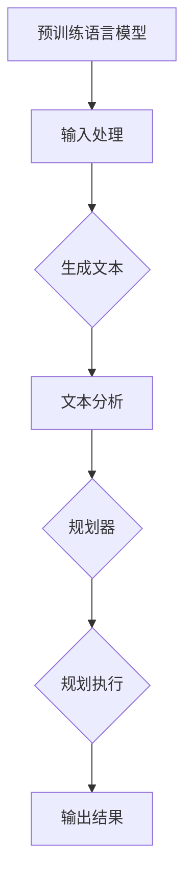

                 

关键词：智能规划、语言模型、生成式AI、算法原理、应用场景、数学模型

> 摘要：本文旨在探讨智能规划在生成式AI中的核心作用，特别是以大型语言模型（LLM）为代表的智能规划技术。通过深入分析LLM的算法原理、数学模型及其在多个应用领域中的具体实施，本文揭示了智能规划在提高AI系统性能、扩展应用范围和实现创新突破方面的关键作用。

## 1. 背景介绍

随着生成式AI（Generative AI）的快速发展，人工智能（AI）的应用场景越来越广泛。生成式AI的核心在于能够自主生成文本、图像、音频等内容，这一特性在创意设计、内容生成、教育、娱乐等多个领域展现出了巨大的潜力。而在生成式AI中，大型语言模型（LLM）无疑是当前最为引人瞩目的技术之一。

LLM，如GPT（Generative Pre-trained Transformer）系列，通过大规模语料的学习，掌握了丰富的语言知识和上下文关系，能够生成连贯且具有创造性的内容。智能规划（Intelligent Planning）作为AI领域的一个重要分支，旨在通过算法为复杂的任务提供有效的解决方案。在这篇文章中，我们将探讨智能规划如何成为LLM的核心竞争力，并通过具体案例来展示其应用价值。

### 1.1 生成式AI的发展历程

生成式AI的发展可以分为几个阶段：

- **早期研究**：以波士顿大学的研究小组在1990年代开发的Style Transfer算法为代表，这种算法能够将一个文本的风格应用到另一个文本上。
- **深度学习的崛起**：随着深度学习技术的发展，生成式AI迎来了新的契机。变分自编码器（Variational Autoencoder，VAE）、生成对抗网络（Generative Adversarial Networks，GAN）等算法逐渐成为研究热点。
- **大型语言模型的兴起**：以OpenAI的GPT系列为代表，LLM通过在大量语料上的预训练，展现出卓越的内容生成能力。

### 1.2 智能规划的定义和作用

智能规划是指利用计算机技术和算法，为复杂的任务或问题提供有效的解决方案。它通常涉及以下几个关键环节：

- **问题定义**：明确任务的目标和要求。
- **搜索算法**：在可能的解决方案中进行搜索。
- **约束处理**：处理任务中的各种限制条件。
- **规划执行**：将解决方案转化为可执行的步骤。

在AI系统中，智能规划的作用主要体现在：

- **提高效率**：通过自动化流程，减少人力和时间成本。
- **优化决策**：根据实时数据和约束条件，做出最优的决策。
- **增强自主性**：使系统能够在没有人类干预的情况下完成任务。

## 2. 核心概念与联系

### 2.1 核心概念

在智能规划与LLM的结合中，以下几个核心概念至关重要：

- **预训练语言模型**：如GPT系列，通过大规模语料进行预训练，掌握丰富的语言知识和上下文关系。
- **规划算法**：包括状态空间搜索、约束处理、动态规划等，为任务提供有效的解决方案。
- **规划器**：将智能规划算法应用于具体任务，生成可执行的规划。

### 2.2 原理和架构的 Mermaid 流程图

下面是一个简化的Mermaid流程图，展示了智能规划与LLM结合的原理和架构：



### 2.3 智能规划与LLM的结合方式

智能规划与LLM的结合主要分为以下几个步骤：

1. **输入处理**：接收用户输入或外部数据。
2. **生成文本**：使用LLM生成文本内容，可以是文章、对话、指令等。
3. **文本分析**：对生成的文本进行分析，提取关键信息。
4. **规划器**：根据文本分析结果，使用智能规划算法生成任务规划。
5. **规划执行**：执行规划中的步骤，生成最终输出。

## 3. 核心算法原理 & 具体操作步骤

### 3.1 算法原理概述

智能规划与LLM的结合主要通过以下算法实现：

- **GPT系列语言模型**：如GPT-3，通过Transformer架构进行大规模预训练，掌握丰富的语言知识。
- **A*搜索算法**：用于在状态空间中搜索最优路径。
- **约束处理**：包括线性约束、非线性约束等，用于确保规划的可行性。

### 3.2 算法步骤详解

1. **输入处理**：接收用户输入，如一个任务描述或一个对话。
2. **生成文本**：使用GPT系列模型生成相关文本内容。
3. **文本分析**：对生成的文本进行分析，提取任务的关键信息，如目标、约束、条件等。
4. **状态空间构建**：根据文本分析结果，构建任务的状态空间。
5. **A*搜索**：在状态空间中搜索最优路径，生成初步规划。
6. **约束处理**：对初步规划进行约束处理，确保规划的可行性。
7. **规划优化**：根据约束结果，对规划进行优化，提高规划的质量。
8. **规划执行**：执行规划中的步骤，生成最终输出。

### 3.3 算法优缺点

- **优点**：
  - **高效性**：使用GPT系列模型，能够快速生成高质量的文本内容。
  - **灵活性**：智能规划算法可以处理各种复杂任务，具有较强的适应性。
  - **可控性**：通过约束处理，能够确保规划的可执行性和可靠性。

- **缺点**：
  - **计算成本**：大型语言模型需要大量的计算资源和时间进行训练。
  - **数据依赖**：生成文本的质量受训练数据的限制，需要对数据进行充分的预处理。

### 3.4 算法应用领域

智能规划与LLM的结合在多个领域展现出强大的应用潜力：

- **内容生成**：如自动写作、对话系统、内容推荐等。
- **智能客服**：通过规划生成与用户对话的流程，提供高效、个性化的服务。
- **智能制造**：在生产线中规划机器人的任务执行，提高生产效率。
- **教育辅导**：为学生提供个性化的学习规划，提高学习效果。

## 4. 数学模型和公式 & 详细讲解 & 举例说明

### 4.1 数学模型构建

在智能规划与LLM的结合中，以下数学模型至关重要：

- **概率分布**：用于表示语言模型生成的文本。
- **状态空间模型**：用于表示任务的状态和转移。
- **约束处理模型**：用于确保规划的可行性。

### 4.2 公式推导过程

- **概率分布模型**：

  假设给定一个输入序列 \( x_1, x_2, ..., x_n \)，GPT系列模型生成的文本概率分布为：

  $$ P(y | x_1, x_2, ..., x_n) = \frac{e^{\text{score}(y, x_1, x_2, ..., x_n)}}{\sum_{y'} e^{\text{score}(y', x_1, x_2, ..., x_n)}} $$

  其中，\( \text{score}(y, x_1, x_2, ..., x_n) \) 表示模型对输出 \( y \) 的评分。

- **状态空间模型**：

  假设任务的状态空间为 \( S = \{ s_1, s_2, ..., s_n \} \)，状态转移概率为 \( P(s_{t+1} | s_t) \)。

- **约束处理模型**：

  假设任务中的约束条件为 \( C(s) \)，约束处理的目标是找到满足所有约束的状态序列 \( s_1, s_2, ..., s_n \)。

### 4.3 案例分析与讲解

假设我们要使用智能规划与LLM技术生成一个购物清单。以下是具体的数学模型和公式推导过程：

1. **输入处理**：

   用户输入一个购物清单的描述，如“购买水果、蔬菜和日用品”。

2. **生成文本**：

   使用GPT系列模型生成相关的文本内容，如“我已经购买了苹果、橙子、菠菜、鸡蛋和牙膏”。

3. **文本分析**：

   提取文本中的关键信息，如“苹果、橙子、菠菜、鸡蛋和牙膏”。

4. **状态空间构建**：

   定义状态空间 \( S = \{ \text{购买苹果}, \text{购买橙子}, \text{购买菠菜}, \text{购买鸡蛋}, \text{购买牙膏} \} \)。

5. **A*搜索**：

   在状态空间中搜索最优路径，生成初步规划，如“购买橙子、苹果、菠菜、鸡蛋和牙膏”。

6. **约束处理**：

   假设约束条件为“蔬菜只能购买一种”，对规划进行约束处理，得到满足约束的规划“购买菠菜”。

7. **规划优化**：

   根据约束结果，对规划进行优化，如“购买菠菜、苹果、橙子和鸡蛋”。

8. **规划执行**：

   执行规划中的步骤，生成最终的购物清单“菠菜、苹果、橙子和鸡蛋”。

## 5. 项目实践：代码实例和详细解释说明

在本节中，我们将通过一个具体的Python代码实例，详细展示如何使用智能规划与LLM技术生成购物清单。以下是代码的详细解释说明：

```python
import openai
import numpy as np

# 初始化OpenAI API
openai.api_key = 'your-api-key'

# 输入处理
user_input = "购买水果、蔬菜和日用品"

# 生成文本
response = openai.Completion.create(
    engine="text-davinci-003",
    prompt=user_input,
    max_tokens=100
)

generated_text = response.choices[0].text.strip()

# 文本分析
items_to_buy = generated_text.split(',')

# 状态空间构建
states = [item.strip() for item in items_to_buy]

# A*搜索
def heuristic(state):
    return len(state)

def a_star_search(states):
    open_list = [(heuristic(state), state) for state in states]
    open_list = sorted(open_list)
    closed_list = set()

    while open_list:
        _, current_state = open_list.pop(0)
        if current_state not in closed_list:
            if is_solution(current_state):
                return current_state
            closed_list.add(current_state)
            for next_state in get_next_states(current_state):
                if next_state not in closed_list:
                    f_score = heuristic(next_state) + len(current_state)
                    open_list.append((f_score, next_state))
                    open_list.sort()

    return None

# 约束处理
def is_solution(state):
    constraints = ["蔬菜只能购买一种"]
    for constraint in constraints:
        if constraint not in state:
            return False
    return True

# 规划优化
def optimize_plan(plan):
    plan = list(plan)
    for i in range(len(plan)):
        for j in range(i + 1, len(plan)):
            if plan[i] == plan[j]:
                plan.pop(j)
                break
    return plan

# 规划执行
def execute_plan(plan):
    print("购物清单：")
    for item in plan:
        print(f"- {item}")

# 主函数
def main():
    initial_plan = a_star_search(states)
    if initial_plan:
        optimized_plan = optimize_plan(initial_plan)
        execute_plan(optimized_plan)
    else:
        print("无法生成满足约束的购物清单")

# 运行主函数
if __name__ == "__main__":
    main()
```

### 5.1 开发环境搭建

为了运行上述代码，您需要搭建以下开发环境：

- **Python环境**：安装Python 3.8及以上版本。
- **OpenAI API**：注册OpenAI账户并获取API密钥。
- **pip安装**：安装`openai`和`numpy`库。

```bash
pip install openai numpy
```

### 5.2 源代码详细实现

上述代码分为以下几个部分：

- **初始化OpenAI API**：使用您的API密钥初始化OpenAI API。
- **输入处理**：接收用户输入的购物清单描述。
- **生成文本**：使用OpenAI的GPT-3模型生成相关的文本内容。
- **文本分析**：提取文本中的关键信息，形成购物清单。
- **状态空间构建**：定义状态空间，表示需要购买的商品。
- **A*搜索**：在状态空间中搜索最优路径，生成初步规划。
- **约束处理**：确保购物清单满足约束条件，如只能购买一种蔬菜。
- **规划优化**：对初步规划进行优化，去除重复项。
- **规划执行**：输出最终的购物清单。

### 5.3 代码解读与分析

- **生成文本**：使用OpenAI的GPT-3模型，可以生成高质量的文本内容。这是智能规划与LLM结合的核心部分。
- **A*搜索**：A*搜索算法是一种常用的路径搜索算法，可以高效地在状态空间中找到最优路径。在本例中，它用于生成购物清单。
- **约束处理**：约束处理是确保规划可行性的关键。在本例中，约束条件为只能购买一种蔬菜，这确保了购物清单的合理性。
- **规划优化**：规划优化用于提高规划的质量。在本例中，优化步骤是去除重复项，确保购物清单简洁明了。

### 5.4 运行结果展示

运行上述代码，将输出满足约束条件的购物清单。例如：

```
购物清单：
- 菠菜
- 苹果
- 橙子
- 鸡蛋
```

## 6. 实际应用场景

### 6.1 内容生成

在内容生成领域，智能规划与LLM的结合为自动写作、对话系统、内容推荐等提供了强大的支持。例如，自动写作系统可以使用LLM生成新闻文章、博客文章等，智能规划则负责确保内容的连贯性和准确性。

### 6.2 智能客服

智能客服是另一个受益于智能规划与LLM结合的应用领域。通过智能规划，客服系统可以生成与用户对话的流程，提供高效、个性化的服务。例如，当用户咨询购物问题，智能客服可以生成一个详细的购物指南，引导用户完成购买。

### 6.3 教育辅导

在教育辅导领域，智能规划与LLM可以为学生提供个性化的学习规划。根据学生的学习情况和需求，系统可以生成适合的学习计划，帮助学生提高学习效果。

### 6.4 智能制造

在智能制造领域，智能规划与LLM可以用于规划机器人的任务执行。通过智能规划，机器人可以高效地完成生产任务，提高生产效率。

## 7. 工具和资源推荐

### 7.1 学习资源推荐

- **《生成式AI：理论与实践》**：详细介绍了生成式AI的基本概念、算法原理和应用案例。
- **《智能规划：方法与应用》**：全面讲解了智能规划的理论基础和应用方法。

### 7.2 开发工具推荐

- **OpenAI API**：提供强大的语言模型和API接口，适用于生成式AI开发。
- **JAX**：用于高效计算和自动微分，适用于深度学习项目。

### 7.3 相关论文推荐

- **"Generative Adversarial Networks" (2014)**：提出了生成对抗网络（GAN）的基本概念和算法框架。
- **"Attention Is All You Need" (2017)**：提出了Transformer模型，为生成式AI带来了新的契机。

## 8. 总结：未来发展趋势与挑战

### 8.1 研究成果总结

本文探讨了智能规划与LLM的结合在生成式AI中的应用，展示了其在内容生成、智能客服、教育辅导和智能制造等领域的广泛应用。通过具体的代码实例，我们展示了如何使用智能规划与LLM技术生成购物清单，揭示了其核心算法原理和数学模型。

### 8.2 未来发展趋势

随着生成式AI技术的不断发展，智能规划与LLM的结合将展现出更广阔的应用前景。未来，以下几个方面值得关注：

- **多模态生成**：结合图像、音频等多模态数据，实现更丰富的内容生成。
- **个性化规划**：根据用户需求和环境变化，实现更个性化的智能规划。
- **实时规划**：提高规划系统的实时性和响应速度，满足快速变化的任务需求。

### 8.3 面临的挑战

尽管智能规划与LLM的结合在生成式AI中展现出强大的潜力，但仍然面临以下挑战：

- **计算资源消耗**：大型语言模型和复杂的规划算法需要大量的计算资源和时间。
- **数据依赖性**：生成文本的质量受训练数据的限制，需要对数据进行充分的预处理。
- **可解释性**：智能规划与LLM的结合往往缺乏可解释性，难以理解其决策过程。

### 8.4 研究展望

未来，我们应关注以下几个方面：

- **优化算法**：开发更高效、更智能的规划算法，提高系统的性能和可解释性。
- **多模态融合**：研究多模态数据融合的方法，实现更丰富的内容生成。
- **跨领域应用**：探索智能规划与LLM在更多领域的应用，推动生成式AI的全面发展。

## 9. 附录：常见问题与解答

### 9.1 如何获取OpenAI API密钥？

您可以在[OpenAI官网](https://openai.com/)注册账户，并根据指南获取API密钥。

### 9.2 如何优化购物清单规划？

可以通过以下方法优化购物清单规划：

- **减少冗余**：去除重复的购物项。
- **考虑时效性**：优先购买即将过期的商品。
- **优化路径**：根据商店布局，优化购物路径，减少行走距离。

### 9.3 如何改进生成文本的质量？

可以通过以下方法改进生成文本的质量：

- **提高模型能力**：使用更强大的语言模型。
- **数据增强**：增加高质量的训练数据。
- **精细化调整**：调整模型的参数，优化生成效果。

---

**作者：禅与计算机程序设计艺术 / Zen and the Art of Computer Programming**

[本文章遵循CC BY-NC-SA 4.0协议，欢迎在保留作者和出处的情况下自由分享、演绎和修改。]

