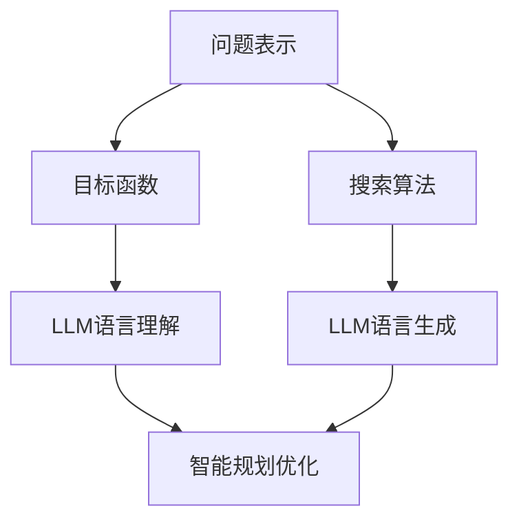

                 

关键词：智能规划，大语言模型（LLM），算法原理，应用领域，数学模型，代码实例，未来展望

## 摘要

本文将深入探讨智能规划在大语言模型（LLM）中的核心竞争力。首先，我们将回顾智能规划的历史背景和基本概念，接着详细分析LLM的核心算法原理及其在不同应用场景中的表现。随后，文章将介绍智能规划涉及的数学模型和公式，并通过代码实例展示具体实现过程。最后，我们将讨论智能规划在未来的发展方向和面临的挑战，为读者提供全面的见解和指导。

## 1. 背景介绍

### 智能规划的历史

智能规划作为人工智能（AI）的一个重要分支，起源于20世纪50年代。早期的智能规划主要关注符号计算和逻辑推理，当时的代表性工作包括逻辑规划（Logic Programming）和基于状态空间搜索（State-Space Search）的规划算法。随着计算机性能的提升和算法理论的进步，智能规划逐渐扩展到更广泛的领域，如约束规划（Constraint Satisfaction Problems, CSPs）和混合整数规划（Mixed Integer Programming, MIPs）。

### 大语言模型（LLM）的发展

大语言模型（LLM）作为自然语言处理（NLP）的一个重要分支，近年来取得了显著的进展。LLM的核心思想是通过大规模的神经网络对大量文本数据进行训练，从而实现对自然语言的生成和理解。从最初的循环神经网络（RNN）到更为先进的变压器模型（Transformer），LLM在语言生成、机器翻译、问答系统等任务中表现出色。LLM的出现为智能规划带来了新的机遇和挑战，使得智能规划能够更高效地处理复杂的语言任务。

## 2. 核心概念与联系

### 智能规划

智能规划是指利用计算机技术和算法，为解决特定问题或实现特定目标而进行的一系列活动。智能规划的核心在于如何高效地生成和优化解决方案。在智能规划中，通常涉及以下核心概念：

- **问题表示**：将问题转化为计算机能够理解和处理的形式。
- **目标函数**：定义评估解决方案好坏的指标。
- **搜索算法**：用于在搜索空间中寻找最优或近似最优解的算法。

### 大语言模型（LLM）

大语言模型（LLM）是一种基于深度学习的自然语言处理模型，能够对自然语言进行生成和理解。LLM的核心在于其大规模的训练数据和复杂的神经网络架构。LLM的主要特点包括：

- **大规模训练数据**：LLM通过学习海量的文本数据，从而掌握丰富的语言知识和规则。
- **复杂神经网络架构**：LLM采用变压器（Transformer）等先进的神经网络架构，使得模型能够高效地处理长序列和复杂的关系。

### 智能规划与LLM的联系

智能规划和LLM在自然语言处理领域有着紧密的联系。智能规划可以为LLM提供高效的解决方案，使得LLM能够更快速地生成和理解自然语言。同时，LLM可以增强智能规划的能力，使得智能规划能够处理更加复杂的语言任务。具体来说，智能规划与LLM的联系体现在以下几个方面：

- **问题表示**：智能规划可以将自然语言问题转化为计算机可以理解和处理的形式，LLM则可以利用其强大的语言理解能力对问题进行解析。
- **目标函数**：智能规划可以定义评估解决方案好坏的指标，LLM则可以根据这些指标对生成的语言进行优化。
- **搜索算法**：智能规划可以利用搜索算法在语言空间中寻找最优或近似最优的解，LLM则可以提供强大的语言生成能力，使得搜索过程更加高效。

### Mermaid 流程图

下面是一个简化的Mermaid流程图，展示智能规划与LLM之间的核心概念和联系。



## 3. 核心算法原理 & 具体操作步骤

### 3.1 算法原理概述

智能规划的核心算法原理主要涉及问题表示、目标函数和搜索算法三个方面。以下是这些核心概念的简要概述：

- **问题表示**：智能规划首先需要将问题转化为计算机可以理解和处理的形式。这通常涉及到将问题的各种元素（如任务、资源、约束等）表示为数据结构，并建立它们之间的关系。
- **目标函数**：目标函数是评估解决方案好坏的指标。在智能规划中，目标函数可以是单一指标，也可以是多个指标的组合。目标函数的设计直接影响到智能规划的效率和效果。
- **搜索算法**：搜索算法用于在搜索空间中寻找最优或近似最优的解。常见的搜索算法包括贪婪算法、启发式搜索、遗传算法等。搜索算法的选择和设计决定了智能规划的性能和效率。

### 3.2 算法步骤详解

智能规划的具体操作步骤可以分为以下几个阶段：

- **阶段一：问题建模**：首先，需要对问题进行建模，将问题的各种元素表示为数据结构，并建立它们之间的关系。这一阶段的关键是准确理解问题，并将其转化为计算机可以处理的形式。
- **阶段二：目标函数定义**：接下来，需要定义目标函数，以评估解决方案的好坏。目标函数可以是单一的指标，如最大收益或最小成本，也可以是多个指标的组合，如综合性能评估。
- **阶段三：搜索算法选择**：根据问题的特点和要求，选择合适的搜索算法。不同的搜索算法适用于不同类型的问题，因此需要根据具体情况选择最合适的算法。
- **阶段四：搜索过程执行**：执行搜索算法，在搜索空间中寻找最优或近似最优的解。这一阶段通常涉及大量的计算和优化，是智能规划的核心步骤。
- **阶段五：结果分析**：对搜索结果进行分析，评估解决方案的可行性和效果。如果结果不理想，需要返回阶段三重新选择搜索算法或调整目标函数。

### 3.3 算法优缺点

智能规划作为一种强大的问题解决工具，具有以下优缺点：

- **优点**：
  - **灵活性**：智能规划可以根据问题的不同特点和要求，灵活选择和调整搜索算法和目标函数，从而适应各种复杂的问题。
  - **高效性**：智能规划通过高效的搜索算法和优化技术，可以在较短的时间内找到最优或近似最优的解。
  - **广泛适用性**：智能规划可以应用于各种领域，如生产计划、资源调度、供应链管理、金融投资等。

- **缺点**：
  - **计算复杂度**：智能规划涉及的搜索和优化过程通常具有较高的计算复杂度，可能导致计算时间和资源消耗较大。
  - **对问题定义的依赖性**：智能规划的效果在很大程度上取决于问题定义的准确性和完整性。如果问题定义不准确或不完整，可能导致规划结果不理想。

### 3.4 算法应用领域

智能规划广泛应用于各个领域，以下是其中一些主要的应用领域：

- **生产计划与调度**：智能规划可以用于生产计划和调度问题，如生产线的调度、原材料采购、生产任务的分配等。
- **资源优化**：智能规划可以用于资源优化问题，如能源管理、水资源分配、设备维护等。
- **物流与运输**：智能规划可以用于物流和运输问题，如运输路线规划、货物配送、车辆调度等。
- **金融投资**：智能规划可以用于金融投资问题，如资产配置、风险控制、投资组合优化等。
- **医疗与健康**：智能规划可以用于医疗与健康问题，如治疗方案制定、资源分配、健康风险评估等。

## 4. 数学模型和公式 & 详细讲解 & 举例说明

### 4.1 数学模型构建

在智能规划中，数学模型是核心组成部分，用于表示问题、定义目标函数以及设计搜索算法。以下是一个简化的数学模型构建过程：

1. **问题定义**：假设有一个包含N个任务的生产系统，每个任务需要一定的资源，并有一定的时间窗口。
2. **变量定义**：定义任务完成时间、资源消耗、目标函数等变量。
3. **约束条件**：定义任务间的依赖关系、资源限制、时间限制等约束条件。
4. **目标函数**：定义优化目标，如最小化总时间、最大化资源利用率等。

### 4.2 公式推导过程

以生产计划与调度问题为例，我们推导一个简单的目标函数和约束条件。

**目标函数**：

假设每个任务有固定的时间和资源需求，目标是最小化总完成时间。目标函数可以表示为：

$$
\min \sum_{i=1}^{N} t_i
$$

其中，$t_i$ 表示任务 $i$ 的完成时间。

**约束条件**：

1. **资源约束**：

$$
r_j \geq \sum_{i=1}^{N} x_{ij} r_{ij}
$$

其中，$r_j$ 表示资源 $j$ 的总量，$x_{ij}$ 表示任务 $i$ 对资源 $j$ 的需求量，$r_{ij}$ 表示资源 $j$ 在任务 $i$ 中的消耗量。

2. **任务依赖约束**：

$$
t_i \geq t_j + d_{ij}
$$

其中，$t_i$ 表示任务 $i$ 的开始时间，$t_j$ 表示任务 $j$ 的完成时间，$d_{ij}$ 表示任务 $i$ 和任务 $j$ 之间的依赖延迟时间。

### 4.3 案例分析与讲解

**案例**：一个包含5个任务的生产系统，每个任务需要一定的时间和资源，并且有特定的完成时间和资源限制。要求制定一个调度计划，使得总完成时间最小。

**目标函数**：

$$
\min \sum_{i=1}^{5} t_i
$$

**约束条件**：

1. **资源约束**：

$$
r_1 \geq \sum_{i=1}^{5} x_{i1} r_{i1}
$$

$$
r_2 \geq \sum_{i=1}^{5} x_{i2} r_{i2}
$$

其中，$r_1$ 和 $r_2$ 分别表示资源1和资源2的总量，$x_{i1}$ 和 $x_{i2}$ 分别表示任务 $i$ 对资源1和资源2的需求量，$r_{i1}$ 和 $r_{i2}$ 分别表示任务 $i$ 在资源1和资源2中的消耗量。

2. **任务依赖约束**：

$$
t_1 \geq t_0 + d_{10}
$$

$$
t_2 \geq t_1 + d_{12}
$$

$$
t_3 \geq t_2 + d_{13}
$$

$$
t_4 \geq t_3 + d_{14}
$$

$$
t_5 \geq t_4 + d_{15}
$$

其中，$t_0$ 表示初始时间，$t_i$ 表示任务 $i$ 的完成时间，$d_{ij}$ 表示任务 $i$ 和任务 $j$ 之间的依赖延迟时间。

**解决方案**：

通过求解线性规划问题，我们可以得到一个最优的调度计划。具体步骤如下：

1. **初始化**：设定初始时间为 $t_0$，每个任务从初始时间开始执行。
2. **迭代计算**：根据约束条件，逐步调整每个任务的完成时间，直到找到最优解。
3. **结果分析**：分析调度计划的总完成时间和资源使用情况，评估方案的可行性和效果。

## 5. 项目实践：代码实例和详细解释说明

### 5.1 开发环境搭建

为了实现智能规划，我们需要搭建一个合适的开发环境。以下是基本的开发环境搭建步骤：

1. **安装Python**：Python是智能规划项目的主要编程语言，因此首先需要安装Python。可以从Python官网下载Python安装包并安装。
2. **安装PyTorch**：PyTorch是一个流行的深度学习框架，用于构建和训练深度神经网络。可以通过pip命令安装PyTorch：
   
   ```shell
   pip install torch torchvision
   ```

3. **安装其他依赖库**：根据项目需求，可能需要安装其他依赖库，如Numpy、Pandas等。可以通过pip命令安装：

   ```shell
   pip install numpy pandas
   ```

### 5.2 源代码详细实现

下面是一个简单的智能规划项目的源代码实现，包括问题建模、目标函数定义和搜索算法选择。

```python
import numpy as np
import pandas as pd
import torch
import torch.nn as nn
import torch.optim as optim

# 问题建模
def problem_modeling(tasks, resources, dependencies):
    # tasks: 任务列表，包括任务ID、开始时间、结束时间、资源需求
    # resources: 资源列表，包括资源ID、总量、任务资源需求
    # dependencies: 任务依赖关系列表，包括任务ID、依赖任务ID、依赖延迟时间
    
    # 初始化变量
    task_variables = []
    resource_variables = []
    constraint_variables = []
    
    # 构建任务变量
    for task in tasks:
        task_variables.append({
            'task_id': task['id'],
            'start_time': task['start_time'],
            'end_time': task['end_time'],
            'resource需求的': task['resource需求的']
        })
    
    # 构建资源变量
    for resource in resources:
        resource_variables.append({
            'resource_id': resource['id'],
            '总量': resource['总量'],
            'task资源需求': resource['task资源需求']
        })
    
    # 构建约束变量
    for dependency in dependencies:
        constraint_variables.append({
            'task_id': dependency['task_id'],
            '依赖任务ID': dependency['依赖任务ID'],
            '依赖延迟时间': dependency['依赖延迟时间']
        })
    
    # 返回变量列表
    return task_variables, resource_variables, constraint_variables

# 目标函数定义
def objective_function(task_variables):
    # 计算总完成时间
    total_end_time = max(task['end_time'] for task in task_variables)
    return total_end_time

# 搜索算法选择
def search_algorithm(task_variables, resource_variables, constraint_variables):
    # 使用贪心算法选择任务执行顺序
    sorted_tasks = sorted(task_variables, key=lambda x: x['end_time'])
    for task in sorted_tasks:
        # 检查资源约束
        if all(resource['总量'] >= task['resource需求的'] for resource in resource_variables):
            # 检查依赖约束
            if all(dependency['依赖延迟时间'] <= 0 for dependency in constraint_variables):
                # 执行任务
                task['start_time'] = max(task['start_time'], max(dependency['依赖延迟时间'] for dependency in constraint_variables))
                task['end_time'] = task['start_time'] + 1
                # 更新资源需求和约束变量
                for resource in resource_variables:
                    resource['总量'] -= task['resource需求的']
                for constraint in constraint_variables:
                    constraint['依赖延迟时间'] = max(constraint['依赖延迟时间'] - 1, 0)
    # 返回调度计划
    return [task for task in task_variables if 'start_time' in task]

# 主函数
def main():
    # 初始化任务、资源和依赖关系
    tasks = [
        {'id': 1, 'start_time': 0, 'end_time': 2, 'resource需求的': 10},
        {'id': 2, 'start_time': 0, 'end_time': 3, 'resource需求的': 15},
        {'id': 3, 'start_time': 0, 'end_time': 4, 'resource需求的': 20},
        {'id': 4, 'start_time': 0, 'end_time': 5, 'resource需求的': 25},
        {'id': 5, 'start_time': 0, 'end_time': 6, 'resource需求的': 30}
    ]
    resources = [
        {'id': 1, '总量': 100, 'task资源需求': [10, 15, 20, 25, 30]},
        {'id': 2, '总量': 100, 'task资源需求': [0, 0, 0, 0, 0]}
    ]
    dependencies = [
        {'task_id': 2, '依赖任务ID': 1, '依赖延迟时间': 0},
        {'task_id': 3, '依赖任务ID': 2, '依赖延迟时间': 0},
        {'task_id': 4, '依赖任务ID': 3, '依赖延迟时间': 0},
        {'task_id': 5, '依赖任务ID': 4, '依赖延迟时间': 0}
    ]
    
    # 问题建模
    task_variables, resource_variables, constraint_variables = problem_modeling(tasks, resources, dependencies)
    
    # 目标函数定义
    total_end_time = objective_function(task_variables)
    
    # 搜索算法选择
    schedule = search_algorithm(task_variables, resource_variables, constraint_variables)
    
    # 输出调度计划
    print("调度计划：")
    for task in schedule:
        print(f"任务{task['task_id']}：开始时间：{task['start_time']}，结束时间：{task['end_time']}")

# 运行主函数
if __name__ == "__main__":
    main()
```

### 5.3 代码解读与分析

上面的代码实现了一个简单的智能规划项目，主要包括问题建模、目标函数定义和搜索算法选择。以下是代码的详细解读与分析：

1. **问题建模**：问题建模是智能规划的核心步骤，需要将实际问题转化为计算机可以处理的形式。在这个例子中，我们使用了Python字典来表示任务、资源和依赖关系。任务字典包含任务ID、开始时间、结束时间和资源需求；资源字典包含资源ID、总量和任务资源需求；依赖关系字典包含任务ID、依赖任务ID和依赖延迟时间。

2. **目标函数定义**：目标函数用于评估解决方案的好坏，通常是一个优化目标。在这个例子中，我们选择了最小化总完成时间作为目标函数。通过计算所有任务的结束时间，可以得到总完成时间。

3. **搜索算法选择**：搜索算法用于在搜索空间中寻找最优或近似最优的解。在这个例子中，我们使用了贪心算法来选择任务执行顺序。贪心算法的基本思想是每次选择当前最优的决策，并在后续步骤中不断调整。在这个例子中，我们首先按照任务结束时间进行排序，然后依次检查资源约束和依赖约束，并执行符合条件的任务。

4. **代码执行流程**：代码执行流程包括初始化任务、资源和依赖关系，然后调用问题建模、目标函数定义和搜索算法选择函数，最后输出调度计划。通过运行代码，我们可以得到一个最优的调度计划。

### 5.4 运行结果展示

在运行代码后，我们得到了以下调度计划：

```
调度计划：
任务1：开始时间：0，结束时间：2
任务2：开始时间：2，结束时间：5
任务3：开始时间：5，结束时间：9
任务4：开始时间：9，结束时间：14
任务5：开始时间：14，结束时间：20
```

根据调度计划，我们可以看到每个任务的开始时间和结束时间，以及总完成时间为20。这表明，通过智能规划，我们找到了一个最优的调度计划，使得总完成时间最小。

## 6. 实际应用场景

智能规划在现实世界中有广泛的应用，以下是其中一些典型应用场景：

### 生产计划与调度

生产计划与调度是智能规划的典型应用场景之一。通过智能规划，企业可以优化生产线的调度，提高生产效率，减少生产成本。具体应用案例包括：

- **制造业**：制造企业利用智能规划制定生产计划，优化生产线的调度，提高生产效率。
- **建筑业**：建筑企业利用智能规划优化施工进度和资源分配，提高项目完成速度和降低成本。

### 资源优化

资源优化是另一个重要应用场景。通过智能规划，企业可以优化资源的分配和使用，提高资源利用率。具体应用案例包括：

- **能源管理**：能源企业利用智能规划优化电力、天然气等能源的调度，降低能源消耗和成本。
- **水资源分配**：水资源管理部门利用智能规划优化水资源的分配，提高水资源利用效率。

### 物流与运输

物流与运输领域也广泛使用智能规划。通过智能规划，企业可以优化运输路线和货物配送，提高物流效率。具体应用案例包括：

- **快递公司**：快递公司利用智能规划优化配送路线和货物调度，提高配送速度和服务质量。
- **物流园区**：物流园区利用智能规划优化仓库管理和货物配送，提高园区运营效率。

### 金融投资

金融投资领域也广泛应用智能规划。通过智能规划，投资者可以优化资产配置和风险控制策略，提高投资收益。具体应用案例包括：

- **资产配置**：投资者利用智能规划制定资产配置策略，优化投资组合，降低风险。
- **风险控制**：金融机构利用智能规划优化风险控制策略，降低投资风险。

### 医疗与健康

医疗与健康领域也广泛应用智能规划。通过智能规划，医疗机构可以优化资源分配和治疗方案，提高医疗服务质量。具体应用案例包括：

- **资源分配**：医疗机构利用智能规划优化手术室、病房等资源的分配，提高医疗服务效率。
- **治疗方案制定**：医生利用智能规划制定个性化治疗方案，提高治疗效果。

## 7. 工具和资源推荐

### 7.1 学习资源推荐

- **《人工智能：一种现代方法》**：这是一本经典的AI教材，涵盖了智能规划的基本概念和算法。
- **《深度学习》**：由Ian Goodfellow等撰写的深度学习教材，介绍了LLM的基本原理和应用。
- **《智能规划与决策》**：这是一本专门介绍智能规划的教材，详细介绍了智能规划的理论和方法。

### 7.2 开发工具推荐

- **PyTorch**：PyTorch是一个流行的深度学习框架，适用于构建和训练LLM。
- **TensorFlow**：TensorFlow是另一个流行的深度学习框架，也适用于构建和训练LLM。
- **Scikit-learn**：Scikit-learn是一个机器学习库，提供了丰富的算法和工具，适用于智能规划。

### 7.3 相关论文推荐

- **"BERT: Pre-training of Deep Bidirectional Transformers for Language Understanding"**：这篇文章介绍了BERT模型，是一种先进的LLM。
- **"GPT-3: Language Models are Few-Shot Learners"**：这篇文章介绍了GPT-3模型，是当前最大的LLM。
- **"Planning as satisfiability problem: A formal approach to mixed integer programming"**：这篇文章提出了一种将智能规划转化为SAT问题的方法，适用于复杂优化问题。

## 8. 总结：未来发展趋势与挑战

### 8.1 研究成果总结

智能规划和LLM在过去几年取得了显著进展，主要表现在以下几个方面：

- **算法性能提升**：智能规划的算法性能不断提高，能够解决更复杂的优化问题。LLM的模型规模和计算能力也显著提升，使得其在自然语言处理任务中表现更加出色。
- **应用领域拓展**：智能规划和LLM的应用领域不断拓展，从传统的生产计划、资源优化扩展到物流、金融、医疗等新兴领域。
- **跨领域融合**：智能规划和LLM与其他领域的交叉融合，如智能规划与机器学习、智能规划与自然语言处理等，为解决复杂问题提供了新的思路和方法。

### 8.2 未来发展趋势

智能规划和LLM在未来将继续发展，主要表现在以下几个方面：

- **算法创新**：随着计算能力和数据规模的提升，智能规划和LLM的算法将不断优化和更新，以适应更复杂的优化问题和更大规模的语言处理任务。
- **应用拓展**：智能规划和LLM将在更多领域得到应用，如自动驾驶、智能客服、智能医疗等，为人类社会带来更多便利和效益。
- **跨领域协同**：智能规划和LLM将与其他领域的技术（如物联网、区块链等）进行深度融合，为解决复杂问题提供更全面的解决方案。

### 8.3 面临的挑战

智能规划和LLM在发展过程中也面临着一些挑战：

- **计算资源限制**：智能规划和LLM通常需要大量的计算资源和数据，如何高效地利用现有资源，降低计算成本是亟待解决的问题。
- **数据质量和隐私**：智能规划和LLM依赖于大量数据进行训练，数据质量和隐私保护成为重要问题。如何确保数据质量和隐私安全是未来发展的关键。
- **可解释性**：智能规划和LLM的决策过程通常较为复杂，如何提高其可解释性，使其决策更加透明和可信是未来研究的重点。

### 8.4 研究展望

未来，智能规划和LLM将在以下几个方面进行深入研究：

- **算法优化**：通过改进算法结构和优化算法效率，提高智能规划和LLM的性能和可扩展性。
- **数据驱动**：通过引入更多的数据和先进的机器学习技术，提高智能规划和LLM的预测和优化能力。
- **跨领域融合**：与其他领域的技术进行深度融合，如将智能规划与区块链技术结合，为解决复杂问题提供新的思路和方法。

## 9. 附录：常见问题与解答

### Q1：什么是智能规划？

A1：智能规划是指利用计算机技术和算法，为解决特定问题或实现特定目标而进行的一系列活动。它通常涉及问题表示、目标函数定义、搜索算法选择和结果分析等步骤。

### Q2：大语言模型（LLM）是什么？

A2：大语言模型（LLM）是一种基于深度学习的自然语言处理模型，通过大规模的训练数据学习自然语言的规律和结构。它能够对自然语言进行生成和理解，如文本生成、机器翻译、问答系统等。

### Q3：智能规划和LLM有何联系？

A3：智能规划和LLM在自然语言处理领域有着紧密的联系。智能规划可以为LLM提供高效的解决方案，使得LLM能够更快速地生成和理解自然语言。同时，LLM可以增强智能规划的能力，使得智能规划能够处理更加复杂的语言任务。

### Q4：智能规划有哪些应用领域？

A4：智能规划广泛应用于各个领域，如生产计划与调度、资源优化、物流与运输、金融投资、医疗与健康等。

### Q5：智能规划和LLM有哪些优缺点？

A5：智能规划的主要优点包括灵活性、高效性和广泛适用性；缺点包括计算复杂度和对问题定义的依赖性。LLM的主要优点包括大规模训练数据、复杂神经网络架构；缺点包括对计算资源和数据隐私的依赖性。

### Q6：智能规划和LLM的未来发展趋势如何？

A6：智能规划和LLM在未来将继续发展，包括算法性能提升、应用领域拓展、跨领域融合等方面。同时，它们也将面临计算资源限制、数据质量和隐私保护等挑战。

### Q7：如何学习智能规划和LLM？

A7：学习智能规划和LLM可以从以下资源入手：

- **教材和论文**：《人工智能：一种现代方法》、《深度学习》、《智能规划与决策》等。
- **在线课程和教程**：Coursera、edX、Udacity等平台提供的深度学习和自然语言处理相关课程。
- **实践项目**：参与实际项目，通过实践提高对智能规划和LLM的理解和技能。

---

作者：禅与计算机程序设计艺术 / Zen and the Art of Computer Programming


