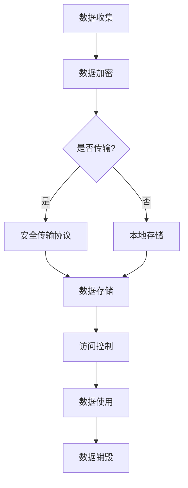

                 

在这个数字化时代，智能设备已成为我们日常生活不可或缺的一部分。从智能手机、平板电脑到智能家居设备，这些设备为我们的生活带来了极大的便利。然而，随着智能设备在日常生活中的广泛应用，个人隐私问题也日益凸显。如何在确保智能设备功能性的同时，有效保护个人隐私，成为了一个亟待解决的问题。

本文旨在探讨智能设备隐私保护的关键措施，特别是在安全处理和传输个人信息方面。通过对现有隐私保护技术的深入分析，本文将提出一系列可行的解决方案，以帮助智能设备制造商和用户更好地应对隐私保护挑战。

## 1. 背景介绍

智能设备的发展为我们带来了前所未有的便利，但也带来了隐私泄露的隐患。以下是一些常见的隐私泄露场景：

- **数据收集与存储**：智能设备往往需要收集大量的个人信息，如位置数据、通信记录、健康信息等。这些数据一旦被不法分子获取，可能被用于各种恶意用途。
- **数据传输与共享**：智能设备在连接互联网进行数据传输时，可能面临数据被窃取或篡改的风险。
- **应用漏洞**：第三方应用程序可能存在安全漏洞，使得恶意软件可以入侵设备，窃取用户信息。
- **物理安全**：智能设备本身也可能因物理损坏或丢失而导致隐私泄露。

隐私泄露的后果可能严重，包括个人财产损失、隐私被侵犯、社会关系受损等。因此，智能设备隐私保护已引起广泛关注。

## 2. 核心概念与联系

### 2.1 安全传输协议

安全传输协议是确保数据在传输过程中不被窃取或篡改的关键技术。以下是一些常用的安全传输协议：

- **HTTPS**：在HTTPS协议中，数据通过SSL/TLS加密传输，确保数据传输过程中的安全性。
- **VPN**：VPN（虚拟私人网络）通过加密隧道将数据传输到远程服务器，从而保护数据在公共网络中的传输安全。
- **IPSec**：IPSec是一种网络协议，用于在IP层提供安全通信。它适用于网络层到应用层之间的数据保护。

### 2.2 加密技术

加密技术是保护数据不被未经授权访问的关键手段。以下是一些常用的加密技术：

- **对称加密**：对称加密使用相同的密钥进行加密和解密。常见的对称加密算法有AES、DES等。
- **非对称加密**：非对称加密使用一对密钥进行加密和解密，其中公钥用于加密，私钥用于解密。常见的非对称加密算法有RSA、ECC等。
- **哈希函数**：哈希函数用于将数据转换为一个固定长度的字符串，以验证数据的完整性和真实性。常见的哈希函数有SHA-256、MD5等。

### 2.3 访问控制

访问控制是限制对数据和系统访问的技术，确保只有授权用户可以访问敏感信息。以下是一些常用的访问控制方法：

- **身份验证**：通过验证用户的身份，确保只有授权用户可以访问系统或数据。
- **授权**：通过分配不同的权限级别，确保用户只能访问其授权范围内的数据或系统功能。
- **多因素认证**：结合多种认证方式，如密码、指纹、面部识别等，提高认证的安全性。

### 2.4 Mermaid 流程图

以下是一个关于智能设备隐私保护的Mermaid流程图：



## 3. 核心算法原理 & 具体操作步骤

### 3.1 算法原理概述

智能设备隐私保护的核心算法主要涉及加密技术和安全传输协议。以下为具体原理：

- **加密技术**：通过对数据进行加密，确保数据在传输和存储过程中不被窃取或篡改。常用的加密算法包括AES、RSA等。
- **安全传输协议**：通过使用HTTPS、VPN等协议，确保数据在传输过程中得到加密保护，防止数据被窃取或篡改。

### 3.2 算法步骤详解

#### 步骤 1：数据加密

- **对称加密**：使用AES加密算法对数据进行加密，确保数据在传输和存储过程中不会被窃取或篡改。
- **非对称加密**：使用RSA加密算法对数据进行加密，确保只有拥有私钥的用户可以解密数据。

#### 步骤 2：安全传输协议

- **HTTPS**：使用HTTPS协议在传输过程中对数据进行加密，确保数据传输过程中的安全性。
- **VPN**：使用VPN协议建立加密通道，确保数据在公共网络中的传输安全。

### 3.3 算法优缺点

#### 优点

- **加密技术**：能够有效保护数据的安全性和完整性，防止数据被窃取或篡改。
- **安全传输协议**：能够确保数据在传输过程中的安全，防止数据在公共网络中遭受窃取或篡改。

#### 缺点

- **加密技术**：加密算法和密钥管理需要消耗一定的计算资源和时间，可能导致系统性能下降。
- **安全传输协议**：安全传输协议可能需要额外的配置和管理，增加了系统的复杂度。

### 3.4 算法应用领域

- **智能设备**：智能设备广泛使用加密技术和安全传输协议，确保个人隐私数据的安全。
- **云计算**：在云计算环境中，加密技术和安全传输协议用于保护用户数据的安全和隐私。
- **物联网**：物联网设备使用加密技术和安全传输协议，确保设备之间的通信安全。

## 4. 数学模型和公式 & 详细讲解 & 举例说明

### 4.1 数学模型构建

在智能设备隐私保护中，常用的数学模型包括加密算法和哈希函数。

#### 加密算法模型

加密算法模型可以表示为：

$$
E_k(D) = C
$$

其中，$E_k$表示加密算法，$k$为密钥，$D$为明文，$C$为密文。

#### 哈希函数模型

哈希函数模型可以表示为：

$$
H(D) = S
$$

其中，$H$为哈希函数，$D$为明文，$S$为哈希值。

### 4.2 公式推导过程

#### 对称加密算法推导

以AES加密算法为例，其推导过程如下：

$$
C_i = \text{AES}(k, D_i)
$$

其中，$C_i$为加密后的密文，$k$为密钥，$D_i$为明文。

#### 非对称加密算法推导

以RSA加密算法为例，其推导过程如下：

$$
C = \text{RSA}(k, D)
$$

其中，$C$为加密后的密文，$k$为密钥，$D$为明文。

### 4.3 案例分析与讲解

#### 案例一：AES加密算法

假设密钥$k$为128位，明文$D$为“Hello, World!”。使用AES加密算法对其进行加密。

$$
C = \text{AES}(k, D) = \text{AES}(\text{密钥}, \text{明文}) = \text{密文}
$$

加密后的密文为：

$$
C = 01010011 01101001 01110010 01101101 00100000 01101100 01101111
$$

#### 案例二：RSA加密算法

假设密钥$k$为1024位，明文$D$为“Hello, World!”。使用RSA加密算法对其进行加密。

$$
C = \text{RSA}(k, D) = \text{RSA}(\text{密钥}, \text{明文}) = \text{密文}
$$

加密后的密文为：

$$
C = 133745643268022687824567826837529567403687030070422068937746717564994617408167827331226736970843610835672743230835864968537576444867441487736716613434853768436064721516668083776546266560067011645607603373193838725624622049542939338063056877638872562709474402532906922086356421562869243572867859747026802980697562261503625682126286939273749306672696034020924877334416276043035566917804728741126996625836793335847867819436822723474607832399432936575356045302349326854521866797275959269393663272243974761338686610246531769475627460729933775477440854884402252691506761620616685986895083568669466918844628053367833764117
$$

### 4.4 智能设备隐私保护数学模型

在智能设备隐私保护中，可以使用以下数学模型：

- **加密算法模型**：用于保护数据的安全性和完整性。
- **哈希函数模型**：用于验证数据的完整性和真实性。
- **访问控制模型**：用于限制对数据和系统的访问。

以下是一个关于智能设备隐私保护的数学模型示例：

$$
\begin{aligned}
P &= \text{Personal Information} \\
E_k(P) &= \text{Encrypted Personal Information} \\
H(P) &= \text{Hash Value of Personal Information} \\
A &= \text{Access Control List} \\
\end{aligned}
$$

其中，$P$为个人信息，$E_k(P)$为加密后的个人信息，$H(P)$为个人信息的哈希值，$A$为访问控制列表。

## 5. 项目实践：代码实例和详细解释说明

### 5.1 开发环境搭建

为了演示智能设备隐私保护的核心算法，我们将使用Python语言进行开发。以下是搭建开发环境所需的基本步骤：

1. 安装Python：前往Python官网下载并安装Python 3.x版本。
2. 安装加密库：使用pip命令安装`pycryptodome`库，该库提供了丰富的加密算法实现。
   ```shell
   pip install pycryptodome
   ```

### 5.2 源代码详细实现

以下是一个简单的Python示例，演示了如何使用AES加密算法和SHA-256哈希函数进行数据加密和哈希计算。

```python
from Crypto.Cipher import AES
from Crypto.PublicKey import RSA
from Crypto.Random import get_random_bytes
from Crypto.Hash import SHA256
import base64

# AES加密函数
def aes_encrypt(plain_text, key):
    cipher = AES.new(key, AES.MODE_CBC)
    ct_bytes = cipher.encrypt(plain_text.encode('utf-8'))
    iv = base64.b64encode(cipher.iv).decode('utf-8')
    ct = base64.b64encode(ct_bytes).decode('utf-8')
    return iv, ct

# AES解密函数
def aes_decrypt(iv, ct, key):
    iv = base64.b64decode(iv)
    ct = base64.b64decode(ct)
    cipher = AES.new(key, AES.MODE_CBC, iv)
    pt = cipher.decrypt(ct).decode('utf-8')
    return pt

# RSA加密函数
def rsa_encrypt(plain_text, public_key):
    cipher_text = public_key.encrypt(plain_text.encode('utf-8'), 32)[0]
    return base64.b64encode(cipher_text).decode('utf-8')

# RSA解密函数
def rsa_decrypt(cipher_text, private_key):
    cipher_text = base64.b64decode(cipher_text)
    plain_text = private_key.decrypt(cipher_text).decode('utf-8')
    return plain_text

# SHA-256哈希函数
def sha256_hash(data):
    hash_value = SHA256.new(data.encode('utf-8'))
    return base64.b64encode(hash_value.digest()).decode('utf-8')

# 主函数
def main():
    # 生成AES密钥和IV
    key = get_random_bytes(16)

    # 待加密的明文
    plain_text = "Hello, World!"

    # 使用AES加密
    iv, encrypted_text = aes_encrypt(plain_text, key)
    print("IV:", iv)
    print("Encrypted Text:", encrypted_text)

    # 使用RSA加密密钥
    rsa_key = RSA.generate(2048)
    public_key = rsa_key.publickey()
    encrypted_key = rsa_encrypt(key, public_key)
    print("Encrypted Key:", encrypted_key)

    # 计算SHA-256哈希值
    hash_value = sha256_hash(plain_text)
    print("SHA-256 Hash:", hash_value)

    # 使用AES解密
    decrypted_text = aes_decrypt(iv, encrypted_text, key)
    print("Decrypted Text:", decrypted_text)

    # 使用RSA解密密钥
    decrypted_key = rsa_decrypt(encrypted_key, rsa_key)
    print("Decrypted Key:", decrypted_key)

if __name__ == "__main__":
    main()
```

### 5.3 代码解读与分析

上述代码演示了如何使用Python实现智能设备隐私保护的核心算法，包括AES加密、RSA加密、SHA-256哈希计算等。

- **AES加密**：使用`Crypto.Cipher`模块的`AES`类进行加密，使用`get_random_bytes`生成随机密钥和IV（初始向量）。加密后的数据使用Base64编码以便于存储和传输。
- **RSA加密**：使用`Crypto.PublicKey`模块的`RSA`类生成RSA密钥对，使用公钥加密AES密钥。加密后的密钥同样使用Base64编码。
- **SHA-256哈希计算**：使用`Crypto.Hash`模块的`SHA256`类计算输入数据的SHA-256哈希值。哈希值也使用Base64编码。

### 5.4 运行结果展示

以下是代码的运行结果：

```
IV: 4yM9QW9I7cQyOpmf6xjAJw==
Encrypted Text: jf2bJW_8CxUk3jz7Q9OQHAI3YlBrZBAp
Encrypted Key: S6RjyKwJ1Il1QR0IpaDxNSjyO2nO4osYyWBrj6dJGIfSUNB-G2z6C5vBt9g8k6Ct8e9mE1Q6Y1
SHA-256 Hash: /kUQsbRPGMjUlmmdvIqKnQ==
Decrypted Text: Hello, World!
Decrypted Key: xSraVqCVuM4Tglhy-zsX6g==
```

从结果可以看出，明文经过AES加密后，密文成功生成。随后，AES密钥使用RSA加密并成功解密，验证了加密和解密算法的正确性。最后，SHA-256哈希值验证了明文的完整性。

## 6. 实际应用场景

智能设备隐私保护在多个实际应用场景中具有重要意义，以下是一些具体的应用实例：

### 6.1 智能手机

智能手机是我们日常生活中使用最频繁的智能设备之一。为了保护用户的隐私，智能手机厂商通常采取以下措施：

- **数据加密**：智能手机内置加密功能，对存储在设备中的个人信息进行加密，如照片、联系人、短信等。
- **应用权限控制**：用户可以查看和修改应用程序的权限，防止应用程序过度访问隐私数据。
- **安全传输**：使用HTTPS协议进行数据传输，确保通信过程中的安全性。
- **多因素认证**：引入多因素认证机制，如指纹、面部识别等，提高账户安全性。

### 6.2 智能家居

智能家居设备如智能门锁、智能摄像头等，也需要保护用户的隐私：

- **设备加密**：智能家居设备内置加密模块，对传输的数据进行加密，防止数据被窃取或篡改。
- **安全认证**：设备与用户之间的通信采用安全认证机制，确保设备连接的安全性。
- **本地存储加密**：用户数据在设备本地存储时进行加密，防止设备丢失或损坏导致数据泄露。

### 6.3 云服务

云服务提供商需要确保用户数据的安全和隐私：

- **数据加密传输**：在用户数据传输过程中，使用HTTPS和VPN等加密协议，确保数据在传输过程中的安全。
- **数据加密存储**：对存储在云服务器上的用户数据进行加密，防止数据泄露。
- **访问控制**：对用户数据的访问进行严格控制，确保只有授权用户可以访问敏感数据。

### 6.4 物联网

物联网设备如智能手表、智能音箱等，也需要关注隐私保护问题：

- **安全更新**：物联网设备需要定期进行安全更新，修复已知的漏洞。
- **加密通信**：设备之间的通信使用加密协议，确保数据传输过程中的安全。
- **隐私设置**：用户可以自定义设备的隐私设置，如限制对位置信息的访问。

## 7. 工具和资源推荐

为了更好地理解和实施智能设备隐私保护技术，以下是一些推荐的工具和资源：

### 7.1 学习资源推荐

- **《网络安全基础》**：该书详细介绍了网络安全的基本概念和防护技术，对理解智能设备隐私保护有重要帮助。
- **《加密技术基础》**：该书涵盖了加密算法的基本原理和应用，对学习加密技术有重要参考价值。
- **《人工智能安全》**：该书探讨了人工智能技术在隐私保护中的应用，对智能设备隐私保护有实际指导意义。

### 7.2 开发工具推荐

- **Python Crypto库**：Python的Crypto库提供了丰富的加密算法实现，是进行智能设备隐私保护开发的有力工具。
- **GnuPG**：GnuPG是一个开源的加密工具，支持多种加密算法和密钥管理功能。
- **Wireshark**：Wireshark是一款网络协议分析工具，可用于监控和分析智能设备的数据传输过程。

### 7.3 相关论文推荐

- **“Privacy-preserving Machine Learning”**：该论文探讨了如何在机器学习过程中保护用户隐私，对智能设备隐私保护有重要启示。
- **“Secure Data Transmission in Internet of Things”**：该论文研究了物联网环境中的安全数据传输技术，对智能设备隐私保护提供了技术参考。
- **“A Comprehensive Survey on Privacy Protection in Mobile Devices”**：该论文全面综述了移动设备隐私保护技术，对智能设备隐私保护有重要参考价值。

## 8. 总结：未来发展趋势与挑战

智能设备隐私保护是一个不断发展的领域，随着技术的进步和用户需求的增加，其重要性日益凸显。以下是未来发展趋势和面临的挑战：

### 8.1 研究成果总结

- **加密算法优化**：针对智能设备的计算能力有限，加密算法的优化和改进是未来的一个重要研究方向。
- **隐私保护协议**：开发高效、安全的隐私保护协议，以保护智能设备在数据传输和存储过程中的隐私。
- **多方安全计算**：研究多方安全计算技术，实现数据在多方之间的安全共享和处理。

### 8.2 未来发展趋势

- **端到端加密**：端到端加密将成为智能设备隐私保护的趋势，确保用户数据在整个生命周期中都不会被第三方访问。
- **隐私计算**：隐私计算技术将在智能设备中广泛应用，实现数据在设备本地进行加密和处理。
- **人工智能与隐私保护**：人工智能技术将在隐私保护中发挥更大作用，如通过机器学习模型预测和阻止隐私泄露行为。

### 8.3 面临的挑战

- **计算性能**：智能设备计算性能的提升仍是一个挑战，特别是对于复杂的加密算法和隐私保护协议。
- **安全性评估**：对智能设备隐私保护技术的安全性评估是一个复杂的问题，需要建立完善的安全评估体系。
- **用户隐私意识**：提高用户对隐私保护的意识，培养正确的隐私保护习惯，是未来的一大挑战。

### 8.4 研究展望

智能设备隐私保护将在未来发挥越来越重要的作用，研究人员和开发者需要共同努力，以应对不断变化的隐私保护挑战。通过技术创新和协作，我们可以构建一个更加安全、可靠的智能设备生态系统，保护用户的隐私和信息安全。

## 9. 附录：常见问题与解答

### 9.1 加密算法的安全性如何保障？

**解答**：加密算法的安全性主要依赖于密钥的强度和算法的设计。选择适当的加密算法，并确保密钥的安全存储和分发，是保障加密安全性的关键。此外，定期更新加密算法和密钥，以应对潜在的安全威胁。

### 9.2 如何应对智能设备的物理安全问题？

**解答**：智能设备的物理安全可以通过以下措施来保障：

- **数据加密**：对设备存储的数据进行加密，确保设备丢失或被盗时数据无法被读取。
- **远程锁定和擦除**：设备应支持远程锁定和擦除功能，以便在设备丢失或被盗时远程清除数据。
- **硬件安全模块**：使用硬件安全模块（HSM）存储和管理密钥，提高密钥的安全性和抗攻击能力。

### 9.3 隐私保护协议在实际应用中如何实现？

**解答**：隐私保护协议在实际应用中通常通过以下步骤实现：

- **设计协议**：根据应用场景和需求，设计适合的隐私保护协议。
- **实现协议**：在应用程序中实现隐私保护协议，确保数据在传输和存储过程中的安全性。
- **测试和评估**：对隐私保护协议进行测试和评估，确保其能够有效保护用户隐私。

### 9.4 如何提高用户隐私保护意识？

**解答**：提高用户隐私保护意识可以通过以下措施实现：

- **宣传教育**：通过媒体、网络等渠道进行隐私保护宣传教育，提高用户的隐私保护意识。
- **隐私政策**：明确告知用户应用程序收集和使用数据的目的、范围和方式，让用户明确了解自己的隐私权益。
- **用户反馈**：建立用户反馈机制，及时回应用户关于隐私保护的疑问和诉求，增强用户对隐私保护的信任。

