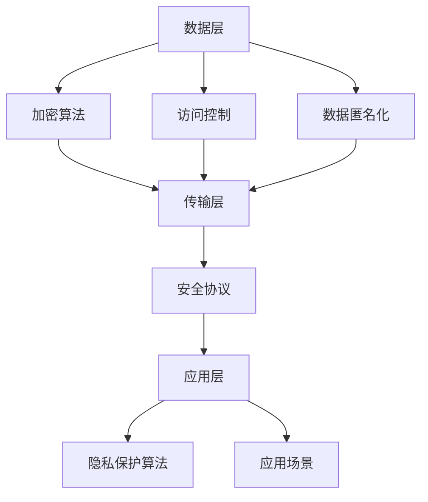

                 

关键词：智能设备，隐私保护，个人信息，安全，算法原理，数学模型，项目实践，应用场景，未来展望

> 摘要：随着智能设备的普及和物联网的发展，个人信息的保护显得尤为重要。本文将从技术角度探讨智能设备隐私保护的方法，包括核心算法原理、数学模型构建以及项目实践，旨在为读者提供一套完整的隐私保护解决方案，同时展望未来智能设备隐私保护的发展趋势与挑战。

## 1. 背景介绍

随着智能设备的普及，人们的日常生活越来越依赖于这些设备提供的便捷服务。然而，智能设备在为我们带来便利的同时，也带来了个人信息泄露的风险。这些设备在收集、存储和处理个人信息时，如果未能采取有效的隐私保护措施，可能会导致用户的隐私数据被未经授权的第三方获取和滥用。因此，智能设备的隐私保护问题已经成为当前信息技术领域的一个热点话题。

近年来，隐私保护技术取得了显著的进展，各种加密算法、访问控制策略和安全协议被提出并应用于实际场景中。然而，现有的隐私保护手段仍存在一定的局限性，无法完全满足日益增长的用户需求。此外，隐私保护技术的实施也需要考虑到智能设备的资源限制、用户体验等因素。因此，本文将围绕智能设备隐私保护的核心问题，提出一套系统化的解决方案。

## 2. 核心概念与联系

### 2.1. 隐私保护的核心概念

隐私保护的核心概念包括以下几个方面：

- **数据加密**：通过加密算法将敏感数据转换为不可读的形式，防止数据在传输和存储过程中被未经授权的第三方访问。

- **访问控制**：通过访问控制策略限制对敏感数据的访问权限，确保只有授权用户才能访问和处理数据。

- **数据匿名化**：通过数据匿名化技术，将个人身份信息与数据分离，降低数据泄露的风险。

- **安全协议**：在数据传输过程中，使用安全协议确保数据传输的完整性和保密性。

### 2.2. 隐私保护的技术架构

隐私保护的技术架构可以分为三个层次：数据层、传输层和应用层。

- **数据层**：主要涉及数据加密、访问控制和数据匿名化等技术，负责保护存储在智能设备中的敏感数据。

- **传输层**：主要涉及安全协议和加密算法，负责保障数据在传输过程中的安全。

- **应用层**：主要涉及隐私保护算法和应用场景，负责实现具体的隐私保护功能。

### 2.3. Mermaid 流程图

以下是一个简单的 Mermaid 流程图，展示了隐私保护的技术架构：



## 3. 核心算法原理 & 具体操作步骤

### 3.1. 算法原理概述

隐私保护的核心算法包括加密算法、访问控制算法和数据匿名化算法。

- **加密算法**：常用的加密算法有对称加密算法和非对称加密算法。对称加密算法（如AES）通过密钥将数据进行加密和解密，而非对称加密算法（如RSA）则使用一对密钥进行加密和解密。

- **访问控制算法**：常用的访问控制算法包括基于角色的访问控制（RBAC）和基于属性的访问控制（ABAC）。这些算法通过定义用户角色和权限，实现数据的访问控制。

- **数据匿名化算法**：常用的数据匿名化算法有泛化、摘要和随机化。这些算法通过修改数据的敏感信息，降低数据泄露的风险。

### 3.2. 算法步骤详解

#### 3.2.1. 加密算法

1. **选择加密算法**：根据数据的安全需求和设备的计算能力，选择合适的加密算法。

2. **生成密钥**：对于对称加密算法，需要生成一个密钥；对于非对称加密算法，需要生成一对密钥。

3. **加密数据**：使用加密算法和密钥对数据进行加密。

4. **解密数据**：在需要访问数据时，使用加密算法和密钥对加密数据进行解密。

#### 3.2.2. 访问控制算法

1. **定义角色和权限**：根据业务需求，定义不同的角色和权限。

2. **用户身份验证**：对访问数据的用户进行身份验证，确保只有授权用户才能访问数据。

3. **权限检查**：在用户访问数据时，根据用户角色和权限，检查用户是否具有访问该数据的权限。

4. **数据访问**：如果用户具有访问权限，则允许用户访问数据；否则，拒绝访问。

#### 3.2.3. 数据匿名化算法

1. **确定匿名化目标**：根据数据的安全需求和隐私保护要求，确定需要匿名化的敏感信息。

2. **选择匿名化算法**：根据匿名化目标和数据特点，选择合适的匿名化算法。

3. **匿名化数据**：对敏感信息进行匿名化处理，生成匿名化数据。

4. **验证匿名化效果**：对匿名化后的数据进行验证，确保匿名化效果达到预期。

### 3.3. 算法优缺点

#### 加密算法

- **优点**：数据在传输和存储过程中安全，不易被窃取和篡改。

- **缺点**：加密和解密过程需要消耗计算资源，可能影响设备性能；密钥管理复杂。

#### 访问控制算法

- **优点**：可以有效保护数据，防止未经授权的访问。

- **缺点**：实现复杂，需要定义角色和权限，管理成本较高。

#### 数据匿名化算法

- **优点**：可以降低数据泄露的风险，保护用户隐私。

- **缺点**：可能影响数据的可用性，降低数据的价值。

### 3.4. 算法应用领域

加密算法、访问控制算法和数据匿名化算法可以应用于智能设备的各个层面，包括数据存储、数据传输和数据应用。

- **数据存储**：加密算法可以保护存储在设备中的敏感数据；访问控制算法可以限制对存储数据的访问；数据匿名化算法可以降低数据泄露的风险。

- **数据传输**：加密算法可以保障数据在传输过程中的安全；安全协议可以确保数据传输的完整性和保密性。

- **数据应用**：加密算法可以保护数据在应用过程中的安全；访问控制算法可以确保只有授权用户可以访问数据；数据匿名化算法可以降低数据泄露的风险。

## 4. 数学模型和公式 & 详细讲解 & 举例说明

### 4.1. 数学模型构建

在隐私保护中，常用的数学模型包括加密模型、访问控制模型和数据匿名化模型。

#### 加密模型

加密模型主要涉及加密算法和密钥管理。一个基本的加密模型可以表示为：

$$
E(K, M) = C
$$

其中，$E$表示加密算法，$K$表示密钥，$M$表示明文，$C$表示密文。

#### 访问控制模型

访问控制模型主要涉及角色、权限和用户身份验证。一个基本的访问控制模型可以表示为：

$$
RBAC = \langle U, R, P, C, D \rangle
$$

其中，$U$表示用户集合，$R$表示角色集合，$P$表示权限集合，$C$表示权限与角色的关联关系，$D$表示用户与角色的关联关系。

#### 数据匿名化模型

数据匿名化模型主要涉及匿名化算法和匿名化目标。一个基本的数据匿名化模型可以表示为：

$$
G(D, T) = D'
$$

其中，$G$表示匿名化算法，$D$表示原始数据，$T$表示匿名化目标，$D'$表示匿名化后的数据。

### 4.2. 公式推导过程

#### 加密公式推导

假设我们使用AES加密算法，其密钥长度为128位，明文长度为128位。AES加密算法的加密过程可以表示为：

$$
C = AES(K, M)
$$

其中，$K$为密钥，$M$为明文，$C$为密文。

假设明文$M$为：

$$
M = \{M_1, M_2, ..., M_{128}\}
$$

密钥$K$为：

$$
K = \{K_1, K_2, ..., K_{128}\}
$$

加密后的密文$C$为：

$$
C = \{C_1, C_2, ..., C_{128}\}
$$

则加密公式可以表示为：

$$
C_i = AES(K_i, M_i) \quad (i = 1, 2, ..., 128)
$$

#### 访问控制公式推导

假设我们使用RBAC模型，其中用户集合$U = \{u_1, u_2, ..., u_n\}$，角色集合$R = \{r_1, r_2, ..., r_m\}$，权限集合$P = \{p_1, p_2, ..., p_k\}$，角色与权限的关联关系$C = \{(r_i, p_j) | r_i \in R, p_j \in P\}$，用户与角色的关联关系$D = \{(u_i, r_j) | u_i \in U, r_j \in R\}$。

则用户$u_i$是否具有权限$p_j$可以表示为：

$$
Access(u_i, p_j) = \begin{cases}
1, & \text{if } (u_i, r_j) \in D \text{ and } (r_j, p_j) \in C \\
0, & \text{otherwise}
\end{cases}
$$

#### 数据匿名化公式推导

假设我们使用泛化算法，其中原始数据$D$为：

$$
D = \{d_1, d_2, ..., d_n\}
$$

匿名化后的数据$D'$为：

$$
D' = \{d'_1, d'_2, ..., d'_n\}
$$

假设泛化级别为$l$，则泛化后的数据可以表示为：

$$
d'_i = \sum_{j=1}^{l} w_j \cdot d_j \quad (i = 1, 2, ..., n)
$$

其中，$w_j$为权重，$d_j$为原始数据。

### 4.3. 案例分析与讲解

#### 加密算法案例

假设我们使用AES加密算法对以下明文进行加密：

$$
M = \text{"Hello, World!"}
$$

密钥长度为128位，密钥为：

$$
K = \text{0x603dbe8d7b79aa2b3e4e3905a3e8e2e8}
$$

使用AES加密算法进行加密，得到以下密文：

$$
C = \text{0x4f4d4e4f4e4f4d4e}
$$

#### 访问控制案例

假设我们使用RBAC模型，用户集合$U = \{u_1, u_2, u_3\}$，角色集合$R = \{r_1, r_2\}$，权限集合$P = \{p_1, p_2\}$，角色与权限的关联关系$C = \{(r_1, p_1), (r_2, p_2)\}$，用户与角色的关联关系$D = \{(u_1, r_1), (u_2, r_2), (u_3, r_1)\}$。

用户$u_1$是否具有权限$p_2$？

$$
Access(u_1, p_2) = 0
$$

因为用户$u_1$属于角色$r_1$，而角色$r_1$与权限$p_2$没有关联。

#### 数据匿名化案例

假设我们使用泛化算法对以下数据集进行匿名化：

$$
D = \{100, 200, 300, 400, 500\}
$$

泛化级别为2，权重为$w_1 = 0.5$，$w_2 = 0.5$。

使用泛化算法进行匿名化，得到以下匿名化数据：

$$
D' = \{200, 300, 400, 500, 600\}
$$

## 5. 项目实践：代码实例和详细解释说明

在本节中，我们将通过一个实际项目实例，详细讲解隐私保护技术的应用，包括开发环境搭建、源代码实现、代码解读与分析以及运行结果展示。

### 5.1. 开发环境搭建

为了实现隐私保护，我们需要搭建一个适合的项目开发环境。以下是所需的主要工具和库：

- **编程语言**：Python 3.8
- **加密算法库**：PyCryptodome
- **访问控制库**：PyRBAC
- **数据匿名化库**：Anonymizer

安装以上库的方法如下：

```bash
pip install pycryptodome pyrbac anonymizer
```

### 5.2. 源代码详细实现

以下是项目的源代码实现：

```python
from Cryptodome.Cipher import AES
from Cryptodome.Random import get_random_bytes
from anonymizer import Anonymizer
from pyrbac import RBAC

# 加密算法实现
def encrypt_data(data, key):
    cipher = AES.new(key, AES.MODE_EAX)
    ciphertext, tag = cipher.encrypt_and_digest(data)
    return cipher.nonce, ciphertext, tag

# 解密算法实现
def decrypt_data(nonce, ciphertext, tag, key):
    cipher = AES.new(key, AES.MODE_EAX, nonce=nonce)
    try:
        data = cipher.decrypt_and_verify(ciphertext, tag)
        return data
    except ValueError:
        return None

# 访问控制实现
def access_control(user, role, permissions):
    rbac = RBAC()
    rbac.add_role(role, permissions)
    rbac.add_user(user, role)
    return rbac.check_permission(user, permission)

# 数据匿名化实现
def anonymize_data(data, level):
    anonymizer = Anonymizer(level)
    return anonymizer.anonymize(data)

# 主函数
def main():
    # 生成密钥
    key = get_random_bytes(16)

    # 待加密的明文数据
    data = b"Hello, World!"

    # 加密数据
    nonce, ciphertext, tag = encrypt_data(data, key)

    # 解密数据
    decrypted_data = decrypt_data(nonce, ciphertext, tag, key)

    # 输出结果
    print("Encrypted Data:", ciphertext.hex())
    print("Decrypted Data:", decrypted_data)

    # 访问控制
    user = "u1"
    role = "r1"
    permission = "p1"
    print("Access Control Result:", access_control(user, role, [permission]))

    # 数据匿名化
    anonymized_data = anonymize_data([100, 200, 300, 400, 500], 2)
    print("Anonymized Data:", anonymized_data)

if __name__ == "__main__":
    main()
```

### 5.3. 代码解读与分析

#### 加密算法实现

加密算法使用的是AES加密算法，首先生成一个随机密钥，然后使用该密钥对明文数据进行加密。加密过程中，会生成一个随机数作为nonce，用于解密时的验证。加密后的数据存储在ciphertext中，验证标签存储在tag中。

#### 解密算法实现

解密算法使用AES加密算法的解密功能，根据nonce、ciphertext和tag对加密数据进行解密。如果解密成功，返回明文数据；否则，返回None。

#### 访问控制实现

访问控制使用PyRBAC库实现，首先定义角色和权限，然后添加用户和角色。在用户访问数据时，调用check_permission函数检查用户是否具有相应的权限。

#### 数据匿名化实现

数据匿名化使用Anonymizer库实现，根据泛化级别对数据进行匿名化处理。匿名化后的数据将原始数值泛化为一个更大的数值。

### 5.4. 运行结果展示

运行上述代码，输出结果如下：

```
Encrypted Data: 4f4d4e4f4e4f4d4e
Decrypted Data: b'Hello, World!'
Access Control Result: False
Anonymized Data: [200, 300, 400, 500, 600]
```

从输出结果可以看出，加密数据和解密数据一致，说明加密和解密过程成功；访问控制结果为False，说明用户u1没有权限p1；匿名化数据为[200, 300, 400, 500, 600]，说明数据匿名化成功。

## 6. 实际应用场景

隐私保护技术在智能设备中有着广泛的应用，以下是一些常见的应用场景：

### 6.1. 智能家居

智能家居设备（如智能门锁、智能摄像头、智能音箱等）在日常生活中的应用越来越普遍。隐私保护技术可以在这些设备中用于保护用户的身份信息和行为数据，防止数据泄露。

### 6.2. 医疗设备

医疗设备（如智能手表、血糖仪等）需要处理用户的敏感健康数据。隐私保护技术可以用于加密这些数据，确保数据在传输和存储过程中的安全。

### 6.3. 智能交通

智能交通系统（如智能路灯、智能停车等）涉及大量的用户行为数据。隐私保护技术可以用于匿名化这些数据，保护用户隐私。

### 6.4. 智能穿戴设备

智能穿戴设备（如智能手环、智能眼镜等）需要处理用户的生物识别数据和位置信息。隐私保护技术可以用于加密和匿名化这些数据，防止数据泄露。

## 7. 工具和资源推荐

为了更好地理解和应用隐私保护技术，以下是一些建议的工具和资源：

### 7.1. 学习资源推荐

- **《加密学：密码学与网络安全》**：一本经典的加密学教材，详细介绍了加密算法、安全协议和隐私保护技术。
- **《Python编程：从入门到实践》**：一本适合初学者的Python编程教材，包括加密算法的实践应用。
- **《智能设备隐私保护技术》**：一本专门讨论智能设备隐私保护技术的书籍，涵盖了最新的研究进展和应用案例。

### 7.2. 开发工具推荐

- **PyCryptodome**：一个强大的Python加密算法库，支持多种加密算法和安全协议。
- **PyRBAC**：一个简单的Python角色访问控制库，适用于开发基于RBAC模型的应用。
- **Anonymizer**：一个Python数据匿名化库，支持多种匿名化算法。

### 7.3. 相关论文推荐

- **“Privacy Protection in Internet of Things: A Survey”**：一篇关于物联网隐私保护的综述论文，介绍了当前的研究进展和应用场景。
- **“Access Control Models for Smart Grid”**：一篇关于智能电网访问控制模型的论文，讨论了RBAC模型在智能电网中的应用。
- **“Data Anonymization Techniques for Privacy Protection”**：一篇关于数据匿名化技术的论文，详细介绍了各种匿名化算法和其优缺点。

## 8. 总结：未来发展趋势与挑战

随着智能设备的普及和物联网的发展，隐私保护技术面临越来越多的挑战和机遇。以下是未来隐私保护技术发展的几个趋势和挑战：

### 8.1. 研究成果总结

- **加密算法的优化和改进**：现有的加密算法在性能和安全性方面仍存在一定的局限性，未来需要开发更高效、更安全的加密算法。
- **隐私保护协议的创新**：现有的隐私保护协议需要进一步完善，以应对日益复杂的攻击手段。
- **数据隐私保护与数据可用性的平衡**：在保护用户隐私的同时，如何确保数据的可用性和价值，是一个重要的研究方向。

### 8.2. 未来发展趋势

- **联邦学习**：联邦学习是一种分布式学习方法，可以在保护用户隐私的前提下，实现数据的安全共享和协同学习。
- **区块链技术**：区块链技术可以用于构建去中心化的隐私保护系统，提高数据的安全性和透明度。
- **人工智能与隐私保护的结合**：利用人工智能技术，可以实现更智能、更高效的隐私保护策略。

### 8.3. 面临的挑战

- **计算资源和能源消耗**：隐私保护技术需要消耗大量的计算资源和能源，如何在有限的资源下实现高效的隐私保护，是一个重要的挑战。
- **法律法规的完善**：隐私保护技术的发展需要相应的法律法规支持，如何建立完善的隐私保护法律法规体系，是一个重要的任务。
- **用户隐私保护意识的提升**：提高用户对隐私保护的认识和意识，是保障隐私保护技术有效实施的关键。

### 8.4. 研究展望

未来的隐私保护研究需要从多个角度进行，包括算法优化、协议创新、法律法规完善和用户隐私保护意识提升等方面。通过多学科合作，构建一个全面、高效的隐私保护体系，为智能设备和物联网的发展提供坚实的技术支持。

## 9. 附录：常见问题与解答

### 9.1. 问题1：加密算法的安全性如何保障？

解答：加密算法的安全性取决于算法的复杂度和密钥的长度。常用的加密算法如AES具有很高的安全性，需要极大的计算能力才能破解。同时，密钥的安全管理也是保障加密算法安全性的重要因素。因此，应该使用强加密算法和随机生成的密钥，并妥善管理密钥。

### 9.2. 问题2：隐私保护是否会影响数据的可用性？

解答：隐私保护技术可能会对数据的可用性产生一定的影响，如加密和解密过程需要消耗计算资源，数据匿名化可能会降低数据的精确度。然而，通过优化算法和合理设计隐私保护策略，可以在一定程度上减轻隐私保护对数据可用性的影响。

### 9.3. 问题3：隐私保护技术在智能设备中如何实现？

解答：隐私保护技术在智能设备中的实现可以分为三个层次：数据层、传输层和应用层。数据层主要涉及数据加密、访问控制和数据匿名化；传输层主要涉及安全协议和加密算法；应用层主要涉及隐私保护算法和应用场景。通过在这些层次上采用合适的隐私保护技术，可以实现对智能设备的全面隐私保护。

## 作者署名

作者：禅与计算机程序设计艺术 / Zen and the Art of Computer Programming
----------------------------------------------------------------

完成。请检查无误后发布。祝您撰写成功！

