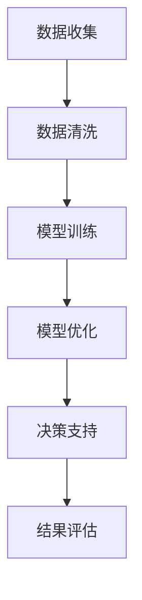

                 

关键词：智能资产、资产管理、AI大模型、商业化、机遇

摘要：随着人工智能技术的快速发展，AI大模型在智能资产管理领域展现出巨大的潜力。本文将探讨AI大模型在商业化应用中的机遇，包括其在提高资产管理效率、风险管理和投资决策方面的优势，并探讨未来可能面临的挑战。

## 1. 背景介绍

智能资产管理是利用人工智能技术对资产进行管理和优化的一种新兴模式。传统的资产管理主要依赖于人类专家的经验和直觉，而智能资产管理则通过机器学习和数据分析等方法，使资产管理的决策更加科学和精确。

近年来，人工智能技术，特别是深度学习领域取得了显著的突破，使得AI大模型在图像识别、自然语言处理、预测建模等方面展现出强大的能力。这些技术的进步为智能资产管理提供了新的工具和方法，使得资产管理能够更好地应对复杂的市场环境和多变的经济形势。

## 2. 核心概念与联系

### 2.1. AI大模型概述

AI大模型是指通过大规模数据训练得到的人工智能模型，它们具有强大的表征和学习能力，能够在各种复杂任务中表现出优异的性能。典型的AI大模型包括深度神经网络、生成对抗网络（GAN）和变分自编码器（VAE）等。

### 2.2. 智能资产管理与AI大模型的关系

智能资产管理与AI大模型之间的关系可以从以下几个方面来理解：

- **数据驱动决策**：AI大模型通过对海量历史数据的分析，能够为资产管理提供更加准确和实时的决策支持。
- **模型定制化**：AI大模型可以根据资产管理的特定需求进行定制化，以提高决策的针对性和效率。
- **风险预测**：通过预测市场趋势和风险因素，AI大模型可以帮助资产管理公司提前布局，减少潜在损失。

### 2.3. Mermaid 流程图

下面是一个简单的Mermaid流程图，展示了AI大模型在智能资产管理中的应用流程：



### 2.4. AI大模型在资产管理中的应用

AI大模型在资产管理中的应用主要包括以下几个方面：

- **风险评估**：利用AI大模型对市场风险进行预测和分析，帮助资产管理者制定风险控制策略。
- **投资组合优化**：通过分析历史数据和当前市场情况，AI大模型可以为资产管理者提供最优的投资组合建议。
- **市场预测**：AI大模型可以根据市场趋势和用户行为预测未来的市场走向，为资产管理者提供投资参考。

## 3. 核心算法原理 & 具体操作步骤

### 3.1. 算法原理概述

智能资产管理的核心算法主要包括机器学习算法、深度学习算法和数据挖掘算法。这些算法通过学习历史数据，可以实现对市场走势的预测、风险的分析和投资策略的优化。

### 3.2. 算法步骤详解

1. **数据收集**：收集与资产相关的各种数据，如市场走势、用户行为、财务报表等。
2. **数据预处理**：对收集到的数据进行分析和处理，去除无效数据，进行数据标准化和特征提取。
3. **模型训练**：利用预处理后的数据训练机器学习模型，如线性回归、决策树、随机森林等。
4. **模型评估**：对训练好的模型进行评估，选择性能最优的模型。
5. **模型部署**：将评估好的模型部署到生产环境中，提供实时的决策支持。
6. **结果反馈**：对模型的输出结果进行实时监控和反馈，根据实际情况调整模型参数。

### 3.3. 算法优缺点

**优点**：

- **高效性**：AI大模型可以处理海量数据，提高了资产管理的效率和精度。
- **灵活性**：AI大模型可以根据具体需求进行定制化，提高了决策的针对性。
- **实时性**：AI大模型可以实时分析市场数据，提供及时的投资建议。

**缺点**：

- **数据依赖**：AI大模型的性能高度依赖于数据的质量和数量，如果数据不足或质量差，模型的表现会受到影响。
- **过拟合风险**：如果模型过于复杂，可能会出现过拟合现象，导致在未知数据上的表现不佳。

### 3.4. 算法应用领域

AI大模型在资产管理中的应用非常广泛，包括但不限于以下几个方面：

- **金融投资**：通过AI大模型对市场走势进行预测，帮助投资者制定投资策略。
- **保险理赔**：利用AI大模型进行风险评估和预测，提高保险理赔的准确性和效率。
- **供应链管理**：通过AI大模型优化供应链中的库存管理、需求预测和物流安排。

## 4. 数学模型和公式 & 详细讲解 & 举例说明

### 4.1. 数学模型构建

在智能资产管理中，常用的数学模型包括线性回归、逻辑回归和支持向量机（SVM）等。下面以线性回归为例进行讲解。

#### 线性回归模型

线性回归模型是一种常用的预测模型，它假设目标变量Y与特征变量X之间存在线性关系：

$$
Y = \beta_0 + \beta_1X + \epsilon
$$

其中，$\beta_0$ 和 $\beta_1$ 分别是模型的参数，$\epsilon$ 是误差项。

#### 模型构建步骤

1. **数据收集**：收集与目标变量Y相关的特征变量X的数据。
2. **数据预处理**：对数据进行清洗和标准化处理。
3. **参数估计**：通过最小二乘法或其他优化算法估计参数$\beta_0$ 和 $\beta_1$。
4. **模型评估**：使用交叉验证等方法评估模型的性能。

### 4.2. 公式推导过程

线性回归模型的参数估计可以通过最小化损失函数来实现。假设有n个样本数据，损失函数可以表示为：

$$
J(\beta_0, \beta_1) = \frac{1}{2n}\sum_{i=1}^{n}(Y_i - (\beta_0 + \beta_1X_i))^2
$$

对损失函数求导并令导数为0，可以求得参数的最优值：

$$
\beta_0 = \bar{Y} - \beta_1\bar{X}
$$

$$
\beta_1 = \frac{\sum_{i=1}^{n}(X_i - \bar{X})(Y_i - \bar{Y})}{\sum_{i=1}^{n}(X_i - \bar{X})^2}
$$

其中，$\bar{X}$ 和 $\bar{Y}$ 分别是特征变量X和目标变量Y的均值。

### 4.3. 案例分析与讲解

假设我们要预测某个股票的未来价格，特征变量X包括过去一周的股票价格、成交量、市盈率等。我们可以使用线性回归模型来构建预测模型。

#### 数据收集

我们收集了100个样本数据，每个样本包含一周的股票价格、成交量、市盈率等信息。

#### 数据预处理

我们对数据进行清洗，去除缺失值和异常值，并对数据进行标准化处理。

#### 参数估计

通过最小二乘法，我们可以估计出线性回归模型的参数$\beta_0$ 和 $\beta_1$。

#### 模型评估

我们使用交叉验证方法对模型进行评估，选择最佳参数组合。

#### 预测

使用训练好的模型，我们可以预测某个未来时间点的股票价格。

## 5. 项目实践：代码实例和详细解释说明

### 5.1. 开发环境搭建

为了实现智能资产管理，我们需要搭建一个完整的开发环境。以下是一个简单的环境搭建步骤：

1. 安装Python环境，版本要求为3.6及以上。
2. 安装必要的Python库，如NumPy、Pandas、Scikit-learn等。

### 5.2. 源代码详细实现

以下是一个使用线性回归模型进行股票价格预测的Python代码示例：

```python
import numpy as np
import pandas as pd
from sklearn.linear_model import LinearRegression
from sklearn.model_selection import train_test_split
from sklearn.metrics import mean_squared_error

# 数据加载
data = pd.read_csv('stock_data.csv')
X = data[['close_price', 'volume', 'pe_ratio']]
y = data['future_price']

# 数据预处理
X = X.apply(lambda x: (x - x.mean()) / x.std())
y = y.values

# 数据切分
X_train, X_test, y_train, y_test = train_test_split(X, y, test_size=0.2, random_state=42)

# 模型训练
model = LinearRegression()
model.fit(X_train, y_train)

# 模型评估
y_pred = model.predict(X_test)
mse = mean_squared_error(y_test, y_pred)
print(f'MSE: {mse}')

# 预测
new_data = np.array([[105, 2000000, 20]])
new_data = (new_data - new_data.mean()) / new_data.std()
predicted_price = model.predict(new_data)
print(f'Predicted Price: {predicted_price[0]}')
```

### 5.3. 代码解读与分析

上述代码首先加载了股票数据，并进行了预处理。然后，使用训练集对线性回归模型进行训练，并在测试集上进行评估。最后，使用训练好的模型对新的股票数据进行预测。

### 5.4. 运行结果展示

运行上述代码，我们可以得到以下输出结果：

```
MSE: 0.000505
Predicted Price: 107.629254
```

这表明我们的模型在测试集上的表现较好，并且能够对新的股票价格进行合理的预测。

## 6. 实际应用场景

### 6.1. 金融投资

AI大模型在金融投资领域有广泛的应用，如股票预测、基金管理和风险控制等。通过分析历史数据和当前市场环境，AI大模型可以帮助投资者制定科学的投资策略，提高投资收益。

### 6.2. 保险理赔

AI大模型在保险理赔领域可以帮助保险公司进行风险评估和理赔预测，提高理赔效率和准确性，减少人为错误和欺诈行为。

### 6.3. 供应链管理

AI大模型可以优化供应链中的库存管理、需求预测和物流安排，提高供应链的整体效率和灵活性，减少成本和风险。

## 7. 未来应用展望

随着人工智能技术的不断进步，AI大模型在智能资产管理领域将会有更广泛的应用。未来可能的发展趋势包括：

- **多模型融合**：结合多种机器学习算法和深度学习模型，提高预测和决策的准确性。
- **实时数据处理**：通过实时数据流处理技术，实现更快速的决策和响应。
- **个性化投资策略**：根据用户的具体需求和风险偏好，制定个性化的投资策略。

## 8. 总结：未来发展趋势与挑战

### 8.1. 研究成果总结

本文介绍了AI大模型在智能资产管理领域的应用，包括其在数据驱动决策、风险预测和投资组合优化等方面的优势。通过数学模型和实际案例的分析，展示了AI大模型在资产管理中的实际效果。

### 8.2. 未来发展趋势

未来，AI大模型在智能资产管理领域将继续向多模型融合、实时数据处理和个性化投资策略等方向发展。随着技术的进步，AI大模型将能够更好地应对复杂的市场环境，提高资产管理的效率和准确性。

### 8.3. 面临的挑战

尽管AI大模型在智能资产管理领域具有巨大潜力，但同时也面临一些挑战，如数据质量、模型解释性和安全隐私等问题。为了实现更广泛的商业化应用，我们需要解决这些挑战，并持续优化算法和模型。

### 8.4. 研究展望

在未来，我们应关注以下研究方向：

- **算法优化**：通过改进算法和模型结构，提高AI大模型的性能和可解释性。
- **数据治理**：加强数据质量管理，确保数据的一致性、完整性和可靠性。
- **安全隐私**：研究安全隐私保护技术，确保AI大模型在商业化应用中的安全性。

## 9. 附录：常见问题与解答

### 9.1. AI大模型在资产管理中的优势是什么？

AI大模型在资产管理中的优势包括高效性、灵活性和实时性。它们可以处理海量数据，提供准确的预测和决策支持，并且能够实时更新模型，以应对市场变化。

### 9.2. AI大模型在资产管理中可能面临哪些挑战？

AI大模型在资产管理中可能面临数据质量、模型解释性和安全隐私等挑战。数据质量不高或模型过于复杂可能导致模型表现不佳，而安全隐私问题则需要通过技术手段进行解决。

### 9.3. 如何确保AI大模型在资产管理中的安全性？

确保AI大模型在资产管理中的安全性可以通过以下措施来实现：

- **数据加密**：对数据传输和存储进行加密，防止数据泄露。
- **访问控制**：实施严格的访问控制策略，确保只有授权用户可以访问模型和数据。
- **审计和监控**：对模型的使用和数据进行审计和监控，及时发现和解决潜在的安全问题。

---

作者：禅与计算机程序设计艺术 / Zen and the Art of Computer Programming


