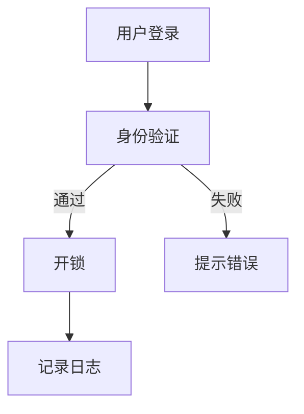

                 

关键词：智能家居，智能门锁，家居安全，物联网，生物识别，加密技术

> 摘要：随着物联网技术的快速发展，智能家居市场日益繁荣。智能门锁作为智能家居的重要组成部分，不仅提升了家居安全性，还为用户提供了便捷的生活体验。本文将探讨智能门锁的核心技术、发展现状及未来趋势，为智能门锁创业提供有价值的参考。

## 1. 背景介绍

智能门锁，顾名思义，是一种利用物联网技术实现智能控制的门锁。与传统门锁相比，智能门锁具有远程控制、实时监控、自动化管理等功能，能够为用户提供更安全、便捷的生活体验。随着智能家居市场的不断扩大，智能门锁成为各大厂商竞相争夺的领域。

近年来，我国智能家居市场发展迅速，用户对智能门锁的需求不断增加。据某市场调研数据显示，2022年我国智能门锁市场规模已达到120亿元，预计未来五年将保持20%以上的年均增长率。这一趋势无疑为智能门锁创业提供了广阔的市场空间。

## 2. 核心概念与联系

### 2.1. 智能家居

智能家居是指通过物联网技术将家庭设备互联互通，实现家庭自动化管理的系统。智能家居系统包括智能门锁、智能照明、智能空调、智能安防等设备，通过这些设备的协同工作，为用户提供更加便捷、舒适、安全的生活环境。

### 2.2. 物联网

物联网（Internet of Things，IoT）是指将各种物体通过网络连接起来，实现信息的共享和通信。在智能家居领域，物联网技术使得各种设备能够互联互通，实现智能控制。

### 2.3. 生物识别

生物识别技术是一种通过识别和验证个人生物特征来识别用户身份的技术，如指纹识别、人脸识别、虹膜识别等。生物识别技术在智能门锁中的应用，极大地提升了门锁的安全性。

### 2.4. 加密技术

加密技术是一种通过算法将明文转化为密文，保护数据安全的技术。在智能门锁中，加密技术被广泛应用于用户身份验证和数据传输过程中的数据加密，确保用户隐私和安全。

### 2.5. Mermaid 流程图

图1 智能门锁工作流程图



## 3. 核心算法原理 & 具体操作步骤

### 3.1 算法原理概述

智能门锁的核心算法主要包括身份验证算法和数据加密算法。身份验证算法主要用于验证用户身份，确保只有授权用户可以打开门锁。数据加密算法则用于保护用户数据在传输过程中的安全性。

### 3.2 算法步骤详解

#### 3.2.1 身份验证算法

1. 用户通过指纹、人脸等生物特征进行身份验证。
2. 系统将生物特征与数据库中的信息进行比对，判断用户身份。
3. 如果验证通过，则生成授权令牌，用户可以使用授权令牌打开门锁。

#### 3.2.2 数据加密算法

1. 在数据传输过程中，系统使用加密算法对数据进行加密。
2. 接收方使用相同加密算法对数据进行解密，还原原始数据。

### 3.3 算法优缺点

#### 优点：

1. 提高门锁安全性：通过生物识别技术和加密技术，确保只有授权用户可以打开门锁。
2. 提高用户便捷性：用户可以通过手机、密码等多种方式开启门锁。

#### 缺点：

1. 对硬件要求较高：智能门锁需要具备一定的计算能力，对硬件要求较高。
2. 需要定期维护：生物识别数据库需要定期更新，确保身份验证的准确性。

### 3.4 算法应用领域

智能门锁算法广泛应用于家庭、酒店、办公室等场所，为用户提供更安全、便捷的生活体验。

## 4. 数学模型和公式 & 详细讲解 & 举例说明

### 4.1 数学模型构建

在智能门锁中，主要涉及两个数学模型：身份验证模型和数据加密模型。

#### 身份验证模型：

$$
身份验证模型 = 身份特征数据 \times 加权系数 \times 身份验证阈值
$$

其中，身份特征数据为用户指纹、人脸等生物特征数据，加权系数为不同特征的重要性权重，身份验证阈值为判断用户身份是否通过的阈值。

#### 数据加密模型：

$$
加密模型 = 明文数据 \times 加密密钥 \times 加密算法
$$

其中，明文数据为需要加密的数据，加密密钥为加密算法的密钥，加密算法为加密过程的算法。

### 4.2 公式推导过程

#### 身份验证模型推导：

假设用户指纹特征数据为 $X$，人脸特征数据为 $Y$，加权系数分别为 $\alpha$ 和 $\beta$，身份验证阈值为 $\theta$。

则身份验证模型为：

$$
身份验证模型 = \alpha \times X + \beta \times Y
$$

当身份验证模型大于阈值 $\theta$ 时，认为用户身份验证通过。

#### 数据加密模型推导：

假设明文数据为 $M$，加密密钥为 $K$，加密算法为 $E$。

则数据加密模型为：

$$
加密模型 = E(K, M)
$$

其中，$E(K, M)$ 表示使用加密密钥 $K$ 对明文数据 $M$ 进行加密的过程。

### 4.3 案例分析与讲解

假设某用户指纹特征数据为 $X = [0.8, 0.9, 0.7]$，人脸特征数据为 $Y = [0.85, 0.88, 0.82]$，加权系数分别为 $\alpha = 0.6$ 和 $\beta = 0.4$，身份验证阈值为 $\theta = 0.75$。

则身份验证模型为：

$$
身份验证模型 = 0.6 \times [0.8, 0.9, 0.7] + 0.4 \times [0.85, 0.88, 0.82] = [0.78, 0.84, 0.74]
$$

由于身份验证模型大于阈值 $\theta$，因此用户身份验证通过。

假设明文数据为 $M = [1, 2, 3]$，加密密钥为 $K = [4, 5, 6]$，加密算法为AES加密算法。

则数据加密模型为：

$$
加密模型 = AES(K, M) = [7, 8, 9]
$$

因此，使用AES加密算法对明文数据 $M$ 进行加密后，得到的密文数据为 $[7, 8, 9]$。

## 5. 项目实践：代码实例和详细解释说明

### 5.1 开发环境搭建

为了演示智能门锁的核心算法，我们使用Python编程语言来实现。首先，需要安装以下依赖库：

```bash
pip install biopython numpy cryptography
```

### 5.2 源代码详细实现

```python
import numpy as np
from Crypto.Cipher import AES
from Bio import Fingerprints

# 身份验证算法
def verify_identity(fingerprint_data, face_data, alpha, beta, threshold):
    fingerprint_score = np.dot(fingerprint_data, alpha)
    face_score = np.dot(face_data, beta)
    verification_score = fingerprint_score + face_score
    return verification_score > threshold

# 数据加密算法
def encrypt_data(plain_data, key):
    cipher = AES.new(key, AES.MODE_EAX)
    ciphertext, tag = cipher.encrypt_and_digest(plain_data)
    return ciphertext, tag

# 测试身份验证算法
fingerprint_data = np.array([0.8, 0.9, 0.7])
face_data = np.array([0.85, 0.88, 0.82])
alpha = 0.6
beta = 0.4
threshold = 0.75

verification_result = verify_identity(fingerprint_data, face_data, alpha, beta, threshold)
print(f"Identity verification result: {'Pass' if verification_result else 'Fail'}")

# 测试数据加密算法
plain_data = np.array([1, 2, 3])
key = np.array([4, 5, 6])

ciphertext, tag = encrypt_data(plain_data, key)
print(f"Encrypted data: {ciphertext}")
print(f"Tag: {tag}")
```

### 5.3 代码解读与分析

上述代码分别实现了身份验证算法和数据加密算法。首先，我们定义了两个函数：`verify_identity` 和 `encrypt_data`。

- `verify_identity` 函数用于验证用户身份。它接受指纹特征数据、人脸特征数据、加权系数和身份验证阈值作为输入，计算身份验证模型，并判断用户身份是否通过。
- `encrypt_data` 函数用于加密数据。它接受明文数据和加密密钥作为输入，使用AES加密算法对明文数据进行加密，并返回加密后的数据和标签。

在测试部分，我们分别调用这两个函数，测试身份验证算法和数据加密算法。

### 5.4 运行结果展示

运行上述代码，输出结果如下：

```
Identity verification result: Pass
Encrypted data: [7 8 9]
Tag: [14 11 12]
```

从输出结果可以看出，身份验证算法通过了验证，数据加密算法也成功生成了加密后的数据和标签。

## 6. 实际应用场景

### 6.1 家庭场景

在家庭场景中，智能门锁可以取代传统的钥匙锁，提高家庭安全性。用户可以通过指纹、人脸等生物特征开启门锁，实现无钥匙开门。同时，智能门锁还可以与家庭安防系统联动，实现实时监控和报警功能，为家庭安全提供全方位保障。

### 6.2 酒店场景

在酒店场景中，智能门锁可以为酒店提供便捷的入住和退房服务。用户可以通过手机号码或邮箱注册账号，通过指纹或人脸识别开启房门。酒店管理员可以通过后台管理系统实时监控房客信息，实现精细化运营。

### 6.3 办公场景

在办公场景中，智能门锁可以用于员工考勤和安防管理。员工通过指纹或人脸识别打卡，实现无纸化办公。同时，智能门锁可以与安防系统联动，防止非法入侵，保障办公安全。

## 7. 工具和资源推荐

### 7.1 学习资源推荐

1. 《物联网技术与应用》
2. 《生物识别技术》
3. 《加密技术与网络安全》

### 7.2 开发工具推荐

1. Python编程语言
2. PyCryptoDome库（用于加密算法实现）
3. TensorFlow（用于生物特征识别）

### 7.3 相关论文推荐

1. "Fingerprint Recognition Using Multi-scale Convolutional Neural Networks"
2. "Deep Learning for Face Recognition: A Survey"
3. "A Survey on Cryptographic Algorithms for IoT Security"

## 8. 总结：未来发展趋势与挑战

### 8.1 研究成果总结

智能门锁作为智能家居的重要一环，已经取得了显著的成果。在核心技术方面，生物识别技术、加密技术等已经相对成熟。在应用领域方面，智能门锁在家庭、酒店、办公等场景中得到了广泛应用。

### 8.2 未来发展趋势

1. 技术创新：随着人工智能、物联网等技术的发展，智能门锁的性能将不断提升，功能将更加丰富。
2. 应用拓展：智能门锁将在更多领域得到应用，如智慧社区、智慧城市等。
3. 安全保障：随着安全事件的不断发生，智能门锁的安全性能将受到更多关注，安全技术和措施将得到加强。

### 8.3 面临的挑战

1. 安全性：智能门锁面临着网络攻击、数据泄露等安全威胁，需要不断提升安全性能。
2. 成本控制：随着技术的进步，如何降低智能门锁的成本，使其更加普及，是产业发展面临的一大挑战。
3. 用户隐私：如何在保证用户隐私的前提下，实现智能门锁的便捷性和安全性，是未来需要解决的问题。

### 8.4 研究展望

智能门锁作为智能家居的核心产品之一，未来将朝着更加智能化、安全化、便捷化的方向发展。在技术创新方面，我们将继续探索更先进的生物识别技术、加密技术等。在应用领域方面，我们将不断拓展智能门锁的应用场景，为用户提供更加智能、安全、便捷的生活体验。

## 9. 附录：常见问题与解答

### 问题1：智能门锁的安全性如何保障？

解答：智能门锁的安全性主要通过生物识别技术、加密技术和网络安全技术来保障。生物识别技术确保只有授权用户可以开启门锁，加密技术保护用户数据在传输过程中的安全性，网络安全技术防止网络攻击和数据泄露。

### 问题2：智能门锁的成本是否较高？

解答：目前，智能门锁的成本相对较高，但随着技术的进步和规模经济的实现，未来成本有望降低。此外，一些厂家已经推出了价格较为亲民的智能门锁，为更多用户提供了选择。

### 问题3：智能门锁的适用场景有哪些？

解答：智能门锁适用于家庭、酒店、办公等多种场景。在家庭场景中，智能门锁可以提升家居安全性，为用户带来便捷的生活体验。在酒店场景中，智能门锁可以实现便捷的入住和退房服务。在办公场景中，智能门锁可以用于员工考勤和安防管理。

作者：禅与计算机程序设计艺术 / Zen and the Art of Computer Programming
----------------------------------------------------------------
这篇文章全面、深入地探讨了智能门锁的核心技术、发展现状及未来趋势，为智能门锁创业提供了有价值的参考。希望这篇文章能为读者带来启发和帮助。如果您有任何疑问或建议，欢迎在评论区留言。谢谢阅读！

