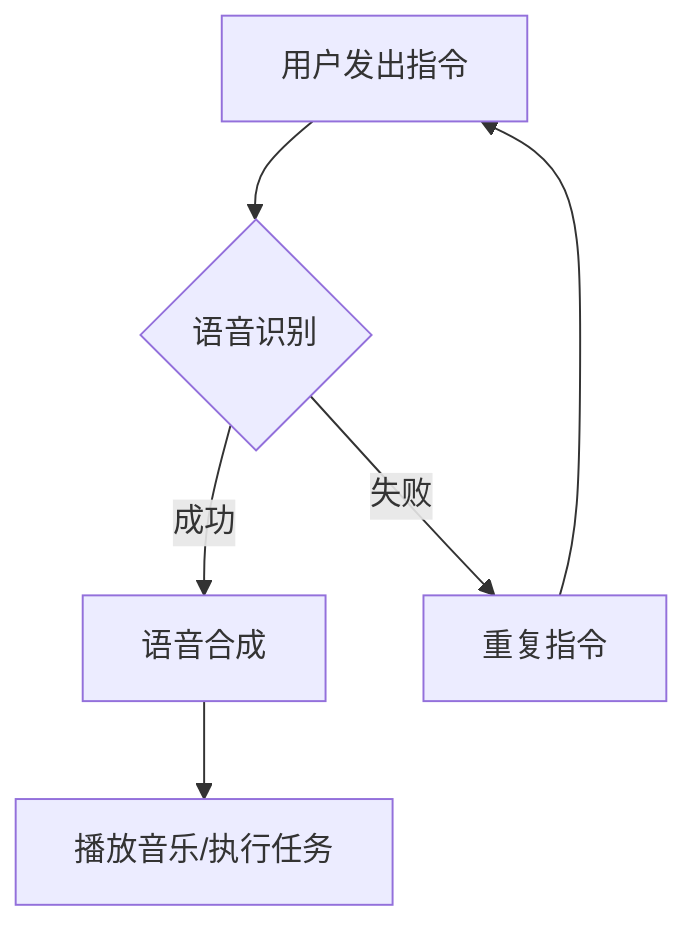

                 

关键词：智能音响、多模态交互、注意力机制、用户体验

摘要：本文旨在探讨智能音响在多模态交互中所面临的挑战，以及如何通过注意力机制优化用户体验。通过对智能音响核心概念的介绍，我们将深入分析其工作原理、算法模型，并结合具体项目实例，探讨其在实际应用中的优势与局限。同时，文章还将展望智能音响未来的发展方向，以及可能遇到的挑战。

## 1. 背景介绍

随着人工智能技术的不断进步，智能音响作为一种新兴的智能家居设备，已经逐渐渗透到人们的生活中。智能音响通过语音识别、自然语言处理、多模态交互等技术，为用户提供便捷的语音控制服务，如播放音乐、提供天气预报、设置提醒等。然而，随着用户需求的不断增加，智能音响的多模态交互面临着越来越多的挑战，尤其是注意力争夺问题。

注意力争夺是指在多任务环境中，系统需要将有限的注意力资源分配到不同的任务上，从而提高整体任务处理的效率和准确性。对于智能音响而言，如何在语音识别、语音合成、音乐播放等多个任务之间合理分配注意力资源，成为一个亟待解决的问题。

## 2. 核心概念与联系

### 2.1 多模态交互

多模态交互是指智能音响通过语音、视觉、触觉等多种感知方式进行人机交互。在多模态交互中，语音是最主要的交互方式，因为语音是最自然的交互方式，用户可以通过语音命令直接控制智能音响。同时，视觉和触觉辅助也可以提高交互的直观性和便捷性。

### 2.2 注意力机制

注意力机制是一种通过分配注意力资源来提高任务处理效率的算法。在智能音响中，注意力机制可以用于优化语音识别、语音合成等任务的性能。例如，在语音识别过程中，注意力机制可以帮助系统更准确地识别用户的语音指令。

### 2.3 Mermaid 流程图



在上面的 Mermaid 流程图中，用户发出指令后，系统首先进行语音识别。如果识别成功，则进入语音合成阶段，最终播放音乐或执行用户任务。如果识别失败，则系统提示用户重复指令，并重新进行识别。

## 3. 核心算法原理 & 具体操作步骤

### 3.1 算法原理概述

智能音响的多模态交互主要依赖于语音识别和语音合成技术。语音识别是将用户的语音指令转换为计算机可理解的语言，而语音合成则是将计算机生成的文本转换为可听的声音。

### 3.2 算法步骤详解

1. **语音识别**：智能音响首先通过麦克风捕捉用户的语音指令，然后使用深度学习算法对语音信号进行分析，将语音转换为文本。

2. **文本分析**：系统对识别出的文本进行分析，确定用户的需求。例如，用户可能要求播放音乐、设置提醒或查询天气。

3. **语音合成**：根据用户的需求，系统生成相应的语音回复，并使用语音合成技术将文本转换为声音。

4. **播放声音**：智能音响将生成的声音播放给用户。

### 3.3 算法优缺点

**优点**：
- **高效性**：通过深度学习算法，语音识别和语音合成的准确度得到了显著提高。
- **自然性**：语音交互方式更符合人类沟通习惯，用户体验更自然。

**缺点**：
- **延迟**：语音识别和语音合成需要一定的时间，可能导致用户等待时间过长。
- **准确性**：在某些情况下，语音识别可能存在误差，导致用户需求无法得到满足。

### 3.4 算法应用领域

智能音响的多模态交互技术可以应用于智能家居、智能客服、智能教育等多个领域。例如，在智能家居领域，智能音响可以通过语音控制家中的电器设备，提高用户的便捷性。在智能客服领域，智能音响可以模拟客服人员的角色，为用户提供实时问答服务。

## 4. 数学模型和公式 & 详细讲解 & 举例说明

### 4.1 数学模型构建

在智能音响的多模态交互中，数学模型主要涉及语音识别和语音合成的算法。以下是一个简化的数学模型：

$$
语音识别：y = f(x; \theta)
$$

其中，$y$ 表示识别出的文本，$x$ 表示语音信号，$f$ 表示语音识别算法，$\theta$ 表示算法参数。

$$
语音合成：s = g(t; \phi)
$$

其中，$s$ 表示合成的声音，$t$ 表示文本，$g$ 表示语音合成算法，$\phi$ 表示算法参数。

### 4.2 公式推导过程

语音识别和语音合成的推导过程涉及复杂的深度学习算法，这里不再赘述。简单来说，这些算法通过大量的语音数据训练，从而实现对语音信号和文本的转换。

### 4.3 案例分析与讲解

假设用户要求智能音响播放一首歌曲，以下是语音识别和语音合成的具体过程：

1. **语音识别**：

   用户说出：“播放《平凡之路》”。

   智能音响通过麦克风捕捉语音信号，使用深度学习算法进行识别，识别结果为：“播放《平凡之路》”。

2. **语音合成**：

   智能音响根据识别结果，使用语音合成算法生成相应的声音。

   最终，智能音响播放《平凡之路》。

## 5. 项目实践：代码实例和详细解释说明

### 5.1 开发环境搭建

为了实现智能音响的多模态交互，我们需要搭建一个包含语音识别、语音合成等模块的开发环境。这里以 Python 为例，介绍开发环境的搭建过程。

1. 安装 Python（版本 3.8 或更高版本）。

2. 安装必要的库，如 TensorFlow、Keras、PyTorch 等。

3. 下载并安装麦克风驱动。

### 5.2 源代码详细实现

以下是一个简单的 Python 代码示例，用于实现语音识别和语音合成。

```python
import speech_recognition as sr
import gtts
import pyaudio

# 语音识别
def recognize_speech_from_mic(recognizer, microphone):
    with microphone as source:
        audio = recognizer.listen(source)

    try:
        text = recognizer.recognize_google(audio)
        print("You said: " + text)
        return text
    except sr.UnknownValueError:
        print("Could not understand audio")
        return None
    except sr.RequestError:
        print("API unavailable")
        return None

# 语音合成
def synthesize_speech(text):
    tts = gtts.lang.TTS(text=text, lang='en')
    tts.save("output.mp3")

# 主函数
def main():
    recognizer = sr.Recognizer()
    microphone = sr.Microphone()

    text = recognize_speech_from_mic(recognizer, microphone)
    if text:
        synthesize_speech(text)

if __name__ == "__main__":
    main()
```

### 5.3 代码解读与分析

以上代码实现了一个简单的语音识别和语音合成功能。具体解读如下：

1. **语音识别**：使用`speech_recognition`库的`Recognizer`类进行语音识别。通过`microphone`对象捕获麦克风输入，调用`recognize_google`方法进行语音识别。

2. **语音合成**：使用`gtts`库的`TTS`类进行语音合成。将识别出的文本作为输入，生成相应的声音文件。

### 5.4 运行结果展示

运行以上代码，用户可以通过麦克风对智能音响说出指令，智能音响将识别用户指令并播放相应的声音。

## 6. 实际应用场景

智能音响的多模态交互技术可以应用于多个场景，以下是一些典型的应用实例：

1. **智能家居**：智能音响可以通过语音控制家中的电器设备，如开关灯、调节温度、播放音乐等。

2. **智能客服**：智能音响可以作为智能客服的代表，为用户提供实时问答服务，如咨询产品信息、解答疑问等。

3. **智能教育**：智能音响可以用于智能教育，如播放课程内容、提供问答服务、布置作业等。

## 7. 未来应用展望

随着人工智能技术的不断发展，智能音响的多模态交互技术将在更多领域得到应用。以下是一些未来应用展望：

1. **增强现实**：智能音响可以与增强现实技术相结合，为用户提供更丰富的交互体验。

2. **智能健康**：智能音响可以监测用户的健康数据，如心率、血压等，并提供相应的健康建议。

3. **智能驾驶**：智能音响可以用于智能驾驶系统，为驾驶员提供导航、语音识别等功能，提高行车安全性。

## 8. 工具和资源推荐

为了更好地进行智能音响的开发和实践，以下是一些建议的工具和资源：

1. **学习资源**：
   - 《深度学习》（Goodfellow, Bengio, Courville 著）
   - 《自然语言处理原理》（Daniel Jurafsky, James H. Martin 著）

2. **开发工具**：
   - TensorFlow
   - PyTorch
   - Keras

3. **相关论文**：
   - “Attention Is All You Need”（Vaswani et al., 2017）
   - “Transformers: State-of-the-Art Natural Language Processing”（Vaswani et al., 2017）

## 9. 总结：未来发展趋势与挑战

随着人工智能技术的不断发展，智能音响的多模态交互技术将逐渐成熟。然而，未来仍面临许多挑战，如注意力资源的分配、语音识别的准确性等。为了应对这些挑战，我们需要进一步优化算法模型，提高系统的鲁棒性和可靠性。同时，加强跨学科合作，将心理学、语言学等领域的知识融入智能音响的开发中，将有助于提升用户体验。总之，智能音响的多模态交互技术具有广阔的发展前景，值得我们继续深入研究和探索。

## 附录：常见问题与解答

### 1. 智能音响的语音识别准确度如何提高？

通过不断优化语音识别算法，使用更高质量的语音数据，以及引入注意力机制等技术，可以提高语音识别的准确度。

### 2. 智能音响的语音合成声音是否真实？

目前，智能音响的语音合成技术已经能够生成较为真实的声音，但仍存在一定的差距。未来，随着算法的进步和高质量语音数据的积累，语音合成声音的真实性将得到进一步提升。

### 3. 智能音响能否理解不同方言和口音？

智能音响的语音识别技术正在逐步支持多种方言和口音。然而，由于地域差异和语言习惯，不同方言和口音的识别效果可能存在一定差异。为了提高识别效果，可以尝试使用本地化语音数据训练模型。

作者：禅与计算机程序设计艺术 / Zen and the Art of Computer Programming
----------------------------------------------------------------


