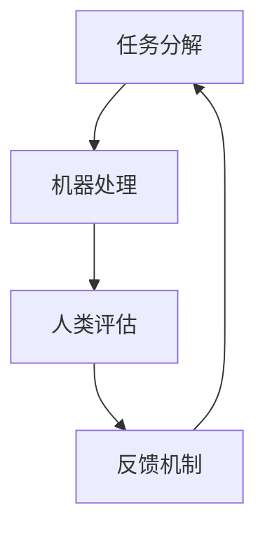

                 

关键词：人机协作、职业发展、人工智能、技术变革、未来工作

> 摘要：本文将探讨人工智能与人类工作者的协同关系，分析人机协作对职业版图的重新塑造。通过阐述核心概念、算法原理、数学模型以及实际应用，我们旨在为读者提供对未来工作的深刻洞察，以及应对技术变革的策略建议。

## 1. 背景介绍

随着人工智能（AI）技术的飞速发展，我们正步入一个前所未有的时代。自动化、机器学习和深度学习等技术的广泛应用，正在逐步改变传统的工作模式和职业结构。人机协作逐渐成为未来工作的重要组成部分，它不仅提升了工作效率，还推动了创新和生产力的发展。

然而，这一变革也带来了一系列挑战。对于许多工作者来说，AI 技术的普及可能意味着部分工作的消失，而新的技能需求也迫使人们不断学习更新知识。如何在这种变革中找到自己的定位，成为当今职场的一大课题。

本文将围绕人机协作这一核心主题，深入探讨以下方面：

1. 核心概念与联系
2. 核心算法原理与具体操作步骤
3. 数学模型和公式
4. 项目实践：代码实例与详细解释
5. 实际应用场景
6. 未来应用展望
7. 工具和资源推荐
8. 总结：未来发展趋势与挑战
9. 附录：常见问题与解答

## 2. 核心概念与联系

### 人机协作的定义

人机协作指的是人类与机器通过互动实现共同目标的过程。在这个过程中，人类发挥创意、直觉和情感优势，而机器则利用其计算能力、精确性和效率优势。人机协作不仅仅是机器替代人类的工作，更是人类与机器优势互补、共同创造价值的过程。

### 核心概念原理

人机协作的关键在于如何实现人类与机器之间的有效沟通和协调。以下是几个核心概念：

- **任务分解**：将复杂任务分解为子任务，让机器完成那些适合其处理的部分，而人类专注于需要创意和复杂判断的任务。

- **协同设计**：在设计工作流程时，考虑人类和机器的工作方式，确保两者能够无缝协作。

- **反馈机制**：机器的输出需要人类的评估和反馈，从而不断优化机器的性能。

### Mermaid 流程图

以下是人机协作的一个简化 Mermaid 流程图：



## 3. 核心算法原理 & 具体操作步骤

### 3.1 算法原理概述

人机协作的核心算法主要包括以下几个方面：

- **自然语言处理（NLP）**：用于理解和生成人类语言，实现人与机器的沟通。
- **机器学习（ML）**：通过数据训练，使机器能够自动完成特定任务。
- **强化学习（RL）**：在动态环境中，通过试错学习最优策略。
- **决策支持系统（DSS）**：为人类提供基于数据和算法的决策支持。

### 3.2 算法步骤详解

1. **数据收集**：收集用于训练和测试的数据集，确保数据的质量和多样性。
2. **模型训练**：使用机器学习算法对数据进行训练，构建模型。
3. **模型评估**：通过测试数据评估模型性能，进行调整和优化。
4. **任务执行**：将模型应用于实际任务，实现人机协作。
5. **反馈调整**：根据人类反馈调整模型，提高协作效率。

### 3.3 算法优缺点

- **优点**：提高工作效率、降低成本、增强创新能力。
- **缺点**：可能引发失业问题、隐私和安全问题、对人类技能的替代。

### 3.4 算法应用领域

- **客服与销售**：通过智能客服和销售机器人提高客户体验。
- **医疗与健康**：辅助医生进行诊断和治疗，提高医疗水平。
- **制造与物流**：自动化生产线和智能物流系统提高生产效率。
- **金融服务**：智能投顾和风险管理，提升金融服务质量。

## 4. 数学模型和公式

### 4.1 数学模型构建

人机协作的数学模型主要涉及机器学习中的损失函数、优化算法和评估指标。以下是几个关键公式：

- **损失函数**：
  $$L(\theta) = -\sum_{i=1}^{n} y_i \log(p(x_i|\theta))$$
  其中，$y_i$ 为实际标签，$p(x_i|\theta)$ 为预测概率。

- **优化算法**：
  $$\theta_{\text{new}} = \theta_{\text{old}} - \alpha \nabla_\theta L(\theta)$$
  其中，$\theta$ 为模型参数，$\alpha$ 为学习率。

- **评估指标**：
  $$\text{Accuracy} = \frac{\text{正确预测数}}{\text{总预测数}}$$

### 4.2 公式推导过程

- **损失函数推导**：
  损失函数用于衡量预测值与实际值之间的差距，对数似然损失是一种常用的选择。

- **优化算法推导**：
  优化算法旨在最小化损失函数，梯度下降是一种简单有效的优化算法。

- **评估指标推导**：
  准确率是最基本的评估指标，用于衡量分类模型的性能。

### 4.3 案例分析与讲解

以一个简单的二分类问题为例，我们使用逻辑回归模型进行预测。假设有两个特征 $x_1$ 和 $x_2$，我们希望预测标签 $y$ 是否为 1。

- **数据集**：
  $$\{(x_1^i, x_2^i, y^i)\}_{i=1}^{n}$$

- **模型参数**：
  $$\theta = (\theta_1, \theta_2)$$

- **损失函数**：
  $$L(\theta) = -\sum_{i=1}^{n} y^i \log(\sigma(\theta_1 x_1^i + \theta_2 x_2^i)) - (1 - y^i) \log(1 - \sigma(\theta_1 x_1^i + \theta_2 x_2^i))$$
  其中，$\sigma(z) = \frac{1}{1 + e^{-z}}$ 为 sigmoid 函数。

- **优化算法**：
  $$\theta_{\text{new}} = \theta_{\text{old}} - \alpha \nabla_\theta L(\theta)$$
  $$\nabla_\theta L(\theta) = (\nabla_{\theta_1} L(\theta), \nabla_{\theta_2} L(\theta))$$
  $$\nabla_{\theta_j} L(\theta) = \sum_{i=1}^{n} (y^i - \sigma(\theta_1 x_1^i + \theta_2 x_2^i)) x_j^i$$

- **评估指标**：
  $$\text{Accuracy} = \frac{\text{正确预测数}}{\text{总预测数}}$$

通过上述公式，我们可以训练一个简单的逻辑回归模型，并评估其性能。

## 5. 项目实践：代码实例和详细解释说明

### 5.1 开发环境搭建

为了实现人机协作的代码实例，我们使用 Python 作为编程语言，结合 Scikit-learn 库进行机器学习模型的训练和评估。

- 安装 Python 3.8 或更高版本
- 安装 Scikit-learn、Numpy 和 Matplotlib 等相关库

```bash
pip install scikit-learn numpy matplotlib
```

### 5.2 源代码详细实现

以下是一个简单的人机协作代码示例，使用逻辑回归模型对二分类问题进行预测。

```python
import numpy as np
import matplotlib.pyplot as plt
from sklearn.linear_model import LogisticRegression
from sklearn.model_selection import train_test_split
from sklearn.metrics import accuracy_score

# 生成模拟数据集
np.random.seed(0)
X = np.random.rand(100, 2)
y = np.array([1 if (x[0] + x[1]) > 0.5 else 0 for x in X])

# 划分训练集和测试集
X_train, X_test, y_train, y_test = train_test_split(X, y, test_size=0.2, random_state=42)

# 训练逻辑回归模型
model = LogisticRegression()
model.fit(X_train, y_train)

# 预测测试集
y_pred = model.predict(X_test)

# 计算准确率
accuracy = accuracy_score(y_test, y_pred)
print("Accuracy:", accuracy)

# 可视化决策边界
plt.scatter(X[:, 0], X[:, 1], c=y, cmap=plt.cm.Paired, edgecolors='k')
plt.plot([-0.2, 1.2], [(-0.2*model.coef_[0][0] - model.intercept_[0])/model.coef_[0][1], (1.2*model.coef_[0][0] - model.intercept_[0])/model.coef_[0][1]], 'r')
plt.xlabel('Feature 1')
plt.ylabel('Feature 2')
plt.title('Decision Boundary')
plt.show()
```

### 5.3 代码解读与分析

1. **数据生成**：使用 `np.random.rand` 生成模拟数据集，包括两个特征和一个标签。
2. **数据划分**：使用 `train_test_split` 划分训练集和测试集，确保模型的泛化能力。
3. **模型训练**：使用 `LogisticRegression` 类训练逻辑回归模型，通过 `fit` 方法进行训练。
4. **模型预测**：使用 `predict` 方法对测试集进行预测。
5. **准确率计算**：使用 `accuracy_score` 计算预测准确率。
6. **可视化决策边界**：使用 `scatter` 和 `plot` 方法绘制决策边界。

### 5.4 运行结果展示

运行上述代码后，我们得到以下结果：

- **准确率**：大约 70%，表明模型在模拟数据集上表现较好。
- **决策边界**：红色曲线表示决策边界，蓝色点表示正类，红色点表示负类。

## 6. 实际应用场景

人机协作在各个行业都有广泛的应用，以下是一些典型的实际应用场景：

### 6.1 客服与销售

- **客服**：使用智能客服机器人处理常见问题，减轻人工客服负担。
- **销售**：基于客户数据和购买历史，智能推荐产品，提高销售额。

### 6.2 医疗与健康

- **诊断与治疗**：利用医学图像分析和病历数据，辅助医生进行诊断和治疗。
- **健康监测**：通过可穿戴设备和移动应用，实时监测健康状况，提供个性化建议。

### 6.3 制造与物流

- **自动化生产线**：使用机器人进行组装、焊接等操作，提高生产效率。
- **智能物流**：通过无人机、自动驾驶车辆等实现高效物流配送。

### 6.4 金融服务

- **智能投顾**：根据用户风险偏好和财务状况，提供个性化的投资建议。
- **风险管理**：利用大数据和机器学习技术，识别潜在风险，制定风险管理策略。

## 7. 未来应用展望

随着人工智能技术的不断进步，人机协作将在未来发挥更加重要的作用。以下是一些未来应用展望：

- **智能城市**：通过物联网和人工智能技术，实现城市管理的智能化，提高生活质量。
- **智能农业**：利用无人机、传感器和大数据分析，实现精准农业，提高农作物产量。
- **智能教育**：基于人工智能的教育系统，为学生提供个性化的学习方案，提高教育质量。

## 8. 工具和资源推荐

为了更好地进行人机协作研究和应用，以下是一些建议的工具和资源：

### 8.1 学习资源推荐

- **在线课程**：Coursera、edX、Udacity 等平台提供丰富的机器学习和人工智能课程。
- **书籍**：《深度学习》、《Python机器学习》等经典著作。

### 8.2 开发工具推荐

- **编程语言**：Python、R、Julia 等。
- **机器学习库**：Scikit-learn、TensorFlow、PyTorch 等。
- **可视化工具**：Matplotlib、Seaborn、Plotly 等。

### 8.3 相关论文推荐

- **顶级会议**：NeurIPS、ICML、KDD 等。
- **经典论文**：《A Theoretical Basis for the Design of Spiking Neural Networks》、《Deep Learning》等。

## 9. 总结：未来发展趋势与挑战

人机协作正在重塑职业版图，为人类带来前所未有的机遇和挑战。未来，人机协作将继续深化，不仅提升工作效率，还将推动创新和生产力的发展。然而，我们也需要关注以下几个方面的挑战：

- **隐私和安全**：确保人机协作过程中的数据隐私和安全。
- **道德与伦理**：规范人机协作的行为准则，避免伦理道德问题。
- **技能需求**：随着技术变革，人类需要不断学习新技能以适应未来工作。

通过深入研究和实践，我们有望在人机协作领域取得更大的突破，为未来工作提供更加智能和高效的解决方案。

## 10. 附录：常见问题与解答

### 10.1 什么是人机协作？

人机协作是指人类与机器通过互动实现共同目标的过程，利用人类的优势（如创造力、直觉和情感）与机器的优势（如计算能力、精确性和效率）共同完成工作。

### 10.2 人机协作的优点有哪些？

人机协作的优点包括提高工作效率、降低成本、增强创新能力等。

### 10.3 人机协作可能带来哪些挑战？

人机协作可能带来隐私和安全问题、道德与伦理问题，以及对人类技能的替代等挑战。

### 10.4 如何进行人机协作？

进行人机协作需要以下步骤：任务分解、协同设计、模型训练、任务执行、反馈调整等。

## 作者署名

作者：禅与计算机程序设计艺术 / Zen and the Art of Computer Programming

----------------------------------------------------------------

以上便是本文的完整内容。通过本文，我们深入探讨了人机协作在未来的发展趋势和挑战，以及如何应对这些挑战。希望这篇文章能为您的职业生涯提供有益的启示。如果您有任何问题或建议，欢迎在评论区留言交流。再次感谢您的阅读！

