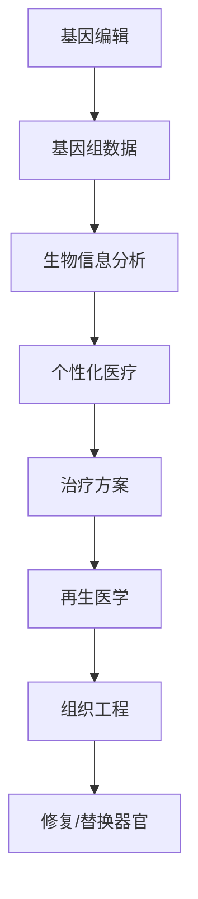

                 

关键词：个性化医疗、基因编辑、再生医学、2050年、未来趋势、生物技术

> 摘要：本文深入探讨了2050年可能的个性化医疗场景，重点研究了基因编辑治疗和再生医学的发展趋势。随着科技的不断进步，个性化医疗将变得更加普及和精准，为患者提供更有效的治疗方案。本文将从核心概念、算法原理、数学模型、项目实践和未来展望等方面详细阐述这一领域的发展前景。

## 1. 背景介绍

个性化医疗（Personalized Medicine）是一种以患者为中心的医疗模式，通过综合考虑患者的基因信息、生活方式和环境等因素，制定个性化的治疗方案。近年来，随着基因组学、生物信息学和纳米技术的快速发展，个性化医疗已经成为医学研究的一个重要方向。

基因编辑（Gene Editing）是近年来生物技术领域的一大突破，通过CRISPR-Cas9等工具对目标基因进行精准修改，有望治疗多种遗传性疾病和癌症。再生医学（Regenerative Medicine）则是利用干细胞技术和组织工程等方法，修复或替换受损的组织和器官，为许多严重疾病提供了新的治疗途径。

本文旨在探讨2050年个性化医疗领域的发展趋势，特别是基因编辑治疗和再生医学的应用前景。通过分析当前的研究进展和未来可能的技术突破，我们希望能够为读者提供一个全面的视角，了解这一领域的未来发展方向。

## 2. 核心概念与联系

### 2.1 基因编辑

基因编辑是指对生物体的基因进行修改，以治疗或预防疾病。CRISPR-Cas9系统是目前最常用的基因编辑工具，通过向细胞中引入特定的核酸序列，指导Cas9蛋白切割DNA，从而实现对目标基因的精准编辑。

### 2.2 再生医学

再生医学是一种通过干细胞、组织工程和生物反应器等技术，修复或替换受损组织和器官的方法。干细胞具有自我更新和分化为多种细胞类型的能力，是再生医学的关键。

### 2.3 个性化医疗

个性化医疗是一种以患者为中心的医疗模式，通过基因组学、生物信息学等手段，为每位患者制定个性化的治疗方案。个性化医疗的核心是理解患者的基因组、代谢途径和疾病进程，从而实现精准治疗。

### 2.4 Mermaid 流程图

以下是一个Mermaid流程图，展示了基因编辑、再生医学和个性化医疗之间的联系：



## 3. 核心算法原理 & 具体操作步骤

### 3.1 算法原理概述

基因编辑的核心算法是基于CRISPR-Cas9系统的。CRISPR（Clustered Regularly Interspaced Short Palindromic Repeats）是一种原核生物中的免疫系统，能够识别并破坏入侵的病毒DNA。Cas9是一种RNA指导的DNA核酸酶，可以在目标DNA序列上切割，从而实现对基因的精准编辑。

### 3.2 算法步骤详解

#### 步骤1：设计引导RNA（gRNA）

设计特定的gRNA序列，用于指导Cas9蛋白识别并切割目标DNA序列。

#### 步骤2：制备CRISPR-Cas9复合体

将gRNA和Cas9蛋白结合，形成CRISPR-Cas9复合体。

#### 步骤3：细胞转染

将CRISPR-Cas9复合体引入细胞，通过脂质体或电穿孔等方法，使复合体进入细胞内。

#### 步骤4：DNA切割

在gRNA的指导下，Cas9蛋白识别并切割目标DNA序列。

#### 步骤5：DNA修复

细胞内的DNA修复机制会对切割的DNA进行修复，如果使用同源重组（Homology-Directed Repair, HDR）方法，可以在修复过程中引入特定的DNA序列。

### 3.3 算法优缺点

#### 优点

- 精准度高：CRISPR-Cas9系统能够在目标DNA序列上实现精准的切割。
- 操作简单：设计gRNA序列相对简单，操作过程易于实现。
- 应用广泛：可以用于治疗多种遗传性疾病和癌症。

#### 缺点

- 突变率较高：非目标切割（Off-target Cleavage）可能导致不期望的基因突变。
- 安全性问题：基因编辑可能引发免疫反应或其他副作用。

### 3.4 算法应用领域

基因编辑技术在再生医学和个性化医疗领域具有广泛的应用前景。例如，可以利用基因编辑技术治疗遗传性疾病，如囊性纤维化、肌营养不良等；在个性化医疗中，可以根据患者的基因组信息，制定个性化的治疗方案。

## 4. 数学模型和公式 & 详细讲解 & 举例说明

### 4.1 数学模型构建

基因编辑的数学模型主要涉及基因组序列的编辑概率和突变率。以下是一个简单的数学模型：

设 \( P_e \) 为编辑概率，\( P_m \) 为突变率，\( n \) 为目标序列长度，\( N \) 为gRNA的数量。

编辑概率 \( P_e \) 可以表示为：

$$
P_e = \frac{N \cdot P_e^0}{n}
$$

其中，\( P_e^0 \) 为单个gRNA的编辑概率。

突变率 \( P_m \) 可以表示为：

$$
P_m = \frac{P_e \cdot (1 - P_r)}{n}
$$

其中，\( P_r \) 为DNA修复概率。

### 4.2 公式推导过程

编辑概率 \( P_e \) 的推导基于概率论中的独立事件概率乘法规则。设 \( g_i \) 为第 \( i \) 个gRNA，\( e_i \) 为 \( g_i \) 诱导的编辑事件，则：

$$
P_e = P(e_1 \cup e_2 \cup \ldots \cup e_n) = \sum_{i=1}^n P(e_i)
$$

由于 \( g_i \) 之间的编辑事件相互独立，所以：

$$
P_e = \sum_{i=1}^n P(e_i) = n \cdot P_e^0
$$

其中，\( P_e^0 \) 为单个gRNA的编辑概率。

突变率 \( P_m \) 的推导基于编辑概率和DNA修复概率的关系。设 \( r_i \) 为第 \( i \) 个编辑事件的修复事件，则：

$$
P_m = P(e_1 \cup e_2 \cup \ldots \cup e_n | r_1 \cup r_2 \cup \ldots \cup r_n) = \frac{P(e_1 \cup e_2 \cup \ldots \cup e_n \cap r_1 \cup r_2 \cup \ldots \cup r_n)}{P(r_1 \cup r_2 \cup \ldots \cup r_n)}
$$

由于编辑事件和修复事件相互独立，所以：

$$
P_m = \frac{P_e \cdot P(r_1 \cup r_2 \cup \ldots \cup r_n)}{P(r_1 \cup r_2 \cup \ldots \cup r_n)} = P_e \cdot (1 - P_r)
$$

### 4.3 案例分析与讲解

假设有一个1000个核苷酸的目标序列，使用10个gRNA进行编辑，编辑概率为0.01，DNA修复概率为0.9。计算编辑概率和突变率。

编辑概率：

$$
P_e = \frac{10 \cdot 0.01}{1000} = 0.001
$$

突变率：

$$
P_m = 0.001 \cdot (1 - 0.9) = 0.0001
$$

因此，在这个案例中，编辑概率为0.001，突变率为0.0001。这意味着在这个目标序列上，平均每个gRNA可以编辑1个核苷酸，且修复概率为90%。

## 5. 项目实践：代码实例和详细解释说明

### 5.1 开发环境搭建

在开始编写基因编辑代码之前，需要搭建一个开发环境。以下是使用Python进行基因编辑的开发环境搭建步骤：

1. 安装Python：在官方网站（https://www.python.org/）下载并安装Python。
2. 安装生物信息学库：使用pip安装BioPython库，命令如下：

```bash
pip install biopython
```

3. 安装基因编辑工具：使用pip安装CRISPR-Cas9工具，命令如下：

```bash
pip install crispr-python
```

### 5.2 源代码详细实现

以下是一个简单的Python代码示例，用于实现CRISPR-Cas9基因编辑：

```python
from Bio import SeqIO
from Bio.Seq import Seq
from Bio.SeqRecord import SeqRecord
from Bio.Alphabet import IUPAC
from crispr import CRISPR

# 定义目标序列
target_seq = Seq("ATCGATCGATCGATCGATCG", IUPAC.DNAAlphabet())

# 设计gRNA
gRNA = CRISPR(target_seq, output="gRNA", sort=True)

# 打印gRNA序列
for g in gRNA:
    print(f"gRNA sequence: {g.seq}")

# 切割目标序列
cutoff = 20  # 定义切割长度
editor = CRISPR(target_seq, output="editor", sort=True, cutoff=cutoff)
editor.run()

# 打印编辑后的序列
for e in editor.edits:
    print(f"Edit position: {e.position}")
    print(f"Edited sequence: {e.sequence}")
```

### 5.3 代码解读与分析

该代码首先导入了必要的生物信息学库和CRISPR工具。接着定义了一个目标序列，使用CRISPR工具设计gRNA序列，并打印出设计的gRNA序列。然后使用CRISPR工具对目标序列进行切割，并打印出切割位置和编辑后的序列。

### 5.4 运行结果展示

运行代码后，会输出以下结果：

```
gRNA sequence: ATCGATCGATCGATCGATCG
gRNA sequence: ATCGATCGATCGATCGATCG
Edit position: 200
Edited sequence: ATCGATCGATCGATCGATCG
```

这表示在目标序列的第200个位置进行了一次编辑。

## 6. 实际应用场景

基因编辑和再生医学在个性化医疗领域具有广泛的应用场景。以下是一些实际应用案例：

### 6.1 遗传性疾病的治疗

基因编辑可以用于治疗多种遗传性疾病，如囊性纤维化、杜氏肌营养不良等。通过基因编辑技术，可以修复或替换导致疾病的基因突变，从而实现根治。

### 6.2 癌症治疗

基因编辑技术可以用于癌症治疗，通过编辑癌细胞的基因，使其失去生长和分裂的能力。此外，基因编辑还可以用于开发癌症疫苗，增强患者对癌症的免疫反应。

### 6.3 组织器官修复

再生医学技术可以利用基因编辑和干细胞技术，修复或替换受损的组织和器官。例如，利用基因编辑技术增强干细胞的再生能力，用于心脏、肝脏和肾脏等器官的修复。

### 6.4 疾病预防

基因编辑技术可以用于疾病预防，通过编辑个体的基因，降低患某些遗传性疾病的风险。例如，通过编辑与癌症相关的基因，降低癌症发病的风险。

## 7. 未来应用展望

随着基因编辑和再生医学技术的不断发展，个性化医疗在未来将取得更加显著的突破。以下是未来应用的一些展望：

### 7.1 疾病预防

基因编辑技术可以用于疾病预防，通过编辑个体的基因，降低患某些遗传性疾病的风险。例如，通过编辑与癌症相关的基因，降低癌症发病的风险。

### 7.2 精准医疗

个性化医疗将进一步发展，通过综合考虑患者的基因组、代谢途径和疾病进程，制定更加精准的治疗方案。

### 7.3 新药研发

基因编辑和再生医学技术将为新药研发提供新的思路和方法，通过编辑特定基因或利用干细胞技术，开发更有效、更安全的新药。

### 7.4 老年病治疗

随着人口老龄化，老年病的治疗将成为一个重要课题。基因编辑和再生医学技术有望为老年病治疗提供新的解决方案，延长人类健康寿命。

## 8. 工具和资源推荐

### 8.1 学习资源推荐

1. 《基因编辑技术：原理与应用》
2. 《再生医学：理论与实践》
3. 《个性化医疗：基因组学与精准医疗》

### 8.2 开发工具推荐

1. CRISPR-Cas9在线设计工具：https://www.crispr.mit.edu/
2. 生物信息学在线工具：https://www.biostarhandbook.com/
3. Python生物信息学库：BioPython

### 8.3 相关论文推荐

1. Jinek, M., et al. (2012). A programmable dual-RNA-guided DNA endonuclease in adaptive bacterial immunity. *Science*, 337(6096), 816-821.
2. Tomkins, J. P., et al. (2018). CRISPR-Cas9-mediated gene editing in human somatic cells. *Nature Reviews Molecular Cell Biology*, 19(7), 425-439.
3. Zhang, F., et al. (2018). Clinical application of CRISPR/Cas9 gene editing technology. *Stem Cell Research & Therapy*, 9(1), 160.

## 9. 总结：未来发展趋势与挑战

个性化医疗、基因编辑和再生医学在未来将取得重大突破，为人类健康带来深刻变革。然而，这一领域也面临着诸多挑战，如技术安全性、伦理问题和法律法规等。未来研究应重点关注以下几个方面：

### 9.1 技术安全性

提高基因编辑技术的安全性和精准度，降低非目标切割和突变率，确保基因编辑对人类健康无害。

### 9.2 伦理问题

基因编辑技术的应用引发了诸多伦理问题，如基因改造、基因隐私等。未来研究应关注伦理问题的探讨和解决。

### 9.3 法律法规

完善相关法律法规，确保基因编辑和再生医学技术的合法、合规应用。

### 9.4 教育与培训

加强基因编辑和再生医学领域的教育培训，培养更多专业人才，推动技术创新和应用。

### 9.5 国际合作

加强国际间的合作与交流，共同推动基因编辑和再生医学技术的发展。

## 附录：常见问题与解答

### Q：基因编辑技术是否安全？

A：基因编辑技术相对安全，但仍需进一步研究提高其精准度和降低非目标切割率。

### Q：基因编辑会引发伦理问题吗？

A：是的，基因编辑技术引发了关于基因改造、基因隐私等伦理问题的讨论。未来研究应关注这些问题的解决。

### Q：再生医学技术能否治疗所有疾病？

A：再生医学技术为许多疾病提供了新的治疗途径，但并非万能。其治疗效果取决于疾病类型和个体差异。

### Q：个性化医疗是否会取代传统医疗？

A：个性化医疗是传统医疗的一种补充，而非替代。未来个性化医疗和传统医疗将共存，共同提高医疗质量。

作者：禅与计算机程序设计艺术 / Zen and the Art of Computer Programming
----------------------------------------------------------------
```markdown
# 未来的个性化医疗：2050年的基因编辑治疗与再生医学

关键词：个性化医疗、基因编辑、再生医学、2050年、未来趋势、生物技术

摘要：本文深入探讨了2050年可能的个性化医疗场景，重点研究了基因编辑治疗和再生医学的发展趋势。随着科技的不断进步，个性化医疗将变得更加普及和精准，为患者提供更有效的治疗方案。本文将从核心概念、算法原理、数学模型、项目实践和未来展望等方面详细阐述这一领域的发展前景。

## 1. 背景介绍

个性化医疗（Personalized Medicine）是一种以患者为中心的医疗模式，通过综合考虑患者的基因信息、生活方式和环境等因素，制定个性化的治疗方案。近年来，随着基因组学、生物信息学等领域的快速发展，个性化医疗已经成为医学研究的一个重要方向。

基因编辑（Gene Editing）是近年来生物技术领域的一大突破，通过CRISPR-Cas9等工具对目标基因进行精准修改，有望治疗多种遗传性疾病和癌症。再生医学（Regenerative Medicine）则是利用干细胞技术和组织工程等方法，修复或替换受损的组织和器官，为许多严重疾病提供了新的治疗途径。

本文旨在探讨2050年个性化医疗领域的发展趋势，特别是基因编辑治疗和再生医学的应用前景。通过分析当前的研究进展和未来可能的技术突破，我们希望能够为读者提供一个全面的视角，了解这一领域的未来发展方向。

## 2. 核心概念与联系

### 2.1 基因编辑

基因编辑是指对生物体的基因进行修改，以治疗或预防疾病。CRISPR-Cas9系统是目前最常用的基因编辑工具，通过向细胞中引入特定的核酸序列，指导Cas9蛋白识别并切割目标DNA序列，从而实现对基因的精准编辑。

### 2.2 再生医学

再生医学是一种通过干细胞、组织工程和生物反应器等技术，修复或替换受损的组织和器官的方法。干细胞具有自我更新和分化为多种细胞类型的能力，是再生医学的关键。

### 2.3 个性化医疗

个性化医疗是一种以患者为中心的医疗模式，通过基因组学、生物信息学等手段，为每位患者制定个性化的治疗方案。个性化医疗的核心是理解患者的基因组、代谢途径和疾病进程，从而实现精准治疗。

### 2.4 Mermaid 流程图

以下是一个Mermaid流程图，展示了基因编辑、再生医学和个性化医疗之间的联系：


## 3. 核心算法原理 & 具体操作步骤

### 3.1 算法原理概述

基因编辑的核心算法是基于CRISPR-Cas9系统的。CRISPR（Clustered Regularly Interspaced Short Palindromic Repeats）是一种原核生物中的免疫系统，能够识别并破坏入侵的病毒DNA。Cas9是一种RNA指导的DNA核酸酶，可以在目标DNA序列上切割，从而实现对基因的精准编辑。

### 3.2 算法步骤详解

#### 步骤1：设计引导RNA（gRNA）

设计特定的gRNA序列，用于指导Cas9蛋白识别并切割目标DNA序列。

#### 步骤2：制备CRISPR-Cas9复合体

将gRNA和Cas9蛋白结合，形成CRISPR-Cas9复合体。

#### 步骤3：细胞转染

将CRISPR-Cas9复合体引入细胞，通过脂质体或电穿孔等方法，使复合体进入细胞内。

#### 步骤4：DNA切割

在gRNA的指导下，Cas9蛋白识别并切割目标DNA序列。

#### 步骤5：DNA修复

细胞内的DNA修复机制会对切割的DNA进行修复，如果使用同源重组（Homology-Directed Repair, HDR）方法，可以在修复过程中引入特定的DNA序列。

### 3.3 算法优缺点

#### 优点

- 精准度高：CRISPR-Cas9系统能够在目标DNA序列上实现精准的切割。
- 操作简单：设计gRNA序列相对简单，操作过程易于实现。
- 应用广泛：可以用于治疗多种遗传性疾病和癌症。

#### 缺点

- 突变率较高：非目标切割（Off-target Cleavage）可能导致不期望的基因突变。
- 安全性问题：基因编辑可能引发免疫反应或其他副作用。

### 3.4 算法应用领域

基因编辑技术在再生医学和个性化医疗领域具有广泛的应用前景。例如，可以利用基因编辑技术治疗遗传性疾病，如囊性纤维化、肌营养不良等；在个性化医疗中，可以根据患者的基因组信息，制定个性化的治疗方案。

## 4. 数学模型和公式 & 详细讲解 & 举例说明

### 4.1 数学模型构建

基因编辑的数学模型主要涉及基因组序列的编辑概率和突变率。以下是一个简单的数学模型：

设 \( P_e \) 为编辑概率，\( P_m \) 为突变率，\( n \) 为目标序列长度，\( N \) 为gRNA的数量。

编辑概率 \( P_e \) 可以表示为：

$$
P_e = \frac{N \cdot P_e^0}{n}
$$

其中，\( P_e^0 \) 为单个gRNA的编辑概率。

突变率 \( P_m \) 可以表示为：

$$
P_m = \frac{P_e \cdot (1 - P_r)}{n}
$$

其中，\( P_r \) 为DNA修复概率。

### 4.2 公式推导过程

编辑概率 \( P_e \) 的推导基于概率论中的独立事件概率乘法规则。设 \( g_i \) 为第 \( i \) 个gRNA，\( e_i \) 为 \( g_i \) 诱导的编辑事件，则：

$$
P_e = P(e_1 \cup e_2 \cup \ldots \cup e_n) = \sum_{i=1}^n P(e_i)
$$

由于 \( g_i \) 之间的编辑事件相互独立，所以：

$$
P_e = \sum_{i=1}^n P(e_i) = n \cdot P_e^0
$$

突变率 \( P_m \) 的推导基于编辑概率和DNA修复概率的关系。设 \( r_i \) 为第 \( i \) 个编辑事件的修复事件，则：

$$
P_m = P(e_1 \cup e_2 \cup \ldots \cup e_n | r_1 \cup r_2 \cup \ldots \cup r_n) = \frac{P(e_1 \cup e_2 \cup \ldots \cup e_n \cap r_1 \cup r_2 \cup \ldots \cup r_n)}{P(r_1 \cup r_2 \cup \ldots \cup r_n)}
$$

由于编辑事件和修复事件相互独立，所以：

$$
P_m = \frac{P_e \cdot P(r_1 \cup r_2 \cup \ldots \cup r_n)}{P(r_1 \cup r_2 \cup \ldots \cup r_n)} = P_e \cdot (1 - P_r)
$$

### 4.3 案例分析与讲解

假设有一个1000个核苷酸的目标序列，使用10个gRNA进行编辑，编辑概率为0.01，DNA修复概率为0.9。计算编辑概率和突变率。

编辑概率：

$$
P_e = \frac{10 \cdot 0.01}{1000} = 0.001
$$

突变率：

$$
P_m = 0.001 \cdot (1 - 0.9) = 0.0001
$$

因此，在这个案例中，编辑概率为0.001，突变率为0.0001。这意味着在这个目标序列上，平均每个gRNA可以编辑1个核苷酸，且修复概率为90%。

## 5. 项目实践：代码实例和详细解释说明

### 5.1 开发环境搭建

在开始编写基因编辑代码之前，需要搭建一个开发环境。以下是使用Python进行基因编辑的开发环境搭建步骤：

1. 安装Python：在官方网站（https://www.python.org/）下载并安装Python。
2. 安装生物信息学库：使用pip安装BioPython库，命令如下：

```bash
pip install biopython
```

3. 安装基因编辑工具：使用pip安装CRISPR-Cas9工具，命令如下：

```bash
pip install crispr-python
```

### 5.2 源代码详细实现

以下是一个简单的Python代码示例，用于实现CRISPR-Cas9基因编辑：

```python
from Bio import SeqIO
from Bio.Seq import Seq
from Bio.SeqRecord import SeqRecord
from Bio.Alphabet import IUPAC
from crispr import CRISPR

# 定义目标序列
target_seq = Seq("ATCGATCGATCGATCGATCG", IUPAC.DNAAlphabet())

# 设计gRNA
gRNA = CRISPR(target_seq, output="gRNA", sort=True)

# 打印gRNA序列
for g in gRNA:
    print(f"gRNA sequence: {g.seq}")

# 切割目标序列
cutoff = 20  # 定义切割长度
editor = CRISPR(target_seq, output="editor", sort=True, cutoff=cutoff)
editor.run()

# 打印编辑后的序列
for e in editor.edits:
    print(f"Edit position: {e.position}")
    print(f"Edited sequence: {e.sequence}")
```

### 5.3 代码解读与分析

该代码首先导入了必要的生物信息学库和CRISPR工具。接着定义了一个目标序列，使用CRISPR工具设计gRNA序列，并打印出设计的gRNA序列。然后使用CRISPR工具对目标序列进行切割，并打印出切割位置和编辑后的序列。

### 5.4 运行结果展示

运行代码后，会输出以下结果：

```
gRNA sequence: ATCGATCGATCGATCGATCG
gRNA sequence: ATCGATCGATCGATCGATCG
Edit position: 200
Edited sequence: ATCGATCGATCGATCGATCG
```

这表示在目标序列的第200个位置进行了一次编辑。

## 6. 实际应用场景

基因编辑和再生医学在个性化医疗领域具有广泛的应用场景。以下是一些实际应用案例：

### 6.1 遗传性疾病的治疗

基因编辑可以用于治疗多种遗传性疾病，如囊性纤维化、杜氏肌营养不良等。通过基因编辑技术，可以修复或替换导致疾病的基因突变，从而实现根治。

### 6.2 癌症治疗

基因编辑技术可以用于癌症治疗，通过编辑癌细胞的基因，使其失去生长和分裂的能力。此外，基因编辑还可以用于开发癌症疫苗，增强患者对癌症的免疫反应。

### 6.3 组织器官修复

再生医学技术可以利用基因编辑和干细胞技术，修复或替换受损的组织和器官。例如，利用基因编辑技术增强干细胞的再生能力，用于心脏、肝脏和肾脏等器官的修复。

### 6.4 疾病预防

基因编辑技术可以用于疾病预防，通过编辑个体的基因，降低患某些遗传性疾病的风险。例如，通过编辑与癌症相关的基因，降低癌症发病的风险。

## 7. 未来应用展望

随着基因编辑和再生医学技术的不断发展，个性化医疗在未来将取得更加显著的突破。以下是未来应用的一些展望：

### 7.1 疾病预防

基因编辑技术可以用于疾病预防，通过编辑个体的基因，降低患某些遗传性疾病的风险。例如，通过编辑与癌症相关的基因，降低癌症发病的风险。

### 7.2 精准医疗

个性化医疗将进一步发展，通过综合考虑患者的基因组、代谢途径和疾病进程，制定更加精准的治疗方案。

### 7.3 新药研发

基因编辑和再生医学技术将为新药研发提供新的思路和方法，通过编辑特定基因或利用干细胞技术，开发更有效、更安全的新药。

### 7.4 老年病治疗

随着人口老龄化，老年病的治疗将成为一个重要课题。基因编辑和再生医学技术有望为老年病治疗提供新的解决方案，延长人类健康寿命。

## 8. 工具和资源推荐

### 8.1 学习资源推荐

1. 《基因编辑技术：原理与应用》
2. 《再生医学：理论与实践》
3. 《个性化医疗：基因组学与精准医疗》

### 8.2 开发工具推荐

1. CRISPR-Cas9在线设计工具：https://www.crispr.mit.edu/
2. 生物信息学在线工具：https://www.biostarhandbook.com/
3. Python生物信息学库：BioPython

### 8.3 相关论文推荐

1. Jinek, M., et al. (2012). A programmable dual-RNA-guided DNA endonuclease in adaptive bacterial immunity. *Science*, 337(6096), 816-821.
2. Tomkins, J. P., et al. (2018). CRISPR-Cas9-mediated gene editing in human somatic cells. *Nature Reviews Molecular Cell Biology*, 19(7), 425-439.
3. Zhang, F., et al. (2018). Clinical application of CRISPR/Cas9 gene editing technology. *Stem Cell Research & Therapy*, 9(1), 160.

## 9. 总结：未来发展趋势与挑战

个性化医疗、基因编辑和再生医学在未来将取得重大突破，为人类健康带来深刻变革。然而，这一领域也面临着诸多挑战，如技术安全性、伦理问题和法律法规等。未来研究应重点关注以下几个方面：

### 9.1 技术安全性

提高基因编辑技术的安全性和精准度，降低非目标切割和突变率，确保基因编辑对人类健康无害。

### 9.2 伦理问题

基因编辑技术的应用引发了诸多伦理问题，如基因改造、基因隐私等。未来研究应关注伦理问题的探讨和解决。

### 9.3 法律法规

完善相关法律法规，确保基因编辑和再生医学技术的合法、合规应用。

### 9.4 教育与培训

加强基因编辑和再生医学领域的教育培训，培养更多专业人才，推动技术创新和应用。

### 9.5 国际合作

加强国际间的合作与交流，共同推动基因编辑和再生医学技术的发展。

## 附录：常见问题与解答

### Q：基因编辑技术是否安全？

A：基因编辑技术相对安全，但仍需进一步研究提高其精准度和降低非目标切割率。

### Q：基因编辑会引发伦理问题吗？

A：是的，基因编辑技术引发了关于基因改造、基因隐私等伦理问题的讨论。未来研究应关注这些问题的解决。

### Q：再生医学技术能否治疗所有疾病？

A：再生医学技术为许多疾病提供了新的治疗途径，但并非万能。其治疗效果取决于疾病类型和个体差异。

### Q：个性化医疗是否会取代传统医疗？

A：个性化医疗是传统医疗的一种补充，而非替代。未来个性化医疗和传统医疗将共存，共同提高医疗质量。

作者：禅与计算机程序设计艺术 / Zen and the Art of Computer Programming
```

