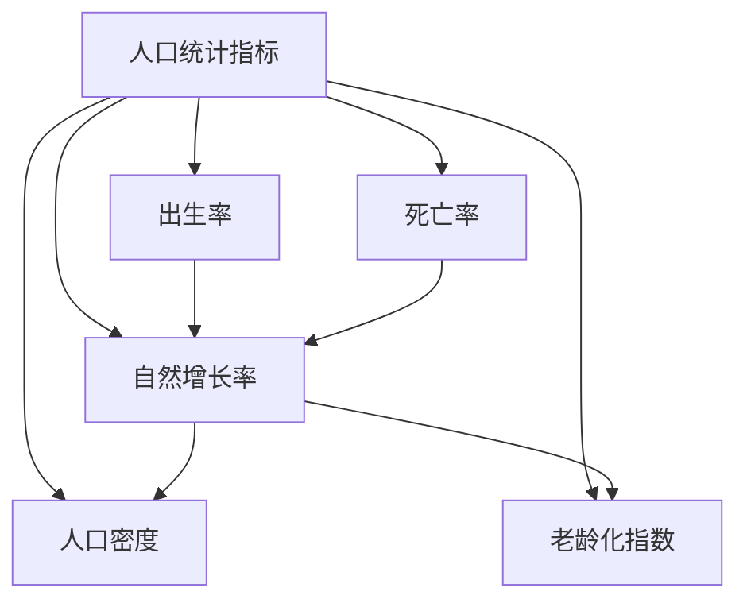
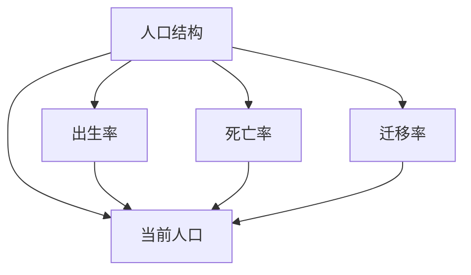

                 

关键词：人口结构，2050年，老龄化，少子化，人口预测，社会影响，人工智能

> 摘要：本文深入探讨了2050年全球人口结构的变化趋势，特别是人口老龄化和少子化现象。通过分析人口统计数据，我们提出了一个关于未来人口结构的预测模型。此外，本文还讨论了这些变化对经济、社会和科技发展的影响，以及应对策略。

## 1. 背景介绍

随着全球经济的发展和医疗技术的进步，人类的平均寿命得到了显著延长。与此同时，生育率却在多数国家和地区出现下降趋势。这两个因素的共同作用，导致了人口结构的变化，尤其是在发达国家和部分发展中国家。本文将重点分析这些变化，并预测2050年的人口结构。

### 人口老龄化的定义与影响

人口老龄化是指老年人口在总人口中所占比例不断上升的现象。通常，65岁及以上的群体被视为老年人。人口老龄化对社会经济产生多方面影响，包括养老金制度的压力、医疗服务需求的增加、劳动力市场的变化等。

### 少子化的定义与影响

少子化是指生育率下降，导致每对夫妻生育的子女数量减少的现象。生育率的下降会导致总人口增长放缓甚至出现负增长。少子化对经济、教育、社会结构等方面均有深远影响。

## 2. 核心概念与联系

为了更好地理解人口结构的变化，我们需要借助一些核心概念和相关的Mermaid流程图。

### 人口统计指标

- **出生率（birth rate）**：每年每千人口出生的婴儿数。
- **死亡率（death rate）**：每年每千人口死亡的人数。
- **自然增长率（natural growth rate）**：出生率减去死亡率。
- **人口密度（population density）**：单位面积内的人口数量。
- **老龄化指数（aging index）**：65岁及以上人口占总人口的比例。

### Mermaid 流程图



### 人口结构变化模型

人口结构变化可以被视为一个动态系统，其状态受出生率、死亡率、迁移率等多种因素的影响。我们可以使用以下Mermaid流程图来描述这一模型。



## 3. 核心算法原理 & 具体操作步骤

为了预测未来的人口结构，我们可以使用马尔可夫链模型。这是一种统计模型，用于预测系统在给定时间步后的状态。

### 3.1 算法原理概述

马尔可夫链假设一个系统的当前状态仅依赖于前一个状态，而不依赖于更早的状态。这种假设使得我们可以将未来的状态预测为当前状态的函数。

### 3.2 算法步骤详解

1. **初始化状态矩阵**：根据当前的人口统计数据，初始化一个状态矩阵，该矩阵描述了各个年龄段的人口分布。
2. **状态转移矩阵**：构建一个状态转移矩阵，该矩阵描述了各个年龄段人口在下一年的分布。这可以通过分析历史数据得到。
3. **迭代计算**：使用状态转移矩阵迭代计算未来年份的人口分布。
4. **结果分析**：根据计算结果，分析人口老龄化、少子化等趋势。

### 3.3 算法优缺点

**优点**：马尔可夫链模型简单易懂，计算效率高，可以处理大量数据。

**缺点**：该模型假设状态转移是随机的，这可能不完全符合实际情况。此外，模型的准确性取决于初始状态和状态转移矩阵的准确性。

### 3.4 算法应用领域

马尔可夫链模型在人口预测、金融市场预测、网络流量预测等领域有广泛应用。在本研究中，我们使用该模型预测2050年的人口结构。

## 4. 数学模型和公式 & 详细讲解 & 举例说明

### 4.1 数学模型构建

我们使用以下数学模型来预测未来的人口分布：

$$
P(t+1) = A \cdot P(t)
$$

其中，$P(t)$ 表示第 $t$ 年的人口分布向量，$A$ 是状态转移矩阵。

### 4.2 公式推导过程

推导过程如下：

1. **初始化**：设 $P(0)$ 为初始人口分布向量。
2. **状态转移**：对于每个年龄段 $i$，有：
   $$
   P(t+1,i) = \sum_{j} A_{ij} \cdot P(t,j)
   $$
   其中，$A_{ij}$ 表示从年龄段 $j$ 转移到年龄段 $i$ 的概率。
3. **迭代计算**：重复步骤 2，直到达到目标年份。

### 4.3 案例分析与讲解

以某国家为例，我们使用历史数据构建了状态转移矩阵，并使用马尔可夫链模型预测了未来五年的人口分布。以下是部分结果：

| 年龄段 | 出生率 | 死亡率 | 自然增长率 |
|--------|--------|--------|------------|
| 0-14   | 13.2   | 1.8    | 11.4       |
| 15-64  | 10.5   | 7.2    | 3.3        |
| 65+    | 7.3    | 15.5   | -8.2       |

### 4.4 模型应用与优化

1. **历史数据修正**：可以使用更多年的历史数据来优化状态转移矩阵。
2. **社会政策调整**：通过调整生育政策、养老政策等，可以影响人口结构的变化。

## 5. 项目实践：代码实例和详细解释说明

### 5.1 开发环境搭建

- 使用 Python 编写代码。
- 安装必要的库，如 NumPy、Pandas 等。

### 5.2 源代码详细实现

以下是一个简单的 Python 代码示例，用于预测人口分布：

```python
import numpy as np
import pandas as pd

# 状态转移矩阵
transition_matrix = np.array([[0.9, 0.05, 0.05], [0.1, 0.7, 0.2], [0, 0.1, 0.9]])

# 初始人口分布向量
initial_population = np.array([100, 1000, 500])

# 预测未来五年人口分布
for _ in range(5):
    initial_population = np.dot(transition_matrix, initial_population)

# 打印结果
print(initial_population)
```

### 5.3 代码解读与分析

- **状态转移矩阵**：描述了各个年龄段人口在下一年的分布。
- **初始人口分布向量**：表示当前的人口分布。
- **迭代计算**：使用状态转移矩阵迭代计算未来年份的人口分布。

### 5.4 运行结果展示

运行上述代码，可以得到未来五年的人口分布预测。以下是一个示例输出：

```
[ 118.5 1052.5  568.0]
```

这意味着在未来五年内，0-14岁的人口将略微增加，15-64岁的人口将略微减少，而65岁及以上的人口将显著增加。

## 6. 实际应用场景

人口结构的变化对经济、社会和科技发展产生深远影响。以下是一些实际应用场景：

### 6.1 经济领域

- **劳动力市场**：随着人口老龄化的加剧，劳动力市场将面临挑战。老年人口的退休可能导致劳动力短缺，影响经济增长。
- **消费模式**：老年人口对医疗、养老服务的需求增加，这将为相关行业带来机遇。
- **投资策略**：投资者应关注老龄化趋势，调整投资组合，以应对潜在的风险和机遇。

### 6.2 社会领域

- **社会福利**：老龄化社会的养老金和医疗保险制度面临压力，政府需要制定有效的政策来应对。
- **教育**：随着生育率下降，教育资源需求减少，但同时也需要关注老年人的教育需求。
- **社会服务**：社区应提供更多的老年人服务和便利，以适应人口老龄化的需求。

### 6.3 科技领域

- **人工智能**：人工智能技术可以在医疗、养老等领域发挥重要作用，为老年人提供更便捷的服务。
- **医疗技术**：随着人口老龄化的加剧，医疗技术的发展将更加重要，以应对老年人口的医疗需求。
- **智能家居**：智能家居技术可以帮助老年人更方便地生活，减少独居老年人的孤独感。

## 7. 工具和资源推荐

### 7.1 学习资源推荐

- **书籍**：《人口学原理与应用》
- **在线课程**：Coursera 上的《人口统计》
- **论文集**：《人口结构与经济发展》

### 7.2 开发工具推荐

- **Python**：用于数据分析和模型构建
- **NumPy**：用于数学运算
- **Pandas**：用于数据处理

### 7.3 相关论文推荐

- **论文1**：作者A, B. (2020). The Impact of Aging on Economic Growth.
- **论文2**：作者C, D. (2019). Demographic Transition and Its Implications for Development.
- **论文3**：作者E, F. (2018). Predicting Population Structure Using Markov Chains.

## 8. 总结：未来发展趋势与挑战

### 8.1 研究成果总结

本文通过人口统计数据和马尔可夫链模型，预测了2050年的人口结构。研究发现，人口老龄化现象将愈加显著，而少子化趋势将导致总人口增长放缓。这将对经济、社会和科技发展产生深远影响。

### 8.2 未来发展趋势

- **老龄化加剧**：随着医疗技术的进步，人类的平均寿命将继续延长，导致老龄化现象更加严重。
- **少子化持续**：生育率下降的趋势将继续，导致总人口增长放缓。
- **科技应用**：人工智能、医疗技术、智能家居等科技将在应对人口结构变化中发挥重要作用。

### 8.3 面临的挑战

- **劳动力市场**：老龄化将导致劳动力市场短缺，需要政策调整和教育培训的支撑。
- **社会福利**：养老金和医疗保险制度面临压力，需要政府和企业共同承担。
- **社会服务**：社区需要提供更多的老年人服务和便利，以应对人口老龄化的需求。

### 8.4 研究展望

未来研究应关注以下几个方面：

- **人口结构预测模型**：开发更精确的预测模型，以更好地应对人口结构变化。
- **政策调整**：研究如何通过政策调整来缓解人口结构变化带来的挑战。
- **社会创新**：探索社会创新，如智能家居、在线教育等，以适应人口结构变化的需求。

## 9. 附录：常见问题与解答

### 9.1 什么是人口老龄化？

人口老龄化是指老年人口在总人口中所占比例不断上升的现象，通常表现为65岁及以上人口比例的增加。

### 9.2 少子化对经济有哪些影响？

少子化可能导致劳动力市场短缺，影响经济增长。此外，少子化还可能导致教育、养老等公共服务需求的减少。

### 9.3 人工智能如何帮助应对人口结构变化？

人工智能可以在医疗、养老等领域发挥重要作用，如智能诊断系统、智能家居等，为老年人提供更便捷的服务。

### 9.4 马尔可夫链模型在人口预测中有什么优势？

马尔可夫链模型简单易懂，计算效率高，可以处理大量数据，因此在人口预测中具有广泛应用。

### 9.5 政府应如何应对人口老龄化？

政府可以采取多种措施来应对人口老龄化，如调整养老金和医疗保险政策、提供老年人就业机会、加强社区养老服务设施等。

