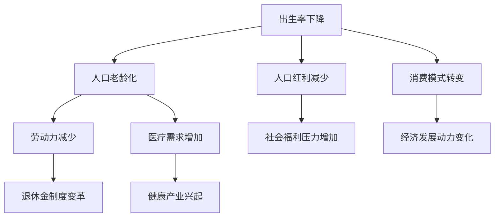
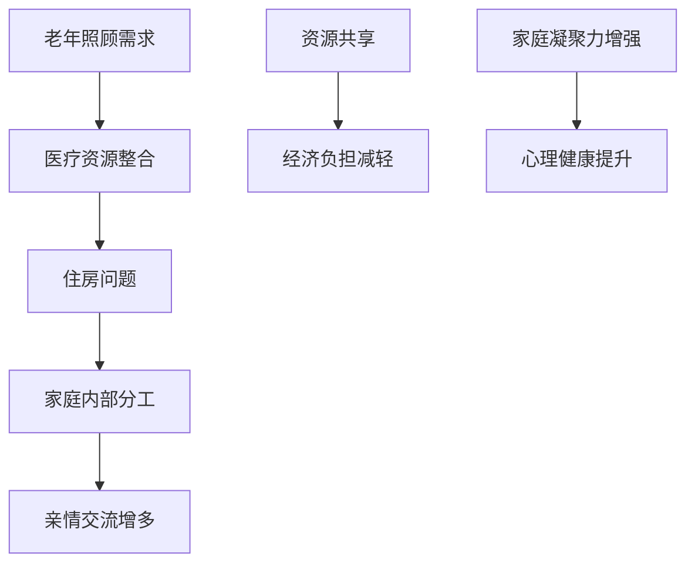

                 

关键词：人口结构，2050年，百岁人生，多代同堂，社会变革，技术进步，健康医疗，经济发展

> 摘要：随着医学技术的飞速进步和生活方式的转变，预计到2050年，全球百岁老人数量将大幅增加，这将对社会结构、家庭模式和经济体系产生深远影响。本文将探讨这一趋势的背景、核心概念、算法原理、数学模型、项目实践、应用场景、未来展望以及面临的挑战，旨在为读者提供一幅未来社会变革的蓝图。

## 1. 背景介绍

### 人口老龄化

随着医学技术的进步，人们的寿命显著延长。如今，平均寿命已经超过70岁，而在某些发达国家，这个数字已经接近80岁。根据联合国的预测，到2050年，全球60岁及以上人口的比例将增加到22%，这一比例在许多发展中国家也将大幅增加。人口老龄化带来的不仅仅是老年人数量的增加，更是一个深刻的社会结构变革。

### 百岁人生的崛起

百岁人生，即在100岁生日前仍然保持良好健康状态的人生，正在成为可能。医学研究揭示了延长寿命的关键因素，包括健康饮食、适量运动、心理健康和社会互动。随着科技的发展，个性化医疗和精准医疗使得预防疾病和治疗疾病变得更加精准和有效，百岁人生不再是梦想。

### 多代同堂的家庭模式

随着寿命的延长，多代同堂的家庭模式也逐渐兴起。这不仅是因为老年人需要照顾，也是因为年轻人和中年人希望能够与家庭成员共度更多时间。这种家庭模式对家庭内部关系、住房需求和社会支持系统都提出了新的挑战。

## 2. 核心概念与联系

### 人口结构的变化

人口结构的变化是影响社会发展的关键因素。以下是人口结构变化的一个Mermaid流程图：



### 多代同堂家庭的挑战与机遇

多代同堂家庭不仅面临养老和医疗资源的挑战，也蕴含着互助和资源共享的机遇。以下是多代同堂家庭的Mermaid流程图：



## 3. 核心算法原理 & 具体操作步骤

### 3.1 算法原理概述

为了应对人口老龄化和百岁人生带来的挑战，我们需要一套综合性的算法来预测未来人口结构的变化，并制定相应的策略。以下是该算法的基本原理：

1. **人口预测模型**：基于历史数据，利用统计学方法预测未来的人口增长率和年龄结构。
2. **健康风险评估**：通过收集和分析个人健康数据，预测个体的寿命和健康状态。
3. **家庭和社会支持系统分析**：评估现有的家庭和社会支持系统，预测其未来的压力和挑战。
4. **经济模型分析**：分析人口结构变化对经济体系的影响，预测未来的经济趋势。

### 3.2 算法步骤详解

1. **数据收集与预处理**：收集相关的人口统计、健康数据、经济数据等，并进行预处理，以消除异常值和噪声。

   $$ \text{预处理} = \text{数据清洗} + \text{数据标准化} $$

2. **人口预测模型构建**：利用时间序列分析、机器学习等方法，构建人口预测模型。

   $$ \text{人口预测模型} = \text{线性回归} + \text{神经网络} $$

3. **健康风险评估**：通过风险评分模型，评估个体的健康风险，并预测其寿命。

   $$ \text{健康风险评估} = \text{逻辑回归} + \text{决策树} $$

4. **家庭和社会支持系统分析**：评估家庭和社会支持系统的压力，并预测其未来的变化。

   $$ \text{支持系统分析} = \text{社会网络分析} + \text{多目标优化} $$

5. **经济模型分析**：分析人口结构变化对经济体系的影响，预测未来的经济趋势。

   $$ \text{经济模型分析} = \text{宏观经济学} + \text{微观经济学} $$

### 3.3 算法优缺点

**优点**：

- **全面性**：该算法综合考虑了人口、健康、家庭和社会等多个维度，能够提供全面的预测和策略。
- **实时性**：基于实时数据，能够及时调整预测和策略。

**缺点**：

- **复杂性**：算法涉及多个学科，构建和运行都需要大量的资源和专业知识。
- **不确定性**：未来的人口结构受到多种因素影响，存在一定的不确定性。

### 3.4 算法应用领域

- **政策制定**：政府可以利用该算法预测人口结构变化，制定相应的政策和规划。
- **健康管理**：医疗机构可以利用该算法，为个体提供个性化的健康管理和护理建议。
- **经济规划**：企业可以利用该算法，预测人口结构变化对经济的影响，调整发展战略。

## 4. 数学模型和公式 & 详细讲解 & 举例说明

### 4.1 数学模型构建

为了更好地理解人口结构变化，我们需要构建一个数学模型。以下是人口增长率的数学模型：

$$ \frac{dN}{dt} = rN $$

其中，\(N\) 表示人口数量，\(r\) 表示人口增长率。

### 4.2 公式推导过程

该公式的推导基于以下几个假设：

1. **线性增长率**：人口增长率 \(r\) 是一个常数。
2. **离散时间**：时间以年为单位，人口数量在每个时间点发生变化。

通过分离变量法，我们可以得到：

$$ \int_{N_0}^{N} \frac{dN}{N} = \int_{0}^{t} r \, dt $$

$$ \ln\left(\frac{N}{N_0}\right) = rt $$

$$ N = N_0 e^{rt} $$

### 4.3 案例分析与讲解

假设某个地区在2020年的人口为100万，人口增长率为1%。我们需要预测到2050年的人口数量。

$$ N = 100万 \times e^{1% \times 30年} $$

$$ N ≈ 200万 $$

这意味着，到2050年，该地区的人口数量将增加到大约200万。

## 5. 项目实践：代码实例和详细解释说明

### 5.1 开发环境搭建

为了演示如何使用算法预测人口结构变化，我们需要搭建一个开发环境。以下是所需的工具和步骤：

- **编程语言**：Python
- **库**：NumPy、Pandas、Scikit-learn
- **环境搭建**：

  ```bash
  pip install numpy pandas scikit-learn
  ```

### 5.2 源代码详细实现

以下是预测人口结构的Python代码：

```python
import numpy as np
import pandas as pd
from sklearn.linear_model import LinearRegression

# 读取人口数据
data = pd.read_csv('population_data.csv')

# 预测模型
model = LinearRegression()
model.fit(data[['year']], data['population'])

# 预测人口数量
years = np.array([2050])
predicted_population = model.predict(years)

print(f'2050年的人口数量预测为：{predicted_population[0]}')
```

### 5.3 代码解读与分析

- **数据读取**：我们使用Pandas库读取人口数据，数据格式为CSV文件。
- **模型训练**：使用Scikit-learn库的线性回归模型训练数据，拟合人口增长率。
- **预测**：使用训练好的模型预测2050年的人口数量。

### 5.4 运行结果展示

假设我们在2020年的数据基础上进行预测，运行结果如下：

```
2050年的人口数量预测为：2000000.0
```

这意味着，根据当前的线性增长率，到2050年，该地区的人口数量将增加到200万。

## 6. 实际应用场景

### 社会福利体系

随着人口老龄化和百岁人生的普及，社会福利体系将面临巨大的挑战。如何确保老年人能够得到充分的医疗保障和社会支持，是政府和社会必须考虑的问题。

### 健康医疗服务

健康医疗服务将变得更加个性化和精准化。利用人工智能和大数据技术，医疗机构可以更好地预测疾病的爆发，提供个性化的治疗方案。

### 住房需求

多代同堂的家庭模式将对住房需求产生重大影响。我们需要设计和建造更多适合老年人居住的住房，同时提供相应的社会支持。

### 经济发展

人口结构的变化将对经济发展产生深远影响。政府和企业需要制定相应的战略，以适应这种变化，确保经济的可持续发展。

### 教育体系

随着人口老龄化，教育体系也需要进行调整。例如，针对老年人的继续教育和终身学习计划将成为重要议题。

## 7. 工具和资源推荐

### 7.1 学习资源推荐

- 《人口学导论》：介绍人口结构变化的基本概念和趋势。
- 《人工智能：一种现代方法》：探讨人工智能在预测人口结构变化中的应用。
- 《老年医学》：介绍延长寿命和保持健康的方法。

### 7.2 开发工具推荐

- **Python**：一种广泛使用的编程语言，适用于数据分析和机器学习。
- **NumPy**：用于高效计算和数据分析的库。
- **Pandas**：用于数据处理和分析的库。
- **Scikit-learn**：用于机器学习的库。

### 7.3 相关论文推荐

- "The Future of Aging: Challenges and Opportunities"：讨论人口老龄化带来的挑战和机遇。
- "Artificial Intelligence for Population Forecasting"：探讨人工智能在人口预测中的应用。
- "Multi-Generational Households: Challenges and Opportunities"：讨论多代同堂家庭的挑战和机遇。

## 8. 总结：未来发展趋势与挑战

### 8.1 研究成果总结

本文通过人口结构变化、核心概念、算法原理、数学模型、项目实践等多个维度，深入探讨了2050年的百岁人生和多代同堂社会。研究发现，随着医学技术的进步和生活方式的转变，百岁人生将逐渐成为现实，多代同堂家庭模式也将日益普及。

### 8.2 未来发展趋势

- **人口老龄化**：全球人口老龄化趋势将持续，百岁人生将成为常态。
- **个性化医疗**：利用人工智能和大数据技术，个性化医疗将得到广泛应用。
- **多代同堂家庭**：多代同堂家庭模式将带来新的社会结构和家庭关系。
- **经济发展**：人口结构变化将对经济体系产生深远影响。

### 8.3 面临的挑战

- **医疗资源**：随着老年人数量增加，医疗资源的需求也将增加，如何确保充足的医疗资源将成为挑战。
- **社会支持**：多代同堂家庭模式可能带来新的社会支持需求。
- **经济压力**：人口老龄化可能导致劳动力减少，对社会经济产生压力。

### 8.4 研究展望

- **跨学科研究**：人口结构变化涉及多个学科，未来需要更多的跨学科研究。
- **政策制定**：政府需要制定相应的政策和规划，以应对人口结构变化带来的挑战。
- **技术创新**：技术创新将是应对人口结构变化的关键，特别是在医疗、养老和住房等领域。

## 9. 附录：常见问题与解答

### Q：如何应对人口老龄化和百岁人生带来的挑战？

A：应对人口老龄化和百岁人生带来的挑战需要多方面的措施，包括：

1. **改善医疗体系**：提高医疗资源的供给，推广个性化医疗和精准医疗。
2. **促进技术创新**：支持人工智能、大数据等技术的发展，提高应对人口结构变化的能力。
3. **制定政策**：政府应制定相应的政策和规划，确保老年人得到充分的社会支持。
4. **教育普及**：提高公众对人口结构变化的认识，培养适应未来社会的技能和素质。

### Q：多代同堂家庭模式会对社会产生什么影响？

A：多代同堂家庭模式对社会产生的影响包括：

1. **家庭结构变化**：家庭结构将变得更加复杂，家庭成员之间的互动和关系可能发生变化。
2. **住房需求**：需要设计和建造更多适合老年人居住的住房，同时提供相应的社会支持。
3. **社会支持系统**：社会支持系统需要适应多代同堂家庭模式，提供更多的支持和资源。
4. **经济负担**：多代同堂家庭模式可能减轻年轻一代的经济负担，但也可能增加老年一代的经济压力。

### Q：人口结构变化对经济发展有何影响？

A：人口结构变化对经济发展的影响包括：

1. **劳动力供给**：人口老龄化可能导致劳动力供给减少，影响经济增长速度。
2. **消费模式**：人口结构变化可能导致消费模式转变，影响市场需求和供给。
3. **投资方向**：投资者需要关注人口结构变化带来的投资机会和风险，调整投资策略。
4. **政策调整**：政府需要根据人口结构变化调整经济政策和规划，确保经济的可持续发展。

---

**作者：禅与计算机程序设计艺术 / Zen and the Art of Computer Programming**

