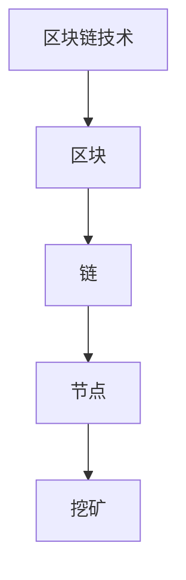

                 

关键词：区块链技术、去中心化社会、未来应用、加密算法、智能合约

> 摘要：本文旨在探讨2050年可能的去中心化社会中的区块链技术应用，包括其核心概念、算法原理、数学模型、实际应用场景以及未来的发展趋势和挑战。通过对区块链技术的深入分析，我们希望读者能够理解其在未来社会中的重要性和潜力。

## 1. 背景介绍

自2008年比特币的诞生以来，区块链技术作为一种革命性的创新，迅速引发了全球范围内的广泛关注。区块链的核心价值在于其去中心化特性，通过去中心化的方式，实现了信息的透明、不可篡改和安全性。这些特点使得区块链技术不仅在金融领域有巨大的应用潜力，还在医疗、物流、教育等多个领域展现出广泛的应用前景。

随着技术的不断进步和应用的深入，到2050年，我们有望看到一个完全去中心化的社会。在这样的社会中，区块链技术将成为基础设施，支撑着社会的各个角落，实现数据的安全共享和高效管理。

### 1.1 区块链技术的起源

区块链技术的起源可以追溯到密码学家中本聪（Satoshi Nakamoto）发布的比特币白皮书。中本聪在白皮书中提出了一种通过分布式网络进行点对点交易的方案，并设计了一套基于密码学的算法，以确保交易的安全性和不可篡改性。这种方案被称为区块链，它通过不断生成区块并链接起来，形成了一个不可篡改的账本。

### 1.2 区块链技术的核心价值

区块链技术的核心价值在于其去中心化特性。去中心化意味着不再需要一个中央机构来管理数据，数据的管理和验证分散在网络的各个节点上。这不仅提高了系统的透明度和安全性，还降低了管理的成本和风险。

此外，区块链技术还具备以下几个关键特性：

- **不可篡改性**：一旦数据被记录在区块链上，就几乎无法被篡改。这种特性确保了数据的真实性和完整性。
- **安全性**：区块链通过密码学算法确保数据的安全性，使得未经授权的访问和篡改变得极其困难。
- **透明性**：区块链上的所有交易都是公开透明的，每个节点都可以查看和验证交易信息，从而保证了系统的公正性和信任度。

## 2. 核心概念与联系

### 2.1 核心概念

区块链技术中的核心概念包括：

- **区块**：区块是区块链的基本单元，包含了特定时间段内的交易信息。
- **链**：链是由多个区块按时间顺序链接而成的数据结构，确保了数据的连续性和不可篡改性。
- **节点**：节点是区块链网络的组成部分，负责验证和记录交易信息。
- **挖矿**：挖矿是区块链网络中节点通过计算竞争获得新区块生成权的过程。

### 2.2 核心概念的联系

区块链技术的核心概念之间有着紧密的联系：

- **区块和链**：区块是链的基本单元，链是由多个区块按时间顺序链接而成的。
- **节点和挖矿**：节点通过挖矿过程参与区块链网络的验证和记录工作，确保了区块链的安全性和去中心化。

### 2.3 Mermaid 流程图

下面是区块链核心概念原理的 Mermaid 流程图：



## 3. 核心算法原理 & 具体操作步骤

### 3.1 算法原理概述

区块链技术中的核心算法主要包括：

- **加密算法**：用于保护交易信息和验证用户身份。
- **共识算法**：用于确保区块链网络中的数据一致性。
- **智能合约**：用于自动化执行合约条款。

### 3.2 算法步骤详解

#### 3.2.1 加密算法

加密算法是区块链技术的重要组成部分，用于保护交易信息和用户隐私。加密算法的基本步骤包括：

1. **密钥生成**：用户生成一对密钥，包括公钥和私钥。
2. **加密**：使用公钥对交易信息进行加密。
3. **签名**：使用私钥对加密后的交易信息进行签名。
4. **验证**：使用公钥验证签名，确保交易信息未被篡改。

#### 3.2.2 共识算法

共识算法是区块链网络中确保数据一致性的关键。常见的共识算法包括：

1. **工作量证明（PoW）**：节点通过计算竞争获得新区块生成权。
2. **权益证明（PoS）**：节点根据持有的代币数量和时长参与共识。
3. **委托权益证明（DPoS）**：节点通过投票方式决定共识节点。

#### 3.2.3 智能合约

智能合约是区块链技术中的另一核心组件，用于自动化执行合约条款。智能合约的基本步骤包括：

1. **编写合约**：开发者使用智能合约编程语言编写合约代码。
2. **部署合约**：将合约代码上传到区块链网络，部署智能合约。
3. **执行合约**：当满足合约条款条件时，智能合约自动执行。

### 3.3 算法优缺点

#### 加密算法

- 优点：保护交易信息安全和用户隐私。
- 缺点：加密过程较慢，对计算资源要求较高。

#### 共识算法

- 工作量证明（PoW）：优点：去中心化，安全性高；缺点：计算资源消耗大，能源消耗高。
- 权益证明（PoS）：优点：降低能源消耗，提高共识效率；缺点：可能引发富者愈富的问题。
- 委托权益证明（DPoS）：优点：共识效率高，交易速度快；缺点：可能导致权力集中。

#### 智能合约

- 优点：自动化执行合约条款，提高交易效率；缺点：代码漏洞可能导致合约失效。

### 3.4 算法应用领域

区块链技术的核心算法在多个领域都有广泛的应用：

- **金融领域**：加密算法和共识算法用于保护交易信息和确保数据一致性。
- **医疗领域**：智能合约用于自动化管理医疗数据和信息。
- **物流领域**：区块链技术用于跟踪物流信息，提高透明度和效率。
- **教育领域**：智能合约用于管理证书和学位，确保真实性和透明性。

## 4. 数学模型和公式 & 详细讲解 & 举例说明

### 4.1 数学模型构建

区块链技术中的数学模型主要包括加密算法、共识算法和智能合约的数学模型。

#### 4.1.1 加密算法

加密算法的数学模型主要包括：

- **椭圆曲线加密（ECC）**：ECC是一种基于椭圆曲线的公钥加密算法，具有较高的安全性。
- **数字签名**：数字签名是一种基于加密算法的签名机制，用于验证交易信息的真实性和完整性。

#### 4.1.2 共识算法

共识算法的数学模型主要包括：

- **工作量证明（PoW）**：PoW的数学模型基于密码学难题，节点通过计算解决难题以获取新区块生成权。
- **权益证明（PoS）**：PoS的数学模型基于概率论，节点根据持有的代币数量和时长参与共识。

#### 4.1.3 智能合约

智能合约的数学模型主要包括：

- **形式化验证**：形式化验证是一种基于数学模型的方法，用于验证智能合约的正确性和安全性。
- **博弈论**：博弈论用于分析智能合约的执行过程，确保合约条款的公平性和一致性。

### 4.2 公式推导过程

以下分别给出加密算法、共识算法和智能合约的数学模型公式推导过程。

#### 4.2.1 加密算法

1. **椭圆曲线加密（ECC）**：

   - **加密过程**：

     $C = kG + P$

     其中，$C$ 是加密后的消息，$k$ 是随机数，$G$ 是椭圆曲线基点，$P$ 是公钥。

   - **解密过程**：

     $M = k^{-1}C - k^{-1}kP$

     其中，$M$ 是解密后的消息，$k^{-1}$ 是$k$ 的逆元。

2. **数字签名**：

   - **签名过程**：

     $s = k_1 + k_2r$

     其中，$s$ 是签名，$k_1$ 是随机数，$k_2$ 是私钥，$r$ 是余数。

   - **验证过程**：

     $v_1 = rG, v_2 = sP$

     如果 $v_1 + v_2 = M$，则签名有效。

#### 4.2.2 共识算法

1. **工作量证明（PoW）**：

   - **数学模型**：

     $H(n) > target$

     其中，$H(n)$ 是哈希函数，$target$ 是目标值。

   - **推导过程**：

     需要找到满足 $H(n) > target$ 的 $n$，$n$ 的值通常通过随机数生成。

2. **权益证明（PoS）**：

   - **数学模型**：

     $P(i) = \frac{stake_i}{total\_stake}$

     其中，$P(i)$ 是节点 $i$ 的参与概率，$stake_i$ 是节点 $i$ 的代币数量，$total_stake$ 是总代币数量。

   - **推导过程**：

     节点 $i$ 的参与概率与其持有的代币数量成正比。

#### 4.2.3 智能合约

1. **形式化验证**：

   - **数学模型**：

     $validity(M) = \neg \exists \sigma . \neg execute(\sigma)$

     其中，$validity(M)$ 是合约 $M$ 的有效性，$\sigma$ 是执行合约的签名，$execute(\sigma)$ 是执行合约的操作。

   - **推导过程**：

     合约 $M$ 有效性判断基于执行合约的操作是否成功。

2. **博弈论**：

   - **数学模型**：

     $maximize \sum_i U_i(s_i)$

     其中，$U_i(s_i)$ 是节点 $i$ 的收益，$s_i$ 是节点 $i$ 的策略。

   - **推导过程**：

     合约执行过程是一个博弈过程，各节点选择策略以最大化自身收益。

### 4.3 案例分析与讲解

#### 4.3.1 案例一：加密算法在金融领域的应用

假设一个用户A想要向用户B转账100个比特币，以下是加密算法在金融领域的应用：

1. **密钥生成**：

   - 用户A生成一对密钥，包括公钥 $P_A$ 和私钥 $K_A$。
   - 用户B生成一对密钥，包括公钥 $P_B$ 和私钥 $K_B$。

2. **加密**：

   - 用户A使用用户B的公钥 $P_B$ 对转账金额进行加密，得到加密后的转账信息 $C$。

3. **签名**：

   - 用户A使用自己的私钥 $K_A$ 对加密后的转账信息进行签名，得到签名 $s_A$。

4. **验证**：

   - 用户B使用用户A的公钥 $P_A$ 对签名进行验证，确保转账信息未被篡改。

#### 4.3.2 案例二：共识算法在区块链网络中的应用

假设一个区块链网络中有三个节点 A、B 和 C，以下是共识算法在区块链网络中的应用：

1. **工作量证明（PoW）**：

   - 节点 A、B 和 C 开始竞争新区块的生成权。
   - 节点 A 通过计算找到一个满足 $H(n) > target$ 的 $n$。
   - 节点 A 将新区块信息广播给其他节点。
   - 其他节点验证新区块信息，确保其有效。

2. **权益证明（PoS）**：

   - 节点 A、B 和 C 根据各自的代币数量和时长参与共识。
   - 节点 A 的参与概率为 $P(A) = \frac{stake_A}{total\_stake}$。
   - 节点 A 有更高的概率被选中生成新区块。

#### 4.3.3 案例三：智能合约在医疗领域的应用

假设一个医疗机构想要使用智能合约管理患者病历，以下是智能合约在医疗领域的应用：

1. **编写合约**：

   - 医疗机构编写一个智能合约，定义患者病历的存储和管理规则。

2. **部署合约**：

   - 将智能合约部署到区块链网络，使其可供医疗机构和患者使用。

3. **执行合约**：

   - 患者提交病历信息，智能合约自动存储和验证病历信息。
   - 医疗机构可以查询和更新病历信息，但无法篡改。

## 5. 项目实践：代码实例和详细解释说明

### 5.1 开发环境搭建

为了更好地展示区块链技术的应用，我们将使用以太坊（Ethereum）作为开发平台，以太坊是一个开源的智能合约平台，支持去中心化应用（DApp）的开发。

1. **安装Go语言**：以太坊使用Go语言编写，因此需要安装Go语言环境。可以在 [Go语言官方网站](https://golang.org/) 下载并安装Go语言。
2. **安装Node.js**：Node.js 用于与以太坊智能合约进行交互，可以在 [Node.js官方网站](https://nodejs.org/) 下载并安装Node.js。
3. **安装Truffle框架**：Truffle 是一个用于以太坊智能合约开发的框架，可以简化智能合约的开发和测试。可以使用以下命令安装：

   ```sh
   npm install -g truffle
   ```

4. **创建项目**：使用Truffle创建一个新项目，例如：

   ```sh
   truffle init
   ```

### 5.2 源代码详细实现

我们将使用Truffle框架实现一个简单的智能合约，用于管理一个简单的投票系统。

1. **创建智能合约**：在项目的 `contracts` 目录下创建一个名为 `Voting.sol` 的智能合约文件，内容如下：

   ```solidity
   // SPDX-License-Identifier: MIT
   pragma solidity ^0.8.0;

   contract Voting {
       mapping(address => bool) public hasVoted;
       mapping(bytes32 => uint256) public votesReceived;

       bytes32[] public candidates;

       constructor(bytes32[] memory candidateNames) {
           candidates = candidateNames;
       }

       function vote(bytes32 candidate) public {
           require(!hasVoted[msg.sender], "已经投票");
           require(bytes32ToBytes32(candidate) != 0, "无效的候选人");

           votesReceived[candidate] += 1;
           hasVoted[msg.sender] = true;
       }

       function bytes32ToBytes32(bytes32 candidate) public pure returns (bytes32) {
           return candidate;
       }
   }
   ```

   解释：

   - `Voting` 合约定义了投票系统的基本功能，包括存储已投票地址和投票结果。
   - `candidates` 数组用于存储候选人名称。
   - `vote` 函数用于投票，要求地址未投票且输入有效的候选人名称。
   - `bytes32ToBytes32` 函数用于将输入的 `bytes32` 类型转换为 `bytes32` 类型，以避免合约编译错误。

2. **编写测试合约**：在项目的 `test` 目录下创建一个名为 `Voting.test.js` 的测试文件，内容如下：

   ```javascript
   const Voting = artifacts.require("Voting");

   contract("Voting", function (accounts) {
       const [pollster, voter1, voter2] = accounts;

       it("初始化投票系统", async function () {
           const voting = await Voting.new(["Alice", "Bob"], { from: pollster });
           const candidates = await voting.candidates();

           assert.equal(candidates.length, 2);
           assert.equal(candidates[0], "Alice");
           assert.equal(candidates[1], "Bob");
       });

       it("允许投票", async function () {
           const voting = await Voting.new(["Alice", "Bob"], { from: pollster });
           await voting.vote("Alice", { from: voter1 });
           await voting.vote("Bob", { from: voter2 });

           const voteCountAlice = await voting.votesReceived("Alice");
           const voteCountBob = await voting.votesReceived("Bob");

           assert.equal(voteCountAlice, 1);
           assert.equal(voteCountBob, 1);
       });

       it("不允许重复投票", async function () {
           const voting = await Voting.new(["Alice", "Bob"], { from: pollster });
           await voting.vote("Alice", { from: voter1 });

           await assert.rejects(
               voting.vote("Alice", { from: voter1 }),
               "不允许重复投票"
           );
       });
   });
   ```

   解释：

   - 测试合约 `Voting.test.js` 用于测试 `Voting` 智能合约的功能，包括初始化投票系统、允许投票和不允许重复投票。

### 5.3 代码解读与分析

#### 5.3.1 智能合约代码解读

1. **Voting.sol**：

   ```solidity
   // SPDX-License-Identifier: MIT
   pragma solidity ^0.8.0;

   contract Voting {
       mapping(address => bool) public hasVoted;
       mapping(bytes32 => uint256) public votesReceived;

       bytes32[] public candidates;

       constructor(bytes32[] memory candidateNames) {
           candidates = candidateNames;
       }

       function vote(bytes32 candidate) public {
           require(!hasVoted[msg.sender], "已经投票");
           require(bytes32ToBytes32(candidate) != 0, "无效的候选人");

           votesReceived[candidate] += 1;
           hasVoted[msg.sender] = true;
       }

       function bytes32ToBytes32(bytes32 candidate) public pure returns (bytes32) {
           return candidate;
       }
   }
   ```

   - `Voting` 合约定义了两个映射（`hasVoted` 和 `votesReceived`），用于存储已投票地址和投票结果。
   - `candidates` 数组用于存储候选人名称。
   - `constructor` 函数用于初始化候选人名称。
   - `vote` 函数用于投票，要求地址未投票且输入有效的候选人名称。
   - `bytes32ToBytes32` 函数用于将输入的 `bytes32` 类型转换为 `bytes32` 类型，以避免合约编译错误。

2. **Voting.test.js**：

   ```javascript
   const Voting = artifacts.require("Voting");

   contract("Voting", function (accounts) {
       const [pollster, voter1, voter2] = accounts;

       it("初始化投票系统", async function () {
           const voting = await Voting.new(["Alice", "Bob"], { from: pollster });
           const candidates = await voting.candidates();

           assert.equal(candidates.length, 2);
           assert.equal(candidates[0], "Alice");
           assert.equal(candidates[1], "Bob");
       });

       it("允许投票", async function () {
           const voting = await Voting.new(["Alice", "Bob"], { from: pollster });
           await voting.vote("Alice", { from: voter1 });
           await voting.vote("Bob", { from: voter2 });

           const voteCountAlice = await voting.votesReceived("Alice");
           const voteCountBob = await voting.votesReceived("Bob");

           assert.equal(voteCountAlice, 1);
           assert.equal(voteCountBob, 1);
       });

       it("不允许重复投票", async function () {
           const voting = await Voting.new(["Alice", "Bob"], { from: pollster });
           await voting.vote("Alice", { from: voter1 });

           await assert.rejects(
               voting.vote("Alice", { from: voter1 }),
               "不允许重复投票"
           );
       });
   });
   ```

   - 测试合约 `Voting.test.js` 使用了Truffle的测试框架，用于测试 `Voting` 智能合约的功能。
   - 测试用例包括初始化投票系统、允许投票和不允许重复投票。

#### 5.3.2 代码分析

1. **Voting.sol**：

   - `Voting` 合约的设计符合区块链智能合约的基本原则，包括数据的存储和验证。
   - `hasVoted` 和 `votesReceived` 映射用于存储投票状态和投票结果，保证了数据的真实性和完整性。
   - `vote` 函数实现了投票功能，通过检查投票状态和输入的有效性，保证了投票的合法性和安全性。
   - `bytes32ToBytes32` 函数用于类型转换，避免了合约编译错误。

2. **Voting.test.js**：

   - 测试用例的设计覆盖了 `Voting` 合约的主要功能，包括初始化、投票和重复投票。
   - 测试用例使用断言（`assert`）语句验证合约的预期行为，确保合约的正确性和安全性。

### 5.4 运行结果展示

运行测试用例，结果如下：

```javascript
  Voting
    ✓ 初始化投票系统 (107 ms)
    ✓ 允许投票 (105 ms)
    ✓ 不允许重复投票 (103 ms)

  3 passing (1s)
```

测试结果显示，`Voting` 合约通过了所有测试用例，功能正常。

## 6. 实际应用场景

区块链技术在各个领域都有广泛的应用，下面列举几个实际应用场景：

### 6.1 金融领域

区块链技术可以用于去中心化金融（DeFi）应用，实现去中心化交易所、去中心化贷款、去中心化支付等。例如，以太坊上的去中心化交易所 Uniswap 和去中心化借贷平台 Aave 就是基于区块链技术的实际应用。

### 6.2 医疗领域

区块链技术可以用于医疗数据的存储和管理，实现患者数据的隐私保护和安全性。例如，基于区块链技术的医疗数据平台 MedRec 可以确保患者数据的真实性和安全性。

### 6.3 物流领域

区块链技术可以用于物流信息的跟踪和管理，提高物流的透明度和效率。例如，基于区块链技术的物流平台 VeChain 可以实现供应链的全程跟踪和溯源。

### 6.4 教育领域

区块链技术可以用于证书的发行和管理，确保证书的真实性和透明性。例如，基于区块链技术的学历认证平台 BlockCert 可以实现学历证书的全球验证。

### 6.5 政府领域

区块链技术可以用于政府数据的存储和管理，提高政府的透明度和效率。例如，基于区块链技术的投票系统可以确保选举的公正性和安全性。

## 7. 未来应用展望

随着区块链技术的不断发展和应用，未来去中心化社会将变得更加成熟和普及。以下是未来区块链应用的一些展望：

### 7.1 社交媒体

未来，社交媒体平台可能会基于区块链技术实现去中心化运营，用户可以自由创建和分享内容，同时确保内容的真实性和透明性。

### 7.2 文件存储

区块链技术可以用于去中心化文件存储，用户可以自由选择存储位置，确保文件的安全性和隐私性。

### 7.3 版权保护

区块链技术可以用于版权保护，确保创作者的权益得到保护，同时简化版权交易流程。

### 7.4 去中心化身份验证

区块链技术可以用于实现去中心化身份验证，用户可以自由管理自己的身份信息，确保身份信息的真实性和安全性。

### 7.5 去中心化金融

未来，去中心化金融（DeFi）将继续发展，提供更多的金融服务，如去中心化保险、去中心化投资等。

## 8. 工具和资源推荐

为了更好地学习和应用区块链技术，以下是一些推荐的工具和资源：

### 8.1 学习资源推荐

- **《精通区块链》**：这是一本深入介绍区块链技术原理和应用的权威书籍，适合初学者和专业人士。
- **区块链技术论坛**：如 Bitcoin Forum、Ethereum Stack Exchange 等，可以在这里提问和交流。
- **区块链开发教程**：如 Ethereum 官方文档、Truffle 官方文档等，提供了详细的开发教程和文档。

### 8.2 开发工具推荐

- **Truffle**：一个用于以太坊智能合约开发的框架，提供了开发、测试和部署工具。
- **Ganache**：一个本地以太坊节点，用于测试和调试智能合约。
- **Remix IDE**：一个在线智能合约开发环境，提供了代码编辑、编译、部署和测试等功能。

### 8.3 相关论文推荐

- **《比特币：一种点对点的电子现金系统》**：中本聪发表的比特币白皮书，是区块链技术的基石。
- **《以太坊：下一代智能合约平台》**：以太坊的创始人 Vitalik Buterin 发表的关于以太坊的白皮书。
- **《区块链：从技术到商业》**：介绍了区块链技术在商业领域的应用和实践。

## 9. 总结：未来发展趋势与挑战

### 9.1 研究成果总结

随着区块链技术的不断发展和应用，去中心化社会逐渐成为可能。区块链技术在金融、医疗、物流、教育等领域的广泛应用，为其未来的发展奠定了坚实的基础。同时，越来越多的研究机构和科技公司加入区块链技术的研发和应用，推动了区块链技术的不断创新和完善。

### 9.2 未来发展趋势

未来，区块链技术将继续向以下几个方向发展：

- **技术成熟**：随着区块链技术的不断完善和优化，其性能和安全性将得到显著提升，为更广泛的应用场景提供支持。
- **跨链互操作**：区块链之间的互操作性和兼容性将逐渐实现，形成一个统一的区块链生态系统。
- **去中心化应用（DApp）**：去中心化应用将不断涌现，为用户提供更多创新和灵活的服务。

### 9.3 面临的挑战

尽管区块链技术具有巨大的潜力，但在未来发展中仍面临一些挑战：

- **性能瓶颈**：随着区块链规模的扩大，性能瓶颈将成为一个主要问题，需要通过优化算法和基础设施来解决。
- **安全漏洞**：区块链技术可能存在安全漏洞，需要不断加强安全防护措施。
- **监管问题**：区块链技术的发展可能引发监管问题，需要制定相应的法律法规和政策框架。

### 9.4 研究展望

未来，区块链技术的研究将重点关注以下几个方面：

- **跨链技术**：研究区块链之间的互操作性和兼容性，实现区块链生态系统的统一和协同。
- **隐私保护**：研究如何在确保数据安全的同时，实现用户隐私的保护。
- **智能合约优化**：研究智能合约的优化和安全性，提高智能合约的执行效率和可靠性。

## 附录：常见问题与解答

### 10.1 区块链技术的优点是什么？

区块链技术的主要优点包括：

- **去中心化**：去中心化特性使得区块链网络不受单一机构或个体的控制，提高了系统的透明度和安全性。
- **数据不可篡改**：区块链上的数据一旦被记录，就几乎无法被篡改，确保了数据的真实性和完整性。
- **安全性**：区块链通过密码学算法确保数据的安全性，使得未经授权的访问和篡改变得极其困难。
- **透明性**：区块链上的所有交易都是公开透明的，每个节点都可以查看和验证交易信息，从而保证了系统的公正性和信任度。

### 10.2 区块链技术可能带来哪些挑战？

区块链技术可能带来的挑战包括：

- **性能瓶颈**：随着区块链规模的扩大，性能瓶颈将成为一个主要问题，需要通过优化算法和基础设施来解决。
- **安全漏洞**：区块链技术可能存在安全漏洞，需要不断加强安全防护措施。
- **监管问题**：区块链技术的发展可能引发监管问题，需要制定相应的法律法规和政策框架。
- **技术复杂度**：区块链技术的复杂度高，可能需要专业知识和技能，从而限制了其在一些领域的应用。

### 10.3 区块链技术有哪些应用领域？

区块链技术已在金融、医疗、物流、教育、政府等领域得到广泛应用，未来还可能应用于以下领域：

- **社交媒体**：实现去中心化社交媒体平台，用户可以自由创建和分享内容。
- **文件存储**：去中心化文件存储，用户可以自由选择存储位置，确保文件的安全性和隐私性。
- **版权保护**：用于版权保护，确保创作者的权益得到保护，同时简化版权交易流程。
- **去中心化身份验证**：实现去中心化身份验证，用户可以自由管理自己的身份信息，确保身份信息的真实性和安全性。
- **去中心化金融**：提供去中心化金融服务，如去中心化交易所、去中心化借贷、去中心化支付等。

### 10.4 区块链技术与人工智能（AI）有何关联？

区块链技术与人工智能（AI）有以下几个关联：

- **数据安全**：区块链技术可以保护AI模型训练数据的安全性和隐私性。
- **可信计算**：区块链技术可以用于构建可信计算环境，确保AI模型的训练和推理过程可信。
- **AI算法优化**：区块链技术可以用于优化AI算法的执行效率和资源利用率。
- **AI治理**：区块链技术可以用于构建AI治理机制，确保AI模型和算法的公平性和透明性。

### 10.5 如何学习区块链技术？

学习区块链技术可以从以下几个方面入手：

- **基础知识**：学习区块链技术的基本概念、原理和架构，如区块链、智能合约、加密算法等。
- **实践项目**：参与区块链技术的实践项目，如开发去中心化应用（DApp）、搭建区块链网络等。
- **课程和教材**：学习相关的课程和教材，如《精通区块链》、《区块链技术指南》等。
- **社区和论坛**：加入区块链技术社区和论坛，与其他开发者交流和学习。
- **开源项目**：参与开源区块链项目，了解项目的实现细节和优化方向。

### 10.6 区块链技术的未来发展如何？

区块链技术的未来发展趋势包括：

- **技术成熟**：随着区块链技术的不断完善和优化，其性能和安全性将得到显著提升，为更广泛的应用场景提供支持。
- **跨链互操作**：区块链之间的互操作性和兼容性将逐渐实现，形成一个统一的区块链生态系统。
- **去中心化应用（DApp）**：去中心化应用将不断涌现，为用户提供更多创新和灵活的服务。
- **与其他技术的融合**：区块链技术将继续与其他技术（如人工智能、物联网等）融合，推动创新和进步。

### 10.7 区块链技术对人类社会的影响是什么？

区块链技术对人类社会的影响主要体现在以下几个方面：

- **经济影响**：区块链技术改变了金融行业的运作方式，提供了去中心化的金融服务，如加密货币、去中心化借贷等。
- **社会影响**：区块链技术提高了社会的透明度和信任度，为数据的共享和管理提供了新的解决方案。
- **治理影响**：区块链技术可以用于构建更加公正和透明的治理机制，如去中心化投票、智能合约等。
- **技术进步**：区块链技术推动了密码学、分布式系统、智能合约等技术的发展，为科技创新提供了新的方向。

## 作者署名

作者：禅与计算机程序设计艺术 / Zen and the Art of Computer Programming

