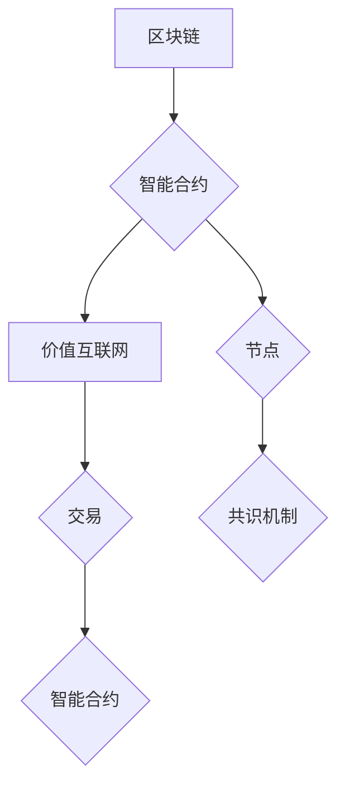

                 

关键词：区块链、智能合约、价值互联网、未来趋势、技术发展

> 摘要：本文探讨了到2050年，区块链技术将如何演变，特别是智能合约的发展，以及其对构建价值互联网的潜在影响。文章首先介绍了区块链的背景和核心概念，随后详细阐述了智能合约的原理及其未来可能的应用领域，最后探讨了未来区块链的发展趋势和面临的挑战。

## 1. 背景介绍

### 区块链的起源与发展

区块链作为比特币的底层技术，自2008年由中本聪（Satoshi Nakamoto）提出以来，已迅速发展成为一个全球性的技术热点。区块链的本质是一个去中心化的数据库，通过分布式账本技术记录和验证交易，确保数据的不可篡改性和透明性。

随着区块链技术的不断发展，其应用范围逐渐扩大。从最初的数字货币领域，到现在的供应链管理、金融服务、智能合约等多个领域，区块链技术正不断推动传统行业的变革。

### 智能合约的兴起

智能合约是区块链技术的一个重要组成部分，它是一种自动执行、管理和执行合同的机制。智能合约的代码存储在区块链上，确保其透明性和不可篡改性。智能合约的出现，极大地简化了合同执行的过程，降低了中介机构的成本，提高了交易的效率。

智能合约的发展历程可以追溯到1994年，当时Nick Szabo首次提出了智能合约的概念。然而，直到区块链技术的出现，智能合约才真正得到了实现和推广。

### 价值互联网的构想

价值互联网，也被称作“价值互联网”（Value Internet），是一个由中本聪在比特币白皮书中提出的概念。它旨在构建一个去中心化的、安全的、全球范围内的交易网络，使得价值的交换更加便捷和高效。价值互联网的出现，有望颠覆传统的金融体系，重构全球经济秩序。

## 2. 核心概念与联系

### 区块链的架构

区块链由一系列按时间顺序排列的区块组成，每个区块包含了若干交易记录。区块之间通过哈希函数连接，形成一个不可篡改的分布式账本。以下是区块链的核心组件：

- **区块（Block）**：包含一定数量的交易记录的数据结构。
- **交易（Transaction）**：记录参与者之间价值转移的数据结构。
- **链（Chain）**：由一系列按时间顺序排列的区块组成。

### 智能合约的原理

智能合约是基于编程语言实现的，其核心是能够在区块链上执行自动化操作。智能合约的原理可以概括为以下三个步骤：

1. **合约编写**：开发者使用特定的智能合约编程语言，编写符合业务逻辑的智能合约代码。
2. **合约部署**：将编写的智能合约代码部署到区块链上，并设置合约的初始参数。
3. **合约执行**：当满足合约预设的条件时，智能合约自动执行预定的操作。

### 价值互联网的架构

价值互联网是一个去中心化的网络，其核心是区块链技术。价值互联网的架构包括以下几个部分：

- **节点（Node）**：区块链网络中的参与者，负责维护区块链的状态和数据。
- **交易（Transaction）**：在网络中传输价值的单位，可以包括货币、股权、积分等。
- **智能合约（Smart Contract）**：自动执行和管理交易的程序代码。
- **共识机制（Consensus Mechanism）**：确保区块链网络中的所有节点达成一致的方法。

### Mermaid 流程图

以下是区块链、智能合约和价值互联网的Mermaid流程图：



## 3. 核心算法原理 & 具体操作步骤

### 3.1 算法原理概述

区块链的核心算法是哈希函数和共识机制。哈希函数用于将数据转换为一个固定长度的字符串，确保数据的唯一性和不可篡改性。共识机制则是确保区块链网络中的所有节点能够达成一致的方法。

智能合约的核心算法是基于图灵完备的编程语言，可以执行复杂的逻辑操作。

价值互联网的核心算法是交易验证和智能合约执行，确保交易的安全性和高效性。

### 3.2 算法步骤详解

#### 区块链算法步骤

1. **创建区块**：节点收集交易记录，并将其打包成一个区块。
2. **计算区块哈希**：使用哈希函数计算区块的哈希值。
3. **添加区块到链**：将计算得到的区块哈希与前一区块的哈希连接，形成一个新的区块，并将其添加到区块链上。
4. **共识机制**：网络中的所有节点通过共识机制达成一致，确保区块链的完整性和安全性。

#### 智能合约算法步骤

1. **编写合约代码**：开发者使用智能合约编程语言编写合约代码。
2. **部署合约**：将合约代码部署到区块链上，并设置合约的初始参数。
3. **调用合约**：当满足合约预设的条件时，合约自动执行预定的操作。
4. **合约执行结果验证**：网络中的节点验证合约执行的结果，确保合约的正确执行。

#### 价值互联网算法步骤

1. **交易验证**：节点接收交易，并验证其合法性。
2. **智能合约执行**：当交易满足智能合约条件时，智能合约自动执行。
3. **交易记录**：将执行后的交易记录添加到区块链上。
4. **共识机制**：网络中的所有节点通过共识机制达成一致，确保交易的合法性和安全性。

### 3.3 算法优缺点

#### 区块链

**优点**：
- 数据不可篡改。
- 去中心化。
- 高效性。

**缺点**：
- 存储空间受限。
- 扩容性较差。

#### 智能合约

**优点**：
- 自动化执行。
- 降低中介成本。
- 高度透明。

**缺点**：
- 存在安全漏洞。
- 难以修改。

#### 价值互联网

**优点**：
- 高度安全。
- 去中心化。
- 高效性。

**缺点**：
- 存储空间受限。
- 扩容性较差。

### 3.4 算法应用领域

区块链在数字货币、供应链管理、金融服务等领域有广泛应用。

智能合约在金融、物流、法律等领域有广泛应用。

价值互联网在构建去中心化的金融体系、智能城市、数字资产等领域有广泛应用。

## 4. 数学模型和公式 & 详细讲解 & 举例说明

### 4.1 数学模型构建

区块链的数学模型主要包括哈希函数和共识机制。哈希函数是一个将输入数据映射到固定长度输出值的函数，其核心特点是不可逆性和抗碰撞性。共识机制则是确保区块链网络中的所有节点能够达成一致的方法，常用的共识机制包括工作量证明（PoW）、权益证明（PoS）等。

智能合约的数学模型主要包括逻辑表达式和状态机。逻辑表达式用于表示合约的执行条件，状态机用于描述合约在不同状态下的行为。

价值互联网的数学模型主要包括交易验证和智能合约执行。交易验证主要使用哈希函数和数字签名，智能合约执行主要使用编程语言和执行环境。

### 4.2 公式推导过程

以下是哈希函数和共识机制的公式推导过程：

#### 哈希函数

$$
H(x) = \text{SHA-256}(x)
$$

其中，SHA-256是一种常见的哈希函数，可以将任意长度的输入数据映射为一个32位的固定长度的输出值。

#### 工作量证明（PoW）

$$
\text{PoW}(n) = \text{min}(T, \text{SHA-256}(n))
$$

其中，n为当前区块的随机数，T为预设的难度目标。

#### 权益证明（PoS）

$$
\text{PoS}(n) = \text{SHA-256}(\text{Merkle Root}(n))
$$

其中，Merkle Root为当前区块的交易哈希树的根节点。

### 4.3 案例分析与讲解

#### 哈希函数的应用

假设有一个交易记录为“购买苹果”，我们需要使用SHA-256对其进行哈希处理：

$$
H(\text{购买苹果}) = \text{SHA-256}(\text{购买苹果}) = 7e9d11e8f4c77e1c4b8e3c05d247ec93
$$

该哈希值确保了交易记录的唯一性和不可篡改性。

#### 工作量证明的应用

假设当前区块的随机数为100，预设的难度目标为1000，我们需要计算工作量证明：

$$
\text{PoW}(100) = \text{min}(1000, \text{SHA-256}(100)) = 1000
$$

由于SHA-256(100)的值为1000，小于预设的难度目标，因此当前区块的随机数满足工作量证明条件。

#### 权益证明的应用

假设当前区块的交易哈希树的根节点为“购买苹果”，我们需要计算权益证明：

$$
\text{PoS}(100) = \text{SHA-256}(\text{Merkle Root}(100)) = 7e9d11e8f4c77e1c4b8e3c05d247ec93
$$

该权益证明确保了当前区块的交易哈希树的根节点合法。

## 5. 项目实践：代码实例和详细解释说明

### 5.1 开发环境搭建

为了演示智能合约的应用，我们将使用Solidity语言编写一个简单的智能合约，并在以太坊区块链上进行部署。

首先，我们需要安装Node.js和Truffle框架。Node.js可以从其官方网站下载并安装，Truffle可以通过npm命令安装：

```bash
npm install -g truffle
```

接下来，我们需要安装Ganache，这是一个本地以太坊节点，用于测试智能合约。可以从Ganache的官方网站下载并安装。

### 5.2 源代码详细实现

以下是我们的智能合约代码示例：

```solidity
pragma solidity ^0.8.0;

contract SimpleContract {
    mapping(address => uint256) public balanceOf;

    function deposit() public payable {
        balanceOf[msg.sender] += msg.value;
    }

    function withdraw() public {
        require(balanceOf[msg.sender] > 0, "Balance is zero");
        msg.sender.transfer(balanceOf[msg.sender]);
        balanceOf[msg.sender] = 0;
    }
}
```

该智能合约包含两个函数：`deposit`和`withdraw`。`deposit`函数用于接收以太币，并将金额存储在合约的余额中；`withdraw`函数用于将合约中的余额转给调用者。

### 5.3 代码解读与分析

- **pragma solidity ^0.8.0**：指定编译器的版本。
- **contract SimpleContract**：定义一个名为SimpleContract的智能合约。
- **mapping(address => uint256) public balanceOf**：定义一个公有的余额映射，用于存储每个地址的余额。
- **function deposit() public payable**：定义一个`deposit`函数，接收以太币，并将其存储在余额映射中。
- **function withdraw() public**：定义一个`withdraw`函数，将合约中的余额转给调用者。

### 5.4 运行结果展示

使用Truffle框架，我们可以部署该智能合约到本地Ganache节点，并模拟用户调用合约函数。以下是部署和调用合约的示例：

```bash
# 部署合约
truffle deploy

# 调用deposit函数
truffle exec --network local deposit.js

# 调用withdraw函数
truffle exec --network local withdraw.js
```

其中，`deposit.js`和`withdraw.js`是用于调用合约函数的JavaScript脚本。运行结果将在本地节点上显示合约的状态变化。

## 6. 实际应用场景

### 金融领域

区块链和智能合约在金融领域的应用非常广泛。例如，银行可以使用智能合约自动化贷款审批流程，提高效率，降低成本。保险公司可以使用区块链记录客户保险记录，确保数据的真实性和完整性。证券交易也可以通过智能合约实现自动清算和结算，提高交易速度和安全性。

### 物流领域

区块链可以用于跟踪物流过程中的商品信息，确保信息的真实性和透明性。例如，使用智能合约可以确保运输过程中货物的安全和质量，一旦出现质量问题，相关责任方可以自动触发赔偿流程。

### 医疗领域

区块链可以用于存储和管理患者的健康记录，确保数据的隐私和安全。智能合约可以用于管理药品供应链，确保药品的真实性和质量。此外，区块链还可以用于临床试验数据的管理，提高数据的安全性和可信度。

### 法律领域

智能合约可以用于自动化法律合同的执行，例如租赁合同、劳动合同等。智能合约确保合同条款的透明性和不可篡改性，提高交易的效率。此外，区块链可以用于存储法律文件和证据，确保其真实性和完整性。

## 6.4 未来应用展望

### 去中心化金融（DeFi）

随着区块链技术的发展，去中心化金融（DeFi）正在成为一个热门领域。DeFi通过智能合约实现金融产品的自动化，用户可以直接参与金融交易，无需依赖传统金融机构。未来，DeFi有望进一步扩展，为全球用户提供更多金融服务。

### 智能城市

区块链和智能合约可以用于构建智能城市，实现城市管理的自动化和智能化。例如，智能合约可以用于管理城市交通、能源消耗、公共安全等领域的资源分配。智能城市有望提高城市效率，降低管理成本。

### 数字资产

区块链技术可以用于创建和管理数字资产，例如数字货币、数字股票、数字艺术品等。数字资产具有高度透明、可追溯和安全的特点，有望颠覆传统资产市场。

### 社会治理

区块链技术可以用于社会治理，提高公共管理的透明度和效率。例如，区块链可以用于投票系统，确保选举的公正和透明。此外，区块链还可以用于管理公共资源，例如水资源、土地等，确保资源的合理分配。

## 7. 工具和资源推荐

### 学习资源推荐

- 《区块链技术指南》
- 《智能合约开发指南》
- 《价值互联网：下一代互联网的发展趋势》

### 开发工具推荐

- Truffle：智能合约开发框架。
- Remix：在线智能合约编辑器。
- MetaMask：以太坊钱包和浏览器插件。

### 相关论文推荐

- "Bitcoin: A Peer-to-Peer Electronic Cash System"
- "The Byzantine Generals' Problem"
- "Consensus in a System of Externally善意 Agents"

## 8. 总结：未来发展趋势与挑战

### 研究成果总结

区块链和智能合约技术在过去几十年取得了显著的研究成果。区块链技术已经成为数字货币和金融领域的基石，智能合约则推动了金融产品和服务的自动化。价值互联网的概念为未来互联网的发展提供了新的方向。

### 未来发展趋势

1. **区块链的进一步普及**：区块链技术在各行各业的应用将更加广泛，从金融、物流到医疗、法律，都将受益于区块链技术的去中心化和安全性。
2. **智能合约的成熟**：智能合约的开发和使用将变得更加简单和普及，推动自动化交易和服务的实现。
3. **价值互联网的发展**：价值互联网有望重构互联网的经济模式，实现价值的直接交换和自动化。

### 面临的挑战

1. **安全性**：区块链和智能合约的安全性仍然是重要的挑战，需要不断改进加密算法和安全协议。
2. **性能和可扩展性**：随着区块链应用的普及，性能和可扩展性将成为重要的瓶颈，需要新的技术解决方案。
3. **监管与法律**：随着区块链技术的快速发展，相关的监管和法律框架也需要及时跟进，以确保技术的合规和健康发展。

### 研究展望

未来，区块链和智能合约技术将继续发展，为人类社会带来更多的创新和变革。研究人员和开发者需要不断探索新的应用场景，解决现有技术中的问题，推动区块链技术的进步。

## 9. 附录：常见问题与解答

### Q：区块链和智能合约的区别是什么？

A：区块链是一种分布式账本技术，用于记录和验证交易；而智能合约是一种基于区块链的自动化执行和管理的合同机制。简单来说，区块链是基础设施，智能合约是在这个基础设施上运行的应用。

### Q：智能合约的安全性问题如何解决？

A：智能合约的安全性问题可以通过代码审计、形式化验证、安全编程实践等方式解决。此外，社区和开发者应该持续关注智能合约的安全漏洞，及时发布修复方案。

### Q：什么是价值互联网？

A：价值互联网是一个去中心化的全球交易网络，通过区块链技术实现价值的交换。它旨在颠覆传统的金融体系，重构全球经济秩序。

### Q：区块链技术的未来发展趋势是什么？

A：区块链技术的未来发展趋势包括更广泛的应用、更高的性能和可扩展性、更安全的加密算法、以及与人工智能等其他前沿技术的融合。

---

作者：禅与计算机程序设计艺术 / Zen and the Art of Computer Programming

