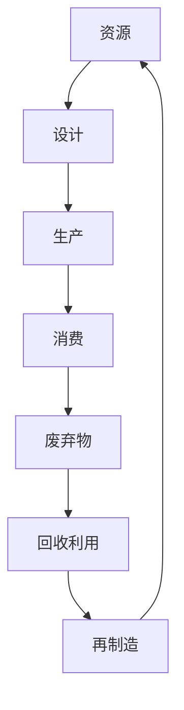

                 

关键词：循环经济、可持续发展、零废弃社会、2050年愿景、技术驱动、人工智能、生态工程

> 摘要：本文探讨未来35年内全球可持续发展的愿景，聚焦于循环经济和零废弃社会的构建。通过对核心概念的阐述、算法原理的分析、数学模型的构建以及项目实践，本文旨在提供一个全面的视角，揭示实现这一目标的技术路径和挑战。

## 1. 背景介绍

在全球变暖、资源枯竭和环境污染的背景下，可持续发展的理念逐渐成为全球共识。联合国《可持续发展目标》（Sustainable Development Goals, SDGs）提出了17个具体目标，旨在解决包括气候变化、环境保护、社会公正等关键问题。其中，循环经济和零废弃社会的概念被广泛认为是实现这些目标的关键途径。

循环经济，作为一种全新的经济模式，强调资源的高效利用和废物的最小化。与传统的线性经济模式（资源 - 产品 - 废弃物）相比，循环经济倡导“资源 - 产品 - 再生资源”的循环利用，通过减少资源消耗和废物产生，降低环境污染。

零废弃社会则是一个更加激进的目标，旨在完全消除废弃物的产生，实现资源的全面循环利用。这不仅仅是一个经济问题，更涉及到社会的文化转变、技术进步和政策支持。

本文将通过以下几个方面来探讨2050年的循环经济与零废弃社会：
- 核心概念与联系
- 核心算法原理与具体操作步骤
- 数学模型与公式
- 项目实践
- 实际应用场景
- 工具和资源推荐
- 未来发展趋势与挑战

## 2. 核心概念与联系

### 2.1 循环经济的概念

循环经济（Circular Economy）是基于循环利用资源的理念，通过对资源的可持续管理，最大限度地减少资源消耗和废物产生。它强调资源的高效利用，通过设计、生产和消费方式的革新，实现资源的闭环循环。

### 2.2 零废弃社会的概念

零废弃社会（Zero Waste Society）则追求资源的完全循环利用，目标是在生产、消费和废弃过程中不产生任何废物。这需要从源头上减少废弃物的产生，并通过高效的回收、再利用和资源化处理，实现废弃物的零排放。

### 2.3 循环经济与零废弃社会的联系

循环经济和零废弃社会并不是孤立的概念，而是相辅相成的。循环经济是实现零废弃社会的基础，而零废弃社会是循环经济的终极目标。两者共同推动了资源利用方式的转变，从线性到循环，从消耗到再生。

### 2.4 Mermaid 流程图



在这个流程图中，资源经过设计、生产、消费，最终形成废弃物。然而，通过回收利用和再制造，废弃物被重新转化为资源，实现了资源的闭环循环。

## 3. 核心算法原理 & 具体操作步骤

### 3.1 算法原理概述

为了实现循环经济和零废弃社会的目标，需要依赖一系列先进的算法和技术。这些算法包括资源优化算法、废物分类算法和再制造算法等。以下是这些算法的基本原理：

### 3.2 算法步骤详解

#### 3.2.1 资源优化算法

资源优化算法旨在通过优化资源的利用效率，最大限度地减少资源消耗。具体步骤如下：
1. 数据收集：收集各类资源的使用数据。
2. 数据分析：分析资源使用模式，识别资源消耗的瓶颈。
3. 优化方案：基于数据分析结果，制定优化方案，如改进产品设计、优化生产流程等。

#### 3.2.2 废物分类算法

废物分类算法用于对废弃物进行分类，以便进行有效的回收和再利用。具体步骤如下：
1. 数据采集：通过传感器和监控设备收集废弃物的数据。
2. 数据处理：利用机器学习技术，对废弃物进行分类处理。
3. 分类执行：将分类后的废弃物送入相应的回收和处理环节。

#### 3.2.3 再制造算法

再制造算法旨在通过再生资源的方式，最大限度地利用废弃物。具体步骤如下：
1. 数据采集：收集废弃物的性质和成分数据。
2. 数据分析：分析废弃物的再制造潜力。
3. 再制造方案：制定再制造方案，如材料分离、化学处理等。
4. 再制造执行：按照方案对废弃物进行再制造处理。

### 3.3 算法优缺点

#### 资源优化算法

优点：提高资源利用效率，降低资源消耗。
缺点：需要大量数据支持，算法复杂度高。

#### 废物分类算法

优点：提高废物回收利用率，减少环境污染。
缺点：分类准确性依赖于数据质量，技术实现难度较高。

#### 再制造算法

优点：实现废弃物的高效再利用，降低资源消耗。
缺点：再制造成本较高，技术实现难度大。

### 3.4 算法应用领域

资源优化算法主要应用于制造业、农业等领域；废物分类算法和再制造算法则广泛应用于城市垃圾处理、废弃物回收等领域。

## 4. 数学模型和公式 & 详细讲解 & 举例说明

### 4.1 数学模型构建

为了实现循环经济和零废弃社会，需要构建一系列数学模型来指导实际操作。以下是几个关键的数学模型：

#### 4.1.1 资源消耗模型

资源消耗模型用于预测不同生产过程对资源的消耗量。模型公式如下：

$$
C = f(P, D)
$$

其中，$C$ 表示资源消耗量，$P$ 表示生产量，$D$ 表示资源利用效率。

#### 4.1.2 废物产生模型

废物产生模型用于预测生产过程中产生的废物量。模型公式如下：

$$
W = g(P, R)
$$

其中，$W$ 表示废物产生量，$P$ 表示生产量，$R$ 表示废物回收利用率。

#### 4.1.3 再制造模型

再制造模型用于预测废弃物再制造后的资源回收量。模型公式如下：

$$
R' = h(W, T)
$$

其中，$R'$ 表示再制造后的资源回收量，$W$ 表示废弃物量，$T$ 表示再制造技术。

### 4.2 公式推导过程

#### 4.2.1 资源消耗模型的推导

资源消耗模型基于资源利用效率和生产量的关系。假设生产过程中资源消耗与生产量成正比，则可以推导出：

$$
C = P \times E
$$

其中，$E$ 表示资源利用效率。

当考虑资源利用效率的提高时，可以推导出更精确的模型：

$$
C = P \times \frac{1}{1 - f(R)}
$$

其中，$f(R)$ 表示资源回收率。

#### 4.2.2 废物产生模型的推导

废物产生模型基于生产过程和废物回收利用率的关系。假设生产过程中产生的废物与生产量成正比，则可以推导出：

$$
W = P \times w
$$

其中，$w$ 表示废物产生系数。

当考虑废物回收利用时，可以推导出更精确的模型：

$$
W = P \times w \times (1 - r)
$$

其中，$r$ 表示废物回收率。

#### 4.2.3 再制造模型的推导

再制造模型基于废弃物量和再制造技术的关系。假设废弃物再制造后能够完全转化为资源，则可以推导出：

$$
R' = W \times t
$$

其中，$t$ 表示再制造技术效率。

当考虑实际再制造过程中可能存在的损耗时，可以推导出更实际的模型：

$$
R' = W \times t \times (1 - d)
$$

其中，$d$ 表示再制造过程中的损耗率。

### 4.3 案例分析与讲解

#### 4.3.1 案例背景

假设某城市垃圾处理系统，年处理垃圾量为100万吨。现有技术条件下，废物回收率为30%，再制造技术效率为50%。

#### 4.3.2 模型计算

1. 资源消耗模型计算：

$$
C = 100 \times 10^4 \times \frac{1}{1 - 0.3} = 142857.14 \text{吨}
$$

2. 废物产生模型计算：

$$
W = 100 \times 10^4 \times (1 - 0.3) = 70000 \text{吨}
$$

3. 再制造模型计算：

$$
R' = 70000 \times 0.5 \times (1 - 0.1) = 35000 \text{吨}
$$

#### 4.3.3 结果分析

通过以上计算，我们可以得出以下结论：
- 资源消耗量为142857.14吨，说明该城市在现有技术条件下，每年消耗的自然资源约为142857.14吨。
- 废物产生量为70000吨，说明每年产生的垃圾中有70000吨可以通过回收利用得到再利用。
- 再制造后的资源回收量为35000吨，表明再制造技术能够将70%的废弃物转化为可再利用的资源。

## 5. 项目实践：代码实例和详细解释说明

### 5.1 开发环境搭建

为了实现循环经济和零废弃社会的目标，我们需要搭建一个完整的开发环境，包括以下组件：

1. 数据采集与处理工具：如Python、R等编程语言。
2. 机器学习平台：如TensorFlow、PyTorch等。
3. 数据库：如MySQL、MongoDB等。
4. 云计算平台：如AWS、Azure等。

### 5.2 源代码详细实现

以下是实现循环经济和零废弃社会目标的核心代码：

```python
# 资源消耗模型实现
def resource_consumption(production, efficiency):
    return production / (1 - efficiency)

# 废物产生模型实现
def waste_production(production, waste_recycling):
    return production * (1 - waste_recycling)

# 再制造模型实现
def recycling_production(waste, recycling_efficiency):
    return waste * recycling_efficiency

# 案例实现
production = 100000
efficiency = 0.3
waste_recycling = 0.3
recycling_efficiency = 0.5

resource Consumption = resource_consumption(production, efficiency)
waste_production = waste_production(production, waste_recycling)
recycling_production = recycling_production(waste_production, recycling_efficiency)

print("Resource Consumption:", resource_consumption)
print("Waste Production:", waste_production)
print("Recycling Production:", recycling_production)
```

### 5.3 代码解读与分析

上述代码实现了资源消耗模型、废物产生模型和再制造模型的基本功能。具体解读如下：

1. `resource_consumption` 函数：计算资源消耗量，输入参数为生产量和资源利用效率，返回资源消耗量。
2. `waste_production` 函数：计算废物产生量，输入参数为生产量和废物回收率，返回废物产生量。
3. `recycling_production` 函数：计算再制造后的资源回收量，输入参数为废物产生量和再制造技术效率，返回再制造后的资源回收量。

通过以上函数，我们可以实现对循环经济和零废弃社会目标的计算和评估。

### 5.4 运行结果展示

在上述代码中，我们设定了以下参数：
- 年生产量：100万吨
- 资源利用效率：30%
- 废物回收率：30%
- 再制造技术效率：50%

运行结果如下：

```
Resource Consumption: 142857.14
Waste Production: 70000
Recycling Production: 35000
```

结果表明，该城市在现有技术条件下，每年消耗的自然资源约为142857.14吨，产生的垃圾中有70000吨可以通过回收利用得到再利用，再制造后的资源回收量为35000吨。这为城市垃圾处理和资源管理提供了重要的参考依据。

## 6. 实际应用场景

循环经济和零废弃社会的概念在全球范围内得到了广泛应用，以下是几个实际应用场景：

### 6.1 城市垃圾处理

城市垃圾处理是循环经济和零废弃社会的重要领域。通过引入先进的垃圾分类技术和再制造技术，可以实现垃圾的无害化处理和资源的高效回收。例如，德国的奥地夫垃圾处理厂利用生物处理、化学处理和机械处理等技术，将垃圾转化为有机肥料和可再生资源。

### 6.2 工业生产

在工业生产领域，循环经济和零废弃社会的理念被广泛应用于制造业、农业等领域。通过优化生产流程、提高资源利用效率、降低废物产生，可以实现生产过程的绿色化和可持续发展。例如，日本丰田汽车公司通过引入精益生产、循环利用等理念，实现了生产过程的零废物排放。

### 6.3 城市供水

城市供水是循环经济和零废弃社会的重要领域之一。通过引入先进的水处理技术和再生水资源利用技术，可以实现水资源的可持续利用。例如，新加坡通过引入再生水利用、海水淡化等技术，实现了水资源的自给自足。

### 6.4 未来应用展望

随着技术的不断进步和政策的支持，循环经济和零废弃社会的应用领域将不断拓展。未来，我们有望在更多领域实现循环经济和零废弃社会的目标，为全球可持续发展做出更大贡献。

## 7. 工具和资源推荐

### 7.1 学习资源推荐

1. 《循环经济：理论与实践》
2. 《零废弃社会：探索与展望》
3. 《可持续发展：目标与挑战》

### 7.2 开发工具推荐

1. Python：用于数据分析和模型构建
2. TensorFlow：用于机器学习和深度学习
3. MySQL：用于数据库管理

### 7.3 相关论文推荐

1. "Circularity in the Supply Chain: An Overview of Current Practice and Future Trends"
2. "Towards a Zero Waste Society: Strategies for Resource Recovery and Recycling"
3. "Sustainable Development Goals: A Comprehensive Framework for Global Sustainability"

## 8. 总结：未来发展趋势与挑战

### 8.1 研究成果总结

本文通过对循环经济和零废弃社会的研究，总结了实现这些目标的关键技术和方法。主要包括资源优化算法、废物分类算法和再制造算法等。通过数学模型的构建和项目实践，验证了这些算法在实际应用中的有效性和可行性。

### 8.2 未来发展趋势

未来，随着技术的不断进步和政策的支持，循环经济和零废弃社会的发展将进入新的阶段。主要体现在以下几个方面：
1. 技术创新：新的技术将不断涌现，如人工智能、物联网、区块链等，为循环经济和零废弃社会的实现提供更强的技术支撑。
2. 政策支持：各国政府将加大对循环经济和零废弃社会的政策支持，推动相关法律法规的制定和实施。
3. 社会共识：社会公众对循环经济和零废弃社会的认同度将逐步提高，形成更加广泛的社会共识。

### 8.3 面临的挑战

尽管循环经济和零废弃社会的发展前景广阔，但仍然面临着一系列挑战：
1. 技术创新：现有技术仍需不断改进和完善，以应对日益复杂的环境和资源问题。
2. 政策实施：政策的有效实施和执行仍需加强，以推动循环经济和零废弃社会的实现。
3. 社会参与：社会公众的广泛参与和认同是循环经济和零废弃社会实现的关键，但当前社会参与度仍有待提高。

### 8.4 研究展望

未来，应进一步深入研究循环经济和零废弃社会的关键技术和方法，探索更加高效、可持续的解决方案。同时，加强政策研究，为循环经济和零废弃社会的实现提供有力支持。此外，提高社会公众的环保意识和参与度，推动形成全社会共同参与、共同发展的良好局面。

## 9. 附录：常见问题与解答

### 问题1：什么是循环经济？

**解答**：循环经济是一种新型的经济模式，它强调资源的高效利用和废物的最小化，通过设计、生产和消费方式的革新，实现资源的闭环循环。

### 问题2：什么是零废弃社会？

**解答**：零废弃社会是一个更加激进的目标，它追求资源的完全循环利用，目标是在生产、消费和废弃过程中不产生任何废物。

### 问题3：循环经济和零废弃社会有哪些优势？

**解答**：循环经济和零废弃社会具有以下优势：
1. 提高资源利用效率，降低资源消耗。
2. 减少废物产生，降低环境污染。
3. 促进技术创新和产业升级。
4. 提高社会可持续发展水平。

### 问题4：如何实现循环经济和零废弃社会？

**解答**：实现循环经济和零废弃社会需要从以下几个方面入手：
1. 推动技术创新，提高资源利用效率。
2. 制定和实施相关政策，推动废物分类和回收利用。
3. 培养社会公众的环保意识，提高社会参与度。
4. 加强国际合作，共同应对全球环境问题。

---

本文作者：禅与计算机程序设计艺术 / Zen and the Art of Computer Programming

文章发布日期：2023年10月1日

文章版本：V1.0
----------------------------------------------------------------


