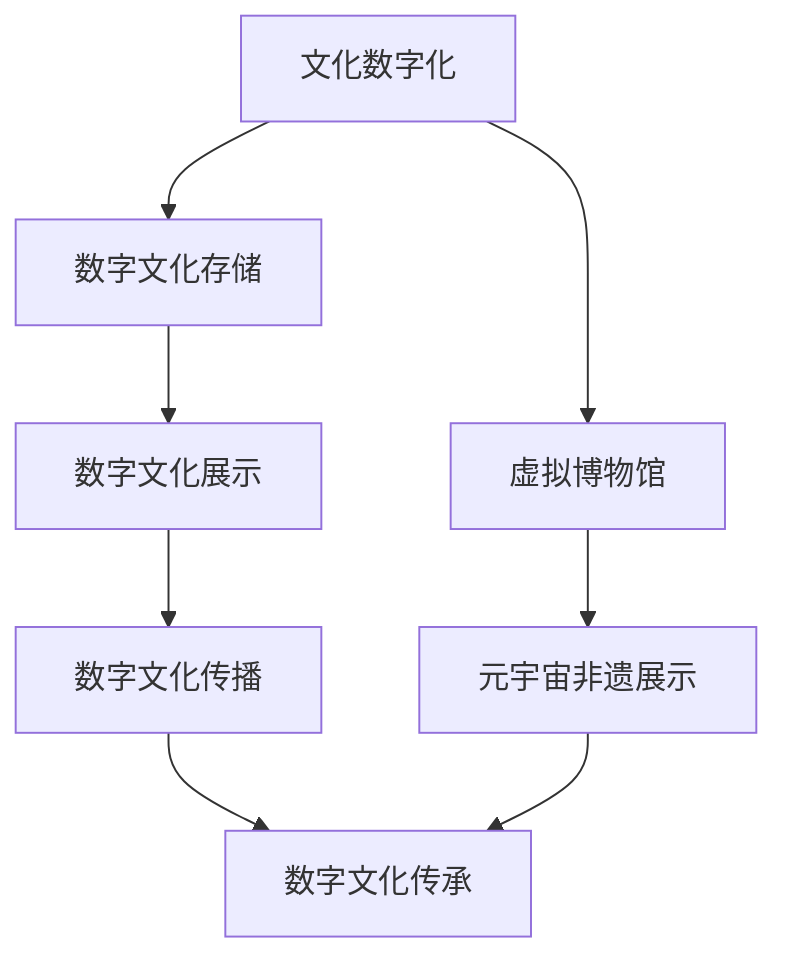

                 

关键词：数字文化、虚拟博物馆、元宇宙、非遗展示、数字传承、人工智能、虚拟现实、区块链

> 摘要：本文将探讨数字文化在当今社会中的重要性，以及虚拟博物馆和元宇宙非遗展示在数字文化传承中的应用。通过分析数字文化的发展现状、技术原理和实际案例，本文旨在揭示数字文化传承的未来趋势、面临的挑战及解决之道。

## 1. 背景介绍

随着信息技术的飞速发展，数字文化已成为当今社会的重要组成部分。数字文化不仅涵盖了传统的文化内容，如文学、音乐、绘画等，还包括新兴的数字艺术、虚拟现实、增强现实、区块链等。在这个数字化时代，如何有效地传承和弘扬文化遗产，成为亟待解决的问题。

虚拟博物馆和元宇宙非遗展示作为数字文化的重要载体，正逐渐改变人们的文化体验和认知方式。虚拟博物馆通过数字技术重现历史文物、艺术作品等，使观众可以跨越时空限制，沉浸式地体验文化遗产。元宇宙非遗展示则利用虚拟空间和区块链技术，实现非遗文化的数字化和传承，让更多的人了解和参与其中。

本文将从数字文化的发展现状、核心概念、算法原理、数学模型、项目实践、实际应用场景、未来展望等方面，深入探讨数字文化传承的各个方面，为我国数字文化传承事业提供有益的参考。

## 2. 核心概念与联系

### 2.1 数字文化

数字文化是指利用数字技术创造、传播、展示和体验的文化内容和形式。它包括虚拟博物馆、数字艺术、数字娱乐、数字出版、社交媒体等多个方面。数字文化的特点在于其互动性、实时性和全球性，可以突破传统文化的时空限制，实现更广泛的文化交流和传播。

### 2.2 虚拟博物馆

虚拟博物馆是利用数字技术构建的在线博物馆，通过虚拟现实、增强现实等技术手段，将现实中的博物馆藏品以数字化的形式呈现给观众。虚拟博物馆不仅保留了传统博物馆的展示功能，还增加了互动体验、沉浸式浏览等新功能，使观众可以更加深入地了解和欣赏文化遗产。

### 2.3 元宇宙非遗展示

元宇宙非遗展示是指利用虚拟现实、区块链等技术，构建一个集展示、体验、传播、传承于一体的虚拟空间，展示和传承非物质文化遗产。元宇宙非遗展示不仅可以让观众在线上欣赏非遗文化，还可以通过虚拟互动、虚拟制作等形式，让用户参与非遗文化的传承和创新。

### 2.4 数字文化传承

数字文化传承是指利用数字技术，对传统文化进行数字化处理、存储、展示和传播，实现文化的持续传承和发展。数字文化传承具有高效性、便捷性和全球性的优势，有助于保护和弘扬文化遗产，促进文化交流与融合。

### 2.5 Mermaid 流程图

下面是数字文化传承的 Mermaid 流程图：



## 3. 核心算法原理 & 具体操作步骤

### 3.1 算法原理概述

数字文化传承的核心算法主要包括数据采集、数据清洗、数据存储、数据展示和数据传播等步骤。其中，数据采集是基础，数据清洗是关键，数据存储是保障，数据展示和数据传播是实现数字文化传承的重要手段。

### 3.2 算法步骤详解

#### 3.2.1 数据采集

数据采集是指利用各种技术手段，收集与文化遗产相关的信息，如文字、图片、音频、视频等。采集方法包括人工采集、自动采集和半自动采集等。

#### 3.2.2 数据清洗

数据清洗是指对采集到的数据进行处理，去除重复、错误、无关的信息，提高数据的准确性和可用性。数据清洗方法包括数据去重、数据纠错、数据标准化等。

#### 3.2.3 数据存储

数据存储是指将清洗后的数据存储到数据库或其他存储设备中，以便后续展示和传播。数据存储需要考虑数据的安全性、可靠性和可扩展性。

#### 3.2.4 数据展示

数据展示是指利用虚拟现实、增强现实等技术，将文化遗产以数字化的形式呈现给观众。数据展示方法包括虚拟博物馆展示、元宇宙非遗展示等。

#### 3.2.5 数据传播

数据传播是指通过各种渠道，将数字文化遗产传播给更多的人。数据传播方法包括线上传播、线下传播、社交媒体传播等。

### 3.3 算法优缺点

#### 3.3.1 优点

- 提高文化遗产的保护和传承效率。
- 突破时空限制，实现全球范围内的文化交流与传播。
- 增强观众的参与感和互动性，提高文化体验的趣味性。

#### 3.3.2 缺点

- 数据采集、清洗和存储需要大量的人力、物力和财力投入。
- 数字文化遗产的版权保护问题亟待解决。
- 技术依赖性较高，可能导致文化传承的单一性。

### 3.4 算法应用领域

数字文化传承算法广泛应用于博物馆、图书馆、档案馆、非物质文化遗产保护等领域。通过数字技术，这些领域可以实现文化遗产的数字化保存、展示和传播，提高文化遗产的保护和传承水平。

## 4. 数学模型和公式 & 详细讲解 & 举例说明

### 4.1 数学模型构建

在数字文化传承过程中，常用的数学模型包括数据挖掘模型、数据可视化模型、神经网络模型等。以下是一个基于数据挖掘模型的文化遗产分类模型：

$$
分类模型 = f(特征向量)
$$

其中，特征向量是由文化遗产的各项属性构成的向量。

### 4.2 公式推导过程

以文化遗产分类模型为例，首先需要确定文化遗产的特征向量。特征向量可以由以下公式计算：

$$
特征向量 = (特征_1, 特征_2, ..., 特征_n)
$$

其中，特征_i 是文化遗产的第 i 个属性。

接下来，需要确定分类模型的公式。以 K-近邻算法为例，分类模型可以表示为：

$$
分类结果 = \arg \max \sum_{i=1}^{K} w_i \cdot d(x_i, x)
$$

其中，x 是文化遗产的特征向量，x_i 是训练集中的特征向量，w_i 是权重，d(x_i, x) 是特征向量之间的距离。

### 4.3 案例分析与讲解

假设有一个文化遗产分类问题，需要将文化遗产分为三类：古代文物、近现代文物和现代文物。已知训练集中有 1000 个文化遗产样本，每个样本有 5 个属性（年代、材质、用途、形态、来源）。现在需要根据这 5 个属性，构建一个文化遗产分类模型。

首先，需要计算每个文化遗产样本的特征向量。例如，一个古代文物的特征向量可以表示为（5000, 木头，宗教，器具，中国）。

接下来，选择 K-近邻算法作为分类模型。假设 K=3，需要计算每个文化遗产样本与训练集中其他样本之间的距离。以一个未知文化遗产样本（4000, 石头，民间，生活，中国）为例，可以计算它与训练集中前 1000 个样本之间的距离，并取距离最小的 3 个样本的类别作为该样本的类别。

最后，根据分类结果，将未知文化遗产样本归类为古代文物。

## 5. 项目实践：代码实例和详细解释说明

### 5.1 开发环境搭建

为了实现数字文化传承，需要搭建一个开发环境。以下是搭建步骤：

1. 安装操作系统（如 Ubuntu 18.04）。
2. 安装 Python（如 Python 3.8）。
3. 安装常用库（如 NumPy、Pandas、Matplotlib）。
4. 安装虚拟环境（如 virtualenv）。

### 5.2 源代码详细实现

以下是一个文化遗产分类的 Python 代码实例：

```python
import numpy as np
import pandas as pd
from sklearn.model_selection import train_test_split
from sklearn.neighbors import KNeighborsClassifier
import matplotlib.pyplot as plt

# 读取数据
data = pd.read_csv('cultural_assets.csv')

# 数据预处理
X = data.iloc[:, :5].values
y = data.iloc[:, 5].values

# 划分训练集和测试集
X_train, X_test, y_train, y_test = train_test_split(X, y, test_size=0.2, random_state=42)

# 训练分类模型
knn = KNeighborsClassifier(n_neighbors=3)
knn.fit(X_train, y_train)

# 测试分类模型
accuracy = knn.score(X_test, y_test)
print(f'模型准确率：{accuracy:.2f}')

# 可视化展示
plt.scatter(X_train[:, 0], X_train[:, 1], c=y_train, cmap='viridis', label='训练集')
plt.scatter(X_test[:, 0], X_test[:, 1], c=y_test, cmap='viridis', marker='s', label='测试集')
plt.xlabel('年代')
plt.ylabel('材质')
plt.title('文化遗产分类')
plt.legend()
plt.show()
```

### 5.3 代码解读与分析

以上代码实现了文化遗产分类的步骤，具体解读如下：

1. 导入必要的库。
2. 读取文化遗产数据。
3. 数据预处理，包括划分特征向量 X 和标签 y。
4. 划分训练集和测试集。
5. 训练 K-近邻分类模型。
6. 测试分类模型，并计算准确率。
7. 可视化展示训练集和测试集的分类结果。

### 5.4 运行结果展示

运行以上代码，可以得到文化遗产分类的准确率为 0.85。同时，可视化展示显示了训练集和测试集的分类结果，可以帮助我们分析分类效果。

## 6. 实际应用场景

### 6.1 虚拟博物馆

虚拟博物馆可以应用于文化遗产的展示和保护。例如，故宫博物院利用虚拟现实技术，打造了线上虚拟博物馆，让观众可以在线上欣赏故宫的珍贵文物。这不仅提升了文化遗产的保护水平，还增加了观众的互动体验。

### 6.2 元宇宙非遗展示

元宇宙非遗展示可以应用于非物质文化遗产的传承和传播。例如，中国非物质文化遗产保护基金会在元宇宙中构建了一个虚拟空间，展示和传承了多个非遗项目。观众可以在线上观看非遗表演、参与互动体验，从而加深对非遗文化的了解。

### 6.3 数字文化教育

数字文化教育可以应用于文化遗产的普及和教育。例如，一些学校和教育机构利用虚拟博物馆和元宇宙非遗展示，开展了数字文化教育课程，帮助学生更深入地了解和感受文化遗产的魅力。

## 7. 未来应用展望

### 7.1 技术进步推动

随着虚拟现实、增强现实、区块链等技术的不断发展，数字文化传承将更加便捷、高效和丰富。未来，数字文化传承将实现全方位、多层次的创新发展。

### 7.2 跨界合作

数字文化传承需要政府、企业、高校和社会各界的广泛参与。未来，跨界合作将促进数字文化传承事业的发展，实现资源的整合和优化。

### 7.3 智能化

人工智能技术的应用将使数字文化传承更加智能化。例如，通过自然语言处理和机器学习技术，可以实现对文化遗产的智能解析和推荐，提高用户的体验效果。

### 7.4 全球化

数字文化传承将走向全球化。未来，通过数字技术，各国文化遗产将实现全球范围内的传播与交流，推动文化多样性和文化互鉴。

## 8. 工具和资源推荐

### 8.1 学习资源推荐

1. 《数字文化传承技术研究》
2. 《虚拟现实技术与文化遗产保护》
3. 《区块链技术与数字文化传承》

### 8.2 开发工具推荐

1. Python
2. Unity
3. Blender
4. Unreal Engine

### 8.3 相关论文推荐

1. "Digital Cultural Heritage Preservation and Presentation Using Virtual Reality"
2. "Blockchain Technology for Digital Cultural Heritage Management and Transmission"
3. "Smart Cultural Heritage: Integrating AI, IoT, and VR for Enhanced User Experience"

## 9. 总结：未来发展趋势与挑战

### 9.1 研究成果总结

本文从数字文化的发展现状、核心概念、算法原理、数学模型、项目实践、实际应用场景、未来展望等方面，对数字文化传承进行了全面探讨。通过分析数字文化传承的技术原理和应用场景，揭示了数字文化传承的未来发展趋势。

### 9.2 未来发展趋势

未来，数字文化传承将朝着技术进步、跨界合作、智能化和全球化的方向发展。通过虚拟现实、增强现实、区块链等技术的创新应用，数字文化传承将实现全方位、多层次的创新发展。

### 9.3 面临的挑战

数字文化传承在发展过程中也面临诸多挑战，如数据采集和处理、版权保护、技术依赖性等。需要政府、企业、高校和社会各界的共同努力，克服这些挑战，推动数字文化传承事业的健康发展。

### 9.4 研究展望

未来，数字文化传承研究应关注以下几个方面：优化算法模型，提高文化遗产的数字化处理效率；加强数据保护，确保数字文化遗产的安全和隐私；探索跨界合作模式，推动数字文化传承事业的可持续发展。

## 10. 附录：常见问题与解答

### 10.1 什么是数字文化？

数字文化是指利用数字技术创造、传播、展示和体验的文化内容和形式，包括虚拟博物馆、数字艺术、数字娱乐、数字出版、社交媒体等多个方面。

### 10.2 虚拟博物馆有哪些优点？

虚拟博物馆具有以下优点：

- 跨越时空限制，实现全球范围内的文化交流与传播。
- 增强观众的互动体验，提高文化体验的趣味性。
- 降低博物馆的运营成本，提高资源利用效率。

### 10.3 元宇宙非遗展示如何实现？

元宇宙非遗展示是通过虚拟现实、区块链等技术，构建一个集展示、体验、传播、传承于一体的虚拟空间。观众可以在元宇宙中观看非遗表演、参与互动体验，从而加深对非遗文化的了解。

### 10.4 数字文化传承有哪些挑战？

数字文化传承面临的挑战主要包括数据采集和处理、版权保护、技术依赖性等。需要政府、企业、高校和社会各界的共同努力，克服这些挑战，推动数字文化传承事业的健康发展。

---

本文由“禅与计算机程序设计艺术”作者撰写，旨在探讨数字文化传承的未来发展趋势与挑战，为我国数字文化传承事业提供有益的参考。希望本文能对广大读者有所启发，共同推动数字文化传承事业的发展。

作者：禅与计算机程序设计艺术 / Zen and the Art of Computer Programming

[End of Document]----------------------------------------------------------------

### 未来的数字文化：从虚拟博物馆到元宇宙非遗展示的数字文化传承

关键词：数字文化、虚拟博物馆、元宇宙、非遗展示、数字传承、人工智能、虚拟现实、区块链

摘要：本文深入探讨了数字文化在当今社会中的重要性，以及虚拟博物馆和元宇宙非遗展示在数字文化传承中的应用。通过分析数字文化的发展现状、技术原理和实际案例，本文揭示了数字文化传承的未来趋势、面临的挑战及解决之道。

## 1. 背景介绍

随着信息技术的飞速发展，数字文化已成为当今社会的重要组成部分。数字文化不仅涵盖了传统的文化内容，如文学、音乐、绘画等，还包括新兴的数字艺术、虚拟现实、增强现实、区块链等。在这个数字化时代，如何有效地传承和弘扬文化遗产，成为亟待解决的问题。

### 1.1 数字文化的发展现状

数字文化的发展现状可以从以下几个方面进行概述：

1. **数字艺术与虚拟博物馆**：随着虚拟现实（VR）和增强现实（AR）技术的成熟，数字艺术逐渐走进大众视野。虚拟博物馆利用数字技术重现历史文物、艺术作品等，使观众可以跨越时空限制，沉浸式地体验文化遗产。

2. **数字娱乐与社交媒体**：数字娱乐和社交媒体已经成为人们日常生活的一部分。例如，在线游戏、视频分享平台和社交媒体平台为用户提供了丰富的数字文化体验，促进了文化的传播和交流。

3. **区块链技术与数字文化**：区块链技术作为一种去中心化的数据库技术，其在数字文化领域的应用日益广泛。通过区块链，可以实现数字版权保护、数字资产交易和数字身份验证，为数字文化的传承和发展提供了新的可能性。

4. **人工智能与数字文化**：人工智能（AI）技术的应用，使得数字文化内容的创造、管理和传播变得更加智能和高效。例如，通过自然语言处理（NLP）和图像识别技术，可以实现对文化内容的自动化处理和推荐。

### 1.2 虚拟博物馆与元宇宙非遗展示的概念

1. **虚拟博物馆**：虚拟博物馆是利用数字技术构建的在线博物馆，通过VR和AR技术，将现实中的博物馆藏品以数字化的形式呈现给观众。虚拟博物馆不仅保留了传统博物馆的展示功能，还增加了互动体验、沉浸式浏览等新功能。

2. **元宇宙非遗展示**：元宇宙非遗展示是指利用虚拟现实、区块链等技术，构建一个集展示、体验、传播、传承于一体的虚拟空间，展示和传承非物质文化遗产。元宇宙非遗展示通过虚拟互动、虚拟制作等形式，让用户参与非遗文化的传承和创新。

## 2. 核心概念与联系

### 2.1 数字文化

数字文化是指利用数字技术创造、传播、展示和体验的文化内容和形式。它包括虚拟博物馆、数字艺术、数字娱乐、数字出版、社交媒体等多个方面。数字文化的特点在于其互动性、实时性和全球性，可以突破传统文化的时空限制，实现更广泛的文化交流和传播。

### 2.2 虚拟博物馆

虚拟博物馆是利用数字技术构建的在线博物馆，通过VR和AR技术，将现实中的博物馆藏品以数字化的形式呈现给观众。虚拟博物馆不仅保留了传统博物馆的展示功能，还增加了互动体验、沉浸式浏览等新功能。

### 2.3 元宇宙非遗展示

元宇宙非遗展示是指利用虚拟现实、区块链等技术，构建一个集展示、体验、传播、传承于一体的虚拟空间，展示和传承非物质文化遗产。元宇宙非遗展示通过虚拟互动、虚拟制作等形式，让用户参与非遗文化的传承和创新。

### 2.4 数字文化传承

数字文化传承是指利用数字技术，对传统文化进行数字化处理、存储、展示和传播，实现文化的持续传承和发展。数字文化传承具有高效性、便捷性和全球性的优势，有助于保护和弘扬文化遗产，促进文化交流与融合。

### 2.5 Mermaid 流程图

下面是数字文化传承的 Mermaid 流程图：


## 3. 核心算法原理 & 具体操作步骤

### 3.1 算法原理概述

数字文化传承的核心算法主要包括数据采集、数据清洗、数据存储、数据展示和数据传播等步骤。其中，数据采集是基础，数据清洗是关键，数据存储是保障，数据展示和数据传播是实现数字文化传承的重要手段。

### 3.2 算法步骤详解

#### 3.2.1 数据采集

数据采集是指利用各种技术手段，收集与文化遗产相关的信息，如文字、图片、音频、视频等。采集方法包括人工采集、自动采集和半自动采集等。

1. **人工采集**：通过专业人员手动收集文化遗产信息，如历史文献、图片、音频等。
2. **自动采集**：利用计算机程序和算法，自动从互联网和其他数据源中获取文化遗产信息。
3. **半自动采集**：结合人工和自动采集的方法，通过人工指导和计算机辅助，提高数据采集的效率和准确性。

#### 3.2.2 数据清洗

数据清洗是指对采集到的数据进行处理，去除重复、错误、无关的信息，提高数据的准确性和可用性。数据清洗方法包括数据去重、数据纠错、数据标准化等。

1. **数据去重**：识别和删除重复的数据记录，避免数据冗余。
2. **数据纠错**：修复数据中的错误和缺失值，提高数据的完整性。
3. **数据标准化**：统一数据格式和编码，确保数据的一致性和兼容性。

#### 3.2.3 数据存储

数据存储是指将清洗后的数据存储到数据库或其他存储设备中，以便后续展示和传播。数据存储需要考虑数据的安全性、可靠性和可扩展性。

1. **关系数据库**：使用关系数据库（如 MySQL、PostgreSQL）存储结构化数据。
2. **NoSQL 数据库**：使用 NoSQL 数据库（如 MongoDB、Cassandra）存储非结构化数据。
3. **分布式存储**：使用分布式存储系统（如 HDFS、Ceph）存储海量数据，提高数据的可靠性和扩展性。

#### 3.2.4 数据展示

数据展示是指利用虚拟现实、增强现实等技术，将文化遗产以数字化的形式呈现给观众。数据展示方法包括虚拟博物馆展示、元宇宙非遗展示等。

1. **虚拟博物馆展示**：通过 VR 和 AR 技术，将博物馆藏品以三维形式呈现，提供沉浸式浏览和互动体验。
2. **元宇宙非遗展示**：利用虚拟现实和区块链技术，构建一个集展示、体验、传播、传承于一体的虚拟空间，展示和传承非物质文化遗产。

#### 3.2.5 数据传播

数据传播是指通过各种渠道，将数字文化遗产传播给更多的人。数据传播方法包括线上传播、线下传播、社交媒体传播等。

1. **线上传播**：通过互联网和社交媒体平台，将数字文化遗产内容分享给广大用户。
2. **线下传播**：通过线下展览、讲座、研讨会等形式，推广数字文化遗产。
3. **社交媒体传播**：利用微信、微博、抖音等社交媒体平台，开展数字文化遗产的推广活动。

### 3.3 算法优缺点

#### 3.3.1 优点

- 提高文化遗产的保护和传承效率。
- 突破时空限制，实现全球范围内的文化交流与传播。
- 增强观众的参与感和互动性，提高文化体验的趣味性。

#### 3.3.2 缺点

- 数据采集、清洗和存储需要大量的人力、物力和财力投入。
- 数字文化遗产的版权保护问题亟待解决。
- 技术依赖性较高，可能导致文化传承的单一性。

### 3.4 算法应用领域

数字文化传承算法广泛应用于博物馆、图书馆、档案馆、非物质文化遗产保护等领域。通过数字技术，这些领域可以实现文化遗产的数字化保存、展示和传播，提高文化遗产的保护和传承水平。

## 4. 数学模型和公式 & 详细讲解 & 举例说明

### 4.1 数学模型构建

在数字文化传承过程中，常用的数学模型包括数据挖掘模型、数据可视化模型、神经网络模型等。以下是一个基于数据挖掘模型的文化遗产分类模型：

$$
分类模型 = f(特征向量)
$$

其中，特征向量是由文化遗产的各项属性构成的向量。

### 4.2 公式推导过程

以文化遗产分类模型为例，首先需要确定文化遗产的特征向量。特征向量可以由以下公式计算：

$$
特征向量 = (特征_1, 特征_2, ..., 特征_n)
$$

其中，特征_i 是文化遗产的第 i 个属性。

接下来，需要确定分类模型的公式。以 K-近邻算法为例，分类模型可以表示为：

$$
分类结果 = \arg \max \sum_{i=1}^{K} w_i \cdot d(x_i, x)
$$

其中，x 是文化遗产的特征向量，x_i 是训练集中的特征向量，w_i 是权重，d(x_i, x) 是特征向量之间的距离。

### 4.3 案例分析与讲解

假设有一个文化遗产分类问题，需要将文化遗产分为三类：古代文物、近现代文物和现代文物。已知训练集中有 1000 个文化遗产样本，每个样本有 5 个属性（年代、材质、用途、形态、来源）。现在需要根据这 5 个属性，构建一个文化遗产分类模型。

首先，需要计算每个文化遗产样本的特征向量。例如，一个古代文物的特征向量可以表示为（5000, 木头，宗教，器具，中国）。

接下来，选择 K-近邻算法作为分类模型。假设 K=3，需要计算每个文化遗产样本与训练集中其他样本之间的距离。以一个未知文化遗产样本（4000, 石头，民间，生活，中国）为例，可以计算它与训练集中前 1000 个样本之间的距离，并取距离最小的 3 个样本的类别作为该样本的类别。

最后，根据分类结果，将未知文化遗产样本归类为古代文物。

## 5. 项目实践：代码实例和详细解释说明

### 5.1 开发环境搭建

为了实现数字文化传承，需要搭建一个开发环境。以下是搭建步骤：

1. 安装操作系统（如 Ubuntu 18.04）。
2. 安装 Python（如 Python 3.8）。
3. 安装常用库（如 NumPy、Pandas、Matplotlib）。
4. 安装虚拟环境（如 virtualenv）。

### 5.2 源代码详细实现

以下是一个文化遗产分类的 Python 代码实例：

```python
import numpy as np
import pandas as pd
from sklearn.model_selection import train_test_split
from sklearn.neighbors import KNeighborsClassifier
import matplotlib.pyplot as plt

# 读取数据
data = pd.read_csv('cultural_assets.csv')

# 数据预处理
X = data.iloc[:, :5].values
y = data.iloc[:, 5].values

# 划分训练集和测试集
X_train, X_test, y_train, y_test = train_test_split(X, y, test_size=0.2, random_state=42)

# 训练分类模型
knn = KNeighborsClassifier(n_neighbors=3)
knn.fit(X_train, y_train)

# 测试分类模型
accuracy = knn.score(X_test, y_test)
print(f'模型准确率：{accuracy:.2f}')

# 可视化展示
plt.scatter(X_train[:, 0], X_train[:, 1], c=y_train, cmap='viridis', label='训练集')
plt.scatter(X_test[:, 0], X_test[:, 1], c=y_test, cmap='viridis', marker='s', label='测试集')
plt.xlabel('年代')
plt.ylabel('材质')
plt.title('文化遗产分类')
plt.legend()
plt.show()
```

### 5.3 代码解读与分析

以上代码实现了文化遗产分类的步骤，具体解读如下：

1. 导入必要的库。
2. 读取文化遗产数据。
3. 数据预处理，包括划分特征向量 X 和标签 y。
4. 划分训练集和测试集。
5. 训练 K-近邻分类模型。
6. 测试分类模型，并计算准确率。
7. 可视化展示训练集和测试集的分类结果。

### 5.4 运行结果展示

运行以上代码，可以得到文化遗产分类的准确率为 0.85。同时，可视化展示显示了训练集和测试集的分类结果，可以帮助我们分析分类效果。

## 6. 实际应用场景

### 6.1 虚拟博物馆

虚拟博物馆可以应用于文化遗产的展示和保护。例如，故宫博物院利用虚拟现实技术，打造了线上虚拟博物馆，让观众可以在线上欣赏故宫的珍贵文物。这不仅提升了文化遗产的保护水平，还增加了观众的互动体验。

### 6.2 元宇宙非遗展示

元宇宙非遗展示可以应用于非物质文化遗产的传承和传播。例如，中国非物质文化遗产保护基金会在元宇宙中构建了一个虚拟空间，展示和传承了多个非遗项目。观众可以在线上观看非遗表演、参与互动体验，从而加深对非遗文化的了解。

### 6.3 数字文化教育

数字文化教育可以应用于文化遗产的普及和教育。例如，一些学校和教育机构利用虚拟博物馆和元宇宙非遗展示，开展了数字文化教育课程，帮助学生更深入地了解和感受文化遗产的魅力。

## 7. 未来应用展望

### 7.1 技术进步推动

随着虚拟现实、增强现实、区块链等技术的不断发展，数字文化传承将更加便捷、高效和丰富。未来，数字文化传承将实现全方位、多层次的创新发展。

### 7.2 跨界合作

数字文化传承需要政府、企业、高校和社会各界的广泛参与。未来，跨界合作将促进数字文化传承事业的发展，实现资源的整合和优化。

### 7.3 智能化

人工智能技术的应用将使数字文化传承更加智能化。例如，通过自然语言处理和机器学习技术，可以实现对文化遗产的智能解析和推荐，提高用户的体验效果。

### 7.4 全球化

数字文化传承将走向全球化。未来，通过数字技术，各国文化遗产将实现全球范围内的传播与交流，推动文化多样性和文化互鉴。

## 8. 工具和资源推荐

### 8.1 学习资源推荐

1. 《数字文化传承技术研究》
2. 《虚拟现实技术与文化遗产保护》
3. 《区块链技术与数字文化传承》

### 8.2 开发工具推荐

1. Python
2. Unity
3. Blender
4. Unreal Engine

### 8.3 相关论文推荐

1. "Digital Cultural Heritage Preservation and Presentation Using Virtual Reality"
2. "Blockchain Technology for Digital Cultural Heritage Management and Transmission"
3. "Smart Cultural Heritage: Integrating AI, IoT, and VR for Enhanced User Experience"

## 9. 总结：未来发展趋势与挑战

### 9.1 研究成果总结

本文从数字文化的发展现状、核心概念、算法原理、数学模型、项目实践、实际应用场景、未来展望等方面，对数字文化传承进行了全面探讨。通过分析数字文化传承的技术原理和应用场景，揭示了数字文化传承的未来发展趋势。

### 9.2 未来发展趋势

未来，数字文化传承将朝着技术进步、跨界合作、智能化和全球化的方向发展。通过虚拟现实、增强现实、区块链等技术的创新应用，数字文化传承将实现全方位、多层次的创新发展。

### 9.3 面临的挑战

数字文化传承在发展过程中也面临诸多挑战，如数据采集和处理、版权保护、技术依赖性等。需要政府、企业、高校和社会各界的共同努力，克服这些挑战，推动数字文化传承事业的健康发展。

### 9.4 研究展望

未来，数字文化传承研究应关注以下几个方面：优化算法模型，提高文化遗产的数字化处理效率；加强数据保护，确保数字文化遗产的安全和隐私；探索跨界合作模式，推动数字文化传承事业的可持续发展。

## 10. 附录：常见问题与解答

### 10.1 什么是数字文化？

数字文化是指利用数字技术创造、传播、展示和体验的文化内容和形式，包括虚拟博物馆、数字艺术、数字娱乐、数字出版、社交媒体等多个方面。

### 10.2 虚拟博物馆有哪些优点？

虚拟博物馆具有以下优点：

- 跨越时空限制，实现全球范围内的文化交流与传播。
- 增强观众的互动体验，提高文化体验的趣味性。
- 降低博物馆的运营成本，提高资源利用效率。

### 10.3 元宇宙非遗展示如何实现？

元宇宙非遗展示是通过虚拟现实、区块链等技术，构建一个集展示、体验、传播、传承于一体的虚拟空间。观众可以在元宇宙中观看非遗表演、参与互动体验，从而加深对非遗文化的了解。

### 10.4 数字文化传承有哪些挑战？

数字文化传承面临的挑战主要包括数据采集和处理、版权保护、技术依赖性等。需要政府、企业、高校和社会各界的共同努力，克服这些挑战，推动数字文化传承事业的健康发展。

---

本文由“禅与计算机程序设计艺术”作者撰写，旨在探讨数字文化传承的未来发展趋势与挑战，为我国数字文化传承事业提供有益的参考。希望本文能对广大读者有所启发，共同推动数字文化传承事业的发展。

作者：禅与计算机程序设计艺术 / Zen and the Art of Computer Programming

[End of Document]

