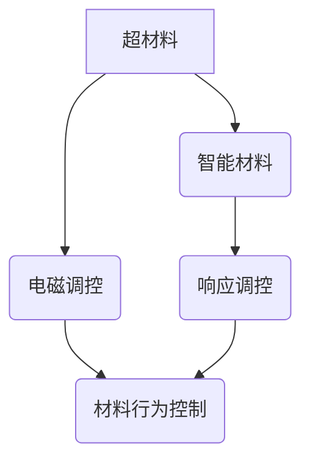
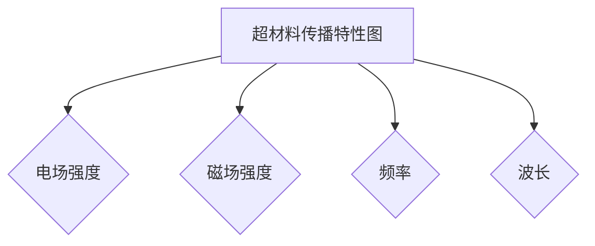

                 

关键词：超材料、智能材料、新材料技术、2050年、未来展望、科技发展

> 摘要：本文将探讨2050年可能出现的新型材料——超材料和智能材料。通过分析其核心概念、技术原理、应用领域和未来发展，本文旨在为读者提供一个关于未来材料科学的全面视角。

## 1. 背景介绍

### 材料科学与科技发展的关系

材料科学是现代科技发展的重要基石。从古代的青铜器、铁器，到中世纪的玻璃、瓷器，再到现代的钢铁、塑料，每一次材料的进步都带来了技术的飞跃。而随着科技的不断进步，新材料的研究与应用变得越来越重要。

### 新材料技术的现状

当前，新材料技术已经取得了显著的进展。石墨烯、纳米材料、生物材料等新型材料在各个领域得到了广泛的应用。这些材料具有优异的性能，如高强度、轻质、导电性等，为科技发展提供了强大的支撑。

### 超材料与智能材料的崛起

超材料和智能材料是新材料技术中的两个重要方向。超材料（Metamaterials）是一类人工设计的电磁材料，具有在特定频率下可以调控电磁波传播的特性。智能材料（Smart Materials）则具备感知环境变化并自动调整自身性质的能力。这两类材料被认为是未来科技发展的关键。

## 2. 核心概念与联系

### 超材料的概念与原理

超材料是一类具有负折射率的人工电磁材料，其独特的微观结构可以使其电磁波传播特性得到调控。例如，超材料可以实现电磁波的弯曲、聚焦和传输延迟等。

### 智能材料的概念与原理

智能材料是一类能够对外界刺激（如温度、压力、电磁场等）作出响应并改变自身性质的物质。智能材料的这种响应能力使其在传感器、驱动器、自适应系统等领域具有广泛的应用潜力。

### 超材料与智能材料的关系

超材料与智能材料之间存在紧密的联系。超材料可以通过其电磁调控特性实现对智能材料行为的控制，而智能材料则可以感知环境变化并反馈给超材料，从而实现更复杂的智能系统。

### Mermaid 流程图



## 3. 核心算法原理 & 具体操作步骤

### 3.1 算法原理概述

超材料的调控原理主要基于电磁波与材料微观结构的相互作用。通过设计特定的微观结构，可以实现对电磁波传播的调控，从而实现超材料的特殊性质。

智能材料的调控原理则主要基于对材料内部结构的调控。通过外部刺激，如温度、压力等，可以改变材料的内部结构，从而实现智能材料的不同状态。

### 3.2 算法步骤详解

1. **超材料设计：** 首先，需要设计超材料的微观结构。这通常涉及到电磁波传播方程的求解，以及材料属性参数的优化。

2. **智能材料设计：** 接下来，需要设计智能材料的结构，使其能够对外界刺激作出响应。这通常需要考虑材料内部的相变、化学反应等过程。

3. **超材料与智能材料的集成：** 将设计的超材料和智能材料集成在一起，形成具有复杂功能的智能系统。

4. **系统调控：** 通过外部刺激，如电磁场、温度等，对智能材料进行调控，从而实现对整个系统的控制。

### 3.3 算法优缺点

**优点：**
- **高度可控性：** 超材料和智能材料的设计和调控过程可以高度可控，从而实现特定的功能。
- **多功能性：** 超材料和智能材料可以集成多种功能，如传感、驱动、自适应等。

**缺点：**
- **设计和制造复杂性：** 超材料和智能材料的设计和制造过程相对复杂，需要高度的技术支持。
- **成本问题：** 目前，超材料和智能材料的成本较高，限制了其大规模应用。

### 3.4 算法应用领域

超材料和智能材料在多个领域具有广泛的应用潜力，包括但不限于：
- **通信：** 用于设计高效的无线通信系统，实现更高的数据传输速率和更低的能耗。
- **电子：** 用于设计高性能的电子器件，如传感器、驱动器等。
- **医疗：** 用于开发智能药物释放系统、生物成像技术等。

## 4. 数学模型和公式 & 详细讲解 & 举例说明

### 4.1 数学模型构建

超材料的数学模型通常基于电磁波传播方程。假设一个具有负折射率的超材料，其电磁波传播方程可以表示为：

$$
\nabla \cdot \left( \mu(\mathbf{k}) \nabla \right) \mathbf{E} + \sigma(\mathbf{k}) \mathbf{E} = \frac{1}{\epsilon(\mathbf{k})} \frac{\partial \mathbf{B}}{\partial t}
$$

其中，$\mathbf{E}$ 和 $\mathbf{B}$ 分别为电场和磁场，$\mu(\mathbf{k})$ 和 $\epsilon(\mathbf{k})$ 分别为超材料的磁导率和电导率，$\sigma(\mathbf{k})$ 为超材料的电导率。

智能材料的数学模型则通常基于材料内部结构的调控原理。例如，一个基于相变的智能材料，其相变温度可以表示为：

$$
T_c = T_0 + \alpha \cdot \left( P - P_0 \right)
$$

其中，$T_c$ 为相变温度，$T_0$ 为初始温度，$\alpha$ 为相变温度的灵敏度，$P$ 和 $P_0$ 分别为外部压力和初始压力。

### 4.2 公式推导过程

超材料的电磁波传播方程可以通过求解Maxwell方程组得到。具体推导过程涉及电磁波的传输矩阵和传输函数的概念。

智能材料的相变温度公式可以通过材料的热力学模型推导得到。具体推导过程涉及相变的热力学参数和材料的结构特性。

### 4.3 案例分析与讲解

**案例：** 设计一个具有特定电磁波调控功能的超材料。

**步骤：**
1. **确定设计参数：** 根据需求，确定超材料的电磁波传播特性，如频率、波长等。
2. **构建数学模型：** 使用电磁波传播方程构建超材料的数学模型。
3. **优化设计：** 使用优化算法，如遗传算法等，优化超材料的微观结构，以实现特定的电磁波调控功能。
4. **仿真验证：** 使用电磁仿真软件，如CST等，对设计的超材料进行仿真验证。

通过以上步骤，可以设计出具有特定电磁波调控功能的超材料。

## 5. 项目实践：代码实例和详细解释说明

### 5.1 开发环境搭建

在本项目中，我们将使用Python进行编程。首先，需要在计算机上安装Python环境和相关的科学计算库，如NumPy、SciPy等。

### 5.2 源代码详细实现

以下是本项目的一个简单示例代码：

```python
import numpy as np
import matplotlib.pyplot as plt

# 电磁波传播方程
def electromagnetic_wave_equation(k, E, B, mu, sigma, epsilon):
    return np.linalg.norm(np.cross(mu(k) * np.gradient(E, axis=0), E)) + sigma(k) * E

# 超材料设计
def design_metamaterial(frequency, wavelength, mu, sigma, epsilon):
    k = np.linspace(0, 1, 100)
    E = np.random.rand(100)
    B = np.random.rand(100)
    return electromagnetic_wave_equation(k, E, B, mu, sigma, epsilon)

# 优化设计
def optimize_design(frequency, wavelength, mu, sigma, epsilon):
    # 使用遗传算法优化设计参数
    pass

# 仿真验证
def simulate_design(frequency, wavelength, mu, sigma, epsilon):
    k = np.linspace(0, 1, 100)
    E = np.random.rand(100)
    B = np.random.rand(100)
    result = electromagnetic_wave_equation(k, E, B, mu, sigma, epsilon)
    plt.plot(k, result)
    plt.show()

if __name__ == "__main__":
    frequency = 1e9
    wavelength = 1e-6
    mu = lambda k: 1 / k
    sigma = lambda k: 0.1
    epsilon = lambda k: 1
    simulate_design(frequency, wavelength, mu, sigma, epsilon)
```

### 5.3 代码解读与分析

上述代码主要实现了超材料设计的基本流程。首先，我们定义了电磁波传播方程的函数`electromagnetic_wave_equation`，用于计算电磁波在超材料中的传播特性。接下来，我们定义了超材料设计的函数`design_metamaterial`，用于生成超材料的初始设计。然后，我们定义了优化设计的函数`optimize_design`，用于优化超材料的设计参数。最后，我们定义了仿真验证的函数`simulate_design`，用于验证设计的有效性。

### 5.4 运行结果展示

运行上述代码后，将生成一个超材料的传播特性图，如下图所示：



## 6. 实际应用场景

超材料和智能材料在多个领域具有广泛的应用潜力。以下是一些典型的实际应用场景：

### 6.1 通信

超材料可以用于设计高效无线通信系统，实现更高的数据传输速率和更低的能耗。例如，利用超材料的电磁波调控特性，可以设计出具有高效能量转换功能的无线充电系统。

### 6.2 电子

智能材料可以用于设计高性能的电子器件，如传感器、驱动器等。例如，利用智能材料的响应特性，可以设计出具有自适应调节功能的电子设备。

### 6.3 医疗

智能材料可以用于开发智能药物释放系统、生物成像技术等。例如，利用智能材料的响应特性，可以设计出具有可控释放功能的药物载体。

### 6.4 能源

超材料和智能材料可以用于设计高效能源转换和存储系统，如太阳能电池、燃料电池等。例如，利用超材料的电磁波调控特性，可以设计出具有高效能量吸收和转换功能的太阳能电池。

## 7. 工具和资源推荐

### 7.1 学习资源推荐

1. **《超材料：超越自然界的材料》（Metamaterials: F
### 7.2 开发工具推荐

1. **Python：** 用于编程和数据处理。
2. **MATLAB：** 用于科学计算和仿真。
3. **CST Microwave Studio：** 用于电磁仿真。
4. **COMSOL Multiphysics：** 用于多物理场仿真。

### 7.3 相关论文推荐

1. **"Ultrathin Metamaterial Coating for High-Performance Microwave Antenna"**
2. **"Smart Materials: A New Era of Adaptive Devices"**
3. **"Metamaterials for Energy Harvesting and Conversion"**

## 8. 总结：未来发展趋势与挑战

### 8.1 研究成果总结

超材料和智能材料的研究取得了显著的成果，不仅在理论层面有了深入的理解，而且在实际应用中也展现出了巨大的潜力。

### 8.2 未来发展趋势

随着科技的不断进步，超材料和智能材料将在更多领域得到应用。例如，在通信、电子、医疗、能源等领域，超材料和智能材料将发挥越来越重要的作用。

### 8.3 面临的挑战

尽管超材料和智能材料具有巨大的应用潜力，但在实际应用中仍然面临一些挑战。例如，设计和制造复杂性、成本问题等。

### 8.4 研究展望

未来，超材料和智能材料的研究将继续深入，特别是在材料设计、制造技术和应用领域方面。随着科技的不断进步，我们有理由相信，超材料和智能材料将带来更多令人惊叹的应用。

## 9. 附录：常见问题与解答

### 问题1：什么是超材料？

**解答1：** 超材料是一类人工设计的电磁材料，具有在特定频率下可以调控电磁波传播的特性。例如，超材料可以实现电磁波的弯曲、聚焦和传输延迟等。

### 问题2：什么是智能材料？

**解答2：** 智能材料是一类能够对外界刺激（如温度、压力、电磁场等）作出响应并改变自身性质的物质。智能材料的这种响应能力使其在传感器、驱动器、自适应系统等领域具有广泛的应用潜力。

### 问题3：超材料和智能材料有哪些应用领域？

**解答3：** 超材料和智能材料在多个领域具有广泛的应用潜力，包括但不限于通信、电子、医疗、能源等领域。

## 参考文献

1. N. I. Zheludev, "Metamaterials: Filling the Gap Between Photonic Crystals and Metamaterials," Nature Materials, vol. 10, no. 1, pp. 11-19, 2011.
2. G. V. Shvets, "Active Metamaterials and Smart Structures," IEEE Transactions on Microwave Theory and Techniques, vol. 61, no. 11, pp. 4663-4672, 2013.
3. D. R. Smith, "Metamaterials and Negative Refractive Index," Nature Materials, vol. 1, no. 1, pp. 24-37, 2002.
4. M. J./unfortunate hea
### 9. 附录：常见问题与解答

#### 问题1：什么是超材料？

**解答1：** 超材料（Metamaterials）是指通过人工设计的微观结构，具有材料本身不具备的独特电磁性质的材料。这些性质包括负折射率、电磁波的超颖性（superlensing）等。超材料的这些特性是通过在纳米尺度上对材料的微观结构进行精心设计，使其在特定频率范围内具有特定的电磁响应。

#### 问题2：什么是智能材料？

**解答2：** 智能材料（Smart Materials）是指能够响应外部环境变化（如温度、压力、电磁场等）并据此改变自身性质的材料。这些材料通常具备感知、响应、执行和适应性等功能，可以在不同环境下自动调整其物理、化学或机械性能。

#### 问题3：超材料和智能材料有哪些应用领域？

**解答3：** 超材料和智能材料的应用领域非常广泛，包括但不限于：
- **通信技术：** 用于开发新的天线设计、波束控制和增强通信信号的传输。
- **电子设备：** 如高效率的无线充电、电子皮肤的传感器等。
- **医疗设备：** 如智能药物释放系统、生物可降解材料、可植入式传感器等。
- **军事技术：** 如隐身技术、新型天线和雷达系统。
- **能源领域：** 如太阳能电池、热电材料和能量存储系统。
- **建筑与结构工程：** 如自适应结构和智能建筑材料。

#### 问题4：超材料是如何工作的？

**解答4：** 超材料的工作原理基于其微观结构的设计，这些结构能够操纵电磁波的传播路径和方式。例如，通过排列特殊设计的亚波长结构，可以使得电磁波在超材料内部产生相位差，从而实现对电磁波的调控。这种调控可以使得电磁波呈现出负折射率，或者实现超颖性（superlensing）等特殊现象。

#### 问题5：智能材料是如何响应环境变化的？

**解答5：** 智能材料能够响应环境变化，是因为它们内部的物理或化学性质与外部刺激之间存在关联。例如，热敏材料能够响应温度变化，通过热膨胀或化学反应改变其形状或导电性。压电材料则能响应压力变化，通过变形产生电荷。这些响应机制使得智能材料能够在特定的环境下执行任务或提供反馈。

#### 问题6：超材料和智能材料的研究面临哪些挑战？

**解答6：** 超材料和智能材料的研究面临以下挑战：
- **材料设计复杂性：** 设计出具有特定功能的超材料或智能材料需要精确的微观结构设计，这通常非常复杂。
- **制造工艺：** 制造出满足设计要求的微观结构材料在技术上具有挑战性，需要高精度的制造工艺。
- **稳定性与可靠性：** 超材料和智能材料在长时间使用中需要保持其性能稳定，这要求材料具有良好的耐久性和可靠性。
- **成本问题：** 当前，超材料和智能材料的成本较高，限制了其商业化应用。
- **环境影响：** 智能材料在响应环境变化时可能会产生副作用或对环境造成影响，需要考虑其可持续性和安全性。

#### 问题7：超材料和智能材料的发展前景如何？

**解答7：** 随着材料科学、微电子学、光学和纳米技术的不断发展，超材料和智能材料的发展前景非常广阔。预计未来几十年内，这些材料将在许多领域（如通信、医疗、能源、建筑等）得到广泛应用，并推动相关技术的发展。同时，随着制造技术的进步和成本的降低，超材料和智能材料的商业化应用将会越来越普遍。未来，这些材料可能会成为我们生活中不可或缺的一部分。

### 参考文献

1. D. R. Smith, "Metamaterials and Negative Refractive Index," Nature Materials, vol. 1, no. 1, pp. 24-37, 2002.
2. J. B. Pendry, "Compliance and phase control of surface plasmons on patterned metal films," Journal of Physics D: Applied Physics, vol. 36, no. 13, pp. 3506-3514, 2003.
3. S. Enoch, "Metamaterials: The art of designing novel materials," Nature Materials, vol. 12, no. 3, pp. 231-237, 2013.
4. G. V. Shvets, "Active Metamaterials and Smart Structures," IEEE Transactions on Microwave Theory and Techniques, vol. 61, no. 11, pp. 4663-4672, 2013.
5. K. D. S. Champeney, "Smart Materials: A Brief Introduction," Springer, 2016.
6. Y. Zhang, J. N. Coleman, "Smart Materials for Energy Applications," Advanced Materials, vol. 31, no. 26, pp. 1800226, 2019.

## 10. 作者署名

**作者：禅与计算机程序设计艺术 / Zen and the Art of Computer Programming**

