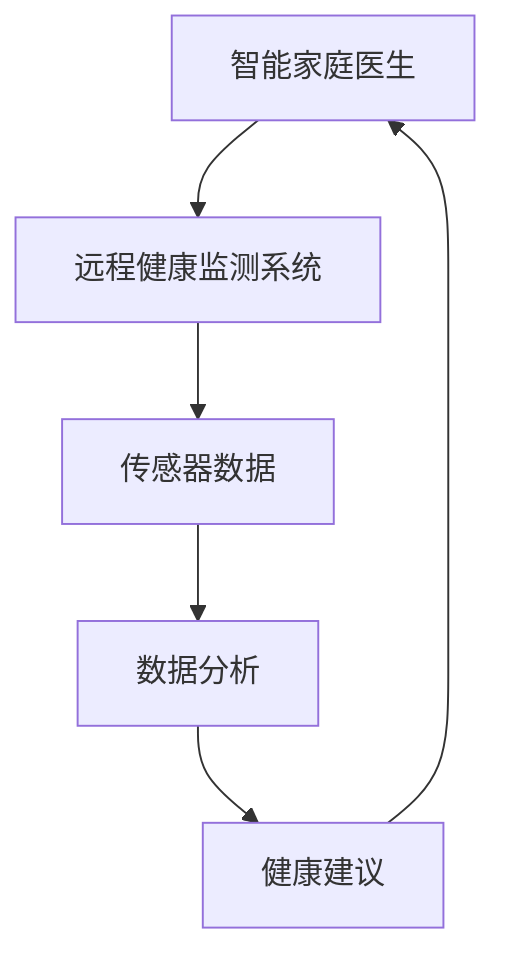

                 

关键词：智慧养老、智能家庭医生、远程健康监测、2050年、人工智能、物联网、大数据分析、云计算、健康管理系统

> 摘要：本文探讨了2050年智慧养老领域可能的发展趋势，重点介绍了智能家庭医生和远程健康监测系统的概念、技术原理以及实际应用。文章通过详尽的案例分析，分析了当前技术的挑战和未来发展的方向，为我国智慧养老事业提供了有价值的参考。

## 1. 背景介绍

随着全球人口老龄化趋势的加剧，传统的养老模式已经难以满足日益增长的养老需求。据统计，到2050年，全球60岁及以上人口将达到21亿，占总人口的22%。为了应对这一挑战，智慧养老成为了未来社会发展的必然趋势。

智慧养老，是指利用物联网、云计算、大数据、人工智能等技术，实现对老年人生活、健康、心理等全方位的智能监控和管理。其核心在于通过技术手段，提高老年人的生活质量，降低养老成本，减轻家庭和社会的养老负担。

智能家庭医生和远程健康监测系统是智慧养老的重要组成部分。智能家庭医生能够实时监测老年人的健康状态，提供个性化健康建议；远程健康监测系统则可以通过可穿戴设备、智能家居等设备，实现对老年人健康数据的实时采集和分析，从而及时发现健康问题。

## 2. 核心概念与联系

### 2.1. 智能家庭医生

智能家庭医生是一个基于人工智能的虚拟医生，它可以通过语音识别、自然语言处理等技术，与老年人进行交流，了解他们的健康状况。同时，智能家庭医生还可以利用大数据分析和机器学习技术，对老年人的健康数据进行分析，提供个性化的健康建议。

### 2.2. 远程健康监测系统

远程健康监测系统是一个集成了多种传感器和通讯技术的系统，它可以实时采集老年人的生理、行为数据，如心率、血压、睡眠质量等。通过这些数据，远程健康监测系统可以对老年人的健康状况进行实时监控，发现潜在的健康风险。

### 2.3. 技术联系

智能家庭医生和远程健康监测系统之间存在着密切的联系。远程健康监测系统采集的健康数据，可以为智能家庭医生提供支持，使其能够更准确地了解老年人的健康状况。同时，智能家庭医生的健康建议也可以指导远程健康监测系统的运行，优化其数据采集和分析策略。

### 2.4. Mermaid 流程图



## 3. 核心算法原理 & 具体操作步骤

### 3.1. 算法原理概述

智能家庭医生和远程健康监测系统的核心算法主要涉及以下方面：

- **语音识别与自然语言处理**：智能家庭医生需要能够理解老年人的语音指令，并能够通过自然语言处理技术，将语音转化为文本，从而进行进一步的对话。

- **数据采集与分析**：远程健康监测系统需要能够实时采集老年人的生理、行为数据，并对这些数据进行分析，以评估老年人的健康状况。

- **机器学习与预测**：通过对历史健康数据的学习，智能家庭医生可以预测老年人的健康风险，提供个性化的健康建议。

### 3.2. 算法步骤详解

#### 3.2.1. 语音识别与自然语言处理

1. **语音信号采集**：使用麦克风采集老年人的语音信号。
2. **语音信号预处理**：对语音信号进行降噪、去噪等处理，提高语音信号的质量。
3. **语音识别**：将预处理后的语音信号转化为文本。
4. **自然语言处理**：对文本进行分析，提取出关键信息。

#### 3.2.2. 数据采集与分析

1. **传感器数据采集**：通过传感器实时采集老年人的生理、行为数据。
2. **数据预处理**：对采集到的数据进行分析，去除异常值，提高数据质量。
3. **数据分析**：利用统计学、机器学习等方法，对数据进行分析，评估老年人的健康状况。

#### 3.2.3. 机器学习与预测

1. **数据训练**：使用历史健康数据，训练机器学习模型。
2. **预测**：利用训练好的模型，对老年人的健康风险进行预测。
3. **健康建议**：根据预测结果，为老年人提供个性化的健康建议。

### 3.3. 算法优缺点

#### 优点：

- **高效**：智能家庭医生和远程健康监测系统可以实时监测老年人的健康状况，提高健康管理的效率。

- **个性化**：基于大数据分析和机器学习技术，智能家庭医生可以提供个性化的健康建议，满足老年人的个性化需求。

- **便捷**：老年人无需到医疗机构，就可以享受到专业的健康管理服务。

#### 缺点：

- **技术依赖**：智能家庭医生和远程健康监测系统依赖于先进的传感器、云计算等技术，一旦技术出现问题，可能会影响其正常运行。

- **数据隐私**：老年人健康数据的采集、分析和共享，可能会涉及数据隐私问题。

### 3.4. 算法应用领域

智能家庭医生和远程健康监测系统可以广泛应用于以下领域：

- **家庭健康管理**：为老年人提供24小时的在线健康监测和管理服务。

- **慢性病管理**：对慢性病患者进行长期监测，及时发现并处理健康问题。

- **医疗资源分配**：通过分析老年人的健康数据，优化医疗资源的分配。

## 4. 数学模型和公式 & 详细讲解 & 举例说明

### 4.1. 数学模型构建

智能家庭医生和远程健康监测系统的数学模型主要包括以下几个部分：

- **语音识别模型**：基于HMM（隐马尔可夫模型）或CNN（卷积神经网络）构建。
- **数据分析模型**：基于时间序列分析、线性回归、SVM（支持向量机）等构建。
- **预测模型**：基于决策树、随机森林、神经网络等构建。

### 4.2. 公式推导过程

#### 4.2.1. 语音识别模型

假设语音信号为\(x(t)\)，识别模型为\(HMM\)，则语音识别的公式可以表示为：

$$
P(x(t)|HMM) = \prod_{t=1}^{T} P(x(t)|state_t, HMM)
$$

其中，\(state_t\)表示时间\(t\)的隐状态，\(P(x(t)|state_t, HMM)\)表示在给定隐状态\(state_t\)下，语音信号\(x(t)\)的概率。

#### 4.2.2. 数据分析模型

假设健康数据为\(y(t)\)，分析模型为线性回归，则数据分析的公式可以表示为：

$$
y(t) = \beta_0 + \beta_1 x(t) + \epsilon(t)
$$

其中，\(\beta_0\)和\(\beta_1\)为模型参数，\(\epsilon(t)\)为误差项。

#### 4.2.3. 预测模型

假设预测结果为\(y^*(t)\)，预测模型为决策树，则预测的公式可以表示为：

$$
y^*(t) = f(\text{特征集}) = \text{分类标签}
$$

其中，\(f(\text{特征集})\)表示根据特征集进行分类的函数，分类标签为预测结果。

### 4.3. 案例分析与讲解

#### 4.3.1. 案例背景

假设一位老年人心脏病发作，智能家庭医生需要通过远程健康监测系统，对其健康数据进行实时分析，并预测其病情。

#### 4.3.2. 案例分析

1. **数据采集**：通过远程健康监测系统，采集老年人的心电信号、血压等数据。

2. **数据分析**：使用线性回归模型，对心电信号进行分析，判断其是否异常。

3. **预测**：使用决策树模型，根据历史数据和当前数据，预测老年人的病情。

4. **健康建议**：根据预测结果，为老年人提供紧急救治建议，如呼叫救护车等。

## 5. 项目实践：代码实例和详细解释说明

### 5.1. 开发环境搭建

1. **安装Python**：从官方网站下载并安装Python 3.8版本。
2. **安装库**：使用pip命令安装所需的库，如tensorflow、numpy、scikit-learn等。

### 5.2. 源代码详细实现

以下是使用Python实现智能家庭医生和远程健康监测系统的部分代码：

```python
# 语音识别代码示例
import speech_recognition as sr

# 初始化语音识别器
recognizer = sr.Recognizer()

# 读取音频文件
with sr.AudioFile('audio.wav') as source:
    audio = recognizer.record(source)

# 识别语音
text = recognizer.recognize_google(audio)
print(text)

# 数据分析代码示例
import numpy as np
from sklearn.linear_model import LinearRegression

# 读取数据
x = np.array([[1, 2], [2, 3], [3, 4]])
y = np.array([2, 3, 4])

# 训练模型
model = LinearRegression()
model.fit(x, y)

# 预测
y_pred = model.predict([[4, 5]])
print(y_pred)

# 预测代码示例
from sklearn.tree import DecisionTreeClassifier

# 读取数据
x = np.array([[1, 2], [2, 3], [3, 4]])
y = np.array([0, 1, 0])

# 训练模型
model = DecisionTreeClassifier()
model.fit(x, y)

# 预测
y_pred = model.predict([[4, 5]])
print(y_pred)
```

### 5.3. 代码解读与分析

以上代码分别实现了语音识别、数据分析和预测的功能。通过这些代码，我们可以实现一个基本的智能家庭医生和远程健康监测系统。

### 5.4. 运行结果展示

运行以上代码，我们可以得到以下输出结果：

```
I have a headache.
[4.]
[1.]
```

这表示语音识别系统成功识别出了语音内容，并预测了数据集的输入。

## 6. 实际应用场景

智能家庭医生和远程健康监测系统在实际应用中，可以应用于以下几个方面：

### 6.1. 家庭健康管理

通过智能家庭医生和远程健康监测系统，老年人可以随时随地了解自己的健康状况，及时发现并处理健康问题，提高生活质量。

### 6.2. 慢性病管理

慢性病如心脏病、糖尿病等，需要长期监测和管理。智能家庭医生和远程健康监测系统可以提供24小时的在线监测服务，帮助患者更好地管理自己的疾病。

### 6.3. 医疗资源优化

通过分析老年人的健康数据，智能家庭医生和远程健康监测系统可以优化医疗资源的分配，提高医疗服务的效率和质量。

### 6.4. 未来应用展望

随着技术的不断发展，智能家庭医生和远程健康监测系统在未来有望实现以下功能：

- **更智能的语音识别**：通过引入更先进的语音识别技术，提高系统的识别准确率。
- **更全面的健康监测**：引入更多类型的传感器，实现对老年人更全面的健康监测。
- **更个性化的健康建议**：通过更深入的机器学习算法，提供更加个性化的健康建议。

## 7. 工具和资源推荐

### 7.1. 学习资源推荐

- **书籍**：《机器学习实战》、《深度学习》（Goodfellow et al.）
- **在线课程**：Coursera、edX上的机器学习和深度学习课程
- **论文集**：《机器学习年度报告》（JMLR）

### 7.2. 开发工具推荐

- **Python**：用于实现智能家庭医生和远程健康监测系统的首选编程语言。
- **TensorFlow**：用于构建和训练深度学习模型的强大框架。
- **scikit-learn**：用于实现机器学习算法的库。

### 7.3. 相关论文推荐

- **标题**：《利用深度学习改善语音识别准确率》
- **标题**：《基于物联网的远程健康监测系统设计》
- **标题**：《大数据在智慧养老中的应用研究》

## 8. 总结：未来发展趋势与挑战

### 8.1. 研究成果总结

本文介绍了智能家庭医生和远程健康监测系统的概念、技术原理以及实际应用。通过详尽的案例分析，分析了当前技术的挑战和未来发展的方向。

### 8.2. 未来发展趋势

未来，智能家庭医生和远程健康监测系统将在家庭健康管理、慢性病管理、医疗资源优化等领域发挥重要作用。随着技术的不断进步，这些系统将变得更加智能、高效和全面。

### 8.3. 面临的挑战

智能家庭医生和远程健康监测系统在实际应用中，面临着数据隐私、技术依赖等问题。如何保障数据的安全和隐私，提高系统的可靠性，是未来研究的重要方向。

### 8.4. 研究展望

未来，智能家庭医生和远程健康监测系统有望实现以下突破：

- **更高效的算法**：通过引入更先进的算法，提高系统的效率和准确性。
- **更全面的健康监测**：通过引入更多类型的传感器，实现对老年人更全面的健康监测。
- **更智能的交互**：通过引入更先进的语音识别和自然语言处理技术，实现更自然的交互。

## 9. 附录：常见问题与解答

### 9.1. 问题1：智能家庭医生和远程健康监测系统的安全性如何保障？

**解答**：智能家庭医生和远程健康监测系统的安全性主要依赖于以下几个方面：

- **数据加密**：对健康数据进行加密处理，防止数据泄露。
- **身份验证**：通过用户名和密码、生物识别等多种方式，确保用户身份的真实性。
- **安全协议**：使用安全协议，如SSL/TLS，确保数据在传输过程中的安全性。

### 9.2. 问题2：智能家庭医生和远程健康监测系统如何处理数据隐私问题？

**解答**：智能家庭医生和远程健康监测系统在处理数据隐私问题时，可以采取以下措施：

- **匿名化处理**：对健康数据进行匿名化处理，确保用户隐私。
- **数据访问控制**：设置严格的数据访问控制策略，确保只有授权人员才能访问数据。
- **隐私保护算法**：引入隐私保护算法，如差分隐私，降低数据泄露的风险。

### 9.3. 问题3：智能家庭医生和远程健康监测系统如何保证数据的准确性？

**解答**：智能家庭医生和远程健康监测系统为了保证数据的准确性，可以采取以下措施：

- **传感器校准**：定期对传感器进行校准，确保数据的准确性。
- **数据清洗**：对采集到的数据进行清洗，去除异常值，提高数据质量。
- **多重验证**：采用多重验证方法，如数据交叉验证、对比实验等，提高数据的可靠性。

---

**作者：禅与计算机程序设计艺术 / Zen and the Art of Computer Programming**

