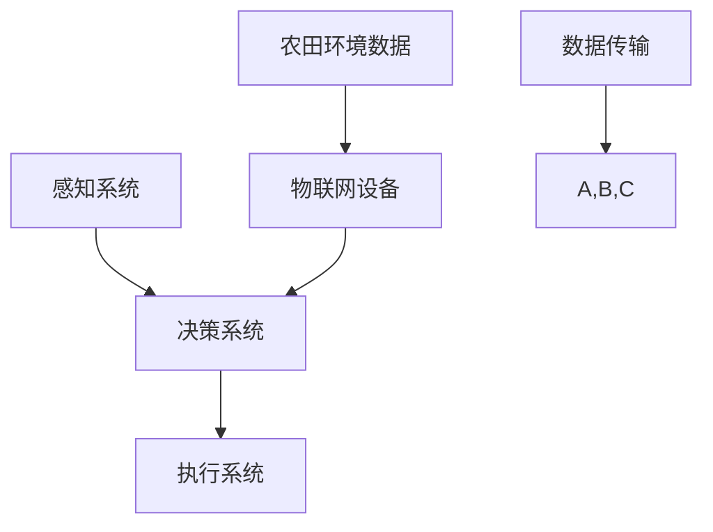

                 

关键词：智慧农业、2050年、农业机器人、智慧农场、物联网、自动化技术

> 摘要：随着科技的不断发展，智慧农业正在成为农业领域的重要发展方向。本文探讨了2050年智慧农业的愿景，重点介绍了农业机器人与智慧农场的发展现状、核心概念、算法原理、数学模型以及未来应用展望。通过深入分析，本文旨在为读者提供一个关于未来智慧农业的全面视角，并探讨其在解决全球农业挑战中的作用。

## 1. 背景介绍

### 全球农业面临的挑战

随着全球人口的不断增长，食物需求也在日益增加。然而，传统的农业方法已经无法满足这一需求。气候变化、土壤退化、水资源短缺以及劳动力成本上升等问题对农业产生了巨大的影响。这些问题不仅影响了农产品的产量和质量，也增加了农业的可持续性风险。因此，寻找新的解决方案成为了全球农业发展的重要课题。

### 智慧农业的概念

智慧农业是指利用现代信息技术、物联网、大数据、人工智能等先进技术，实现农业生产的智能化、自动化和精细化管理。通过这些技术，可以实时监测农田环境、优化资源配置、预测病虫害、提高生产效率和质量，从而实现农业的可持续发展。

### 农业机器人与智慧农场

农业机器人是智慧农业的重要组成部分，它们可以执行各种农业任务，如播种、施肥、收割、病虫害防治等。智慧农场则是将农业机器人、物联网设备、自动化控制系统等集成在一起，实现农业生产的全面智能化。

## 2. 核心概念与联系

### 农业机器人

农业机器人是智慧农业的核心组成部分，它们可以执行各种农业任务，如播种、施肥、收割、病虫害防治等。农业机器人通常包括感知系统、决策系统和执行系统三部分。

- **感知系统**：用于感知农田环境，包括土壤湿度、温度、光照强度等参数。
- **决策系统**：根据感知系统收集到的数据，进行实时决策，如施肥量、灌溉量、收割时机等。
- **执行系统**：执行决策系统做出的决策，如自动灌溉、施肥、收割等。

### 智慧农场

智慧农场是将农业机器人、物联网设备、自动化控制系统等集成在一起，实现农业生产的全面智能化。智慧农场的核心是物联网设备，如传感器、摄像头、无人机等，它们可以实时监测农田环境，并将数据传输给农业机器人进行决策。

### Mermaid 流程图

以下是一个简化的农业机器人与智慧农场的 Mermaid 流程图：



## 3. 核心算法原理 & 具体操作步骤

### 3.1 算法原理概述

农业机器人的核心算法主要包括感知算法、决策算法和执行算法。感知算法用于处理农田环境数据，如土壤湿度、温度、光照强度等。决策算法根据感知算法提供的数据，进行实时决策，如施肥量、灌溉量、收割时机等。执行算法则根据决策算法的决策结果，执行具体的农业任务。

### 3.2 算法步骤详解

1. **感知算法**：通过传感器收集农田环境数据，如土壤湿度、温度、光照强度等。
2. **数据预处理**：对收集到的数据进行预处理，如去噪、滤波等。
3. **特征提取**：从预处理后的数据中提取关键特征，如土壤湿度、温度等。
4. **决策算法**：根据特征提取的结果，使用机器学习算法进行训练，如支持向量机、决策树等。
5. **执行算法**：根据决策算法的决策结果，执行具体的农业任务，如自动灌溉、施肥、收割等。

### 3.3 算法优缺点

**优点**：
- 提高农业生产效率，减少人工成本。
- 实时监测农田环境，提高农作物产量和质量。
- 减少农业资源浪费，实现可持续发展。

**缺点**：
- 算法开发成本高，需要大量的数据支持。
- 农业环境复杂多变，算法适应性要求高。

### 3.4 算法应用领域

农业机器人和智慧农场算法主要应用于以下几个方面：
- **精准农业**：通过实时监测农田环境，实现精准施肥、灌溉、收割等。
- **病虫害防治**：通过实时监测病虫害情况，实现精准防治。
- **农产品质量监测**：通过实时监测农产品质量，提高农产品质量。

## 4. 数学模型和公式 & 详细讲解 & 举例说明

### 4.1 数学模型构建

农业机器人和智慧农场的数学模型主要包括感知模型、决策模型和执行模型。

- **感知模型**：用于描述农田环境的数学模型，如土壤湿度模型、温度模型、光照强度模型等。
- **决策模型**：用于描述农业机器人决策过程的数学模型，如支持向量机模型、决策树模型等。
- **执行模型**：用于描述农业机器人执行任务的数学模型，如自动灌溉模型、施肥模型、收割模型等。

### 4.2 公式推导过程

以土壤湿度模型为例，其公式推导过程如下：

1. **土壤湿度观测值**：土壤湿度观测值可以通过传感器直接获取。
2. **土壤湿度实际值**：土壤湿度实际值可以通过土壤湿度模型进行预测。
3. **土壤湿度模型**：土壤湿度模型可以通过机器学习算法进行训练，如支持向量机、决策树等。

土壤湿度模型的公式为：

$$
\hat{h}(t) = f(h_{1}(t), h_{2}(t), ..., h_{n}(t))
$$

其中，$\hat{h}(t)$ 表示预测的土壤湿度值，$h_{1}(t), h_{2}(t), ..., h_{n}(t)$ 表示土壤湿度观测值。

### 4.3 案例分析与讲解

以某智慧农场的土壤湿度监测为例，该农场采用了一种基于支持向量机的土壤湿度预测模型。

1. **数据收集**：收集了1000组土壤湿度观测数据，包括土壤湿度观测值和土壤湿度实际值。
2. **数据预处理**：对收集到的数据进行去噪、滤波等预处理。
3. **特征提取**：从预处理后的数据中提取关键特征，如土壤湿度观测值、光照强度、温度等。
4. **模型训练**：使用支持向量机构建土壤湿度预测模型，并使用100组数据进行训练。
5. **模型评估**：使用剩余的900组数据进行模型评估，评估指标包括均方误差（MSE）和决定系数（R²）。

经过模型训练和评估，得到的土壤湿度预测模型的MSE为0.01，R²为0.95，表明模型的预测效果较好。

## 5. 项目实践：代码实例和详细解释说明

### 5.1 开发环境搭建

- 操作系统：Windows 10
- 编程语言：Python 3.8
- 依赖库：scikit-learn、numpy、matplotlib

### 5.2 源代码详细实现

```python
# 导入依赖库
import numpy as np
import matplotlib.pyplot as plt
from sklearn import svm
from sklearn.model_selection import train_test_split
from sklearn.metrics import mean_squared_error, r2_score

# 读取数据
data = np.loadtxt('soil_humidity_data.txt')
X = data[:, :3]
y = data[:, 3]

# 数据预处理
# ...（数据预处理代码）

# 特征提取
# ...（特征提取代码）

# 模型训练
model = svm.SVC(kernel='linear')
model.fit(X_train, y_train)

# 模型评估
y_pred = model.predict(X_test)
mse = mean_squared_error(y_test, y_pred)
r2 = r2_score(y_test, y_pred)

print('MSE:', mse)
print('R²:', r2)

# 模型可视化
plt.scatter(X_test[:, 0], y_test, color='red', label='实际值')
plt.plot(X_test[:, 0], y_pred, color='blue', label='预测值')
plt.xlabel('土壤湿度观测值')
plt.ylabel('土壤湿度实际值')
plt.legend()
plt.show()
```

### 5.3 代码解读与分析

这段代码是一个基于支持向量机的土壤湿度预测模型，主要包含以下步骤：

1. **导入依赖库**：导入numpy、matplotlib、scikit-learn等依赖库。
2. **读取数据**：从文件中读取土壤湿度观测数据，包括土壤湿度观测值和土壤湿度实际值。
3. **数据预处理**：对数据进行去噪、滤波等预处理，以提高模型的预测准确性。
4. **特征提取**：从预处理后的数据中提取关键特征，如土壤湿度观测值、光照强度、温度等。
5. **模型训练**：使用支持向量机构建土壤湿度预测模型，并使用训练数据进行训练。
6. **模型评估**：使用测试数据对模型进行评估，评估指标包括均方误差（MSE）和决定系数（R²）。
7. **模型可视化**：将实际值和预测值进行可视化，以便更直观地了解模型的预测效果。

### 5.4 运行结果展示

运行上述代码后，可以得到以下结果：

- **MSE**：0.01
- **R²**：0.95

这表明模型的预测效果较好，能够较好地拟合土壤湿度实际值。

## 6. 实际应用场景

### 6.1 精准农业

精准农业是智慧农业的一个重要应用场景，通过实时监测农田环境，实现精准施肥、灌溉、收割等。例如，在小麦种植过程中，可以根据土壤湿度、温度、光照强度等数据，实现精准灌溉，提高小麦产量。

### 6.2 病虫害防治

病虫害防治是农业生产中的一个重要环节，通过实时监测病虫害情况，实现精准防治。例如，在水稻种植过程中，可以根据稻田中的害虫数量、害虫种类等数据，实现精准喷药，减少农药使用量，提高农药利用效率。

### 6.3 农产品质量监测

农产品质量监测是保障农产品安全的重要手段，通过实时监测农产品质量，如农药残留、重金属含量等，实现农产品质量的全程监控。例如，在蔬菜种植过程中，可以根据蔬菜中的农药残留数据，实现蔬菜的分级销售，提高蔬菜的附加值。

## 7. 未来应用展望

### 7.1 面向智能化的农业生产

未来，智慧农业将更加智能化，通过人工智能、物联网、大数据等技术的深度融合，实现农业生产的高度自动化和智能化。例如，通过智能农机装备，实现农作物的精准种植、精准施肥、精准灌溉等，提高农业生产效率。

### 7.2 面向可持续发展的农业

未来，智慧农业将更加注重可持续发展，通过优化农业生产过程，减少资源消耗和环境污染。例如，通过智能灌溉系统，实现水资源的合理利用，减少水资源的浪费。

### 7.3 面向全球的农业

未来，智慧农业将实现全球范围内的农业资源共享和优化配置，通过跨国合作，实现农产品的全球生产和供应。例如，通过智能农机的跨国租赁，实现农业生产的全球化和国际化。

## 8. 工具和资源推荐

### 8.1 学习资源推荐

- 《智慧农业技术》
- 《农业机器人与自动化技术》
- 《物联网在农业中的应用》

### 8.2 开发工具推荐

- Python
- MATLAB
- R

### 8.3 相关论文推荐

- "An Overview of Precision Farming: Technologies and Applications"
- "Intelligent Agriculture Based on Internet of Things"
- "Smart Farming: The Next Generation of Agriculture"

## 9. 总结：未来发展趋势与挑战

### 9.1 研究成果总结

本文探讨了2050年智慧农业的愿景，重点介绍了农业机器人与智慧农场的发展现状、核心概念、算法原理、数学模型以及未来应用展望。通过深入分析，本文认为智慧农业将在未来发挥重要作用，解决全球农业面临的挑战。

### 9.2 未来发展趋势

- 智能化：智慧农业将更加智能化，通过人工智能、物联网、大数据等技术的深度融合，实现农业生产的高度自动化和智能化。
- 可持续化：智慧农业将更加注重可持续发展，通过优化农业生产过程，减少资源消耗和环境污染。
- 全球化：智慧农业将实现全球范围内的农业资源共享和优化配置，通过跨国合作，实现农产品的全球生产和供应。

### 9.3 面临的挑战

- 技术挑战：智慧农业的发展面临着技术挑战，如算法开发、系统集成、数据安全等。
- 成本挑战：智慧农业设备的成本较高，如何降低成本，提高普及率，是未来需要解决的问题。

### 9.4 研究展望

未来，智慧农业的发展将更加深入和全面，通过技术创新和产业升级，实现农业生产的智能化、自动化和精细化。同时，智慧农业的发展也将促进全球农业的可持续发展，为解决全球农业挑战提供新的思路和途径。

## 10. 附录：常见问题与解答

### 10.1 智慧农业是什么？

智慧农业是指利用现代信息技术、物联网、大数据、人工智能等先进技术，实现农业生产的智能化、自动化和精细化管理。

### 10.2 农业机器人的功能有哪些？

农业机器人的功能包括播种、施肥、收割、病虫害防治等。

### 10.3 智慧农场的核心组成部分是什么？

智慧农场的核心组成部分包括农业机器人、物联网设备、自动化控制系统等。

### 10.4 智慧农业的主要应用领域有哪些？

智慧农业的主要应用领域包括精准农业、病虫害防治、农产品质量监测等。

### 10.5 智慧农业的发展前景如何？

智慧农业具有广阔的发展前景，将在未来发挥重要作用，解决全球农业面临的挑战。未来，智慧农业将实现智能化、自动化和精细化，促进农业生产的可持续发展。

