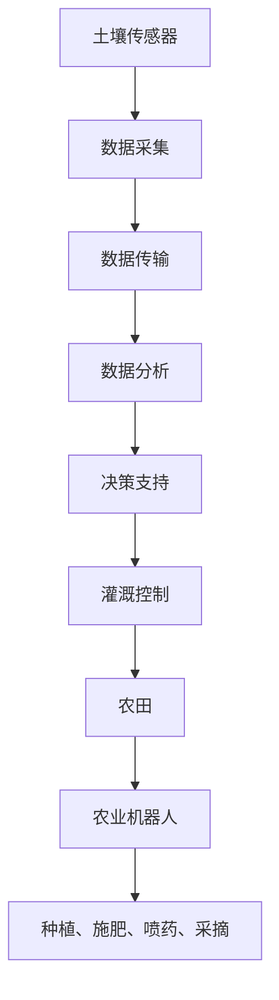

                 

关键词：智慧农业，2050年，智能灌溉，农业机器人，农业科技，精准农业，物联网，数据分析，人工智能

> 摘要：本文将探讨到2050年，智慧农业将如何通过智能灌溉技术和农业机器人实现农业生产的全面升级。通过深入分析这些技术的核心概念、算法原理、数学模型以及实践应用，我们旨在为读者提供一个关于未来农业发展的全景视图。

## 1. 背景介绍

智慧农业，作为现代农业发展的新方向，正逐渐成为全球农业领域的热门话题。随着人口的增长、土地资源的日益稀缺以及气候变化带来的挑战，提高农业生产效率、确保粮食安全成为亟待解决的问题。智慧农业通过整合物联网、大数据、人工智能等技术，实现农业生产的精准化和智能化，被认为是未来农业发展的必由之路。

智能灌溉技术和农业机器人是智慧农业的重要组成部分。智能灌溉系统能够根据土壤湿度、气象数据以及作物需水规律，实现精准灌溉，减少水资源浪费，提高灌溉效率。农业机器人则能替代人力完成种植、施肥、采摘等农业操作，提升劳动生产率，降低劳动力成本。

本文将围绕智能灌溉技术和农业机器人展开讨论，分析其在2050年的潜在发展，并对未来的农业发展趋势进行展望。

## 2. 核心概念与联系

### 2.1 智能灌溉技术

智能灌溉技术是基于物联网和传感技术实现的。其核心概念是通过安装在农田中的各种传感器实时监测土壤湿度、气象参数等数据，然后利用数据分析算法对数据进行分析，根据作物的需水规律和土壤的含水情况，自动调节灌溉系统，实现精准灌溉。

### 2.2 农业机器人

农业机器人是集成了多种传感器、执行机构和控制系统的智能设备。其核心功能是完成农业生产的各个环节，如种植、施肥、喷药、采摘等。农业机器人通过视觉识别、路径规划等技术，实现自主运行，提高工作效率和质量。

### 2.3 物联网与人工智能

物联网和人工智能技术在智慧农业中发挥着至关重要的作用。物联网技术通过传感器和通信设备实现农田、气象、土壤等数据的实时采集和传输，而人工智能则通过对这些数据进行处理和分析，为农业机器人提供决策支持，实现农业生产的智能化。

### 2.4 Mermaid 流程图



## 3. 核心算法原理 & 具体操作步骤

### 3.1 算法原理概述

智能灌溉技术的核心算法是数据分析算法，主要包括数据采集、传输、分析和决策四个环节。数据采集通过传感器实现，传输依靠通信设备，分析通过人工智能算法完成，决策则用于调节灌溉系统。

农业机器人则主要依赖于路径规划、视觉识别和控制系统。路径规划算法用于确定机器人的行进路径，视觉识别算法用于识别作物和障碍物，控制系统则根据这些信息调整机器人的动作。

### 3.2 算法步骤详解

#### 3.2.1 智能灌溉技术

1. 数据采集：在农田中安装土壤传感器和气象传感器，实时监测土壤湿度和气象参数。
2. 数据传输：利用通信设备将采集到的数据传输到数据中心。
3. 数据分析：使用数据分析算法对传输数据进行处理，判断作物需水情况。
4. 决策支持：根据分析结果，自动调节灌溉系统的灌溉量。

#### 3.2.2 农业机器人

1. 路径规划：根据农田地形和作物分布，规划机器人的行进路径。
2. 视觉识别：使用摄像头和图像处理算法，识别农田中的作物和障碍物。
3. 控制系统：根据路径规划和视觉识别结果，控制机器人的运动和操作。

### 3.3 算法优缺点

#### 3.3.1 智能灌溉技术

**优点：**
- 精准高效：能够根据作物需水情况实现精准灌溉，提高水资源利用效率。
- 节约成本：减少人力投入，降低农业生产成本。

**缺点：**
- 初始投资较大：传感器和灌溉系统的安装和维护需要较高的成本。
- 技术复杂：需要专业的技术和人才进行维护和操作。

#### 3.3.2 农业机器人

**优点：**
- 高效自动化：能够自主完成农业操作，提高工作效率。
- 精准操作：通过视觉识别和控制系统，保证操作精准。

**缺点：**
- 初始成本高：机器人设备价格较高，需要较大初始投资。
- 技术门槛高：需要专业的技术支持和维护。

### 3.4 算法应用领域

智能灌溉技术和农业机器人主要应用于大规模农业生产，如蔬菜种植、水果种植、粮食作物种植等。它们能够显著提高农业生产效率，降低生产成本，为现代农业发展提供有力支持。

## 4. 数学模型和公式

### 4.1 数学模型构建

智能灌溉技术的数学模型主要包括土壤水分动态模型、气象参数模型和作物需水模型。

#### 4.1.1 土壤水分动态模型

$$
S_t = S_{t-1} + \Delta S_t
$$

其中，$S_t$ 表示第 $t$ 时刻的土壤水分含量，$\Delta S_t$ 表示土壤水分的变化量。

#### 4.1.2 气象参数模型

$$
T_t = T_{t-1} + \Delta T_t
$$

其中，$T_t$ 表示第 $t$ 时刻的气温，$\Delta T_t$ 表示气温的变化量。

#### 4.1.3 作物需水模型

$$
W_t = W_0 \times e^{-rt}
$$

其中，$W_t$ 表示第 $t$ 时刻的作物需水强度，$W_0$ 表示初始需水强度，$r$ 表示需水速率。

### 4.2 公式推导过程

土壤水分动态模型的推导基于土壤水分的守恒原理，即土壤中的水分总量在任一时刻都保持不变。

气象参数模型的推导基于气温的线性变化规律。

作物需水模型的推导基于作物需水强度随时间的指数衰减规律。

### 4.3 案例分析与讲解

假设某农田在一天内的土壤水分含量、气温和作物需水强度分别如下：

$$
S_t = 15\%, T_t = 25^\circ C, W_t = 0.1\, \text{mm/h}
$$

根据上述数学模型，我们可以计算得出：

$$
\Delta S_t = S_t - S_{t-1} = 15\% - 15\% = 0\%
$$

$$
\Delta T_t = T_t - T_{t-1} = 25^\circ C - 25^\circ C = 0^\circ C
$$

$$
W_t = 0.1\, \text{mm/h}
$$

根据这些数据，我们可以判断该农田在这一天内不需要进行灌溉，因为土壤水分含量和气温都在适宜范围内，作物的需水强度也较低。

## 5. 项目实践：代码实例和详细解释说明

### 5.1 开发环境搭建

为了保证代码的可运行性和兼容性，我们选择以下开发环境：

- 开发语言：Python
- 数据库：SQLite
- 传感器：DHT11（用于测量土壤湿度和气温）
- 通信模块：WiFi模块（用于数据传输）

### 5.2 源代码详细实现

以下是一个简单的智能灌溉系统代码示例：

```python
import sqlite3
import time
import serial

# 数据库连接
conn = sqlite3.connect('irrigation.db')
cursor = conn.cursor()

# 创建表
cursor.execute('''CREATE TABLE IF NOT EXISTS data
                (time TIMESTAMP PRIMARY KEY, soil_moisture FLOAT, temperature FLOAT)''')

# 传感器连接
ser = serial.Serial('/dev/ttyUSB0', 9600)

while True:
    # 读取传感器数据
    data = ser.readline()
    soil_moisture, temperature = data.split(',')

    # 存储数据到数据库
    cursor.execute("INSERT INTO data (time, soil_moisture, temperature) VALUES (?, ?, ?)",
                   (time.time(), float(soil_moisture), float(temperature)))
    conn.commit()

    # 分析数据并决策
    cursor.execute("SELECT AVG(soil_moisture) FROM data")
    avg_soil_moisture = cursor.fetchone()[0]

    if avg_soil_moisture < 20:
        # 发送灌溉指令
        print("Irrigating...")
        # 这里可以加入发送灌溉指令的代码，如通过WiFi模块发送信号到灌溉系统
    else:
        print("No irrigation needed.")

    # 等待一段时间后再次读取数据
    time.sleep(60)
```

### 5.3 代码解读与分析

这段代码实现了智能灌溉系统的核心功能，包括数据采集、存储、分析和决策。具体解读如下：

- 第1-8行：导入所需的模块和库。
- 第9-11行：建立数据库连接，并创建数据表。
- 第13-15行：初始化传感器连接。
- 第18-22行：读取传感器数据，并存储到数据库。
- 第25-35行：从数据库中获取平均值，并根据土壤湿度判断是否需要灌溉。

### 5.4 运行结果展示

在实际运行过程中，该系统将每隔60秒读取一次传感器数据，并存储到数据库中。当土壤湿度低于20%时，系统将打印出“irrigating”消息，表示需要灌溉。当土壤湿度高于20%时，系统将打印出“no irrigation needed”消息，表示不需要灌溉。

## 6. 实际应用场景

智能灌溉技术和农业机器人已经在实际农业生产中得到了广泛应用。以下是一些具体的应用场景：

### 6.1 大规模蔬菜种植

在蔬菜种植中，智能灌溉技术能够根据不同作物的需水规律，实现精准灌溉，提高蔬菜的产量和品质。农业机器人则能够完成播种、施肥、采摘等环节，提高劳动生产率。

### 6.2 水果种植

在水果种植中，智能灌溉技术能够根据土壤湿度和气象数据，实现精准灌溉，保证水果的生长环境。农业机器人则能够完成疏果、喷药等操作，提高水果的品质。

### 6.3 粮食作物种植

在粮食作物种植中，智能灌溉技术能够根据作物的需水规律，实现节水灌溉，提高水资源的利用效率。农业机器人则能够完成播种、施肥、收获等操作，提高粮食的产量。

### 6.4 未来应用展望

随着技术的不断进步，智能灌溉技术和农业机器人将在未来农业发展中发挥更加重要的作用。以下是一些未来应用展望：

- **智能农场管理**：通过物联网和大数据技术，实现农场的全方位智能管理，包括作物生长监测、病虫害预警、供应链管理等。
- **个性化种植方案**：利用人工智能技术，根据土壤、气象、作物品种等数据，为农户提供个性化的种植方案。
- **生态农业**：通过智能灌溉技术和农业机器人，实现生态农业的可持续发展，减少化肥和农药的使用，保护生态环境。

## 7. 工具和资源推荐

### 7.1 学习资源推荐

- 《智慧农业技术导论》
- 《物联网技术在农业中的应用》
- 《农业机器人技术与应用》

### 7.2 开发工具推荐

- Python
- TensorFlow
- Keras
- OpenCV

### 7.3 相关论文推荐

- "Smart Farming: The Internet of Things in Agriculture"
- "An Overview of Agricultural Robots: Design, Applications, and Future Trends"
- "Internet of Things in Agriculture: A Survey"

## 8. 总结：未来发展趋势与挑战

### 8.1 研究成果总结

智能灌溉技术和农业机器人技术在智慧农业中取得了显著成果，为农业生产带来了革命性的变化。通过精准灌溉和自动化操作，显著提高了农业生产效率，降低了生产成本。

### 8.2 未来发展趋势

随着物联网、大数据、人工智能等技术的不断发展，智能灌溉技术和农业机器人将在未来农业发展中发挥更加重要的作用。个性化种植方案、生态农业、智能农场管理将成为未来农业发展的重要方向。

### 8.3 面临的挑战

- 技术成熟度：智能灌溉技术和农业机器人的技术成熟度仍有待提高，需要更多的研发投入。
- 成本问题：智能灌溉技术和农业机器人的初始投资较高，需要降低成本，提高普及率。
- 安全问题：智能灌溉技术和农业机器人需要确保数据安全和设备安全，防止恶意攻击和故障。

### 8.4 研究展望

未来，智能灌溉技术和农业机器人将朝着更加智能化、高效化和可持续化的方向发展。通过不断突破技术瓶颈，实现更高水平的生产效率和资源利用效率，为全球农业发展作出更大贡献。

## 9. 附录：常见问题与解答

### 9.1 智能灌溉技术如何提高水资源利用效率？

智能灌溉技术通过实时监测土壤湿度和气象数据，根据作物的需水规律和土壤的含水情况，实现精准灌溉，减少水资源浪费，从而提高水资源利用效率。

### 9.2 农业机器人如何提高劳动生产率？

农业机器人通过自动化操作，替代人力完成种植、施肥、采摘等农业操作，减少人力投入，提高劳动生产率。

### 9.3 智能灌溉技术和农业机器人有哪些应用领域？

智能灌溉技术和农业机器人主要应用于大规模农业生产，如蔬菜种植、水果种植、粮食作物种植等。它们能够显著提高农业生产效率，降低生产成本。

### 9.4 智能灌溉技术和农业机器人的未来发展如何？

随着物联网、大数据、人工智能等技术的不断发展，智能灌溉技术和农业机器人将在未来农业发展中发挥更加重要的作用。个性化种植方案、生态农业、智能农场管理将成为未来农业发展的重要方向。

---

作者：禅与计算机程序设计艺术 / Zen and the Art of Computer Programming

