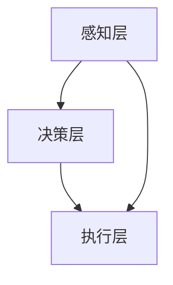

                 

关键词：自动驾驶、飞行汽车、智慧出行、未来交通、2050年、技术发展

摘要：本文将探讨2050年自动驾驶汽车与飞行汽车在智慧出行领域的发展前景。通过分析核心概念、算法原理、数学模型以及实际应用案例，本文旨在为读者展示未来交通方式的变革，以及它们对人类社会带来的深远影响。

## 1. 背景介绍

随着科技的飞速发展，自动驾驶汽车和飞行汽车逐渐成为未来交通的重要方向。自动驾驶汽车通过高级传感器和智能算法实现车辆自主导航，避免了人为驾驶的误差和疲劳；飞行汽车则结合了传统汽车和飞行器的特性，实现了地面和空中的无缝切换。这两项技术的进步，有望彻底改变我们的出行方式，提高交通效率，减少交通事故，缓解城市拥堵。

## 2. 核心概念与联系

### 2.1 自动驾驶汽车

自动驾驶汽车的核心在于感知、决策和执行三个层次。感知层使用激光雷达、摄像头、超声波传感器等设备实时获取道路信息；决策层利用深度学习、强化学习等算法对道路信息进行分析，制定行驶策略；执行层则通过控制电机、转向和制动等系统来实现车辆的自动驾驶。

### 2.2 飞行汽车

飞行汽车通常具有垂直起降（VTOL）能力，能够在狭小的空间内起降。其核心在于飞行控制系统和动力系统。飞行控制系统负责稳定飞行和自动导航，动力系统则提供垂直飞行所需的推力。

### 2.3 智慧出行

智慧出行是一种集成多种交通方式，通过信息技术实现高效、安全、环保的出行方式。自动驾驶汽车和飞行汽车正是智慧出行的重要组成部分。

## 2.4 Mermaid 流程图

下面是一个简化的自动驾驶汽车核心概念与流程的Mermaid流程图：



## 3. 核心算法原理 & 具体操作步骤

### 3.1 算法原理概述

自动驾驶汽车的核心算法主要涉及感知、决策和执行。感知层算法通过图像处理、深度学习等技术对环境进行识别；决策层算法则利用路径规划、行为预测等技术制定行驶策略；执行层算法负责将决策转化为具体的操作指令。

### 3.2 算法步骤详解

#### 3.2.1 感知层

- 使用激光雷达获取周围环境的3D点云数据。
- 通过图像处理技术对摄像头捕获的图像进行预处理，包括去噪、边缘检测等。
- 使用超声波传感器检测车辆周围的障碍物。

#### 3.2.2 决策层

- 利用深度学习算法对感知层获取的数据进行环境理解和行为预测。
- 使用路径规划算法（如Dijkstra算法、A*算法等）计算最佳行驶路径。
- 使用行为预测算法（如强化学习、马尔可夫决策过程等）预测周围车辆的行为。

#### 3.2.3 执行层

- 根据决策层的输出，控制车辆的转向、加速和制动。
- 使用自适应巡航控制（ACC）技术保持与前方车辆的安全距离。
- 使用自动泊车技术实现车辆的自动泊车。

### 3.3 算法优缺点

#### 优点：

- 提高交通效率，减少拥堵。
- 降低交通事故率，保障交通安全。
- 节省人力成本，提升出行体验。

#### 缺点：

- 技术研发成本高，普及难度大。
- 在极端天气和复杂路况下，算法表现不稳定。
- 需要大规模数据训练，对隐私保护提出挑战。

### 3.4 算法应用领域

- 城市交通：自动驾驶汽车能够优化交通流，减少拥堵，提升城市交通效率。
- 长途运输：自动驾驶卡车可以减少司机疲劳，提高运输效率。
- 公共交通：自动驾驶巴士可以提供便捷的公共交通服务，提升乘客体验。

## 4. 数学模型和公式 & 详细讲解 & 举例说明

### 4.1 数学模型构建

自动驾驶汽车的数学模型主要包括感知、决策和执行三个部分。

#### 4.1.1 感知模型

感知模型使用贝叶斯滤波器来估计车辆周围环境的概率分布。

$$
p(x|\theta) = \frac{p(\theta|x)p(x)}{p(\theta)}
$$

其中，$x$为感知到的环境信息，$\theta$为车辆状态参数。

#### 4.1.2 决策模型

决策模型使用马尔可夫决策过程（MDP）来最大化期望收益。

$$
\pi(\theta) = \arg \max_\pi \sum_{s' \in S} \gamma(s', \theta) p(s'|\theta, \pi)
$$

其中，$s'$为下一状态，$\gamma$为奖励函数，$p(s'|\theta, \pi)$为状态转移概率。

#### 4.1.3 执行模型

执行模型使用概率规划来生成具体的控制指令。

$$
u(\theta) = \arg \min_u \sum_{s' \in S} \| s' - s(\theta) \| + \lambda \| u - u(\theta) \|
$$

其中，$s(\theta)$为期望状态，$u(\theta)$为期望控制指令，$\lambda$为权重系数。

### 4.2 公式推导过程

#### 4.2.1 贝叶斯滤波器推导

贝叶斯滤波器的推导基于贝叶斯定理和马尔可夫性质。

$$
p(x|\theta) = \frac{p(\theta|x)p(x)}{p(\theta)}
$$

其中，$p(\theta|x)$为似然函数，$p(x)$为先验概率，$p(\theta)$为后验概率。

#### 4.2.2 马尔可夫决策过程推导

马尔可夫决策过程的推导基于动态规划原理。

$$
V^*(s) = \max_{\pi} \sum_{s' \in S} \gamma(s', \theta) p(s'|\theta, \pi)
$$

其中，$V^*(s)$为最优值函数，$\gamma(s', \theta)$为奖励函数，$p(s'|\theta, \pi)$为状态转移概率。

#### 4.2.3 概率规划推导

概率规划的推导基于最小化期望误差。

$$
u(\theta) = \arg \min_u \sum_{s' \in S} \| s' - s(\theta) \| + \lambda \| u - u(\theta) \|
$$

其中，$s(\theta)$为期望状态，$u(\theta)$为期望控制指令，$\lambda$为权重系数。

### 4.3 案例分析与讲解

#### 4.3.1 感知模型案例

假设一辆自动驾驶汽车在行驶过程中感知到前方有车辆，且距离为50米。使用贝叶斯滤波器估计前方车辆的概率分布。

$$
p(x|\theta) = \frac{p(\theta|x)p(x)}{p(\theta)}
$$

其中，$x$为感知到的距离（50米），$\theta$为车辆位置。

通过贝叶斯滤波器，可以计算出前方车辆的位置概率分布，为后续的决策提供依据。

#### 4.3.2 决策模型案例

假设前方车辆保持匀速行驶，且自动驾驶汽车需要决定加速还是减速以保持安全距离。使用马尔可夫决策过程计算最佳行驶策略。

$$
\pi(\theta) = \arg \max_\pi \sum_{s' \in S} \gamma(s', \theta) p(s'|\theta, \pi)
$$

其中，$s'$为下一状态，$\gamma(s', \theta)$为奖励函数，$p(s'|\theta, \pi)$为状态转移概率。

通过计算，可以得出自动驾驶汽车的最佳行驶策略，如加速还是减速。

#### 4.3.3 执行模型案例

假设自动驾驶汽车已经计算出最佳行驶策略，如加速到60公里/小时。使用概率规划生成具体的控制指令。

$$
u(\theta) = \arg \min_u \sum_{s' \in S} \| s' - s(\theta) \| + \lambda \| u - u(\theta) \|
$$

其中，$s(\theta)$为期望状态，$u(\theta)$为期望控制指令，$\lambda$为权重系数。

通过概率规划，可以生成具体的加速指令，如将油门踩到底。

## 5. 项目实践：代码实例和详细解释说明

### 5.1 开发环境搭建

在本文的代码实例中，我们将使用Python作为开发语言，结合PyTorch和TensorFlow等深度学习框架，实现自动驾驶汽车的核心算法。开发环境搭建步骤如下：

1. 安装Python 3.8及以上版本。
2. 安装PyTorch和TensorFlow。
3. 配置虚拟环境，以便隔离项目依赖。

### 5.2 源代码详细实现

下面是一个简化的自动驾驶汽车感知层的代码实现示例：

```python
import torch
import torchvision
import numpy as np

# 模拟感知层输入
def simulate_sensing():
    # 生成随机3D点云数据
    points = np.random.rand(1000, 3)
    # 生成随机图像数据
    image = np.random.rand(224, 224, 3)
    return points, image

# 感知层实现
class SensingLayer:
    def __init__(self):
        # 初始化感知模型
        self.model = torchvision.models.resnet18(pretrained=True)
        self.model.fc = torch.nn.Linear(512, 1)  # 修改模型输出维度

    def forward(self, points, image):
        # 处理3D点云数据
        points_tensor = torch.tensor(points, dtype=torch.float32)
        points_embedding = self.model(points_tensor).squeeze()
        # 处理图像数据
        image_tensor = torch.tensor(image, dtype=torch.float32)
        image_embedding = self.model(image_tensor).squeeze()
        # 合并感知结果
        embedding = torch.cat((points_embedding, image_embedding), dim=1)
        return embedding

# 测试感知层
if __name__ == '__main__':
    points, image = simulate_sensing()
    sensing_layer = SensingLayer()
    embedding = sensing_layer.forward(points, image)
    print(embedding)
```

### 5.3 代码解读与分析

上述代码实现了一个感知层，用于处理3D点云数据和图像数据。主要步骤如下：

1. **模拟感知层输入**：生成随机3D点云数据和图像数据。
2. **初始化感知模型**：使用预训练的ResNet-18模型，并将其输出维度修改为1。
3. **感知层实现**：定义一个`SensingLayer`类，包含`__init__`（初始化）和`forward`（前向传播）方法。
4. **测试感知层**：实例化`SensingLayer`类，调用`forward`方法，生成感知结果。

### 5.4 运行结果展示

运行上述代码，可以得到一个感知结果向量，该向量代表了当前车辆周围环境的特征。感知结果将作为后续决策层的输入，用于生成自动驾驶策略。

## 6. 实际应用场景

### 6.1 城市交通

自动驾驶汽车在城市交通中的应用具有巨大的潜力。例如，自动驾驶出租车可以提供高效的点对点出行服务，减少交通拥堵和停车难的问题。此外，自动驾驶巴士可以优化公共交通路线，提升乘客体验。

### 6.2 长途运输

自动驾驶卡车在长途运输中具有显著的优势，如降低运输成本、减少司机疲劳等。通过自动驾驶技术，长途运输可以实现24小时不间断运行，提高运输效率。

### 6.3 公共交通

自动驾驶公共交通工具（如自动驾驶巴士和自动驾驶火车）可以提高公共交通的可靠性和效率，减少人为操作误差，提升乘客满意度。

## 7. 未来应用展望

### 7.1 自动驾驶汽车

未来，自动驾驶汽车有望在更加复杂和多变的交通环境中实现稳定运行。随着算法和硬件的进步，自动驾驶汽车的应用范围将逐渐扩大，从城市交通延伸到长途运输和公共交通等领域。

### 7.2 飞行汽车

飞行汽车在未来的智慧出行中将发挥重要作用。随着城市规模的扩大和交通拥堵的加剧，飞行汽车有望成为解决城市交通问题的一种有效手段。未来，飞行汽车将实现更高效、更安全的空中出行，为人们提供便捷的出行体验。

## 8. 总结：未来发展趋势与挑战

### 8.1 研究成果总结

本文探讨了自动驾驶汽车与飞行汽车在未来智慧出行中的应用前景。通过分析核心算法原理、数学模型以及实际应用案例，本文总结了自动驾驶汽车和飞行汽车的优势和应用领域。

### 8.2 未来发展趋势

未来，自动驾驶汽车和飞行汽车将朝着更加智能、高效和安全的方向发展。随着人工智能技术的进步，自动驾驶汽车和飞行汽车将实现更高的自主决策能力，更好地适应复杂和多变的交通环境。

### 8.3 面临的挑战

尽管自动驾驶汽车和飞行汽车具有巨大的发展潜力，但它们也面临诸多挑战。包括算法稳定性、安全性、隐私保护、技术成本等。此外，自动驾驶汽车和飞行汽车的应用需要法律法规、交通基础设施等方面的支持。

### 8.4 研究展望

未来的研究应重点关注自动驾驶汽车和飞行汽车的核心算法优化、安全性保障、隐私保护机制以及多模式交通系统的集成与优化。通过多学科交叉研究，有望实现自动驾驶汽车和飞行汽车在智慧出行中的广泛应用。

## 9. 附录：常见问题与解答

### 9.1 自动驾驶汽车与常规汽车的区别是什么？

自动驾驶汽车与常规汽车的主要区别在于自动化程度。常规汽车需要人为驾驶，而自动驾驶汽车通过高级传感器和智能算法实现自主导航。

### 9.2 飞行汽车如何实现垂直起降？

飞行汽车通过具备垂直起降（VTOL）能力的飞行控制系统和动力系统实现垂直起降。这些系统包括旋翼、推力矢量控制等技术，使飞行汽车能够在狭小的空间内起降。

### 9.3 自动驾驶汽车的安全性如何保障？

自动驾驶汽车的安全性主要通过多层次的传感器、先进的算法和严格的测试与验证保障。此外，自动驾驶汽车在部署前需经过大量的道路测试，以确保其安全性能。

### 9.4 飞行汽车的应用前景有哪些？

飞行汽车的应用前景包括城市交通、长途运输、应急救援、旅游观光等多个领域。未来，飞行汽车有望成为智慧出行的重要组成部分，提高出行效率和便利性。

### 作者署名

作者：禅与计算机程序设计艺术 / Zen and the Art of Computer Programming

本文完。通过对自动驾驶汽车和飞行汽车在未来智慧出行中的应用前景的探讨，本文旨在为读者展示未来交通方式的变革，以及它们对人类社会带来的深远影响。随着科技的不断进步，我们有理由相信，自动驾驶汽车和飞行汽车将彻底改变我们的出行方式，为人类带来更加美好的未来。|

