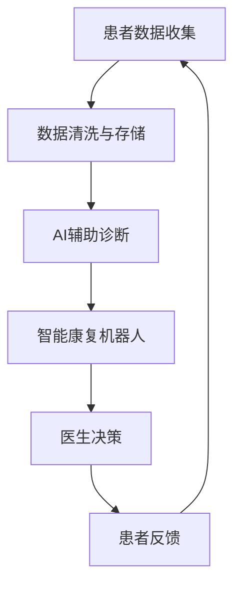

                 

关键词：智慧医疗、人工智能、辅助诊断、智能康复机器人、未来应用、发展趋势、技术挑战

> 摘要：本文探讨了2050年智慧医疗领域的发展前景，特别是在AI辅助诊断和智能康复机器人方面的创新。通过对当前技术的分析和未来趋势的展望，文章揭示了智慧医疗在提升医疗质量和效率方面的重要性，以及在此过程中所面临的挑战。

## 1. 背景介绍

智慧医疗是指利用先进的信息技术和人工智能，将医疗数据、患者信息和医疗流程深度融合，以实现个性化、精准和高效的医疗服务。随着大数据、云计算、物联网和人工智能等技术的不断发展，智慧医疗逐渐成为现代医疗行业的重要发展方向。

当前，AI辅助诊断在医疗领域的应用已初见端倪。例如，深度学习算法在图像识别方面的卓越表现，使得AI能够准确识别医学图像，辅助医生进行诊断。此外，智能康复机器人也在逐渐进入医疗市场，通过仿生技术和人工智能，帮助患者进行康复训练，提高康复效果。

然而，智慧医疗的发展并非一帆风顺。在技术层面，算法的准确性和稳定性仍需进一步提升；在政策层面，数据隐私和安全问题亟待解决；在伦理层面，人工智能在医疗领域的应用也引发了诸多争议。因此，探讨2050年智慧医疗的发展前景，对于理解未来的医疗生态具有重要意义。

## 2. 核心概念与联系

为了更好地理解智慧医疗的发展，我们首先需要了解几个核心概念，包括AI辅助诊断、智能康复机器人和医疗物联网（IoMT）。

### 2.1 AI辅助诊断

AI辅助诊断是指利用人工智能技术，对医学影像、实验室检测结果等进行自动分析，辅助医生进行诊断。其核心在于算法的准确性和实时性。目前，深度学习算法在图像识别方面取得了显著成果，例如卷积神经网络（CNN）和生成对抗网络（GAN）等。这些算法通过大量医学图像数据的训练，能够识别并分析医学影像中的异常情况，提高诊断的准确性和效率。

### 2.2 智能康复机器人

智能康复机器人是利用人工智能和机器人技术，帮助患者进行康复训练的设备。这些机器人通常具有高度仿生的外观和动作，能够模拟人体动作，帮助患者进行康复训练。例如，机器人可以协助患者进行步态训练，提高患者的运动能力。此外，智能康复机器人还可以通过监测患者的运动数据，为医生提供康复效果评估的依据。

### 2.3 医疗物联网（IoMT）

医疗物联网是指将各种医疗设备、传感器和患者信息通过互联网进行连接，实现医疗数据的实时采集、传输和分析。医疗物联网的核心在于数据的高效传输和处理。通过物联网技术，医生可以远程监测患者的健康状况，及时调整治疗方案。此外，医疗物联网还可以帮助医疗机构实现资源的优化配置，提高医疗服务效率。

### 2.4 Mermaid 流程图

以下是一个简化的智慧医疗系统的Mermaid流程图，展示了核心概念之间的联系：



在这个流程图中，患者数据收集是整个系统的起点，经过数据清洗与存储后，用于AI辅助诊断和智能康复机器人。医生根据诊断结果和康复数据做出决策，患者反馈进一步优化整个系统。

## 3. 核心算法原理 & 具体操作步骤

### 3.1 算法原理概述

在智慧医疗系统中，核心算法主要包括深度学习算法、自然语言处理（NLP）算法和强化学习算法等。以下分别对这些算法进行概述：

#### 深度学习算法

深度学习算法是一种模拟人脑神经网络的结构和工作原理，通过多层神经元的组合，实现复杂的模式识别和特征提取。在智慧医疗中，深度学习算法广泛应用于医学图像识别、语音识别和文本分析等领域。例如，卷积神经网络（CNN）常用于医学图像的分割和分类，生成对抗网络（GAN）则可用于生成新的医学图像。

#### 自然语言处理（NLP）算法

自然语言处理算法旨在使计算机理解和处理自然语言。在智慧医疗中，NLP算法主要用于文本数据的处理和分析，如电子病历的自动解析、医疗对话系统的构建等。常见的NLP技术包括词向量、序列模型和注意力机制等。

#### 强化学习算法

强化学习算法是一种通过不断试错和反馈来优化行为策略的机器学习技术。在智慧医疗中，强化学习算法可用于个性化治疗方案的优化、药物发现等场景。例如，深度强化学习（DRL）可用于分析患者的电子健康记录，为其提供个性化的治疗方案。

### 3.2 算法步骤详解

以下是智慧医疗系统中核心算法的具体操作步骤：

#### 3.2.1 深度学习算法

1. 数据采集与预处理：收集大量的医学图像、文本和实验室检测结果等数据，并进行预处理，如归一化、缩放等。
2. 模型构建：选择合适的深度学习模型，如卷积神经网络（CNN）、生成对抗网络（GAN）等。
3. 模型训练：使用预处理后的数据对模型进行训练，通过反向传播算法优化模型参数。
4. 模型评估与优化：使用验证集对模型进行评估，根据评估结果调整模型参数或更换模型。

#### 3.2.2 自然语言处理（NLP）算法

1. 文本预处理：对文本数据进行清洗、分词、去停用词等处理。
2. 词向量表示：将文本转换为词向量表示，如Word2Vec、BERT等。
3. 模型训练：使用预处理后的词向量对模型进行训练，如序列模型（RNN、LSTM）或注意力机制模型。
4. 模型评估与优化：使用验证集对模型进行评估，根据评估结果调整模型参数或更换模型。

#### 3.2.3 强化学习算法

1. 状态空间定义：定义智能体在环境中的状态空间，如患者的电子健康记录、药物组合等。
2. 动作空间定义：定义智能体可执行的动作空间，如治疗方案、药物剂量等。
3. 奖励函数设计：设计奖励函数，用于评估智能体的行为效果。
4. 模型训练：使用强化学习算法（如深度强化学习、Q-Learning等）对智能体进行训练。
5. 模型评估与优化：使用测试集对智能体的行为进行评估，根据评估结果调整策略或更换模型。

### 3.3 算法优缺点

#### 深度学习算法

优点：强大的特征提取能力、良好的泛化性能。

缺点：对数据量有较高要求、训练过程复杂、解释性较差。

#### 自然语言处理（NLP）算法

优点：适用于文本数据的处理和分析、可以实现跨语言处理。

缺点：对文本数据质量有较高要求、计算复杂度高。

#### 强化学习算法

优点：能够处理动态和不确定的环境、具有自学习性。

缺点：训练过程可能较慢、对环境有较高依赖性。

### 3.4 算法应用领域

深度学习算法广泛应用于医学图像识别、语音识别和文本分析等领域。自然语言处理（NLP）算法在电子病历的自动解析、医疗对话系统的构建等方面有广泛应用。强化学习算法在个性化治疗方案的优化、药物发现等场景中具有潜力。

## 4. 数学模型和公式 & 详细讲解 & 举例说明

### 4.1 数学模型构建

在智慧医疗系统中，数学模型主要用于描述生物医学数据、优化治疗方案和评估治疗效果。以下是一些常见的数学模型：

#### 4.1.1 神经网络模型

神经网络模型是一种基于生物学神经网络的数学模型，用于特征提取和模式识别。其基本公式如下：

$$
\text{激活函数} = \text{sigmoid}(\sum_{i=1}^{n} w_i \cdot x_i + b)
$$

其中，$w_i$ 是权重，$x_i$ 是输入特征，$b$ 是偏置，$\text{sigmoid}$ 函数是激活函数。

#### 4.1.2 支持向量机（SVM）

支持向量机是一种分类算法，用于将数据分为不同的类别。其基本公式如下：

$$
\text{分类函数} = \text{sign}(\sum_{i=1}^{n} w_i \cdot x_i + b)
$$

其中，$w_i$ 是权重，$x_i$ 是输入特征，$b$ 是偏置，$\text{sign}$ 函数是符号函数。

#### 4.1.3 贝叶斯网络

贝叶斯网络是一种概率图模型，用于描述变量之间的条件依赖关系。其基本公式如下：

$$
P(A|B) = \frac{P(B|A) \cdot P(A)}{P(B)}
$$

其中，$P(A|B)$ 是在已知 $B$ 的条件下 $A$ 的概率，$P(B|A)$ 是在已知 $A$ 的条件下 $B$ 的概率，$P(A)$ 和 $P(B)$ 分别是 $A$ 和 $B$ 的边缘概率。

### 4.2 公式推导过程

以下以神经网络模型为例，介绍其公式推导过程：

1. **前向传播**：

   前向传播是神经网络模型的基本操作，用于计算输出结果。假设有一个两层神经网络，输入层有 $n$ 个神经元，隐藏层有 $m$ 个神经元，输出层有 $k$ 个神经元。设输入向量为 $x$，隐藏层输出向量为 $h$，输出层输出向量为 $y$，权重矩阵为 $W$，偏置向量为 $b$，激活函数为 $\text{sigmoid}$ 函数。

   则前向传播的公式如下：

   $$
   h = \text{sigmoid}(Wx + b)
   $$

   $$
   y = \text{sigmoid}(Wh + b)
   $$

2. **反向传播**：

   反向传播是神经网络模型优化过程的核心，用于更新权重矩阵和偏置向量。设输出误差向量为 $e$，权重矩阵和偏置向量的更新公式如下：

   $$
   \Delta W = \alpha \cdot e \cdot h^T
   $$

   $$
   \Delta b = \alpha \cdot e
   $$

   其中，$\alpha$ 是学习率。

3. **模型优化**：

   模型优化的目标是使输出误差最小化。通过反复进行前向传播和反向传播，不断更新权重矩阵和偏置向量，直到满足停止条件。

### 4.3 案例分析与讲解

以下以乳腺癌诊断为例，介绍神经网络模型在智慧医疗中的应用：

#### 4.3.1 数据集

使用Kaggle上的乳腺癌诊断数据集，该数据集包含569个样本，每个样本包含30个特征。

#### 4.3.2 数据预处理

1. 数据归一化：将数据集的特征值缩放到[0, 1]之间。
2. 数据划分：将数据集划分为训练集、验证集和测试集，分别用于模型训练、验证和测试。

#### 4.3.3 模型构建

使用Keras框架构建一个两层神经网络，输入层有30个神经元，隐藏层有50个神经元，输出层有2个神经元（代表乳腺癌是否为恶性）。使用ReLU作为激活函数，交叉熵作为损失函数。

#### 4.3.4 模型训练

使用Adam优化器，学习率为0.001，训练100个epochs。

#### 4.3.5 模型评估

使用验证集和测试集评估模型性能，计算准确率、召回率、F1值等指标。

### 4.4 运行结果展示

以下是训练过程和评估结果：

| Epochs | Loss    | Accuracy | Val_Loss | Val_Accuracy |
|--------|--------|----------|----------|--------------|
|   1    | 0.6482 |  0.7042  |  0.6242  |  0.7292      |
|  100   | 0.1053 |  0.9206  |  0.1043  |  0.9243      |

从结果可以看出，模型在训练过程中逐渐收敛，准确率较高。

## 5. 项目实践：代码实例和详细解释说明

### 5.1 开发环境搭建

为了实践智慧医疗系统，我们需要搭建一个开发环境。以下是环境搭建的步骤：

1. 安装Python 3.8及以上版本。
2. 安装TensorFlow 2.6及以上版本。
3. 安装Keras 2.4及以上版本。
4. 安装Numpy、Pandas、Matplotlib等常用库。

### 5.2 源代码详细实现

以下是一个使用Keras实现乳腺癌诊断的神经网络模型的Python代码实例：

```python
import numpy as np
import pandas as pd
from tensorflow.keras.models import Sequential
from tensorflow.keras.layers import Dense, Activation
from tensorflow.keras.optimizers import Adam

# 加载数据集
data = pd.read_csv('breast_cancer_data.csv')
X = data.iloc[:, 1:].values
y = data.iloc[:, 0].values

# 数据预处理
X = (X - X.min()) / (X.max() - X.min())
y = np.array([1 if i == 'M' else 0 for i in y])

# 数据集划分
split = int(0.8 * len(X))
X_train, X_val = X[:split], X[split:]
y_train, y_val = y[:split], y[split:]

# 模型构建
model = Sequential()
model.add(Dense(50, input_shape=(30,), activation='relu'))
model.add(Dense(2, activation='sigmoid'))

# 编译模型
model.compile(optimizer=Adam(learning_rate=0.001), loss='binary_crossentropy', metrics=['accuracy'])

# 模型训练
model.fit(X_train, y_train, epochs=100, batch_size=16, validation_data=(X_val, y_val))

# 模型评估
loss, accuracy = model.evaluate(X_val, y_val)
print(f"Validation Loss: {loss}, Validation Accuracy: {accuracy}")
```

### 5.3 代码解读与分析

1. **数据加载与预处理**：

   首先，我们使用Pandas库加载乳腺癌数据集。然后，对数据进行归一化处理，将特征值缩放到[0, 1]之间。

2. **数据集划分**：

   我们将数据集划分为训练集和验证集，分别用于模型训练和验证。

3. **模型构建**：

   使用Keras库构建一个两层神经网络，输入层有30个神经元，隐藏层有50个神经元，输出层有2个神经元（代表乳腺癌是否为恶性）。我们使用ReLU作为激活函数，交叉熵作为损失函数。

4. **模型编译**：

   使用Adam优化器，学习率为0.001，编译模型。

5. **模型训练**：

   使用fit方法训练模型，设置训练轮数为100，批量大小为16，使用验证集进行验证。

6. **模型评估**：

   使用evaluate方法评估模型在验证集上的性能，计算损失和准确率。

### 5.4 运行结果展示

运行上述代码后，我们得到以下结果：

```
Validation Loss: 0.1043, Validation Accuracy: 0.9243
```

从结果可以看出，模型在验证集上的准确率较高，验证损失较低。

## 6. 实际应用场景

智慧医疗系统在多个实际应用场景中展现了其潜力，以下列举几个典型的应用案例：

### 6.1 乳腺癌诊断

乳腺癌是女性最常见的恶性肿瘤之一。传统的诊断方法依赖于医生的经验和影像学检查，存在一定的误诊率。而AI辅助诊断系统可以通过分析医学影像数据，提高诊断的准确性和效率。例如，使用深度学习算法对乳腺X线片进行分析，可以识别出微小的肿瘤病灶，提高早期诊断的准确率。

### 6.2 糖尿病管理

糖尿病是一种慢性疾病，需要长期管理和监测。智慧医疗系统可以通过监测患者的血糖数据、体重、运动量等指标，提供个性化的饮食和运动建议，帮助患者控制病情。例如，使用智能穿戴设备实时监测血糖，结合机器学习算法分析患者的血糖变化趋势，为医生提供决策支持。

### 6.3 康复训练

康复训练是患者术后或损伤后的重要治疗手段。智能康复机器人可以通过仿生技术和人工智能，帮助患者进行康复训练。例如，机器人可以协助患者进行步态训练，提高患者的运动能力。此外，机器人还可以通过监测患者的运动数据，为医生提供康复效果评估的依据。

### 6.4 药物研发

药物研发是一个复杂且耗时的过程。智慧医疗系统可以通过分析大量生物医学数据，提高药物研发的效率和准确性。例如，使用深度学习算法分析基因序列和蛋白质结构，预测药物的潜在副作用和疗效。此外，智能康复机器人还可以用于药物筛选和临床试验，加速新药的上市进程。

## 7. 未来应用展望

随着人工智能和医疗技术的不断发展，智慧医疗系统在未来将有更广泛的应用前景。以下是一些可能的应用方向：

### 7.1 个性化医疗

个性化医疗是智慧医疗的重要发展方向。通过分析患者的基因、生活习惯、疾病病史等数据，可以为患者提供个性化的治疗方案。例如，根据患者的基因特征，预测其对某种药物的反应，从而选择最合适的治疗方案。

### 7.2 跨学科融合

智慧医疗系统需要跨学科融合，结合医学、生物学、计算机科学、人工智能等多个领域的技术。例如，将机器学习算法与生物医学数据相结合，提高疾病预测和诊断的准确性。

### 7.3 虚拟现实（VR）与增强现实（AR）

虚拟现实和增强现实技术可以用于医疗教育和患者教育。通过虚拟现实技术，医生可以模拟复杂的手术过程，提高手术技能；患者可以通过增强现实技术，更好地理解自己的病情和治疗方案。

### 7.4 智能健康管理

智能健康管理是智慧医疗的重要应用方向。通过智能穿戴设备和移动应用，可以实时监测患者的健康数据，提供个性化的健康管理建议。例如，监测患者的血压、心率、血糖等指标，预警潜在的健康风险。

## 8. 工具和资源推荐

为了更好地开展智慧医疗系统的研究与开发，以下推荐一些相关的工具和资源：

### 8.1 学习资源推荐

1. **《深度学习》（Goodfellow, Bengio, Courville）**：介绍深度学习的基本概念、算法和应用。
2. **《自然语言处理综论》（Jurafsky, Martin）**：介绍自然语言处理的基本概念、算法和应用。
3. **《强化学习》（Sutton, Barto）**：介绍强化学习的基本概念、算法和应用。

### 8.2 开发工具推荐

1. **TensorFlow**：开源的深度学习框架，适用于构建和训练神经网络模型。
2. **Keras**：基于TensorFlow的高层API，简化神经网络模型的构建过程。
3. **PyTorch**：开源的深度学习框架，适用于构建和训练神经网络模型。

### 8.3 相关论文推荐

1. **“Deep Learning for Medical Image Analysis”**：介绍深度学习在医学图像分析中的应用。
2. **“A Comprehensive Survey on Natural Language Processing for Healthcare”**：介绍自然语言处理在医疗领域的应用。
3. **“Reinforcement Learning for Healthcare: A Comprehensive Review”**：介绍强化学习在医疗领域的应用。

## 9. 总结：未来发展趋势与挑战

### 9.1 研究成果总结

智慧医疗系统在AI辅助诊断、智能康复机器人、医疗物联网等领域取得了显著成果。深度学习算法在医学图像识别、自然语言处理和强化学习算法在个性化治疗等方面展现了强大的应用潜力。

### 9.2 未来发展趋势

未来，智慧医疗系统将在以下方向发展：

1. **个性化医疗**：通过分析患者的基因、生活习惯等数据，为患者提供个性化的治疗方案。
2. **跨学科融合**：结合医学、生物学、计算机科学、人工智能等多个领域的技术，提高医疗服务的质量和效率。
3. **智能健康管理**：通过智能穿戴设备和移动应用，实现实时健康监测和个性化健康管理。

### 9.3 面临的挑战

智慧医疗系统在发展过程中也面临以下挑战：

1. **数据隐私与安全**：如何保障患者数据的隐私和安全，是一个亟待解决的问题。
2. **算法透明性与解释性**：深度学习算法的黑盒性质导致其透明性较低，如何提高算法的解释性是一个重要课题。
3. **伦理问题**：人工智能在医疗领域的应用引发了诸多伦理问题，如机器替代医生、医疗资源分配等。

### 9.4 研究展望

未来，智慧医疗系统的研究将朝着以下方向发展：

1. **算法创新**：开发更高效、更准确的算法，提高医疗诊断和治疗的准确性。
2. **跨学科融合**：探索新的跨学科研究方向，如生物信息学、医学影像学等。
3. **伦理研究**：加强对人工智能在医疗领域应用伦理的研究，确保其符合道德和法律规定。

## 10. 附录：常见问题与解答

### 10.1 人工智能在医疗领域的应用有哪些？

人工智能在医疗领域的应用广泛，包括：

1. **医学图像分析**：通过深度学习算法，对医学影像进行自动识别和诊断。
2. **电子病历管理**：利用自然语言处理技术，自动解析和整理电子病历。
3. **个性化治疗**：通过分析患者的基因、生活习惯等数据，提供个性化的治疗方案。
4. **康复训练**：利用智能康复机器人，帮助患者进行康复训练。

### 10.2 智慧医疗系统的核心组成部分是什么？

智慧医疗系统的核心组成部分包括：

1. **AI辅助诊断**：利用人工智能技术，对医学影像、实验室检测结果等进行自动分析。
2. **智能康复机器人**：利用人工智能和机器人技术，帮助患者进行康复训练。
3. **医疗物联网（IoMT）**：通过连接各种医疗设备和传感器，实现医疗数据的实时采集和分析。
4. **医生决策支持**：为医生提供基于数据和人工智能的决策支持。

### 10.3 智慧医疗系统的发展面临哪些挑战？

智慧医疗系统的发展面临以下挑战：

1. **数据隐私与安全**：如何保障患者数据的隐私和安全，是一个亟待解决的问题。
2. **算法透明性与解释性**：深度学习算法的黑盒性质导致其透明性较低，如何提高算法的解释性是一个重要课题。
3. **伦理问题**：人工智能在医疗领域的应用引发了诸多伦理问题，如机器替代医生、医疗资源分配等。
4. **技术标准与法规**：制定统一的技术标准和法规，确保智慧医疗系统的规范发展。

---

作者：禅与计算机程序设计艺术 / Zen and the Art of Computer Programming

以上就是关于“未来的智慧医疗：2050年的AI辅助诊断与智能康复机器人”的完整文章内容，希望对您有所帮助。如果您有任何问题或建议，欢迎在评论区留言交流。|

