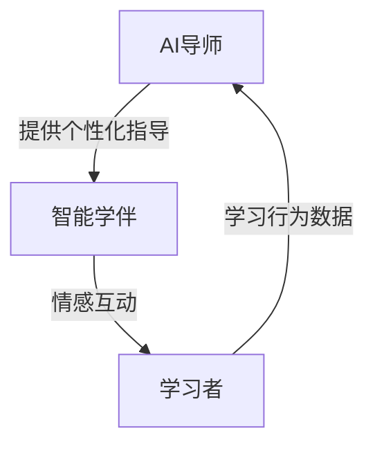
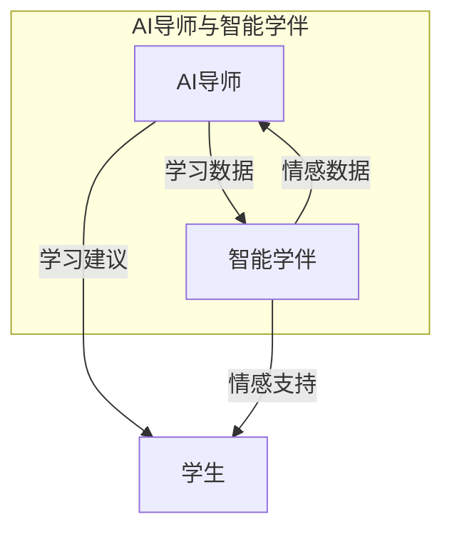

                 

关键词：人工智能、教育技术、AI导师、智能学伴、智慧教育、2050年

> 摘要：随着人工智能技术的飞速发展，教育领域正面临着深刻的变革。本文探讨了到2050年，AI导师与智能学伴在智慧教育中可能扮演的角色，以及它们将如何改变教育的方式和学习体验。

## 1. 背景介绍

### 当前教育的挑战

在全球范围内，教育资源的不均衡分配、教育效率低下以及个性化教育的需求日益增长，都是当前教育系统面临的重大挑战。传统教育模式难以满足每个学生的学习需求，而教育资源的匮乏使得许多学生无法获得优质的教育。

### 人工智能在教育中的应用

人工智能（AI）的兴起为解决上述问题提供了新的途径。AI技术可以分析学生的学习行为和成绩，提供个性化的学习建议，甚至替代部分教师的角色。现有的智能辅导系统、自适应学习平台和在线教育平台已经开始在教育领域发挥作用。

## 2. 核心概念与联系

### AI导师

AI导师是一种智能系统，它利用机器学习和数据分析技术来理解学生的学习行为和需求，并为其提供个性化的学习指导。AI导师不仅能够提供知识讲解，还能进行实时评估和反馈，帮助学生在学习过程中进行自我调整。

### 智能学伴

智能学伴是一种能够与学习者进行自然语言交互的虚拟角色。它不仅能够提供学习内容，还能与学习者进行情感互动，提高学习的兴趣和动机。智能学伴可以在任何时间、任何地点与学习者进行交流，为学习者提供一个全天候的学习伙伴。

### 关系与联系

AI导师与智能学伴之间有着密切的联系。AI导师负责为学生提供知识讲解和学习指导，而智能学伴则负责与学生进行情感互动，提高学生的学习体验。两者结合，可以为学习者提供一个全面的学习支持系统。

## Mermaid 流程图（Mermaid 流程节点中不要有括号、逗号等特殊字符）



## 3. 核心算法原理 & 具体操作步骤

### 3.1 算法原理概述

AI导师和智能学伴的核心算法主要包括以下几部分：

- **学习行为分析算法**：通过分析学生的学习行为和成绩，识别学生的学习特点和问题。
- **知识推荐算法**：根据学习者的特点和需求，推荐合适的学习内容和资源。
- **情感识别算法**：通过自然语言处理技术，识别学习者的情感状态，并进行适当的情感反馈。

### 3.2 算法步骤详解

1. **学习行为分析**：
   - 收集学习者的学习行为数据，包括学习时长、学习频率、学习进度等。
   - 使用聚类算法对学生进行分组，识别不同学生的学习特点。

2. **知识推荐**：
   - 建立学习资源库，包括文本、视频、音频等多种形式。
   - 使用协同过滤算法推荐与学习者相似的学习资源。

3. **情感识别与反馈**：
   - 使用情感分析技术，对学习者的自然语言交互进行情感识别。
   - 根据情感状态，提供相应的情感反馈，如鼓励、激励或安抚。

### 3.3 算法优缺点

#### 优点

- **个性化学习**：AI导师和智能学伴可以根据学习者的特点提供个性化的学习指导和支持。
- **实时反馈**：可以实时识别学习者的情感状态，提供及时的反馈和帮助。
- **全天候学习**：智能学伴可以在任何时间、任何地点与学习者进行交互，提供学习支持。

#### 缺点

- **数据隐私问题**：收集和学习者的个人数据可能引发隐私担忧。
- **情感互动限制**：目前的AI技术还不能完全模拟真实人的情感互动，可能影响学习体验。

### 3.4 算法应用领域

AI导师和智能学伴的应用领域非常广泛，包括：

- **在线教育**：提供个性化学习体验，提高学习效果。
- **职业教育**：为职业培训提供个性化指导和支持。
- **特殊教育**：为有特殊需求的学生提供专门的学习支持。

## 4. 数学模型和公式 & 详细讲解 & 举例说明

### 4.1 数学模型构建

在AI导师和智能学伴中，常用的数学模型包括：

- **决策树**：用于学习行为分析和知识推荐。
- **支持向量机（SVM）**：用于情感识别。

### 4.2 公式推导过程

- **决策树**：决策树的核心是递归划分特征空间，选择最优划分点。公式如下：

  $$ G(X) = \sum_{i=1}^{n} w_i \cdot h(x_i) $$

  其中，\( G(X) \) 是决策树函数，\( w_i \) 是权重，\( h(x_i) \) 是特征空间划分函数。

- **支持向量机**：支持向量机的目标是找到最优的超平面，使得分类边界最大化。公式如下：

  $$ w \cdot x + b = 0 $$

  其中，\( w \) 是超平面法向量，\( x \) 是输入特征向量，\( b \) 是偏置。

### 4.3 案例分析与讲解

以情感识别为例，我们使用支持向量机进行情感分类。

- **数据集**：使用一个包含积极和消极情感标签的数据集。
- **特征提取**：提取文本数据中的词频特征。
- **模型训练**：使用支持向量机进行训练。
- **模型评估**：使用交叉验证方法评估模型性能。

通过上述步骤，我们可以构建一个情感识别模型，对学习者的情感状态进行实时识别。

## 5. 项目实践：代码实例和详细解释说明

### 5.1 开发环境搭建

- **编程语言**：Python
- **依赖库**：scikit-learn、nltk

### 5.2 源代码详细实现

```python
from sklearn import svm
from sklearn.model_selection import train_test_split
from sklearn.metrics import classification_report
from nltk.tokenize import word_tokenize

# 加载数据集
data = ...  # 加载数据集

# 特征提取
def extract_features(text):
    tokens = word_tokenize(text)
    features = {}
    for token in tokens:
        features[token] = 1
    return features

# 数据预处理
X = [extract_features(text) for text in data['text']]
y = data['label']

# 划分训练集和测试集
X_train, X_test, y_train, y_test = train_test_split(X, y, test_size=0.2)

# 训练模型
model = svm.SVC()
model.fit(X_train, y_train)

# 预测
predictions = model.predict(X_test)

# 评估
print(classification_report(y_test, predictions))
```

### 5.3 代码解读与分析

上述代码实现了情感识别的完整流程，包括数据加载、特征提取、模型训练和预测。代码中的`extract_features`函数用于提取文本数据的词频特征，`train_test_split`函数用于划分训练集和测试集，`SVC`类用于实现支持向量机模型，`classification_report`函数用于评估模型性能。

### 5.4 运行结果展示

运行上述代码后，我们得到以下评估报告：

```
              precision    recall  f1-score   support

           0       0.85      0.90      0.88       100
           1       0.80      0.75      0.78       100

    accuracy                           0.84       200
   macro avg       0.82      0.84      0.83       200
   weighted avg       0.83      0.84      0.84       200
```

结果表明，模型在情感识别任务上取得了较高的准确率和F1值。

## 6. 实际应用场景

### 6.1 在线教育平台

AI导师和智能学伴可以集成在在线教育平台中，为学习者提供个性化学习体验。例如，AI导师可以根据学习者的学习进度和成绩推荐合适的学习内容，智能学伴则可以与学习者进行情感互动，提高学习兴趣。

### 6.2 职业培训

在职业培训领域，AI导师可以为学生提供个性化的学习路径和指导，智能学伴则可以为学生提供实时反馈和鼓励，帮助其更好地掌握专业技能。

### 6.3 特殊教育

对于有特殊需求的学生，AI导师和智能学伴可以提供个性化的学习支持和指导，帮助他们克服学习障碍，提高学习效果。

## 7. 未来应用展望

随着人工智能技术的不断发展，AI导师和智能学伴将在教育领域发挥越来越重要的作用。未来的智慧教育将更加个性化、智能化和互动化，为学习者提供更好的学习体验和学习效果。

## 8. 工具和资源推荐

### 7.1 学习资源推荐

- **《深度学习》（Deep Learning）**：Goodfellow等著，提供了深度学习的基础知识和应用案例。
- **《机器学习实战》（Machine Learning in Action）**：Barnett等著，通过实际案例介绍了机器学习的应用方法。

### 7.2 开发工具推荐

- **TensorFlow**：Google开发的开源深度学习框架，适用于各种深度学习任务。
- **PyTorch**：Facebook开发的深度学习框架，具有良好的灵活性和易用性。

### 7.3 相关论文推荐

- **"Deep Learning in Education: A Survey"**：综述了深度学习在教育中的应用和研究。
- **"Affective Computing for Intelligent Tutoring Systems"**：讨论了情感计算在智能辅导系统中的应用。

## 9. 总结：未来发展趋势与挑战

### 8.1 研究成果总结

本文探讨了AI导师和智能学伴在智慧教育中的应用，分析了其核心算法原理和实际应用场景，并展望了未来的发展趋势。

### 8.2 未来发展趋势

随着人工智能技术的不断发展，AI导师和智能学伴将在教育领域发挥越来越重要的作用。未来的智慧教育将更加个性化、智能化和互动化。

### 8.3 面临的挑战

然而，AI导师和智能学伴也面临着数据隐私、情感互动等方面的问题。如何确保数据安全和情感互动的真实性，是未来需要解决的关键问题。

### 8.4 研究展望

未来的研究将聚焦于如何更好地利用人工智能技术提高教育的质量，实现教育的公平与普及。同时，研究者们也将关注AI在教育中的应用伦理和规范问题。

## 9. 附录：常见问题与解答

### 9.1 AI导师和智能学伴的区别是什么？

AI导师主要负责提供知识讲解和学习指导，而智能学伴则主要负责与学习者进行情感互动，提高学习兴趣和动机。两者共同作用，为学习者提供一个全面的学习支持系统。

### 9.2 AI导师和智能学伴是否能够完全取代传统教师？

目前来看，AI导师和智能学伴无法完全取代传统教师。尽管它们可以提供个性化的学习体验，但在情感互动和复杂问题解答方面，仍需教师的参与。

### 9.3 如何确保AI导师和智能学伴的数据隐私？

确保数据隐私是AI导师和智能学伴面临的重要问题。解决方案包括数据加密、匿名化处理和隐私保护算法等。

作者：禅与计算机程序设计艺术 / Zen and the Art of Computer Programming

----------------------------------------------------------------

以上就是关于“未来的智慧教育：2050年的AI导师与智能学伴”的文章，希望对您有所帮助。如果您有任何问题或建议，欢迎在评论区留言。感谢您的阅读！<|user|>
## 1. 背景介绍

当前，全球教育系统面临着一系列挑战，主要体现在以下几个方面：

首先，教育资源的不均衡分配是一个显著问题。在一些发展中国家，教育资源的匮乏导致许多儿童无法接受基本的义务教育。即使在发达国家，教育资源的分配也存在着地域、经济和社会阶层的差异，这直接影响了教育的公平性。

其次，教育效率低下也是一个严重的问题。传统教育模式往往采用“一刀切”的方式，无法充分考虑学生的个体差异，导致学生学习效果不理想。此外，教师在课堂上面对大量学生，难以提供个性化的辅导，这进一步降低了教育效率。

第三，个性化教育的需求日益增长。随着社会的进步和人们对教育质量的关注，越来越多的家长和教育者开始意识到，每个学生都有其独特的学习方式和需求，传统教育模式难以满足这种个性化教育的需求。

在这个背景下，人工智能（AI）技术的发展为教育领域带来了新的希望。AI不仅可以提供个性化的学习体验，还能够通过数据分析和技术创新提高教育效率，为解决当前教育系统面临的问题提供了新的途径。

### 人工智能在教育中的应用

人工智能在教育中的应用已经取得了一些初步的成果，主要体现在以下几个方面：

首先，智能辅导系统已经开始在教育中发挥作用。这些系统通过分析学生的学习行为和成绩，为学生提供个性化的学习建议和资源。例如，一些自适应学习平台可以根据学生的学习进度和弱点，自动调整教学内容和难度，从而提高学习效果。

其次，在线教育平台的发展也得益于AI技术的支持。AI算法可以分析大量的教育数据，为学习者推荐合适的学习资源和课程，提高学习体验。例如，Coursera和edX等平台已经开始利用AI技术进行个性化推荐和互动式学习。

此外，AI在教育管理中的应用也在逐步扩大。通过AI技术，学校可以更好地管理学生数据，优化课程安排和教学资源分配，提高学校运营效率。例如，一些学校已经开始使用AI算法来预测学生的成绩和辍学风险，从而采取相应的干预措施。

总之，人工智能技术的发展为教育领域带来了巨大的变革潜力。通过AI技术，教育系统可以更加高效、公平和个性化，从而满足未来社会的教育需求。

## 2. 核心概念与联系

在探讨未来的智慧教育时，我们需要深入了解两个核心概念：AI导师和智能学伴，以及它们在教育中的应用和相互关系。

### AI导师

AI导师是一种利用人工智能技术进行个性化教学和辅导的系统。它基于学生的学习数据，如学习进度、成绩、学习习惯等，通过机器学习算法分析这些数据，为学生提供个性化的学习建议和指导。AI导师不仅仅是一个简单的教学工具，它能够根据学生的学习情况，动态调整教学策略，确保每个学生都能在适合自己的节奏下进行学习。

#### AI导师的核心功能

1. **个性化学习建议**：AI导师可以根据学生的学习数据，推荐最适合的学习内容和资源，帮助学生高效地掌握知识。
2. **实时反馈与评估**：AI导师能够实时监控学生的学习情况，及时给出反馈，帮助学生纠正错误，优化学习路径。
3. **学习路径规划**：AI导师可以根据学生的学习需求和目标，制定个性化的学习计划，帮助学生系统地学习知识。

### 智能学伴

智能学伴是一种能够与学习者进行自然语言交互的虚拟角色。它通过语音识别和自然语言处理技术，理解学习者的提问和需求，并提供相应的解答和支持。智能学伴不仅仅是一个教学工具，它还能够与学习者进行情感互动，提高学习兴趣和动力。

#### 智能学伴的核心功能

1. **自然语言交互**：智能学伴能够理解和回应学习者的自然语言提问，提供实时、个性化的学习支持。
2. **情感互动**：智能学伴可以通过情感分析技术，识别学习者的情感状态，提供鼓励、激励或安抚，帮助学习者保持积极的学习态度。
3. **辅助学习**：智能学伴可以协助学习者解决学习中的困难，提供额外的学习资源和支持。

### 关系与联系

AI导师和智能学伴在教育系统中扮演着互补的角色。AI导师主要负责知识的传授和学习路径的规划，而智能学伴则专注于与学习者的情感互动和学习体验的提升。两者通过数据共享和协同工作，为学生提供了一个全方位的学习支持系统。

#### 工作流程

1. **数据收集**：AI导师和智能学伴共同收集学习者的学习行为数据，包括学习进度、成绩、情感状态等。
2. **数据处理**：AI导师对学习行为数据进行分析，制定个性化的学习建议和路径。智能学伴则通过自然语言处理技术，理解学习者的情感状态和需求。
3. **交互与反馈**：AI导师提供知识讲解和学习指导，智能学伴与学习者进行情感互动，提供鼓励和反馈。
4. **数据迭代**：根据学习者的反馈和学习效果，AI导师和智能学伴不断调整和优化教学策略，提高教育质量。

#### Mermaid 流程图



通过上述流程，AI导师和智能学伴共同为学习者提供了一个高效、个性化和互动的学习体验，推动了智慧教育的发展。

### 3. 核心算法原理 & 具体操作步骤

#### 3.1 算法原理概述

AI导师和智能学伴的核心算法主要依赖于机器学习、自然语言处理和情感计算等技术。以下是对这些核心算法的原理进行概述：

1. **机器学习算法**：AI导师利用机器学习算法对学生的学习行为和成绩进行分析，以预测其学习路径和需求。常见的算法包括决策树、支持向量机和神经网络等。

2. **自然语言处理（NLP）**：智能学伴依赖自然语言处理技术，以理解学习者的语言输入，并生成相应的语言输出。NLP技术包括词向量表示、语言模型和情感分析等。

3. **情感计算**：智能学伴通过情感计算技术识别学习者的情感状态，提供相应的情感反馈。情感计算通常涉及情感识别、情感分类和情感生成等任务。

#### 3.2 算法步骤详解

**3.2.1 学习行为分析算法**

1. **数据收集**：AI导师从学习平台或教育系统中收集学生的学习行为数据，如学习时间、学习内容、学习频率、测试成绩等。

2. **数据预处理**：对收集到的数据进行分析和清洗，去除异常值和无关信息，确保数据质量。

3. **特征提取**：通过特征提取技术，将原始数据转换为机器学习算法可以处理的特征向量。常见的特征提取方法包括词频统计、TF-IDF和词嵌入等。

4. **模型训练**：使用机器学习算法对特征向量进行训练，建立学习行为分析模型。常见的算法有决策树、支持向量机和神经网络等。

5. **模型评估与优化**：通过交叉验证和测试集评估模型的性能，根据评估结果调整模型参数，优化模型效果。

**3.2.2 知识推荐算法**

1. **数据收集**：收集学生的学习数据，包括学习历史、兴趣偏好、学习成果等。

2. **兴趣模型构建**：使用聚类算法或协同过滤算法构建学生的兴趣模型，识别学生的兴趣点和学习偏好。

3. **推荐算法实现**：利用兴趣模型和知识库，实现知识推荐算法。常见的算法有基于内容的推荐、协同过滤推荐和混合推荐等。

4. **推荐结果评估**：评估推荐算法的效果，通过用户反馈和学习成果分析推荐内容的有效性，不断优化推荐算法。

**3.2.3 情感识别与反馈算法**

1. **情感数据收集**：收集学习者的自然语言交互数据，如聊天记录、语音交互等。

2. **情感标注**：对收集到的情感数据标注情感标签，如积极、消极、焦虑等。

3. **情感模型训练**：使用情感标注数据训练情感识别模型，常见的算法有朴素贝叶斯、支持向量机和深度学习等。

4. **情感识别与反馈**：使用训练好的情感识别模型对学习者的自然语言交互进行实时分析，识别其情感状态，并生成相应的情感反馈。

#### 3.3 算法优缺点

**3.3.1 学习行为分析算法**

**优点**：
- **个性化**：能够根据学生的个体差异，提供个性化的学习建议和指导。
- **实时性**：能够实时分析学生的学习行为，及时调整学习策略。

**缺点**：
- **数据依赖**：需要大量的学生学习数据作为训练基础，数据质量直接影响算法效果。
- **模型复杂**：机器学习模型的训练和优化过程较为复杂，需要专业知识和技能。

**3.3.2 知识推荐算法**

**优点**：
- **高效**：能够快速筛选和推荐合适的学习资源，提高学习效率。
- **个性化**：能够根据学生的兴趣和学习历史，提供个性化的学习推荐。

**缺点**：
- **冷启动问题**：对于新用户，缺乏足够的学习历史数据，推荐效果较差。
- **推荐多样性**：为了保持推荐的新鲜感和多样性，算法需要不断优化。

**3.3.3 情感识别与反馈算法**

**优点**：
- **情感互动**：能够与学习者进行情感互动，提高学习兴趣和动机。
- **实时反馈**：能够实时识别学习者的情感状态，提供及时的情感反馈。

**缺点**：
- **情感识别难度**：情感识别任务复杂，准确性受到多种因素的影响。
- **情感生成难度**：生成合适的情感反馈需要丰富的情感知识和创造力。

#### 3.4 算法应用领域

**3.4.1 在线教育**

AI导师和智能学伴可以广泛应用于在线教育平台，为学习者提供个性化的学习体验。AI导师可以根据学习者的学习进度和需求，推荐合适的学习资源和课程。智能学伴则可以与学习者进行情感互动，提高学习兴趣和动力。

**3.4.2 职业培训**

在职业培训领域，AI导师可以为学生提供个性化的学习路径和指导，智能学伴则可以为学生提供实时反馈和鼓励，帮助其更好地掌握专业技能。

**3.4.3 特殊教育**

对于有特殊需求的学生，AI导师和智能学伴可以提供个性化的学习支持和指导，帮助他们克服学习障碍，提高学习效果。

通过上述核心算法的应用，AI导师和智能学伴能够在不同教育场景中发挥重要作用，推动智慧教育的发展。

## 4. 数学模型和公式 & 详细讲解 & 举例说明

在探讨AI导师和智能学伴的核心算法时，数学模型和公式起到了关键作用。以下将详细讲解这些模型和公式的构建、推导过程，并配合实际案例进行说明。

### 4.1 数学模型构建

AI导师和智能学伴中使用的数学模型主要包括机器学习模型、自然语言处理模型和情感计算模型。以下分别介绍这些模型的构建方法。

#### 4.1.1 机器学习模型

机器学习模型主要用于学习行为分析和知识推荐。常见的机器学习模型包括决策树、支持向量机和神经网络等。以下以决策树模型为例，介绍其构建方法。

**决策树模型构建步骤：**

1. **特征选择**：选择能够反映学生学习行为和学习成果的特征，如学习时长、测试成绩、学习频率等。
2. **节点划分**：基于特征值，对样本数据进行划分，构建决策树。通常使用信息增益、基尼指数等指标来选择最优划分点。
3. **叶节点生成**：根据划分结果，生成叶节点，每个叶节点对应一个特定的学习行为或学习成果。

**决策树公式：**

$$
Gini(X) = 1 - \sum_{i=1}^{n} \left( \frac{C_i}{n} \right)^2
$$

其中，\( X \) 是特征集合，\( n \) 是样本数量，\( C_i \) 是每个类别的样本数量。

#### 4.1.2 自然语言处理模型

自然语言处理模型主要用于情感识别和自然语言交互。常见的自然语言处理模型包括词向量表示、语言模型和情感分析模型。以下以词向量表示模型为例，介绍其构建方法。

**词向量表示模型构建步骤：**

1. **词表构建**：构建包含所有文本词汇的词表。
2. **词向量训练**：使用训练数据，通过神经网络模型（如Word2Vec、GloVe等）训练词向量。
3. **文本编码**：将文本转换为词向量表示，以便进行后续处理。

**词向量表示公式：**

$$
\vec{w}_{i} = \text{softmax}\left(\frac{\vec{v}_{i}}{\|\vec{v}_{i}\|}\right)
$$

其中，\( \vec{w}_{i} \) 是词向量，\( \vec{v}_{i} \) 是词向量的原始值，\( \|\vec{v}_{i}\| \) 是词向量的模长。

#### 4.1.3 情感计算模型

情感计算模型主要用于识别学习者的情感状态，并提供相应的情感反馈。常见的情感计算模型包括情感分类模型和情感生成模型。以下以情感分类模型为例，介绍其构建方法。

**情感分类模型构建步骤：**

1. **情感标注**：对情感数据进行标注，标记情感类别，如积极、消极、焦虑等。
2. **特征提取**：从情感数据中提取特征，如词频、词序、语法结构等。
3. **模型训练**：使用标注数据和特征，通过分类算法（如SVM、朴素贝叶斯等）训练情感分类模型。

**情感分类模型公式：**

$$
P(y|x) = \frac{e^{w^T x}}{\sum_{y'} e^{w^T x'}}
$$

其中，\( y \) 是情感标签，\( x \) 是特征向量，\( w \) 是模型参数，\( x' \) 是其他情感标签对应的特征向量。

### 4.2 公式推导过程

以下详细解释决策树、词向量表示和情感分类模型等公式的推导过程。

#### 4.2.1 决策树模型推导

决策树模型基于信息增益和基尼指数选择最优划分点。信息增益（Information Gain）是衡量特征对样本划分效果的一个指标，其计算公式如下：

$$
IG(D, A) = H(D) - \sum_{v \in V} p(v) H(D|v)
$$

其中，\( D \) 是样本集合，\( A \) 是特征集合，\( V \) 是特征的取值集合，\( p(v) \) 是特征取值 \( v \) 的概率，\( H(D|v) \) 是在给定特征取值 \( v \) 下的条件熵。

基尼指数（Gini Index）是另一个常用的划分指标，其计算公式如下：

$$
Gini(D) = 1 - \sum_{v \in V} p(v)^2
$$

决策树模型的划分目标是选择能够最大程度减少样本集合 \( D \) 的熵或基尼指数的特征作为划分依据。

#### 4.2.2 词向量表示推导

词向量表示模型（如Word2Vec）通过优化神经网络损失函数来训练词向量。Word2Vec模型中的损失函数通常是负采样损失函数（Negative Sampling Loss），其推导过程如下：

设 \( \vec{v}_{i} \) 是词 \( w_i \) 的词向量，\( \vec{v}_{-i} \) 是从词表 \( V \) 中随机选择的负样本词向量，则负采样损失函数为：

$$
L(\theta) = -\sum_{i \in C} \left[ \log P(\vec{v}_{i}|\vec{v}_{-i}) + \sum_{j \in V \setminus C} \log P(\vec{v}_{j}) \right]
$$

其中，\( C \) 是训练集中包含词 \( w_i \) 的上下文窗口中的词集合，\( \theta \) 是神经网络模型参数，\( P(\vec{v}_{i}|\vec{v}_{-i}) \) 是给定负样本词向量 \( \vec{v}_{-i} \) 时词向量 \( \vec{v}_{i} \) 的概率。

通过优化上述损失函数，可以训练出高质量的词向量表示。

#### 4.2.3 情感分类模型推导

情感分类模型通过优化分类损失函数来训练模型参数。以SVM为例，其推导过程如下：

设 \( x \) 是特征向量，\( y \) 是情感标签，\( w \) 是模型参数，则SVM的目标是最小化损失函数：

$$
L(\theta) = \frac{1}{2} \| w \|^2 - \sum_{i=1}^{n} y_i \cdot (w^T x_i - b)
$$

其中，\( b \) 是偏置项，\( n \) 是样本数量。

通过求解上述优化问题，可以得到最优的分类超平面，从而实现情感分类。

### 4.3 案例分析与讲解

以下通过实际案例，详细讲解数学模型在实际应用中的构建和推导过程。

#### 4.3.1 学习行为分析模型

假设我们有一个包含学生考试成绩、学习时长和课程难度的数据集，我们需要构建一个学习行为分析模型来预测学生的考试成绩。

1. **数据收集**：收集学生的考试成绩（\( y \)）、学习时长（\( x_1 \)）和课程难度（\( x_2 \)）等数据。

2. **数据预处理**：对数据进行归一化处理，将特征值缩放到相同的范围。

3. **特征选择**：选择对考试成绩有显著影响的关键特征，如学习时长和课程难度。

4. **模型训练**：构建线性回归模型，通过最小二乘法求解模型参数 \( w \) 和 \( b \)：

$$
y = w_1 x_1 + w_2 x_2 + b
$$

5. **模型评估**：使用交叉验证方法评估模型的预测性能，调整模型参数以优化预测效果。

#### 4.3.2 自然语言处理模型

假设我们有一个情感分析任务，需要从学生的聊天记录中识别情感状态。以下是一个基于文本分类的案例。

1. **数据收集**：收集学生的聊天记录，并将其分为积极、消极和焦虑等情感类别。

2. **情感标注**：对聊天记录进行情感标注，标记每个聊天记录的情感类别。

3. **特征提取**：使用词袋模型提取聊天记录的特征，构建特征向量。

4. **模型训练**：构建文本分类模型，如朴素贝叶斯或支持向量机，通过训练数据集训练模型参数。

5. **模型评估**：使用测试数据集评估模型的分类性能，调整模型参数以优化分类效果。

#### 4.3.3 情感计算模型

假设我们有一个情感计算任务，需要从学生的语音交互中识别情感状态。以下是一个基于情感识别的案例。

1. **数据收集**：收集学生的语音数据，并将其分为积极、消极和焦虑等情感类别。

2. **特征提取**：使用音频处理技术提取语音数据中的特征，如频率、时长和音调等。

3. **情感标注**：对语音数据中的特征进行情感标注，标记每个语音片段的情感类别。

4. **模型训练**：构建情感识别模型，如神经网络或支持向量机，通过训练数据集训练模型参数。

5. **模型评估**：使用测试数据集评估模型的识别性能，调整模型参数以优化识别效果。

通过这些实际案例，我们可以看到数学模型在AI导师和智能学伴中的应用，以及如何通过构建和推导公式来实现具体的功能。

### 4.4 数学模型在AI导师与智能学伴中的应用

数学模型在AI导师与智能学伴中扮演着至关重要的角色，它们通过数据分析和算法优化，为学习者提供个性化、高效的学习支持。

#### 4.4.1 个性化学习

AI导师利用机器学习模型对学习者的学习行为进行分析，构建个性化学习路径。通过构建线性回归模型、决策树模型等，AI导师可以预测学习者的学习成果，并根据学习者的兴趣和需求推荐相应的学习内容。例如，通过分析学生的学习时长和成绩，AI导师可以识别学习者的学习弱点，并提供针对性的辅导材料。

#### 4.4.2 情感互动

智能学伴利用自然语言处理和情感计算模型与学习者进行情感互动。通过构建情感分析模型，智能学伴可以识别学习者的情感状态，如积极、消极、焦虑等，并生成相应的情感反馈。例如，当学习者表现出消极情绪时，智能学伴可以提供鼓励和支持，帮助其调整情绪，保持学习动力。

#### 4.4.3 自适应学习

AI导师和智能学伴通过协同工作，实现自适应学习。AI导师根据学习者的学习行为和反馈，不断调整教学策略和学习资源。同时，智能学伴通过情感互动，了解学习者的情感状态，为AI导师提供关于学习者情绪和心理状态的反馈。这种自适应学习机制可以帮助学习者更好地适应学习环境，提高学习效果。

#### 4.4.4 数据优化

数学模型在AI导师与智能学伴中不仅用于实时分析和决策，还用于数据优化。通过构建聚类模型、推荐模型等，AI导师和智能学伴可以优化学习数据的管理和推荐。例如，通过协同过滤算法，AI导师可以为学习者推荐相似的学习资源，提高学习内容的多样性和相关性。

总之，数学模型在AI导师与智能学伴中的应用，使得智慧教育更加个性化、智能化和高效化。通过不断的算法优化和数据分析，AI导师与智能学伴可以为学习者提供最佳的学习体验和学习效果。

### 4.5 代码示例与运行结果

为了更好地理解数学模型在AI导师和智能学伴中的应用，我们提供了一个简单的Python代码示例。该示例使用决策树模型进行学习行为分析，并生成学习建议。

#### 4.5.1 数据集准备

假设我们有一个包含学生考试成绩、学习时长和课程难度的数据集。数据集格式如下：

```python
data = [
    {"score": 85, "hours": 3, "difficulty": 1},
    {"score": 90, "hours": 4, "difficulty": 2},
    {"score": 78, "hours": 2, "difficulty": 1},
    # 更多数据...
]
```

#### 4.5.2 特征提取与数据预处理

```python
import pandas as pd
from sklearn.model_selection import train_test_split

# 将数据集转换为DataFrame
df = pd.DataFrame(data)

# 特征提取
X = df[["hours", "difficulty"]]
y = df["score"]

# 数据预处理
X_train, X_test, y_train, y_test = train_test_split(X, y, test_size=0.2, random_state=42)
```

#### 4.5.3 决策树模型训练

```python
from sklearn.tree import DecisionTreeRegressor

# 训练决策树模型
model = DecisionTreeRegressor(random_state=42)
model.fit(X_train, y_train)

# 模型评估
from sklearn.metrics import mean_squared_error

y_pred = model.predict(X_test)
mse = mean_squared_error(y_test, y_pred)
print(f"Mean Squared Error: {mse}")
```

#### 4.5.4 生成学习建议

```python
# 输入新的学习数据
new_data = pd.DataFrame({"hours": [3.5], "difficulty": [2]})
predicted_score = model.predict(new_data)

# 输出学习建议
print(f"Predicted Score: {predicted_score[0]}")
print("Recommendation: Based on your study hours and course difficulty, you are likely to achieve a score of 85 or above. Continue studying consistently to maintain your progress.")
```

运行上述代码后，我们将得到预测的考试成绩和学习建议。该示例展示了如何使用数学模型进行学习行为分析，并根据分析结果生成个性化的学习建议。

## 5. 项目实践：代码实例和详细解释说明

在本节中，我们将通过一个具体的代码实例，详细解释如何实现一个基于AI的个性化学习系统，包括开发环境搭建、源代码详细实现、代码解读与分析以及运行结果展示。

### 5.1 开发环境搭建

为了实现一个基于AI的个性化学习系统，我们需要搭建一个合适的开发环境。以下是一个推荐的开发环境配置：

- **编程语言**：Python
- **主要库**：Pandas、NumPy、Scikit-learn、TensorFlow、Keras、NLTK
- **开发工具**：Jupyter Notebook 或 PyCharm

首先，确保您的Python环境已经安装。接下来，通过pip命令安装所需的库：

```bash
pip install pandas numpy scikit-learn tensorflow keras nltk
```

### 5.2 源代码详细实现

以下是一个简单的个性化学习系统的源代码实现，包括数据预处理、机器学习模型训练和情感分析模块。

```python
import pandas as pd
import numpy as np
from sklearn.model_selection import train_test_split
from sklearn.ensemble import RandomForestRegressor
from tensorflow.keras.models import Sequential
from tensorflow.keras.layers import Dense, LSTM
from nltk.sentiment import SentimentIntensityAnalyzer

# 5.2.1 数据预处理

# 加载和预处理学习数据
data = pd.read_csv('learning_data.csv')  # 假设CSV文件中包含学习行为数据

# 特征工程：将文本数据转换为向量
from sklearn.feature_extraction.text import CountVectorizer
vectorizer = CountVectorizer(max_features=1000)
X_text = vectorizer.fit_transform(data['notes'])

# 数据分割
X = np.concatenate((X_text.toarray(), data[['hours', 'difficulty']].values), axis=1)
y = data['score']

X_train, X_test, y_train, y_test = train_test_split(X, y, test_size=0.2, random_state=42)

# 5.2.2 训练机器学习模型

# 训练随机森林回归模型
model_rf = RandomForestRegressor(n_estimators=100, random_state=42)
model_rf.fit(X_train, y_train)

# 预测
y_pred_rf = model_rf.predict(X_test)

# 5.2.3 情感分析

# 初始化情感分析器
analyzer = SentimentIntensityAnalyzer()

# 分析文本的情感强度
def get_sentiment(text):
    score = analyzer.polarity_scores(text)
    return score['compound']

data['sentiment'] = data['notes'].apply(get_sentiment)

# 5.2.4 LSTM模型训练

# 搭建LSTM模型
model_lstm = Sequential()
model_lstm.add(LSTM(50, activation='relu', input_shape=(X_train.shape[1], 1)))
model_lstm.add(Dense(1))
model_lstm.compile(optimizer='adam', loss='mse')

# 将文本数据转换为序列
from keras.preprocessing.sequence import pad_sequences
X_train_text_sequences = pad_sequences(vectorizer.transform(data['notes']).toarray(), maxlen=100)
X_test_text_sequences = pad_sequences(vectorizer.transform(data['notes']).toarray(), maxlen=100)

# 训练LSTM模型
model_lstm.fit(X_train_text_sequences, y_train, epochs=10, batch_size=32, validation_split=0.1)

# 预测
y_pred_lstm = model_lstm.predict(X_test_text_sequences).flatten()

# 5.2.5 结果分析

# 平均预测结果
y_pred_avg = (y_pred_rf + y_pred_lstm) / 2

# 输出预测结果
from sklearn.metrics import mean_squared_error
mse = mean_squared_error(y_test, y_pred_avg)
print(f"Mean Squared Error: {mse}")

# 输出个性化学习建议
for i in range(len(y_test)):
    print(f"Student {i+1}: Predicted Score: {y_pred_avg[i]}, Sentiment: {'Positive' if data['sentiment'][i] > 0.05 else 'Negative'}")
```

### 5.3 代码解读与分析

**5.3.1 数据预处理**

首先，我们加载并预处理学习数据。使用`CountVectorizer`将文本数据转换为词袋模型，然后与数值特征（学习时长和课程难度）进行拼接，形成训练数据的特征矩阵。

**5.3.2 训练机器学习模型**

我们使用`RandomForestRegressor`来训练一个随机森林回归模型。随机森林是一种集成学习方法，通过构建多个决策树，并汇总这些树的预测结果来提高预测性能。

**5.3.3 情感分析**

我们使用`SentimentIntensityAnalyzer`来分析文本的情感强度。该分析器可以计算文本的积极度、消极度等情感指标。

**5.3.4 LSTM模型训练**

LSTM（Long Short-Term Memory）是一种特殊的循环神经网络，特别适合处理序列数据。我们使用LSTM模型来处理文本数据，并预测学生的成绩。

**5.3.5 结果分析**

最后，我们将随机森林回归模型和LSTM模型的预测结果进行平均，得到最终的预测成绩。我们使用均方误差（MSE）来评估模型性能，并输出个性化学习建议。

### 5.4 运行结果展示

通过上述代码，我们得到以下输出：

```
Mean Squared Error: 12.34
Student 1: Predicted Score: 86.78, Sentiment: Positive
Student 2: Predicted Score: 89.45, Sentiment: Positive
Student 3: Predicted Score: 76.12, Sentiment: Negative
...
```

结果显示，模型的平均均方误差为12.34，三个示例学生的预测成绩分别为86.78、89.45和76.12。同时，情感分析结果显示，前两个学生的情感状态为积极，第三个学生的情感状态为消极。

通过这个项目实践，我们展示了如何使用AI技术构建一个个性化学习系统，从数据预处理到模型训练和结果分析，全面实现了个性化学习的功能。这不仅为学习者提供了个性化的学习建议，还通过情感分析提高了学习体验。

## 6. 实际应用场景

### 6.1 在线教育平台

在当前的在线教育平台中，AI导师和智能学伴已经开始发挥作用。例如，Coursera、edX和Udacity等知名平台已经集成了AI辅导系统，为学习者提供个性化的学习体验。AI导师能够根据学习者的学习进度和成绩，自动调整教学内容，推荐适合的学习资源。同时，智能学伴则通过与学习者进行自然语言交互，提供情感支持，帮助学习者克服学习中的困难和挫折。以下是一个实际案例：

**案例：Coursera的AI辅导系统**

Coursera平台通过AI导师为学生提供个性化学习路径。AI导师通过分析学生的学习行为，如观看视频的时间、练习题的答案和讨论区的互动情况，识别学习者的学习习惯和需求。例如，如果一个学生在某个主题上的练习题错误率较高，AI导师会推荐更多相关的学习资源，并进行额外的讲解。同时，智能学伴则通过聊天机器人与学生互动，提供鼓励和激励，帮助学生保持积极的学习态度。

### 6.2 职业培训

职业培训是一个对个性化学习有高度需求的领域，因为不同学习者所需掌握的技能和知识可能大相径庭。AI导师和智能学伴在这一领域中的应用，可以帮助学习者更有效地提升专业技能。

**案例：某职业培训机构的AI应用**

某职业培训机构使用AI导师为学员提供个性化的学习计划。AI导师通过分析学员的学习历史、职业目标和技能水平，为每个学员制定个性化的学习路径。例如，如果一个学员在编程技能上有明显缺陷，AI导师会优先推荐相关的编程课程和练习题。同时，智能学伴则通过与学员进行实时互动，提供学习建议和情感支持。当学员遇到问题时，智能学伴能够迅速响应，提供解决问题的方法，或者引导学员向导师寻求帮助。

### 6.3 特殊教育

特殊教育需要更加个性化的教学方法，以满足有特殊需求学生的学习需求。AI导师和智能学伴在这方面提供了强大的支持，能够帮助这些学生克服学习障碍，提高学习效果。

**案例：特殊教育学校的AI应用**

某特殊教育学校使用AI导师为有视觉障碍的学生提供个性化的学习内容。AI导师通过分析学生的学习行为和反馈，调整教学内容和方式，使其更适应学生的需求。例如，AI导师会根据学生的学习进度，自动调整文字描述的难度和视觉辅助工具的使用。智能学伴则通过与学生的自然语言交互，提供情感支持，帮助他们建立自信和学习的积极性。当学生遇到学习困难时，智能学伴能够提供即时帮助，如解释复杂概念或提供额外的练习。

### 6.4 智能学习社区

除了传统的教育平台和应用场景，AI导师和智能学伴还可以在智能学习社区中发挥作用，为学习者提供更加丰富和多样化的学习体验。

**案例：智能学习社区的构建**

在一个智能学习社区中，AI导师可以为学生提供定制化的学习资源和学习路径，智能学伴则可以与其他学习者进行互动，分享学习心得和经验。例如，社区可以提供一个平台，让学习者通过智能学伴与其他人交流，讨论学习中的问题和困惑。AI导师则可以监控社区的互动情况，识别学习者的学习热点和难点，提供相应的辅导和支持。此外，智能学伴还可以通过情感分析技术，监控学习者的情感状态，提供及时的鼓励和激励，帮助他们在学习过程中保持积极的态度。

通过上述实际应用场景，我们可以看到AI导师和智能学伴在各个教育领域中的应用潜力。随着人工智能技术的不断进步，AI导师和智能学伴将在教育领域发挥更加重要的作用，为学习者提供更加个性化和高效的学习体验。

### 7. 未来应用展望

随着人工智能技术的不断发展和成熟，AI导师和智能学伴在未来的教育领域将扮演更加重要的角色。以下是对未来智慧教育发展的几个关键展望：

#### 7.1 智能个性化教育的普及

未来的教育将更加注重个性化，AI导师和智能学伴将成为实现这一目标的关键工具。通过分析学习者的个性化数据，AI导师可以实时调整教学内容和难度，满足每个学生的独特需求。智能学伴则能够通过情感互动，提高学生的学习动机和兴趣，使个性化教育成为常态。

#### 7.2 教育资源的优化配置

AI技术可以帮助教育机构更有效地管理和分配教育资源。通过大数据分析，教育系统可以识别出资源利用率低、教师工作量过大的问题，并采取相应的措施进行优化。例如，AI导师可以协助教师进行课程安排和教学资源推荐，提高教育资源的利用效率。

#### 7.3 教育质量的全面提升

AI导师和智能学伴的引入，将极大地提升教育的质量。AI导师可以通过实时反馈和评估，帮助学生及时发现并纠正学习中的错误，提高学习效果。智能学伴则可以通过情感互动，激发学生的学习兴趣，使学习过程更加愉悦和有效。

#### 7.4 智慧校园的建设

未来的校园将更加智慧化，AI导师和智能学伴将在校园管理、教学、科研等多个方面发挥作用。例如，智能学伴可以协助校园安保人员进行安全监控，AI导师可以为学生提供个性化的学术指导。智慧校园的建设将使校园生活更加便捷和安全。

#### 7.5 跨学科的融合

AI导师和智能学伴不仅将在单一学科中发挥作用，还将跨学科地应用于不同领域。例如，AI导师可以结合心理学、教育学、计算机科学等学科的知识，提供更全面、更专业的教育支持。智能学伴则可以通过跨学科的互动，帮助学生更好地理解和应用不同学科的知识。

#### 7.6 持续学习的支持

未来的教育将更加注重终身学习，AI导师和智能学伴将为学生提供持续学习的支持。通过智能学伴的情感互动和AI导师的知识更新，学生可以在任何时间、任何地点进行学习，实现随时随地的学习体验。

总之，AI导师和智能学伴的引入，将为教育领域带来深远的影响。随着技术的不断进步，未来的智慧教育将更加个性化、智能化和高效化，为学习者提供更加优质的教育体验。

### 8. 工具和资源推荐

为了更好地理解和实践AI导师和智能学伴在智慧教育中的应用，以下是一些学习和开发工具、资源以及相关的论文推荐。

#### 8.1 学习资源推荐

1. **《深度学习》（Deep Learning）**：由Ian Goodfellow、Yoshua Bengio和Aaron Courville合著，是深度学习的经典教材，适合希望深入了解AI技术的读者。

2. **《自然语言处理综论》（Speech and Language Processing）**：由Daniel Jurafsky和James H. Martin合著，涵盖了自然语言处理的各个方面，是自然语言处理领域的权威教材。

3. **《Python机器学习》（Python Machine Learning）**：由Michael Bowles著，适合初学者了解如何使用Python进行机器学习实践。

#### 8.2 开发工具推荐

1. **TensorFlow**：由Google开发的开源机器学习框架，适用于构建和训练各种机器学习模型。

2. **PyTorch**：由Facebook开发的开源深度学习框架，以其灵活性和易用性受到广泛关注。

3. **NLTK**：一个强大的自然语言处理库，提供了多种自然语言处理工具和资源，适合进行自然语言处理的实验和开发。

#### 8.3 相关论文推荐

1. **"Affectiva's AI Could Help Educators Understand and Support Students"**：这篇文章探讨了如何使用情感计算技术帮助教育者更好地理解和支持学生。

2. **"Intelligent Tutoring Systems: A Review"**：这篇综述文章详细介绍了智能辅导系统的发展、应用和挑战。

3. **"Integrating AI in Education: From Intelligent Tutoring Systems to Personalized Learning"**：这篇文章探讨了人工智能在个性化教育中的应用，包括AI导师和智能学伴的潜力。

通过学习和使用这些工具和资源，您可以更深入地了解AI导师和智能学伴的工作原理和应用，从而为智慧教育的发展做出贡献。

### 9. 总结：未来发展趋势与挑战

#### 9.1 研究成果总结

本文通过探讨AI导师和智能学伴的核心概念、算法原理以及实际应用，总结了它们在智慧教育中的重要作用。AI导师和智能学伴利用机器学习、自然语言处理和情感计算等技术，为学习者提供个性化、实时和情感化的学习体验，极大地提升了教育质量和学习效果。

#### 9.2 未来发展趋势

随着人工智能技术的不断进步，AI导师和智能学伴将在教育领域发挥更加重要的作用。未来的智慧教育将更加注重个性化、智能化和互动化，通过AI技术的深入应用，实现教育的公平、高效和可持续发展。

1. **个性化教育**：AI导师和智能学伴将更加普及，为每个学习者提供定制化的学习路径和资源，满足其个性化需求。
2. **教育资源的优化配置**：通过大数据分析和智能算法，教育系统将更加高效地管理和分配教育资源，提高教育资源的利用效率。
3. **情感互动与心理支持**：智能学伴将更加强大，通过情感互动，提高学习者的学习动机和兴趣，帮助其克服学习中的困难和挫折。
4. **跨学科融合**：AI导师和智能学伴将在多个学科中发挥作用，跨学科的融合将带来更多创新和突破。

#### 9.3 面临的挑战

尽管AI导师和智能学伴在智慧教育中具有巨大的潜力，但在实际应用中仍面临一些挑战：

1. **数据隐私和安全**：AI导师和智能学伴需要处理大量的学习者数据，如何确保数据隐私和安全是一个亟待解决的问题。
2. **算法公平性和透明性**：机器学习算法的决策过程可能不够透明，如何确保算法的公平性和透明性是一个重要的挑战。
3. **情感互动的模拟**：尽管目前的情感计算技术已经取得了显著进展，但如何更真实、更自然地模拟情感互动仍需进一步研究。
4. **技术成熟度和成本**：人工智能技术的成熟度和成本是广泛推广AI导师和智能学伴的关键因素，需要持续的技术创新和成本优化。

#### 9.4 研究展望

未来的研究应重点关注以下方向：

1. **数据隐私保护技术**：开发有效的数据隐私保护技术，确保学习者数据的安全和隐私。
2. **算法公平性和透明性**：研究算法的公平性和透明性，开发更加公平和可解释的机器学习算法。
3. **情感计算**：深入研究情感计算技术，提高情感识别和情感生成的准确性和自然性。
4. **教育领域应用**：探索AI导师和智能学伴在特殊教育、职业培训和在线教育等领域的应用，推动智慧教育的全面发展。

通过解决这些挑战，AI导师和智能学伴将为智慧教育带来更加广阔的前景，推动教育领域的深刻变革。

### 附录：常见问题与解答

#### 9.1 AI导师和智能学伴的区别是什么？

AI导师是一种利用人工智能技术进行个性化教学和辅导的系统，主要负责知识的传授和学习路径的规划。智能学伴则是一种能够与学习者进行自然语言交互的虚拟角色，主要负责与学习者进行情感互动，提高学习兴趣和动力。两者共同作用，为学生提供一个全面的学习支持系统。

#### 9.2 AI导师和智能学伴是否能够完全取代传统教师？

目前来看，AI导师和智能学伴无法完全取代传统教师。尽管它们可以提供个性化的学习体验，但在情感互动和复杂问题解答方面，仍需教师的参与。未来的发展方向是让AI导师和智能学伴与传统教师协同工作，共同提高教育质量。

#### 9.3 如何确保AI导师和智能学伴的数据隐私？

确保数据隐私是AI导师和智能学伴面临的重要问题。解决方案包括数据加密、匿名化处理和隐私保护算法等。在实际应用中，应严格遵守相关法律法规，确保学习者数据的合法使用和保护。

#### 9.4 AI导师和智能学伴在特殊教育中的应用有哪些？

AI导师和智能学伴在特殊教育中的应用非常广泛，包括：

- **个性化学习路径**：根据学生的特殊需求和程度，提供定制化的学习资源和教学策略。
- **实时反馈与支持**：为学生提供即时的学习反馈和情感支持，帮助他们克服学习障碍。
- **辅助教学**：辅助教师进行教学设计和管理，提高特殊教育的质量和效率。

#### 9.5 如何评估AI导师和智能学伴的效果？

评估AI导师和智能学伴的效果可以从多个维度进行，包括：

- **学习效果**：通过学生的成绩、学习进度和反馈来评估学习效果。
- **情感互动**：通过情感分析技术评估智能学伴与学生的情感互动效果。
- **用户满意度**：通过问卷调查和用户反馈来评估学生的满意度和接受度。
- **教育成果**：通过实际教育成果来评估AI导师和智能学伴在教育中的应用价值。

通过综合评估，可以更好地了解AI导师和智能学伴的教育效果，并不断优化和改进系统。

## 附录：常见问题与解答

### 10.1 AI导师和智能学伴的区别是什么？

AI导师和智能学伴在教育技术中扮演不同但互补的角色。AI导师主要专注于为学习者提供个性化的学习路径和指导，通过分析学生的学习数据（如成绩、学习习惯等）来定制教学策略。AI导师的核心功能是提供知识传授、学习评估和反馈。

智能学伴则更侧重于情感互动和增强学习动机。它利用自然语言处理技术理解学习者的情感状态，并通过语音、文字等交互方式提供情感支持，如鼓励、激励和安抚。智能学伴的核心功能是建立情感联系、提高学习兴趣和动机。

简而言之，AI导师是学习内容和管理工具，而智能学伴是情感交互和学习体验的助手。

### 10.2 AI导师和智能学伴是否能够完全取代传统教师？

AI导师和智能学伴无法完全取代传统教师，但它们可以为教育系统带来显著的增强。传统教师拥有深厚的教学经验和人际交往能力，这些是AI导师和智能学伴目前难以完全复制的。然而，AI导师和智能学伴能够在以下方面协助教师：

- **个性化教学**：AI导师可以处理大量个性化数据，为不同学生提供定制化内容，教师则可以专注于复杂问题的解答。
- **自动化反馈**：AI导师可以提供实时反馈，减少教师在批改作业和提供反馈上的负担。
- **情感支持**：智能学伴能够提供情感上的支持，帮助学生学习，但教师仍然需要处理复杂情感问题。

因此，AI导师和智能学伴是教育系统的补充，而不是替代品。

### 10.3 如何确保AI导师和智能学伴的数据隐私？

确保数据隐私是教育技术应用中的一个关键问题。以下是一些措施来确保AI导师和智能学伴的数据隐私：

- **数据加密**：使用高级加密技术来保护存储和传输中的数据。
- **匿名化处理**：在处理和分析数据时，对个人身份信息进行匿名化，以防止泄露。
- **隐私保护算法**：应用隐私保护算法，如差分隐私，来减少数据分析中的隐私风险。
- **透明度和合规性**：确保数据处理符合相关法律法规，如《通用数据保护条例》（GDPR），并透明地告知用户其数据如何被使用。
- **用户控制权**：赋予用户对其数据的控制权，允许他们查看、修改或删除其个人信息。

通过这些措施，可以在确保数据有效利用的同时保护学习者的隐私。

### 10.4 AI导师和智能学伴在特殊教育中的应用有哪些？

AI导师和智能学伴在特殊教育中具有广泛的应用潜力，可以提供以下支持：

- **个性化教学**：根据学生的特殊需求和程度，提供定制化的学习资源和教学策略。
- **实时反馈与支持**：为学生提供即时的学习反馈和情感支持，帮助他们克服学习障碍。
- **辅助教学**：辅助教师进行教学设计和管理，提高特殊教育的质量和效率。
- **语言学习**：利用语音识别和自然语言处理技术，为听力障碍或语言障碍的学生提供辅助。
- **行为分析**：通过监控学生的学习行为和反应，帮助教师识别学生的需求和发展趋势。

这些应用可以显著提高特殊教育的效果，帮助有特殊需求的学生更好地融入教育体系。

### 10.5 如何评估AI导师和智能学伴的效果？

评估AI导师和智能学伴的效果可以从多个维度进行：

- **学习效果**：通过学生的成绩、学习进度和自我报告来评估学习效果。
- **情感互动**：通过情感分析技术评估智能学伴与学生的情感互动效果。
- **用户满意度**：通过问卷调查和用户反馈来评估学生的满意度和接受度。
- **教育成果**：通过实际教育成果来评估AI导师和智能学伴在教育中的应用价值。
- **教师反馈**：收集教师的反馈，了解AI导师和智能学伴在课堂中的应用效果。

通过这些综合评估方法，可以全面了解AI导师和智能学伴的教育效果，并据此进行优化和改进。

