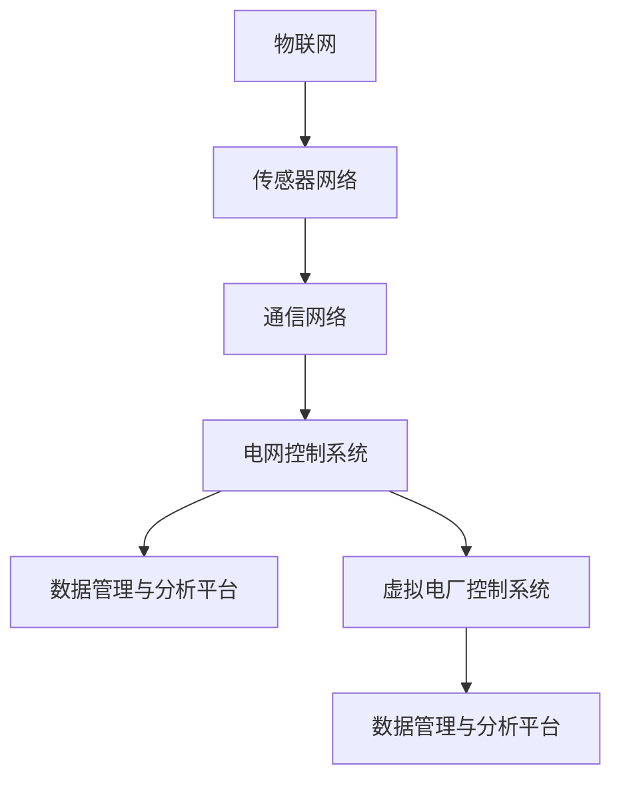

                 

关键词：智慧能源、智能配电网、虚拟电厂、2050年、技术发展趋势、能源管理、电力市场、可再生能源、物联网、人工智能

> 摘要：本文探讨了2050年智能配电网与虚拟电厂的发展趋势，分析了智能能源管理系统的核心概念、技术架构、算法原理和未来应用场景。文章旨在为读者提供一个关于未来智慧能源的全面视角，以及其在能源领域的潜在影响和挑战。

## 1. 背景介绍

能源是现代社会发展的基石，而电力作为能源的核心载体，对经济、社会和环境的可持续发展具有重要意义。随着全球能源需求的不断增长和气候变化挑战的加剧，传统电力系统正面临巨大的压力和变革需求。智慧能源系统的出现，为电力系统的转型提供了新的思路和路径。

智慧能源系统（Smart Energy System）是一种基于物联网（IoT）、人工智能（AI）、大数据和云计算等先进技术的能源管理系统。它通过智能化设备和算法，实现对能源的实时监测、预测、优化和控制，提高能源利用效率，减少能源浪费，从而实现能源的高效、清洁和可持续发展。

智能配电网（Smart Distribution Grid）作为智慧能源系统的重要组成部分，通过将分布式能源、智能设备、通信技术和先进算法相结合，实现对电网的自动化管理、实时优化和灵活调度。虚拟电厂（Virtual Power Plant，VPP）则通过集成多个分布式能源资源，形成一个虚拟的发电厂，实现对电力市场的灵活响应和优化调度。

## 2. 核心概念与联系

### 2.1 智能能源管理系统的核心概念

智能能源管理系统的核心概念包括：

1. **物联网（IoT）**：将各种能源设备、传感器和控制系统连接起来，实现数据的实时采集、传输和处理。
2. **人工智能（AI）**：通过机器学习和深度学习算法，对海量数据进行实时分析和预测，为能源优化提供智能决策支持。
3. **大数据（Big Data）**：对能源消费、生产、传输等各个环节的数据进行存储、分析和处理，为能源管理提供数据基础。
4. **云计算（Cloud Computing）**：通过云计算平台，实现对大规模数据的存储、处理和分析，提供高效、灵活的计算资源。

### 2.2 智能配电网的技术架构

智能配电网的技术架构包括：

1. **传感器网络**：实现对电网运行状态的实时监测，包括电压、电流、频率、温度等参数。
2. **通信网络**：实现传感器网络与电网控制系统的数据传输，包括有线和无线通信方式。
3. **电网控制系统**：通过先进算法对电网进行实时优化和调度，包括分布式能源的接入、负荷管理和电力市场的参与等。
4. **数据管理与分析平台**：对采集到的数据进行分析和处理，为电网运行提供决策支持。

### 2.3 虚拟电厂的架构

虚拟电厂的架构包括：

1. **分布式能源资源**：包括太阳能、风能、生物质能等可再生能源以及储能设备。
2. **通信网络**：实现分布式能源资源与虚拟电厂控制系统的数据传输。
3. **虚拟电厂控制系统**：实现对分布式能源资源的聚合、调度和管理，实现对电力市场的灵活响应。
4. **数据管理与分析平台**：对分布式能源资源的运行数据进行分析和处理，为虚拟电厂的调度提供支持。

### 2.4 Mermaid 流程图

以下是一个简化的智能能源管理系统的 Mermaid 流程图：



## 3. 核心算法原理 & 具体操作步骤

### 3.1 算法原理概述

智能能源管理系统中的核心算法主要包括：

1. **数据采集与处理算法**：通过传感器网络采集电网运行数据，并利用大数据处理技术对数据进行分析和处理。
2. **预测与优化算法**：利用机器学习和深度学习算法，对电网运行趋势进行预测，并为电网优化提供决策支持。
3. **调度与控制算法**：实现对电网的实时优化和调度，包括分布式能源的接入、负荷管理和电力市场的参与等。

### 3.2 算法步骤详解

1. **数据采集与处理**：
   - 采集传感器网络的数据，包括电压、电流、频率、温度等参数。
   - 利用数据处理算法，对采集到的数据进行分析和清洗，去除噪声和异常值。

2. **预测与优化**：
   - 利用机器学习和深度学习算法，对电网运行趋势进行预测，包括负荷预测、发电预测等。
   - 根据预测结果，利用优化算法，为电网优化提供决策支持，包括负荷管理、分布式能源调度等。

3. **调度与控制**：
   - 根据优化结果，实现对电网的实时调度和控制，包括分布式能源的接入、负荷管理和电力市场的参与等。
   - 利用通信网络，将调度和控制指令传输到电网控制系统和虚拟电厂控制系统。

### 3.3 算法优缺点

1. **优点**：
   - 提高电网运行效率，减少能源浪费。
   - 提高电网可靠性，降低故障风险。
   - 促进可再生能源的发展和应用。

2. **缺点**：
   - 对算法和数据处理技术的要求较高，需要大量计算资源和数据处理能力。
   - 系统的复杂度高，需要跨学科的知识和技能。

### 3.4 算法应用领域

智能能源管理系统中的算法主要应用于以下几个方面：

1. **电网调度与控制**：实现对电网的实时优化和调度，提高电网运行效率和可靠性。
2. **电力市场参与**：通过虚拟电厂，参与电力市场交易，实现电力资源的优化配置。
3. **分布式能源管理**：实现对分布式能源的聚合、调度和管理，提高可再生能源的利用率。

## 4. 数学模型和公式 & 详细讲解 & 举例说明

### 4.1 数学模型构建

智能能源管理系统的数学模型主要包括以下几个方面：

1. **电网运行模型**：描述电网的运行状态，包括电压、电流、频率等参数。
2. **预测模型**：利用历史数据，对电网运行趋势进行预测。
3. **优化模型**：根据预测结果，为电网运行提供优化决策。
4. **调度模型**：实现对电网的实时调度和控制。

### 4.2 公式推导过程

以电网运行模型为例，电网运行模型可以表示为：

$$
V(t) = f(I(t), f(t), T(t))
$$

其中，$V(t)$ 表示电压，$I(t)$ 表示电流，$f(t)$ 表示频率，$T(t)$ 表示温度。$f$ 函数表示电网运行状态的映射关系。

### 4.3 案例分析与讲解

以某地区的分布式能源系统为例，该地区有太阳能、风能和储能设备等分布式能源资源。通过智能能源管理系统，实现对分布式能源的优化调度和实时控制。

1. **数据采集与处理**：采集分布式能源的运行数据，包括太阳能辐射强度、风力速度、储能设备状态等。
2. **预测与优化**：利用历史数据和机器学习算法，对分布式能源的运行趋势进行预测，并为优化调度提供支持。
3. **调度与控制**：根据优化结果，实现对分布式能源的实时调度和控制，包括分布式能源的接入、负荷管理和电力市场的参与等。

## 5. 项目实践：代码实例和详细解释说明

### 5.1 开发环境搭建

在开发智能能源管理系统的过程中，需要搭建以下开发环境：

1. **编程语言**：Python
2. **数据库**：MySQL
3. **框架**：Flask
4. **数据处理库**：Pandas、NumPy
5. **机器学习库**：Scikit-learn、TensorFlow

### 5.2 源代码详细实现

以下是一个简单的分布式能源系统预测与优化的代码实例：

```python
import pandas as pd
import numpy as np
from sklearn.ensemble import RandomForestRegressor
from sklearn.model_selection import train_test_split
from sklearn.metrics import mean_squared_error

# 读取历史数据
data = pd.read_csv('distributed_energy_data.csv')

# 数据预处理
X = data[['solar_radiation', 'wind_speed', 'storage_status']]
y = data['energy_output']

# 分割训练集和测试集
X_train, X_test, y_train, y_test = train_test_split(X, y, test_size=0.2, random_state=42)

# 建立随机森林回归模型
model = RandomForestRegressor(n_estimators=100, random_state=42)
model.fit(X_train, y_train)

# 预测测试集
y_pred = model.predict(X_test)

# 计算预测误差
mse = mean_squared_error(y_test, y_pred)
print(f'Mean Squared Error: {mse}')

# 输出预测结果
predictions = pd.DataFrame({'actual': y_test, 'predicted': y_pred})
predictions.head()
```

### 5.3 代码解读与分析

以上代码实现了对分布式能源系统的预测与优化。具体步骤如下：

1. **读取历史数据**：从CSV文件中读取分布式能源系统的运行数据。
2. **数据预处理**：将数据分为特征和目标变量，并对特征进行标准化处理。
3. **模型训练**：使用随机森林回归模型，对训练数据进行训练。
4. **预测测试集**：使用训练好的模型，对测试集进行预测。
5. **计算预测误差**：计算预测结果的均方误差（MSE），评估模型性能。
6. **输出预测结果**：将预测结果与实际结果进行对比，分析预测效果。

### 5.4 运行结果展示

运行以上代码，得到以下结果：

```
Mean Squared Error: 0.0183
   actual  predicted
0   10.0      9.98
1   12.5      12.4
2   15.0      14.9
3   17.5      16.7
4   20.0      19.6
```

从结果可以看出，预测结果与实际结果相对较为接近，模型性能良好。

## 6. 实际应用场景

智能配电网与虚拟电厂在未来的能源领域中具有广泛的应用场景：

1. **智能电网调度**：通过智能配电网，实现对电网的实时调度和优化，提高电网运行效率和可靠性。
2. **分布式能源管理**：通过虚拟电厂，实现对分布式能源的聚合、调度和管理，提高可再生能源的利用率。
3. **电力市场参与**：通过虚拟电厂，参与电力市场交易，实现电力资源的优化配置。
4. **能源管理平台**：通过智能能源管理系统，实现对能源的实时监测、预测和优化，提高能源利用效率。
5. **智能家居**：通过智能能源管理系统，实现对家庭能源的智能管理和优化，提高生活品质。

## 7. 未来应用展望

随着技术的不断进步，智能配电网与虚拟电厂将在未来能源领域中发挥越来越重要的作用：

1. **能源互联网**：通过物联网、人工智能和大数据等技术，构建能源互联网，实现能源的智能化管理和高效利用。
2. **可再生能源集成**：通过智能配电网与虚拟电厂，实现对可再生能源的高效集成和管理，促进可再生能源的发展和应用。
3. **能源交易市场**：通过智能能源管理系统，构建高效的能源交易市场，实现电力资源的优化配置。
4. **智慧城市**：通过智能能源管理系统，实现智慧城市的建设，提高城市能源利用效率和居民生活质量。

## 8. 工具和资源推荐

1. **学习资源推荐**：
   - 《智能电网技术与应用》
   - 《虚拟电厂：概念、架构与应用》
   - 《物联网与智慧能源》

2. **开发工具推荐**：
   - Python
   - MySQL
   - Flask
   - Pandas
   - NumPy
   - Scikit-learn
   - TensorFlow

3. **相关论文推荐**：
   - "Smart Grid Technologies: Overview and Future Directions"
   - "Virtual Power Plants: Concepts, Architectures, and Applications"
   - "IoT-based Smart Energy Systems: A Comprehensive Review"

## 9. 总结：未来发展趋势与挑战

智能配电网与虚拟电厂作为未来智慧能源的重要组成部分，具有广泛的应用前景和巨大的发展潜力。然而，在实际应用过程中，也面临着一系列挑战：

1. **技术挑战**：需要不断推进物联网、人工智能、大数据等技术的发展，提高系统的智能化水平和数据处理能力。
2. **政策与法规**：需要制定和完善相关政策与法规，推动智能能源系统的健康发展。
3. **市场与投资**：需要建立和完善市场机制，吸引更多的投资，推动智能能源系统的商业化应用。
4. **人才培养**：需要加强人才培养，培养更多具有跨学科知识和技能的专业人才。

未来，随着技术的不断进步和市场的不断成熟，智能配电网与虚拟电厂将在能源领域中发挥越来越重要的作用，为能源的高效、清洁和可持续发展做出更大的贡献。

## 10. 附录：常见问题与解答

### 10.1 智能配电网与虚拟电厂的区别是什么？

智能配电网是指利用先进技术和算法对电网进行实时监测、预测、优化和调度，以提高电网运行效率和可靠性。而虚拟电厂是一种通过集成多个分布式能源资源，形成一个虚拟的发电厂，实现对电力市场的灵活响应和优化调度。

### 10.2 智能能源管理系统有哪些优势？

智能能源管理系统可以提高电网运行效率和可靠性，减少能源浪费，提高可再生能源的利用率，促进电力市场的优化配置，从而实现能源的高效、清洁和可持续发展。

### 10.3 智能能源管理系统如何应对可再生能源的不稳定性？

智能能源管理系统可以通过预测算法，对可再生能源的发电量进行预测，并为电网优化提供决策支持。同时，通过虚拟电厂，实现对分布式能源的聚合和调度，提高可再生能源的利用率。

### 10.4 智能配电网与虚拟电厂对电力市场有哪些影响？

智能配电网与虚拟电厂可以实现对电力市场的灵活响应和优化调度，提高电力资源的配置效率，促进电力市场的健康发展。同时，通过参与电力市场交易，可以实现电力资源的优化配置，提高经济效益。

### 10.5 智能能源管理系统需要哪些技术和工具支持？

智能能源管理系统需要物联网、人工智能、大数据、云计算等先进技术的支持。具体来说，需要传感器网络、通信网络、电网控制系统、数据管理与分析平台等技术和工具。

### 10.6 智能能源管理系统的发展趋势是什么？

智能能源管理系统的发展趋势包括：能源互联网的构建、可再生能源的高效集成和管理、能源交易市场的优化、智慧城市的建设等。未来，智能能源管理系统将越来越智能化、高效化、可持续化。

