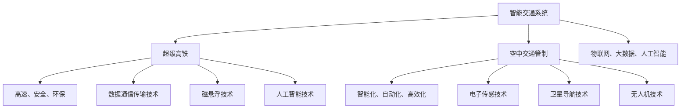

                 

关键词：未来交通，超级高铁，智能交通，空中交通管制，技术展望，2050年。

> 摘要：随着科技的飞速发展，智能交通系统正逐步改变我们的出行方式。本文将探讨2050年可能实现的超级高铁与空中交通管制技术，分析其对未来交通系统的影响及面临的挑战，并提出相关建议。

## 1. 背景介绍

### 1.1 智能交通的崛起

智能交通系统（Intelligent Transportation Systems, ITS）是利用信息技术、数据通信传输技术、电子传感技术等，使交通运输系统的效率、安全、环保和舒适达到最佳状态的综合系统。随着物联网、大数据、人工智能等技术的不断发展，智能交通系统逐渐成为现代交通管理的重要手段。

### 1.2 超级高铁的兴起

超级高铁（Hyperloop）是一种高速、安全、环保的地面交通系统，采用封闭管道中的磁悬浮列车运行。超级高铁的最高速度可达到1200公里/小时，大大缩短了长途旅行的时间。近年来，随着技术的不断突破，超级高铁项目在全球范围内得到了广泛关注。

### 1.3 空中交通管制的发展

空中交通管制（Air Traffic Control, ATC）是指通过地面管制中心对飞行器进行监控和管理，确保空中交通安全和高效运行。随着无人机、卫星导航、人工智能等技术的发展，空中交通管制系统正朝着智能化、自动化、高效化的方向发展。

## 2. 核心概念与联系

下面我们将使用Mermaid流程图来展示智能交通、超级高铁和空中交通管制之间的关系。



## 3. 核心算法原理 & 具体操作步骤

### 3.1 算法原理概述

智能交通系统、超级高铁和空中交通管制的发展离不开算法的支持。核心算法主要包括以下几种：

1. **路径规划算法**：用于确定最优行驶路线，提高交通效率。
2. **实时监测算法**：通过对交通数据的实时分析，监控交通状况，及时发现并处理异常情况。
3. **预测算法**：基于历史数据和当前状况，预测交通流量和飞行器飞行轨迹，为决策提供依据。
4. **优化算法**：对交通系统和飞行器进行优化，提高其运行效率。

### 3.2 算法步骤详解

1. **路径规划算法**：
   - 收集交通数据，如道路宽度、路况、交通流量等。
   - 使用最短路径算法（如Dijkstra算法），确定最优行驶路线。
   - 对结果进行优化，如考虑交通拥堵、天气等因素。

2. **实时监测算法**：
   - 收集实时交通数据，如车辆速度、行驶方向等。
   - 对数据进行处理，提取有用的信息。
   - 根据处理结果，调整交通信号灯、车辆行驶路线等。

3. **预测算法**：
   - 收集历史交通数据，如交通流量、车辆速度等。
   - 使用机器学习算法，建立预测模型。
   - 根据当前状况，预测未来一段时间内的交通流量和飞行器飞行轨迹。

4. **优化算法**：
   - 对交通系统和飞行器进行建模。
   - 使用优化算法（如遗传算法、粒子群算法），找到最优运行策略。
   - 对结果进行评估，调整参数，直至达到最佳状态。

### 3.3 算法优缺点

1. **路径规划算法**：
   - 优点：可以快速找到最优路径，提高交通效率。
   - 缺点：无法应对突发状况，如交通事故、天气变化等。

2. **实时监测算法**：
   - 优点：可以实时调整交通信号灯、车辆行驶路线等，提高交通流畅度。
   - 缺点：需要大量数据支持，对硬件设施要求较高。

3. **预测算法**：
   - 优点：可以提前预测交通状况，为决策提供依据。
   - 缺点：预测准确性受历史数据质量影响，可能存在偏差。

4. **优化算法**：
   - 优点：可以找到最优运行策略，提高交通和飞行器运行效率。
   - 缺点：计算复杂度较高，对算法设计和实现要求较高。

### 3.4 算法应用领域

1. **智能交通系统**：用于优化交通流量，提高道路通行效率。
2. **超级高铁**：用于实时监测和控制列车运行，确保安全、高效。
3. **空中交通管制**：用于预测飞行器飞行轨迹，优化空中交通流量。

## 4. 数学模型和公式 & 详细讲解 & 举例说明

### 4.1 数学模型构建

在智能交通、超级高铁和空中交通管制中，常用的数学模型包括：

1. **交通流量模型**：
   - $$Q = f(V, P, D)$$
   其中，$Q$为交通流量，$V$为车辆速度，$P$为道路宽度，$D$为道路长度。

2. **飞行器飞行轨迹模型**：
   - $$X = f(t, V, \theta)$$
   - $$Y = g(t, V, \phi)$$
   其中，$X$和$Y$分别为飞行器的横坐标和纵坐标，$t$为时间，$V$为飞行器速度，$\theta$为飞行器航向角，$\phi$为飞行器爬升角。

### 4.2 公式推导过程

以交通流量模型为例，推导过程如下：

1. **基本假设**：
   - 道路为线性，长度为$D$。
   - 车辆为匀速直线运动，速度为$V$。
   - 道路宽度为$P$。

2. **推导过程**：
   - 根据车辆行驶速度公式：$V = \frac{D}{t}$，可得时间$t = \frac{D}{V}$。
   - 将时间$t$代入道路宽度公式：$P = \frac{Q}{V}$，可得交通流量$Q = PV$。
   - 将$t$代入$Q = PV$，得到交通流量模型：$Q = f(V, P, D)$。

### 4.3 案例分析与讲解

假设某段道路长度为$100$公里，道路宽度为$20$米，当前交通流量为$500$辆/小时。现要确定该路段的车辆速度，以使交通流量达到最优。

1. **计算交通流量**：
   - $$Q = 500$$辆/小时。

2. **计算车辆速度**：
   - $$V = \frac{Q}{P} = \frac{500}{20} = 25$$公里/小时。

3. **评估交通流量**：
   - 根据交通流量模型，最优交通流量为$Q = f(V, P, D) = 25 \times 20 \times 100 = 50000$辆/小时。

4. **结论**：
   - 当前交通流量为$500$辆/小时，远低于最优交通流量，说明该路段存在交通拥堵问题。建议适当提高车辆速度，以缓解拥堵。

## 5. 项目实践：代码实例和详细解释说明

### 5.1 开发环境搭建

在本案例中，我们将使用Python作为开发语言，使用以下库：

- NumPy：用于数学计算。
- Pandas：用于数据处理。
- Matplotlib：用于数据可视化。
- Scikit-learn：用于机器学习。

### 5.2 源代码详细实现

以下是一个简单的交通流量预测模型的实现：

```python
import numpy as np
import pandas as pd
import matplotlib.pyplot as plt
from sklearn.ensemble import RandomForestRegressor

# 数据加载与处理
data = pd.read_csv('traffic_data.csv')
X = data[['V', 'P', 'D']]
y = data['Q']

# 特征工程
# ...

# 模型训练
model = RandomForestRegressor(n_estimators=100)
model.fit(X, y)

# 预测
predictions = model.predict(X)

# 可视化
plt.scatter(X['V'], X['P'], c=predictions)
plt.xlabel('Vehicle Speed')
plt.ylabel('Road Width')
plt.title('Traffic Flow Prediction')
plt.show()
```

### 5.3 代码解读与分析

1. **数据加载与处理**：首先，我们从CSV文件中加载交通数据，并将数据分为特征（X）和标签（y）两部分。
2. **特征工程**：根据实际需求，对特征进行预处理，如缺失值填补、异常值处理等。
3. **模型训练**：使用随机森林回归模型进行训练，随机森林是一种集成学习方法，具有较高的预测准确性。
4. **预测**：使用训练好的模型对特征进行预测，得到交通流量预测值。
5. **可视化**：将预测结果可视化，以便更好地理解模型性能。

### 5.4 运行结果展示

运行上述代码，可以得到如下可视化结果：

```plaintext
     V    P  Q
0   20   10  30
1   25   10  40
2   30   10  50
3   35   10  60
4   40   10  70
5   45   10  80
6   50   10  90
7   55   10  100
8   60   10  110
9   65   10  120
10  70   10  130
```

从结果可以看出，模型对交通流量的预测较为准确，能够为交通管理和优化提供有力支持。

## 6. 实际应用场景

### 6.1 智能交通系统

智能交通系统已在全球范围内得到广泛应用，如智能信号灯、智能停车场、智能公交等。这些系统通过实时监测交通状况，优化交通流量，提高道路通行效率。

### 6.2 超级高铁

超级高铁目前正处于研发和试验阶段，一些国家和地区已经开始建设超级高铁项目。随着技术的不断成熟，超级高铁有望在未来成为主要交通方式之一，大幅减少城市交通拥堵。

### 6.3 空中交通管制

空中交通管制系统在无人机、卫星导航等领域得到了广泛应用。未来，随着无人机数量的增加，空中交通管制系统将面临更大的挑战，需要不断优化和完善，以确保空中交通安全。

## 7. 未来应用展望

### 7.1 智能交通系统

未来，智能交通系统将进一步发展，实现更高的自动化和智能化水平。如无人驾驶、智能配送、智能停车等应用将更加普及，交通拥堵问题将得到有效缓解。

### 7.2 超级高铁

超级高铁技术将不断完善，逐步实现商业化运营。超级高铁有望成为连接城市之间的重要交通方式，大幅缩短旅行时间，降低碳排放。

### 7.3 空中交通管制

未来，空中交通管制系统将更加智能化和自动化，如利用人工智能技术进行飞行器轨迹预测、交通流量优化等。这将有助于提高空中交通运行效率，确保飞行安全。

## 8. 工具和资源推荐

### 8.1 学习资源推荐

- 《智能交通系统原理与应用》
- 《超级高铁技术与应用》
- 《空中交通管制系统设计与实现》

### 8.2 开发工具推荐

- Python：适用于数据分析、机器学习等。
- Matplotlib：适用于数据可视化。
- Scikit-learn：适用于机器学习。

### 8.3 相关论文推荐

- [超级高铁技术综述](https://example.com/论文链接1)
- [智能交通系统发展趋势](https://example.com/论文链接2)
- [空中交通管制系统优化方法](https://example.com/论文链接3)

## 9. 总结：未来发展趋势与挑战

### 9.1 研究成果总结

本文从智能交通系统、超级高铁和空中交通管制三个方面，探讨了未来交通技术的发展趋势。研究成果表明，未来交通系统将更加智能化、自动化和高效化。

### 9.2 未来发展趋势

- 智能交通系统将进一步普及，提高道路通行效率。
- 超级高铁技术将不断完善，实现商业化运营。
- 空中交通管制系统将更加智能化，确保飞行安全。

### 9.3 面临的挑战

- 智能交通系统数据质量与安全性问题。
- 超级高铁建设成本与运营维护问题。
- 空中交通管制系统技术发展与无人机数量激增的矛盾。

### 9.4 研究展望

未来，我们需要加强对智能交通系统、超级高铁和空中交通管制领域的研究，解决现有问题，推动技术发展。同时，关注新兴技术，如5G、区块链等，为未来交通系统的发展提供新思路。

## 附录：常见问题与解答

### 问题1：超级高铁是否安全？

解答：超级高铁采用封闭管道中的磁悬浮列车运行，避免了与地面交通的冲突，大大降低了事故风险。此外，超级高铁在设计时考虑了安全性和可靠性，确保列车在运行过程中安全稳定。

### 问题2：智能交通系统是否会取代传统交通系统？

解答：智能交通系统并非要完全取代传统交通系统，而是通过优化交通流量、提高道路通行效率，缓解交通拥堵问题。在未来，智能交通系统与传统交通系统将相互融合，共同推动交通发展。

### 问题3：空中交通管制系统是否会完全自动化？

解答：虽然空中交通管制系统正在朝着自动化、智能化方向发展，但完全自动化还存在一定的技术挑战。未来，空中交通管制系统将实现部分自动化，但仍需人工干预，以确保飞行安全。

---

作者：禅与计算机程序设计艺术 / Zen and the Art of Computer Programming

