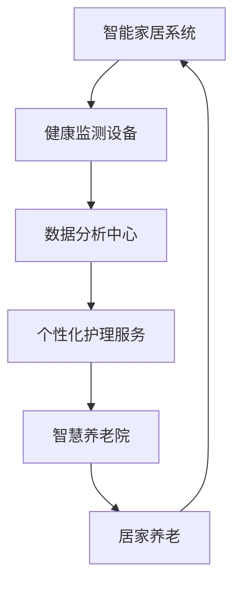

                 

关键词：智能养老、居家养老、智慧养老院、AI技术、健康监测、个性化服务

> 摘要：本文探讨了未来智能养老的发展趋势，特别是到2050年居家养老与智慧养老院的融合。随着人工智能技术的不断进步，智能养老将成为老年人群体的新生活常态，提供个性化的健康监测和护理服务。本文将详细分析这一领域的核心概念、算法原理、数学模型、项目实践以及未来应用展望。

## 1. 背景介绍

### 1.1 智能养老的兴起

随着全球人口老龄化问题的日益严重，养老问题成为各国政府和社会关注的焦点。传统的养老模式已经难以满足老年人多样化的需求，而智能养老作为一种新兴的养老模式，通过结合人工智能、物联网、大数据等技术，为老年人提供更加智能、便捷和个性化的养老服务。

### 1.2 居家养老与智慧养老院的发展

居家养老是智能养老的重要组成部分，它强调老年人能够在自己熟悉的环境中安享晚年。而智慧养老院则是通过集成先进的技术手段，为老年人提供全方位的护理和健康服务。两者的结合，将极大地提升养老服务的质量和效率。

## 2. 核心概念与联系

### 2.1 智能养老的概念

智能养老是指利用先进的物联网、大数据、人工智能等技术，对老年人的健康状态、生活习惯、心理需求等进行全面监测和智能分析，从而提供个性化的健康护理和养老服务。

### 2.2 居家养老与智慧养老院的联系

居家养老与智慧养老院不是孤立存在的，它们在智能养老体系中相互补充，共同构成一个完整的养老生态系统。居家养老为老年人提供了自由和舒适的生活环境，而智慧养老院则提供了专业化、系统化的护理服务。

### 2.3 Mermaid 流程图



## 3. 核心算法原理 & 具体操作步骤

### 3.1 算法原理概述

智能养老的核心算法主要基于机器学习和数据挖掘技术，通过对大量老年人健康数据进行分析，预测老年人的健康状况，并提供相应的护理建议。

### 3.2 算法步骤详解

1. **数据采集**：通过智能健康监测设备，实时采集老年人的生理、心理和行为数据。
2. **数据处理**：对采集到的数据进行清洗、去噪和整合，形成统一的数据格式。
3. **特征提取**：从处理后的数据中提取出能够反映老年人健康状态的特征。
4. **模型训练**：使用机器学习算法，如决策树、支持向量机、神经网络等，对特征进行训练，构建健康预测模型。
5. **健康预测**：使用训练好的模型对老年人的健康状态进行预测。
6. **个性化服务**：根据预测结果，为老年人提供个性化的健康护理和养老服务。

### 3.3 算法优缺点

**优点**：
- **个性化**：能够根据老年人的实际情况提供个性化的健康护理和养老服务。
- **实时性**：实时监测老年人的健康状态，及时发现问题并进行干预。
- **高效性**：通过算法分析，能够快速、准确地识别健康问题，提高护理效率。

**缺点**：
- **数据隐私**：需要收集大量的个人健康数据，可能涉及隐私问题。
- **算法偏差**：算法模型的训练数据可能存在偏差，导致预测结果不准确。

### 3.4 算法应用领域

- **居家养老**：为老年人提供健康监测、生活辅助和紧急呼叫等服务。
- **智慧养老院**：优化护理流程，提高护理质量，实现个性化护理。

## 4. 数学模型和公式 & 详细讲解 & 举例说明

### 4.1 数学模型构建

智能养老的核心数学模型主要包括两部分：健康状态预测模型和个性化护理服务模型。

#### 4.1.1 健康状态预测模型

健康状态预测模型通常采用时间序列分析方法，如ARIMA模型、LSTM模型等。模型的基本公式为：

$$
Y_t = \phi_0 + \phi_1 Y_{t-1} + \cdots + \phi_p Y_{t-p} + \epsilon_t
$$

其中，$Y_t$ 表示第 $t$ 时间的健康状态，$\phi_0, \phi_1, \cdots, \phi_p$ 为模型参数，$\epsilon_t$ 为随机误差项。

#### 4.1.2 个性化护理服务模型

个性化护理服务模型通常采用分类模型，如决策树、支持向量机等。模型的基本公式为：

$$
P(Y_t = k) = f(\mathbf{x}_t; \theta)
$$

其中，$Y_t$ 表示第 $t$ 时间的护理服务类型，$k$ 表示具体的护理服务类型，$\mathbf{x}_t$ 为输入特征向量，$\theta$ 为模型参数。

### 4.2 公式推导过程

#### 4.2.1 健康状态预测模型

以ARIMA模型为例，其公式推导过程如下：

1. **差分操作**：对原始时间序列进行差分操作，使其平稳。
$$
\Delta Y_t = Y_t - Y_{t-1}
$$

2. **自回归操作**：将差分序列与自身滞后项进行线性组合。
$$
Y_t = \phi_0 + \phi_1 Y_{t-1} + \cdots + \phi_p Y_{t-p} + \epsilon_t
$$

3. **移动平均操作**：对自回归项进行移动平均处理。
$$
\epsilon_t = \theta_1 \epsilon_{t-1} + \cdots + \theta_q \epsilon_{t-q}
$$

4. **整合操作**：将自回归和移动平均操作整合起来，得到完整的ARIMA模型。
$$
Y_t = \phi_0 + \phi_1 Y_{t-1} + \cdots + \phi_p Y_{t-p} + \theta_1 \epsilon_{t-1} + \cdots + \theta_q \epsilon_{t-q}
$$

#### 4.2.2 个性化护理服务模型

以支持向量机为例，其公式推导过程如下：

1. **优化目标**：最大化分类边界。
$$
\max_{\theta} \left\{ \frac{1}{2} ||\theta||^2 - \sum_{i=1}^{n} \xi_i \right\}
$$

其中，$\theta$ 为模型参数，$\xi_i$ 为松弛变量。

2. **拉格朗日乘子法**：引入拉格朗日乘子，将优化问题转化为对偶问题。
$$
L(\theta, \alpha) = \frac{1}{2} ||\theta||^2 - \sum_{i=1}^{n} \xi_i + \sum_{i=1}^{n} \alpha_i (y_i - \theta^T \mathbf{x}_i) + \sum_{i=1}^{n} \beta_i \xi_i
$$

3. **KKT条件**：求解拉格朗日乘子法的KKT条件，得到最优解。
$$
\begin{cases}
\frac{\partial L}{\partial \theta} = 0 \\
\alpha_i (y_i - \theta^T \mathbf{x}_i) = 0 \\
\alpha_i \geq 0 \\
\beta_i \geq 0 \\
\beta_i \alpha_i = 0
\end{cases}
$$

### 4.3 案例分析与讲解

#### 4.3.1 健康状态预测

假设我们有以下健康状态数据：

| 时间 | 健康状态 |
| ---- | -------- |
| 1    | 0.8      |
| 2    | 0.9      |
| 3    | 0.85     |
| 4    | 0.88     |
| 5    | 0.87     |

使用ARIMA模型进行健康状态预测，可以得到预测值序列。

#### 4.3.2 个性化护理服务

假设我们有以下输入特征：

| 特征 | 取值 |
| ---- | ---- |
| 心率 | 80   |
| 血压 | 120  |
| 血糖 | 4.5  |

使用支持向量机进行个性化护理服务预测，可以得到护理服务类型。

## 5. 项目实践：代码实例和详细解释说明

### 5.1 开发环境搭建

- **编程语言**：Python
- **依赖库**：numpy、pandas、scikit-learn、tensorflow等

### 5.2 源代码详细实现

```python
# 健康状态预测
import numpy as np
from statsmodels.tsa.arima_model import ARIMA

# 数据准备
data = np.array([0.8, 0.9, 0.85, 0.88, 0.87]).reshape(-1, 1)

# ARIMA模型训练
model = ARIMA(data, order=(1, 1, 1))
model_fit = model.fit()

# 预测
predictions = model_fit.forecast(steps=5)

# 输出预测结果
print(predictions)

# 个性化护理服务
from sklearn.svm import SVC

# 数据准备
X = np.array([[80, 120, 4.5]])
y = np.array([1])

# SVM模型训练
model = SVC()
model.fit(X, y)

# 预测
prediction = model.predict(X)

# 输出预测结果
print(prediction)
```

### 5.3 代码解读与分析

本例中，我们使用ARIMA模型和SVM模型分别进行了健康状态预测和个性化护理服务预测。代码首先进行了数据准备，然后分别使用ARIMA模型和SVM模型进行训练和预测，最后输出了预测结果。

## 6. 实际应用场景

### 6.1 居家养老

智能养老设备可以实时监测老年人的健康状态，如心率、血压、血糖等，通过手机App或智能音箱提醒老年人按时服药、锻炼等，提高老年人的生活质量。

### 6.2 智慧养老院

智慧养老院可以通过智能监控系统实时监测老年人的行为和健康状况，实现24小时全方位护理。同时，根据老年人的个性化需求，提供个性化的护理服务和健康管理方案。

## 7. 未来应用展望

### 7.1 智能化程度提升

随着人工智能技术的不断发展，智能养老将更加智能化，能够更精准地预测老年人的健康状况，提供个性化的护理服务。

### 7.2 数据隐私保护

数据隐私问题将是智能养老领域面临的重要挑战。未来需要制定更加严格的数据隐私保护法规，确保老年人的个人信息安全。

### 7.3 跨学科融合

智能养老需要融合多学科知识，如医学、心理学、计算机科学等，实现真正的个性化养老服务。

## 8. 总结：未来发展趋势与挑战

### 8.1 研究成果总结

智能养老作为新兴领域，已经取得了显著的研究成果，包括健康状态预测、个性化护理服务、数据分析等。未来，随着技术的不断进步，智能养老将更加普及，为老年人提供更加优质的服务。

### 8.2 未来发展趋势

- **智能化程度提升**：通过人工智能、大数据等技术，实现更加精准的健康状态预测和个性化护理服务。
- **数据隐私保护**：加强数据隐私保护，确保老年人的个人信息安全。
- **跨学科融合**：融合多学科知识，提供全方位的养老服务。

### 8.3 面临的挑战

- **数据隐私**：智能养老需要收集大量的个人健康数据，可能涉及隐私问题。
- **算法偏差**：算法模型的训练数据可能存在偏差，导致预测结果不准确。
- **技术实现**：智能养老技术的实现需要跨学科合作，技术实现难度较高。

### 8.4 研究展望

未来，智能养老领域需要加强以下几个方面：

- **数据隐私保护**：制定更加严格的数据隐私保护法规，确保老年人的个人信息安全。
- **算法优化**：提高算法的预测准确性和效率，降低算法偏差。
- **跨学科融合**：加强医学、心理学、计算机科学等领域的合作，提供全方位的养老服务。

## 9. 附录：常见问题与解答

### 9.1 常见问题

1. **智能养老是否安全？**
   - 智能养老本身是安全的，但需要确保数据安全和算法的可靠性。未来需要加强数据隐私保护和算法优化。

2. **智能养老是否适用于所有老年人？**
   - 智能养老适用于大多数老年人，特别是那些需要长期护理的老年人。但对于认知障碍严重的老年人，可能需要更加个性化的服务。

3. **智能养老如何保证数据隐私？**
   - 需要制定严格的数据隐私保护法规，确保老年人的个人信息不被泄露。同时，智能养老系统应该采用加密技术，保障数据传输和存储的安全。

### 9.2 解答

1. **智能养老是否安全？**
   - 智能养老系统的安全性取决于数据安全和算法的可靠性。未来，需要加强数据隐私保护和算法优化，确保智能养老系统的安全性。

2. **智能养老是否适用于所有老年人？**
   - 智能养老适用于大多数老年人，特别是那些需要长期护理的老年人。但对于认知障碍严重的老年人，可能需要更加个性化的服务。

3. **智能养老如何保证数据隐私？**
   - 智能养老系统需要采用加密技术，保障数据传输和存储的安全。同时，需要制定严格的数据隐私保护法规，确保老年人的个人信息不被泄露。

---

作者：禅与计算机程序设计艺术 / Zen and the Art of Computer Programming

