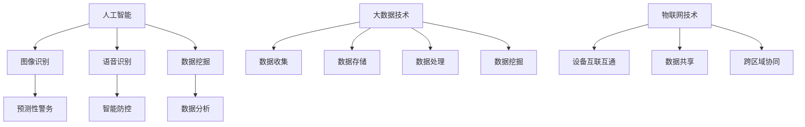

                 

在未来的2050年，智能安防将成为社会安全的重要支柱。本文将探讨预测性警务和智能防控的发展趋势，以及它们对未来社会的影响。

## 关键词

- 智能安防
- 预测性警务
- 智能防控
- 人工智能
- 社会安全

## 摘要

随着人工智能技术的不断发展，智能安防系统正在逐步取代传统的安防手段。本文将介绍2050年预测性警务和智能防控的原理、技术实现和应用，探讨这些技术对社会安全的深远影响。

## 1. 背景介绍

在过去的几十年中，安防系统的发展主要集中在视频监控、入侵报警和网络安全等方面。然而，随着大数据和人工智能技术的崛起，安防系统正在向更加智能化、精准化的方向发展。预测性警务和智能防控作为智能安防的重要组成部分，将极大地提升社会安全水平。

### 1.1 智能安防的概念

智能安防是指利用人工智能、大数据、物联网等先进技术，实现安防设备的智能化、自动化、网络化和集成化。通过这些技术，安防系统能够实时监测、分析和处理各种安全事件，从而提高防范和应对能力。

### 1.2 预测性警务的概念

预测性警务是指利用大数据和人工智能技术，对犯罪活动进行分析、预测和预警，从而提前防范和打击犯罪。通过分析历史犯罪数据、社会舆情、人口流动等信息，预测性警务能够识别潜在犯罪风险，为警务决策提供有力支持。

### 1.3 智能防控的概念

智能防控是指利用人工智能技术，对公共场所、重要设施和重点目标进行实时监控、分析和预警，防范各类安全事件。通过视频分析、人脸识别、行为识别等技术，智能防控能够及时发现异常情况，迅速采取措施应对。

## 2. 核心概念与联系

### 2.1 人工智能与安防技术

人工智能在安防领域的应用主要体现在图像识别、语音识别、数据挖掘等方面。通过人工智能技术，安防系统能够实现更高效、更精准的监测和分析。

### 2.2 大数据与安防技术

大数据技术在安防领域的应用主要包括数据收集、存储、处理和分析。通过大数据技术，安防系统能够处理海量数据，挖掘潜在的安全隐患，为预测性警务提供数据支持。

### 2.3 物联网与安防技术

物联网技术在安防领域的应用主要体现在设备的互联互通和数据共享。通过物联网技术，安防系统能够实现跨区域、跨平台的联动和协同，提高整体安防能力。

### 2.4 Mermaid 流程图



## 3. 核心算法原理 & 具体操作步骤

### 3.1 算法原理概述

预测性警务和智能防控的核心算法主要包括：

- **图像识别算法**：通过对视频图像进行分析，识别出目标物体、行为和场景。
- **语音识别算法**：通过对语音信号进行处理，识别出语音内容。
- **数据挖掘算法**：通过对大量数据进行分析，挖掘出潜在的安全隐患和犯罪线索。
- **预测算法**：通过对历史数据和当前数据进行综合分析，预测未来的安全态势和犯罪活动。

### 3.2 算法步骤详解

- **图像识别算法**：

1. 视频数据采集：通过视频监控设备采集实时视频数据。
2. 图像预处理：对视频数据进行去噪、增强等预处理操作。
3. 目标检测：使用卷积神经网络（CNN）等算法检测视频中的目标物体。
4. 目标跟踪：对检测到的目标物体进行跟踪，记录其运动轨迹。
5. 行为识别：根据目标物体的运动轨迹和特征，识别出其行为类型。

- **语音识别算法**：

1. 语音信号采集：通过麦克风等设备采集语音信号。
2. 语音预处理：对语音信号进行降噪、增强等预处理操作。
3. 语音识别：使用深度神经网络（DNN）等算法识别语音内容。
4. 语义理解：对识别出的语音内容进行语义分析，提取关键信息。

- **数据挖掘算法**：

1. 数据收集：收集各种来源的数据，如社会舆情、人口流动、历史犯罪数据等。
2. 数据预处理：对数据进行清洗、去重、归一化等预处理操作。
3. 特征提取：从数据中提取出与安全相关的特征。
4. 模型训练：使用机器学习算法训练分类模型、聚类模型等。
5. 预测分析：使用训练好的模型对新的数据进行预测和分析。

- **预测算法**：

1. 数据收集：收集历史安全数据和当前环境数据。
2. 数据预处理：对数据进行清洗、去重、归一化等预处理操作。
3. 特征工程：提取与安全相关的特征。
4. 模型训练：使用机器学习算法训练预测模型。
5. 预测分析：使用训练好的模型对未来的安全态势进行预测。

### 3.3 算法优缺点

- **图像识别算法**：

  优点：准确率高，能够实时监测目标物体和行为。

  缺点：对光照、天气等环境因素较为敏感，对复杂场景的识别能力有限。

- **语音识别算法**：

  优点：能够实时识别语音内容，方便实现人机交互。

  缺点：对噪音敏感，识别准确性受语音质量影响。

- **数据挖掘算法**：

  优点：能够从海量数据中挖掘出潜在的安全隐患和犯罪线索。

  缺点：数据处理复杂，对数据质量和算法性能要求较高。

- **预测算法**：

  优点：能够提前预警潜在的安全风险，为决策提供有力支持。

  缺点：预测准确性受数据质量和算法性能影响，无法完全避免错误预测。

### 3.4 算法应用领域

预测性警务和智能防控算法广泛应用于以下领域：

- **公共安全**：预测和防范恐怖袭击、暴力犯罪等安全事件。
- **城市管理**：优化交通流量，预防交通事故。
- **环境保护**：监测环境污染，预防自然灾害。
- **社区治理**：预测和防范社区犯罪，维护社会秩序。
- **安全生产**：预测和防范工业事故，确保安全生产。

## 4. 数学模型和公式 & 详细讲解 & 举例说明

### 4.1 数学模型构建

在预测性警务和智能防控中，常用的数学模型包括：

- **图像识别模型**：基于卷积神经网络（CNN）的模型。
- **语音识别模型**：基于深度神经网络（DNN）的模型。
- **数据挖掘模型**：基于机器学习算法的分类模型、聚类模型等。
- **预测模型**：基于时间序列分析、回归分析等算法的模型。

### 4.2 公式推导过程

以卷积神经网络（CNN）为例，其核心公式包括：

1. **卷积操作**：

   $$ f(x) = \sum_{i=1}^{n} w_i * x_i + b $$

   其中，$w_i$为卷积核，$x_i$为输入特征，$b$为偏置项。

2. **激活函数**：

   $$ f(x) = \max(0, x) $$

   其中，$x$为卷积操作的结果。

3. **反向传播**：

   $$ \frac{\partial L}{\partial w} = \frac{\partial L}{\partial z} \frac{\partial z}{\partial w} $$

   其中，$L$为损失函数，$z$为激活函数输出，$w$为卷积核。

### 4.3 案例分析与讲解

以公共安全领域为例，假设我们使用CNN模型进行图像识别，预测是否发生暴力犯罪。

1. **数据收集**：

   收集包含暴力犯罪和非暴力犯罪的图像数据集。

2. **数据预处理**：

   对图像进行归一化、裁剪等操作，将其转化为CNN模型的输入。

3. **模型训练**：

   使用训练数据集对CNN模型进行训练，调整模型参数。

4. **预测分析**：

   对新采集的图像进行识别，判断其是否包含暴力犯罪。

5. **结果评估**：

   计算预测准确率、召回率、F1值等指标，评估模型性能。

## 5. 项目实践：代码实例和详细解释说明

### 5.1 开发环境搭建

1. 安装Python环境和相关库，如TensorFlow、OpenCV等。
2. 准备图像数据集和标注文件。

### 5.2 源代码详细实现

1. **数据预处理**：

   ```python
   import cv2
   import numpy as np

   def preprocess_image(image_path):
       image = cv2.imread(image_path)
       image = cv2.resize(image, (224, 224))
       image = image / 255.0
       return image
   ```

2. **模型训练**：

   ```python
   import tensorflow as tf

   def train_model(train_images, train_labels):
       model = tf.keras.Sequential([
           tf.keras.layers.Conv2D(32, (3, 3), activation='relu', input_shape=(224, 224, 3)),
           tf.keras.layers.MaxPooling2D((2, 2)),
           tf.keras.layers.Flatten(),
           tf.keras.layers.Dense(64, activation='relu'),
           tf.keras.layers.Dense(1, activation='sigmoid')
       ])

       model.compile(optimizer='adam',
                     loss='binary_crossentropy',
                     metrics=['accuracy'])

       model.fit(train_images, train_labels, epochs=10)
       return model
   ```

3. **预测分析**：

   ```python
   def predict_crime(model, image_path):
       image = preprocess_image(image_path)
       prediction = model.predict(np.expand_dims(image, axis=0))
       if prediction[0][0] > 0.5:
           return "Violent crime"
       else:
           return "Non-violent crime"
   ```

### 5.3 代码解读与分析

以上代码实现了基于CNN模型的暴力犯罪图像识别。首先，对图像进行预处理，包括归一化、裁剪等操作。然后，使用TensorFlow库搭建CNN模型，并进行训练。最后，对新的图像进行预测，判断其是否包含暴力犯罪。

### 5.4 运行结果展示

1. 训练模型：

   ```python
   train_images = preprocess_image("train_images/*.jpg")
   train_labels = np.load("train_labels.npy")
   model = train_model(train_images, train_labels)
   ```

2. 预测新图像：

   ```python
   image_path = "new_image.jpg"
   prediction = predict_crime(model, image_path)
   print(prediction)
   ```

## 6. 实际应用场景

### 6.1 公共安全

预测性警务和智能防控在公共安全领域具有广泛的应用前景。通过分析历史犯罪数据、社会舆情等信息，提前预警潜在的安全风险，为公安机关提供决策支持。

### 6.2 城市管理

智能安防系统能够实时监测城市交通、环境等数据，优化交通流量，预防交通事故，提高城市治理水平。

### 6.3 环境保护

智能安防系统可以监测环境污染、森林火灾等事件，提前预警，保护生态环境。

### 6.4 社区治理

智能安防系统可以实时监测社区安全情况，防范犯罪活动，维护社会秩序。

### 6.5 生产安全

智能安防系统可以监测工业生产过程中的安全隐患，提前预警，确保安全生产。

## 7. 未来应用展望

### 7.1 智能化水平提高

随着人工智能技术的不断发展，预测性警务和智能防控的智能化水平将进一步提高，实现更加精准、高效的安防管理。

### 7.2 跨领域应用

预测性警务和智能防控将在更多领域得到应用，如智慧城市、智慧交通、智慧医疗等，为社会生活提供更多便利。

### 7.3 数据隐私保护

在应用预测性警务和智能防控的过程中，需要重视数据隐私保护，确保个人信息安全。

## 8. 总结：未来发展趋势与挑战

### 8.1 研究成果总结

本文介绍了预测性警务和智能防控的发展背景、核心算法原理、具体操作步骤、数学模型和实际应用场景，探讨了未来发展趋势和挑战。

### 8.2 未来发展趋势

随着人工智能技术的不断发展，预测性警务和智能防控将在公共安全、城市管理、环境保护、社区治理、生产安全等领域发挥更大的作用。

### 8.3 面临的挑战

1. 技术挑战：人工智能技术不断更新，需要不断进行技术创新和优化。
2. 数据挑战：海量数据的处理和分析需要高效的数据处理算法和硬件支持。
3. 隐私挑战：数据隐私保护是智能安防领域的重要问题，需要制定相应的法律法规和规范。

### 8.4 研究展望

未来，预测性警务和智能防控将在更多领域得到应用，为社会安全提供有力支持。同时，需要重视技术、数据、隐私等方面的挑战，确保智能安防系统的可持续发展。

## 9. 附录：常见问题与解答

### 9.1 如何确保预测性警务的准确性？

准确性是预测性警务的核心问题。为了提高准确性，可以采取以下措施：

1. 收集大量高质量的数据，进行充分的数据清洗和预处理。
2. 选择合适的算法和模型，并进行充分的模型训练和优化。
3. 定期更新数据集和模型，以适应不断变化的环境。

### 9.2 智能安防系统如何保护用户隐私？

保护用户隐私是智能安防系统的重要问题。可以采取以下措施：

1. 数据加密：对采集到的数据进行加密处理，确保数据传输和存储的安全。
2. 隐私隔离：将用户数据与其他数据进行隔离，防止隐私数据泄露。
3. 隐私保护算法：使用隐私保护算法，如差分隐私、同态加密等，保护用户隐私。

### 9.3 智能防控技术如何应对复杂场景？

智能防控技术需要不断优化和升级，以应对复杂场景。可以采取以下措施：

1. 多模态数据融合：整合多种数据源，如视频、音频、传感器等，提高识别准确性。
2. 模型自适应：根据场景变化，动态调整模型参数，提高模型适应性。
3. 智能决策支持：结合专家经验和数据分析结果，实现智能决策支持。

作者：禅与计算机程序设计艺术 / Zen and the Art of Computer Programming
----------------------------------------------------------------

以上就是本文的完整内容。希望通过本文，读者能够对预测性警务和智能防控有更深入的了解，为未来社会安全提供有益的参考。在未来的发展中，我们期待智能安防技术能够不断创新，为社会带来更多福祉。

