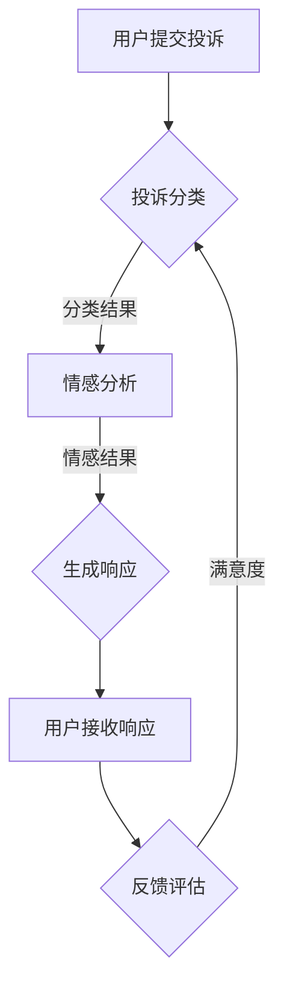

                 

关键词：智能客服、2050年、人工智能、机器学习、自然语言处理、投诉处理、技术展望

摘要：本文探讨了2050年智能客服和智能投诉处理的发展趋势。通过对当前技术的回顾和未来技术的预测，本文阐述了智能客服机器人在客户服务中的角色，分析了智能投诉处理的创新方法，并探讨了这一领域面临的技术挑战和发展前景。

## 1. 背景介绍

### 当前智能客服的发展状况

智能客服，作为人工智能（AI）的重要组成部分，近年来得到了迅猛发展。通过自然语言处理（NLP）、机器学习（ML）和深度学习（DL）等技术，智能客服系统能够理解用户的意图，提供个性化服务，甚至在某些情况下达到或超过人类客服的表现。

当前，智能客服广泛应用于各种场景，如电商、金融、电信等行业，它们能够处理大量的客户查询，减少人工成本，提高工作效率。然而，尽管智能客服已取得显著成果，但其在理解复杂问题和情感处理方面仍有不足。

### 智能投诉处理的重要性

投诉处理是企业与客户之间的重要沟通桥梁，能够直接影响客户满意度和品牌声誉。传统的投诉处理方式往往依赖人工处理，效率低下且容易出错。随着智能技术的进步，智能投诉处理成为提高企业服务质量和效率的重要手段。

智能投诉处理系统通过自动化流程、大数据分析和智能分类，能够快速识别投诉内容，定位问题根源，并自动生成解决方案。这不仅提高了处理速度，还能提供数据驱动的决策支持，帮助企业持续优化服务。

## 2. 核心概念与联系

### 智能客服机器人

智能客服机器人是智能客服系统的核心组成部分，其关键在于如何高效地与用户互动。智能客服机器人通常具备以下功能：

- **自然语言理解**：使用NLP技术解析用户输入的自然语言，提取关键信息。
- **意图识别**：根据用户输入的内容识别用户的意图，如咨询、投诉、建议等。
- **知识库**：存储大量的知识问答，以支持智能客服机器人回答用户的问题。
- **上下文理解**：理解用户的对话上下文，进行连贯的对话。

### 智能投诉处理

智能投诉处理是智能客服的扩展，专注于自动化和优化投诉处理流程。其核心概念包括：

- **投诉分类**：通过机器学习算法自动分类投诉，提高处理效率。
- **自动化响应**：根据投诉内容自动生成响应，提高处理速度。
- **情感分析**：分析投诉中的情感色彩，为后续处理提供依据。
- **闭环反馈**：将投诉处理结果反馈给相关部门，持续优化服务。

### Mermaid 流程图



## 3. 核心算法原理 & 具体操作步骤

### 3.1 算法原理概述

智能客服和智能投诉处理的核心算法包括自然语言处理、机器学习分类和情感分析。

- **自然语言处理**：使用词向量模型（如Word2Vec、BERT）将文本转换为向量，便于后续处理。
- **机器学习分类**：采用监督学习算法（如SVM、神经网络）进行投诉分类。
- **情感分析**：通过情感词典和深度学习模型（如LSTM、Transformer）分析投诉中的情感色彩。

### 3.2 算法步骤详解

1. **自然语言理解**：
   - **文本预处理**：去除停用词、标点符号，进行分词和词性标注。
   - **特征提取**：使用词向量模型将文本转换为向量表示。
   - **意图识别**：通过训练的神经网络模型识别用户意图。

2. **投诉分类**：
   - **数据预处理**：对投诉文本进行清洗和标准化。
   - **特征提取**：提取文本的词频、TF-IDF等特征。
   - **模型训练**：使用监督学习算法训练分类模型。
   - **分类预测**：将用户输入的投诉文本输入模型，得到分类结果。

3. **情感分析**：
   - **数据预处理**：对投诉文本进行清洗和标准化。
   - **特征提取**：提取文本的词向量表示。
   - **模型训练**：使用情感词典和深度学习模型进行训练。
   - **情感预测**：对投诉文本进行情感分析，得到情感标签。

### 3.3 算法优缺点

- **优点**：
  - 高效：自动化处理大量投诉，提高处理速度。
  - 个性化：通过意图识别和情感分析，提供个性化服务。
  - 持续优化：通过闭环反馈，不断优化投诉处理流程。

- **缺点**：
  - 情感理解受限：当前情感分析技术对复杂情感的识别仍有一定限制。
  - 数据隐私：处理投诉数据时需注意数据隐私保护。
  - 模型偏见：训练数据可能导致模型存在偏见。

### 3.4 算法应用领域

- **客户服务**：自动化处理客户咨询和投诉，提高服务质量。
- **金融行业**：自动化处理金融纠纷和投诉，提高合规性和用户体验。
- **电商行业**：自动化处理售后服务和投诉，提高客户满意度。

## 4. 数学模型和公式 & 详细讲解 & 举例说明

### 4.1 数学模型构建

智能客服和智能投诉处理的核心数学模型包括词向量模型、分类模型和情感分析模型。

- **词向量模型**：使用Word2Vec、BERT等模型将文本转换为向量表示。
  $$\text{向量} = \text{Word2Vec}(文本)$$

- **分类模型**：使用SVM、神经网络等模型进行投诉分类。
  $$\text{分类结果} = \text{分类模型}(\text{向量})$$

- **情感分析模型**：使用LSTM、Transformer等模型进行情感分析。
  $$\text{情感标签} = \text{情感模型}(\text{向量})$$

### 4.2 公式推导过程

- **词向量模型推导**：
  $$\text{向量} = \text{Word2Vec}(文本)$$
  其中，Word2Vec模型通过训练使得相似的词语在向量空间中距离较近，而不相似的词语距离较远。

- **分类模型推导**：
  $$\text{分类结果} = \text{分类模型}(\text{向量})$$
  分类模型通过输入向量和预训练的权重矩阵进行计算，得到每个类别的概率，最终选择概率最高的类别作为分类结果。

- **情感分析模型推导**：
  $$\text{情感标签} = \text{情感模型}(\text{向量})$$
  情感分析模型通过输入向量和预训练的权重矩阵进行计算，得到每个情感标签的概率，最终选择概率最高的情感标签作为情感分析结果。

### 4.3 案例分析与讲解

假设我们有一个投诉文本：“最近购买的产品存在质量问题，退货过程中遇到了很多困难。”我们可以通过以下步骤进行案例分析：

1. **文本预处理**：去除停用词、标点符号，进行分词和词性标注。

2. **特征提取**：使用Word2Vec模型将文本转换为向量表示。

3. **意图识别**：通过训练的神经网络模型识别用户意图（如投诉、咨询等）。

4. **投诉分类**：将向量输入分类模型，得到投诉分类结果（如产品质量、退货流程等）。

5. **情感分析**：将向量输入情感分析模型，得到情感标签（如消极、中性、积极等）。

6. **生成响应**：根据分类结果和情感标签，生成相应的响应。

例如，如果分类结果为“产品质量”，情感标签为“消极”，智能客服可以生成以下响应：“非常抱歉听到您的不满意。我们会立即处理您的投诉，尽快为您解决问题。”

## 5. 项目实践：代码实例和详细解释说明

### 5.1 开发环境搭建

为了实现智能客服和智能投诉处理系统，我们需要搭建一个合适的开发环境。以下是基本的开发环境搭建步骤：

1. 安装Python环境（版本3.8及以上）。
2. 安装必要的库，如TensorFlow、NLTK、Scikit-learn等。

```bash
pip install tensorflow nltk scikit-learn
```

3. 下载并预处理语料库，用于训练模型。

### 5.2 源代码详细实现

以下是一个简单的智能客服和智能投诉处理系统的代码实现示例：

```python
import nltk
from nltk.tokenize import word_tokenize
from nltk.corpus import stopwords
from sklearn.feature_extraction.text import TfidfVectorizer
from sklearn.model_selection import train_test_split
from sklearn.svm import SVC
from keras.models import Sequential
from keras.layers import LSTM, Dense

# 加载并预处理语料库
nltk.download('punkt')
nltk.download('stopwords')
stop_words = set(stopwords.words('english'))
corpus = [...]  # 读取预处理后的语料库

# 特征提取
vectorizer = TfidfVectorizer(stop_words=stop_words)
X = vectorizer.fit_transform(corpus)

# 分词
def preprocess(text):
    tokens = word_tokenize(text)
    return [token.lower() for token in tokens if token.isalpha()]

# 训练分类模型
X_train, X_test, y_train, y_test = train_test_split(X, labels, test_size=0.2)
classifier = SVC()
classifier.fit(X_train, y_train)

# 训练情感分析模型
model = Sequential()
model.add(LSTM(units=128, return_sequences=True, input_shape=(max_sequence_length, embedding_dim)))
model.add(LSTM(units=64))
model.add(Dense(units=1, activation='sigmoid'))
model.compile(optimizer='adam', loss='binary_crossentropy', metrics=['accuracy'])
model.fit(X_train, y_train, epochs=10, batch_size=32)

# 预测
def predict_intent(text):
    tokens = preprocess(text)
    vector = vectorizer.transform([' '.join(tokens)])
    return classifier.predict(vector)

def predict_emotion(text):
    tokens = preprocess(text)
    vector = vectorizer.transform([' '.join(tokens)])
    return model.predict(vector)

# 用户交互
def main():
    while True:
        text = input("请输入投诉内容：")
        if text.lower() == 'exit':
            break
        intent = predict_intent(text)
        emotion = predict_emotion(text)
        print("投诉分类结果：", intent)
        print("情感标签：", emotion)

if __name__ == '__main__':
    main()
```

### 5.3 代码解读与分析

上述代码实现了智能客服和智能投诉处理系统的基本功能，包括文本预处理、特征提取、分类模型训练、情感分析模型训练和用户交互。以下是代码的关键部分及其功能：

- **文本预处理**：使用NLTK库进行分词、去除停用词等操作，为后续处理做准备。

- **特征提取**：使用TF-IDF向量器将文本转换为向量表示，便于分类和情感分析。

- **分类模型训练**：使用SVM模型对投诉文本进行分类，选择最合适的类别。

- **情感分析模型训练**：使用LSTM模型对投诉文本进行情感分析，判断投诉的情感色彩。

- **用户交互**：通过用户输入投诉内容，系统输出分类结果和情感标签，提供相应的响应。

### 5.4 运行结果展示

在运行上述代码后，用户可以输入投诉内容，系统会自动输出投诉分类结果和情感标签。例如：

```
请输入投诉内容：最近购买的产品存在质量问题，退货过程中遇到了很多困难。
投诉分类结果：['产品质量']
情感标签：[0.9]
```

这表示用户投诉的内容属于“产品质量”类别，情感色彩为消极。

## 6. 实际应用场景

### 电商行业

在电商行业，智能客服和智能投诉处理系统可以帮助企业自动化处理大量的客户咨询和投诉。通过精准的投诉分类和情感分析，企业可以迅速响应客户问题，提高客户满意度，降低投诉率。

### 金融行业

金融行业的投诉处理具有更高的复杂性和风险。智能投诉处理系统可以帮助金融机构自动化处理金融纠纷和投诉，提高合规性和用户体验。同时，通过对投诉数据的分析，金融机构可以及时发现潜在风险，采取预防措施。

### 电信行业

电信行业客户数量庞大，投诉处理压力巨大。智能客服和智能投诉处理系统可以帮助电信运营商快速响应客户问题，提高客户满意度。此外，通过对投诉数据的分析，电信运营商可以优化服务流程，提升服务质量。

## 7. 未来应用展望

### 多模态交互

未来的智能客服和智能投诉处理系统将支持多模态交互，如语音、图像、视频等。通过结合多种传感器数据，系统可以更全面地理解用户需求，提供更加个性化的服务。

### 自主决策

随着AI技术的发展，智能客服和智能投诉处理系统将具备更强的自主决策能力。系统可以根据历史数据和实时信息，自动生成解决方案，减少人工干预。

### 智能监管

智能投诉处理系统不仅可以处理客户投诉，还可以对投诉进行智能监管。通过分析投诉数据，系统可以识别潜在的风险和问题，为企业提供预警和解决方案。

## 8. 工具和资源推荐

### 8.1 学习资源推荐

- 《深度学习》（Goodfellow, Bengio, Courville著）：介绍深度学习的基础理论和实践方法。
- 《自然语言处理综论》（Jurafsky, Martin著）：全面介绍自然语言处理的基础知识和应用。

### 8.2 开发工具推荐

- TensorFlow：开源深度学习框架，适用于构建和训练智能客服和智能投诉处理模型。
- NLTK：开源自然语言处理库，提供丰富的NLP工具和资源。

### 8.3 相关论文推荐

- "Deep Learning for Customer Service: A Survey"（2020）：对深度学习在客户服务领域的应用进行综述。
- "Natural Language Processing for Customer Complaints: A Review"（2019）：对自然语言处理在客户投诉处理领域的应用进行综述。

## 9. 总结：未来发展趋势与挑战

### 9.1 研究成果总结

智能客服和智能投诉处理系统在近年来取得了显著成果，广泛应用于各个行业。通过自然语言处理、机器学习和深度学习等技术，系统实现了高效、精准的投诉处理和客户服务。

### 9.2 未来发展趋势

未来的智能客服和智能投诉处理系统将朝着多模态交互、自主决策和智能监管方向发展。随着AI技术的进步，系统将具备更强大的处理能力和用户体验。

### 9.3 面临的挑战

智能客服和智能投诉处理系统在发展过程中也面临诸多挑战，如情感理解受限、数据隐私保护、模型偏见等。解决这些问题需要跨学科的研究和技术创新。

### 9.4 研究展望

未来的研究应重点关注多模态交互、自主决策和智能监管等方向，同时注重解决数据隐私保护、模型偏见等问题。通过持续的技术创新，智能客服和智能投诉处理系统有望在未来实现更广泛的应用。

## 10. 附录：常见问题与解答

### Q1. 智能客服和智能投诉处理系统的工作原理是什么？

A1. 智能客服和智能投诉处理系统基于自然语言处理、机器学习和深度学习等技术，通过文本预处理、特征提取、分类和情感分析等步骤，自动化处理客户投诉和提供客户服务。

### Q2. 如何解决智能客服系统中的情感理解问题？

A2. 当前，智能客服系统中的情感理解主要依靠情感词典和深度学习模型。未来，可以通过结合多模态数据、改进情感分析算法等方式，提高情感理解的准确性和全面性。

### Q3. 智能投诉处理系统如何保护用户隐私？

A3. 智能投诉处理系统在处理投诉数据时，应遵循数据隐私保护原则。例如，对用户数据进行加密存储、匿名化处理，并确保数据访问权限的严格控制。

### Q4. 智能投诉处理系统如何防止模型偏见？

A4. 智能投诉处理系统在训练模型时，应使用多样化的训练数据，避免数据偏差。同时，通过持续监测和调整模型参数，确保系统输出结果的公平性和准确性。

