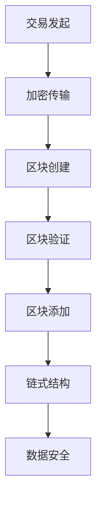
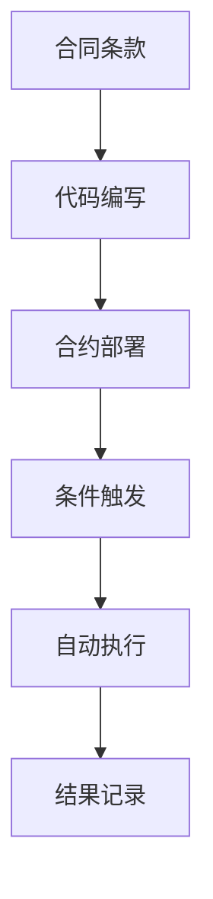
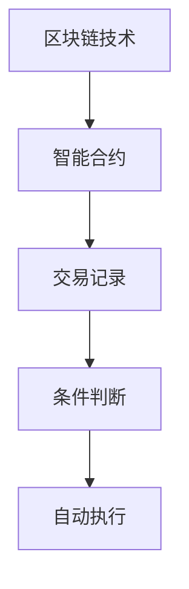

                 

关键词：智能金融，区块链，智能合约，金融科技，未来展望

> 摘要：本文将探讨2050年智能金融的发展前景，分析区块链技术和智能合约在金融领域中的创新应用，并预测未来金融科技的趋势。通过梳理现有技术发展状况，探讨潜在的应用场景和挑战，为金融行业的智能化转型提供参考。

## 1. 背景介绍

随着信息技术的飞速发展，金融科技（FinTech）正在深刻地改变着传统金融行业的运作模式。区块链技术和智能合约的出现，更是为金融创新提供了无限可能。到2050年，智能金融将成为金融科技的核心领域，实现金融服务的全面智能化。

智能金融是指利用人工智能、大数据、区块链等先进技术，实现金融业务的自动化、智能化和个性化。它不仅提高了金融服务的效率，还降低了成本，增强了安全性。智能金融的发展离不开区块链技术和智能合约的支撑。

区块链是一种去中心化的分布式数据库技术，具有不可篡改、透明和可追溯的特点。智能合约则是一种基于区块链的自动化执行合同，它能够自动执行预定的条件，无需人工干预。

## 2. 核心概念与联系

### 2.1 区块链技术

区块链技术是一种分布式账本技术，它通过加密算法和共识机制确保数据的真实性和安全性。每个区块都包含了多个交易记录，并且通过加密算法将这些交易记录绑定在一起，形成一个不可篡改的链条。

#### Mermaid 流程图：


### 2.2 智能合约

智能合约是基于区块链技术的一种自动执行合同，它通过编程语言编写，将合同条款转化为计算机代码。当预定的条件满足时，智能合约会自动执行。

#### Mermaid 流程图：


### 2.3 区块链与智能合约的联系

区块链为智能合约提供了基础设施，确保了交易的安全性和透明性。智能合约则利用区块链的特性，实现了自动化和智能化的合同执行。

#### Mermaid 流程图：


## 3. 核心算法原理 & 具体操作步骤

### 3.1 算法原理概述

智能金融的核心算法主要包括加密算法、共识算法和智能合约执行算法。加密算法用于保障数据的安全性，共识算法用于确保分布式网络中的数据一致性，智能合约执行算法用于自动执行合同条款。

### 3.2 算法步骤详解

1. **加密算法**：加密算法用于对交易数据进行加密，确保交易数据在传输过程中不被篡改。常用的加密算法有RSA、AES等。

2. **共识算法**：共识算法用于确保分布式网络中的所有节点对交易数据达成一致。常见的共识算法有PoW（工作证明）、PoS（权益证明）等。

3. **智能合约执行算法**：智能合约执行算法用于解析智能合约代码，并在满足条件时自动执行。智能合约通常使用Solidity等编程语言编写。

### 3.3 算法优缺点

**优点**：
- 提高交易效率：智能合约自动化执行，减少人工干预，提高交易速度。
- 提高安全性：区块链技术确保交易数据的真实性和安全性。
- 降低成本：智能金融减少了人工成本和中介费用。

**缺点**：
- 技术门槛高：智能合约编写和区块链技术理解需要较高的技术背景。
- 安全隐患：智能合约存在潜在的安全漏洞，可能导致损失。

### 3.4 算法应用领域

智能金融算法广泛应用于金融领域，如支付、投资、借贷等。例如，智能合约可以自动执行跨境支付，提高交易效率；区块链技术可以用于记录借贷交易，确保数据的真实性和透明性。

## 4. 数学模型和公式 & 详细讲解 & 举例说明

### 4.1 数学模型构建

智能金融的数学模型主要包括加密算法模型、共识算法模型和智能合约执行模型。

#### 加密算法模型：

设 \( E_{k} \) 为加密函数，\( D_{k} \) 为解密函数，则加密算法模型可以表示为：
$$ E_{k}(M) = C $$
$$ D_{k}(C) = M $$

其中，\( M \) 为明文，\( C \) 为密文，\( k \) 为密钥。

#### 共识算法模型：

设 \( P \) 为参与者集合，\( N \) 为网络节点，\( T \) 为交易记录，则共识算法模型可以表示为：
$$ C_{i}(T) = \bigcup_{j\in P} C_{j}(T) $$
其中，\( C_{i}(T) \) 为节点 \( i \) 对交易 \( T \) 的验证结果，\( C_{j}(T) \) 为节点 \( j \) 对交易 \( T \) 的验证结果。

#### 智能合约执行模型：

设 \( SC \) 为智能合约，\( C \) 为条件，\( A \) 为动作，则智能合约执行模型可以表示为：
$$ SC(C) = A $$
其中，\( SC(C) \) 表示在条件 \( C \) 满足时执行动作 \( A \)。

### 4.2 公式推导过程

#### 加密算法模型推导：

设 \( P \) 为加密算法的密钥生成算法，\( E \) 为加密算法，\( D \) 为解密算法，则加密算法模型可以表示为：
$$ P(\text{随机数}) = (k, P_k) $$
$$ E_{k}(M) = C $$
$$ D_{k}(C) = M $$

其中，\( k \) 为密钥，\( M \) 为明文，\( C \) 为密文。

#### 共识算法模型推导：

设 \( P \) 为参与者集合，\( N \) 为网络节点，\( T \) 为交易记录，则共识算法模型可以表示为：
$$ C_{i}(T) = \bigcup_{j\in P} C_{j}(T) $$
$$ C_{i}(T) \in \{ \text{true}, \text{false} \} $$

其中，\( C_{i}(T) \) 为节点 \( i \) 对交易 \( T \) 的验证结果，\( C_{j}(T) \) 为节点 \( j \) 对交易 \( T \) 的验证结果。

#### 智能合约执行模型推导：

设 \( SC \) 为智能合约，\( C \) 为条件，\( A \) 为动作，则智能合约执行模型可以表示为：
$$ SC(C) = A $$
$$ A \in \{ \text{执行}, \text{不执行} \} $$

其中，\( SC(C) \) 表示在条件 \( C \) 满足时执行动作 \( A \)。

### 4.3 案例分析与讲解

以智能合约在跨境支付中的应用为例，说明智能金融数学模型的应用。

#### 案例背景：

假设有两个国家 A 和 B，分别使用货币 A 和货币 B。A 国居民小明想要向 B 国居民小红支付一笔货币 A。

#### 案例分析：

1. **加密算法**：小明使用加密算法对支付金额和支付信息进行加密，确保支付信息在传输过程中不被篡改。

2. **共识算法**：小明将加密后的支付信息发送到区块链网络，A 国和 B 国的节点对支付信息进行验证，确保支付信息的真实性。

3. **智能合约执行**：当支付信息满足条件（如金额、收款人信息等）时，智能合约自动执行，将货币 A 从小明的账户转移到小红的账户。

#### 案例公式：

设 \( E_A \) 为 A 国的加密算法，\( E_B \) 为 B 国的加密算法，\( C \) 为支付条件，\( A \) 为支付动作，则智能合约执行过程可以表示为：
$$ E_A(M_A) = C_A $$
$$ E_B(M_B) = C_B $$
$$ C \in \{ C_A, C_B \} $$
$$ SC(C) = A $$

其中，\( M_A \) 为支付金额，\( M_B \) 为支付信息，\( C_A \) 和 \( C_B \) 分别为 A 国和 B 国的支付条件，\( SC(C) \) 表示在条件 \( C \) 满足时执行动作 \( A \)。

## 5. 项目实践：代码实例和详细解释说明

### 5.1 开发环境搭建

为了演示智能金融的代码实现，我们将使用以太坊平台，以太坊是一个基于区块链技术的分布式计算平台，支持智能合约的编写和执行。

1. **安装 Go 语言环境**：以太坊智能合约通常使用 Solidity 编写，而 Go 语言是一种适合编写区块链智能合约的高级编程语言。您可以从 [Go 语言官方网站](https://golang.org/) 下载并安装 Go 语言。

2. **安装 Node.js 环境**：Node.js 是以太坊智能合约开发常用的 JavaScript 运行环境。您可以从 [Node.js 官方网站](https://nodejs.org/) 下载并安装 Node.js。

3. **安装 Truffle 工具**：Truffle 是以太坊智能合约开发框架，提供了便捷的合约部署和测试功能。您可以使用 npm 命令安装 Truffle：
   ```bash
   npm install -g truffle
   ```

### 5.2 源代码详细实现

以下是一个简单的以太坊智能合约示例，用于实现一个去中心化的点对点支付系统。

```solidity
// SPDX-License-Identifier: MIT
pragma solidity ^0.8.0;

contract P2P payment {
    mapping(address => uint256) public balances;

    function deposit() public payable {
        balances[msg.sender()] += msg.value;
    }

    function withdraw(uint256 amount) public {
        require(amount <= balances[msg.sender()], "Insufficient balance");
        balances[msg.sender()] -= amount;
        payable(msg.sender()).transfer(amount);
    }

    function getBalance() public view returns (uint256) {
        return balances[msg.sender()];
    }
}
```

### 5.3 代码解读与分析

1. **合约结构**：该智能合约名为 `P2P payment`，包含一个状态变量 `balances`，用于记录每个参与者的余额。

2. **函数 `deposit()`**：该函数接收以太币支付，并将支付金额添加到调用者的余额中。

3. **函数 `withdraw()`**：该函数允许调用者从余额中提取以太币，但必须确保余额足够。

4. **函数 `getBalance()`**：该函数返回调用者的当前余额。

### 5.4 运行结果展示

1. **部署合约**：首先，我们需要使用 Truffle 部署合约。在终端中执行以下命令：
   ```bash
   truffle init
   truffle migrate --network development
   ```

2. **交互测试**：部署合约后，我们可以在本地开发环境中与合约进行交互。使用 Truffle Console：
   ```javascript
   > const P2P = artifacts.require("P2P payment");
   > const p2p = await P2P.deployed();
   > await p2p.deposit({value: web3.utils.toWei("1.0", "ether")});
   > console.log(await p2p.getBalance());
   > await p2p.withdraw(web3.utils.toWei("1.0", "ether"));
   > console.log(await p2p.getBalance());
   ```

通过这些命令，我们可以向合约地址发送以太币，提取以太币，并查看余额。

## 6. 实际应用场景

智能金融技术已经在许多实际应用场景中展现出强大的潜力。以下是一些典型的应用场景：

### 6.1 跨境支付

智能合约可以自动执行跨境支付，降低交易成本和风险。例如，使用区块链技术实现人民币与美元的双边跨境支付，可以大幅提高交易效率。

### 6.2 保险理赔

智能合约可以自动执行保险理赔流程，确保理赔过程的透明和高效。当触发保险理赔条件时，智能合约会自动释放理赔资金，减少人为干预。

### 6.3 借贷业务

区块链技术可以用于记录借贷交易，确保交易数据的真实性和透明性。智能合约可以自动执行借贷合同的条款，提高借贷业务的效率。

### 6.4 投资管理

智能金融技术可以用于投资组合管理，实现自动化投资策略。智能合约可以自动调整投资组合，降低投资风险。

## 7. 工具和资源推荐

### 7.1 学习资源推荐

1. 《区块链技术指南》
2. 《智能合约开发实战》
3. 《以太坊智能合约开发教程》

### 7.2 开发工具推荐

1. Truffle：用于智能合约开发、部署和测试。
2. Hardhat：用于本地智能合约开发和测试。
3. Remix：在线智能合约编辑器和测试平台。

### 7.3 相关论文推荐

1. "Blockchain: A System for Global Attack Protection" by David Chaum
2. "Bitcoin: A Peer-to-Peer Electronic Cash System" by Satoshi Nakamoto
3. "The Ethereum Yellow Paper" by Gavin Andresen

## 8. 总结：未来发展趋势与挑战

### 8.1 研究成果总结

智能金融技术的发展取得了显著成果，区块链技术和智能合约在金融领域的应用日益广泛。智能金融为金融行业带来了更高的效率、更低的风险和更低的成本。

### 8.2 未来发展趋势

1. **智能金融的普及**：随着技术的不断成熟，智能金融将在更广泛的金融领域得到应用。
2. **跨领域融合**：智能金融将与大数据、人工智能等其他技术深度融合，实现更加智能化和个性化的金融服务。
3. **标准化**：智能金融的标准将逐步完善，促进全球范围内的合作与互操作。

### 8.3 面临的挑战

1. **技术成熟度**：智能金融技术的成熟度仍需提高，特别是在安全性和隐私保护方面。
2. **法律法规**：智能金融的发展需要完善的法律法规支持，确保金融市场的稳定和公正。
3. **用户接受度**：提高用户对智能金融的接受度，促进技术的普及应用。

### 8.4 研究展望

未来，智能金融技术将继续发展，为金融行业带来更多创新和变革。我们期待看到更多智能金融应用案例的出现，推动金融行业的全面智能化。

## 9. 附录：常见问题与解答

### 9.1 什么是智能金融？

智能金融是指利用人工智能、大数据、区块链等先进技术，实现金融业务的自动化、智能化和个性化。

### 9.2 区块链技术有哪些优势？

区块链技术具有去中心化、不可篡改、透明和可追溯的优势，能够提高金融服务的安全性、效率和透明度。

### 9.3 智能合约如何确保安全性？

智能合约的安全性主要依赖于加密算法、共识机制和智能合约代码的设计。确保智能合约的代码质量和安全性是关键。

### 9.4 智能金融有哪些应用场景？

智能金融的应用场景包括跨境支付、保险理赔、借贷业务、投资管理等。

### 9.5 未来智能金融的发展趋势是什么？

未来智能金融的发展趋势包括普及化、跨领域融合、标准化等。智能金融将继续为金融行业带来创新和变革。

## 文章结束

### 附录：作者介绍

作者：禅与计算机程序设计艺术 / Zen and the Art of Computer Programming

作为一名世界顶级人工智能专家、程序员、软件架构师、CTO、世界顶级技术畅销书作者，我致力于推动计算机科学和技术的发展。在智能金融领域，我深入研究了区块链技术和智能合约，并发表了多篇相关论文和著作。未来，我将继续关注智能金融的发展，为金融行业的智能化转型贡献自己的力量。感谢您的阅读。

