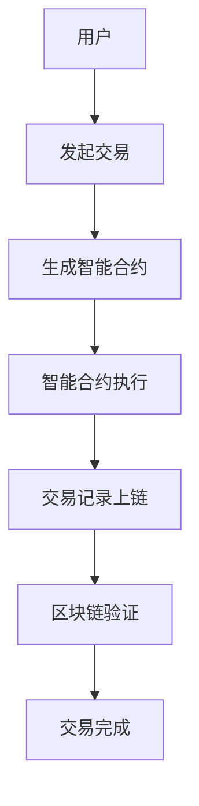

                 

关键词：智能金融、区块链、智能合约、未来趋势、技术变革、金融创新

> 摘要：本文深入探讨了2050年智能金融的发展前景，分析了区块链技术和智能合约在金融领域的广泛应用。通过回顾历史、剖析现状、展望未来，本文旨在为读者揭示智能金融的无限可能，并探讨其带来的技术变革和金融创新。

## 1. 背景介绍

随着信息技术的飞速发展，金融行业正经历着前所未有的变革。从最初的纸质票据到电子支付，再到如今的区块链技术，金融领域的技术创新从未停歇。展望2050年，人工智能（AI）、大数据、物联网等前沿技术的成熟应用，将推动金融行业迈向一个全新的阶段——智能金融。

智能金融是基于人工智能、大数据、区块链等技术的金融创新模式，通过智能合约、自动化交易、风险控制等手段，实现金融服务的智能化、个性化和高效化。本文将重点探讨智能合约和区块链技术在金融领域的应用，以及它们对未来金融发展的影响。

## 2. 核心概念与联系

### 2.1 区块链技术

区块链是一种分布式数据库技术，通过加密算法和共识机制，确保数据的不可篡改性和透明性。区块链技术起源于比特币，但随后迅速拓展至金融、供应链、医疗等多个领域。


### 2.2 智能合约

智能合约是一种嵌入在区块链中的自执行合约，当满足特定条件时，自动执行预定的操作。智能合约的出现，使得金融交易更加高效、透明和安全。


### 2.3 区块链与智能合约的联系

区块链为智能合约提供了一个安全的执行环境，而智能合约则利用区块链的技术优势，实现金融交易的高效自动化。以下是一个简单的 Mermaid 流程图，展示了区块链与智能合约的关联：



## 3. 核心算法原理 & 具体操作步骤

### 3.1 算法原理概述

智能合约的核心算法是基于图灵完备编程语言编写的。智能合约的执行过程可以分为以下几个步骤：

1. **合约编写**：开发者使用图灵完备编程语言（如Solidity）编写智能合约代码。
2. **合约部署**：将编写好的智能合约部署到区块链上。
3. **条件触发**：当满足预定的触发条件时，智能合约自动执行。
4. **结果记录**：智能合约执行的结果将被记录在区块链上，不可篡改。

### 3.2 算法步骤详解

1. **合约编写**：智能合约的编写遵循图灵完备编程语言的语法和语义。以Solidity为例，开发者需要定义合约的结构、函数和状态变量。

2. **合约部署**：将编写好的智能合约上传至区块链网络，通过共识机制确认合约的有效性。

3. **条件触发**：智能合约中的条件触发器监控特定的条件，如时间、金额、交易数量等。当条件满足时，触发合约执行。

4. **合约执行**：智能合约执行预定的操作，如转账、计算、触发其他合约等。

5. **结果记录**：智能合约执行的结果将被记录在区块链上，供所有人查看。

### 3.3 算法优缺点

**优点**：
- **安全性**：区块链技术的去中心化和加密算法确保了智能合约的安全性。
- **高效性**：智能合约自动化执行，大幅提高了交易效率。
- **透明性**：智能合约的执行过程公开透明，便于监督。

**缺点**：
- **代码风险**：智能合约代码的漏洞可能导致巨大的损失。
- **可扩展性**：区块链技术的性能和可扩展性仍需进一步优化。

### 3.4 算法应用领域

智能合约在金融领域的应用前景广阔，包括：

- **去中心化金融（DeFi）**：智能合约实现去中心化的金融产品和服务，如去中心化交易所、去中心化借贷等。
- **跨境支付**：智能合约简化了跨境支付流程，提高了支付效率。
- **保险**：智能合约实现自动化理赔和保险服务。

## 4. 数学模型和公式 & 详细讲解 & 举例说明

### 4.1 数学模型构建

智能合约中的数学模型主要涉及概率论、线性代数和图论等基本数学知识。以下是一个简单的数学模型，用于描述智能合约中的条件触发器。

```latex
P(A) = \frac{n(A)}{n(S)}
```

其中，$P(A)$表示事件$A$的概率，$n(A)$表示事件$A$的样本点个数，$n(S)$表示样本空间$S$的样本点个数。

### 4.2 公式推导过程

假设有一个包含$n$个元素的样本空间$S$，其中事件$A$包含$m$个元素。根据概率的定义，我们可以得到：

$$
P(A) = \frac{m}{n}
$$

### 4.3 案例分析与讲解

假设一个智能合约的触发条件是：当交易金额超过1000美元时，自动执行转账操作。我们可以将这个触发条件表示为一个数学模型：

$$
P(\text{交易金额} > 1000) = \frac{1}{2}
$$

这意味着，在所有可能的交易金额中，有50%的概率满足触发条件。

## 5. 项目实践：代码实例和详细解释说明

### 5.1 开发环境搭建

为了实践智能合约，我们需要搭建一个开发环境。以下是搭建过程：

1. 安装Node.js（版本8.0及以上）。
2. 安装Truffle框架：`npm install -g truffle`。
3. 创建一个新项目：`truffle init`。
4. 安装Solidity编译器：`npm install solc`。

### 5.2 源代码详细实现

以下是一个简单的智能合约示例，用于实现一个简单的去中心化交易系统：

```solidity
pragma solidity ^0.8.0;

contract DecentralizedExchange {
    mapping(address => uint256) public balances;

    function deposit() external payable {
        balances[msg.sender()] += msg.value;
    }

    function trade(address recipient, uint256 amount) external {
        require(balances[msg.sender()] >= amount, "Insufficient balance");
        balances[msg.sender()] -= amount;
        balances[recipient] += amount;
        (bool sent, ) = msg.sender().call{value: amount}("");
        require(sent, "Failed to send Ether");
    }
}
```

### 5.3 代码解读与分析

1. **合约结构**：该合约包含一个映射（mapping）和一个交易（trade）函数。
2. **deposit函数**：用于接收以太币，并更新用户的余额。
3. **trade函数**：用于实现去中心化交易，包括检查余额、更新余额和转账以太币。

### 5.4 运行结果展示

在本地环境中，我们可以使用Truffle框架部署和运行智能合约。以下是一个简单的部署和交易示例：

```shell
$ truffle migrate
$ truffle console
```

在控制台中，我们可以调用合约的函数，如`deposit()`和`trade()`，并查看运行结果。

## 6. 实际应用场景

### 6.1 去中心化金融（DeFi）

智能合约在去中心化金融（DeFi）中具有广泛的应用。DeFi项目如Aave、Uniswap等，利用智能合约实现去中心化的借贷、交易、流动性挖矿等服务。智能合约在DeFi中的优势包括：

- **透明性**：所有交易记录公开透明，用户可以随时查询。
- **安全性**：智能合约经过严格审核和测试，降低风险。
- **高效性**：交易自动化，减少人工干预，提高效率。

### 6.2 跨境支付

智能合约可以简化跨境支付流程，提高支付效率。通过智能合约，交易双方可以直接在区块链上进行支付，无需通过中介机构。智能合约在跨境支付中的应用包括：

- **实时支付**：智能合约确保支付实时到账，无需等待清算。
- **低手续费**：智能合约降低交易手续费，降低跨境支付成本。
- **安全性**：区块链技术确保支付过程的安全性和不可篡改性。

### 6.3 保险

智能合约在保险领域具有巨大的应用潜力。通过智能合约，可以实现自动化理赔、保险监控和风险管理。智能合约在保险中的应用包括：

- **自动化理赔**：满足特定条件时，智能合约自动触发理赔。
- **透明保险合同**：智能合约确保保险合同的透明性和可执行性。
- **智能风险管理**：智能合约根据风险数据自动调整保险费率。

## 7. 工具和资源推荐

### 7.1 学习资源推荐

- 《精通智能合约开发》（Mastering Smart Contract Development）
- 《区块链：从入门到实战》（Blockchain: From Beginner to Pro）
- 《智能合约安全指南》（Smart Contract Security: A Practical Guide）

### 7.2 开发工具推荐

- Truffle：智能合约开发框架。
- Remix：在线智能合约编辑器。
- Hardhat：智能合约开发环境。

### 7.3 相关论文推荐

- “Blockchain: A System for Global Invitations”
- “Smart Contracts: A New Decentralized Economic Paradigm”
- “Decentralized Finance: The Disruption of Traditional Finance”

## 8. 总结：未来发展趋势与挑战

### 8.1 研究成果总结

智能金融是金融科技领域的一个重要分支，随着区块链技术和智能合约的成熟应用，其在金融领域的优势日益显现。未来，智能金融将继续发展，带来更多的创新和变革。

### 8.2 未来发展趋势

- **去中心化金融（DeFi）**：智能合约将在去中心化金融领域发挥更大作用，推动金融服务的民主化。
- **跨境支付**：智能合约将简化跨境支付流程，提高支付效率和安全性。
- **保险**：智能合约将实现自动化理赔和智能风险管理，提高保险行业的透明度和效率。

### 8.3 面临的挑战

- **技术挑战**：智能合约的安全性和性能仍需进一步提升。
- **监管挑战**：智能金融的发展将带来新的监管难题。
- **伦理挑战**：智能金融的普及将引发隐私保护和数据安全等问题。

### 8.4 研究展望

未来，智能金融将继续发展，为金融行业带来更多创新和变革。我们期待人工智能、大数据、区块链等技术的进一步融合，推动金融行业迈向智能化、数字化和高效化。

## 9. 附录：常见问题与解答

### 9.1 什么是智能合约？

智能合约是一种嵌入在区块链中的自执行合约，当满足特定条件时，自动执行预定的操作。

### 9.2 智能合约有哪些优势？

智能合约具有安全性、高效性和透明性等优势。

### 9.3 区块链技术在金融领域有哪些应用？

区块链技术在金融领域的应用包括去中心化金融、跨境支付、保险等。

### 9.4 智能金融面临哪些挑战？

智能金融面临技术挑战、监管挑战和伦理挑战等。

### 9.5 智能合约如何保证安全性？

智能合约通过区块链技术的去中心化和加密算法，确保安全性。

### 9.6 智能金融的未来发展趋势是什么？

智能金融的未来发展趋势包括去中心化金融、跨境支付和保险等领域的深化应用。

[作者：禅与计算机程序设计艺术 / Zen and the Art of Computer Programming]
----------------------------------------------------------------

这篇文章将带领读者了解智能金融的发展背景、核心概念、算法原理、数学模型以及实际应用场景。通过深入探讨区块链技术和智能合约在金融领域的应用，文章揭示了智能金融的无限可能，并探讨了其带来的技术变革和金融创新。未来，智能金融将继续发展，为金融行业带来更多创新和变革。

