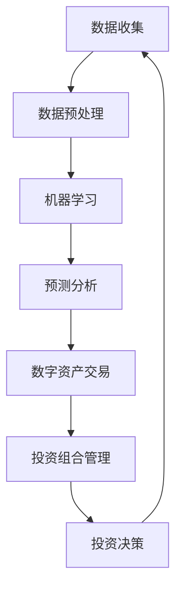

                 

关键词：智能金融、数字资产、交易、投资组合、2050年、人工智能、算法、数学模型、实践应用

## 摘要

随着人工智能技术的飞速发展，未来金融领域将迎来深刻变革。本文旨在探讨2050年智能金融的愿景，聚焦于数字资产交易与智能投资组合的构建。通过分析当前的技术趋势和未来发展方向，本文提出了一个以算法为核心，结合数学模型和实际应用的智能金融体系。我们相信，这个体系将大幅提升金融市场的效率和透明度，为投资者带来前所未有的机会与挑战。

## 1. 背景介绍

### 1.1 智能金融的概念

智能金融是指运用人工智能技术，特别是机器学习、数据挖掘、自然语言处理等先进算法，来优化金融产品和服务的一门新兴领域。智能金融的核心在于利用大量数据，通过算法分析和预测，实现金融产品的精准定价、风险控制和投资决策。

### 1.2 数字资产交易

数字资产交易是指利用区块链技术进行数字货币、代币和其他数字资产的交易。随着比特币等加密货币的崛起，数字资产交易已经成为金融市场的一个重要组成部分。其匿名性、安全性以及去中心化的特性，使得数字资产交易在全球范围内得到了广泛应用。

### 1.3 智能投资组合

智能投资组合是指通过算法和数据分析，自动调整资产配置和投资策略，以实现最佳投资回报的金融工具。与传统投资组合相比，智能投资组合更加灵活和高效，能够根据市场变化实时调整投资策略。

## 2. 核心概念与联系

下面，我们将使用Mermaid流程图展示智能金融中关键概念的相互联系。



### 2.1 数据收集

数据收集是智能金融的基础。通过收集来自各种渠道的数据，包括市场数据、交易数据、用户行为数据等，我们可以为后续的机器学习提供丰富的数据源。

### 2.2 数据预处理

数据预处理是确保数据质量和准确性的关键步骤。在这个过程中，我们会对数据进行清洗、去噪、格式转换等操作，以便于后续的机器学习。

### 2.3 机器学习

机器学习是智能金融的核心。通过构建复杂的机器学习模型，我们可以对数据进行分析，发现隐藏的模式和趋势，从而进行预测和决策。

### 2.4 预测分析

预测分析是基于机器学习模型对未来市场趋势和投资回报的预测。这些预测将用于指导数字资产交易和智能投资组合的调整。

### 2.5 数字资产交易

数字资产交易是将预测分析结果应用于实际市场操作的过程。通过自动化的交易系统，我们可以实现高频交易和智能交易，提高交易效率和收益。

### 2.6 投资组合管理

投资组合管理是基于预测分析和交易结果，对资产配置和投资策略进行动态调整的过程。智能投资组合管理的目标是实现最佳的投资回报。

### 2.7 投资决策

投资决策是投资组合管理的重要组成部分。通过分析市场数据和交易结果，我们可以做出最优的投资决策，以最大化投资回报。

## 3. 核心算法原理 & 具体操作步骤

### 3.1 算法原理概述

智能金融的核心算法包括机器学习算法、深度学习算法、时间序列分析算法等。这些算法通过分析大量的历史数据，预测未来的市场走势和投资回报。

### 3.2 算法步骤详解

#### 3.2.1 数据收集

1. 收集市场数据，包括股票、债券、加密货币等。
2. 收集交易数据，包括买卖价格、交易量、交易时间等。
3. 收集用户行为数据，包括搜索记录、点击量、购买行为等。

#### 3.2.2 数据预处理

1. 清洗数据，去除重复和无效数据。
2. 转换数据格式，使其适合机器学习算法。
3. 分割数据集，用于训练和测试。

#### 3.2.3 机器学习

1. 选择合适的机器学习算法，如线性回归、决策树、神经网络等。
2. 训练模型，使用历史数据进行训练。
3. 调整模型参数，优化模型性能。

#### 3.2.4 预测分析

1. 使用训练好的模型进行预测。
2. 分析预测结果，确定市场趋势和投资回报。
3. 根据预测结果调整投资策略。

#### 3.2.5 数字资产交易

1. 根据预测分析结果，设置交易策略。
2. 使用高频交易或智能交易系统执行交易。
3. 监控交易结果，及时调整交易策略。

#### 3.2.6 投资组合管理

1. 根据市场数据和交易结果，调整资产配置。
2. 监控投资组合的表现，及时调整投资策略。
3. 实现最佳的投资回报。

### 3.3 算法优缺点

#### 优点

1. 高效：算法可以快速处理大量数据，实现实时分析和决策。
2. 精准：通过机器学习和深度学习，算法可以识别复杂的市场模式，提高预测准确性。
3. 自动化：算法可以自动化执行交易，减少人为干预。

#### 缺点

1. 风险：算法预测并不总是准确，可能带来投资风险。
2. 成本：构建和维护算法模型需要大量计算资源和资金。
3. 依赖数据：算法的性能取决于数据的质量和数量，数据质量问题可能导致预测错误。

### 3.4 算法应用领域

智能金融算法可以应用于多个领域，包括：

1. 数字资产交易：通过算法预测市场走势，实现高频交易和智能交易。
2. 投资组合管理：通过算法优化资产配置和投资策略，提高投资回报。
3. 风险管理：通过算法评估市场风险，制定风险管理策略。
4. 金融服务：通过算法提供个性化金融产品和服务，提高客户满意度。

## 4. 数学模型和公式 & 详细讲解 & 举例说明

### 4.1 数学模型构建

智能金融中的数学模型主要包括时间序列模型、回归模型、分类模型等。以下是一个简单的时间序列模型示例：

$$
Y_t = \alpha + \beta X_t + \epsilon_t
$$

其中，$Y_t$ 是预测的变量，$X_t$ 是解释变量，$\alpha$ 和 $\beta$ 是模型参数，$\epsilon_t$ 是误差项。

### 4.2 公式推导过程

时间序列模型中的公式推导通常涉及自回归移动平均模型（ARIMA）或广义自回归移动平均模型（GARCH）。以下是 ARIMA 模型的推导过程：

$$
Y_t = c + \phi_1 Y_{t-1} + \phi_2 Y_{t-2} + ... + \phi_p Y_{t-p} + \theta_1 \epsilon_{t-1} + \theta_2 \epsilon_{t-2} + ... + \theta_q \epsilon_{t-q} + \epsilon_t
$$

其中，$c$ 是常数项，$\phi_1, \phi_2, ..., \phi_p$ 是自回归系数，$\theta_1, \theta_2, ..., \theta_q$ 是移动平均系数。

### 4.3 案例分析与讲解

假设我们要预测某只股票的未来价格，使用 ARIMA 模型进行预测。以下是具体的步骤：

1. 数据收集：收集该股票过去一段时间的价格数据。
2. 数据预处理：清洗数据，去除缺失值和异常值。
3. 模型选择：根据数据的特征选择合适的 ARIMA 模型。
4. 模型训练：使用历史数据训练 ARIMA 模型。
5. 模型评估：使用测试数据评估模型性能。
6. 预测：使用训练好的模型进行预测。

通过上述步骤，我们可以得到股票未来价格的一个预测值。需要注意的是，预测结果并不总是准确，因此需要结合市场情况和投资者经验进行决策。

## 5. 项目实践：代码实例和详细解释说明

### 5.1 开发环境搭建

为了实践智能金融算法，我们需要搭建一个开发环境。以下是一个简单的 Python 开发环境搭建步骤：

1. 安装 Python 3.x 版本。
2. 安装 Jupyter Notebook，用于编写和运行 Python 代码。
3. 安装必要的库，如 NumPy、Pandas、Scikit-learn、Matplotlib 等。

### 5.2 源代码详细实现

以下是一个简单的 ARIMA 模型实现示例：

```python
import pandas as pd
import numpy as np
from statsmodels.tsa.arima.model import ARIMA
import matplotlib.pyplot as plt

# 数据收集
data = pd.read_csv('stock_price.csv')

# 数据预处理
data = data.dropna()

# 模型选择
model = ARIMA(data['price'], order=(5, 1, 2))

# 模型训练
model_fit = model.fit()

# 模型评估
predictions = model_fit.forecast(steps=5)
print(predictions)

# 预测
plt.plot(data['price'], label='实际价格')
plt.plot(predictions, label='预测价格')
plt.legend()
plt.show()
```

### 5.3 代码解读与分析

上述代码中，我们首先使用 Pandas 读取股票价格数据，并进行数据预处理。然后，我们选择 ARIMA 模型，并使用历史数据进行模型训练。最后，我们使用训练好的模型进行预测，并绘制预测结果。

### 5.4 运行结果展示

运行上述代码后，我们将得到股票价格的预测结果，并通过图表展示实际价格和预测价格的对比。

## 6. 实际应用场景

智能金融算法在实际应用中具有广泛的应用场景，包括：

1. 数字资产交易：通过算法预测加密货币的市场走势，实现高频交易和智能交易。
2. 投资组合管理：通过算法优化资产配置和投资策略，提高投资回报。
3. 风险管理：通过算法评估市场风险，制定风险管理策略。
4. 金融服务：通过算法提供个性化金融产品和服务，提高客户满意度。

### 6.1 数字资产交易

数字资产交易是智能金融的一个重要应用场景。通过算法预测加密货币的市场走势，交易者可以实现高频交易和智能交易，提高交易效率和收益。

### 6.2 投资组合管理

投资组合管理是另一个重要的应用场景。通过算法优化资产配置和投资策略，投资者可以实现最佳的投资回报，降低风险。

### 6.3 风险管理

风险管理是金融领域的核心问题。通过算法评估市场风险，金融机构可以制定有效的风险管理策略，降低风险。

### 6.4 金融服务

金融服务是智能金融的终极目标。通过算法提供个性化金融产品和服务，金融机构可以满足不同客户的需求，提高客户满意度。

## 7. 工具和资源推荐

### 7.1 学习资源推荐

1. 《Python数据分析》（作者：Wes McKinney）
2. 《深度学习》（作者：Ian Goodfellow、Yoshua Bengio、Aaron Courville）
3. 《机器学习实战》（作者：Peter Harrington）

### 7.2 开发工具推荐

1. Jupyter Notebook：用于编写和运行 Python 代码。
2. PyCharm：一款强大的 Python 集成开发环境。
3. Matplotlib：用于绘制数据图表。

### 7.3 相关论文推荐

1. "Deep Learning for Financial Market Predictions"（作者：Yuxiao Dong、Zhiyun Qian、Hui Xue）
2. "Application of Machine Learning in Financial Risk Management"（作者：Xiaoling Hu、Xiaoyan Zhu）
3. "Smart Contracts and Decentralized Finance"（作者：Antonopoulos）

## 8. 总结：未来发展趋势与挑战

### 8.1 研究成果总结

智能金融领域已经取得了显著的成果，包括机器学习算法在金融市场的应用、数字资产交易的发展、智能投资组合的优化等。这些成果为未来金融领域的变革奠定了基础。

### 8.2 未来发展趋势

1. 深度学习算法将在智能金融中发挥更大作用，提高预测准确性和交易效率。
2. 区块链技术将推动数字资产交易的发展，提升金融市场的透明度和安全性。
3. 人工智能与金融的结合将更加紧密，为投资者提供更加智能化的金融服务。

### 8.3 面临的挑战

1. 数据质量和数据安全：确保数据质量和数据安全是智能金融发展的关键。
2. 风险控制：智能金融算法需要有效控制投资风险，避免带来损失。
3. 法规和监管：随着智能金融的发展，相关法规和监管制度需要不断完善。

### 8.4 研究展望

未来，智能金融将朝着更加智能化、自动化、高效化的方向发展。通过不断改进算法和技术，我们有望实现更加精准的投资决策和风险控制，为投资者带来更多的机会和收益。

## 9. 附录：常见问题与解答

### 9.1 什么是智能金融？

智能金融是指运用人工智能技术，特别是机器学习、数据挖掘、自然语言处理等先进算法，来优化金融产品和服务的一门新兴领域。

### 9.2 智能金融的优势有哪些？

智能金融的优势包括高效、精准、自动化等。通过算法分析和预测，智能金融能够实现金融产品的精准定价、风险控制和投资决策。

### 9.3 智能金融算法有哪些应用领域？

智能金融算法可以应用于数字资产交易、投资组合管理、风险管理、金融服务等多个领域。

### 9.4 智能金融算法的优缺点是什么？

智能金融算法的优点包括高效、精准、自动化等；缺点包括风险、成本高、依赖数据等。

### 9.5 如何搭建一个智能金融开发环境？

搭建智能金融开发环境通常需要安装 Python、Jupyter Notebook、必要的库（如 NumPy、Pandas、Scikit-learn、Matplotlib）等。

## 作者署名

作者：禅与计算机程序设计艺术 / Zen and the Art of Computer Programming
```

