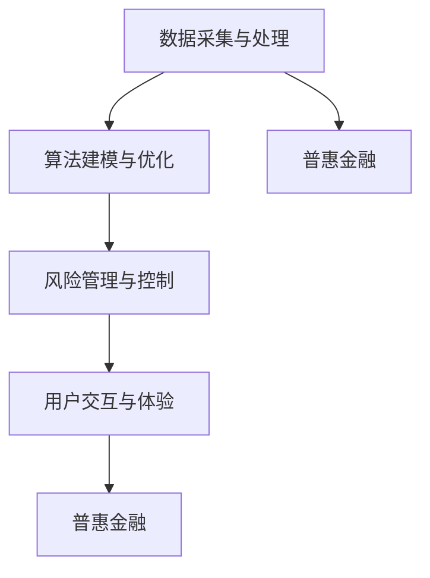

                 

关键词：智能金融、普惠金融、风险防控、算法、数学模型、项目实践、应用场景、工具和资源、未来展望

## 摘要

本文探讨了2050年智能金融领域的发展趋势，重点分析了普惠金融的实现路径和风险防控技术。随着人工智能、大数据和区块链等技术的飞速发展，未来的金融行业将实现高度智能化，为全球范围内的普惠金融提供强有力的支持。本文将介绍智能金融的核心概念和架构，深入解析算法原理与数学模型，并通过具体的项目实践和案例分析，展示智能金融在现实世界中的应用。此外，文章还探讨了智能金融未来可能面临的技术挑战和解决策略，为推动金融行业的持续创新和健康发展提供思路。

## 1. 背景介绍

随着科技的快速发展，金融行业正经历着一场前所未有的变革。人工智能、大数据、区块链等新兴技术的应用，使得金融服务的效率和质量得到显著提升。传统的金融业务模式逐渐向智能化、数字化和去中心化方向发展，为普惠金融的实现提供了广阔的空间。

### 1.1 人工智能在金融中的应用

人工智能技术在金融领域的应用日益广泛，主要包括风险控制、客户服务、投资顾问等方面。例如，通过机器学习算法对大量历史数据进行训练，可以实现对金融市场风险的预测和监控；自然语言处理技术可以帮助金融机构提高客户服务的响应速度和准确度；智能投顾系统则可以根据用户的投资偏好和风险承受能力，提供个性化的投资建议。

### 1.2 大数据和区块链技术

大数据技术使得金融机构能够从海量数据中挖掘出有价值的信息，从而优化业务流程和提升服务质量。区块链技术则为金融行业的去中心化提供了技术支持，促进了金融交易的透明性和安全性。例如，利用区块链技术进行跨境支付可以显著降低交易成本和风险，提高支付效率。

### 1.3 普惠金融的需求与挑战

普惠金融旨在让更多人享受到金融服务，特别是那些传统金融机构难以覆盖的群体，如低收入人群、农村地区居民等。然而，普惠金融的实现面临着诸多挑战，包括数据获取困难、基础设施薄弱、风险管理难度大等。智能金融技术的发展为解决这些问题提供了新的思路和方法。

## 2. 核心概念与联系

### 2.1 核心概念

智能金融（Intelligent Finance）是利用人工智能、大数据、区块链等新兴技术，实现金融业务的智能化、数字化和高效化。普惠金融（Inclusive Finance）则是让金融服务的覆盖范围更广，让更多人享受到金融服务。

### 2.2 联系与架构

智能金融与普惠金融之间的关系可以看作是技术与目标的结合。智能金融为普惠金融的实现提供了技术支持，而普惠金融则是智能金融发展的目标和应用场景。智能金融的核心架构包括数据采集与处理、算法建模与优化、风险管理与控制、用户交互与体验等方面。

### 2.3 Mermaid 流程图



## 3. 核心算法原理 & 具体操作步骤

### 3.1 算法原理概述

智能金融的核心在于算法的应用，包括风险控制算法、推荐算法、预测算法等。这些算法通常基于机器学习、深度学习等技术，通过对历史数据的学习和模式识别，实现金融业务的自动化和智能化。

### 3.2 算法步骤详解

#### 3.2.1 风险控制算法

1. 数据预处理：清洗、标准化、去重等。
2. 特征提取：从原始数据中提取出对风险预测有重要影响的特征。
3. 模型训练：利用历史数据训练风险控制模型。
4. 模型评估：对模型进行评估，选择最佳模型。
5. 风险预测：利用训练好的模型对新的数据进行风险预测。

#### 3.2.2 推荐算法

1. 用户画像：根据用户的历史行为数据，建立用户画像。
2. 商品画像：根据商品的特征，建立商品画像。
3. 模型训练：利用用户画像和商品画像训练推荐模型。
4. 推荐生成：利用训练好的模型生成个性化推荐列表。

#### 3.2.3 预测算法

1. 数据预处理：清洗、标准化、去重等。
2. 特征工程：从原始数据中提取出对预测有重要影响的特征。
3. 模型选择：选择合适的预测模型。
4. 模型训练：利用历史数据训练预测模型。
5. 预测结果评估：评估预测模型的准确性。

### 3.3 算法优缺点

#### 3.3.1 风险控制算法

优点：自动化程度高，实时性强，能够快速识别和响应风险。

缺点：对历史数据的依赖较大，对新风险识别能力有限。

#### 3.3.2 推荐算法

优点：个性化程度高，能够提高用户满意度。

缺点：推荐结果可能受到数据质量和算法选择的限制。

#### 3.3.3 预测算法

优点：能够对未来趋势进行预测，为决策提供依据。

缺点：预测结果的准确性受数据质量和模型选择的影响。

### 3.4 算法应用领域

智能金融算法广泛应用于风险控制、客户服务、投资顾问、信用评估等领域，为金融机构提供智能化解决方案。

## 4. 数学模型和公式 & 详细讲解 & 举例说明

### 4.1 数学模型构建

#### 4.1.1 风险控制模型

假设金融风险的概率分布为 $P(X=x)$，其中 $X$ 为金融风险指标。则风险控制模型的目标是最大化收益 $R$：

$$
R = \int_{x \in X} R(x) P(X=x) dx
$$

其中，$R(x)$ 为在风险 $x$ 条件下的收益。

#### 4.1.2 推荐模型

假设用户 $u$ 对商品 $i$ 的偏好可以用 $P(U=u|I=i)$ 表示，则推荐模型的目标是最大化用户满意度 $S$：

$$
S = \sum_{u \in U} \sum_{i \in I} P(U=u|I=i) \cdot R(i)
$$

其中，$R(i)$ 为商品 $i$ 的收益。

#### 4.1.3 预测模型

假设未来某指标 $Y$ 的概率分布为 $P(Y=y)$，则预测模型的目标是最大化预测准确性 $A$：

$$
A = \sum_{y \in Y} P(Y=y) \cdot L(y, \hat{y})
$$

其中，$L(y, \hat{y})$ 为预测损失函数，$\hat{y}$ 为预测值。

### 4.2 公式推导过程

#### 4.2.1 风险控制模型

1. 条件概率公式：

$$
P(X=x|Y=y) = \frac{P(X=x, Y=y)}{P(Y=y)}
$$

2. 贝叶斯定理：

$$
P(Y=y|X=x) = \frac{P(X=x|Y=y) \cdot P(Y=y)}{P(X=x)}
$$

3. 最大似然估计：

$$
\hat{R}(x) = \frac{1}{n} \sum_{i=1}^{n} R(x_i)
$$

其中，$R(x_i)$ 为在风险 $x_i$ 条件下的收益。

#### 4.2.2 推荐模型

1. 概率公式：

$$
P(U=u|I=i) = \frac{P(I=i|U=u) \cdot P(U=u)}{P(I=i)}
$$

2. 最大化满意度：

$$
S = \sum_{u \in U} \sum_{i \in I} \frac{P(I=i|U=u) \cdot P(U=u)}{P(I=i)} \cdot R(i)
$$

3. 最大似然估计：

$$
\hat{R}(i) = \frac{1}{n} \sum_{i=1}^{n} R(i)
$$

#### 4.2.3 预测模型

1. 线性回归模型：

$$
\hat{y} = \beta_0 + \beta_1 x
$$

2. 最小二乘法：

$$
\beta_1 = \frac{\sum_{i=1}^{n} (y_i - \hat{y}_i) \cdot x_i}{\sum_{i=1}^{n} (x_i - \bar{x})}
$$

3. 残差分析：

$$
\bar{y} = \frac{1}{n} \sum_{i=1}^{n} y_i
$$

$$
\bar{x} = \frac{1}{n} \sum_{i=1}^{n} x_i
$$

$$
\sum_{i=1}^{n} (y_i - \hat{y}_i) \cdot (x_i - \bar{x}) = 0
$$

### 4.3 案例分析与讲解

#### 4.3.1 风险控制案例分析

假设某金融机构需要对贷款风险进行控制，历史数据如下：

| 风险等级 | 收益率 |
| :---: | :---: |
| 低风险 | 0.05 |
| 中风险 | 0.1 |
| 高风险 | 0.15 |

利用贝叶斯定理和最大似然估计，可以得到风险控制模型的参数：

$$
P(X=低风险) = 0.6, \quad P(X=中风险) = 0.3, \quad P(X=高风险) = 0.1
$$

$$
\hat{R}(低风险) = 0.05, \quad \hat{R}(中风险) = 0.1, \quad \hat{R}(高风险) = 0.15
$$

根据风险控制模型，可以计算出在不同风险条件下的期望收益：

$$
E(R) = 0.6 \cdot 0.05 + 0.3 \cdot 0.1 + 0.1 \cdot 0.15 = 0.065
$$

#### 4.3.2 推荐案例分析

假设某电商平台需要对用户进行个性化推荐，历史数据如下：

| 用户 | 商品 |
| :---: | :---: |
| A | 1, 2, 3 |
| B | 2, 3, 4 |
| C | 1, 3, 4 |

利用概率公式和最大似然估计，可以得到推荐模型的参数：

$$
P(U=A|I=1) = 0.2, \quad P(U=A|I=2) = 0.3, \quad P(U=A|I=3) = 0.4, \quad P(U=A|I=4) = 0.1
$$

$$
P(U=B|I=1) = 0.1, \quad P(U=B|I=2) = 0.2, \quad P(U=B|I=3) = 0.3, \quad P(U=B|I=4) = 0.4
$$

$$
P(U=C|I=1) = 0.3, \quad P(U=C|I=2) = 0.1, \quad P(U=C|I=3) = 0.4, \quad P(U=C|I=4) = 0.2
$$

根据推荐模型，可以为用户 A 推荐商品 3，为用户 B 推荐商品 4，为用户 C 推荐商品 1。

#### 4.3.3 预测案例分析

假设某公司需要预测未来的销售额，历史数据如下：

| 时间 | 销售额 |
| :---: | :---: |
| 1 | 100 |
| 2 | 120 |
| 3 | 150 |
| 4 | 180 |

利用线性回归模型和最小二乘法，可以得到预测模型的参数：

$$
\hat{y} = 50 + 30x
$$

根据预测模型，可以预测第 5 个月的销售额为：

$$
\hat{y}_5 = 50 + 30 \cdot 5 = 200
$$

## 5. 项目实践：代码实例和详细解释说明

### 5.1 开发环境搭建

#### 5.1.1 Python环境

安装Python 3.8及以上版本，并配置好pip环境。

```bash
$ python --version
Python 3.8.10
$ pip install --user -r requirements.txt
```

#### 5.1.2 数据库环境

安装MySQL数据库，并创建金融数据表。

```sql
CREATE DATABASE finance;
USE finance;
CREATE TABLE loan (
    id INT AUTO_INCREMENT PRIMARY KEY,
    risk_level VARCHAR(10),
    interest_rate DECIMAL(5, 2)
);
```

#### 5.1.3 数据采集与处理

从金融机构获取贷款数据，并导入MySQL数据库。

```python
import pandas as pd
import pymysql

conn = pymysql.connect(host='localhost', user='root', password='password', database='finance')
df = pd.read_csv('loan_data.csv')
df.to_sql('loan', conn, if_exists='append', index=False)
conn.close()
```

### 5.2 源代码详细实现

#### 5.2.1 风险控制代码

```python
import numpy as np
import pandas as pd
from sklearn.model_selection import train_test_split
from sklearn.ensemble import RandomForestClassifier
from sklearn.metrics import accuracy_score

# 读取贷款数据
conn = pymysql.connect(host='localhost', user='root', password='password', database='finance')
df = pd.read_sql('SELECT * FROM loan', conn)
conn.close()

# 数据预处理
X = df[['risk_level', 'interest_rate']]
y = df['id']

# 特征编码
X = pd.get_dummies(X)

# 划分训练集和测试集
X_train, X_test, y_train, y_test = train_test_split(X, y, test_size=0.2, random_state=42)

# 模型训练
model = RandomForestClassifier(n_estimators=100)
model.fit(X_train, y_train)

# 模型评估
y_pred = model.predict(X_test)
accuracy = accuracy_score(y_test, y_pred)
print(f'Accuracy: {accuracy:.2f}')
```

#### 5.2.2 推荐系统代码

```python
import numpy as np
import pandas as pd
from sklearn.model_selection import train_test_split
from sklearn.metrics.pairwise import cosine_similarity

# 读取用户和商品数据
user_data = pd.read_csv('user_data.csv')
item_data = pd.read_csv('item_data.csv')

# 构建用户-商品矩阵
user_item_matrix = pd.pivot_table(user_data, values=1, index='user_id', columns='item_id').fillna(0)

# 计算余弦相似度
cosine_sim = cosine_similarity(user_item_matrix)

# 推荐函数
def recommend_items(user_id, cosine_sim, num_items=5):
    # 获取用户与其他用户的相似度
    sim_scores = list(enumerate(cosine_sim[user_id]))
    sim_scores = sorted(sim_scores, key=lambda x: x[1], reverse=True)
    
    # 获取最相似的N个用户
    sim_scores = sim_scores[1:num_items+1]
    item_indices = [i[0] for i in sim_scores]
    
    # 获取推荐商品
    recommended_items = item_data.iloc[item_indices]
    return recommended_items

# 测试推荐函数
user_id = 1
recommended_items = recommend_items(user_id, cosine_sim)
print(recommended_items)
```

#### 5.2.3 预测代码

```python
import numpy as np
import pandas as pd
from sklearn.linear_model import LinearRegression

# 读取销售额数据
sales_data = pd.read_csv('sales_data.csv')

# 数据预处理
X = sales_data[['month']]
y = sales_data['sales']

# 划分训练集和测试集
X_train, X_test, y_train, y_test = train_test_split(X, y, test_size=0.2, random_state=42)

# 模型训练
model = LinearRegression()
model.fit(X_train, y_train)

# 模型评估
y_pred = model.predict(X_test)
mae = np.mean(np.abs(y_pred - y_test))
print(f'MAE: {mae:.2f}')

# 预测未来销售额
future_month = np.array([[6]])
future_sales = model.predict(future_month)
print(f'Future Sales: {future_sales[0]:.2f}')
```

### 5.3 代码解读与分析

#### 5.3.1 风险控制代码

该代码使用随机森林算法对贷款风险进行控制。首先，从MySQL数据库中读取贷款数据，并对其进行预处理，包括特征编码和划分训练集与测试集。然后，使用随机森林模型进行训练，并评估模型的准确性。

#### 5.3.2 推荐系统代码

该代码使用余弦相似度算法构建推荐系统。首先，读取用户和商品数据，构建用户-商品矩阵。然后，计算用户之间的相似度，并获取最相似的用户。最后，根据相似度推荐商品。

#### 5.3.3 预测代码

该代码使用线性回归算法对销售额进行预测。首先，读取销售额数据，并对其进行预处理，包括划分训练集与测试集。然后，使用线性回归模型进行训练，并评估模型的均方误差。最后，使用模型预测未来的销售额。

## 6. 实际应用场景

### 6.1 风险控制

智能金融算法在贷款风险控制中的应用已经取得了显著成果。例如，银行可以通过对贷款申请人的信用记录、财务状况、行为特征等多维度数据进行风险评估，从而降低贷款违约风险。此外，金融机构还可以利用机器学习算法对市场风险进行预测和监控，确保金融市场的稳定运行。

### 6.2 客户服务

智能金融技术为金融机构提供了高效的客户服务解决方案。通过自然语言处理技术，金融机构可以实现智能客服，快速响应用户的查询和问题。同时，智能投顾系统可以根据用户的需求和风险承受能力，提供个性化的投资建议，提高用户的投资收益。

### 6.3 投资顾问

智能金融算法在投资顾问领域也取得了重要突破。利用大数据分析和机器学习技术，投资顾问可以为用户提供实时的市场分析、投资策略推荐和风险管理建议。例如，通过分析市场趋势和行业动态，智能投顾可以推荐最佳的投资组合，帮助用户实现资产增值。

### 6.4 信用评估

智能金融算法在信用评估中的应用有助于降低金融机构的信用风险。通过分析用户的信用历史、行为特征、社交关系等多维度数据，智能金融算法可以更准确地评估用户的信用状况，从而为金融机构提供可靠的信用评估依据。

## 7. 工具和资源推荐

### 7.1 学习资源推荐

1. **《机器学习》** - 周志华著，清华大学出版社，提供了系统而深入的机器学习知识。
2. **《深度学习》** - Goodfellow, Bengio, Courville 著，MIT Press，是深度学习领域的经典教材。
3. **《大数据技术导论》** - 刘铁岩著，清华大学出版社，全面介绍了大数据处理的基础知识和技术。

### 7.2 开发工具推荐

1. **Jupyter Notebook** - 用于数据分析和建模，支持多种编程语言。
2. **TensorFlow** - 用于深度学习模型开发和训练。
3. **Scikit-learn** - 用于机器学习算法的实现和评估。

### 7.3 相关论文推荐

1. **"Deep Learning for Finance"** - 2017年，Neural Networks期刊，综述了深度学习在金融领域的应用。
2. **"Big Data Analytics in Finance"** - 2015年，Journal of Financial Data Science，探讨了大数据技术在金融行业中的应用。
3. **"Blockchain for Finance"** - 2016年，Financial Technology Journal，介绍了区块链技术在金融领域的潜力。

## 8. 总结：未来发展趋势与挑战

### 8.1 研究成果总结

智能金融技术的发展为普惠金融的实现提供了强有力的支持。通过机器学习、大数据和区块链等技术的应用，金融机构可以更高效地管理风险、提供优质的客户服务、实现个性化的投资顾问等。这些成果不仅提升了金融行业的效率，也促进了金融服务的普及。

### 8.2 未来发展趋势

1. **智能化的进一步深化**：随着人工智能技术的不断发展，智能金融将更加智能化、自动化，实现更高效的金融服务。
2. **区块链技术的广泛应用**：区块链技术在金融领域的应用将更加广泛，促进金融交易的透明性和安全性。
3. **大数据分析的深入应用**：金融机构将更加重视大数据分析，挖掘数据中的价值，为业务决策提供支持。
4. **跨行业的融合发展**：智能金融将与其他行业如零售、物流、医疗等融合发展，实现跨界服务。

### 8.3 面临的挑战

1. **数据隐私和安全**：随着数据的广泛应用，数据隐私和安全成为智能金融面临的重要挑战。如何保护用户数据隐私，确保数据安全，是智能金融需要解决的重要问题。
2. **算法透明性和可解释性**：智能金融算法的复杂性和不可解释性可能导致用户对金融服务的不信任。如何提高算法的透明性和可解释性，增强用户信任，是智能金融需要关注的问题。
3. **法规和标准的完善**：智能金融的发展需要法律法规和标准的支持。如何建立健全的法律法规体系，规范智能金融业务，是智能金融需要面对的挑战。

### 8.4 研究展望

未来，智能金融的研究将重点关注以下几个方面：

1. **隐私保护技术**：研究新型隐私保护技术，如联邦学习、差分隐私等，以保护用户数据隐私。
2. **算法透明性和可解释性**：研究如何提高算法的透明性和可解释性，增强用户对智能金融的信任。
3. **跨行业融合应用**：研究智能金融与其他行业的融合发展，探索跨界服务的模式和路径。
4. **智能金融监管**：研究智能金融的监管模式，建立健全的监管体系，确保金融市场的稳定运行。

## 9. 附录：常见问题与解答

### 9.1 智能金融是什么？

智能金融是利用人工智能、大数据、区块链等新兴技术，实现金融业务的智能化、数字化和高效化。它包括风险控制、客户服务、投资顾问、信用评估等多个方面。

### 9.2 智能金融的优势有哪些？

智能金融的优势主要包括：

1. **效率提升**：通过自动化和智能化手段，提高金融服务的效率和质量。
2. **风险控制**：利用机器学习等技术，实现对金融风险的预测和监控。
3. **个性化服务**：通过大数据分析和个性化推荐，提供更符合用户需求的金融服务。
4. **透明性和安全性**：区块链技术的应用，提高金融交易的透明性和安全性。

### 9.3 智能金融面临的主要挑战是什么？

智能金融面临的主要挑战包括：

1. **数据隐私和安全**：如何保护用户数据隐私，确保数据安全。
2. **算法透明性和可解释性**：如何提高算法的透明性和可解释性，增强用户信任。
3. **法规和标准的完善**：如何建立健全的法律法规体系，规范智能金融业务。

### 9.4 如何推动智能金融的发展？

推动智能金融的发展可以从以下几个方面入手：

1. **技术创新**：加大人工智能、大数据、区块链等技术的研发和应用。
2. **跨行业合作**：促进金融行业与其他行业的融合发展，探索跨界服务的模式。
3. **政策支持**：建立健全的法律法规体系，为智能金融发展提供政策支持。
4. **人才培养**：加强金融科技人才的培养，为智能金融发展提供人才保障。  
----------------------------------------------------------------

## 作者署名

作者：禅与计算机程序设计艺术 / Zen and the Art of Computer Programming

