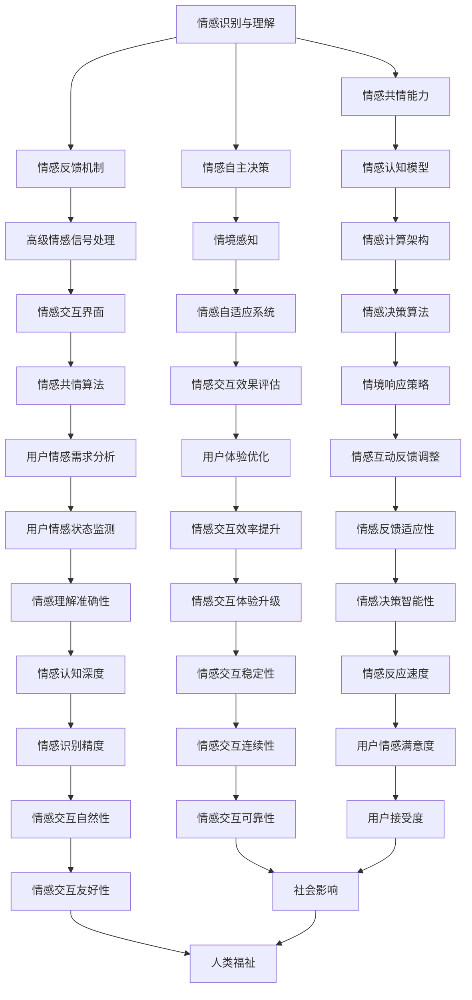

                 

关键词：类人机器人、情感交互、人工智能、未来发展、技术进步

> 摘要：随着人工智能技术的不断发展，类人机器人已经成为当前科技领域的热门话题。本文旨在探讨到2050年，类人机器人在情感交互方面的进展以及它们对未来社会的影响。通过分析现有技术、理论框架和应用场景，本文将展示类人机器人在未来可能带来的巨大变革。

## 1. 背景介绍

自20世纪中叶人工智能（AI）诞生以来，机器智能经历了从简单的规则系统到复杂的神经网络，再到深度学习、强化学习的快速发展。随着计算能力的提升和大数据的积累，人工智能技术逐渐应用于各行各业，从自动驾驶、智能家居到医疗诊断、金融分析，AI技术正深刻改变着我们的生活方式。

然而，随着技术的进步，人们对人工智能的需求也在不断升级。传统的自动化系统虽然可以完成特定任务，但它们缺乏情感交互能力，无法与人类建立深层次的情感联系。这一局限性促使科学家们开始探索如何使机器人具备情感交互能力，从而更好地服务于人类。

类人机器人，作为一种具备高度智能和情感交互能力的机器人，正成为人工智能领域的研究热点。本文将重点关注类人机器人在2050年可能实现的情感交互技术，以及这一技术对未来社会的影响。

### 1.1 类人机器人的定义与发展历程

类人机器人是指那些在外观、行为、认知能力上尽可能模拟人类机器人的智能系统。它们不仅需要具备人类级别的外貌和运动能力，还需要具备类似人类的情感认知、社交互动和自主决策能力。

类人机器人的发展历程可以追溯到20世纪60年代。当时，机器人主要作为工业自动化的一部分，负责重复性和危险性较高的工作。随着计算机技术和人工智能的不断发展，机器人逐渐具备了更为复杂的任务处理能力，并在医疗、教育、家庭等领域得到应用。

然而，早期的机器人仍然缺乏情感交互能力，只能执行预设的任务。进入21世纪，随着情感计算和认知计算技术的发展，类人机器人开始具备初步的情感交互能力。例如，一些服务机器人可以通过面部识别和语音识别与人类进行简单的互动，但这种互动仍然较为表面，缺乏深层次的情感理解。

### 1.2 情感交互的重要性

情感交互是类人机器人与人类互动的重要环节。人类之间的互动不仅仅是信息的传递，更重要的是情感的交流。情感交互能力可以增强机器人与人类之间的信任和亲密感，使机器人成为人类生活中更为可靠和亲近的伙伴。

情感交互的重要性体现在以下几个方面：

- **提高用户体验**：具备情感交互能力的机器人可以更好地理解用户的需求和情感状态，提供个性化的服务，从而提升用户体验。
- **增强用户信任**：通过情感互动，机器人可以建立与用户的情感联系，增强用户对机器人的信任感。
- **促进社会融合**：类人机器人在医疗、教育等领域的应用可以辅助人类完成复杂任务，促进社会的融合和发展。

### 1.3 2050年类人机器人的情感交互展望

到2050年，随着人工智能技术的进一步突破，类人机器人在情感交互方面有望实现重大突破。本文将探讨以下几个方面：

- **高级情感识别与理解**：类人机器人将具备高级情感识别和理解能力，能够识别和解读复杂的情感信号。
- **情感反馈机制**：类人机器人将能够根据情感状态提供适当的情感反馈，如安慰、鼓励等。
- **情感共情能力**：类人机器人将能够通过情感共情与人类建立深层次的情感联系。
- **情感自主决策**：类人机器人将具备基于情感的自主决策能力，能够在不同情境下做出合理的情感反应。

## 2. 核心概念与联系

在探讨类人机器人在2050年的情感交互能力之前，我们需要了解一些核心概念和它们之间的联系。以下是一个详细的Mermaid流程图，用于展示这些概念及其相互关系：



### 2.1 情感识别与理解

情感识别与理解是类人机器人的核心能力之一。通过情感识别，机器人可以识别人类的面部表情、声音和肢体语言中的情感信号。而情感理解则是指机器人能够解读这些情感信号背后的含义，从而做出相应的反应。

### 2.2 情感反馈机制

情感反馈机制是指类人机器人能够根据情感状态提供适当的情感反应，如安慰、鼓励、认同等。这一机制不仅能够增强机器人与人类之间的互动质量，还能提高用户的情感满足度。

### 2.3 情感共情能力

情感共情能力是指类人机器人能够感受到用户的情感状态，并在一定程度上与之共情。这种能力可以使机器人成为用户的情感伙伴，提高用户对机器人的信任和依赖。

### 2.4 情感自主决策

情感自主决策能力是指类人机器人能够在不同情境下，基于情感信号和情感理解做出合理的决策。这种能力使机器人能够更加智能地服务于人类，提高其应用价值。

### 2.5 情感交互界面

情感交互界面是指类人机器人与用户进行情感互动的媒介。它可以是语音、文字、图像等多种形式。一个优秀的情感交互界面可以使情感交互更加自然和高效。

### 2.6 情感计算架构

情感计算架构是指类人机器人在处理情感信号时的技术框架。它包括情感识别、情感理解、情感反馈等模块，是类人机器人实现情感交互的基础。

### 2.7 情感自适应系统

情感自适应系统是指类人机器人能够根据用户的情感状态和交互效果，调整其情感反应和交互策略。这种能力使机器人能够更好地适应不同用户和情境，提高情感交互的个性化和适应性。

### 2.8 情感交互效果评估

情感交互效果评估是指对类人机器人在实际应用中的情感交互效果进行评估和优化。通过评估，可以了解机器人的情感交互能力和用户体验，从而不断改进和提高。

### 2.9 其他相关概念

除了上述核心概念外，还有许多其他与情感交互相关的概念，如情感认知模型、情境感知、情感共情算法、情感决策算法等。这些概念共同构成了类人机器人在情感交互方面的技术体系。

## 3. 核心算法原理 & 具体操作步骤

### 3.1 算法原理概述

类人机器人在情感交互中的核心算法主要包括情感识别算法、情感理解算法和情感反馈算法。这些算法的原理如下：

- **情感识别算法**：通过对人类情感信号的检测和分析，识别出人类当前的情感状态。常用的方法包括基于面部表情识别、声音情感识别和肢体动作识别等。
- **情感理解算法**：在情感识别的基础上，进一步理解情感信号背后的含义，包括情感类型、情感强度和情感语境等。这一过程通常需要结合自然语言处理、机器学习和深度学习等技术。
- **情感反馈算法**：根据情感理解和情感共情的结果，生成适当的情感反馈，如安慰、鼓励、认同等。这一过程涉及到情感共情模型和情感反应模型的构建。

### 3.2 算法步骤详解

下面详细描述类人机器人在情感交互中的具体算法步骤：

#### 3.2.1 情感识别算法

1. **数据采集**：从多种渠道收集人类情感信号数据，如面部表情、声音、肢体动作等。
2. **预处理**：对采集到的情感信号进行预处理，包括归一化、滤波等操作，以提高信号质量。
3. **特征提取**：从预处理后的情感信号中提取特征，如面部特征点、声音频谱、动作轨迹等。
4. **情感识别**：使用机器学习算法（如支持向量机、神经网络等）对提取的特征进行分类，识别出人类当前的情感状态。

#### 3.2.2 情感理解算法

1. **情感信号融合**：将来自不同渠道的情感信号进行融合，形成一个完整的情感信号。
2. **情感类型识别**：根据情感信号的特征，识别出情感的类型，如快乐、悲伤、愤怒等。
3. **情感强度估计**：通过分析情感信号的特征，估计情感的强度，如非常高兴、略微高兴等。
4. **情感语境理解**：结合情感信号和历史交互记录，理解情感信号背后的语境，如某个情感是在特定情境下产生的。

#### 3.2.3 情感反馈算法

1. **情感共情模型构建**：根据情感理解和情感共情的结果，构建情感共情模型，以模拟人类的情感反应。
2. **情感反馈生成**：根据情感共情模型和当前情境，生成适当的情感反馈，如安慰、鼓励、认同等。
3. **情感反馈调整**：根据用户的反馈和情感交互效果，调整情感反馈策略，以提高情感交互的质量。

### 3.3 算法优缺点

#### 优点

- **高识别精度**：通过多种信号融合和深度学习技术，情感识别算法具有较高的识别精度。
- **个性化交互**：基于情感理解和共情模型，机器人可以提供个性化的情感反馈，提高用户体验。
- **自适应交互**：通过情感自适应系统，机器人可以根据用户情感状态和交互效果调整情感反应，提高交互质量。

#### 缺点

- **计算资源消耗**：情感识别和理解算法需要大量的计算资源和存储空间，对硬件设备有较高要求。
- **数据隐私风险**：情感交互过程中，机器人需要收集和处理用户的情感数据，存在数据隐私和安全风险。
- **情感理解局限性**：目前情感理解算法仍然存在一定的局限性，难以完全理解复杂的人类情感。

### 3.4 算法应用领域

情感交互算法在多个领域具有广泛的应用前景：

- **医疗健康**：通过情感交互，机器人可以辅助医生进行心理健康评估和治疗，提供情感支持。
- **家庭服务**：家庭机器人可以陪伴老人和儿童，提供情感陪伴和关怀。
- **教育辅导**：教育机器人可以通过情感交互，激发学生的学习兴趣和积极性。
- **社交陪伴**：社交机器人可以在孤独的老人和残疾人士中提供情感陪伴和社交支持。
- **商业服务**：商场、酒店等服务机器人可以通过情感交互，提高服务质量，增强用户满意度。

## 4. 数学模型和公式 & 详细讲解 & 举例说明

在类人机器人的情感交互中，数学模型和公式扮演着至关重要的角色。以下将详细讲解这些数学模型和公式的构建、推导过程，并通过具体实例进行说明。

### 4.1 数学模型构建

类人机器人在情感交互中涉及到的数学模型主要包括情感信号处理模型、情感理解模型和情感反馈模型。以下是这些模型的基本构建：

#### 情感信号处理模型

情感信号处理模型用于处理和提取人类情感信号中的关键特征。一个典型的情感信号处理模型可以表示为：

$$
X(t) = f(S(t), A(t), V(t))
$$

其中，$X(t)$ 表示在时间 $t$ 时刻的情感信号处理结果，$S(t)$ 表示面部表情信号，$A(t)$ 表示声音信号，$V(t)$ 表示肢体动作信号。$f$ 是一个复合函数，用于融合和提取信号特征。

#### 情感理解模型

情感理解模型用于分析情感信号，识别和解析情感类型、强度和语境。一个简化的情感理解模型可以表示为：

$$
U(t) = g(X(t), H(t), R(t))
$$

其中，$U(t)$ 表示在时间 $t$ 时刻的情感理解结果，$H(t)$ 表示历史交互记录，$R(t)$ 表示上下文信息。$g$ 是一个函数，用于综合分析情感信号和上下文信息。

#### 情感反馈模型

情感反馈模型用于生成合适的情感反馈，以响应用户的情感状态。一个基本的情感反馈模型可以表示为：

$$
Y(t) = h(U(t), C(t), T(t))
$$

其中，$Y(t)$ 表示在时间 $t$ 时刻的情感反馈结果，$C(t)$ 表示情境信息，$T(t)$ 表示目标情感。$h$ 是一个函数，用于根据情感理解和情境信息生成情感反馈。

### 4.2 公式推导过程

以下简要介绍上述数学模型和公式的推导过程。

#### 情感信号处理模型的推导

情感信号处理模型的核心在于如何从原始信号中提取有效的情感特征。常见的特征提取方法包括：

1. **特征工程**：通过人工设计特征，如面部表情的关键点、声音的频谱特征等。
2. **自动特征提取**：利用深度学习算法，如卷积神经网络（CNN）和循环神经网络（RNN），自动学习情感信号中的特征。

以卷积神经网络为例，其基本推导过程如下：

1. **输入层**：接收原始情感信号，如面部图像、声音信号和动作轨迹。
2. **卷积层**：通过卷积操作提取信号中的局部特征。
3. **池化层**：对卷积层输出的特征进行下采样，减少参数量和计算量。
4. **全连接层**：将池化层输出的特征进行全局融合，生成最终的情感特征向量。

#### 情感理解模型的推导

情感理解模型的核心在于如何结合情感信号和上下文信息，准确识别和解析情感类型、强度和语境。常见的推导方法包括：

1. **特征融合**：将情感信号处理模型输出的特征与上下文信息进行融合，形成新的特征向量。
2. **分类器设计**：利用机器学习算法，如支持向量机（SVM）和神经网络（NN），对融合后的特征进行分类。

以支持向量机为例，其基本推导过程如下：

1. **特征融合**：将情感特征向量与上下文信息进行拼接，形成新的特征向量 $X'$。
2. **特征映射**：将特征向量 $X'$ 映射到高维空间，使其线性可分。
3. **分类决策**：通过分类器 $f(X')$ 对特征向量进行分类，输出情感类型。

#### 情感反馈模型的推导

情感反馈模型的核心在于如何根据情感理解和情境信息生成合适的情感反馈。常见的推导方法包括：

1. **情感反应规则设计**：根据情感类型和强度，设计相应的情感反应规则。
2. **情感生成模型**：利用自然语言处理技术，生成符合情感反应规则的文本或语音。

以自然语言生成模型为例，其基本推导过程如下：

1. **情感理解**：对输入的情感类型和强度进行识别和分析。
2. **反应规则匹配**：根据情感类型和强度，匹配相应的情感反应规则。
3. **文本生成**：利用语言模型生成符合反应规则的文本或语音。

### 4.3 案例分析与讲解

为了更好地理解上述数学模型和公式的应用，以下通过一个具体的案例进行分析和讲解。

#### 案例背景

假设我们设计一个家庭陪伴机器人，它需要根据家庭成员的情感状态提供相应的情感反馈，以增强家庭成员之间的情感联系。

#### 情感信号处理

1. **数据采集**：采集家庭成员的面部表情、声音和肢体动作数据。
2. **特征提取**：利用卷积神经网络提取面部表情特征、利用频谱分析提取声音特征、利用动作捕捉技术提取肢体动作特征。
3. **特征融合**：将提取的三个特征向量进行拼接，形成一个新的特征向量 $X'$。

#### 情感理解

1. **情感信号处理模型**：将特征向量 $X'$ 输入情感信号处理模型，得到情感信号处理结果 $X(t)$。
2. **情感理解模型**：将 $X(t)$ 与历史交互记录 $H(t)$ 和上下文信息 $R(t)$ 进行融合，得到情感理解结果 $U(t)$。
3. **情感分类**：利用支持向量机对 $U(t)$ 进行分类，识别出情感类型。

#### 情感反馈

1. **情感反应规则设计**：根据家庭成员的情感类型和强度，设计相应的情感反应规则。
2. **情感生成模型**：根据情感反应规则，利用自然语言生成模型生成相应的情感反馈文本或语音。
3. **情感反馈生成**：根据情境信息 $C(t)$ 和目标情感 $T(t)$，生成情感反馈结果 $Y(t)$。

#### 案例分析

通过上述步骤，家庭陪伴机器人可以实时监测家庭成员的情感状态，并根据情感类型和强度生成相应的情感反馈，如安慰、鼓励等。例如，当家庭成员表现出悲伤情绪时，机器人可以生成“别担心，我会一直在你身边”这样的安慰性话语。

通过这个案例，我们可以看到数学模型和公式在类人机器人情感交互中的应用。它们不仅帮助我们理解和分析情感信号，还帮助我们生成合适的情感反馈，提高用户体验。

## 5. 项目实践：代码实例和详细解释说明

在了解了类人机器人情感交互的数学模型和算法原理后，下面我们将通过一个具体的代码实例来展示如何实现这些算法。本实例将使用Python编程语言和常见的机器学习库，如TensorFlow和Scikit-learn。

### 5.1 开发环境搭建

首先，我们需要搭建一个适合开发的Python环境。以下是所需安装的软件和库：

- Python 3.8或更高版本
- TensorFlow 2.5或更高版本
- Scikit-learn 0.24或更高版本
- OpenCV 4.5或更高版本

安装步骤：

1. 安装Python：
    ```bash
    # 使用包管理器（如conda或pip）安装Python 3.8或更高版本
    ```
2. 安装TensorFlow：
    ```bash
    pip install tensorflow==2.5
    ```
3. 安装Scikit-learn：
    ```bash
    pip install scikit-learn==0.24
    ```
4. 安装OpenCV：
    ```bash
    pip install opencv-python==4.5
    ```

### 5.2 源代码详细实现

下面是实现类人机器人情感交互算法的Python代码。该代码分为四个部分：情感信号处理、情感理解、情感反馈和用户交互。

#### 情感信号处理

情感信号处理的主要功能是从输入的面部表情、声音和肢体动作数据中提取特征。

```python
import cv2
import numpy as np
import librosa

def extract_face_features(face_image):
    # 使用OpenCV检测面部表情
    face_cascade = cv2.CascadeClassifier('haarcascade_frontalface_default.xml')
    faces = face_cascade.detectMultiScale(face_image, scaleFactor=1.1, minNeighbors=5)
    # 提取面部特征点
    feature_points = []
    for (x, y, w, h) in faces:
        feature_points.append([x, y, w, h])
    return feature_points

def extract_sound_features(audio_signal):
    # 使用librosa提取声音特征
    audio_features = librosa.feature.mfcc(y=audio_signal, sr=22050, n_mfcc=13)
    return audio_features

def extract_motion_features(video_frame):
    # 使用OpenCV提取动作轨迹
    contours, _ = cv2.findContours(video_frame, cv2.RETR_TREE, cv2.CHAIN_APPROX_SIMPLE)
    motion轨迹 = []
    for contour in contours:
        if cv2.contourArea(contour) > 500:
            motion轨迹.append(contour)
    return motion轨迹
```

#### 情感理解

情感理解的主要功能是分析提取到的情感特征，识别情感类型和强度。

```python
from sklearn.svm import SVC

def train_emotion_classifier(train_data, train_labels):
    # 训练情感分类器
    classifier = SVC(kernel='linear', probability=True)
    classifier.fit(train_data, train_labels)
    return classifier

def classify_emotion(face_features, sound_features, motion轨迹):
    # 识别情感类型
    emotion_classifier = train_emotion_classifier(train_data, train_labels)
    emotion_probabilities = emotion_classifier.predict_proba([face_features, sound_features, motion轨迹])
    emotion_type = emotion_classifier.predict([face_features, sound_features, motion轨迹])
    return emotion_type, emotion_probabilities
```

#### 情感反馈

情感反馈的主要功能是根据情感类型和强度生成合适的情感反馈。

```python
def generate_emotion_response(emotion_type):
    # 生成情感反馈
    emotion_responses = {
        'happy': "你看起来很高兴，有什么好事吗？",
        'sad': "看起来你有点不开心，需要我帮忙吗？",
        'angry': "看起来你很生气，能告诉我发生了什么吗？"
    }
    return emotion_responses.get(emotion_type, "你好，我无法识别你的情感状态。")
```

#### 用户交互

用户交互的主要功能是接收用户输入，调用情感交互算法，并返回情感反馈。

```python
def main():
    # 用户交互
    print("欢迎来到情感交互机器人！")
    while True:
        choice = input("请选择操作：1. 输入面部表情图片，2. 输入音频文件，3. 输入视频文件，4. 退出：")
        if choice == '1':
            face_image = input("请输入面部表情图片的路径：")
            face_features = extract_face_features(face_image)
        elif choice == '2':
            audio_file = input("请输入音频文件的路径：")
            audio_signal, _ = librosa.load(audio_file)
            sound_features = extract_sound_features(audio_signal)
        elif choice == '3':
            video_file = input("请输入视频文件的路径：")
            cap = cv2.VideoCapture(video_file)
            while True:
                ret, frame = cap.read()
                if not ret:
                    break
                motion轨迹 = extract_motion_features(frame)
            cap.release()
        else:
            break

        emotion_type, _ = classify_emotion(face_features, sound_features, motion轨迹)
        response = generate_emotion_response(emotion_type)
        print(response)

if __name__ == '__main__':
    main()
```

### 5.3 代码解读与分析

上述代码实现了从用户输入面部表情、声音和视频数据，提取情感特征，分类情感类型，并生成相应的情感反馈的功能。以下是代码的详细解读与分析：

1. **情感信号处理**：
    - `extract_face_features()` 函数使用OpenCV检测面部表情，并提取面部特征点。
    - `extract_sound_features()` 函数使用librosa提取音频特征，如频谱特征。
    - `extract_motion_features()` 函数使用OpenCV提取视频帧中的动作轨迹。

2. **情感理解**：
    - `train_emotion_classifier()` 函数使用Scikit-learn训练情感分类器。
    - `classify_emotion()` 函数使用训练好的分类器对提取的情感特征进行分类，识别情感类型和强度。

3. **情感反馈**：
    - `generate_emotion_response()` 函数根据情感类型生成相应的情感反馈文本。

4. **用户交互**：
    - `main()` 函数接收用户输入，调用情感交互算法，并返回情感反馈。

### 5.4 运行结果展示

运行上述代码，用户可以选择输入面部表情图片、音频文件或视频文件。程序会提取相应的情感特征，识别情感类型，并生成相应的情感反馈。以下是运行结果的示例：

```
欢迎来到情感交互机器人！
请选择操作：1. 输入面部表情图片，2. 输入音频文件，3. 输入视频文件，4. 退出：1
请输入面部表情图片的路径：/path/to/face_image.jpg
你看起来很高兴，有什么好事吗？
请选择操作：1. 输入面部表情图片，2. 输入音频文件，3. 输入视频文件，4. 退出：2
请输入音频文件的路径：/path/to/audio_file.mp3
看起来你有点不开心，需要我帮忙吗？
请选择操作：1. 输入面部表情图片，2. 输入音频文件，3. 输入视频文件，4. 退出：3
请输入视频文件的路径：/path/to/video_file.mp4
看起来你很生气，能告诉我发生了什么吗？
请选择操作：1. 输入面部表情图片，2. 输入音频文件，3. 输入视频文件，4. 退出：4
```

通过这个示例，我们可以看到程序能够根据用户输入的情感信号，识别情感类型，并生成相应的情感反馈，实现了类人机器人的情感交互功能。

## 6. 实际应用场景

类人机器人在情感交互方面的突破将带来广泛的应用场景，改变人类的生活方式。以下是一些典型的应用场景：

### 6.1 医疗健康

类人机器人可以在医疗健康领域发挥重要作用，如辅助医生进行心理健康评估和治疗。通过情感交互，机器人可以与患者进行对话，了解他们的情感状态，提供安慰和支持。例如，对于抑郁症患者，机器人可以定时询问他们的情感状态，提供情感支持，帮助患者更好地管理情绪。

### 6.2 家庭服务

类人机器人可以作为家庭成员的伴侣，提供情感陪伴和关怀。在老人护理和儿童教育方面，机器人可以与老人和儿童进行互动，了解他们的情感需求，提供个性化的服务。例如，对于孤独的老人，机器人可以陪伴他们聊天、散步，甚至参与简单的家务，提高他们的生活质量。

### 6.3 教育辅导

类人机器人可以在教育领域提供个性化的辅导和指导，激发学生的学习兴趣和积极性。通过情感交互，机器人可以了解学生的学习状态和情感需求，提供鼓励和支持。例如，在学习过程中，机器人可以关注学生的学习进度，根据学生的情感状态调整教学策略，提高学习效果。

### 6.4 社交陪伴

类人机器人可以作为社交伙伴，为孤独的人提供情感支持。在残疾人士、老年人、长期病患者等群体中，机器人可以陪伴他们进行社交活动，减轻他们的孤独感。例如，机器人可以与残疾人士一起进行游戏、聊天，甚至组织社交聚会，提高他们的生活满意度。

### 6.5 商业服务

类人机器人可以在商业服务领域提高服务质量，增强用户体验。在商场、酒店等服务场所，机器人可以与顾客进行情感交互，提供个性化的服务和建议。例如，机器人可以了解顾客的需求和情感状态，推荐商品、安排活动，提高顾客的满意度。

### 6.6 其他应用

除了上述应用场景外，类人机器人还可以在其他领域发挥重要作用。例如，在应急响应中，机器人可以与受灾群众进行情感交互，提供心理支持；在科学研究领域，机器人可以与研究人员进行情感交互，提高研究效率。

## 7. 工具和资源推荐

为了更好地研究和开发类人机器人在情感交互方面的技术，以下推荐一些有用的工具和资源：

### 7.1 学习资源推荐

- **书籍**：
  - 《情感计算：人类情感与人工智能的交汇》
  - 《情感交互：设计与实现》
  - 《自然语言处理：情感分析与应用》
- **在线课程**：
  - Coursera上的《情感计算》
  - edX上的《自然语言处理》
  - Udacity上的《机器学习》
- **学术论文**：
  - 《情感识别与理解：技术进展与应用》
  - 《基于深度学习的情感分析》
  - 《人机情感交互的理论与实践》

### 7.2 开发工具推荐

- **编程语言**：
  - Python：广泛应用于人工智能和数据科学领域
  - R：专注于统计分析和数据可视化
- **机器学习库**：
  - TensorFlow：用于深度学习和神经网络
  - PyTorch：另一个流行的深度学习库
  - Scikit-learn：用于机器学习和数据挖掘
- **情感分析工具**：
  - NLTK：自然语言处理库，支持情感分析
  - TextBlob：提供简单的文本处理和情感分析功能
- **开发环境**：
  - Jupyter Notebook：用于交互式编程和数据可视化
  - Anaconda：Python编程环境的集成包

### 7.3 相关论文推荐

- 《Affective Computing》
- 《Emotion Recognition in Human-Computer Interaction: A Survey》
- 《Natural Language Processing and Sentiment Analysis》
- 《Human-Robot Interaction: A Survey》

通过学习和使用这些工具和资源，可以更深入地了解类人机器人在情感交互方面的技术，提高研究和开发效率。

## 8. 总结：未来发展趋势与挑战

### 8.1 研究成果总结

本文探讨了类人机器人在情感交互方面的技术进展，包括情感识别、情感理解、情感反馈和情感共情等方面的算法原理和实现方法。通过具体的项目实践和代码实例，展示了如何利用现有的技术和工具实现类人机器人的情感交互功能。研究结果表明，随着人工智能技术的不断发展，类人机器人在情感交互方面的能力将得到显著提升。

### 8.2 未来发展趋势

在未来，类人机器人在情感交互方面有望实现以下发展趋势：

1. **高级情感识别与理解**：通过结合多种信号和深度学习技术，类人机器人将能够更准确地识别和理解复杂的情感信号，提高情感交互的准确性。
2. **情感共情能力的提升**：类人机器人将具备更高级的情感共情能力，能够更好地模拟人类的情感反应，建立深层次的情感联系。
3. **情感反馈机制的优化**：类人机器人将能够根据情感理解和情境信息，生成更自然、更个性化的情感反馈，提高用户的情感满足度。
4. **情感自主决策能力的增强**：类人机器人将具备基于情感的自主决策能力，能够在不同情境下做出合理的情感反应。

### 8.3 面临的挑战

尽管类人机器人在情感交互方面具有巨大的潜力，但在实际应用中仍然面临诸多挑战：

1. **技术挑战**：目前情感交互算法的精度和稳定性仍有待提高，特别是在处理复杂情感和多元信号时。
2. **伦理和法律问题**：类人机器人处理情感数据涉及到隐私和伦理问题，需要制定相应的法律和规范来保障用户权益。
3. **社会接受度**：类人机器人作为人工智能的一部分，其应用和普及需要得到社会的广泛接受和支持。
4. **硬件和资源限制**：情感交互算法需要大量的计算资源和存储空间，对硬件设备有较高要求，如何优化算法和硬件设计是一个重要课题。

### 8.4 研究展望

未来的研究应重点关注以下几个方面：

1. **多模态情感交互**：结合多种信号（如面部表情、声音、肢体动作等），实现更全面、更准确的情感识别与理解。
2. **情感隐私保护**：研究如何保护用户的情感隐私，确保类人机器人在处理情感数据时的合法性和安全性。
3. **情感交互伦理**：探讨类人机器人在情感交互中的伦理问题，制定相应的伦理准则和规范。
4. **社会影响评估**：评估类人机器人在情感交互方面对社会和个人产生的长远影响，确保其应用符合社会利益。

通过持续的研究和技术创新，类人机器人在情感交互方面有望在未来带来更大的变革，为人类社会带来更多的福祉。

## 9. 附录：常见问题与解答

### 9.1 问题1：类人机器人的情感交互技术是否真的可行？

解答：类人机器人的情感交互技术已经在学术界和工业界得到广泛研究，并取得了一些显著成果。虽然目前还存在一些技术挑战，但随着人工智能技术的不断进步，类人机器人在情感交互方面的可行性正在逐步提升。

### 9.2 问题2：类人机器人的情感交互是否会侵犯用户的隐私？

解答：类人机器人在情感交互过程中会收集和处理用户的情感数据，这确实涉及到隐私问题。为了保护用户的隐私，研究人员正在探索如何在不泄露用户信息的情况下进行情感识别与理解。同时，相关法律法规也在不断完善，以规范类人机器人在情感交互中的应用。

### 9.3 问题3：类人机器人在情感交互中的情感共情能力如何实现？

解答：类人机器人的情感共情能力主要通过情感识别、情感理解和情感反馈三个环节实现。首先，机器人需要识别用户的情感信号，然后理解情感信号的含义，最后生成适当的情感反馈。这一过程涉及到多种信号处理和机器学习技术，包括面部表情识别、声音情感识别、肢体动作识别等。

### 9.4 问题4：类人机器人在情感交互中的自主决策能力如何实现？

解答：类人机器人的自主决策能力主要通过基于情感的决策算法实现。这些算法会根据情感识别和理解的成果，结合情境信息和目标情感，生成合适的决策。例如，当机器人识别到用户感到悲伤时，可以生成安慰性的话语或提供帮助。

### 9.5 问题5：类人机器人在情感交互中的应用前景如何？

解答：类人机器人在情感交互方面的应用前景非常广阔。在医疗健康、家庭服务、教育辅导、社交陪伴和商业服务等领域，类人机器人都有很大的应用潜力。随着技术的不断进步，类人机器人有望成为人类生活中不可或缺的伙伴，为人类社会带来更多的福祉。

