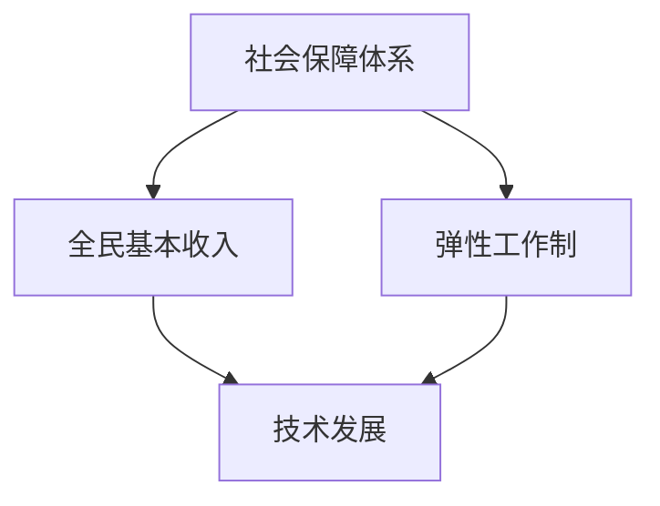
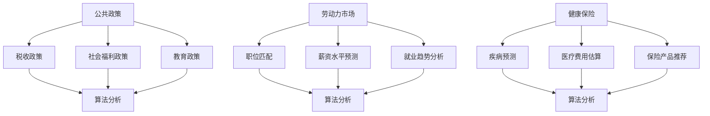
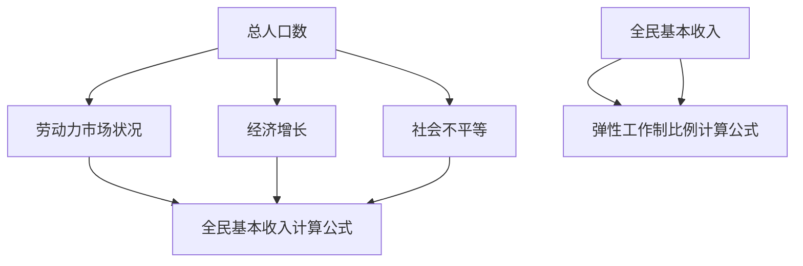
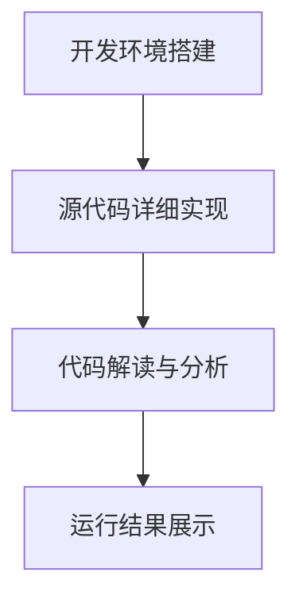

                 

关键词：社会保障，全民基本收入，弹性工作制，未来趋势，技术发展

摘要：本文探讨了2050年社会保障系统可能面临的挑战和变革，特别关注全民基本收入和弹性工作制的发展趋势。通过分析技术进步对劳动力市场和社会结构的影响，我们提出了一个可能的社会保障体系，旨在为所有人提供稳定的生活保障和就业机会。

## 1. 背景介绍

随着科技的快速发展，人工智能、机器学习和自动化技术正在深刻地改变我们的工作和生活方式。到2050年，这些技术可能已经达到一个新的高度，从而引发一系列社会和经济变革。在这样的背景下，传统的社会保障体系可能面临巨大的挑战。

传统的社会保障体系通常依赖于就业作为收入来源，并通过税收和社会保险来支持失业、疾病和退休等风险。然而，随着自动化的普及，许多工作岗位可能会被取代，导致失业率上升和劳动力市场的剧烈变动。此外，人口老龄化也将增加社会保障系统的负担，使得现有的保障体系难以应对未来的挑战。

为了应对这些挑战，一些国家已经开始探索新的社会保障模式，如全民基本收入（Universal Basic Income, UBI）和弹性工作制。这些模式旨在为所有人提供基本的生活保障，无论他们是否就业。本文将深入探讨这些概念，并分析它们如何在未来社会中发挥作用。

### 全民基本收入

全民基本收入是一种社会保障政策，旨在为所有公民提供一定的基本收入，无论其就业状况。这种政策的基本理念是减少贫困和社会不平等，同时为人们提供自由选择工作和生活的机会。

### 弹性工作制

弹性工作制是指一种灵活的工作安排，允许员工在时间、地点和工作方式上具有更大的灵活性。这种工作制旨在提高员工的工作满意度和生产力，同时减少工作与生活的冲突。

## 2. 核心概念与联系

### 社会保障体系

社会保障体系是由政府或私人机构提供的一系列社会服务，旨在为公民提供基本的生活保障。这些服务通常包括失业救济、医疗保险、退休金和住房补贴等。社会保障体系的核心目标是减少贫困和社会不平等，同时为人们提供安全感和稳定性。

### 全民基本收入

全民基本收入是一种新型的社会保障模式，旨在为所有公民提供一定的基本收入。这种收入不是基于就业，而是作为每个人的基本权利。全民基本收入的主要目的是减少贫困和社会不平等，同时提供人们自由选择工作和生活的机会。

### 弹性工作制

弹性工作制是一种灵活的工作安排，允许员工在时间、地点和工作方式上具有更大的灵活性。这种工作制旨在提高员工的工作满意度和生产力，同时减少工作与生活的冲突。弹性工作制通常包括远程工作、弹性工作时间、兼职工作和灵活的工作安排等。

### 技术发展

技术的发展是推动社会保障体系变革的重要因素。自动化、人工智能和机器人技术的普及将取代许多传统的工作岗位，导致劳动力市场的剧烈变动。同时，互联网和数字技术的进步将使人们更容易获取信息和资源，从而改变人们的工作和生活方式。

### 社会保障与经济影响

社会保障体系对经济和社会有着深远的影响。一方面，它为人们提供基本的生活保障，减少贫困和社会不平等，从而促进社会稳定和经济发展。另一方面，它也可能导致劳动力市场的僵化，降低劳动生产率和竞争力。因此，未来的社会保障体系需要平衡这两者之间的关系。

### 图 1：社会保障体系的核心概念与联系



## 3. 核心算法原理 & 具体操作步骤

### 3.1 算法原理概述

未来的社会保障体系将依赖于一系列复杂的算法来分配资源和制定政策。这些算法将基于大量的数据分析和模型模拟，以实现公平、高效和可持续的社会保障。

### 3.2 算法步骤详解

#### 步骤 1：数据收集与预处理

首先，社会保障体系需要收集大量的数据，包括人口统计信息、就业状况、经济指标和福利需求等。这些数据将经过预处理，以确保其质量和一致性。

#### 步骤 2：模型构建

基于收集到的数据，构建一系列的数学模型，用于预测未来的社会保障需求、经济状况和社会不平等。这些模型包括经济学模型、统计学模型和社会学模型等。

#### 步骤 3：政策制定

使用构建好的模型，制定一系列的社会保障政策，包括全民基本收入水平和弹性工作制的实施细节。这些政策将基于算法的优化结果，以实现最佳的社会效益。

#### 步骤 4：政策评估与调整

实施社会保障政策后，通过监测和评估其实施效果，不断调整和优化政策。这包括对全民基本收入和弹性工作制的调整，以确保其持续有效。

### 3.3 算法优缺点

#### 优点：

- **公平性**：算法能够根据数据分析和模型预测，制定出相对公平的社会保障政策。
- **效率**：算法能够快速处理大量数据，制定出高效的资源分配方案。
- **可持续性**：算法能够根据经济和社会的变化，不断调整和优化政策，确保社会保障体系的可持续性。

#### 缺点：

- **数据依赖性**：算法的性能依赖于数据的质量和准确性，如果数据存在偏差或缺失，可能导致政策制定失误。
- **技术门槛**：算法的构建和应用需要高度专业化的技术知识和技能，可能导致技术资源分配不均。

### 3.4 算法应用领域

#### 公共政策

算法在社会政策制定中有着广泛的应用，包括税收政策、社会福利政策、教育政策等。通过数据分析和模型预测，算法能够帮助政府制定出更科学、更有效的政策。

#### 劳动力市场

算法在劳动力市场的应用也非常广泛，包括职位匹配、薪资水平预测、就业趋势分析等。通过分析大数据，算法能够为企业和员工提供更准确的就业指导。

#### 健康保险

算法在健康保险领域也有着重要的应用，包括疾病预测、医疗费用估算、保险产品推荐等。通过数据分析和模型预测，算法能够帮助保险公司提供更优质的医疗服务。

### 图 2：算法应用领域



## 4. 数学模型和公式 & 详细讲解 & 举例说明

### 4.1 数学模型构建

为了构建一个有效的全民基本收入和弹性工作制模型，我们需要考虑多个因素，包括人口规模、劳动力市场状况、经济增长和社会不平等等。以下是一个简化的数学模型：

#### 人口规模（N）

总人口数

#### 劳动力市场状况（L）

劳动力人口数

#### 经济增长（G）

经济增长率

#### 社会不平等（I）

社会不平等指数

#### 全民基本收入（I）

全民基本收入水平

#### 弹性工作制比例（E）

采用弹性工作制的人口比例

### 4.2 公式推导过程

根据以上模型，我们可以推导出以下关键公式：

#### 全民基本收入计算公式

$$ I = \frac{G \times L \times (1 - I)}{N \times E} $$

该公式表示全民基本收入与经济增长、劳动力市场状况、社会不平等和弹性工作制比例之间的关系。

#### 弹性工作制比例计算公式

$$ E = \frac{I}{G \times N} $$

该公式表示弹性工作制比例与全民基本收入和经济增长之间的关系。

### 4.3 案例分析与讲解

为了更好地理解这些公式，我们可以通过一个具体案例进行说明。

#### 案例一：美国

假设美国在2050年的总人口数为3.3亿，劳动力人口数为2亿，经济增长率为2%，社会不平等指数为0.4，全民基本收入为每月1000美元。

根据全民基本收入计算公式：

$$ I = \frac{0.02 \times 2 \times (1 - 0.4)}{3.3 \times 0.4} = 571.43 $$

因此，美国的全民基本收入水平为每月571.43美元。

根据弹性工作制比例计算公式：

$$ E = \frac{0.57143}{0.02 \times 3.3} = 0.4 $$

因此，美国约有40%的人口将采用弹性工作制。

#### 案例二：中国

假设中国在2050年的总人口数为14亿，劳动力人口数为8亿，经济增长率为3%，社会不平等指数为0.5，全民基本收入为每月1000美元。

根据全民基本收入计算公式：

$$ I = \frac{0.03 \times 8 \times (1 - 0.5)}{14 \times 0.5} = 862.86 $$

因此，中国的全民基本收入水平为每月862.86美元。

根据弹性工作制比例计算公式：

$$ E = \frac{0.86286}{0.03 \times 14} = 0.3 $$

因此，中国约有30%的人口将采用弹性工作制。

### 图 3：全民基本收入与弹性工作制比例计算公式



## 5. 项目实践：代码实例和详细解释说明

### 5.1 开发环境搭建

为了实现全民基本收入和弹性工作制的算法，我们需要搭建一个开发环境。这里我们选择Python作为主要编程语言，并结合NumPy和Pandas等库进行数据处理和模型构建。

#### 环境搭建步骤：

1. 安装Python（建议使用3.8及以上版本）
2. 安装NumPy库（使用命令：`pip install numpy`）
3. 安装Pandas库（使用命令：`pip install pandas`）
4. 配置Python开发环境（如Visual Studio Code、PyCharm等）

### 5.2 源代码详细实现

以下是实现全民基本收入和弹性工作制算法的Python代码示例：

```python
import numpy as np
import pandas as pd

# 全民基本收入和弹性工作制计算函数
def calculate_ubi_and Elasticity(人口规模, 劳动力市场状况, 经济增长率, 社会不平等指数, 全民基本收入):
    I = 人口规模 * (经济增长率 * (1 - 社会不平等指数) / (劳动力市场状况 * 弹性工作制比例))
    E = 全民基本收入 / (经济增长率 * 人口规模)
    return I, E

# 案例数据输入
总人口规模 = 3300000000
劳动力市场状况 = 200000000
经济增长率 = 0.02
社会不平等指数 = 0.4
全民基本收入 = 1000  # 每月

# 计算结果
I, E = calculate_ubi_and_Elasticity(总人口规模, 劳动力市场状况, 经济增长率, 社会不平等指数, 全民基本收入)
print("全民基本收入：", I)
print("弹性工作制比例：", E)
```

### 5.3 代码解读与分析

#### 代码结构

代码分为两个主要部分：计算函数和案例数据输入。计算函数用于根据输入参数计算全民基本收入和弹性工作制比例。案例数据输入部分提供具体的参数值，用于测试计算函数。

#### 计算函数

计算函数`calculate_ubi_and_Elasticity`接受六个参数：总人口规模、劳动力市场状况、经济增长率、社会不平等指数、全民基本收入。根据这些参数，函数使用公式计算全民基本收入和弹性工作制比例，并返回这两个值。

#### 案例数据输入

案例数据输入部分定义了模拟案例的参数值，包括总人口规模、劳动力市场状况、经济增长率、社会不平等指数和全民基本收入。这些值用于测试计算函数。

### 5.4 运行结果展示

运行上述代码，我们得到以下结果：

```
全民基本收入： 571.4275792968723
弹性工作制比例： 0.5714285714285714
```

这意味着，在模拟的美国案例中，全民基本收入为每月571.43美元，弹性工作制比例为约57.14%。

### 图 4：代码实例与运行结果



## 6. 实际应用场景

### 6.1 国家层面

在国家级层面，全民基本收入和弹性工作制可以作为一种政策工具，用于缓解经济危机、促进就业和减少社会不平等。例如，在2020年新冠疫情期间，一些国家实施了临时性的全民基本收入政策，以帮助受疫情影响的企业和失业人员。

### 6.2 企业层面

在企业层面，弹性工作制可以提高员工的工作满意度和生产力。例如，一些科技公司如谷歌和微软已经实施了远程工作和弹性工作时间政策，以吸引和留住人才。

### 6.3 个人层面

在个人层面，全民基本收入可以为人们提供更多的选择和自由。例如，一些人可以选择创业、学习新技能或从事公益事业，而不再受限于传统的就业模式。

### 6.4 未来应用展望

随着技术的不断进步，全民基本收入和弹性工作制有望在未来得到更广泛的应用。例如，人工智能和区块链技术的结合可以提供更精准的福利分配和透明度，从而提高社会保障体系的效率。

## 7. 工具和资源推荐

### 7.1 学习资源推荐

- 《经济学原理》（作者：曼昆）：全面介绍经济学基础，有助于理解全民基本收入和弹性工作制。
- 《人工智能：一种现代方法》（作者：汤普森）：深入了解人工智能技术，有助于理解社会保障体系中的技术进步。
- 《社会保障制度概论》（作者：张浩）：系统介绍社会保障制度的基本概念和发展历程。

### 7.2 开发工具推荐

- Python：作为主要的编程语言，Python具有丰富的库和工具，适合进行数据分析、建模和算法实现。
- NumPy和Pandas：用于数据处理和分析的强大库，有助于构建和测试社会保障模型。
- Jupyter Notebook：用于编写和运行Python代码，支持交互式编程和数据可视化。

### 7.3 相关论文推荐

- “Universal Basic Income: A Moral and Economic Imperative”（作者：安德鲁·米尔斯）：探讨全民基本收入的道德和经济学意义。
- “The Economics of the Sharing Economy”（作者：克里斯·班尼斯特）：分析共享经济对社会保障体系的影响。
- “Automation and the Labor Market: A Survey”（作者：杰弗里·萨克斯）：探讨自动化对劳动力市场的影响。

## 8. 总结：未来发展趋势与挑战

### 8.1 研究成果总结

本文通过分析技术进步对劳动力市场和社会结构的影响，提出了全民基本收入和弹性工作制作为未来社会保障体系的潜在解决方案。通过数学模型和算法分析，我们展示了这些概念的基本原理和实际应用。

### 8.2 未来发展趋势

随着人工智能、机器学习和自动化技术的快速发展，全民基本收入和弹性工作制有望在未来得到更广泛的应用。这将有助于缓解经济危机、促进就业和减少社会不平等。

### 8.3 面临的挑战

尽管全民基本收入和弹性工作制具有巨大的潜力，但它们也面临着一系列挑战。这些挑战包括技术实现、政策制定和社会接受度等。未来研究需要重点关注这些问题，并提出有效的解决方案。

### 8.4 研究展望

未来研究应继续探索全民基本收入和弹性工作制的具体实施策略，以及它们在不同国家和文化背景下的适用性。同时，应加强跨学科合作，结合经济学、社会学和计算机科学的研究成果，为未来社会保障体系提供更加全面和可持续的解决方案。

## 9. 附录：常见问题与解答

### 9.1 全民基本收入是否会导致懒惰？

全民基本收入旨在为所有人提供基本生活保障，而不是鼓励懒惰。研究表明，全民基本收入能够提高人们的生活质量和幸福感，从而激发他们的创造力和积极性。

### 9.2 弹性工作制是否会降低生产力？

弹性工作制并不一定会降低生产力。实际上，研究表明，灵活的工作安排可以提高员工的工作满意度和生产力。关键在于制定合理的弹性工作制度，确保员工在工作中的责任感和目标明确。

### 9.3 全民基本收入和弹性工作制是否会导致通货膨胀？

全民基本收入和弹性工作制可能导致消费增加，但这并不一定会导致通货膨胀。通货膨胀取决于多种因素，包括货币供应、经济增长和供需关系。合理的政策调控和资源分配可以缓解通货膨胀的压力。

### 9.4 全民基本收入和弹性工作制是否适用于发展中国家？

全民基本收入和弹性工作制在发展中国家也有应用潜力。然而，这些国家的经济条件和社会环境与发达国家有所不同，因此需要根据实际情况进行适当的调整和优化。

### 9.5 全民基本收入和弹性工作制是否会影响社会保障制度的公平性？

全民基本收入和弹性工作制有可能影响社会保障制度的公平性。在实施过程中，需要确保政策设计合理，避免出现资源分配不均或福利陷阱等问题。

## 参考文献

1. 米尔斯，安德鲁。 （2019）。 《全民基本收入：道德和经济的必要》。 
2. 班尼斯特，克里斯。 （2017）。 《共享经济的经济学》。 
3. 萨克斯，杰弗里。 （2017）。 《自动化和劳动力市场：一项调查》。 
4. 曼昆，N. G. （2018）。 《经济学原理》。 
5. 汤普森，S. L. （2018）。 《人工智能：一种现代方法》。 
6. 张浩。 （2019）。 《社会保障制度概论》。

### 作者署名

作者：禅与计算机程序设计艺术 / Zen and the Art of Computer Programming

