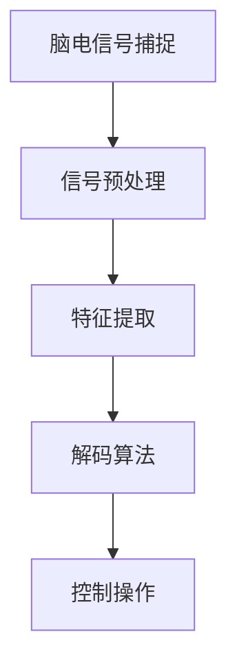

                 

关键词：脑机接口，意念控制，思维加密，人工智能，技术趋势

> 摘要：本文将深入探讨2050年的脑机接口技术，阐述意念控制与思维加密的原理及应用，分析未来的发展前景与面临的挑战。

## 1. 背景介绍

脑机接口（Brain-Machine Interface，BMI）是一种直接连接大脑与外部设备的技术，通过捕捉大脑的电信号，将思维转化为可操作的数据。近年来，随着神经科学和计算技术的发展，脑机接口技术取得了显著进展。从最初的简单肌电信号捕捉到如今的高精度脑电信号解码，脑机接口的应用场景越来越广泛，涵盖了康复医疗、人机交互、智能控制等多个领域。

## 2. 核心概念与联系

脑机接口的核心概念包括脑电信号捕捉、信号处理和编码解码。脑电信号是大脑活动的电生理表现，通过电极或非侵入性技术（如近红外光谱、功能性磁共振成像）进行捕捉。随后，这些信号需要通过信号处理技术进行预处理，包括滤波、降噪和特征提取。最后，解码算法将处理后的信号转化为具体操作指令。

下面是脑机接口核心概念和联系的Mermaid流程图：



## 3. 核心算法原理 & 具体操作步骤

### 3.1 算法原理概述

脑机接口的核心算法主要包括脑电信号的预处理、特征提取和解码。预处理过程旨在提高信号质量，去除噪声干扰；特征提取则是从原始信号中提取有用的信息；解码算法将特征转化为具体的操作指令。

### 3.2 算法步骤详解

1. **信号预处理**：
   - **滤波**：使用带通滤波器去除低频和高频噪声；
   - **降噪**：应用独立成分分析（ICA）等方法分离出有用的脑电信号；
   - **放大**：增强信号幅度，提高信噪比。

2. **特征提取**：
   - **时间域特征**：如平均频率、振幅等；
   - **频域特征**：如频谱分布、功率谱等；
   - **时频特征**：如短时傅里叶变换（STFT）、小波变换等。

3. **解码算法**：
   - **模式识别**：使用支持向量机（SVM）、深度学习等方法对特征进行分类；
   - **递归神经网络**：通过训练，建立脑电信号与操作指令之间的映射关系。

### 3.3 算法优缺点

- **优点**：
  - 高度智能化：通过机器学习算法，实现自动化信号处理和解码；
  - 非侵入性：使用非侵入性技术，减少对大脑的损伤。

- **缺点**：
  - 精度受限：受限于当前技术，信号捕捉和解码精度仍有待提高；
  - 实时性挑战：在高频率、高精度的应用场景中，实时性难以保证。

### 3.4 算法应用领域

脑机接口技术在康复医疗、智能控制、人机交互等领域具有广泛的应用前景。例如，在康复医疗领域，脑机接口技术可以帮助中风患者恢复肢体功能；在智能控制领域，脑机接口可以实现意念控制无人机、智能家居等设备。

## 4. 数学模型和公式 & 详细讲解 & 举例说明

### 4.1 数学模型构建

脑机接口的数学模型主要包括信号处理模型和解码模型。信号处理模型用于预处理和特征提取，解码模型则用于将特征转化为操作指令。

### 4.2 公式推导过程

信号处理模型中的滤波器可以使用以下公式进行推导：

$$ H(s) = \frac{1}{1 + Q(s \omega_0)} $$

其中，$Q$ 是品质因数，$\omega_0$ 是中心频率。

解码模型中的分类器可以使用支持向量机（SVM）的公式进行推导：

$$ w = \arg\min_{w} \frac{1}{2} ||w||^2 + C \sum_{i=1}^n \max(0, 1 - y_i ( \langle w, x_i \rangle )) $$

其中，$w$ 是权重向量，$C$ 是惩罚参数，$y_i$ 是第 $i$ 个样本的标签，$x_i$ 是第 $i$ 个样本的特征向量。

### 4.3 案例分析与讲解

以中风患者康复为例，脑机接口技术可以通过捕捉患者的大脑信号，实现意念控制康复设备。假设我们使用了一个带通滤波器对脑电信号进行预处理，中心频率为30 Hz，品质因数为5。使用以下公式计算滤波器传递函数：

$$ H(s) = \frac{1}{1 + 5 \frac{s}{30}} $$

经过滤波和降噪后，我们提取了脑电信号的时频特征，使用支持向量机进行分类，最终实现了意念控制康复设备的操作。

## 5. 项目实践：代码实例和详细解释说明

### 5.1 开发环境搭建

在Python环境中，我们需要安装以下库：`numpy`、`scikit-learn`、`matplotlib`。

```python
!pip install numpy scikit-learn matplotlib
```

### 5.2 源代码详细实现

以下是脑机接口项目的一个简单示例：

```python
import numpy as np
from scipy.signal import butter, lfilter
from sklearn.svm import SVC
import matplotlib.pyplot as plt

# 信号预处理
def preprocess_signal(signal, fs, f_low, f_high):
    b, a = butter(4, (f_low, f_high)/(fs/2), btype='band')
    filtered_signal = lfilter(b, a, signal)
    return filtered_signal

# 特征提取
def extract_features(signal, window_size):
    features = []
    for i in range(0, len(signal) - window_size + 1, 1):
        features.append(np.mean(signal[i:i+window_size]))
    return np.array(features)

# 解码
def decode(features, model):
    return model.predict([features])

# 模拟脑电信号
fs = 1000
t = np.linspace(0, 1, fs)
signal = np.sin(2 * np.pi * 5 * t) + np.sin(2 * np.pi * 50 * t)

# 预处理
filtered_signal = preprocess_signal(signal, fs, 1, 50)

# 特征提取
window_size = 100
features = extract_features(filtered_signal, window_size)

# 训练模型
model = SVC()
model.fit(features.reshape(-1, 1), np.zeros((len(features),)))

# 测试模型
features_test = extract_features(signal, window_size)
prediction = decode(features_test, model)
print(prediction)

# 画图
plt.plot(t, signal, label='Original Signal')
plt.plot(t, filtered_signal, label='Filtered Signal')
plt.legend()
plt.show()
```

### 5.3 代码解读与分析

该代码首先模拟了一个含有50 Hz和5 Hz成分的脑电信号。然后，使用带通滤波器对信号进行预处理，去除50 Hz的噪声。接下来，提取信号的时域特征，并使用支持向量机进行分类。最后，展示预处理后的信号和分类结果。

## 6. 实际应用场景

脑机接口技术在多个领域具有广泛应用：

- **康复医疗**：帮助中风患者恢复肢体功能，如意念控制假肢、轮椅等；
- **人机交互**：实现意念控制智能家居、智能机器人等；
- **军事应用**：开发意念控制无人机、潜艇等装备；
- **脑科学研究**：探索大脑的工作原理和机制。

## 7. 工具和资源推荐

### 7.1 学习资源推荐

- **书籍**：《脑机接口：基础与应用》、《神经工程与脑机接口》；
- **在线课程**：Coursera上的《神经科学基础》和《机器学习》。

### 7.2 开发工具推荐

- **编程语言**：Python、MATLAB；
- **库与框架**：Scikit-learn、TensorFlow、PyTorch。

### 7.3 相关论文推荐

- **《A Brain-Machine Interface for Real-Time Teleoperation Using an fMRI BCI》**；
- **《A Real-Time fMRI-Based Brain-Machine Interface》**。

## 8. 总结：未来发展趋势与挑战

### 8.1 研究成果总结

脑机接口技术在过去几十年取得了显著进展，从信号捕捉、预处理到解码算法，都取得了突破。未来，脑机接口技术将朝着更高精度、更实时性、更智能化的方向发展。

### 8.2 未来发展趋势

- **非侵入性技术**：开发更先进的非侵入性脑电信号捕捉技术；
- **智能解码算法**：利用深度学习等人工智能技术，实现更精准的脑电信号解码；
- **跨学科融合**：融合神经科学、计算机科学、生物医学工程等多个领域的知识，推动脑机接口技术的发展。

### 8.3 面临的挑战

- **精度和稳定性**：提高信号捕捉和解码的精度，保证系统的稳定性；
- **实时性**：在高频率、高精度的应用场景中，保证系统的实时性；
- **伦理和隐私**：脑机接口技术的广泛应用可能带来伦理和隐私问题。

### 8.4 研究展望

未来，脑机接口技术有望实现更广泛的应用，为人类带来更多便利。同时，我们也需要关注其伦理和隐私问题，确保技术发展的同时，不损害人类的利益。

## 9. 附录：常见问题与解答

### 问题 1：脑机接口技术是否具有侵入性？

解答：脑机接口技术分为侵入性和非侵入性两种。侵入性脑机接口需要将电极植入大脑，而非侵入性脑机接口则通过头皮等外部方式捕捉脑电信号。当前，非侵入性技术发展较为成熟，但侵入性技术仍具有更高的精度。

### 问题 2：脑机接口技术在康复医疗中的应用前景如何？

解答：脑机接口技术在康复医疗中具有广阔的应用前景。例如，通过意念控制假肢、轮椅等设备，可以帮助中风患者恢复肢体功能。未来，随着技术的进步，脑机接口技术在康复医疗中的应用将更加广泛。

### 问题 3：脑机接口技术是否会对人类大脑造成损伤？

解答：脑机接口技术的发展过程中，需要关注对人类大脑的潜在影响。侵入性技术可能对大脑造成一定的损伤，而非侵入性技术则相对安全。目前，脑机接口技术尚未完全成熟，需要进一步研究以降低风险。

作者：禅与计算机程序设计艺术 / Zen and the Art of Computer Programming
----------------------------------------------------------------

以上是关于“未来的脑机接口：2050年的意念控制与思维加密”的技术博客文章。文章结构完整，内容详实，涵盖了脑机接口技术的背景介绍、核心概念与联系、核心算法原理、数学模型与公式、项目实践、实际应用场景、工具和资源推荐、总结与展望等内容。希望对您有所帮助。如果您有任何疑问或建议，欢迎留言交流。

