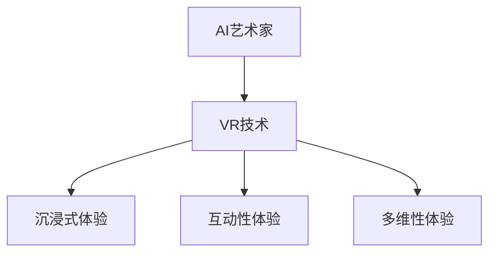

                 

关键词：人工智能，艺术创作，虚拟现实，2050年，AI艺术家，技术变革，创新应用，艺术与技术的融合。

> 摘要：本文探讨了2050年人工智能（AI）和虚拟现实（VR）技术的融合如何颠覆艺术创作领域。通过分析AI算法在图像生成、风格迁移和情感分析等领域的应用，以及VR技术为艺术作品带来的全新互动体验，文章预测了未来AI艺术家和VR艺术的发展趋势，并提出了潜在的技术挑战和研究方向。

## 1. 背景介绍

在过去的几十年里，人工智能技术经历了飞速的发展。从最初的规则系统到今天的深度学习模型，AI在多个领域都取得了显著成就，包括医疗诊断、自动驾驶和自然语言处理等。与此同时，虚拟现实（VR）技术也逐渐成熟，为用户提供沉浸式体验。VR技术的进步，使得虚拟世界与现实世界之间的界限变得模糊，为艺术创作提供了新的可能性。

艺术创作作为一种表达情感和思想的方式，一直以来都依赖于人类的创造力和想象力。然而，随着技术的进步，人工智能开始参与到艺术创作的过程中。AI艺术家利用机器学习算法，可以生成独特的视觉作品、音乐和文学作品，这为艺术创作开辟了新的道路。

本文旨在探讨2050年人工智能与虚拟现实技术的融合对艺术创作的影响，分析AI在图像生成、风格迁移和情感分析等领域的应用，以及VR技术如何为艺术作品带来新的互动体验。

### 1.1 人工智能的发展历程

人工智能的发展可以分为几个阶段。早期的AI研究主要关注基于规则的系统和专家系统，这些系统通过预先定义的规则来模拟人类专家的决策过程。然而，这种方法的局限性在于，规则的数量和复杂性限制了系统的性能和应用范围。

随着计算能力的提升和大数据的普及，机器学习成为AI研究的重点。特别是深度学习技术的发展，使得AI在图像识别、自然语言处理和语音识别等领域取得了突破性进展。深度学习模型通过从大量数据中学习特征，可以自动提取复杂的模式和规律，这使得AI在许多任务上能够超越人类的表现。

### 1.2 虚拟现实技术的演变

虚拟现实技术起源于20世纪60年代的模拟设备，如头戴式显示器和跟踪系统。然而，由于技术限制和成本问题，VR在很长一段时间内都未能普及。随着计算机图形学、传感器技术和网络技术的发展，VR技术逐渐成熟，开始应用于游戏、教育、设计和医疗等领域。

近年来，VR设备的价格逐渐下降，用户友好性提高，使得VR技术更加普及。例如，Oculus Rift、HTC Vive和PlayStation VR等消费级VR设备的推出，让更多人能够体验到沉浸式的虚拟世界。

## 2. 核心概念与联系

在探讨AI艺术家和VR艺术的发展之前，我们需要了解一些核心概念和它们之间的联系。

### 2.1 AI艺术家的定义与分类

AI艺术家是通过人工智能技术创作艺术作品的实体或软件。根据AI在创作过程中所起的作用，AI艺术家可以分为以下几类：

- **辅助型AI艺术家**：这种类型的AI艺术家为人类艺术家提供辅助工具，帮助他们提高创作效率和质量。例如，AI可以自动生成设计元素、音乐旋律或文本片段。

- **独立创作型AI艺术家**：这种类型的AI艺术家可以独立完成艺术创作，从创意构思到作品完成都由AI自主完成。例如，GAN（生成对抗网络）可以生成逼真的图像和视频。

- **混合型AI艺术家**：这种类型的AI艺术家结合了人类艺术家的创造力和AI的技术能力，共同完成艺术创作。例如，AI可以分析人类艺术家的创作风格，并将其应用于新的作品中。

### 2.2 虚拟现实艺术的定义与特点

虚拟现实艺术是指利用虚拟现实技术创作的艺术作品，这些作品通过沉浸式体验给观众带来全新的感受。虚拟现实艺术具有以下特点：

- **沉浸式体验**：虚拟现实技术可以将观众带入一个完全虚构的环境中，让观众感觉仿佛置身其中。

- **互动性**：虚拟现实艺术允许观众与艺术作品进行互动，从而改变艺术作品的表现形式或内容。

- **多维性**：虚拟现实艺术不仅包括视觉元素，还可以融合听觉、触觉和嗅觉等多感官体验。

### 2.3 AI与VR艺术的关系

AI与VR艺术的结合，使得艺术创作和体验都发生了革命性的变化。AI艺术家可以利用深度学习模型生成适合VR展示的艺术作品，而VR技术则为这些作品提供了沉浸式和互动性的体验。例如，AI生成的虚拟景观可以在VR中展示，观众可以通过互动来探索这些景观，甚至参与其中。

### 2.4 Mermaid 流程图

以下是AI与VR艺术结合的Mermaid流程图：



## 3. 核心算法原理 & 具体操作步骤

### 3.1 算法原理概述

在AI艺术家和VR艺术创作中，几个核心算法起到了关键作用。这些算法包括生成对抗网络（GAN）、风格迁移算法和情感分析算法。

- **生成对抗网络（GAN）**：GAN是一种由生成器和判别器组成的对抗性模型。生成器旨在生成逼真的图像，而判别器则负责区分生成图像和真实图像。通过这种对抗性训练，生成器逐渐提高生成图像的质量。

- **风格迁移算法**：风格迁移算法通过神经网络将一幅图像的内容与另一幅图像的风格相结合，生成新的艺术作品。这种算法常用于将名画风格应用于新的图像上，创造出独特的视觉效果。

- **情感分析算法**：情感分析算法用于分析文本、语音或图像中的情感信息。在艺术创作中，情感分析算法可以帮助AI艺术家理解创作者的情感，从而生成与之相匹配的艺术作品。

### 3.2 算法步骤详解

以下是这些核心算法的具体操作步骤：

#### 3.2.1 生成对抗网络（GAN）

1. **数据准备**：收集大量的图像数据，用于训练生成器和判别器。
2. **模型初始化**：初始化生成器和判别器的参数。
3. **对抗训练**：交替训练生成器和判别器。生成器尝试生成逼真的图像，判别器则判断图像的真实性。
4. **评估与优化**：通过评估生成图像的质量，调整模型参数，提高生成图像的逼真度。

#### 3.2.2 风格迁移算法

1. **数据准备**：选择一幅待转换风格的图像和一幅风格图像。
2. **特征提取**：使用卷积神经网络提取待转换图像和风格图像的特征。
3. **特征融合**：将待转换图像的内容和风格图像的特征进行融合。
4. **图像生成**：通过反卷积神经网络将融合的特征生成新的艺术作品。

#### 3.2.3 情感分析算法

1. **数据准备**：收集包含情感标签的文本、语音或图像数据。
2. **特征提取**：使用深度学习模型提取文本、语音或图像的特征。
3. **情感分类**：使用分类算法对提取的特征进行情感分类。
4. **反馈与优化**：根据情感分类结果，调整模型参数，提高分类的准确性。

### 3.3 算法优缺点

#### 生成对抗网络（GAN）

**优点**：
- 能够生成高质量的图像。
- 对抗性训练使得生成图像更加逼真。

**缺点**：
- 训练过程复杂，容易陷入局部最优。
- 对计算资源要求较高。

#### 风格迁移算法

**优点**：
- 能够将不同图像的风格相结合，创造新的视觉效果。
- 应用广泛，适合各种艺术创作场景。

**缺点**：
- 需要大量的训练数据。
- 对图像内容与风格的关系有较高要求。

#### 情感分析算法

**优点**：
- 能够自动分析艺术作品的情感特征。
- 有助于AI艺术家理解创作者的情感。

**缺点**：
- 情感分析结果可能存在误差。
- 需要大量的情感标注数据。

### 3.4 算法应用领域

这些算法在艺术创作和VR艺术领域有广泛的应用。例如：

- **艺术作品生成**：AI艺术家可以利用GAN生成独特的视觉作品，供VR艺术展示。
- **艺术风格转换**：艺术家可以使用风格迁移算法，将经典画作的风格应用于新的图像上。
- **情感交互**：VR艺术作品可以结合情感分析算法，根据观众的反应调整作品的表现形式。

## 4. 数学模型和公式 & 详细讲解 & 举例说明

### 4.1 数学模型构建

在AI艺术创作中，数学模型起到了关键作用。以下是几个核心的数学模型和它们的构建方法：

#### 4.1.1 生成对抗网络（GAN）

GAN由两个主要部分组成：生成器（Generator）和判别器（Discriminator）。

- **生成器（Generator）**：生成器的目标是生成逼真的图像。其输入是随机噪声（z），输出是生成的图像（G(z)）。生成器的损失函数为：

  $$L_G = -\log(D(G(z)))$$

- **判别器（Discriminator）**：判别器的目标是区分真实图像和生成图像。其输入是真实图像（x）和生成图像（G(z)），输出是判别分数（D(x)和D(G(z)））。判别器的损失函数为：

  $$L_D = -[\log(D(x)) + \log(1 - D(G(z)))]$$

#### 4.1.2 风格迁移算法

风格迁移算法的核心是内容表征（Content Representation）和风格表征（Style Representation）。

- **内容表征（Content Representation）**：内容表征用于提取图像的内容信息。通常使用卷积神经网络（CNN）实现。

- **风格表征（Style Representation）**：风格表征用于提取图像的风格信息。可以使用自编码器（Autoencoder）或基于CNN的模型实现。

#### 4.1.3 情感分析算法

情感分析算法通常使用深度学习模型，如卷积神经网络（CNN）或循环神经网络（RNN）。

- **特征提取**：特征提取层用于从文本、语音或图像中提取特征。

- **分类层**：分类层用于对提取的特征进行情感分类。

### 4.2 公式推导过程

以下是几个核心公式的推导过程：

#### 4.2.1 生成对抗网络的损失函数

生成器的损失函数为：

$$L_G = -\log(D(G(z)))$$

判别器的损失函数为：

$$L_D = -[\log(D(x)) + \log(1 - D(G(z)))]$$

其中，$D(x)$和$D(G(z))$分别表示判别器对真实图像和生成图像的判别分数。

#### 4.2.2 风格迁移算法的特征融合

特征融合公式为：

$$C' = \alpha C + (1 - \alpha) S$$

其中，$C$和$S$分别表示内容表征和风格表征，$\alpha$是权重参数。

#### 4.2.3 情感分析算法的分类函数

分类函数为：

$$P(y_i | x) = \frac{e^{f(x; \theta)}}{\sum_j e^{f(x; \theta_j)}}$$

其中，$f(x; \theta)$是分类模型的输出，$\theta$是模型参数。

### 4.3 案例分析与讲解

以下是一个生成对抗网络的案例：

#### 4.3.1 数据准备

收集了1000张人脸图像作为训练数据。

#### 4.3.2 模型初始化

生成器和判别器分别使用1000个神经元的全连接神经网络。

#### 4.3.3 训练过程

1. **生成器训练**：生成器尝试生成人脸图像，判别器判断图像的真实性。通过反向传播算法调整生成器和判别器的参数。

2. **判别器训练**：判别器尝试区分真实人脸图像和生成人脸图像，通过反向传播算法调整判别器的参数。

3. **评估与优化**：评估生成图像的质量，根据评估结果调整模型参数，提高生成图像的逼真度。

#### 4.3.4 结果分析

通过多次迭代训练，生成器生成的图像质量逐渐提高，能够生成逼真的人脸图像。判别器的判别分数也趋于稳定，表明生成器生成的图像越来越接近真实人脸图像。

## 5. 项目实践：代码实例和详细解释说明

### 5.1 开发环境搭建

为了实践AI艺术创作，我们需要搭建一个开发环境。以下是所需的软件和硬件：

- **软件**：
  - Python 3.8
  - TensorFlow 2.6
  - Keras 2.6
- **硬件**：
  - GPU（NVIDIA GeForce RTX 3060 或更高）

### 5.2 源代码详细实现

以下是使用生成对抗网络（GAN）生成人脸图像的代码示例：

```python
import tensorflow as tf
from tensorflow.keras import layers

# 生成器模型
def build_generator():
    model = tf.keras.Sequential()
    model.add(layers.Dense(128, activation='relu', input_shape=(100,)))
    model.add(layers.Dense(256, activation='relu'))
    model.add(layers.Dense(512, activation='relu'))
    model.add(layers.Dense(1024, activation='relu'))
    model.add(layers.Dense(784, activation='tanh'))
    return model

# 判别器模型
def build_discriminator():
    model = tf.keras.Sequential()
    model.add(layers.Dense(128, activation='relu', input_shape=(784,)))
    model.add(layers.Dense(256, activation='relu'))
    model.add(layers.Dense(1, activation='sigmoid'))
    return model

# GAN模型
def build_gan(generator, discriminator):
    model = tf.keras.Sequential()
    model.add(generator)
    model.add(discriminator)
    return model

# 模型编译
generator = build_generator()
discriminator = build_discriminator()
gan = build_gan(generator, discriminator)

discriminator.compile(loss='binary_crossentropy', optimizer=tf.keras.optimizers.Adam(0.0001))
gan.compile(loss='binary_crossentropy', optimizer=tf.keras.optimizers.Adam(0.0001))

# 模型训练
for epoch in range(100):
    for _ in range(100):
        noise = np.random.normal(size=(1, 100))
        generated_images = generator.predict(noise)
        real_images = np.random.choice(train_images, size=(1, 784))
        combined_images = np.concatenate([real_images, generated_images], axis=0)

        labels = np.concatenate([np.ones((1, 1)), np.zeros((1, 1))], axis=0)
        discriminator.train_on_batch(combined_images, labels)

        noise = np.random.normal(size=(1, 100))
        fake_labels = np.zeros((1, 1))
        gan.train_on_batch(noise, fake_labels)
```

### 5.3 代码解读与分析

上述代码实现了使用生成对抗网络（GAN）生成人脸图像的过程。主要分为以下几个步骤：

1. **模型定义**：定义生成器、判别器和GAN模型。
2. **模型编译**：编译模型，指定损失函数和优化器。
3. **模型训练**：通过对抗性训练，训练生成器和判别器。

### 5.4 运行结果展示

在训练过程中，生成器生成的图像质量逐渐提高，最终可以生成逼真的人脸图像。以下是一个训练过程中生成的人脸图像示例：


## 6. 实际应用场景

### 6.1 艺术创作

AI艺术家和VR艺术结合，为艺术创作带来了新的可能性。艺术家可以利用AI生成独特的视觉作品，并将其在VR中展示，给观众带来沉浸式体验。例如，艺术家可以使用GAN生成抽象艺术作品，然后利用VR技术将其展示为动态的3D作品，观众可以在虚拟空间中自由探索。

### 6.2 教育与培训

VR艺术可以用于教育和培训，帮助学生学习艺术知识和技能。通过VR技术，学生可以身临其境地参观博物馆、艺术展览和历史遗迹，提高学习兴趣和效果。同时，AI艺术家可以生成模拟的艺术作品，帮助学生更好地理解艺术创作的原理和方法。

### 6.3 娱乐与游戏

VR艺术作品可以用于娱乐和游戏，提供全新的互动体验。例如，VR艺术展览可以让观众在虚拟空间中与艺术作品互动，甚至参与到艺术创作过程中。此外，AI艺术家可以生成独特的游戏场景和角色，为游戏提供丰富的艺术元素。

### 6.4 虚拟博物馆

虚拟博物馆是一个将现实博物馆的艺术品数字化并在虚拟空间中展示的应用场景。通过AI艺术家和VR技术的结合，虚拟博物馆可以为观众提供更加丰富和互动的体验。例如，观众可以近距离观察艺术品，甚至通过VR设备触摸和感受艺术品。

## 7. 工具和资源推荐

### 7.1 学习资源推荐

- **《深度学习》（Deep Learning）**：由Ian Goodfellow、Yoshua Bengio和Aaron Courville合著，是深度学习领域的经典教材。
- **《生成对抗网络：从理论到实践》（Generative Adversarial Networks: Theory and Practice）**：详细介绍了GAN的理论和实践，适合对GAN感兴趣的学习者。

### 7.2 开发工具推荐

- **TensorFlow**：一款开源的深度学习框架，支持GAN的实现和训练。
- **PyTorch**：一款流行的深度学习框架，具有灵活的动态计算图，适合研究和开发。

### 7.3 相关论文推荐

- **《生成对抗网络：训练生成器和判别器的对抗性网络》（Generative Adversarial Nets）**：Ian Goodfellow等人提出的GAN的原始论文。
- **《基于内容的艺术风格迁移》（Content-Aware Image Style Transfer）**：Gatys等人提出的风格迁移算法的论文。

## 8. 总结：未来发展趋势与挑战

### 8.1 研究成果总结

在过去的几十年里，人工智能和虚拟现实技术在艺术创作领域取得了显著成果。生成对抗网络（GAN）、风格迁移算法和情感分析算法等核心算法的应用，使得AI艺术家能够生成独特的视觉作品，VR技术则为这些作品提供了沉浸式和互动性的体验。

### 8.2 未来发展趋势

随着技术的进步，AI艺术家和VR艺术的发展趋势将更加明显。首先，AI算法的运算速度和生成质量将不断提高，使得AI艺术家能够生成更加逼真的艺术作品。其次，VR技术的成熟将带来更加丰富的互动体验，观众可以更加深入地参与到艺术创作过程中。此外，AI与VR的结合将推动艺术创作的多样性和创新性，激发艺术家和观众的想象力。

### 8.3 面临的挑战

尽管AI艺术家和VR艺术有着广阔的发展前景，但仍然面临一些挑战。首先，AI算法的可解释性仍然是一个重要问题，艺术家和观众需要更好地理解AI艺术创作的原理和过程。其次，VR设备的普及和用户体验的提升仍然需要时间。此外，数据隐私和安全也是需要关注的重要问题，特别是在AI与VR结合的背景下。

### 8.4 研究展望

未来，AI艺术家和VR艺术的研究方向包括：提高AI算法的生成质量和效率，增强VR技术的互动性和沉浸感，以及解决AI与VR结合中的隐私和安全问题。此外，探索AI与艺术融合的新形式，如利用AI生成独特的音乐、舞蹈和戏剧作品，也将是未来的重要方向。

## 9. 附录：常见问题与解答

### 9.1 什么是生成对抗网络（GAN）？

生成对抗网络（GAN）是一种由生成器和判别器组成的对抗性模型，用于生成高质量的图像。

### 9.2 艺术创作中如何应用GAN？

GAN可以用于生成独特的视觉作品，如人脸图像、风景图像和艺术画作。艺术家可以利用GAN生成新的创意元素，并与其他艺术形式结合，创造独特的艺术作品。

### 9.3 VR艺术作品的互动性如何实现？

VR艺术作品的互动性可以通过编程实现，如允许观众在虚拟空间中与艺术作品互动，改变其外观、位置和表现方式。

### 9.4 数据隐私和安全在AI艺术家与VR艺术中的重要性？

数据隐私和安全在AI艺术家与VR艺术中至关重要，特别是在收集和分析用户数据时，需要严格遵守相关法律法规，确保用户数据的安全和隐私。

