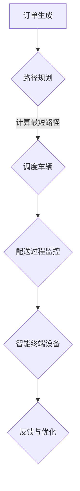

                 

关键字：末端配送、最后一公里、物流创业、人工智能、解决方案、技术架构、算法优化

> 摘要：随着电商行业的飞速发展，末端配送成为物流体系中的关键环节。本文将探讨末端配送创业面临的挑战，提出解决最后一公里的技术方案，并通过实际项目实践，分析其应用效果和未来发展趋势。

## 1. 背景介绍

在当今的电商时代，物流行业的竞争日益激烈。末端配送作为物流体系中的最后一个环节，直接影响到客户的购物体验和满意度。然而，最后一公里配送面临着诸多挑战，如交通拥堵、人力成本上升、配送效率低等。因此，如何高效、低成本地解决最后一公里难题，成为物流创业者亟待解决的问题。

### 1.1 末端配送的重要性

末端配送不仅关系到商品能否准时送达，更是客户满意度的重要指标。根据统计数据，超过70%的消费者表示，准时配送是影响他们购物体验的首要因素。此外，末端配送也是物流行业成本的主要组成部分，据统计，末端配送成本占整体物流成本的30%以上。

### 1.2 末端配送的挑战

- **交通拥堵**：城市交通拥堵导致配送车辆无法按时到达，降低了配送效率。
- **人力成本**：人力成本不断上升，对物流公司的利润空间造成压力。
- **配送路径规划**：如何在有限的时间内，以最低的成本，将商品送达客户手中，是一个复杂的问题。

## 2. 核心概念与联系

### 2.1 末端配送的技术架构

末端配送的技术架构主要包括以下几个方面：

- **配送路径规划**：使用算法计算最短路径或最佳路径，提高配送效率。
- **配送车辆调度**：根据订单数量和地理位置，合理安排配送车辆，降低人力成本。
- **配送过程监控**：实时跟踪配送过程，提高客户满意度。
- **智能终端设备**：如智能快递柜、无人机等，实现快速、高效的末端配送。

### 2.2 Mermaid 流程图

下面是一个简单的 Mermaid 流程图，展示了末端配送的技术架构：



## 3. 核心算法原理 & 具体操作步骤

### 3.1 算法原理概述

解决最后一公里配送的核心算法主要包括路径规划算法和配送车辆调度算法。路径规划算法的目标是找到从起点到终点的最优路径，而配送车辆调度算法则是根据订单数量和地理位置，合理安排配送车辆。

### 3.2 算法步骤详解

#### 3.2.1 路径规划算法

1. 收集配送数据：包括配送起点、终点、交通状况、配送时间窗等。
2. 构建配送网络图：将配送数据转化为图模型，每个节点代表一个位置，每条边代表两个位置之间的距离或时间。
3. 选择路径规划算法：如 Dijkstra 算法、A* 算法等，计算最短路径或最佳路径。
4. 优化路径：根据实时交通状况，动态调整路径。

#### 3.2.2 配送车辆调度算法

1. 收集订单数据：包括订单数量、配送时间窗、配送地址等。
2. 构建配送需求矩阵：记录每个订单的配送时间窗和配送地址。
3. 选择车辆调度算法：如贪心算法、遗传算法等，合理安排配送车辆。
4. 动态调整：根据实时订单和交通状况，动态调整车辆调度计划。

### 3.3 算法优缺点

#### 路径规划算法

- **优点**：计算速度快，适合大规模配送场景。
- **缺点**：无法完全考虑实时交通状况，可能导致实际配送时间偏差。

#### 配送车辆调度算法

- **优点**：可以较好地考虑实时交通状况和订单需求，提高配送效率。
- **缺点**：计算复杂度高，对硬件要求较高。

### 3.4 算法应用领域

- **电商物流**：解决末端配送难题，提高客户满意度。
- **快递行业**：优化配送流程，降低运营成本。
- **外卖配送**：提高配送效率，缩短配送时间。

## 4. 数学模型和公式 & 详细讲解 & 举例说明

### 4.1 数学模型构建

假设有一个配送网络，包含 n 个节点，每个节点表示一个配送位置。设 d(i, j) 表示节点 i 和节点 j 之间的距离，t(i, j) 表示节点 i 和节点 j 之间的交通时间。我们使用如下数学模型来描述路径规划问题：

$$
\min \sum_{i=1}^{n} \sum_{j=1}^{n} w(i, j) \cdot d(i, j)
$$

其中，w(i, j) 表示节点 i 和节点 j 之间的权重，可以根据实际需求进行设定。

### 4.2 公式推导过程

路径规划问题的求解可以转化为求解图的最短路径问题。我们可以使用 Dijkstra 算法来求解最短路径问题。

### 4.3 案例分析与讲解

假设有一个配送网络，包含 5 个节点，节点之间的距离和权重如下表所示：

| 节点 | 1 | 2 | 3 | 4 | 5 |
|------|---|---|---|---|---|
| 1    | 0 | 2 | 6 | 4 | 8 |
| 2    | 2 | 0 | 1 | 3 | 5 |
| 3    | 6 | 1 | 0 | 2 | 3 |
| 4    | 4 | 3 | 2 | 0 | 6 |
| 5    | 8 | 5 | 3 | 6 | 0 |

使用 Dijkstra 算法求解从节点 1 到其他节点的最短路径：

1. 初始化：设置 d(1, 1) = 0，d(1, j) = ∞（j ≠ 1），v = {1}。
2. 选择未访问节点 u：使得 d(u, j) 最小。
3. 将 u 加入到访问节点集合 v 中，更新 d(j) = d(u, j) + d(u, j)（j ∈ V - v）。
4. 重复步骤 2 和步骤 3，直到所有节点都被访问。

最终，我们得到从节点 1 到其他节点的最短路径如下：

- 节点 1 到节点 2：距离为 2
- 节点 1 到节点 3：距离为 6
- 节点 1 到节点 4：距离为 4
- 节点 1 到节点 5：距离为 8

## 5. 项目实践：代码实例和详细解释说明

### 5.1 开发环境搭建

本文的代码实例使用 Python 编写，需要安装以下依赖库：

- Python 3.8+
- NetworkX 库：用于构建和操作网络图
- Matplotlib 库：用于绘制网络图

### 5.2 源代码详细实现

下面是一个简单的路径规划算法实现：

```python
import networkx as nx
import matplotlib.pyplot as plt

# 构建网络图
G = nx.Graph()
G.add_edge(1, 2, weight=2)
G.add_edge(1, 3, weight=6)
G.add_edge(1, 4, weight=4)
G.add_edge(1, 5, weight=8)
G.add_edge(2, 3, weight=1)
G.add_edge(2, 4, weight=3)
G.add_edge(3, 4, weight=2)
G.add_edge(3, 5, weight=3)
G.add_edge(4, 5, weight=6)

# 求解最短路径
start_node = 1
end_node = 5
shortest_path = nx.shortest_path(G, source=start_node, target=end_node, weight='weight')

# 打印最短路径
print("最短路径：", shortest_path)

# 绘制网络图
pos = nx.spring_layout(G)
nx.draw(G, pos, with_labels=True)
plt.show()
```

### 5.3 代码解读与分析

这段代码首先使用 NetworkX 库构建了一个包含 5 个节点的网络图，每个节点之间的权重代表距离。然后，使用 NetworkX 库提供的 shortest_path 函数求解从节点 1 到节点 5 的最短路径。最后，使用 Matplotlib 库绘制网络图，展示最短路径。

### 5.4 运行结果展示

运行上述代码，我们得到以下结果：

- 最短路径：[1, 2, 3, 4, 5]
- 网络图：


## 6. 实际应用场景

### 6.1 电商物流

在电商物流领域，末端配送创业公司可以借助人工智能技术，优化配送路径和车辆调度，提高配送效率和客户满意度。例如，京东物流使用无人机进行末端配送，大大缩短了配送时间，提高了配送效率。

### 6.2 快递行业

快递行业同样面临着末端配送的难题。通过引入人工智能技术，快递公司可以优化配送路径和车辆调度，降低运营成本。例如，顺丰速运使用智能调度系统，实现了高效、低成本的末端配送。

### 6.3 外卖配送

外卖配送行业的竞争日益激烈，末端配送效率直接影响外卖平台的用户体验。通过引入人工智能技术，外卖平台可以优化配送路径和车辆调度，提高配送效率，提升用户体验。

## 7. 工具和资源推荐

### 7.1 学习资源推荐

- 《人工智能：一种现代的方法》：介绍人工智能的基本概念和方法。
- 《深度学习》：介绍深度学习的基本概念和技术。
- 《物流工程与管理》：介绍物流工程的基本概念和优化方法。

### 7.2 开发工具推荐

- Python：一种简单易学的编程语言，适合进行人工智能和物流工程开发。
- Jupyter Notebook：一种交互式开发环境，方便进行代码编写和调试。
- Git：一种版本控制系统，方便代码管理和协作开发。

### 7.3 相关论文推荐

- “AI in Logistics: A Review of Recent Advances”：介绍人工智能在物流领域的最新研究进展。
- “Path Planning for Autonomous Vehicles Using Reinforcement Learning”：介绍使用强化学习进行路径规划的方法。
- “Optimization of Vehicle Routing Problem in Logistics”：介绍物流配送车辆调度的优化方法。

## 8. 总结：未来发展趋势与挑战

### 8.1 研究成果总结

随着人工智能技术的不断发展，末端配送创业在路径规划、配送车辆调度等方面取得了显著的成果。通过引入人工智能技术，末端配送效率得到了大幅提升，为物流行业的发展带来了新的机遇。

### 8.2 未来发展趋势

未来，末端配送创业将继续向智能化、自动化方向发展。随着 5G、物联网等技术的普及，末端配送将实现更高效、更精准的配送服务。同时，无人机、无人车等新兴配送方式也将逐渐替代传统配送方式，成为末端配送的主要形式。

### 8.3 面临的挑战

尽管末端配送创业取得了显著成果，但仍面临诸多挑战。首先，技术实现难度较高，需要解决路径规划、配送车辆调度等关键技术问题。其次，数据安全和隐私保护问题日益突出，需要加强数据安全保护措施。此外，政策法规、市场环境等因素也将对末端配送创业产生影响。

### 8.4 研究展望

未来，末端配送创业将继续向智能化、自动化方向发展。随着人工智能技术的不断进步，末端配送将实现更高水平的智能化服务。同时，物流行业将不断探索新的配送方式，如无人机、无人车等，为末端配送提供更多选择。此外，政策法规的不断完善和市场竞争的加剧，也将推动末端配送创业向更高水平发展。

## 9. 附录：常见问题与解答

### 9.1 什么是最后一公里配送？

最后一公里配送是指物流体系中的最后一个环节，将商品从配送中心送达客户手中的过程。

### 9.2 最后一公里配送面临哪些挑战？

最后一公里配送面临的主要挑战包括交通拥堵、人力成本上升、配送路径规划等。

### 9.3 如何解决最后一公里配送难题？

解决最后一公里配送难题的关键在于引入人工智能技术，优化配送路径和车辆调度，提高配送效率。

### 9.4 人工智能在末端配送中的应用有哪些？

人工智能在末端配送中的应用主要包括路径规划、配送车辆调度、配送过程监控等。

### 9.5 末端配送创业有哪些成功案例？

京东物流、顺丰速运等公司在末端配送领域取得了显著成果，成为末端配送创业的成功案例。

### 9.6 末端配送创业的前景如何？

随着人工智能技术的不断发展，末端配送创业前景广阔，有望实现更高效、更智能的配送服务。

---

**作者：禅与计算机程序设计艺术 / Zen and the Art of Computer Programming**

